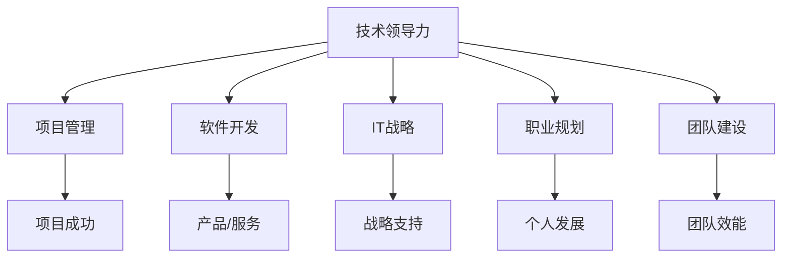

                 

# 从技术到管理：职业发展路径

> 关键词：技术领导力、项目管理、软件开发、IT战略、职业规划、团队建设

## 1. 背景介绍

### 1.1 问题由来
在快速发展的IT行业中，技术的不断更新迭代和应用的复杂化使得技术人才面临前所未有的挑战。不仅需要不断学习和掌握新技术，还需要适应项目管理、团队协作、战略规划等多重角色。如何从技术专家成功转型为管理者，成为许多技术人才职业生涯中的重要课题。本文旨在为技术人才提供一套全面的职业发展路径，帮助他们在技术和管理之间找到平衡，实现职业生涯的持续成长。

### 1.2 问题核心关键点
从技术到管理的转型需要掌握多种技能，包括但不限于技术领导力、项目管理、团队协作、战略规划等。这一过程中，关键是理解管理的本质，学习如何构建高效的团队，并在实际工作中不断提升领导能力。同时，技术人才也需要在跨部门协作中发挥作用，理解公司的战略目标，从而更好地服务于公司的整体发展。

### 1.3 问题研究意义
掌握从技术到管理的职业发展路径，对于技术人才的个人成长和公司的长期发展都具有重要意义：

- 个人成长：使技术人才能够从单一的技术角色扩展到多重管理角色，提升自身的综合素质和职业竞争力。
- 公司发展：通过技术人才的成长，提升团队的创新能力和执行力，更好地支持公司战略的实现。
- 产业升级：培养更多具备跨领域知识的技术领导者，推动技术在各行各业的深入应用。

## 2. 核心概念与联系

### 2.1 核心概念概述

为更好地理解从技术到管理转型的核心概念，本节将介绍几个关键概念：

- 技术领导力(Technical Leadership)：指技术团队中领导者的关键能力，包括技术深度、技术远见、团队激励等。
- 项目管理(Project Management)：指通过规划、组织、监控和控制项目进程，确保项目按时、按预算完成的技术。
- 软件开发(Software Development)：指从需求分析、设计、编码、测试到部署的软件开发全过程。
- IT战略(IT Strategy)：指利用信息技术支持公司战略目标的实现，包括IT资源的规划、IT服务的优化等。
- 职业规划(Career Planning)：指个人对职业生涯的长期规划和发展路径的设计。
- 团队建设(Team Building)：指通过各种活动和方法，增强团队成员之间的信任、协作和凝聚力。

这些概念之间的逻辑关系可以通过以下Mermaid流程图来展示：



这个流程图展示了一系列关键概念及其之间的关系：

1. 技术领导力作为核心，通过项目管理、软件开发、IT战略、职业规划、团队建设等具体实践，提升技术团队的整体效能。
2. 项目管理、软件开发、IT战略、团队建设等具体技能，在技术领导的指导下，支持和实现技术团队的目标。
3. 职业规划引导技术人才从技术到管理转型的路径，实现个人和公司的双赢。

## 3. 核心算法原理 & 具体操作步骤
### 3.1 算法原理概述

从技术到管理的转型，本质上是一个逐步提升综合素质和领导能力的过程。其核心思想是：通过不断学习和实践，逐步掌握技术深度、项目管理、团队协作等关键技能，同时培养战略思考和跨领域合作的能力。

形式化地，假设技术人才 $T_{\theta}$ 初始具备一定的技术能力和项目管理经验，但在其他方面存在不足。目标是通过一系列的技能培训和实践经验，使其能够逐步转型为一名合格的管理者。

设 $M_{\phi}$ 为转型过程中所需提升的综合技能集合，$P_{\sigma}$ 为所需的实践经验集合。则转型的优化目标是最小化技能差距和经验差距，即：

$$
\hat{\theta}=\mathop{\arg\min}_{\theta} \sum (|T_{\theta} - M_{\phi}| + |T_{\sigma} - P_{\sigma}|)
$$

其中，$|T_{\theta} - M_{\phi}|$ 表示技术人才当前技能与所需技能之间的差距，$|T_{\sigma} - P_{\sigma}|$ 表示当前实践经验与所需实践经验之间的差距。

### 3.2 算法步骤详解

从技术到管理的转型过程，一般包括以下几个关键步骤：

**Step 1: 自我评估与目标设定**
- 进行个人技能和能力评估，明确当前技术水平和项目管理能力。
- 设定明确的职业发展目标，包括短期目标和长期目标。

**Step 2: 技能提升**
- 参加相关的培训和认证，如PMP、Scrum Master、Agile教练等，提升项目管理能力。
- 通过读书、参加技术讲座、参与开源项目等方式，不断扩展技术深度和广度。
- 学习管理理论，如领导力、团队协作、沟通技巧等，提升软技能。

**Step 3: 实践经验积累**
- 承担项目负责人或技术导师的角色，实践项目管理技巧。
- 参与跨部门合作项目，了解公司整体业务和战略，提升战略思考能力。
- 担任技术领导角色，带领团队解决复杂问题，提升团队建设和管理能力。

**Step 4: 反馈与调整**
- 定期进行自我反思和总结，收集来自团队和领导的反馈，识别不足之处。
- 根据反馈调整个人发展计划，不断优化技能和实践经验。

**Step 5: 持续学习与创新**
- 跟踪技术发展趋势，持续学习和掌握新技术和新方法。
- 参与行业交流和研讨会，保持开放心态，敢于创新。

### 3.3 算法优缺点

从技术到管理的转型方法具有以下优点：
1. 系统全面：通过技能提升和实践经验积累相结合，系统地提升综合素质。
2. 灵活可操作：具体步骤清晰，每个阶段都有明确的任务和目标，易于实施。
3. 可量化的进展：通过技能和经验的差距评估，能够清晰地跟踪转型的进展和效果。

同时，该方法也存在一些局限性：
1. 需时间成本：从技术到管理转型需要一定的时间和精力投入。
2. 需要指导和反馈：转型过程中，需要有经验的导师或教练的指导和反馈。
3. 需跨领域知识：管理涉及跨领域的知识和技能，需要不断学习和积累。

尽管存在这些局限性，但就目前而言，这一系统化的转型方法仍是目前技术人才向管理层转型的主流范式。未来相关研究的重点在于如何进一步优化转型过程，提高转型的效率和成功率。

### 3.4 算法应用领域

从技术到管理的转型方法，广泛应用于各种技术团队和管理岗位的选拔和培养。具体应用领域包括：

- IT部门：培养技术领导和项目管理人才，提升团队整体效能。
- 产品开发：通过转型后的技术领导，推动产品开发和创新。
- 数据科学与工程：培养数据科学家和团队负责人，提升数据应用能力。
- 云计算与运维：通过转型后的技术领导，优化云计算和运维策略。

这些领域的技术人才，通过系统的职业发展规划，逐步掌握管理技能，实现从技术专家到管理领导的转变，成为公司创新的重要推动力量。

## 4. 数学模型和公式 & 详细讲解  
### 4.1 数学模型构建

本节将使用数学语言对从技术到管理的转型过程进行更加严格的刻画。

设技术人才 $T_{\theta}$ 当前的技能向量为 $\theta = [t_1, t_2, \dots, t_n]$，其中 $t_i$ 表示技术人才在技能 $s_i$ 上的水平。设所需提升的技能集合为 $M_{\phi} = [m_1, m_2, \dots, m_n]$，设所需积累的实践经验集合为 $P_{\sigma} = [p_1, p_2, \dots, p_n]$。

定义技能差距函数和经验差距函数为：

$$
D_{\theta\phi} = \sum |t_i - m_i|
$$

$$
D_{\sigma\theta} = \sum |p_i - t_i|
$$

则综合优化的目标函数为：

$$
\mathcal{L}(\theta, \phi, \sigma) = D_{\theta\phi} + D_{\sigma\theta}
$$

通过最小化该目标函数，调整技术人才的技能和经验，使其逐步达到转型目标。

### 4.2 公式推导过程

以二分类问题为例，推导技能提升的优化过程。

假设技术人才在技能 $s_1$ 上的水平为 $t_1 = 0.6$，所需提升的技能 $m_1 = 0.8$，所需积累的实践经验 $p_1 = 0.5$。技能差距和经验差距函数为：

$$
D_{\theta\phi} = |0.6 - 0.8| = 0.2
$$

$$
D_{\sigma\theta} = |0.5 - 0.6| = 0.1
$$

则优化目标函数为：

$$
\mathcal{L}(\theta) = 0.2 + 0.1 = 0.3
$$

通过优化，使技术人才的技能水平 $t_1$ 提升至 $0.8$，经验水平 $t_1$ 提升至 $0.5$，从而达到转型目标。

在实际应用中，可能需要根据具体情况调整目标函数和优化方法，如引入更多变量、调整权重等。但核心思想是通过最小化技能差距和经验差距，逐步提升技术人才的综合素质。

### 4.3 案例分析与讲解

以Google为例，探讨其如何将技术人才向管理层转型。

Google 在培养技术领导时，采用了多种手段和方法，包括：

1. **技术认证与培训**：通过内部认证和技术培训课程，提升技术人才的项目管理和领导能力。
2. **跨部门项目**：鼓励技术人才参与跨部门项目，了解公司整体业务和战略，培养战略思考能力。
3. **导师制度**：建立导师制度，通过经验丰富的管理者指导技术人才的转型过程。
4. **员工发展计划**：提供个性化的职业发展计划，明确短期和长期目标，帮助技术人才系统地提升综合素质。

通过这些措施，Google 成功地将众多技术专家转型为技术领导，提升了公司的整体创新能力和执行力。

## 5. 项目实践：代码实例和详细解释说明
### 5.1 开发环境搭建

在进行从技术到管理的转型实践前，我们需要准备好开发环境。以下是使用Python进行Python环境配置的流程：

1. 安装Python：从官网下载并安装最新版本的Python，建议安装最新版。
2. 安装Python相关库：安装必要的Python库，如numpy、pandas、matplotlib等。
3. 创建虚拟环境：创建虚拟环境以隔离项目依赖，避免与其他项目冲突。
4. 配置Git：设置Git仓库，用于版本控制和协作开发。

### 5.2 源代码详细实现

这里我们以团队管理为例，给出使用Python实现从技术到管理的转型过程的代码实现。

```python
import numpy as np
from scipy.optimize import minimize

# 定义技能差距和经验差距函数
def skill_gap(theta, phi, sigma):
    return np.sum(np.abs(theta - phi))

def experience_gap(theta, sigma):
    return np.sum(np.abs(theta - sigma))

# 定义优化目标函数
def objective(theta, phi, sigma):
    return skill_gap(theta, phi) + experience_gap(theta, sigma)

# 初始化技能和经验向量
theta = np.array([0.6, 0.5, 0.7, 0.4])  # 当前技能和经验水平
phi = np.array([0.8, 0.6, 0.9, 0.5])  # 所需提升的技能和经验
sigma = np.array([0.7, 0.6, 0.8, 0.3])  # 所需积累的实践经验

# 定义优化目标函数和约束条件
cons = ({'type': 'ineq', 'fun': lambda x: np.abs(x - phi)}, {'type': 'ineq', 'fun': lambda x: np.abs(x - sigma)})
bnd = (0, 1)  # 技能和经验范围在0到1之间

# 进行优化
result = minimize(objective, theta, method='SLSQP', constraints=cons, bounds=bnd)

# 输出结果
print('技能差距：', np.abs(result.x - phi))
print('经验差距：', np.abs(result.x - sigma))
print('优化结果：', result.x)
```

以上代码实现了从技术到管理转型的优化过程，通过最小化技能差距和经验差距，得到技术人才的技能和经验提升方案。

### 5.3 代码解读与分析

让我们再详细解读一下关键代码的实现细节：

**skill_gap函数**：
- 计算技能差距，即技术人才当前技能水平与所需提升的技能之间的绝对差值之和。

**experience_gap函数**：
- 计算经验差距，即当前实践经验与所需积累的实践经验之间的绝对差值之和。

**objective函数**：
- 定义综合优化的目标函数，通过最小化技能差距和经验差距，得到优化的目标值。

**minimize函数**：
- 使用scipy库中的优化函数，通过最小化目标函数，调整技术人才的技能和经验，使其逐步达到转型目标。

该代码通过数学优化方法，实现了从技术到管理的系统化转型过程，展示了技术人才如何通过不断学习和实践，逐步提升综合素质，实现从技术专家到管理领导的转变。

## 6. 实际应用场景
### 6.1 技术领导力

在企业中，技术领导力是技术人才向管理层转型的关键。技术领导不仅要具备深度的技术知识，还要具备远见、激励、沟通等软技能。通过系统的培训和实践，技术领导能够带领团队解决复杂问题，提升团队的整体效能。

### 6.2 项目管理

项目管理是技术领导必须掌握的重要技能。通过参与项目管理实践，技术人才能够理解项目管理的流程和工具，提升团队的协作和执行能力。项目管理能力的提升，也使技术人才能够更好地参与公司的战略规划和决策。

### 6.3 团队建设

团队建设是技术领导的重要职责之一。通过组织团队建设活动，增强团队成员之间的信任和协作，提升团队的凝聚力和战斗力。团队建设的成功，不仅能提升团队的整体效能，也能使技术领导在团队中获得更高的威望和信任。

### 6.4 未来应用展望

随着技术的不断发展，技术领导力在企业的角色将更加重要。未来的技术领导不仅需要具备深厚的技术背景，还要具备跨领域的知识，能够理解和支持公司的战略目标。此外，随着AI、大数据等技术的普及，技术领导还需要掌握相关的技术和工具，推动公司的数字化转型。

## 7. 工具和资源推荐
### 7.1 学习资源推荐

为了帮助技术人才掌握从技术到管理的转型技巧，这里推荐一些优质的学习资源：

1. 《技术领导力：从工程师到技术领导》系列书籍：深入探讨技术领导的领导力、管理技巧和实践经验。
2. 《项目管理之道：敏捷开发实践指南》：介绍敏捷项目管理的方法和工具，提升项目管理能力。
3. 《从技术到管理：技术人才的职业发展路径》课程：由知名管理专家授课，系统介绍技术人才的职业发展路径和转型技巧。
4. 《团队建设与文化：打造高绩效团队》：探讨团队建设的有效方法和策略，提升团队效能。
5. 《IT战略管理：从技术到商业》：介绍IT战略管理的核心概念和实践方法，提升技术领导的管理能力。

通过对这些资源的学习实践，相信技术人才一定能够系统地掌握从技术到管理的转型技巧，实现职业生涯的持续成长。

### 7.2 开发工具推荐

高效的开发离不开优秀的工具支持。以下是几款用于从技术到管理转型的常用工具：

1. GitHub：代码托管平台，支持团队协作和版本控制，方便技术人才分享和协作开发。
2. Jira：项目管理工具，支持敏捷开发、任务分配、进度跟踪等，提升项目管理的效率。
3. Slack：团队沟通工具，支持即时消息、文件共享、视频会议等，提升团队的协作效率。
4. Google Colab：在线Jupyter Notebook环境，免费提供GPU/TPU算力，方便技术人才进行实验和研究。
5. Trello：任务管理工具，支持看板式任务管理，提升团队的任务执行能力。

合理利用这些工具，可以显著提升从技术到管理的转型过程的开发效率，加快创新迭代的步伐。

### 7.3 相关论文推荐

从技术到管理的转型涉及多种理论和实践，以下是几篇奠基性的相关论文，推荐阅读：

1. "Technical Leadership: A Study of Emerging Leadership Roles in Software Engineering"：探讨技术领导的角色和职责，分析技术领导力在团队中的重要性。
2. "Project Management with Agile Methodologies: An Overview"：介绍敏捷项目管理的方法和工具，提升技术人才的项目管理能力。
3. "Team Development in Software Engineering: A Model and Process for Team Building"：探讨团队建设的有效方法和策略，提升团队效能。
4. "IT Strategy in Organizations: An Empirical Study of Alignment, Support, and Performance"：介绍IT战略管理的核心概念和实践方法，提升技术领导的管理能力。
5. "The Role of Technical Leaders in Agile Software Development"：探讨技术领导在敏捷开发中的角色和职责，分析技术领导的领导力和管理技巧。

这些论文代表了大规模技术领导力、项目管理、团队建设、IT战略等研究方向的发展脉络。通过学习这些前沿成果，可以帮助技术人才更好地掌握从技术到管理的转型技巧，实现职业生涯的持续成长。

## 8. 总结：未来发展趋势与挑战
### 8.1 总结

本文对从技术到管理的转型方法进行了全面系统的介绍。首先阐述了技术人才向管理层转型的背景和意义，明确了转型过程中需要掌握的关键技能和步骤。其次，从原理到实践，详细讲解了转型的数学模型和具体操作步骤，给出了转型的代码实例和详细解释说明。同时，本文还探讨了转型方法在技术领导力、项目管理、团队建设等多个场景中的应用，展示了转型的广泛适用性和巨大潜力。此外，本文精选了转型的各类学习资源，力求为技术人才提供全方位的转型指导。

通过本文的系统梳理，可以看到，从技术到管理的转型方法能够帮助技术人才系统地提升综合素质和领导能力，实现职业生涯的持续成长。未来，伴随技术的不断进步和应用的深入，技术人才在管理领域的角色将更加重要，将成为推动公司创新和发展的关键力量。

### 8.2 未来发展趋势

展望未来，从技术到管理的转型方法将呈现以下几个发展趋势：

1. 技术深度与广度并重：未来技术人才需要不仅具备深度技术知识，还要具备广泛的跨领域知识，能够理解和支持公司的战略目标。
2. 敏捷管理与传统管理结合：传统的项目管理方法和敏捷开发方法将进一步融合，形成更加灵活和高效的项目管理模式。
3. 数据驱动的决策：技术领导将更加重视数据分析和业务理解，通过数据驱动的决策提升团队的执行力和效能。
4. 跨领域协作：技术人才需要具备跨领域协作的能力，能够与非技术团队有效沟通和合作，推动公司整体的发展。
5. 持续学习与创新：技术领导需要不断学习新技术和新方法，保持开放心态，敢于创新，引领公司技术发展的方向。

这些趋势凸显了从技术到管理转型的广泛前景。这些方向的探索发展，必将进一步提升技术人才的综合素质和领导能力，为公司的发展提供持续动力。

### 8.3 面临的挑战

尽管从技术到管理的转型方法已经取得了显著成效，但在迈向更加智能化、普适化应用的过程中，仍面临诸多挑战：

1. 时间和精力的投入：从技术到管理转型需要一定的时间和精力，技术人才需要在繁重的工作之余，投入大量时间进行学习和实践。
2. 需要指导和反馈：转型过程中，需要有经验的导师或教练的指导和反馈，帮助技术人才识别和克服转型中的困难。
3. 跨领域知识的积累：管理涉及跨领域的知识和技能，技术人才需要不断学习和积累，逐步适应管理的角色。
4. 团队协作的复杂性：技术领导需要具备较强的团队协作能力，能够协调不同团队之间的合作，提升整体效率。
5. 创新与执行的平衡：技术领导需要在创新和执行之间找到平衡，既要推动技术的创新，又要确保项目的顺利执行。

正视转型的这些挑战，积极应对并寻求突破，将是从技术到管理转型成功的关键。相信随着学界和产业界的共同努力，这些挑战终将一一被克服，技术人才将能够在管理领域取得更大的成功。

### 8.4 研究展望

面对从技术到管理的转型所面临的种种挑战，未来的研究需要在以下几个方面寻求新的突破：

1. 优化转型过程：开发更加高效、灵活的转型模型，帮助技术人才快速提升综合素质。
2. 引入多学科知识：将心理学、社会学、管理学等多学科知识引入转型过程，提升技术领导的跨领域能力。
3. 数据驱动的转型方法：引入数据分析和机器学习技术，通过数据驱动的方式优化转型的效果。
4. 建立反馈机制：建立科学的反馈机制，帮助技术人才不断优化转型过程，提升转型的成功率。
5. 培养跨领域领导力：通过培养跨领域领导力，提升技术人才在管理领域的适应性和创新能力。

这些研究方向将推动从技术到管理转型技术的不断进步，帮助技术人才更好地适应管理角色，提升公司的整体效能和竞争力。

## 9. 附录：常见问题与解答

**Q1：如何评估技术人才的转型进展？**

A: 评估技术人才的转型进展，可以通过以下方式进行：
1. 定期自我评估：技术人才可以定期进行自我评估，总结当前技能和经验水平，与目标进行对比。
2. 绩效考核：公司可以通过绩效考核的方式，评估技术人才在项目管理和领导能力方面的表现。
3. 360度反馈：通过来自团队成员、领导和客户的360度反馈，全面了解技术人才的转型进展和效果。

**Q2：转型过程中如何处理时间与工作之间的冲突？**

A: 处理时间与工作之间的冲突，可以采取以下策略：
1. 时间管理：通过时间管理工具，合理分配工作和学习时间，确保两者都能得到足够的关注。
2. 优先级排序：根据任务的紧急程度和重要程度，优先处理最重要的任务，确保关键任务完成。
3. 任务分解：将大型任务分解为小的可管理部分，逐步推进，避免积压。
4. 寻求支持：寻求上级和同事的支持，分担部分工作负担，确保转型过程顺利进行。

**Q3：如何选择适合技术人才的项目进行转型实践？**

A: 选择适合技术人才的项目进行转型实践，可以遵循以下原则：
1. 与业务紧密相关：选择与公司业务紧密相关的项目，确保转型实践具有实际意义。
2. 挑战与机遇并存：选择具有挑战性的项目，能够激发技术人才的学习动力和创造力。
3. 资源支持：确保项目有足够的资源支持，包括人力、物力和财力，避免因资源不足影响转型效果。
4. 持续学习：选择能够持续学习新技术和新方法的项目，提升技术人才的综合素质。

**Q4：如何培养技术领导的跨领域协作能力？**

A: 培养技术领导的跨领域协作能力，可以采取以下措施：
1. 参加跨部门项目：参与跨部门项目，了解不同部门的工作流程和业务需求。
2. 学习相关知识：通过读书、培训等方式，学习相关领域的知识和技能，提升跨领域理解能力。
3. 建立协作网络：建立跨部门的协作网络，与不同领域的同事建立良好的沟通和合作关系。
4. 进行团队建设：组织团队建设活动，增强团队成员之间的信任和协作，提升团队的凝聚力。

**Q5：如何推动技术领导的创新能力？**

A: 推动技术领导的创新能力，可以采取以下策略：
1. 鼓励自由探索：给予技术领导自由探索的空间，鼓励尝试新的技术和方法。
2. 提供创新资源：提供必要的创新资源，如技术支持、资金支持等，帮助技术领导实现创新想法。
3. 建立创新文化：建立鼓励创新的企业文化，提升技术领导的创新意识和创新能力。
4. 进行创新培训：通过培训和讲座等方式，提升技术领导的创新思维和创新技能。

这些策略能够帮助技术领导不断提升创新能力，推动公司技术发展的进程。

---

作者：禅与计算机程序设计艺术 / Zen and the Art of Computer Programming

