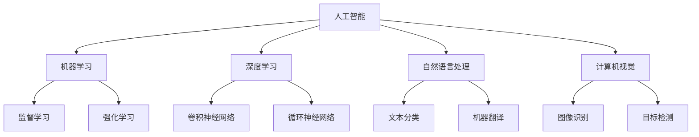
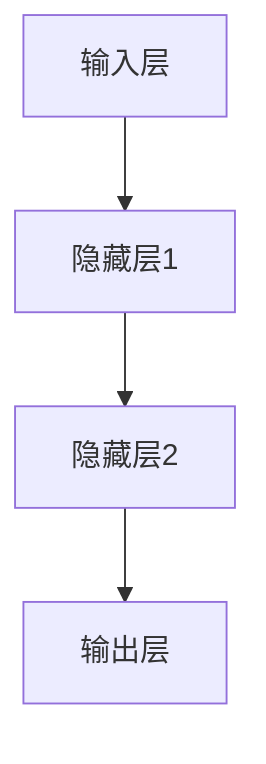

                 

## 1. 背景介绍

人工智能（AI）的历程如同长河奔涌，从1956年达特茅斯会议首次提出“人工智能”这一术语至今，已历经数十年的发展。达特茅斯会议标志着AI的诞生，而随着时间的推移，AI的概念不断扩展，涵盖机器学习、深度学习、自然语言处理（NLP）、计算机视觉等多个子领域。

### 1.1 达特茅斯会议与人工智能的诞生

1956年，达特茅斯会议在佛蒙特州达特茅斯学院举行，由约翰·麦卡锡、马文·明斯基、克劳德·香农等人发起。这次会议标志着人工智能概念的正式诞生，并奠定了AI作为计算机科学重要分支的地位。会议发表了多篇重要的AI论文，确立了AI发展的若干核心议题。

### 1.2 早期AI的发展：专家系统和知识工程

早期AI的发展以专家系统和知识工程为主。专家系统是一种基于规则和专家知识的推理系统，用于解决特定领域的问题。知识工程则是指将人类专业知识转换为计算机可处理的知识表示，用于构建专家系统。

知识工程代表作品如DENDRAL、MYCIN等，用于药物分子结构预测、医学诊断等领域，展示了AI在规则驱动的领域内的巨大潜力。然而，这些早期AI系统受限于规则表示的复杂性和数据获取的困难，适用范围有限。

### 1.3 符号AI的兴起与挑战

在20世纪70年代，符号AI迎来了快速发展期，DARPA启动了多个AI项目，如SHOP、EXPERT系统等，用于军事和工业领域。然而，符号AI的符号处理方式（如符号逻辑、语义网络等）受到计算资源限制，难以处理大规模数据。此外，符号AI缺乏自适应能力，难以应对未知和复杂的现实问题。

## 2. 核心概念与联系

### 2.1 核心概念概述

为更好地理解AI的发展脉络，本节将介绍几个核心概念：

- **人工智能（AI）**：研究、开发使计算机系统能够模拟人类智能的技术，涵盖感知、认知、推理、学习等多个方面。
- **机器学习（ML）**：使计算机通过学习数据和经验，自行提升性能和适应性，无需显式编程。
- **深度学习（DL）**：机器学习的一个分支，使用多层次神经网络模型，通过反向传播算法进行训练，实现特征学习。
- **自然语言处理（NLP）**：使计算机能够理解、处理、生成自然语言，包括文本分类、机器翻译、对话系统等任务。
- **计算机视觉（CV）**：使计算机能够理解、处理和分析图像和视频数据，涵盖图像识别、目标检测、图像生成等任务。

这些概念之间的逻辑关系可以通过以下Mermaid流程图来展示：



这个流程图展示人工智能的各个子领域及其相互关系：

1. 人工智能通过机器学习和深度学习提升自身能力。
2. 深度学习使用神经网络模型进行特征学习。
3. 自然语言处理和计算机视觉是人工智能在语言和视觉领域的重要应用。

### 2.2 核心概念原理和架构的 Mermaid 流程图

以下是一个简单的神经网络模型的结构图，展示了深度学习的基本架构：



此流程图展示了标准的神经网络结构：输入层、若干隐藏层和输出层。

## 3. 核心算法原理 & 具体操作步骤

### 3.1 算法原理概述

深度学习（DL）是一种特殊的机器学习方法，使用多层次的神经网络模型，通过反向传播算法进行训练。深度学习模型通过逐层抽取特征，最终实现对复杂数据的表示和分类。

### 3.2 算法步骤详解

深度学习算法通常包括以下步骤：

**Step 1: 准备数据集**
- 收集并预处理数据，包括数据清洗、数据增强等。
- 将数据划分为训练集、验证集和测试集。

**Step 2: 设计网络结构**
- 选择合适的神经网络模型，如卷积神经网络（CNN）、循环神经网络（RNN）、长短时记忆网络（LSTM）等。
- 确定网络层的数量、每层的神经元数量、激活函数等。

**Step 3: 初始化模型参数**
- 使用随机初始化方法，如Xavier初始化、He初始化等，初始化模型的权重和偏置。

**Step 4: 前向传播**
- 输入数据，通过网络层进行前向传播，计算输出结果。

**Step 5: 计算损失函数**
- 将输出结果与真实标签进行比较，计算损失函数，如均方误差、交叉熵等。

**Step 6: 反向传播**
- 根据损失函数对模型参数进行反向传播，计算梯度。

**Step 7: 更新模型参数**
- 使用梯度下降等优化算法，更新模型参数，最小化损失函数。

**Step 8: 验证和测试**
- 在验证集和测试集上评估模型性能，对比微调前后的效果。

### 3.3 算法优缺点

深度学习的优点：

- 高精度：深度学习模型通常能够在复杂数据上取得高精度。
- 自动特征学习：深度学习能够自动学习数据的特征表示，无需显式编程。
- 应用广泛：深度学习在图像识别、语音识别、自然语言处理等多个领域取得了突破性进展。

深度学习的缺点：

- 计算资源需求高：深度学习模型通常需要大规模计算资源进行训练和推理。
- 可解释性差：深度学习模型的内部机制复杂，难以解释其决策过程。
- 数据依赖性强：深度学习模型需要大量高质量标注数据进行训练，数据获取难度大。

### 3.4 算法应用领域

深度学习在各个领域的应用非常广泛，以下是几个典型应用场景：

**计算机视觉**
- 图像分类：识别图像中的物体类别。
- 目标检测：在图像中定位特定物体的位置。
- 图像分割：将图像分割成不同的区域。

**自然语言处理**
- 文本分类：将文本分类到不同的类别中。
- 机器翻译：将一种语言翻译成另一种语言。
- 对话系统：使机器能够理解并回复自然语言对话。

**语音识别**
- 语音转文本：将语音转换成文本。
- 语音合成：将文本转换成语音。

**推荐系统**
- 用户行为预测：预测用户对商品或内容的偏好。
- 商品推荐：根据用户偏好推荐商品或内容。

## 4. 数学模型和公式 & 详细讲解 & 举例说明

### 4.1 数学模型构建

假设一个简单的全连接神经网络模型，包含一个输入层、两个隐藏层和一个输出层，激活函数使用ReLU，损失函数为均方误差。

**输入层**：$x=[x_1,x_2,\dots,x_n]$

**隐藏层1**：$h_1=[h_{11},h_{12},\dots,h_{1n}]$

**隐藏层2**：$h_2=[h_{21},h_{22},\dots,h_{2n}]$

**输出层**：$y=[y_1,y_2,\dots,y_m]$

**权重矩阵**：$W=[w_{11},w_{12},\dots,w_{m1}]$

**偏置向量**：$b=[b_1,b_2,\dots,b_m]$

**激活函数**：$g(x)=max(0,x)$

**均方误差损失函数**：$L=\frac{1}{2}\sum_{i=1}^m(y_i-p_i)^2$

其中，$w_{ik}$ 为输入 $x_k$ 与隐藏层 $h_i$ 之间的权重，$b_i$ 为隐藏层 $h_i$ 的偏置，$p_i$ 为输出层 $y_i$ 的预测值，$y_i$ 为真实标签。

### 4.2 公式推导过程

**前向传播**：
- 输入层到隐藏层1：$h_1=W_1x+b_1$
- 隐藏层1到隐藏层2：$h_2=W_2h_1+b_2$
- 隐藏层2到输出层：$y=W_3h_2+b_3$

**反向传播**：
- 输出层到隐藏层2：$\nabla_{W_3}L=\frac{\partial L}{\partial y}$
- 隐藏层2到隐藏层1：$\nabla_{W_2}L=\frac{\partial L}{\partial h_2}$
- 隐藏层1到输入层：$\nabla_{W_1}L=\frac{\partial L}{\partial h_1}$

**更新模型参数**：
- 更新权重和偏置：$W_1=W_1-\eta\nabla_{W_1}L$
- $W_2=W_2-\eta\nabla_{W_2}L$
- $W_3=W_3-\eta\nabla_{W_3}L$
- $b_1=b_1-\eta\nabla_{b_1}L$
- $b_2=b_2-\eta\nabla_{b_2}L$
- $b_3=b_3-\eta\nabla_{b_3}L$

其中，$\eta$ 为学习率，$\nabla_{\theta}L$ 为损失函数对模型参数 $\theta$ 的梯度，通过反向传播算法计算得到。

### 4.3 案例分析与讲解

以手写数字识别为例，展示深度学习模型在计算机视觉领域的应用。手写数字识别是经典的模式识别问题，数据集为MNIST。

**数据准备**：
- 收集MNIST数据集，包含60000张28x28的手写数字图片和10个类别标签。
- 将数据集划分为训练集和测试集，比例为7:3。

**模型设计**：
- 使用LeNet-5模型，包含两个卷积层、两个池化层和三个全连接层。
- 激活函数为ReLU，输出层为softmax，用于分类10个数字类别。

**模型训练**：
- 使用随机梯度下降算法，学习率为0.01。
- 迭代1000次，每次随机从训练集中选取200张图片。
- 每100次迭代在验证集上评估一次性能。

**模型评估**：
- 在测试集上评估模型准确率，输出结果。
- 对比微调前后的准确率，展示深度学习模型的强大能力。

## 5. 项目实践：代码实例和详细解释说明

### 5.1 开发环境搭建

在进行深度学习项目实践前，需要先准备好开发环境。以下是使用Python进行PyTorch开发的环境配置流程：

1. 安装Anaconda：从官网下载并安装Anaconda，用于创建独立的Python环境。

2. 创建并激活虚拟环境：
```bash
conda create -n pytorch-env python=3.8 
conda activate pytorch-env
```

3. 安装PyTorch：根据CUDA版本，从官网获取对应的安装命令。例如：
```bash
conda install pytorch torchvision torchaudio cudatoolkit=11.1 -c pytorch -c conda-forge
```

4. 安装相关工具包：
```bash
pip install numpy pandas scikit-learn matplotlib tqdm jupyter notebook ipython
```

完成上述步骤后，即可在`pytorch-env`环境中开始深度学习项目的开发。

### 5.2 源代码详细实现

下面以手写数字识别为例，给出使用PyTorch进行深度学习项目开发的完整代码实现。

首先，定义模型和优化器：

```python
import torch
import torch.nn as nn
import torch.optim as optim
from torchvision import datasets, transforms

# 定义LeNet-5模型
class LeNet(nn.Module):
    def __init__(self):
        super(LeNet, self).__init__()
        self.conv1 = nn.Conv2d(1, 6, kernel_size=5)
        self.conv2 = nn.Conv2d(6, 16, kernel_size=5)
        self.fc1 = nn.Linear(16 * 5 * 5, 120)
        self.fc2 = nn.Linear(120, 84)
        self.fc3 = nn.Linear(84, 10)
        
    def forward(self, x):
        x = nn.functional.relu(nn.functional.max_pool2d(self.conv1(x), kernel_size=2, stride=2))
        x = nn.functional.relu(nn.functional.max_pool2d(self.conv2(x), kernel_size=2, stride=2))
        x = x.view(-1, 16 * 5 * 5)
        x = nn.functional.relu(self.fc1(x))
        x = nn.functional.relu(self.fc2(x))
        x = self.fc3(x)
        return x

# 加载数据集
train_dataset = datasets.MNIST(root='./data', train=True, download=True, transform=transforms.ToTensor())
test_dataset = datasets.MNIST(root='./data', train=False, download=True, transform=transforms.ToTensor())

# 定义数据加载器
train_loader = torch.utils.data.DataLoader(dataset=train_dataset, batch_size=100, shuffle=True)
test_loader = torch.utils.data.DataLoader(dataset=test_dataset, batch_size=100, shuffle=False)

# 定义优化器和损失函数
model = LeNet()
criterion = nn.CrossEntropyLoss()
optimizer = optim.SGD(model.parameters(), lr=0.01)

# 定义训练和评估函数
def train_epoch(model, loader, optimizer, criterion):
    model.train()
    for batch_idx, (data, target) in enumerate(loader):
        optimizer.zero_grad()
        output = model(data)
        loss = criterion(output, target)
        loss.backward()
        optimizer.step()
        if batch_idx % 100 == 0:
            print('Train Epoch: {} [{}/{} ({:.0f}%)]\tLoss: {:.6f}'.format(
                epoch, batch_idx * len(data), len(loader.dataset),
                100. * batch_idx / len(loader), loss.item()))

def evaluate(model, loader, criterion):
    model.eval()
    total_loss = 0.0
    with torch.no_grad():
        for data, target in loader:
            output = model(data)
            total_loss += criterion(output, target).item()
    test_loss = total_loss / len(loader.dataset)
    print('\nTest set: Average loss: {:.4f}, Accuracy: {:.2f}%'.format(
        test_loss, 100. - test_loss.item() * 100. / criterion(model(data), target).item()))

# 训练模型
for epoch in range(10):
    train_epoch(model, train_loader, optimizer, criterion)
    evaluate(model, test_loader, criterion)
```

代码中，我们定义了一个简单的LeNet-5模型，用于手写数字识别任务。通过PyTorch的高级API，模型定义、数据加载、优化器、损失函数等设置均较为便捷。

### 5.3 代码解读与分析

以下是代码中关键部分的详细解读：

**模型定义**：
- 定义了一个LeNet-5模型，包含两个卷积层、两个池化层和三个全连接层。
- 使用ReLU激活函数，输出层使用softmax函数。

**数据加载**：
- 使用PyTorch的Dataset和DataLoader，方便数据集的加载和批处理。
- 定义了训练集和测试集的路径和加载方式。

**优化器和损失函数**：
- 使用随机梯度下降（SGD）作为优化器，学习率为0.01。
- 定义了交叉熵损失函数，用于计算输出与真实标签之间的差异。

**训练和评估函数**：
- 定义了训练函数train_epoch，计算模型在训练集上的损失。
- 定义了评估函数evaluate，计算模型在测试集上的损失和准确率。

**训练模型**：
- 循环训练10个epoch，每次在训练集上进行一次前向传播和反向传播。
- 在每个epoch后，在测试集上评估一次模型性能。

## 6. 实际应用场景

### 6.1 计算机视觉

计算机视觉（CV）是深度学习的一个重要应用领域，涵盖了图像识别、目标检测、图像分割等多个任务。

**图像分类**：
- 使用卷积神经网络（CNN）模型，如LeNet、AlexNet、VGGNet等，对图像进行分类。
- 常见的图像分类任务包括猫狗识别、交通标志识别、行人检测等。

**目标检测**：
- 使用R-CNN、YOLO、SSD等模型，对图像中的目标进行定位和分类。
- 常见的目标检测任务包括人脸检测、物体检测、行为识别等。

**图像分割**：
- 使用U-Net、Mask R-CNN等模型，将图像分割成不同的区域。
- 常见的图像分割任务包括医学影像分割、自然图像分割等。

### 6.2 自然语言处理

自然语言处理（NLP）是深度学习在文本处理领域的广泛应用，涵盖了文本分类、机器翻译、对话系统等多个任务。

**文本分类**：
- 使用卷积神经网络（CNN）、循环神经网络（RNN）等模型，对文本进行分类。
- 常见的文本分类任务包括情感分析、新闻分类、垃圾邮件过滤等。

**机器翻译**：
- 使用序列到序列（Seq2Seq）模型，如编码器-解码器结构，将一种语言翻译成另一种语言。
- 常见的机器翻译任务包括英中翻译、中英翻译等。

**对话系统**：
- 使用序列到序列（Seq2Seq）模型，如Transformer模型，进行对话生成。
- 常见的对话任务包括客服对话、智能助手等。

## 7. 工具和资源推荐

### 7.1 学习资源推荐

为帮助开发者系统掌握深度学习的基础知识和应用实践，以下是一些优质的学习资源：

1. 《深度学习》（周志华）：系统介绍了深度学习的基本概念、算法和应用。
2. 《Deep Learning with Python》（Francois Chollet）：详细介绍了使用Keras进行深度学习开发的方法。
3. 《Pattern Recognition and Machine Learning》（Christopher M. Bishop）：介绍了机器学习和深度学习的基本理论。
4. 《Neural Networks and Deep Learning》（Michael Nielsen）：详细介绍了神经网络的基本原理和应用。
5. 《Hands-On Machine Learning with Scikit-Learn and TensorFlow》（Aurélien Géron）：详细介绍了使用Scikit-Learn和TensorFlow进行机器学习开发的方法。

通过这些资源的学习实践，相信你一定能够快速掌握深度学习的基础知识和应用技能。

### 7.2 开发工具推荐

高效的开发离不开优秀的工具支持。以下是几款用于深度学习开发的常用工具：

1. PyTorch：基于Python的开源深度学习框架，灵活动态的计算图，适合快速迭代研究。
2. TensorFlow：由Google主导开发的开源深度学习框架，生产部署方便，适合大规模工程应用。
3. Keras：高层神经网络API，适合快速原型开发和模型实验。
4. JAX：基于JIT编译的深度学习框架，支持高效的分布式训练和自动微分。
5. MXNet：由Apache维护的深度学习框架，支持多种编程语言和多种硬件。

合理利用这些工具，可以显著提升深度学习开发的效率，加快创新迭代的步伐。

### 7.3 相关论文推荐

深度学习的发展源于学界的持续研究。以下是几篇奠基性的相关论文，推荐阅读：

1. Convolutional Neural Networks for Images, Videos, and Recommendations（AlexNet论文）：展示了卷积神经网络在图像处理和推荐系统中的应用。
2. ImageNet Classification with Deep Convolutional Neural Networks（AlexNet论文）：展示了深度卷积神经网络在图像分类任务上的优越性。
3. Deep Residual Learning for Image Recognition（ResNet论文）：提出了深度残差网络，解决了深度网络训练过程中的梯度消失问题。
4. Attention Is All You Need（Transformer原论文）：提出了Transformer结构，开启了预训练大模型时代。
5. Universal Language Model Fine-tuning for Sequence Generation（GPT-2论文）：展示了大语言模型在自然语言生成任务上的强大能力。

这些论文代表了大深度学习的发展脉络。通过学习这些前沿成果，可以帮助研究者把握学科前进方向，激发更多的创新灵感。

## 8. 总结：未来发展趋势与挑战

### 8.1 研究成果总结

深度学习作为人工智能的重要分支，在计算机视觉、自然语言处理等领域取得了显著进展。随着技术的不断进步，深度学习的应用范围将进一步扩展，推动人工智能技术向更广阔的领域深入发展。

### 8.2 未来发展趋势

展望未来，深度学习的发展趋势将更加多样化：

1. 深度学习模型将更加复杂和高效。超大规模的深度学习模型和分布式训练技术将进一步提升模型的性能和计算效率。
2. 深度学习的应用领域将更加广泛。深度学习将在自动驾驶、智能医疗、智能家居等更多领域发挥重要作用。
3. 深度学习的理论基础将更加扎实。深度学习的理论分析和优化方法将不断完善，提升模型的可解释性和稳定性。
4. 深度学习与自然语言处理将深度融合。深度学习将进一步融入NLP领域，提升文本处理、对话系统等任务的性能。
5. 深度学习与计算机视觉将深度融合。深度学习将进一步融入CV领域，提升图像识别、目标检测等任务的性能。

### 8.3 面临的挑战

尽管深度学习在多个领域取得了显著进展，但未来的发展仍面临诸多挑战：

1. 数据获取和标注成本高。深度学习模型需要大量高质量标注数据进行训练，获取和标注成本高昂。
2. 模型复杂度高。深度学习模型通常包含数百万甚至数十亿个参数，难以解释其内部机制和决策过程。
3. 计算资源需求大。深度学习模型的训练和推理需要大规模计算资源，硬件成本高昂。
4. 可解释性差。深度学习模型的决策过程难以解释，难以满足医疗、金融等高风险领域的需求。
5. 模型泛化能力不足。深度学习模型容易过拟合，泛化性能不足。

### 8.4 研究展望

为了应对这些挑战，未来的研究需要在以下几个方面寻求新的突破：

1. 探索无监督和半监督学习方法。利用自监督学习、主动学习等方法，减少对标注数据的依赖。
2. 开发更加高效的模型和算法。提升模型的计算效率和可解释性，降低硬件成本。
3. 结合其他人工智能技术。将深度学习与其他AI技术（如知识图谱、自然逻辑推理等）结合，提升模型的性能和鲁棒性。
4. 加强模型鲁棒性和可解释性研究。通过改进模型结构和优化算法，提高模型的鲁棒性和可解释性。

这些研究方向将引领深度学习向更加智能化、普适化应用迈进，为人工智能技术的发展提供新的动力。

## 9. 附录：常见问题与解答

**Q1：深度学习模型的训练时间通常很长，如何加快训练速度？**

A: 加快深度学习模型训练速度的方法包括：

- 使用GPU/TPU等高性能设备。
- 采用数据增强、模型裁剪等技术，减少数据和模型规模。
- 使用梯度累积、混合精度训练等技术，提高训练效率。
- 利用分布式训练，将计算任务分配到多个设备上进行并行计算。

**Q2：深度学习模型容易出现过拟合，如何解决这一问题？**

A: 解决深度学习模型过拟合的方法包括：

- 数据增强：通过扩充训练集，减少过拟合。
- 正则化：使用L1/L2正则化、Dropout等方法，减少模型复杂度。
- 早停机制：在验证集上监测模型性能，当性能不再提升时停止训练。
- 迁移学习：利用预训练模型进行微调，减少过拟合风险。

**Q3：深度学习模型难以解释，如何解决这一问题？**

A: 解决深度学习模型可解释性问题的方法包括：

- 使用可视化工具，如Grad-CAM、SHAP等，分析模型的内部机制。
- 设计可解释性较强的模型，如规则驱动的决策树、线性回归等。
- 结合其他AI技术，如因果分析、博弈论等，提高模型的可解释性。

**Q4：深度学习模型在医疗、金融等领域的应用需要考虑伦理和安全性，如何解决这一问题？**

A: 解决深度学习模型伦理和安全性问题的方法包括：

- 数据预处理：过滤敏感数据，减少模型偏见。
- 模型设计：设计可解释性较强的模型，提高模型的可信度。
- 人工监督：在关键领域进行人工干预和审核，确保模型安全性。
- 模型测试：在测试集上进行严格测试，确保模型的鲁棒性和可靠性。

这些方法将有助于深度学习模型在医疗、金融等领域的安全应用。

---

作者：禅与计算机程序设计艺术 / Zen and the Art of Computer Programming

