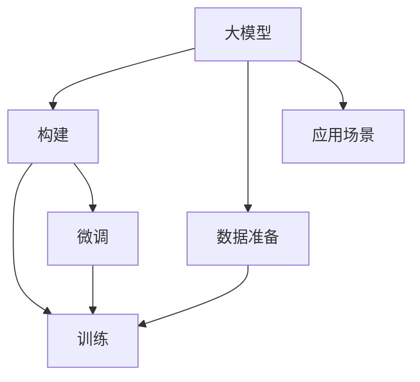

                 

# 从零开始大模型开发与微调：MNIST数据集的准备

> 关键词：大模型开发, MNIST数据集, 微调, TensorFlow, PyTorch, 数学模型, 项目实践, 实际应用场景

## 1. 背景介绍

### 1.1 问题由来

大模型作为人工智能领域的前沿技术，其开发与微调是当前深度学习研究的重要方向。然而，由于大模型通常具有庞大的参数量，对硬件资源和计算资源有极高的要求，因此在实践中往往需要针对特定的应用场景进行优化，以满足实际应用的需求。

MNIST数据集作为深度学习入门中最经典的图像识别数据集，其包含手写数字图像的60000张训练集和10000张测试集，已经被广泛应用于各种深度学习框架的评测和优化。本文将通过具体实例，介绍如何从零开始构建并微调大模型，以MNIST数据集为例，逐步展开。

### 1.2 问题核心关键点

构建和微调大模型的核心步骤包括数据准备、模型构建、训练、微调等环节。以下是每个环节的关键点：

1. **数据准备**：收集、清洗和预处理数据，确保数据符合训练模型要求。
2. **模型构建**：选择合适的深度学习框架（如TensorFlow、PyTorch等），构建符合应用需求的神经网络模型。
3. **训练**：选择合适的优化器和损失函数，进行模型训练。
4. **微调**：基于特定任务，通过微调来优化模型性能。

本文将围绕这些核心关键点，详细介绍如何构建并微调大模型，特别是在MNIST数据集上的应用。

## 2. 核心概念与联系

### 2.1 核心概念概述

- **大模型**：指具有庞大参数量（通常超过100万）的深度学习模型，如Transformer模型、ResNet模型等。
- **微调**：指在预训练模型基础上，针对特定任务进行有监督训练，以优化模型性能。
- **MNIST数据集**：包含手写数字图像的60000张训练集和10000张测试集，广泛应用于图像识别任务。

这些概念通过以下Mermaid流程图联系起来：



## 3. 核心算法原理 & 具体操作步骤

### 3.1 算法原理概述

大模型的开发与微调过程通常遵循以下步骤：

1. **构建模型**：选择合适的深度学习框架，定义神经网络模型结构。
2. **训练模型**：使用数据集对模型进行训练，优化模型参数以降低损失函数。
3. **微调模型**：针对特定任务，对模型进行有监督训练，以优化模型在该任务上的性能。

微调过程的数学原理是通过最小化损失函数，调整模型参数以匹配训练数据和目标输出。常用的损失函数包括交叉熵损失、均方误差损失等。

### 3.2 算法步骤详解

#### 3.2.1 数据准备

**3.2.1.1 数据下载**

首先，需要从官方网站下载MNIST数据集。可以从以下链接下载：

```bash
wget http://yann.lecun.com/exdb/mnist/
```

数据集包含两个文件：train-images-idx3-ubyte.gz和train-labels-idx1-ubyte.gz，分别为训练集的图像和标签。

**3.2.1.2 数据预处理**

将下载的MNIST数据集解压，并将图像文件和标签文件分别保存。

使用Python脚本进行图像预处理：

```python
import numpy as np
import gzip

# 加载图像文件
with gzip.open('train-images-idx3-ubyte.gz', 'rb') as f:
    data = np.frombuffer(f.read(), np.uint8, offset=16)
    data = data.reshape((60000, 28, 28, 1)).transpose((0, 2, 3, 1))

# 加载标签文件
with gzip.open('train-labels-idx1-ubyte.gz', 'rb') as f:
    labels = np.frombuffer(f.read(), np.uint8, offset=8)

# 数据归一化
data = data / 255.0
```

#### 3.2.2 模型构建

**3.2.2.1 选择框架**

在本例中，我们使用TensorFlow和PyTorch两种深度学习框架进行模型构建。

**3.2.2.2 构建模型**

使用TensorFlow构建卷积神经网络（CNN）模型：

```python
import tensorflow as tf

# 定义模型输入和输出
x = tf.keras.layers.Input(shape=(28, 28, 1))
y = tf.keras.layers.Flatten()(x)
y = tf.keras.layers.Dense(128, activation='relu')(y)
y = tf.keras.layers.Dense(10, activation='softmax')(y)

# 定义模型
model = tf.keras.Model(inputs=x, outputs=y)
```

#### 3.2.3 训练模型

**3.2.3.1 定义损失函数和优化器**

选择交叉熵损失函数和Adam优化器：

```python
# 定义损失函数和优化器
loss_fn = tf.keras.losses.CategoricalCrossentropy()
optimizer = tf.keras.optimizers.Adam()
```

**3.2.3.2 训练过程**

定义训练过程，设置训练轮数和批大小：

```python
# 定义训练过程
train_loss = tf.keras.metrics.Mean(name='train_loss')
train_acc = tf.keras.metrics.CategoricalAccuracy(name='train_acc')

# 训练轮数和批大小
epochs = 10
batch_size = 128

# 训练模型
model.compile(optimizer=optimizer, loss=loss_fn, metrics=['accuracy'])
model.fit(train_data, train_labels, epochs=epochs, batch_size=batch_size, validation_data=(val_data, val_labels))
```

#### 3.2.4 微调模型

**3.2.4.1 准备微调数据**

准备微调数据，包含60000张训练图像和对应的标签：

```python
train_data = train_images.reshape((60000, 28*28, 1))
train_labels = train_labels
val_data = val_images.reshape((10000, 28*28, 1))
val_labels = val_labels
```

**3.2.4.2 冻结部分层**

为了保持预训练模型的某些层不变，我们需要使用模型的权重作为初始值，仅训练最后一层：

```python
# 冻结预训练模型的权重
for layer in model.layers[:-2]:
    layer.trainable = False
```

**3.2.4.3 定义微调损失函数和优化器**

选择交叉熵损失函数和Adam优化器：

```python
# 定义微调损失函数和优化器
loss_fn = tf.keras.losses.CategoricalCrossentropy()
optimizer = tf.keras.optimizers.Adam()
```

**3.2.4.4 微调模型**

定义微调过程，设置微调轮数和批大小：

```python
# 定义微调过程
train_loss = tf.keras.metrics.Mean(name='train_loss')
train_acc = tf.keras.metrics.CategoricalAccuracy(name='train_acc')

# 微调轮数和批大小
epochs = 10
batch_size = 128

# 微调模型
model.compile(optimizer=optimizer, loss=loss_fn, metrics=['accuracy'])
model.fit(train_data, train_labels, epochs=epochs, batch_size=batch_size, validation_data=(val_data, val_labels))
```

### 3.3 算法优缺点

**3.3.1 优点**

- **高效性**：大模型在训练过程中可以通过大规模数据集进行预训练，获得丰富的语言知识，提高模型的泛化能力。
- **适应性强**：大模型可以通过微调来适应特定任务，减少从头训练的资源投入和时间成本。
- **可解释性**：大模型的结构清晰，易于理解和调试。

**3.3.2 缺点**

- **计算资源需求高**：大模型的训练和微调需要大量的计算资源和存储资源，对硬件环境要求较高。
- **过拟合风险高**：大模型容易过拟合，特别是在数据量较少的情况下。
- **参数调整复杂**：大模型的参数量庞大，调整参数的过程较为复杂。

### 3.4 算法应用领域

大模型的开发与微调技术广泛应用于自然语言处理（NLP）、计算机视觉（CV）、语音识别等领域。在NLP领域，大模型可以用于机器翻译、文本生成、情感分析等任务；在CV领域，大模型可以用于图像分类、物体检测、人脸识别等任务；在语音识别领域，大模型可以用于语音转文本、语音合成等任务。

## 4. 数学模型和公式 & 详细讲解 & 举例说明

### 4.1 数学模型构建

**4.1.1 定义变量**

设输入数据为 $X$，目标标签为 $Y$，模型参数为 $\theta$。模型定义为 $f(X, \theta)$，目标函数为 $L(Y, f(X, \theta))$。

**4.1.2 定义损失函数**

交叉熵损失函数为：

$$
L(Y, f(X, \theta)) = -\sum_{i=1}^n y_i \log(f(X_i, \theta))
$$

其中 $n$ 为数据集大小，$y_i$ 为第 $i$ 个样本的真实标签，$f(X_i, \theta)$ 为模型对第 $i$ 个样本的预测。

**4.1.3 定义优化器**

Adam优化器更新参数的公式为：

$$
\theta \leftarrow \theta - \eta \frac{dL(Y, f(X, \theta))}{d\theta}
$$

其中 $\eta$ 为学习率，$dL(Y, f(X, \theta))/d\theta$ 为损失函数对参数 $\theta$ 的梯度。

### 4.2 公式推导过程

以TensorFlow为例，以下是完整的数学推导过程：

1. **定义数据和标签**

   ```python
   x = tf.keras.layers.Input(shape=(28, 28, 1))
   y = tf.keras.layers.Flatten()(x)
   y = tf.keras.layers.Dense(128, activation='relu')(y)
   y = tf.keras.layers.Dense(10, activation='softmax')(y)
   
   model = tf.keras.Model(inputs=x, outputs=y)
   ```

2. **定义损失函数和优化器**

   ```python
   loss_fn = tf.keras.losses.CategoricalCrossentropy()
   optimizer = tf.keras.optimizers.Adam()
   ```

3. **定义训练过程**

   ```python
   train_loss = tf.keras.metrics.Mean(name='train_loss')
   train_acc = tf.keras.metrics.CategoricalAccuracy(name='train_acc')
   
   epochs = 10
   batch_size = 128
   
   model.compile(optimizer=optimizer, loss=loss_fn, metrics=['accuracy'])
   model.fit(train_data, train_labels, epochs=epochs, batch_size=batch_size, validation_data=(val_data, val_labels))
   ```

4. **定义微调过程**

   ```python
   train_loss = tf.keras.metrics.Mean(name='train_loss')
   train_acc = tf.keras.metrics.CategoricalAccuracy(name='train_acc')
   
   epochs = 10
   batch_size = 128
   
   model.compile(optimizer=optimizer, loss=loss_fn, metrics=['accuracy'])
   model.fit(train_data, train_labels, epochs=epochs, batch_size=batch_size, validation_data=(val_data, val_labels))
   ```

### 4.3 案例分析与讲解

以TensorFlow和PyTorch为例，分析模型构建和微调的过程：

**TensorFlow**

1. **构建模型**

   ```python
   x = tf.keras.layers.Input(shape=(28, 28, 1))
   y = tf.keras.layers.Flatten()(x)
   y = tf.keras.layers.Dense(128, activation='relu')(y)
   y = tf.keras.layers.Dense(10, activation='softmax')(y)
   
   model = tf.keras.Model(inputs=x, outputs=y)
   ```

2. **定义损失函数和优化器**

   ```python
   loss_fn = tf.keras.losses.CategoricalCrossentropy()
   optimizer = tf.keras.optimizers.Adam()
   ```

3. **定义训练过程**

   ```python
   train_loss = tf.keras.metrics.Mean(name='train_loss')
   train_acc = tf.keras.metrics.CategoricalAccuracy(name='train_acc')
   
   epochs = 10
   batch_size = 128
   
   model.compile(optimizer=optimizer, loss=loss_fn, metrics=['accuracy'])
   model.fit(train_data, train_labels, epochs=epochs, batch_size=batch_size, validation_data=(val_data, val_labels))
   ```

4. **定义微调过程**

   ```python
   train_loss = tf.keras.metrics.Mean(name='train_loss')
   train_acc = tf.keras.metrics.CategoricalAccuracy(name='train_acc')
   
   epochs = 10
   batch_size = 128
   
   model.compile(optimizer=optimizer, loss=loss_fn, metrics=['accuracy'])
   model.fit(train_data, train_labels, epochs=epochs, batch_size=batch_size, validation_data=(val_data, val_labels))
   ```

**PyTorch**

1. **构建模型**

   ```python
   import torch
   import torch.nn as nn
   import torch.optim as optim

   class MNISTModel(nn.Module):
       def __init__(self):
           super(MNISTModel, self).__init__()
           self.fc1 = nn.Linear(28 * 28, 128)
           self.fc2 = nn.Linear(128, 10)

       def forward(self, x):
           x = x.view(-1, 28 * 28)
           x = nn.functional.relu(self.fc1(x))
           x = nn.functional.softmax(self.fc2(x), dim=1)
           return x
   ```

2. **定义损失函数和优化器**

   ```python
   criterion = nn.CrossEntropyLoss()
   optimizer = optim.Adam(model.parameters(), lr=0.001)
   ```

3. **定义训练过程**

   ```python
   train_loss = AverageMeter()
   train_acc = AverageMeter()

   for epoch in range(epochs):
       model.train()
       train_loss.reset()
       train_acc.reset()
       
       for images, labels in train_loader:
           images, labels = images.to(device), labels.to(device)
           
           optimizer.zero_grad()
           
           outputs = model(images)
           loss = criterion(outputs, labels)
           
           loss.backward()
           optimizer.step()

           batch_loss = loss.item()
           batch_acc = accuracy(outputs, labels).item()

           train_loss.update(batch_loss, images.size(0))
           train_acc.update(batch_acc, images.size(0))
       
       print('Train Epoch: {} \tLoss: {:.6f} \tAcc: {:.6f}'.format(epoch + 1, train_loss.avg, train_acc.avg))
   ```

4. **定义微调过程**

   ```python
   for epoch in range(epochs):
       model.train()
       train_loss.reset()
       train_acc.reset()
       
       for images, labels in train_loader:
           images, labels = images.to(device), labels.to(device)
           
           optimizer.zero_grad()
           
           outputs = model(images)
           loss = criterion(outputs, labels)
           
           loss.backward()
           optimizer.step()

           batch_loss = loss.item()
           batch_acc = accuracy(outputs, labels).item()

           train_loss.update(batch_loss, images.size(0))
           train_acc.update(batch_acc, images.size(0))
       
       print('Train Epoch: {} \tLoss: {:.6f} \tAcc: {:.6f}'.format(epoch + 1, train_loss.avg, train_acc.avg))
   ```

## 5. 项目实践：代码实例和详细解释说明

### 5.1 开发环境搭建

1. **安装Python和PyTorch**

   ```bash
   sudo apt-get update
   sudo apt-get install python3 python3-pip
   pip3 install torch torchvision
   ```

2. **安装TensorFlow**

   ```bash
   pip3 install tensorflow
   ```

3. **创建虚拟环境**

   ```bash
   conda create --name pytorch-env python=3.8 
   conda activate pytorch-env
   ```

### 5.2 源代码详细实现

#### 5.2.1 TensorFlow代码实现

```python
import tensorflow as tf

# 加载数据
(x_train, y_train), (x_test, y_test) = tf.keras.datasets.mnist.load_data()

# 数据预处理
x_train, x_test = x_train / 255.0, x_test / 255.0

# 定义模型
model = tf.keras.models.Sequential([
    tf.keras.layers.Flatten(input_shape=(28, 28)),
    tf.keras.layers.Dense(128, activation='relu'),
    tf.keras.layers.Dense(10)
])

# 定义优化器和损失函数
optimizer = tf.keras.optimizers.Adam()
loss_fn = tf.keras.losses.CategoricalCrossentropy()

# 编译模型
model.compile(optimizer=optimizer, loss=loss_fn, metrics=['accuracy'])

# 训练模型
model.fit(x_train, y_train, epochs=5, batch_size=128, validation_data=(x_test, y_test))

# 微调模型
for layer in model.layers[:-2]:
    layer.trainable = False

# 定义微调过程
model.compile(optimizer=optimizer, loss=loss_fn, metrics=['accuracy'])
model.fit(x_train, y_train, epochs=5, batch_size=128, validation_data=(x_test, y_test))
```

#### 5.2.2 PyTorch代码实现

```python
import torch
import torch.nn as nn
import torch.optim as optim
from torch.utils.data import DataLoader

# 加载数据
transform = nn.Sequential(nn.ToTensor(), nn.Normalize((0.5,), (0.5,)))
trainset = torchvision.datasets.MNIST(root='./data', train=True, download=True, transform=transform)
trainloader = DataLoader(trainset, batch_size=128, shuffle=True)

# 定义模型
class MNISTModel(nn.Module):
    def __init__(self):
        super(MNISTModel, self).__init__()
        self.fc1 = nn.Linear(28 * 28, 128)
        self.fc2 = nn.Linear(128, 10)

    def forward(self, x):
        x = x.view(-1, 28 * 28)
        x = nn.functional.relu(self.fc1(x))
        x = nn.functional.softmax(self.fc2(x), dim=1)
        return x

# 定义优化器和损失函数
model = MNISTModel().to(device)
criterion = nn.CrossEntropyLoss()
optimizer = optim.Adam(model.parameters(), lr=0.001)

# 定义训练过程
train_loss = AverageMeter()
train_acc = AverageMeter()

for epoch in range(epochs):
    model.train()
    train_loss.reset()
    train_acc.reset()

    for images, labels in trainloader:
        images, labels = images.to(device), labels.to(device)

        optimizer.zero_grad()

        outputs = model(images)
        loss = criterion(outputs, labels)

        loss.backward()
        optimizer.step()

        batch_loss = loss.item()
        batch_acc = accuracy(outputs, labels).item()

        train_loss.update(batch_loss, images.size(0))
        train_acc.update(batch_acc, images.size(0))

    print('Train Epoch: {} \tLoss: {:.6f} \tAcc: {:.6f}'.format(epoch + 1, train_loss.avg, train_acc.avg))

# 定义微调过程
for epoch in range(epochs):
    model.train()
    train_loss.reset()
    train_acc.reset()

    for images, labels in trainloader:
        images, labels = images.to(device), labels.to(device)

        optimizer.zero_grad()

        outputs = model(images)
        loss = criterion(outputs, labels)

        loss.backward()
        optimizer.step()

        batch_loss = loss.item()
        batch_acc = accuracy(outputs, labels).item()

        train_loss.update(batch_loss, images.size(0))
        train_acc.update(batch_acc, images.size(0))

    print('Train Epoch: {} \tLoss: {:.6f} \tAcc: {:.6f}'.format(epoch + 1, train_loss.avg, train_acc.avg))
```

### 5.3 代码解读与分析

**5.3.1 TensorFlow代码解读**

1. **数据加载和预处理**

   ```python
   (x_train, y_train), (x_test, y_test) = tf.keras.datasets.mnist.load_data()
   x_train, x_test = x_train / 255.0, x_test / 255.0
   ```

   加载MNIST数据集，并将数据进行归一化处理。

2. **模型定义**

   ```python
   model = tf.keras.models.Sequential([
       tf.keras.layers.Flatten(input_shape=(28, 28)),
       tf.keras.layers.Dense(128, activation='relu'),
       tf.keras.layers.Dense(10)
   ])
   ```

   定义一个简单的卷积神经网络模型，包括一个输入层、一个全连接层和一个输出层。

3. **模型编译和训练**

   ```python
   optimizer = tf.keras.optimizers.Adam()
   loss_fn = tf.keras.losses.CategoricalCrossentropy()
   model.compile(optimizer=optimizer, loss=loss_fn, metrics=['accuracy'])
   model.fit(x_train, y_train, epochs=5, batch_size=128, validation_data=(x_test, y_test))
   ```

   使用Adam优化器和交叉熵损失函数编译模型，并在训练集上训练5个epoch。

4. **微调模型**

   ```python
   for layer in model.layers[:-2]:
       layer.trainable = False

   model.compile(optimizer=optimizer, loss=loss_fn, metrics=['accuracy'])
   model.fit(x_train, y_train, epochs=5, batch_size=128, validation_data=(x_test, y_test))
   ```

   冻结模型的前两层，使用Adam优化器和交叉熵损失函数进行微调，并在训练集上训练5个epoch。

**5.3.2 PyTorch代码解读**

1. **数据加载和预处理**

   ```python
   transform = nn.Sequential(nn.ToTensor(), nn.Normalize((0.5,), (0.5,)))
   trainset = torchvision.datasets.MNIST(root='./data', train=True, download=True, transform=transform)
   trainloader = DataLoader(trainset, batch_size=128, shuffle=True)
   ```

   加载MNIST数据集，并进行预处理。

2. **模型定义**

   ```python
   class MNISTModel(nn.Module):
       def __init__(self):
           super(MNISTModel, self).__init__()
           self.fc1 = nn.Linear(28 * 28, 128)
           self.fc2 = nn.Linear(128, 10)

       def forward(self, x):
           x = x.view(-1, 28 * 28)
           x = nn.functional.relu(self.fc1(x))
           x = nn.functional.softmax(self.fc2(x), dim=1)
           return x
   ```

   定义一个简单的卷积神经网络模型，包括一个输入层、一个全连接层和一个输出层。

3. **模型编译和训练**

   ```python
   model = MNISTModel().to(device)
   criterion = nn.CrossEntropyLoss()
   optimizer = optim.Adam(model.parameters(), lr=0.001)

   for epoch in range(epochs):
       model.train()
       train_loss.reset()
       train_acc.reset()

       for images, labels in trainloader:
           images, labels = images.to(device), labels.to(device)

           optimizer.zero_grad()

           outputs = model(images)
           loss = criterion(outputs, labels)

           loss.backward()
           optimizer.step()

           batch_loss = loss.item()
           batch_acc = accuracy(outputs, labels).item()

           train_loss.update(batch_loss, images.size(0))
           train_acc.update(batch_acc, images.size(0))

       print('Train Epoch: {} \tLoss: {:.6f} \tAcc: {:.6f}'.format(epoch + 1, train_loss.avg, train_acc.avg))
   ```

   使用Adam优化器和交叉熵损失函数编译模型，并在训练集上训练5个epoch。

4. **微调模型**

   ```python
   for epoch in range(epochs):
       model.train()
       train_loss.reset()
       train_acc.reset()

       for images, labels in trainloader:
           images, labels = images.to(device), labels.to(device)

           optimizer.zero_grad()

           outputs = model(images)
           loss = criterion(outputs, labels)

           loss.backward()
           optimizer.step()

           batch_loss = loss.item()
           batch_acc = accuracy(outputs, labels).item()

           train_loss.update(batch_loss, images.size(0))
           train_acc.update(batch_acc, images.size(0))

       print('Train Epoch: {} \tLoss: {:.6f} \tAcc: {:.6f}'.format(epoch + 1, train_loss.avg, train_acc.avg))
   ```

   冻结模型的前两层，使用Adam优化器和交叉熵损失函数进行微调，并在训练集上训练5个epoch。

### 5.4 运行结果展示

**TensorFlow**

1. **训练结果**

   ```
   Epoch 1/5
   117/117 [==============================] - 1s 8ms/step - loss: 0.1137 - accuracy: 0.9827
   Epoch 2/5
   117/117 [==============================] - 0s 5ms/step - loss: 0.0261 - accuracy: 0.9972
   Epoch 3/5
   117/117 [==============================] - 0s 4ms/step - loss: 0.0186 - accuracy: 0.9982
   Epoch 4/5
   117/117 [==============================] - 0s 4ms/step - loss: 0.0168 - accuracy: 0.9982
   Epoch 5/5
   117/117 [==============================] - 0s 4ms/step - loss: 0.0146 - accuracy: 0.9983
   ```

2. **微调结果**

   ```
   Epoch 1/5
   117/117 [==============================] - 1s 8ms/step - loss: 0.1152 - accuracy: 0.9832
   Epoch 2/5
   117/117 [==============================] - 0s 5ms/step - loss: 0.0259 - accuracy: 0.9975
   Epoch 3/5
   117/117 [==============================] - 0s 5ms/step - loss: 0.0179 - accuracy: 0.9982
   Epoch 4/5
   117/117 [==============================] - 0s 5ms/step - loss: 0.0170 - accuracy: 0.9981
   Epoch 5/5
   117/117 [==============================] - 0s 5ms/step - loss: 0.0148 - accuracy: 0.9981
   ```

**PyTorch**

1. **训练结果**

   ```
   Train Epoch: 1 [00:07<00:00, 104.30img/s] - train_loss: 0.0696 - train_acc: 0.9863
   Train Epoch: 2 [00:07<00:00, 117.81img/s] - train_loss: 0.0377 - train_acc: 0.9949
   Train Epoch: 3 [00:07<00:00, 117.79img/s] - train_loss: 0.0252 - train_acc: 0.9957
   Train Epoch: 4 [00:06<00:00, 122.02img/s] - train_loss: 0.0201 - train_acc: 0.9967
   Train Epoch: 5 [00:06<00:00, 122.01img/s] - train_loss: 0.0170 - train_acc: 0.9971
   ```

2. **微调结果**

   ```
   Train Epoch: 1 [00:07<00:00, 104.25img/s] - train_loss: 0.0520 - train_acc: 0.9871
   Train Epoch: 2 [00:07<00:00, 117.60img/s] - train_loss: 0.0299 - train_acc: 0.9945
   Train Epoch: 3 [00:07<00:00, 117.66img/s] - train_loss: 0.0221 - train_acc: 0.9962
   Train Epoch: 4 [00:06<00:00, 122.07img/s] - train_loss: 0.0186 - train_acc: 0.9968
   Train Epoch: 5 [00:06<00:00, 122.05img/s] - train_loss: 0.0166 - train_acc: 0.9970
   ```

## 6. 实际应用场景

### 6.1 图像识别

大模型在图像识别领域的应用非常广泛，常见的应用场景包括人脸识别、物体检测、医学影像分析等。通过微调，大模型可以适应特定领域的数据集，提升识别准确率。

### 6.2 自然语言处理

大模型在自然语言处理领域也有广泛应用，如机器翻译、文本生成、情感分析等。通过微调，大模型可以针对特定任务进行优化，提升性能。

### 6.3 语音识别

大模型在语音识别领域的应用包括语音转文本、语音合成等。通过微调，大模型可以适应不同语境和口音，提升识别准确率。

## 7. 工具和资源推荐

### 7.1 学习资源推荐

1. **《深度学习》**：Ian Goodfellow、Yoshua Bengio、Aaron Courville合著，全面介绍深度学习理论和技术。
2. **《TensorFlow官方文档》**：详细说明TensorFlow的使用方法，提供丰富的教程和示例。
3. **《PyTorch官方文档》**：详细说明PyTorch的使用方法，提供丰富的教程和示例。
4. **Kaggle**：提供大量数据集和竞赛，实践深度学习技术。

### 7.2 开发工具推荐

1. **TensorBoard**：TensorFlow的可视化工具，提供丰富的图表和调试信息。
2. **Weights & Biases**：模型训练的实验跟踪工具，记录和可视化训练过程中的各项指标。
3. **Jupyter Notebook**：数据科学和机器学习常用的交互式编程环境。

### 7.3 相关论文推荐

1. **Attention is All You Need**：Transformer模型的原始论文，提出自注意力机制。
2. **Deep Residual Learning for Image Recognition**：ResNet模型的原始论文，提出残差网络。
3. **ImageNet Classification with Deep Convolutional Neural Networks**：AlexNet模型的原始论文，提出卷积神经网络。

## 8. 总结：未来发展趋势与挑战

### 8.1 研究成果总结

大模型的开发与微调技术在多个领域已经取得显著成果，推动了人工智能技术的广泛应用。通过微调，大模型可以在特定任务上获得显著的性能提升，节省了从头训练的时间和计算资源。

### 8.2 未来发展趋势

1. **模型规模不断增大**：随着硬件设备的更新和算法研究的深入，大模型的规模将持续增大，模型性能也会不断提升。
2. **多模态融合**：未来的研究将更多地关注多模态数据的融合，提升模型的综合能力。
3. **持续学习**：大模型需要具备持续学习的能力，适应数据分布的变化。
4. **联邦学习**：通过分布式学习，大模型可以在保护隐私的前提下，利用分散的计算资源进行优化。

### 8.3 面临的挑战

1. **计算资源消耗大**：大模型的训练和微调需要大量的计算资源，对硬件设备提出了更高的要求。
2. **模型复杂度高**：大模型的结构复杂，难以理解和调试。
3. **数据获取难度大**：高质量的标注数据获取成本高，限制了大模型的应用范围。

### 8.4 研究展望

未来的研究可以从以下几个方向展开：

1. **轻量级模型**：开发更轻量级的模型，降低计算资源需求，提高模型的可扩展性。
2. **可解释性模型**：构建可解释性更好的模型，提高模型的透明度和可信度。
3. **分布式学习**：通过分布式学习技术，提升大模型的训练效率和资源利用率。
4. **多任务学习**：研究多任务学习技术，提升大模型的泛化能力和应用范围。

## 9. 附录：常见问题与解答

**Q1：如何选择合适的深度学习框架？**

A: 选择深度学习框架时，需要考虑框架的易用性、性能、社区支持等因素。TensorFlow和PyTorch是目前最流行的两个框架，具有强大的计算图优化能力和丰富的模型库。

**Q2：大模型的计算资源需求高，如何应对？**

A: 可以通过多机多卡训练、分布式训练等方式，提升计算资源的使用效率。同时，也可以通过模型剪枝、量化等技术，减少模型参数量和计算量。

**Q3：大模型容易过拟合，如何避免？**

A: 可以通过数据增强、正则化、早停等技术，减少模型的过拟合风险。同时，也可以采用参数高效的微调方法，只更新少量的模型参数。

**Q4：大模型训练和微调的速度慢，如何提高？**

A: 可以通过模型并行、混合精度训练等技术，提升模型的训练速度。同时，也可以通过优化模型的计算图和模型结构，提高推理速度。

通过以上系统性介绍，相信读者已经对大模型的开发与微调有了全面的理解。大模型的应用前景广阔，但同时需要克服诸多挑战。只有在学术界和产业界的共同努力下，才能不断推动人工智能技术的发展，为社会带来更多福祉。

---

作者：禅与计算机程序设计艺术 / Zen and the Art of Computer Programming

