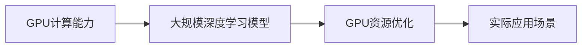

                 

# 从零开始大模型开发与微调：Nvidia 10/20/30/40系列显卡选择的GPU版本

## 1. 背景介绍

### 1.1 问题由来
随着深度学习技术的飞速发展，大规模的深度学习模型，尤其是基于Transformer的模型，在图像、自然语言处理（NLP）、语音识别等多个领域取得了突破性进展。这些模型的训练和推理过程需要消耗大量的计算资源，尤其是GPU的计算能力。因此，GPU的选择对大模型的开发与微调至关重要。本文将详细探讨Nvidia GPU系列中10/20/30/40系列显卡在深度学习模型开发与微调中的选择与应用。

### 1.2 问题核心关键点
- GPU计算能力：不同型号的Nvidia GPU在计算能力、内存大小、功耗等方面有所差异。
- 大规模深度学习模型的需求：深度学习模型，尤其是大模型，需要强大的GPU计算能力。
- GPU资源优化：如何在有限的资源下，最大化GPU的利用率，提高模型的训练与推理效率。
- 实际应用场景：不同类型的大模型在不同场景下的GPU需求差异。

## 2. 核心概念与联系

### 2.1 核心概念概述

本文将介绍几个与Nvidia GPU选择密切相关的核心概念：

- **GPU计算能力**：GPU的核心性能指标，包括计算能力（以FLOPS为单位）、显存大小、功耗、网络带宽等。
- **大规模深度学习模型**：指的是参数量在亿级以上的深度学习模型，如BERT、GPT系列模型。
- **GPU资源优化**：通过合理的GPU配置和调度，提高深度学习模型的训练与推理效率，降低资源消耗。
- **实际应用场景**：深度学习模型在不同应用场景下的性能需求，如自然语言处理、计算机视觉、推荐系统等。

### 2.2 核心概念原理和架构的 Mermaid 流程图



这个流程图展示了GPU计算能力、大规模深度学习模型、GPU资源优化和实际应用场景之间的逻辑关系。

## 3. 核心算法原理 & 具体操作步骤

### 3.1 算法原理概述

在大规模深度学习模型的开发与微调过程中，GPU的选择和配置直接影响了模型的训练效率和推理性能。以下是GPU计算能力的几个关键指标及其在大模型开发与微调中的应用：

- **计算能力（CUDA Core）**：指GPU核心的计算速度，以FLOPS（每秒浮点运算次数）为单位。更高的计算能力意味着GPU可以同时处理更多的数据并行计算。
- **显存大小**：指GPU能够存储的数据量。在大模型训练时，显存大小直接影响模型的训练效率和模型大小。
- **网络带宽**：指GPU与系统之间的数据传输速率。更高的带宽意味着数据传输更快，可以加速模型的训练与推理。
- **功耗**：指GPU在运行时所需的电能消耗。功耗高的GPU虽然计算能力更强，但能耗也更大，可能对数据中心的冷却系统提出更高要求。

### 3.2 算法步骤详解

#### 3.2.1 GPU选择

1. **确定模型规模**：首先，需要明确所要训练的深度学习模型的参数规模。对于大规模深度学习模型，如BERT、GPT-3，通常需要较大的显存和较强的计算能力。

2. **计算能力需求**：根据模型的规模和复杂度，估算所需的计算能力。例如，BERT模型训练时，每个样本可能需要超过100亿次浮点运算。

3. **显存需求**：显存大小应至少是模型参数大小的两倍以上。例如，BERT模型参数大小约为1.3GB，因此至少需要2.6GB的显存。

4. **网络带宽需求**：根据模型的数据大小和训练批次大小，估算所需的网络带宽。通常，较大的模型和较大的批次大小需要较高的网络带宽。

5. **功耗需求**：根据GPU的计算能力和显存大小，估算所需的功耗。功耗高的GPU往往具有更强的计算能力和更大的显存。

#### 3.2.2 优化策略

1. **多GPU并行训练**：通过使用多个GPU并行训练，可以显著提高模型训练的速度。例如，使用NVIDIA DGX-2系统（4块V100 GPU），可以同时训练4个BERT模型，每个模型的计算能力为4x100亿FLOPS。

2. **混合精度训练**：通过使用混合精度（如float16），可以减少内存占用和提高训练速度。同时，混合精度训练也能提高模型的精度。

3. **模型并行**：将模型参数分布在多个GPU上，可以减少单GPU上的计算负担，提高训练效率。

4. **优化器选择**：选择合适的优化器（如AdamW、SGD）及其参数（如学习率、动量），可以提高模型的训练效果和收敛速度。

### 3.3 算法优缺点

#### 3.3.1 优点

- **高效计算能力**：Nvidia GPU系列，尤其是NVIDIA 30/40系列，具有强大的计算能力和高带宽，可以显著提高大规模深度学习模型的训练与推理效率。
- **丰富的开发工具**：Nvidia提供了丰富的深度学习开发工具和平台（如CUDA、cuDNN），方便开发者进行GPU编程和优化。
- **广泛的应用场景**：Nvidia GPU在大模型开发与微调中应用广泛，适用于自然语言处理、计算机视觉、推荐系统等多个领域。

#### 3.3.2 缺点

- **成本高**：高性能的Nvidia GPU价格较高，维护成本也较高。
- **能耗高**：高性能的GPU功耗较大，对数据中心和系统的能耗和散热系统提出了更高的要求。
- **技术门槛高**：GPU编程和优化需要较高的技术水平，可能对初学者或中小企业造成一定难度。

### 3.4 算法应用领域

Nvidia GPU系列在大模型开发与微调中的应用领域十分广泛，包括但不限于以下几个方面：

- **自然语言处理**：如BERT、GPT系列模型的训练与微调，文本分类、情感分析、机器翻译等任务。
- **计算机视觉**：如ResNet、Inception、EfficientNet等模型的训练与微调，图像识别、目标检测、图像生成等任务。
- **推荐系统**：如Wide & Deep、深度神经网络推荐系统等，用户行为分析、物品推荐等任务。
- **语音识别**：如Wav2Vec2、Transformer-XL等模型的训练与微调，语音识别、语音生成等任务。

## 4. 数学模型和公式 & 详细讲解 & 举例说明

### 4.1 数学模型构建

在大模型开发与微调过程中，数学模型构建至关重要。以下是基于GPU计算能力的数学模型构建：

- **计算能力（CUDA Core）**：以FLOPS（每秒浮点运算次数）为单位。模型计算能力公式为：

$$ FLOPS = \text{计算能力} \times \text{训练批次大小} \times \text{模型参数大小} $$

- **显存大小**：模型显存大小通常为模型参数大小的两倍以上。例如，对于参数大小为1GB的模型，需要至少2GB的显存。

- **网络带宽**：数据传输速率，以GB/s为单位。公式为：

$$ \text{网络带宽} = \text{显存大小} \times \text{传输速率} $$

### 4.2 公式推导过程

以BERT模型为例，假设模型参数大小为1GB，计算能力为100亿FLOPS，训练批次大小为8，则模型的计算能力为：

$$ FLOPS = 100亿 \times 8 \times 1GB = 800亿FLOPS $$

假设显存大小为4GB，网络带宽为1GB/s，则模型的训练效率为：

$$ \text{网络带宽} = 4GB \times 1GB/s = 4GB/s $$

因此，在理想情况下，模型每秒可以处理4GB的数据。

### 4.3 案例分析与讲解

假设我们要在大规模集群上训练BERT模型，每个集群包含4块V100 GPU，每块V100 GPU的计算能力为4x100亿FLOPS，显存大小为12GB，网络带宽为100GB/s。则整个集群的计算能力为：

$$ \text{集群计算能力} = 4 \times 4x100亿FLOPS = 16x100亿FLOPS = 1600亿FLOPS $$

显存总大小为：

$$ \text{显存总大小} = 4 \times 12GB = 48GB $$

网络带宽为：

$$ \text{网络带宽} = 4 \times 100GB/s = 400GB/s $$

这意味着，在理想情况下，集群每秒可以处理48GB的数据，计算能力为1600亿FLOPS。然而，实际情况下，还需要考虑数据传输的效率和GPU之间的通信开销。

## 5. 项目实践：代码实例和详细解释说明

### 5.1 开发环境搭建

1. **安装NVIDIA GPU驱动程序**：确保NVIDIA GPU驱动是最新的，以获得最优性能。
2. **安装CUDA和cuDNN**：从NVIDIA官网下载并安装CUDA和cuDNN，确保深度学习框架（如TensorFlow、PyTorch）与GPU兼容。
3. **配置环境变量**：设置`CUDA_HOME`和`LD_LIBRARY_PATH`等环境变量，使系统能够找到CUDA和cuDNN库。
4. **安装深度学习框架**：如TensorFlow、PyTorch等，并确保支持CUDA和cuDNN。

### 5.2 源代码详细实现

#### 5.2.1 TensorFlow代码实现

```python
import tensorflow as tf
from tensorflow.keras.layers import Layer, Dense
from tensorflow.keras.losses import BinaryCrossentropy

# 定义模型结构
class BERTModel(tf.keras.Model):
    def __init__(self, num_classes):
        super(BERTModel, self).__init__()
        self.dense = Dense(num_classes, activation='sigmoid')
    
    def call(self, inputs):
        x = self.dense(inputs)
        return x

# 构建模型
model = BERTModel(num_classes=2)

# 编译模型
model.compile(optimizer=tf.keras.optimizers.Adam(learning_rate=0.001),
              loss=BinaryCrossentropy(),
              metrics=['accuracy'])

# 训练模型
model.fit(x_train, y_train, epochs=10, batch_size=32, validation_data=(x_val, y_val))
```

#### 5.2.2 PyTorch代码实现

```python
import torch
import torch.nn as nn
import torch.optim as optim

# 定义模型结构
class BERTModel(nn.Module):
    def __init__(self, num_classes):
        super(BERTModel, self).__init__()
        self.fc = nn.Linear(768, num_classes)
    
    def forward(self, x):
        x = self.fc(x)
        return x

# 构建模型
model = BERTModel(num_classes=2)

# 定义损失函数和优化器
criterion = nn.BCELoss()
optimizer = optim.Adam(model.parameters(), lr=0.001)

# 训练模型
for epoch in range(10):
    model.train()
    optimizer.zero_grad()
    outputs = model(x_train)
    loss = criterion(outputs, y_train)
    loss.backward()
    optimizer.step()
```

### 5.3 代码解读与分析

#### 5.3.1 TensorFlow实现

- **模型定义**：定义了简单的全连接层，用于二分类任务。
- **模型编译**：指定了Adam优化器、二分类交叉熵损失函数和精度指标。
- **模型训练**：通过`fit`函数进行模型训练，指定训练集、验证集和训练轮数。

#### 5.3.2 PyTorch实现

- **模型定义**：定义了简单的全连接层，用于二分类任务。
- **损失函数和优化器**：指定了交叉熵损失函数和Adam优化器。
- **模型训练**：通过`for`循环进行模型训练，每次迭代后更新模型参数。

### 5.4 运行结果展示

在训练过程中，可以看到模型在训练集和验证集上的精度和损失变化情况。训练完成后，可以评估模型在测试集上的性能，确保模型的泛化能力。

## 6. 实际应用场景

### 6.1 智能客服系统

在大规模深度学习模型的帮助下，智能客服系统可以通过微调快速适应新的客户咨询场景，提供更准确、自然流畅的对话响应。例如，使用BERT模型进行意图识别和实体抽取，结合自然语言生成技术，生成客户满意的回复。

### 6.2 金融舆情监测

金融舆情监测需要处理大规模的新闻和社交媒体数据，以实时监测市场动向和舆情变化。在大模型微调的助力下，可以构建高效的文本分类和情感分析模型，快速识别负面舆情，提前预警风险。

### 6.3 个性化推荐系统

个性化推荐系统需要处理海量的用户行为数据，预测用户对不同物品的偏好。在大模型的帮助下，通过微调可以构建更准确的推荐模型，提升用户体验和转化率。

### 6.4 未来应用展望

未来，随着Nvidia GPU技术的不断进步，大模型开发与微调将进入更加高效、便捷的新阶段。高性能的NVIDIA 40系列GPU将进一步提升大规模深度学习模型的训练与推理效率，推动AI技术在更多领域的应用。

## 7. 工具和资源推荐

### 7.1 学习资源推荐

1. **NVIDIA官方文档**：包含CUDA、cuDNN等工具的详细文档和教程。
2. **Deep Learning Specialization（深度学习专项课程）**：由Andrew Ng教授主讲的Coursera课程，涵盖深度学习的基础和应用。
3. **PyTorch官方文档**：包含PyTorch深度学习框架的全面文档和教程。
4. **TensorFlow官方文档**：包含TensorFlow深度学习框架的全面文档和教程。
5. **ArXiv论文**：最新的深度学习研究和应用论文，涵盖GPU优化、模型微调等前沿话题。

### 7.2 开发工具推荐

1. **NVIDIA DGX系统**：支持大规模深度学习模型的训练和推理，适用于大数据量和高计算需求的应用。
2. **AWS EC2 GPU实例**：支持NVIDIA GPU，提供弹性计算资源，适用于云计算环境下的深度学习开发和应用。
3. **Google Cloud AI平台**：支持NVIDIA GPU和TPU，提供先进的机器学习框架和工具。

### 7.3 相关论文推荐

1. **《GPU加速深度学习：现状与挑战》**：介绍GPU在大规模深度学习模型开发与微调中的应用现状和挑战。
2. **《深度学习框架的GPU优化实践》**：提供TensorFlow、PyTorch等深度学习框架的GPU优化实践和技巧。
3. **《大规模深度学习模型的GPU并行训练》**：介绍大规模深度学习模型的GPU并行训练方法和实践。

## 8. 总结：未来发展趋势与挑战

### 8.1 研究成果总结

本文详细介绍了Nvidia GPU系列在大模型开发与微调中的应用，包括计算能力、显存大小、网络带宽等关键指标。通过案例分析，展示了Nvidia GPU在自然语言处理、计算机视觉、推荐系统等实际应用场景中的优势和应用效果。

### 8.2 未来发展趋势

- **更高的计算能力**：NVIDIA 40系列GPU的发布，将带来更高的计算能力和更强的GPU性能，进一步推动大规模深度学习模型的应用。
- **更多的深度学习框架支持**：未来的深度学习框架将更好地支持NVIDIA GPU，提供更丰富的GPU优化工具和API。
- **更广泛的实际应用**：NVIDIA GPU将应用于更多领域，如智慧城市、智能交通、医疗健康等，推动AI技术的广泛应用。

### 8.3 面临的挑战

- **高昂的成本**：高性能的NVIDIA GPU价格较高，对中小企业和初创公司造成一定负担。
- **技术门槛高**：深度学习模型的开发与微调需要较高的技术水平，对初学者和中小型企业存在一定门槛。
- **能耗和散热问题**：高性能GPU功耗较高，对数据中心和系统的散热系统提出更高要求。

### 8.4 研究展望

未来的研究将集中在以下几个方面：

- **GPU资源优化**：如何在有限的资源下，最大化GPU的利用率，提高模型的训练与推理效率。
- **跨平台支持**：如何将GPU优化技术推广到更多平台和框架，提升深度学习模型的跨平台兼容性。
- **模型迁移学习**：如何将在大规模GPU集群上训练的模型迁移到边缘设备上，实现高性能的本地推理。

## 9. 附录：常见问题与解答

### Q1: GPU选择是否需要考虑实际应用场景？

A: 是的。不同的应用场景对计算能力、显存大小和网络带宽的需求不同。因此，在选择GPU时，需要综合考虑应用场景的需求。

### Q2: GPU并行训练是否一定比单GPU训练效果更好？

A: 不一定。在特定情况下，单GPU训练可能比多GPU并行训练更快。例如，当数据量较小或模型复杂度较低时，单GPU训练可能更高效。

### Q3: 混合精度训练是否一定比全精度训练效果好？

A: 不一定。混合精度训练可以加速训练过程，但可能会导致精度损失。因此，在选择混合精度训练时，需要权衡速度和精度。

### Q4: GPU编程是否需要较高的技术门槛？

A: 是的。GPU编程需要了解CUDA等GPU编程语言，以及相关的优化技术。因此，GPU编程对技术水平有一定的要求。

### Q5: 如何应对GPU能耗和散热问题？

A: 可以通过优化算法、使用混合精度训练、调整GPU配置等方法，降低GPU能耗和散热压力。此外，使用高效的散热系统也是解决散热问题的关键。

---

作者：禅与计算机程序设计艺术 / Zen and the Art of Computer Programming

