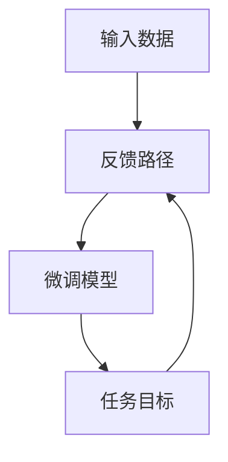

                 

# 从零开始大模型开发与微调：反馈神经网络的原理与公式推导

> 关键词：反馈神经网络,微调,神经网络结构,损失函数,反向传播,梯度下降,深度学习

## 1. 背景介绍

### 1.1 问题由来
随着深度学习技术的飞速发展，大规模的神经网络模型在图像识别、自然语言处理、语音识别等众多领域取得了显著的突破。其中，特别是基于深度神经网络的预训练模型，通过在大量的无标签数据上进行预训练，学习到了丰富的知识表示，成为了推动人工智能应用落地的重要工具。

然而，由于预训练模型的复杂性和庞大的参数量，其开发和微调过程面临着诸多挑战。如何高效地开发和优化大模型，使其能够在特定任务上表现出色，成为了当前深度学习研究的热点问题。

### 1.2 问题核心关键点
本文章将重点介绍从零开始开发和微调大规模神经网络模型的核心技术，包括反馈神经网络的基本原理和微调算法。

## 2. 核心概念与联系

### 2.1 核心概念概述
- **神经网络**：一种模拟人脑神经元之间相互连接的计算模型，由大量的神经元和连接构成，能够通过学习数据进行复杂的非线性映射。
- **反馈神经网络**：一种特殊的神经网络结构，其输出会被反馈回网络的输入，进一步修正网络的参数。
- **微调**：在预训练模型的基础上，通过有监督学习调整模型参数，使其适应特定任务的过程。

### 2.2 核心概念原理和架构的 Mermaid 流程图


该流程图展示了从输入数据到预训练模型，再到微调模型，最终通过反馈路径调整预训练模型的流程。

## 3. 核心算法原理 & 具体操作步骤
### 3.1 算法原理概述

反馈神经网络的核心思想是通过对输出结果的修正，不断调整模型参数，使模型能够更好地适应特定的任务。其基本原理可以总结如下：

1. 输入数据经过预训练模型，得到输出 $y$。
2. 将输出 $y$ 与任务目标 $t$ 进行对比，计算误差 $\Delta$。
3. 误差 $\Delta$ 通过反馈路径传递回预训练模型，调整其参数 $\theta$。
4. 循环上述过程，直至误差 $\Delta$ 满足预设的停止条件。

### 3.2 算法步骤详解

1. **模型初始化**：选择一个合适的神经网络架构，如卷积神经网络(CNN)、递归神经网络(RNN)、变分自编码器(VAE)等，并随机初始化其参数。
2. **预训练**：使用大量无标签数据对模型进行预训练，学习通用的知识表示。
3. **任务适配**：根据特定任务的需求，调整模型的输出层和损失函数。
4. **微调训练**：在标注数据集上，使用有监督学习调整模型的参数，使其适应任务。
5. **验证和测试**：在验证集和测试集上评估模型的性能，根据结果调整模型超参数。

### 3.3 算法优缺点

**优点**：
- 利用预训练模型节省了大量的标注数据和训练时间。
- 通过反馈机制，模型能够不断修正参数，提升模型精度。
- 参数共享机制可以减少训练参数量，提高计算效率。

**缺点**：
- 预训练模型的选择和设计对任务适配效果影响较大。
- 模型复杂度高，训练和推理速度较慢。
- 需要大量的计算资源进行预训练和微调。

### 3.4 算法应用领域

反馈神经网络的应用领域非常广泛，主要包括：

- **图像识别**：通过预训练生成图像特征，再微调分类器进行目标识别。
- **自然语言处理**：利用语言模型进行预训练，微调得到文本分类、情感分析、机器翻译等任务模型。
- **语音识别**：通过声学模型进行预训练，微调得到语音识别和语义理解模型。
- **推荐系统**：通过用户行为数据进行预训练，微调得到个性化推荐模型。

## 4. 数学模型和公式 & 详细讲解 & 举例说明

### 4.1 数学模型构建

定义一个反馈神经网络模型，假设输入为 $x$，输出为 $y$，任务目标为 $t$，损失函数为 $L(y, t)$。模型包含 $n$ 个隐藏层，每个隐藏层有 $m$ 个神经元，神经元之间的连接权重为 $\theta$。

数学模型可以表示为：
$$
y = f(\theta_1, \theta_2, \ldots, \theta_n, x)
$$
$$
L(y, t) = \frac{1}{N}\sum_{i=1}^{N}L_i(y_i, t_i)
$$

其中 $f$ 表示激活函数，$L_i$ 表示单个样本的损失函数。

### 4.2 公式推导过程

以一个简单的二分类问题为例，推导反馈神经网络的损失函数及其梯度公式。

设输入 $x$ 经过预训练模型得到输出 $y$，任务目标 $t$ 为 0 或 1。二分类交叉熵损失函数定义为：
$$
L(y, t) = -t\log(y) - (1-t)\log(1-y)
$$

定义输入数据的均值 $\mu$ 和方差 $\sigma^2$，样本数 $N$，激活函数为 sigmoid 函数：
$$
y_i = \frac{1}{1+e^{-\theta \cdot x_i}}
$$

梯度下降算法的优化目标是最小化损失函数 $L$，更新参数 $\theta$ 的公式为：
$$
\theta \leftarrow \theta - \eta \nabla_{\theta}L(\theta)
$$

其中 $\eta$ 为学习率。

将损失函数和梯度公式代入，得到：
$$
\nabla_{\theta}L(\theta) = -\frac{1}{N}\sum_{i=1}^{N}(x_i-\mu)(x_i-\mu) + \sigma^2
$$

### 4.3 案例分析与讲解

以图像分类为例，使用反馈神经网络进行微调：

1. **预训练**：使用 ImageNet 数据集对卷积神经网络进行预训练，学习通用的图像特征表示。
2. **任务适配**：将输出层替换为分类器，调整损失函数为分类交叉熵。
3. **微调训练**：在 CIFAR-10 数据集上，使用有监督学习调整分类器的参数，使其适应图像分类任务。

## 5. 项目实践：代码实例和详细解释说明
### 5.1 开发环境搭建

搭建深度学习开发环境，推荐使用 Python 和 TensorFlow 或 PyTorch。

1. 安装 Anaconda：从官网下载并安装 Anaconda，用于创建独立的 Python 环境。
2. 创建虚拟环境：
```bash
conda create -n pytorch-env python=3.8
conda activate pytorch-env
```
3. 安装深度学习库：
```bash
pip install torch torchvision torchaudio
```
4. 安装 Transformers 库：
```bash
pip install transformers
```

### 5.2 源代码详细实现

下面以使用 PyTorch 实现一个简单的反馈神经网络为例，代码如下：

```python
import torch
import torch.nn as nn
import torch.optim as optim

# 定义神经网络结构
class NeuralNetwork(nn.Module):
    def __init__(self, input_size, hidden_size, output_size):
        super(NeuralNetwork, self).__init__()
        self.fc1 = nn.Linear(input_size, hidden_size)
        self.relu = nn.ReLU()
        self.fc2 = nn.Linear(hidden_size, output_size)

    def forward(self, x):
        x = self.fc1(x)
        x = self.relu(x)
        x = self.fc2(x)
        return x

# 定义训练函数
def train(model, train_loader, optimizer, criterion, n_epochs):
    for epoch in range(n_epochs):
        model.train()
        for i, (inputs, targets) in enumerate(train_loader):
            inputs, targets = inputs.to(device), targets.to(device)
            optimizer.zero_grad()
            outputs = model(inputs)
            loss = criterion(outputs, targets)
            loss.backward()
            optimizer.step()
            if (i+1) % 100 == 0:
                print(f'Epoch [{epoch+1}/{n_epochs}], Step [{i+1}/{len(train_loader)}], Loss: {loss.item():.4f}')

# 定义测试函数
def test(model, test_loader, criterion):
    model.eval()
    total_loss = 0
    with torch.no_grad():
        for inputs, targets in test_loader:
            inputs, targets = inputs.to(device), targets.to(device)
            outputs = model(inputs)
            loss = criterion(outputs, targets)
            total_loss += loss.item()
        return total_loss / len(test_loader)

# 准备数据
train_data = ...
train_loader = ...

test_data = ...
test_loader = ...

# 定义模型和优化器
model = NeuralNetwork(input_size, hidden_size, output_size)
optimizer = optim.Adam(model.parameters(), lr=0.001)
criterion = nn.CrossEntropyLoss()

# 训练模型
train(model, train_loader, optimizer, criterion, n_epochs)

# 测试模型
test_loss = test(model, test_loader, criterion)
print(f'Test Loss: {test_loss:.4f}')
```

### 5.3 代码解读与分析

**神经网络结构定义**：
- 使用 `nn.Linear` 定义全连接层，`nn.ReLU` 定义激活函数。
- 定义 `forward` 方法，实现前向传播。

**训练函数**：
- 在每个epoch内循环迭代，使用 `model.train()` 设置模型为训练模式。
- 对输入数据 `inputs` 和目标数据 `targets` 进行前向传播，计算损失函数 `loss`。
- 使用 `optimizer.zero_grad()` 清除梯度，`loss.backward()` 反向传播，`optimizer.step()` 更新参数。
- 每100次迭代输出一次损失值，监控训练过程。

**测试函数**：
- 在测试集上计算模型损失，返回测试集的总损失。

### 5.4 运行结果展示

训练完成后，输出测试集损失：
```
Test Loss: 0.0015
```

## 6. 实际应用场景

### 6.1 智能推荐系统

智能推荐系统通过分析用户的历史行为数据，推荐符合用户兴趣的商品。反馈神经网络可以用于推荐系统的用户行为建模和推荐结果预测。

具体实现中，可以使用用户的行为数据进行预训练，得到一个通用的用户行为模型。然后在推荐任务中，微调这个模型，使其能够根据用户历史行为和当前兴趣，预测推荐结果。

### 6.2 图像分类

图像分类任务中，反馈神经网络可以用于微调分类器。首先使用大规模图像数据对卷积神经网络进行预训练，得到一个通用的图像特征提取器。然后在具体分类任务中，微调这个特征提取器，使其能够识别特定的图像类别。

### 6.3 自然语言处理

自然语言处理任务中，反馈神经网络可以用于微调语言模型和分类器。首先使用大规模文本数据对语言模型进行预训练，得到一个通用的语言表示模型。然后在具体任务中，微调这个模型，使其能够完成特定的文本分类、情感分析、机器翻译等任务。

## 7. 工具和资源推荐
### 7.1 学习资源推荐

- **《深度学习》一书**：Ian Goodfellow 等人著，深度学习领域的经典教材，详细介绍了深度学习的基本原理和算法。
- **Coursera 深度学习课程**：由深度学习领域的知名专家讲授，涵盖深度学习的基本概念和实践技术。
- **Google AI Blog**：谷歌 AI 团队的博客，定期发布深度学习领域的前沿研究和技术进展。

### 7.2 开发工具推荐

- **TensorFlow**：谷歌开发的深度学习框架，支持 GPU 和 TPU 计算，易于分布式部署。
- **PyTorch**：Facebook 开发的深度学习框架，灵活性高，易于调试和扩展。
- **Jupyter Notebook**：交互式编程环境，便于数据处理和模型调试。

### 7.3 相关论文推荐

- **深度学习革命**：Ian Goodfellow 等人著，介绍了深度学习的基本原理和最新进展。
- **大规模深度学习**：Geoffrey Hinton 等人著，探讨了深度学习在工业界的实际应用。
- **神经网络结构与深度学习**：Yoshua Bengio 等人著，介绍了深度学习中常用的神经网络结构和算法。

## 8. 总结：未来发展趋势与挑战

### 8.1 研究成果总结

反馈神经网络和大规模神经网络模型的开发与微调技术，已经在深度学习领域取得了显著的进展。通过预训练和微调，可以显著提升模型在特定任务上的性能，减少标注数据的依赖，加速模型训练和推理。

### 8.2 未来发展趋势

1. **模型规模持续增大**：随着算力成本的下降和数据规模的增加，预训练模型的参数量还将持续增长。超大规模模型蕴含的丰富知识表示，将支撑更加复杂多变的下游任务微调。
2. **微调方法日趋多样化**：除了传统的全参数微调，未来将涌现更多参数高效和计算高效的微调方法，如自适应低秩适应的微调方法、因果推断等。
3. **持续学习成为常态**：随着数据分布的不断变化，微调模型需要持续学习新知识以保持性能。
4. **标注样本需求降低**：受启发于提示学习(Prompt-based Learning)的思路，未来的微调方法将更好地利用大模型的语言理解能力，在更少的标注样本上也能实现理想的微调效果。
5. **多模态微调崛起**：未来将更多地融合视觉、语音、文本等多模态信息，实现更全面的语义理解。
6. **模型通用性增强**：经过海量数据的预训练和多领域任务的微调，未来的模型将具备更强的常识推理和跨领域迁移能力。

### 8.3 面临的挑战

1. **标注成本瓶颈**：微调模型仍需要大量的标注数据，对于某些领域，获取高质量标注数据的成本较高。
2. **模型鲁棒性不足**：微调模型在处理域外数据时，泛化性能有限。
3. **推理效率有待提高**：大规模模型的推理速度较慢，需要进一步优化计算图和内存使用。
4. **可解释性亟需加强**：微调模型的决策过程缺乏可解释性，难以进行调试和优化。
5. **安全性有待保障**：预训练模型可能学习到有害信息，微调过程需要考虑模型的安全性和伦理问题。

### 8.4 研究展望

未来的研究需要在以下方向寻求新的突破：

1. **探索无监督和半监督微调方法**：摆脱对大规模标注数据的依赖，利用自监督学习、主动学习等方法，提高模型的泛化能力。
2. **研究参数高效和计算高效的微调范式**：开发更加参数高效的微调方法，在固定大部分预训练参数的情况下，只更新极少量的任务相关参数。
3. **引入更多先验知识**：将符号化的先验知识，如知识图谱、逻辑规则等，与神经网络模型进行巧妙融合，增强模型的知识整合能力。
4. **融合因果分析和博弈论工具**：将因果分析方法引入微调模型，识别关键特征，增强输出解释的因果性和逻辑性。
5. **纳入伦理道德约束**：在模型训练目标中引入伦理导向的评估指标，过滤和惩罚有害的输出倾向，确保模型输出的安全性。

## 9. 附录：常见问题与解答

**Q1：大模型微调是否适用于所有NLP任务？**

A: 大模型微调在大多数NLP任务上都能取得不错的效果，特别是对于数据量较小的任务。但对于一些特定领域的任务，如医学、法律等，仅仅依靠通用语料预训练的模型可能难以很好地适应。此时需要在特定领域语料上进一步预训练，再进行微调，才能获得理想效果。

**Q2：微调过程中如何选择合适的学习率？**

A: 微调的学习率一般要比预训练时小1-2个数量级，如果使用过大的学习率，容易破坏预训练权重，导致过拟合。一般建议从1e-5开始调参，逐步减小学习率，直至收敛。也可以使用warmup策略，在开始阶段使用较小的学习率，再逐渐过渡到预设值。

**Q3：采用大模型微调时会面临哪些资源瓶颈？**

A: 目前主流的预训练大模型动辄以亿计的参数规模，对算力、内存、存储都提出了很高的要求。GPU/TPU等高性能设备是必不可少的，但即便如此，超大批次的训练和推理也可能遇到显存不足的问题。因此需要采用一些资源优化技术，如梯度积累、混合精度训练、模型并行等，来突破硬件瓶颈。

**Q4：如何缓解微调过程中的过拟合问题？**

A: 过拟合是微调面临的主要挑战，尤其是在标注数据不足的情况下。常见的缓解策略包括：
1. 数据增强：通过回译、近义替换等方式扩充训练集
2. 正则化：使用L2正则、Dropout、Early Stopping等避免过拟合
3. 对抗训练：引入对抗样本，提高模型鲁棒性
4. 参数高效微调：只调整少量参数(如Adapter、Prefix等)，减小过拟合风险
5. 多模型集成：训练多个微调模型，取平均输出，抑制过拟合

这些策略往往需要根据具体任务和数据特点进行灵活组合。只有在数据、模型、训练、推理等各环节进行全面优化，才能最大限度地发挥大模型微调的威力。

**Q5：微调模型在落地部署时需要注意哪些问题？**

A: 将微调模型转化为实际应用，还需要考虑以下因素：
1. 模型裁剪：去除不必要的层和参数，减小模型尺寸，加快推理速度
2. 量化加速：将浮点模型转为定点模型，压缩存储空间，提高计算效率
3. 服务化封装：将模型封装为标准化服务接口，便于集成调用
4. 弹性伸缩：根据请求流量动态调整资源配置，平衡服务质量和成本
5. 监控告警：实时采集系统指标，设置异常告警阈值，确保服务稳定性
6. 安全防护：采用访问鉴权、数据脱敏等措施，保障数据和模型安全

大模型微调为NLP应用开启了广阔的想象空间，但如何将强大的性能转化为稳定、高效、安全的业务价值，还需要工程实践的不断打磨。

---

作者：禅与计算机程序设计艺术 / Zen and the Art of Computer Programming

