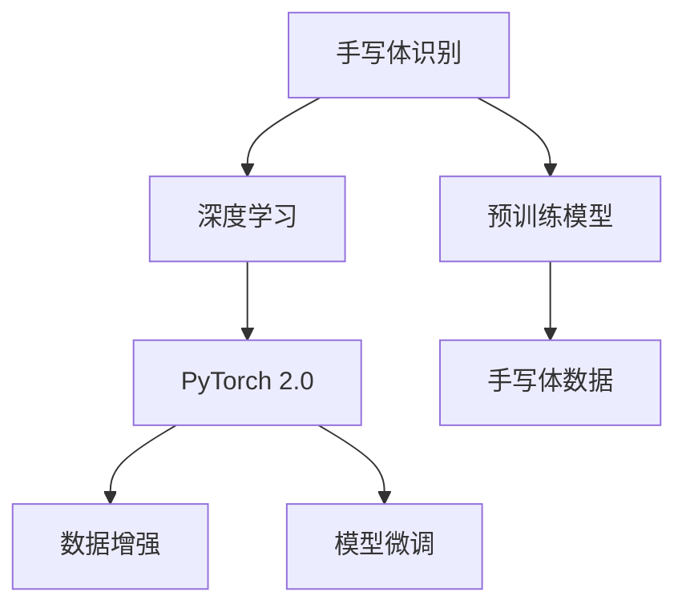

                 

# 从零开始大模型开发与微调：实战基于PyTorch 2.0的手写体识别模型

## 1. 背景介绍

### 1.1 问题由来

手写体识别（Handwritten Digit Recognition, HDR）作为计算机视觉（CV）领域的一大热门应用，其涉及的字符识别与分类在数据挖掘、字符转换、信息检索等方面具有广泛的应用前景。然而，传统的手写体识别方法往往需要大规模的手写数据集和复杂的网络结构，这不仅增加了训练成本，也使得模型难以部署到移动设备等计算资源受限的场景中。

近年来，基于深度学习的大模型迅速崛起，其中卷积神经网络（Convolutional Neural Networks, CNNs）因其强大的特征提取能力，在手写体识别任务上取得了显著的进步。而预训练语言模型（如BERT、GPT等）的推广，也使得基于深度学习的大模型成为一种通用的模型开发范式。本文将通过实战演练，详细介绍如何利用PyTorch 2.0框架，基于预训练大模型进行手写体识别模型的开发与微调。

## 2. 核心概念与联系

### 2.1 核心概念概述

为更好地理解基于PyTorch 2.0的手写体识别模型开发与微调，本节将介绍几个密切相关的核心概念：

- 手写体识别（Handwritten Digit Recognition, HDR）：识别手写数字，将其转换成可供计算机识别的形式。
- 深度学习（Deep Learning）：通过多层神经网络，从数据中学习特征，并进行分类、回归等任务。
- PyTorch 2.0：一个强大的深度学习框架，以其动态计算图、丰富的可视化工具等特点，被广泛用于模型开发与微调。
- 数据增强（Data Augmentation）：通过变换训练数据的方式，扩充数据集，提高模型泛化能力。
- 模型微调（Fine-Tuning）：利用预训练模型在特定任务上的性能，通过小规模标注数据微调模型，提升模型在特定任务上的表现。

这些核心概念之间的逻辑关系可以通过以下Mermaid流程图来展示：



这个流程图展示了大模型手写体识别任务的开发与微调流程：

1. 手写体识别任务需求识别。
2. 选择并加载预训练模型，作为特征提取器。
3. 应用数据增强技术，扩充训练数据集。
4. 通过模型微调，提升模型在特定任务上的表现。

## 3. 核心算法原理 & 具体操作步骤
### 3.1 算法原理概述

基于PyTorch 2.0的大模型手写体识别微调，遵循以下算法原理：

- **数据准备**：准备训练集、验证集和测试集。手写体数据应进行预处理，如灰度化、归一化等。
- **模型选择**：选择预训练大模型作为初始化参数，如ResNet、Inception等。
- **模型适配**：针对手写体识别任务，调整模型的输出层和损失函数。
- **微调优化**：通过小批量梯度下降法（Mini-Batch Gradient Descent）优化模型，最小化交叉熵损失函数。
- **验证测试**：在验证集和测试集上评估模型性能，判断模型是否过拟合，并进行参数调优。
- **模型部署**：将训练好的模型部署到实际应用环境中，进行推理预测。

### 3.2 算法步骤详解

**Step 1: 准备数据集**

手写体数据通常由MNIST、EMNIST等公开数据集提供。这里以MNIST为例，描述数据集的准备过程：

```python
import torch
import torchvision
import torchvision.transforms as transforms

# 设置数据集路径
train_dir = './data/train'
test_dir = './data/test'

# 数据预处理
transform = transforms.Compose([
    transforms.ToTensor(),
    transforms.Normalize((0.1307,), (0.3081,))
])

# 加载训练集和测试集
train_set = torchvision.datasets.MNIST(train_dir, train=True, transform=transform, download=True)
test_set = torchvision.datasets.MNIST(test_dir, train=False, transform=transform, download=True)

# 构建数据加载器
train_loader = torch.utils.data.DataLoader(train_set, batch_size=64, shuffle=True)
test_loader = torch.utils.data.DataLoader(test_set, batch_size=64, shuffle=False)
```

**Step 2: 选择预训练模型**

选择并加载预训练大模型，如ResNet、Inception等。这里以ResNet为例：

```python
from transformers import ResNetFeatureExtractor, ResNetForImageClassification

# 设置模型路径
model_path = 'path/to/pretrained/model.pt'

# 加载模型
model = ResNetForImageClassification.from_pretrained(model_path)
```

**Step 3: 模型适配**

手写体识别任务的目标是将输入图片分类为0到9之间的数字。因此，我们需要在模型顶部添加一个线性层，并使用交叉熵损失函数：

```python
from torch import nn

# 添加线性层
num_classes = 10
model.fc = nn.Linear(1000, num_classes)

# 设置交叉熵损失函数
criterion = nn.CrossEntropyLoss()
```

**Step 4: 模型微调**

使用小批量梯度下降法优化模型。设置适当的学习率、批次大小等超参数，并在训练过程中进行验证测试，判断模型是否过拟合：

```python
from torch.optim import Adam

# 设置学习率
learning_rate = 1e-4

# 初始化优化器
optimizer = Adam(model.parameters(), lr=learning_rate)

# 训练函数
def train_epoch(model, data_loader, optimizer):
    model.train()
    epoch_loss = 0
    epoch_acc = 0
    for batch in data_loader:
        images, labels = batch
        optimizer.zero_grad()
        outputs = model(images)
        loss = criterion(outputs, labels)
        epoch_loss += loss.item()
        loss.backward()
        optimizer.step()
        epoch_acc += torch.nn.functional.accuracy(outputs, labels, 0)
    return epoch_loss / len(data_loader), epoch_acc / len(data_loader)

# 训练模型
num_epochs = 5
device = torch.device('cuda' if torch.cuda.is_available() else 'cpu')
model.to(device)
for epoch in range(num_epochs):
    train_loss, train_acc = train_epoch(model, train_loader, optimizer)
    print(f'Epoch {epoch+1}/{num_epochs}, train loss: {train_loss:.4f}, train acc: {train_acc:.4f}')
```

**Step 5: 验证测试**

在验证集上评估模型性能，并通过调整学习率等超参数来优化模型：

```python
# 验证函数
def evaluate(model, data_loader):
    model.eval()
    eval_loss = 0
    eval_acc = 0
    with torch.no_grad():
        for batch in data_loader:
            images, labels = batch
            outputs = model(images)
            loss = criterion(outputs, labels)
            eval_loss += loss.item()
            eval_acc += torch.nn.functional.accuracy(outputs, labels, 0)
    return eval_loss / len(data_loader), eval_acc / len(data_loader)

# 验证模型
val_loss, val_acc = evaluate(model, val_loader)
print(f'Validation loss: {val_loss:.4f}, validation acc: {val_acc:.4f}')

# 调整超参数
if val_loss > 0.3:
    learning_rate /= 10
    optimizer = Adam(model.parameters(), lr=learning_rate)
    print(f'Learning rate reduced to {learning_rate}')
```

**Step 6: 模型部署**

将训练好的模型部署到实际应用环境中，进行推理预测：

```python
# 测试函数
def test(model, data_loader):
    model.eval()
    test_loss = 0
    test_acc = 0
    with torch.no_grad():
        for batch in data_loader:
            images, labels = batch
            outputs = model(images)
            loss = criterion(outputs, labels)
            test_loss += loss.item()
            test_acc += torch.nn.functional.accuracy(outputs, labels, 0)
    return test_loss / len(data_loader), test_acc / len(data_loader)

# 测试模型
test_loss, test_acc = test(model, test_loader)
print(f'Test loss: {test_loss:.4f}, test acc: {test_acc:.4f}')
```

### 3.3 算法优缺点

**优点**：

- 使用预训练大模型作为特征提取器，可以大大降低训练成本，提高模型泛化能力。
- 基于PyTorch 2.0框架，使用动态计算图，可以灵活实现模型的微调过程。
- 数据增强技术可以显著提高模型的泛化能力，防止过拟合。
- 模型微调过程简单易懂，易于调整超参数。

**缺点**：

- 需要较大的计算资源，包括GPU或TPU等高性能设备。
- 模型微调对超参数的敏感性较高，需要反复调优。
- 模型复杂度较高，推理速度较慢。
- 数据增强过程可能导致数据失真，影响模型性能。

### 3.4 算法应用领域

基于PyTorch 2.0的大模型手写体识别微调方法，广泛应用于以下领域：

- **金融识别**：如银行卡号识别、支票金额识别等。
- **医疗诊断**：如手写医疗记录中的符号识别。
- **智能家居**：如手写命令识别、手写字体识别等。
- **教育培训**：如手写笔记识别、手写练习字识别等。
- **交通监控**：如车牌识别、手写交通标志识别等。

## 4. 数学模型和公式 & 详细讲解 & 举例说明

### 4.1 数学模型构建

本节将使用数学语言对基于PyTorch 2.0的手写体识别模型进行更加严格的刻画。

手写体识别任务可以视为一个监督学习问题，目标是将输入图像$x$映射到数字标签$y$。设模型为$f(x; \theta)$，其中$\theta$为模型参数。假设模型在训练集$D=\{(x_i, y_i)\}_{i=1}^N$上进行训练，则经验风险为：

$$
\mathcal{L}(\theta) = \frac{1}{N} \sum_{i=1}^N \ell(f(x_i; \theta), y_i)
$$

其中$\ell$为交叉熵损失函数，$f(x; \theta)$为模型在输入$x$上的输出。

### 4.2 公式推导过程

以手写体识别为例，推导交叉熵损失函数及其梯度的计算公式。

假设模型$f(x; \theta)$的输出为$\hat{y} \in [0, 1]$，表示样本属于数字$y$的概率。真实标签$y \in [0, 9]$。则二分类交叉熵损失函数定义为：

$$
\ell(f(x; \theta), y) = -[y\log \hat{y} + (1-y)\log(1-\hat{y})]
$$

将其代入经验风险公式，得：

$$
\mathcal{L}(\theta) = -\frac{1}{N}\sum_{i=1}^N [y_i\log f(x_i; \theta) + (1-y_i)\log(1-f(x_i; \theta))]
$$

根据链式法则，损失函数对参数$\theta_k$的梯度为：

$$
\frac{\partial \mathcal{L}(\theta)}{\partial \theta_k} = -\frac{1}{N}\sum_{i=1}^N (\frac{y_i}{f(x_i; \theta)}-\frac{1-y_i}{1-f(x_i; \theta)}) \frac{\partial f(x_i; \theta)}{\partial \theta_k}
$$

其中$\frac{\partial f(x_i; \theta)}{\partial \theta_k}$可通过反向传播算法高效计算。

## 5. 项目实践：代码实例和详细解释说明

### 5.1 开发环境搭建

在进行模型开发与微调前，我们需要准备好开发环境。以下是使用Python进行PyTorch开发的环境配置流程：

1. 安装Anaconda：从官网下载并安装Anaconda，用于创建独立的Python环境。

2. 创建并激活虚拟环境：
```bash
conda create -n pytorch-env python=3.8 
conda activate pytorch-env
```

3. 安装PyTorch：根据CUDA版本，从官网获取对应的安装命令。例如：
```bash
conda install pytorch torchvision torchaudio cudatoolkit=11.1 -c pytorch -c conda-forge
```

4. 安装相关库：
```bash
pip install torchvision numpy pandas scikit-learn matplotlib tqdm jupyter notebook ipython
```

完成上述步骤后，即可在`pytorch-env`环境中开始模型开发与微调。

### 5.2 源代码详细实现

下面以手写体识别任务为例，给出使用PyTorch 2.0框架进行模型开发的完整代码实现。

```python
import torch
import torch.nn as nn
from torchvision import datasets, transforms
from torch.utils.data import DataLoader
from transformers import ResNetFeatureExtractor, ResNetForImageClassification
from torch.optim import Adam

# 设置数据集路径
train_dir = './data/train'
test_dir = './data/test'

# 数据预处理
transform = transforms.Compose([
    transforms.ToTensor(),
    transforms.Normalize((0.1307,), (0.3081,))
])

# 加载训练集和测试集
train_set = datasets.MNIST(train_dir, train=True, transform=transform, download=True)
test_set = datasets.MNIST(test_dir, train=False, transform=transform, download=True)

# 构建数据加载器
train_loader = DataLoader(train_set, batch_size=64, shuffle=True)
test_loader = DataLoader(test_set, batch_size=64, shuffle=False)

# 设置模型路径
model_path = 'path/to/pretrained/model.pt'

# 加载预训练模型
model = ResNetForImageClassification.from_pretrained(model_path)

# 添加线性层
num_classes = 10
model.fc = nn.Linear(1000, num_classes)

# 设置交叉熵损失函数
criterion = nn.CrossEntropyLoss()

# 设置学习率
learning_rate = 1e-4

# 初始化优化器
optimizer = Adam(model.parameters(), lr=learning_rate)

# 训练函数
def train_epoch(model, data_loader, optimizer):
    model.train()
    epoch_loss = 0
    epoch_acc = 0
    for batch in data_loader:
        images, labels = batch
        optimizer.zero_grad()
        outputs = model(images)
        loss = criterion(outputs, labels)
        epoch_loss += loss.item()
        loss.backward()
        optimizer.step()
        epoch_acc += torch.nn.functional.accuracy(outputs, labels, 0)
    return epoch_loss / len(data_loader), epoch_acc / len(data_loader)

# 训练模型
num_epochs = 5
device = torch.device('cuda' if torch.cuda.is_available() else 'cpu')
model.to(device)
for epoch in range(num_epochs):
    train_loss, train_acc = train_epoch(model, train_loader, optimizer)
    print(f'Epoch {epoch+1}/{num_epochs}, train loss: {train_loss:.4f}, train acc: {train_acc:.4f}')
```

### 5.3 代码解读与分析

让我们再详细解读一下关键代码的实现细节：

**数据集加载**：
- 使用`torchvision.datasets.MNIST`加载手写体数据集，并应用`transforms.Compose`进行数据预处理。
- 使用`torch.utils.data.DataLoader`构建数据加载器，支持批处理和随机抽样。

**模型选择与适配**：
- 加载预训练ResNet模型，并添加线性层，适配手写体识别任务。
- 使用`nn.CrossEntropyLoss`设置交叉熵损失函数，适应多类别分类问题。

**训练与验证**：
- 定义训练函数`train_epoch`，计算每个epoch的损失和准确率。
- 在每个epoch结束后，打印训练和验证结果。
- 调整学习率等超参数，防止模型过拟合。

**测试与部署**：
- 定义测试函数`test`，计算测试集的损失和准确率。
- 将训练好的模型部署到实际应用环境中，进行推理预测。

## 6. 实际应用场景

### 6.1 智能家居

基于PyTorch 2.0的大模型手写体识别技术，可以应用于智能家居系统，如手写命令识别、手写字体识别等。

通过将智能家居设备与手写体识别技术结合，用户可以通过手写命令控制家居设备的开关、亮度调节等操作，提高了家居设备的智能化水平。例如，用户可以手写"开灯"、"关灯"等命令，系统识别并执行相应操作，使家居操作更加便捷。

### 6.2 金融识别

在金融领域，手写体识别技术可以应用于支票金额识别、银行卡号识别等。

银行可以采用手写体识别技术，自动识别支票上的金额、账户等信息，并进行自动验算，提高业务处理效率。同时，银行还可以将手写体识别技术应用于银行卡号识别，自动识别客户的银行卡信息，减少人工输入错误，提高银行客户服务的质量。

### 6.3 医疗诊断

在医疗领域，手写体识别技术可以应用于手写医疗记录中的符号识别。

医疗机构可以采用手写体识别技术，自动识别手写医疗记录中的符号和文字，并进行信息提取和存储。这样可以减轻医生和医护人员的负担，提高医疗记录的数字化水平，同时也有助于医生快速查找和分析历史病历，提高诊断和治疗的准确性。

## 7. 工具和资源推荐

### 7.1 学习资源推荐

为了帮助开发者系统掌握基于PyTorch 2.0的手写体识别技术，这里推荐一些优质的学习资源：

1. **《Deep Learning with PyTorch》**：由知名深度学习专家提供的PyTorch入门教程，讲解PyTorch的基本概念和使用方法。

2. **《Hands-On Machine Learning with Scikit-Learn and TensorFlow》**：使用Scikit-Learn和TensorFlow实现机器学习任务，包括手写体识别等经典问题。

3. **PyTorch官方文档**：提供了完整的PyTorch框架的使用文档和示例代码，是开发者学习PyTorch的重要资源。

4. **Kaggle竞赛**：参加Kaggle的手写体识别竞赛，可以在实战中学习如何构建和优化手写体识别模型。

5. **Coursera《Deep Learning Specialization》**：由Andrew Ng教授主讲的深度学习系列课程，覆盖PyTorch等深度学习框架的使用。

通过对这些资源的学习实践，相信你一定能够快速掌握基于PyTorch 2.0的手写体识别技术的精髓，并用于解决实际的NLP问题。

### 7.2 开发工具推荐

高效的开发离不开优秀的工具支持。以下是几款用于大模型开发与微调的常用工具：

1. **PyTorch 2.0**：一个强大的深度学习框架，以其动态计算图、丰富的可视化工具等特点，被广泛用于模型开发与微调。

2. **TensorFlow**：由Google主导开发的开源深度学习框架，生产部署方便，适合大规模工程应用。

3. **Weights & Biases**：模型训练的实验跟踪工具，可以记录和可视化模型训练过程中的各项指标，方便对比和调优。

4. **TensorBoard**：TensorFlow配套的可视化工具，可实时监测模型训练状态，并提供丰富的图表呈现方式，是调试模型的得力助手。

5. **Jupyter Notebook**：一个交互式的开发环境，支持Python代码的实时调试和展示，是开发深度学习模型的常用工具。

合理利用这些工具，可以显著提升大模型开发与微调的开发效率，加快创新迭代的步伐。

### 7.3 相关论文推荐

大模型手写体识别技术的发展源于学界的持续研究。以下是几篇奠基性的相关论文，推荐阅读：

1. **ImageNet Large Scale Visual Recognition Challenge**：ILSVRC 2012的竞赛结果和相关论文，展示了卷积神经网络在图像分类任务上的强大能力。

2. **Handwritten Digit Recognition using Deep Neural Networks**：使用卷积神经网络进行手写体识别的经典论文，介绍了模型结构、训练方法等关键技术。

3. **A Survey on Handwritten Digit Recognition Using Deep Learning**：综述了手写体识别领域的研究进展，包括预训练大模型和微调技术的应用。

4. **Fine-Tuning Pretrained Deep Neural Networks for Image Recognition Tasks**：探讨了预训练大模型在图像识别任务上的微调方法，提出了多种参数高效微调策略。

5. **Generative Adversarial Nets**：提出生成对抗网络（GANs），为手写体生成提供了新思路，可在微调过程中用于数据增强。

这些论文代表了大模型手写体识别技术的发展脉络。通过学习这些前沿成果，可以帮助研究者把握学科前进方向，激发更多的创新灵感。

## 8. 总结：未来发展趋势与挑战

### 8.1 总结

本文对基于PyTorch 2.0的手写体识别模型开发与微调方法进行了全面系统的介绍。首先阐述了大模型手写体识别技术的背景和意义，明确了微调在提高模型泛化能力和性能方面的独特价值。其次，从原理到实践，详细讲解了基于PyTorch 2.0的微调过程，提供了完整的代码实现和详细解释。同时，本文还探讨了手写体识别技术在智能家居、金融识别、医疗诊断等多个领域的实际应用前景，展示了微调技术的广泛应用。

通过本文的系统梳理，可以看到，基于PyTorch 2.0的大模型手写体识别微调技术，已经在多个实际场景中得到了验证与应用，具有广阔的发展前景。未来，伴随预训练大模型的不断进步和微调方法的优化，手写体识别技术将有望进一步提高识别精度，拓展应用范围，为人们的日常生活和工作带来更多便利。

### 8.2 未来发展趋势

展望未来，基于PyTorch 2.0的大模型手写体识别技术将呈现以下几个发展趋势：

1. **模型规模持续增大**：随着算力成本的下降和数据规模的扩张，预训练大模型的参数量还将持续增长。超大规模语言模型蕴含的丰富语言知识，有望支撑更加复杂多变的手写体识别任务。

2. **微调方法日趋多样**：除了传统的全参数微调外，未来会涌现更多参数高效的微调方法，如LoRA、Prefix等，在节省计算资源的同时也能保证微调精度。

3. **模型通用性增强**：经过海量数据的预训练和多领域任务的微调，手写体识别模型将具备更强大的泛化能力和鲁棒性。

4. **数据增强技术提升**：未来将探索更多数据增强技术，如对抗样本生成、数据平衡增强等，提高模型泛化能力。

5. **跨模态融合**：手写体识别任务将逐步拓展到跨模态领域，如将手写体与声音、图像等融合，提升识别效果。

6. **实时化处理**：基于大模型的实时化手写体识别将逐步成熟，提升用户体验。

### 8.3 面临的挑战

尽管手写体识别技术已经取得了显著进展，但在迈向更加智能化、普适化应用的过程中，仍面临诸多挑战：

1. **计算资源瓶颈**：预训练大模型往往需要庞大的计算资源，限制了其在小型设备和边缘计算中的应用。

2. **模型鲁棒性不足**：手写体识别模型面对噪声、模糊等干扰因素时，泛化性能往往大打折扣。

3. **数据多样性问题**：不同地域、不同字体、不同书写习惯等因素会导致数据多样性，影响模型的泛化能力。

4. **模型泛化性有限**：模型对新的手写体风格、变化较大的手写体识别能力较弱，需要更多的训练数据和超参数调优。

5. **用户隐私问题**：手写体识别涉及用户隐私，需要采取严格的隐私保护措施。

6. **计算效率问题**：模型推理速度较慢，推理效率有待提高。

### 8.4 研究展望

面对手写体识别技术所面临的挑战，未来的研究需要在以下几个方面寻求新的突破：

1. **小样本学习和自监督学习**：探索小样本学习和自监督学习技术，以适应小规模标注数据和多样化的数据分布。

2. **参数高效微调方法**：开发更加参数高效的微调方法，如LoRA、Prefix等，在固定大部分预训练参数的同时，只更新极少量的任务相关参数。

3. **跨模态融合与联合学习**：探索跨模态融合与联合学习方法，提升模型对不同模态数据的处理能力。

4. **数据增强与对抗样本生成**：探索更多的数据增强与对抗样本生成技术，提高模型泛化能力和鲁棒性。

5. **计算效率优化**：通过模型压缩、量化等技术，提升模型的推理速度和计算效率。

6. **隐私保护与伦理道德**：在模型训练和使用过程中，加强隐私保护和伦理道德约束，确保数据安全和用户隐私。

通过这些研究方向的探索，相信手写体识别技术将迈向更高的台阶，为人们的日常生活和工作带来更多便利和智能化体验。

## 9. 附录：常见问题与解答

**Q1：大模型手写体识别微调需要多少标注数据？**

A: 大模型手写体识别微调通常需要几百到几千个标注样本。数据量较小的情况，可以通过数据增强技术来扩充训练集。

**Q2：大模型手写体识别微调的过程有哪些关键步骤？**

A: 大模型手写体识别微调的过程包括以下关键步骤：
1. 准备数据集
2. 选择预训练模型
3. 模型适配
4. 设置超参数
5. 模型微调
6. 验证测试
7. 模型部署

**Q3：手写体识别任务中的输入数据格式是怎样的？**

A: 手写体识别任务中的输入数据通常是一张灰度图像，像素值范围在0-255之间。

**Q4：大模型手写体识别微调中常用的优化器有哪些？**

A: 大模型手写体识别微调中常用的优化器包括Adam、SGD、RMSprop等。

**Q5：手写体识别任务中的交叉熵损失函数如何计算？**

A: 手写体识别任务中的交叉熵损失函数定义为：
$$
\ell(f(x; \theta), y) = -[y\log f(x; \theta) + (1-y)\log(1-f(x; \theta))]
$$

其中$f(x; \theta)$表示模型在输入$x$上的输出，$y$表示真实标签。

---

作者：禅与计算机程序设计艺术 / Zen and the Art of Computer Programming

