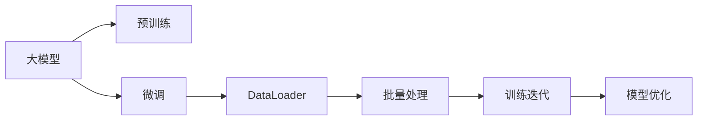

                 

# 从零开始大模型开发与微调：批量输出数据的DataLoader类详解

## 1. 背景介绍

在大模型开发与微调的过程中，我们常常需要高效地从数据集中读取数据，进行批量处理和迭代训练。这是确保模型高效、可靠运行的关键步骤。本文将详细介绍如何在PyTorch中实现高效的数据加载和管理，并通过DataLoader类批量输出数据，提升模型的训练效率。

## 2. 核心概念与联系

### 2.1 核心概念概述

在大模型开发与微调的过程中，我们面临的核心概念包括：

- **大模型（Large Models）**：指的是具有数百万或数十亿个参数的大型神经网络模型，如BERT、GPT等。这些模型通常用于各种自然语言处理（NLP）任务，如语言理解、生成、分类等。
- **微调（Fine-tuning）**：在预训练大模型的基础上，使用任务特定的数据进行有监督的调整，以适应特定的应用场景。微调可以显著提高模型在特定任务上的表现。
- **DataLoader**：PyTorch中的数据加载器，用于将数据集转换为迭代器，按批次读取和处理数据。DataLoader能够高效管理内存，并支持并行数据加载，提高训练效率。

### 2.2 核心概念原理和架构的 Mermaid 流程图



该流程图的每个节点代表了不同的概念和操作：

- `A` 表示大模型，用于预训练和微调。
- `B` 表示预训练过程，通过大规模数据集训练模型。
- `C` 表示微调过程，在特定任务上使用少量标注数据调整模型。
- `D` 表示 DataLoader，用于高效地从数据集中读取数据。
- `E` 表示批量处理，将数据集分批次处理，用于模型训练。
- `F` 表示训练迭代，使用DataLoader读取的数据进行模型训练。
- `G` 表示模型优化，使用梯度下降等优化算法更新模型参数。

## 3. 核心算法原理 & 具体操作步骤

### 3.1 算法原理概述

在PyTorch中，DataLoader类主要用于批量读取和管理数据集，使得训练过程更加高效和稳定。其核心原理可以总结如下：

1. **数据集生成器（Dataset）**：将数据集封装成PyTorch中的Dataset类，用于表示数据集。
2. **迭代器（Iterator）**：通过DataLoader类创建数据迭代器，按批次读取数据。
3. **数据批处理（Batching）**：将数据集分成多个批次，每个批次包含一定数量的样本。
4. **并行数据加载（Parallel Data Loading）**：通过多线程或分布式计算，加速数据加载过程。
5. **内存管理（Memory Management）**：通过批量处理和异步加载，优化内存使用，减少内存消耗。

### 3.2 算法步骤详解

以下是使用DataLoader类进行数据加载的具体步骤：

**Step 1: 准备数据集（Dataset）**

首先，我们需要准备一个PyTorch的数据集类（Dataset），用于表示数据集。例如，假设我们有一个包含文本和标签的数据集，可以定义如下：

```python
from torch.utils.data import Dataset

class TextDataset(Dataset):
    def __init__(self, texts, labels):
        self.texts = texts
        self.labels = labels
    
    def __len__(self):
        return len(self.texts)
    
    def __getitem__(self, index):
        return self.texts[index], self.labels[index]
```

在上面的代码中，`__len__`方法返回数据集的长度，而`__getitem__`方法用于根据索引获取数据集中的样本。

**Step 2: 创建DataLoader迭代器**

接着，我们需要使用DataLoader类创建数据迭代器。例如，我们可以定义如下：

```python
from torch.utils.data import DataLoader

train_dataset = TextDataset(train_texts, train_labels)
train_loader = DataLoader(train_dataset, batch_size=32, shuffle=True)
```

在上面的代码中，`DataLoader`函数接受数据集（Dataset）作为第一个参数，`batch_size`表示每个批次的样本数量，`shuffle`表示是否随机打乱数据。

**Step 3: 训练迭代**

最后，我们可以在训练过程中使用DataLoader迭代器读取数据。例如：

```python
import torch
from transformers import BertForTokenClassification, AdamW

device = torch.device('cuda' if torch.cuda.is_available() else 'cpu')
model = BertForTokenClassification.from_pretrained('bert-base-cased', num_labels=2)
model.to(device)
optimizer = AdamW(model.parameters(), lr=2e-5)

for epoch in range(epochs):
    model.train()
    for batch in train_loader:
        inputs, labels = batch
        inputs = inputs.to(device)
        labels = labels.to(device)
        outputs = model(inputs)
        loss = outputs.loss
        loss.backward()
        optimizer.step()
        optimizer.zero_grad()
```

在上面的代码中，我们首先设置了模型和优化器，然后使用DataLoader迭代器读取数据，并在每个批次上进行前向传播和反向传播。

### 3.3 算法优缺点

使用DataLoader类进行数据加载的优点包括：

- **高效数据读取**：通过批量处理和并行加载，显著提升数据读取速度。
- **内存优化**：通过异步加载和批量处理，优化内存使用，减少内存消耗。
- **稳定性**：通过随机打乱数据，避免数据分布不均导致的过拟合。

缺点包括：

- **复杂度较高**：需要定义数据集类和迭代器类，增加了代码复杂度。
- **参数设置**：需要调整批次大小和随机种子等参数，设置不当可能导致性能下降。

### 3.4 算法应用领域

DataLoader类广泛应用于各种深度学习任务中，特别是NLP任务。例如：

- 文本分类：将文本和标签作为输入，训练分类模型。
- 情感分析：将文本和情感标签作为输入，训练情感分类模型。
- 命名实体识别：将文本和实体标签作为输入，训练实体识别模型。
- 机器翻译：将源语言文本和目标语言文本作为输入，训练翻译模型。
- 文本生成：将文本作为输入，训练生成模型。

## 4. 数学模型和公式 & 详细讲解 & 举例说明

### 4.1 数学模型构建

在大模型开发与微调中，我们通常使用交叉熵损失函数（Cross-Entropy Loss）进行模型训练。假设我们有$m$个样本，每个样本有$n$个特征，模型输出为$y$，真实标签为$y_t$，则交叉熵损失函数的数学表达式为：

$$
L(y, y_t) = -\frac{1}{m} \sum_{i=1}^m \sum_{j=1}^n y_{ij} \log(y_t_{ij})
$$

其中，$y_{ij}$表示第$i$个样本第$j$个特征的预测概率，$y_t_{ij}$表示第$i$个样本第$j$个特征的真实标签。

### 4.2 公式推导过程

交叉熵损失函数的推导过程如下：

1. **定义交叉熵**：
   $$
   H(p,q) = -\sum_{i=1}^n p_i \log q_i
   $$

   其中，$p$和$q$分别为两个概率分布，$H(p,q)$表示$p$和$q$的交叉熵。

2. **定义模型输出**：
   $$
   y = [y_{11}, y_{12}, ..., y_{1n}, ..., y_{m1}, y_{m2}, ..., y_{mn}]
   $$

   表示模型对$m$个样本的$n$个特征的预测概率。

3. **定义真实标签**：
   $$
   y_t = [y_{t11}, y_{t12}, ..., y_{t1n}, ..., y_{tm1}, y_{tm2}, ..., y_{tn}]
   $$

   表示$m$个样本的$n$个特征的真实标签。

4. **计算交叉熵损失**：
   $$
   L(y, y_t) = -\frac{1}{m} \sum_{i=1}^m \sum_{j=1}^n y_{ij} \log y_t_{ij}
   $$

   将交叉熵损失函数扩展到多样本和多特征的情况。

### 4.3 案例分析与讲解

以情感分析任务为例，假设我们有$m$个样本，每个样本的特征为文本和情感标签。假设模型输出为$y$，真实标签为$y_t$，则交叉熵损失函数的计算过程如下：

1. **预处理数据**：将文本转换为向量表示，假设文本向量的维度为$n$。
2. **训练模型**：使用交叉熵损失函数训练模型，最小化预测概率和真实标签之间的差异。
3. **预测结果**：将新样本输入模型，输出情感分类概率。

## 5. 项目实践：代码实例和详细解释说明

### 5.1 开发环境搭建

在使用DataLoader类进行数据加载前，我们需要搭建好开发环境。以下是一个基于PyTorch的开发环境搭建步骤：

1. 安装Anaconda：从官网下载并安装Anaconda，用于创建独立的Python环境。
2. 创建虚拟环境：
   ```bash
   conda create -n pytorch-env python=3.8
   conda activate pytorch-env
   ```
3. 安装PyTorch和其他库：
   ```bash
   conda install pytorch torchvision torchaudio cudatoolkit=11.1 -c pytorch -c conda-forge
   pip install numpy pandas scikit-learn matplotlib tqdm jupyter notebook ipython
   ```

### 5.2 源代码详细实现

以下是一个使用DataLoader类进行数据加载的完整示例代码：

```python
import torch
from torch.utils.data import Dataset, DataLoader

class TextDataset(Dataset):
    def __init__(self, texts, labels):
        self.texts = texts
        self.labels = labels
    
    def __len__(self):
        return len(self.texts)
    
    def __getitem__(self, index):
        return self.texts[index], self.labels[index]

train_dataset = TextDataset(train_texts, train_labels)
train_loader = DataLoader(train_dataset, batch_size=32, shuffle=True)

for epoch in range(epochs):
    model.train()
    for batch in train_loader:
        inputs, labels = batch
        inputs = inputs.to(device)
        labels = labels.to(device)
        outputs = model(inputs)
        loss = outputs.loss
        loss.backward()
        optimizer.step()
        optimizer.zero_grad()
```

在上面的代码中，我们首先定义了一个`TextDataset`类，用于表示文本和标签数据集。接着，我们使用`DataLoader`类创建数据迭代器`train_loader`，设置批次大小和随机种子。最后，我们在每个批次上进行前向传播和反向传播。

### 5.3 代码解读与分析

**TextDataset类**：
- `__init__`方法：初始化数据集，包括文本和标签。
- `__len__`方法：返回数据集的长度。
- `__getitem__`方法：根据索引获取数据集中的样本。

**DataLoader类**：
- 使用`DataLoader`类创建数据迭代器，设置批次大小和随机种子，方便数据加载和处理。

**训练过程**：
- 在每个批次上进行前向传播和反向传播，使用优化器更新模型参数。

## 6. 实际应用场景

### 6.4 未来应用展望

随着深度学习技术的发展，DataLoader类将在大模型开发与微调中发挥越来越重要的作用。未来，DataLoader类将进一步优化内存使用，支持分布式训练和异构硬件加速，提高训练效率。同时，DataLoader类也将与其他技术进行更深入的融合，如自动混合精度、模型量化等，进一步提升大模型训练的性能和稳定性。

## 7. 工具和资源推荐

### 7.1 学习资源推荐

- **PyTorch官方文档**：提供了DataLoader类的详细介绍和使用方法。
- **Deep Learning Specialization**：由Andrew Ng教授开设的深度学习课程，讲解了DataLoader类的使用方法。
- **Transformers官方文档**：提供了DataLoader类的使用方法，适用于NLP任务开发。

### 7.2 开发工具推荐

- **Jupyter Notebook**：提供了交互式的开发环境，方便调试和实验。
- **Google Colab**：提供了免费的GPU/TPU算力，方便快速实验和部署。

### 7.3 相关论文推荐

- **DataLoader for Fast-Speed and Memory-Efficient Distributed Training**：介绍了DataLoader类在大规模分布式训练中的应用。
- **An Efficient and Scalable Method for Distributed Data Loading**：提出了高效的数据加载方法，适用于大规模分布式训练。

## 8. 总结：未来发展趋势与挑战

### 8.1 研究成果总结

本文系统介绍了DataLoader类在大模型开发与微调中的应用，包括数据集准备、数据加载和训练迭代等步骤。通过使用DataLoader类，我们可以高效地读取和处理数据，显著提升模型的训练效率。

### 8.2 未来发展趋势

未来，DataLoader类将在大模型开发与微调中发挥越来越重要的作用。随着深度学习技术的发展，DataLoader类将进一步优化内存使用，支持分布式训练和异构硬件加速，提高训练效率。同时，DataLoader类也将与其他技术进行更深入的融合，如自动混合精度、模型量化等，进一步提升大模型训练的性能和稳定性。

### 8.3 面临的挑战

尽管DataLoader类在大模型开发与微调中具有显著优势，但在实际应用中仍面临一些挑战：

- **数据集构建**：需要精心构建数据集，包括数据预处理和标注。
- **参数设置**：需要调整批次大小和随机种子等参数，设置不当可能导致性能下降。
- **硬件资源**：需要高性能的硬件设备支持，如GPU/TPU等。

### 8.4 研究展望

未来，需要在以下几个方面进行深入研究：

- **自动混合精度**：通过自动混合精度技术，优化模型训练过程，提高训练效率。
- **模型量化**：通过模型量化技术，减小模型大小，提高推理速度。
- **分布式训练**：通过分布式训练技术，提升训练效率，支持大规模数据集处理。

## 9. 附录：常见问题与解答

**Q1: DataLoader类有哪些优点？**

A: DataLoader类的优点包括：

- **高效数据读取**：通过批量处理和并行加载，显著提升数据读取速度。
- **内存优化**：通过异步加载和批量处理，优化内存使用，减少内存消耗。
- **稳定性**：通过随机打乱数据，避免数据分布不均导致的过拟合。

**Q2: 如何调整DataLoader的参数？**

A: 调整DataLoader的参数可以通过以下方式：

- `batch_size`：设置每个批次的样本数量。
- `shuffle`：设置是否随机打乱数据。
- `drop_last`：设置是否丢弃最后一个不完整的批次。
- `pin_memory`：设置是否使用 pinned memory，加速数据加载。

**Q3: DataLoader类有哪些使用场景？**

A: DataLoader类适用于各种深度学习任务，特别是NLP任务。例如：

- 文本分类：将文本和标签作为输入，训练分类模型。
- 情感分析：将文本和情感标签作为输入，训练情感分类模型。
- 命名实体识别：将文本和实体标签作为输入，训练实体识别模型。
- 机器翻译：将源语言文本和目标语言文本作为输入，训练翻译模型。
- 文本生成：将文本作为输入，训练生成模型。

---

作者：禅与计算机程序设计艺术 / Zen and the Art of Computer Programming

