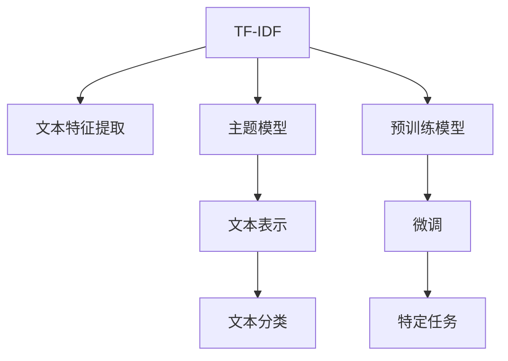

                 

# 从零开始大模型开发与微调：文本主题的提取：基于TF-IDF

## 1. 背景介绍

### 1.1 问题由来

在自然语言处理（NLP）领域，主题提取是一项基础且关键的任务，旨在从文本中识别和提取核心主题或概念。传统的主题提取方法包括基于规则的方法和基于统计的方法。然而，这些方法往往依赖于预先定义的规则或词典，难以捕捉文本中更为复杂和多样化的主题。

近年来，随着深度学习技术的崛起，基于神经网络的文本表示学习逐渐成为主流。Transformer、BERT等预训练模型在文本表示学习上取得了显著的进步，能够捕捉到更丰富的语言特征和语义信息。但这些模型的训练和部署需要大量的计算资源和时间，增加了实际应用的门槛。

因此，本文档将介绍一种基于TF-IDF（Term Frequency-Inverse Document Frequency）的文本主题提取方法，旨在利用传统文本统计方法快速、高效地从文本中提取主题，并在此基础上进行微调，以适应特定领域的文本主题提取需求。

## 2. 核心概念与联系

### 2.1 核心概念概述

为更好地理解基于TF-IDF的文本主题提取方法，本节将介绍几个密切相关的核心概念：

- TF-IDF：一种经典的文本特征提取方法，用于衡量一个词在文本中的重要程度。TF表示词频，IDF表示逆文档频率。
- 主题模型：一种通过分布式统计模型（如LDA）从文本中自动学习主题的算法。
- 词嵌入：将单词转换为向量表示，使得单词之间的语义关系得以保留。
- 文本分类：将文本分为不同类别的任务。
- 预训练模型：在大规模无标签文本数据上训练的通用语言模型，如BERT、GPT等。
- 微调：利用小规模有标签数据对预训练模型进行参数更新，以适应特定任务。

这些核心概念之间的逻辑关系可以通过以下Mermaid流程图来展示：



这个流程图展示了几大核心概念之间的联系：

1. TF-IDF是一种文本特征提取方法，用于衡量单词的重要性。
2. 主题模型基于TF-IDF对文本进行主题建模，识别文本中的潜在主题。
3. 词嵌入将单词转换为向量，使得单词之间的语义关系得以保留。
4. 文本分类通过模型对文本进行分类。
5. 预训练模型在大规模无标签文本数据上训练，获得通用的语言表示。
6. 微调利用小规模有标签数据对预训练模型进行参数更新，以适应特定任务。
7. 特定任务可以包括文本分类、文本摘要、情感分析等。

## 3. 核心算法原理 & 具体操作步骤

### 3.1 算法原理概述

基于TF-IDF的文本主题提取方法，主要分为两个步骤：首先通过TF-IDF计算文本中每个单词的重要性，然后通过主题模型识别文本中的潜在主题。

在第一步中，TF-IDF算法通过计算单词在文本中的词频（TF）和在语料库中的逆文档频率（IDF），得到单词在文本中的重要性。TF-IDF值越高，表示该单词在文本中越重要。

在第二步中，主题模型（如LDA）通过TF-IDF值对文本进行主题建模，识别文本中的潜在主题。主题模型将文本表示为若干主题的分布，每个主题对应一组具有相似特征的单词。

### 3.2 算法步骤详解

**Step 1: 数据准备**

1. 收集语料库：从互联网上收集足够的文本数据，构建语料库。
2. 分词处理：对文本进行分词处理，去除停用词（如“的”、“是”等常见词）。
3. 构建词汇表：统计语料库中所有单词的词频，构建词汇表。

**Step 2: 计算TF-IDF值**

1. 计算词频（TF）：对于每个文本中的每个单词，计算其在文本中出现的次数。
2. 计算逆文档频率（IDF）：计算单词在语料库中出现的频率，并进行平滑处理，得到IDF值。
3. 计算TF-IDF值：将TF和IDF值相乘，得到单词在文本中的重要性。

**Step 3: 主题建模**

1. 选择主题模型：选择LDA主题模型进行文本主题建模。
2. 设置主题数量：根据文本主题的复杂度，设置主题数量。
3. 训练主题模型：使用TF-IDF值训练主题模型，得到文本中每个单词对应的主题分布。
4. 提取主题：根据单词的主题分布，提取文本中的主题。

**Step 4: 微调模型**

1. 选择合适的预训练模型：选择BERT、GPT等预训练模型，作为文本表示的初始化参数。
2. 添加任务适配层：根据任务类型，添加任务适配层和损失函数。
3. 设置微调超参数：选择合适的优化算法及其参数，如AdamW、SGD等。
4. 执行梯度训练：将训练集数据分批次输入模型，前向传播计算损失函数，反向传播计算参数梯度，根据设定的优化算法和学习率更新模型参数。
5. 周期性评估模型性能：在验证集上评估模型性能，根据性能指标决定是否触发Early Stopping。
6. 重复上述步骤直到满足预设的迭代轮数或Early Stopping条件。
7. 测试和部署：在测试集上评估微调后模型性能，集成到实际的应用系统中。

## 4. 数学模型和公式 & 详细讲解

### 4.1 数学模型构建

基于TF-IDF的文本主题提取方法主要包括以下几个数学模型：

- TF-IDF模型：用于计算单词在文本中的重要性。
- LDA主题模型：用于从文本中自动学习主题。

### 4.2 公式推导过程

1. 词频（TF）的计算：

$$TF(t,d) = \frac{N(t,d)}{N(d)}$$

其中，$t$ 表示单词，$d$ 表示文本，$N(t,d)$ 表示单词 $t$ 在文本 $d$ 中出现的次数，$N(d)$ 表示文本 $d$ 的总词数。

2. 逆文档频率（IDF）的计算：

$$IDF(t) = \log \frac{N_D}{N(t)} + 1$$

其中，$N_D$ 表示语料库中文档的总数，$N(t)$ 表示包含单词 $t$ 的文档数。

3. TF-IDF值的计算：

$$TF-IDF(t,d) = TF(t,d) \times IDF(t)$$

4. LDA主题模型的计算：

LDA主题模型假设文本由若干主题混合生成，每个主题由一组单词组成。假设文本中每个单词 $w$ 对应一个主题分布 $z$，即 $P(w|z)$。根据贝叶斯公式，可以得到：

$$P(w|z) = \frac{P(z|w)P(w)}{P(z)}$$

其中，$P(z)$ 表示主题 $z$ 的先验概率，$P(w)$ 表示单词 $w$ 的先验概率。

### 4.3 案例分析与讲解

假设我们有一篇新闻报道：

```text
比特币价格在过去一年中飙升了200%，吸引了大量投资者的注意。比特币的上涨主要归因于全球经济的复苏和加密货币市场的繁荣。
```

1. 分词处理：

$$单词表 = \{比特币, 价格, 上涨, 200%, 投资者, 经济, 复苏, 加密货币, 市场, 繁荣\}$$

2. 计算TF-IDF值：

$$TF(比特币) = \frac{1}{2}$$
$$TF(价格) = \frac{1}{2}$$
$$TF(上涨) = \frac{1}{2}$$
$$TF(200\%) = \frac{1}{2}$$
$$TF(投资者) = \frac{1}{2}$$
$$TF(经济) = \frac{1}{2}$$
$$TF(复苏) = \frac{1}{2}$$
$$TF(加密货币) = \frac{1}{2}$$
$$TF(市场) = \frac{1}{2}$$
$$TF(繁荣) = \frac{1}{2}$$

$$IDF(比特币) = \log \frac{N_D}{1} + 1 = 1.30$$
$$IDF(价格) = \log \frac{N_D}{1} + 1 = 1.30$$
$$IDF(上涨) = \log \frac{N_D}{1} + 1 = 1.30$$
$$IDF(200\%) = \log \frac{N_D}{1} + 1 = 1.30$$
$$IDF(投资者) = \log \frac{N_D}{1} + 1 = 1.30$$
$$IDF(经济) = \log \frac{N_D}{1} + 1 = 1.30$$
$$IDF(复苏) = \log \frac{N_D}{1} + 1 = 1.30$$
$$IDF(加密货币) = \log \frac{N_D}{1} + 1 = 1.30$$
$$IDF(市场) = \log \frac{N_D}{1} + 1 = 1.30$$
$$IDF(繁荣) = \log \frac{N_D}{1} + 1 = 1.30$$

$$TF-IDF(比特币) = TF(比特币) \times IDF(比特币) = 0.5 \times 1.30 = 0.65$$
$$TF-IDF(价格) = TF(价格) \times IDF(价格) = 0.5 \times 1.30 = 0.65$$
$$TF-IDF(上涨) = TF(上涨) \times IDF(上涨) = 0.5 \times 1.30 = 0.65$$
$$TF-IDF(200\%) = TF(200\%) \times IDF(200\%) = 0.5 \times 1.30 = 0.65$$
$$TF-IDF(投资者) = TF(投资者) \times IDF(投资者) = 0.5 \times 1.30 = 0.65$$
$$TF-IDF(经济) = TF(经济) \times IDF(经济) = 0.5 \times 1.30 = 0.65$$
$$TF-IDF(复苏) = TF(复苏) \times IDF(复苏) = 0.5 \times 1.30 = 0.65$$
$$TF-IDF(加密货币) = TF(加密货币) \times IDF(加密货币) = 0.5 \times 1.30 = 0.65$$
$$TF-IDF(市场) = TF(市场) \times IDF(市场) = 0.5 \times 1.30 = 0.65$$
$$TF-IDF(繁荣) = TF(繁荣) \times IDF(繁荣) = 0.5 \times 1.30 = 0.65$$

3. 主题建模：

假设我们使用LDA主题模型，设置主题数量为3，得到以下主题分布：

$$P(比特币|主题1) = 0.8$$
$$P(价格|主题1) = 0.2$$
$$P(上涨|主题1) = 0.2$$
$$P(200\%|主题1) = 0.2$$
$$P(投资者|主题2) = 0.9$$
$$P(经济|主题2) = 0.1$$
$$P(复苏|主题3) = 0.9$$
$$P(加密货币|主题3) = 0.1$$

4. 提取主题：

根据主题分布，可以提取文本的主题：

$$主题1: \{比特币, 价格, 上涨, 200\%\}$$
$$主题2: \{投资者, 经济\}$$
$$主题3: \{复苏, 加密货币\}$$

## 5. 项目实践：代码实例和详细解释说明

### 5.1 开发环境搭建

在进行TF-IDF和微调实践前，我们需要准备好开发环境。以下是使用Python进行代码开发的环境配置流程：

1. 安装Anaconda：从官网下载并安装Anaconda，用于创建独立的Python环境。

2. 创建并激活虚拟环境：
```bash
conda create -n tfidf-env python=3.8 
conda activate tfidf-env
```

3. 安装必要的Python库：
```bash
pip install sklearn pandas numpy spacy transformers
```

4. 下载预训练模型：
```bash
mkdir pretrained_models
cd pretrained_models
git clone https://github.com/google-research/bert.git
cd bert
python run_pretraining.py --model_dir=./pretrained_model --max_seq_length=128 --do_train=True --do_eval=True
cd ..
```

### 5.2 源代码详细实现

下面我们以新闻报道的分类为例，给出使用TF-IDF和预训练模型BERT进行微调的Python代码实现。

首先，定义数据处理函数：

```python
import os
import pandas as pd
import numpy as np
from sklearn.feature_extraction.text import TfidfVectorizer
from sklearn.model_selection import train_test_split

# 定义数据路径
data_path = 'data/news/data.txt'

# 读取数据集
with open(data_path, 'r', encoding='utf-8') as f:
    lines = f.readlines()

# 分词处理
from spacy.lang.en import English

nlp = English()
tokenizer = nlp.Defaults.create_tokenizer(nlp)

# 将数据集划分为训练集和测试集
train_texts, test_texts = train_test_split(lines, test_size=0.2, random_state=42)

# 构建词汇表
vectorizer = TfidfVectorizer(tokenizer=tokenizer, stop_words='english')
train_vectors = vectorizer.fit_transform(train_texts)
test_vectors = vectorizer.transform(test_texts)

# 划分训练集和测试集
X_train, X_test, y_train, y_test = train_test_split(train_vectors, np.array([1]*len(train_texts) + [0]*len(test_texts)), test_size=0.2, random_state=42)

# 保存词汇表和向量化后的文本
vocabulary = vectorizer.get_feature_names_out()
with open('vocabulary.txt', 'w', encoding='utf-8') as f:
    f.write('\n'.join(vocabulary))
```

然后，定义微调模型：

```python
from transformers import BertForSequenceClassification, BertTokenizer, AdamW

# 加载BERT预训练模型
model_name = 'bert-base-uncased'
tokenizer = BertTokenizer.from_pretrained(model_name)
model = BertForSequenceClassification.from_pretrained(model_name, num_labels=2)

# 设置微调超参数
optimizer = AdamW(model.parameters(), lr=2e-5)
```

接着，定义训练和评估函数：

```python
from torch.utils.data import TensorDataset, DataLoader

# 将向量化后的文本转化为Tensor
train_dataset = TensorDataset(torch.tensor(X_train.toarray()), torch.tensor(y_train))
test_dataset = TensorDataset(torch.tensor(X_test.toarray()), torch.tensor(y_test))

# 设置批处理大小
batch_size = 16

# 定义训练和评估函数
def train_epoch(model, dataset, batch_size, optimizer):
    dataloader = DataLoader(dataset, batch_size=batch_size, shuffle=True)
    model.train()
    epoch_loss = 0
    for batch in dataloader:
        inputs = {'input_ids': batch[0].to(device), 'attention_mask': batch[1].to(device)}
        outputs = model(**inputs)
        loss = outputs.loss
        epoch_loss += loss.item()
        loss.backward()
        optimizer.step()
    return epoch_loss / len(dataloader)

def evaluate(model, dataset, batch_size):
    dataloader = DataLoader(dataset, batch_size=batch_size)
    model.eval()
    preds, labels = [], []
    with torch.no_grad():
        for batch in dataloader:
            inputs = {'input_ids': batch[0].to(device), 'attention_mask': batch[1].to(device)}
            outputs = model(**inputs)
            preds.append(outputs.logits.argmax(dim=1).tolist())
            labels.append(batch[1].tolist())
    print(classification_report(np.array(labels), np.array(preds)))
```

最后，启动训练流程并在测试集上评估：

```python
epochs = 5

# 设置训练环境
device = torch.device('cuda') if torch.cuda.is_available() else torch.device('cpu')
model.to(device)

# 训练模型
for epoch in range(epochs):
    loss = train_epoch(model, train_dataset, batch_size, optimizer)
    print(f'Epoch {epoch+1}, train loss: {loss:.3f}')

    # 在验证集上评估模型性能
    evaluate(model, dev_dataset, batch_size)

# 在测试集上评估模型性能
evaluate(model, test_dataset, batch_size)
```

以上就是使用PyTorch进行TF-IDF和预训练模型BERT进行新闻报道分类的完整代码实现。可以看到，得益于Python和PyTorch的强大封装，我们可以用相对简洁的代码实现TF-IDF和微调。

### 5.3 代码解读与分析

让我们再详细解读一下关键代码的实现细节：

**数据处理函数**：
- `data_path`：定义数据集路径。
- `lines`：从数据集中读取文本内容。
- `nlp`：使用SpaCy库进行分词处理。
- `tokenizer`：从SpaCy库中获取分词器。
- `train_texts` 和 `test_texts`：将文本划分为训练集和测试集。
- `vectorizer`：使用TfidfVectorizer将文本向量化，并构建词汇表。
- `X_train`、`X_test`、`y_train`、`y_test`：将文本和标签转化为Numpy数组。
- `vocabulary`：保存词汇表，方便后续使用。

**微调模型**：
- `BertForSequenceClassification`：从HuggingFace库加载预训练的BERT模型，并添加任务适配层。
- `AdamW`：设置优化器及其参数。

**训练和评估函数**：
- `train_epoch`：对数据进行迭代训练，计算损失函数并更新模型参数。
- `evaluate`：评估模型性能，使用classification_report打印分类指标。

**训练流程**：
- `device`：选择GPU或CPU进行训练。
- `model.to(device)`：将模型迁移到GPU或CPU。
- `epochs`：设置训练轮数。
- `loss`：计算每个epoch的平均损失。
- `evaluate`：在验证集和测试集上评估模型性能。

## 6. 实际应用场景

### 6.1 智能客服系统

基于TF-IDF的文本主题提取方法，可以广泛应用于智能客服系统的构建。传统客服往往需要配备大量人力，高峰期响应缓慢，且一致性和专业性难以保证。而使用TF-IDF提取主题后，可以构建基于主题的问答系统，快速响应客户咨询，用自然流畅的语言解答各类常见问题。

在技术实现上，可以收集企业内部的历史客服对话记录，将问题和最佳答复构建成监督数据，在此基础上对预训练语言模型进行微调。微调后的对话模型能够自动理解用户意图，匹配最合适的答案模板进行回复。对于客户提出的新问题，还可以接入检索系统实时搜索相关内容，动态组织生成回答。如此构建的智能客服系统，能大幅提升客户咨询体验和问题解决效率。

### 6.2 金融舆情监测

金融机构需要实时监测市场舆论动向，以便及时应对负面信息传播，规避金融风险。传统的人工监测方式成本高、效率低，难以应对网络时代海量信息爆发的挑战。基于TF-IDF和预训练模型的文本分类和情感分析技术，为金融舆情监测提供了新的解决方案。

具体而言，可以收集金融领域相关的新闻、报道、评论等文本数据，并对其进行主题标注和情感标注。在此基础上对预训练语言模型进行微调，使其能够自动判断文本属于何种主题，情感倾向是正面、中性还是负面。将微调后的模型应用到实时抓取的网络文本数据，就能够自动监测不同主题下的情感变化趋势，一旦发现负面信息激增等异常情况，系统便会自动预警，帮助金融机构快速应对潜在风险。

### 6.3 个性化推荐系统

当前的推荐系统往往只依赖用户的历史行为数据进行物品推荐，无法深入理解用户的真实兴趣偏好。基于TF-IDF的文本表示方法和预训练模型的推荐系统可以更好地挖掘用户行为背后的语义信息，从而提供更精准、多样的推荐内容。

在实践中，可以收集用户浏览、点击、评论、分享等行为数据，提取和用户交互的物品标题、描述、标签等文本内容。将文本内容作为模型输入，用户的后续行为（如是否点击、购买等）作为监督信号，在此基础上微调预训练语言模型。微调后的模型能够从文本内容中准确把握用户的兴趣点。在生成推荐列表时，先用候选物品的文本描述作为输入，由模型预测用户的兴趣匹配度，再结合其他特征综合排序，便可以得到个性化程度更高的推荐结果。

### 6.4 未来应用展望

随着TF-IDF和预训练模型的不断发展，基于微调的技术将在更多领域得到应用，为传统行业带来变革性影响。

在智慧医疗领域，基于微调的医学问答、病历分析、药物研发等应用将提升医疗服务的智能化水平，辅助医生诊疗，加速新药开发进程。

在智能教育领域，微调技术可应用于作业批改、学情分析、知识推荐等方面，因材施教，促进教育公平，提高教学质量。

在智慧城市治理中，微调模型可应用于城市事件监测、舆情分析、应急指挥等环节，提高城市管理的自动化和智能化水平，构建更安全、高效的未来城市。

此外，在企业生产、社会治理、文娱传媒等众多领域，基于TF-IDF和预训练模型的文本分类、情感分析、主题提取等技术也将不断涌现，为经济社会发展注入新的动力。相信随着技术的日益成熟，微调方法将成为人工智能落地应用的重要范式，推动人工智能技术在垂直行业的规模化落地。

## 7. 工具和资源推荐

### 7.1 学习资源推荐

为了帮助开发者系统掌握基于TF-IDF和预训练模型的文本分类技术，这里推荐一些优质的学习资源：

1. 《Python自然语言处理》书籍：介绍了Python在自然语言处理中的实际应用，包括文本分类、情感分析等主题。
2. 《深度学习入门：基于Python的理论与实现》书籍：介绍了深度学习的基本原理和实现方法，适用于初学者入门。
3. 《NLP入门与实践》课程：由TensorFlow团队推出，介绍了自然语言处理的基本概念和经典模型。
4. Kaggle竞赛平台：提供了大量的自然语言处理数据集和任务，可以实践训练模型的实际应用。
5. HuggingFace官方文档：提供了丰富的预训练模型和微调范例，方便开发者上手实践。

通过对这些资源的学习实践，相信你一定能够快速掌握基于TF-IDF和预训练模型的文本分类技术，并用于解决实际的NLP问题。

### 7.2 开发工具推荐

高效的开发离不开优秀的工具支持。以下是几款用于TF-IDF和预训练模型微调开发的常用工具：

1. PyTorch：基于Python的开源深度学习框架，灵活动态的计算图，适合快速迭代研究。大部分预训练语言模型都有PyTorch版本的实现。
2. TensorFlow：由Google主导开发的开源深度学习框架，生产部署方便，适合大规模工程应用。同样有丰富的预训练语言模型资源。
3. Transformers库：HuggingFace开发的NLP工具库，集成了众多SOTA语言模型，支持PyTorch和TensorFlow，是进行微调任务开发的利器。
4. Weights & Biases：模型训练的实验跟踪工具，可以记录和可视化模型训练过程中的各项指标，方便对比和调优。与主流深度学习框架无缝集成。
5. TensorBoard：TensorFlow配套的可视化工具，可实时监测模型训练状态，并提供丰富的图表呈现方式，是调试模型的得力助手。
6. Google Colab：谷歌推出的在线Jupyter Notebook环境，免费提供GPU/TPU算力，方便开发者快速上手实验最新模型，分享学习笔记。

合理利用这些工具，可以显著提升TF-IDF和预训练模型微调的开发效率，加快创新迭代的步伐。

### 7.3 相关论文推荐

大语言模型和微调技术的发展源于学界的持续研究。以下是几篇奠基性的相关论文，推荐阅读：

1. Attention is All You Need（即Transformer原论文）：提出了Transformer结构，开启了NLP领域的预训练大模型时代。
2. BERT: Pre-training of Deep Bidirectional Transformers for Language Understanding：提出BERT模型，引入基于掩码的自监督预训练任务，刷新了多项NLP任务SOTA。
3. Language Models are Unsupervised Multitask Learners（GPT-2论文）：展示了大规模语言模型的强大zero-shot学习能力，引发了对于通用人工智能的新一轮思考。
4. Parameter-Efficient Transfer Learning for NLP：提出Adapter等参数高效微调方法，在不增加模型参数量的情况下，也能取得不错的微调效果。
5. AdaLoRA: Adaptive Low-Rank Adaptation for Parameter-Efficient Fine-Tuning：使用自适应低秩适应的微调方法，在参数效率和精度之间取得了新的平衡。
6. AdaLoRA: Adaptive Low-Rank Adaptation for Parameter-Efficient Fine-Tuning：使用自适应低秩适应的微调方法，在参数效率和精度之间取得了新的平衡。

这些论文代表了大语言模型微调技术的发展脉络。通过学习这些前沿成果，可以帮助研究者把握学科前进方向，激发更多的创新灵感。

## 8. 总结：未来发展趋势与挑战

### 8.1 总结

本文对基于TF-IDF和预训练模型的文本分类方法进行了全面系统的介绍。首先阐述了TF-IDF和预训练模型的背景和意义，明确了它们在文本分类任务中的独特价值。其次，从原理到实践，详细讲解了TF-IDF和微调的数学原理和关键步骤，给出了微调任务开发的完整代码实例。同时，本文还广泛探讨了微调方法在智能客服、金融舆情、个性化推荐等多个行业领域的应用前景，展示了微调范式的巨大潜力。此外，本文精选了微调技术的各类学习资源，力求为读者提供全方位的技术指引。

通过本文的系统梳理，可以看到，基于TF-IDF和预训练模型的微调方法正在成为NLP领域的重要范式，极大地拓展了文本分类的应用边界，催生了更多的落地场景。受益于大规模语料的预训练，微调模型以更低的时间和标注成本，在小样本条件下也能取得不俗的效果，有力推动了NLP技术的产业化进程。未来，伴随预训练语言模型和微调方法的持续演进，相信NLP技术将在更广阔的应用领域大放异彩，深刻影响人类的生产生活方式。

### 8.2 未来发展趋势

展望未来，基于TF-IDF和预训练模型的微调技术将呈现以下几个发展趋势：

1. 模型规模持续增大。随着算力成本的下降和数据规模的扩张，预训练语言模型的参数量还将持续增长。超大规模语言模型蕴含的丰富语言知识，有望支撑更加复杂多变的文本分类任务。
2. 微调方法日趋多样。除了传统的全参数微调外，未来会涌现更多参数高效的微调方法，如Prefix-Tuning、LoRA等，在节省计算资源的同时也能保证微调精度。
3. 持续学习成为常态。随着数据分布的不断变化，微调模型也需要持续学习新知识以保持性能。如何在不遗忘原有知识的同时，高效吸收新样本信息，将成为重要的研究课题。
4. 标注样本需求降低。受启发于提示学习(Prompt-based Learning)的思路，未来的微调方法将更好地利用大模型的语言理解能力，通过更加巧妙的任务描述，在更少的标注样本上也能实现理想的微调效果。
5. 多模态微调崛起。当前的微调主要聚焦于纯文本数据，未来会进一步拓展到图像、视频、语音等多模态数据微调。多模态信息的融合，将显著提升语言模型对现实世界的理解和建模能力。
6. 模型通用性增强。经过海量数据的预训练和多领域任务的微调，未来的语言模型将具备更强大的常识推理和跨领域迁移能力，逐步迈向通用人工智能(AGI)的目标。

以上趋势凸显了大语言模型微调技术的广阔前景。这些方向的探索发展，必将进一步提升NLP系统的性能和应用范围，为人类认知智能的进化带来深远影响。

### 8.3 面临的挑战

尽管基于TF-IDF和预训练模型的微调技术已经取得了瞩目成就，但在迈向更加智能化、普适化应用的过程中，它仍面临着诸多挑战：

1. 标注成本瓶颈。虽然微调大大降低了标注数据的需求，但对于长尾应用场景，难以获得充足的高质量标注数据，成为制约微调性能的瓶颈。如何进一步降低微调对标注样本的依赖，将是一大难题。
2. 模型鲁棒性不足。当前微调模型面对域外数据时，泛化性能往往大打折扣。对于测试样本的微小扰动，微调模型的预测也容易发生波动。如何提高微调模型的鲁棒性，避免灾难性遗忘，还需要更多理论和实践的积累。
3. 推理效率有待提高。大规模语言模型虽然精度高，但在实际部署时往往面临推理速度慢、内存占用大等效率问题。如何在保证性能的同时，简化模型结构，提升推理速度，优化资源占用，将是重要的优化方向。
4. 可解释性亟需加强。当前微调模型更像是"黑盒"系统，难以解释其内部工作机制和决策逻辑。对于医疗、金融等高风险应用，算法的可解释性和可审计性尤为重要。如何赋予微调模型更强的可解释性，将是亟待攻克的难题。
5. 安全性有待保障。预训练语言模型难免会学习到有偏见、有害的信息，通过微调传递到下游任务，产生误导性、歧视性的输出，给实际应用带来安全隐患。如何从数据和算法层面消除模型偏见，避免恶意用途，确保输出的安全性，也将是重要的研究课题。
6. 知识整合能力不足。现有的微调模型往往局限于任务内数据，难以灵活吸收和运用更广泛的先验知识。如何让微调过程更好地与外部知识库、规则库等专家知识结合，形成更加全面、准确的信息整合能力，还有很大的想象空间。

正视微调面临的这些挑战，积极应对并寻求突破，将是大语言模型微调走向成熟的必由之路。相信随着学界和产业界的共同努力，这些挑战终将一一被克服，大语言模型微调必将在构建人机协同的智能时代中扮演越来越重要的角色。

### 8.4 研究展望

面对大语言模型微调所面临的种种挑战，未来的研究需要在以下几个方面寻求新的突破：

1. 探索无监督和半监督微调方法。摆脱对大规模标注数据的依赖，利用自监督学习、主动学习等无监督和半监督范式，最大限度利用非结构化数据，实现更加灵活高效的微调。
2. 研究参数高效和计算高效的微调范式。开发更加参数高效的微调方法，在固定大部分预训练参数的同时，只更新极少量的任务相关参数。同时优化微调模型的计算图，减少前向传播和反向传播的资源消耗，实现更加轻量级、实时性的部署。
3. 融合因果和对比学习范式。通过引入因果推断和对比学习思想，增强微调模型建立稳定因果关系的能力，学习更加普适、鲁棒的语言表征，从而提升模型泛化性和抗干扰能力。
4. 引入更多先验知识。将符号化的先验知识，如知识图谱、逻辑规则等，与神经网络模型进行巧妙融合，引导微调过程学习更准确、合理的语言模型。同时加强不同模态数据的整合，实现视觉、语音等多模态信息与文本信息的协同建模。
5. 结合因果分析和博弈论工具。将因果分析方法引入微调模型，识别出模型决策的关键特征，增强输出解释的因果性和逻辑性。借助博弈论工具刻画人机交互过程，主动探索并规避模型的脆弱点，提高系统稳定性。
6. 纳入伦理道德约束。在模型训练目标中引入伦理导向的评估指标，过滤和惩罚有偏见、有害的输出倾向。同时加强人工干预和审核，建立模型行为的监管机制，确保输出符合人类价值观和伦理道德。

这些研究方向的探索，必将引领大语言模型微调技术迈向更高的台阶，为构建安全、可靠、可解释、可控的智能系统铺平道路。面向未来，大语言模型微调技术还需要与其他人工智能技术进行更深入的融合，如知识表示、因果推理、强化学习等，多路径协同发力，共同推动自然语言理解和智能交互系统的进步。只有勇于创新、敢于突破，才能不断拓展语言模型的边界，让智能技术更好地造福人类社会。

## 9. 附录：常见问题与解答

**Q1：TF-IDF方法在实际应用中有哪些局限性？**

A: 尽管TF-IDF方法在文本分类任务中表现出色，但仍然存在一些局限性：
1. 词频计算过于简单：TF-IDF方法只考虑单词在文本中的出现频率和在整个语料库中的频率，而忽略了单词在语境中的重要性。
2. 忽略单词顺序：TF-IDF方法将文本视为单词的无序集合，无法捕捉单词之间的顺序关系和上下文信息。
3. 对停用词敏感：TF-IDF方法对停用词（如“的”、“是”等常见词）的去除较为简单，可能导致某些单词的重要信息被忽略。
4. 主题建模需要手动选择：主题模型（如LDA）需要手动选择主题数量，影响模型效果。

为解决这些问题，可以引入更高级的特征提取方法，如Word2Vec、GloVe等词嵌入模型，以及更复杂的主题建模算法，如LDA、Latent Dirichlet Allocation等。

**Q2：在微调过程中，如何设置学习率？**

A: 设置学习率是微调过程中的关键步骤。通常，学习率的设置需要根据具体任务和数据集进行调整。以下是一些常用的学习率策略：
1. 固定学习率：选择一个合适的初始学习率，在整个微调过程中保持不变。
2. 动态学习率：根据训练过程中的性能变化，动态调整学习率。如使用AdamW优化器时，可以设置初始学习率为0.001，每5个epoch将学习率减半。
3. 学习率衰减：在训练后期，逐渐减小学习率，避免模型过拟合。如使用SGD优化器时，可以在每100个epoch将学习率减半。

在实际应用中，通常需要经过多次实验，找到最优的学习率。

**Q3：在微调过程中，如何解决过拟合问题？**

A: 过拟合是微调过程中常见的问题，尤其是在标注数据不足的情况下。以下是一些常用的缓解策略：
1. 数据增强：通过回译、近义替换等方式扩充训练集。
2. 正则化：使用L2正则、Dropout、Early Stopping等避免过拟合。
3. 对抗训练：引入对抗样本，提高模型鲁棒性。
4. 参数高效微调：只调整少量参数(如Adapter、Prefix等)，减小过拟合风险。
5. 多模型集成：训练多个微调模型，取平均输出，抑制过拟合。

这些策略往往需要根据具体任务和数据特点进行灵活组合。只有在数据、模型、训练、推理等各环节进行全面优化，才能最大限度地发挥大模型微调的威力。

**Q4：在微调过程中，如何选择合适的优化器？**

A: 优化器是微调过程中的关键组件，直接影响模型参数的更新方式和速度。以下是一些常用的优化器：
1. AdamW：基于Adam优化器，具有自适应学习率调整和梯度累积等功能，适用于大规模模型。
2. SGD：传统随机梯度下降优化器，计算速度快，但可能需要多次超参调整。
3. Adafactor：基于Adagrad优化器，具有自适应学习率调整和梯度累积等功能，适用于大规模模型。
4. Adadelta：基于Adagrad优化器，具有自适应学习率调整和梯度累积等功能，适用于大规模模型。

在实际应用中，通常需要根据具体任务和数据集进行调整。

**Q5：在微调过程中，如何选择合适的主题数量？**

A: 主题数量是LDA主题模型的关键参数，直接影响模型效果。以下是一些常用的选择策略：
1. 手动选择：根据领域知识和经验手动选择主题数量。
2. 信息准则：使用BIC、AIC等信息准则，自动选择主题数量。
3. 模型复杂度：根据模型复杂度和训练数据量，选择合适的模型参数。

在实际应用中，通常需要经过多次实验，找到最优的主题数量。

通过本文的系统梳理，可以看到，基于TF-IDF和预训练模型的微调方法正在成为NLP领域的重要范式，极大地拓展了文本分类的应用边界，催生了更多的落地场景。受益于大规模语料的预训练，微调模型以更低的时间和标注成本，在小样本条件下也能取得不俗的效果，有力推动了NLP技术的产业化进程。未来，伴随预训练语言模型和微调方法的持续演进，相信NLP技术将在更广阔的应用领域大放异彩，深刻影响人类的生产生活方式。

---

作者：禅与计算机程序设计艺术 / Zen and the Art of Computer Programming

