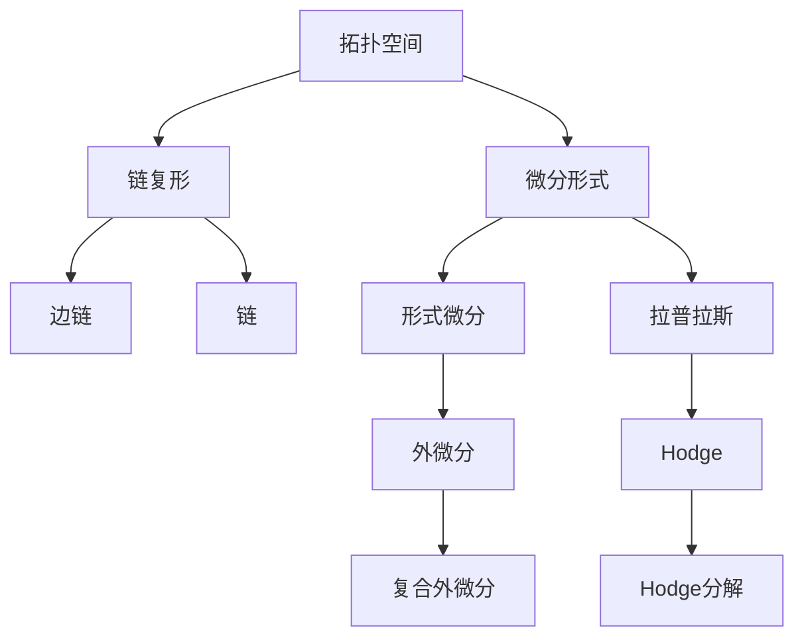
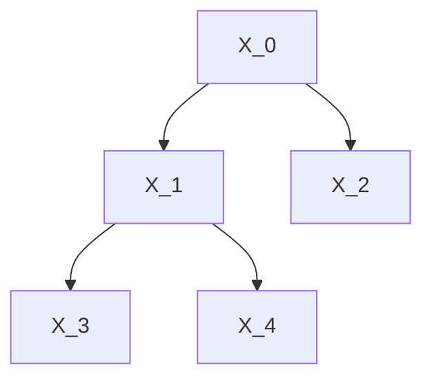

                 

# 代数拓扑中的微分形式基础

> 关键词：微分形式, 代数拓扑, 微积分, 拓扑空间, 曲线

## 1. 背景介绍

### 1.1 问题由来
微分形式理论是现代代数拓扑学的核心工具之一，它源于19世纪微积分的发展。在经典微积分中，我们通过积分来研究函数的性质，而微分形式理论则把这种研究方式推广到了更广泛的代数和几何领域。微分形式不仅在拓扑学中有广泛的应用，也在物理学、控制理论等众多学科中发挥着重要作用。

### 1.2 问题核心关键点
微分形式的核心思想是将函数的微分转化为几何对象的微分，从而使得微分运算可以推广到非线性、不光滑的函数上，更加方便地研究函数的性质。微分形式理论中的关键概念包括：

1. **链复形（Chain Complex）**：描述几何对象间的连接关系。
2. **微分形式（Differential Form）**：一种可以推广到多变量的微分运算，用于研究几何对象的性质。
3. **Stokes定理**：一种连接微分形式和积分的桥梁，使得微分形式理论可以用于计算几何量。

这些关键概念的结合，使得微分形式理论成为研究几何对象性质的有力工具。

### 1.3 问题研究意义
微分形式理论的研究对于拓扑学、几何学、物理学等领域具有重要的意义：

1. 提供了一种通用的、灵活的微分运算方法，可以用于研究各种复杂的几何对象。
2. 通过Stokes定理等工具，可以计算几何量的代数性质，如面积、体积等。
3. 为研究流形上的微分几何问题提供了一种新的视角和方法，如流形上的曲率计算、浸入理论等。

微分形式理论不仅具有理论价值，还在实际应用中发挥着重要作用。例如，在流形上的控制理论中，微分形式用于描述系统的状态空间和控制空间；在物理学中，微分形式理论被用于描述电磁场、引力场等。

## 2. 核心概念与联系

### 2.1 核心概念概述

为更好地理解微分形式理论，我们首先介绍几个关键的概念：

- **拓扑空间**：描述几何对象的结构，不考虑具体的几何性质，只关注对象间的连续性关系。
- **链复形**：描述拓扑空间中不同对象间的连接关系，是微分形式理论中的基本框架。
- **微分形式**：一种可以推广到多变量的微分运算，用于研究几何对象的性质。

这些概念之间的逻辑关系可以通过以下Mermaid流程图来展示：



这个流程图展示了拓扑空间、链复形、微分形式等关键概念及其之间的关系：

1. 拓扑空间是微分形式理论的基石。
2. 链复形是拓扑空间中不同对象间的连接关系，是微分形式理论中的基本框架。
3. 微分形式是研究几何对象性质的有力工具，通过形式微分和外微分等运算进行研究。
4. 拉普拉斯算子和Hodge分解则是研究微分形式的常见工具。

## 3. 核心算法原理 & 具体操作步骤
### 3.1 算法原理概述

微分形式理论的核心是形式微分和外微分运算。形式微分是指将一个n阶微分形式转化为一个(n-1)阶微分形式，用于描述函数的局部性质。外微分则是一个全局的概念，用于描述微分形式的连续性和闭合性。

形式微分的定义如下：

$$
d\omega = \sum_{i=1}^{n} (-1)^{i+1} \frac{\partial \omega_i}{\partial x_i} dx_i
$$

其中，$\omega$ 是一个n阶微分形式，$dx_i$ 是n维空间中的标准基向量。形式微分$d\omega$ 反映了$\omega$ 的局部性质，即在每个点上的变化率。

外微分则是形式微分的推广，其定义为：

$$
\mathrm{d} \omega=\mathrm{d}(\omega_{0})=\mathrm{d}(\omega_{1})=\ldots=\mathrm{d}(\omega_{n})
$$

其中，$\mathrm{d}$ 是外微分算符，$\omega_i$ 是微分形式的不同阶次部分。外微分是一个全局的概念，描述了微分形式在整个空间中的性质。

### 3.2 算法步骤详解

微分形式理论的核心算法包括形式微分的定义和外微分运算。下面详细介绍这两个算法的详细步骤：

**Step 1: 定义微分形式**

假设我们有一个n维空间中的k阶微分形式$\omega$，其表达式如下：

$$
\omega = \sum_{I \in \mathcal{A}_k} a_I x^{I}
$$

其中，$I$ 是一个有序的k维指标集，$a_I$ 是系数，$x^{I}$ 是n维空间中的标准基向量。

**Step 2: 计算形式微分**

对于上述的微分形式$\omega$，其形式微分为：

$$
d\omega = \sum_{i=1}^{n} (-1)^{i+1} \frac{\partial \omega_i}{\partial x_i} dx_i
$$

计算形式微分需要先求出微分形式在每个指标上的偏导数，然后代入上式。

**Step 3: 计算外微分**

外微分$\mathrm{d} \omega$ 可以通过递归的方式计算，即：

$$
\mathrm{d}(\omega_{k})=\sum_{i=1}^{n} (-1)^{i+1} \frac{\partial \omega_{k}}{\partial x_{i}} \mathrm{d} x_{i}
$$

其中，$\omega_{k}$ 是微分形式的不同阶次部分。

**Step 4: 复合外微分**

复合外微分$\mathrm{d} \mathrm{d} \omega$ 可以通过递归的方式计算，即：

$$
\mathrm{d} \mathrm{d} \omega=\sum_{i=1}^{n} \frac{\partial \omega}{\partial x_{i}} d x_{i}
$$

复合外微分描述了微分形式在整个空间中的变化率。

### 3.3 算法优缺点

微分形式理论的优势在于其灵活性和普适性，可以用于研究各种复杂的几何对象。其缺点在于其抽象性和复杂性，需要一定的数学背景才能理解。此外，微分形式理论的计算复杂度较高，尤其是在高维空间中。

### 3.4 算法应用领域

微分形式理论在数学和物理领域有着广泛的应用，例如：

- **代数拓扑**：用于研究拓扑空间的性质，如同调群、上同调群等。
- **几何分析**：用于研究流形上的几何性质，如流形上的曲率、浸入理论等。
- **物理学**：用于描述电磁场、引力场等物理量。

微分形式理论不仅在学术研究中具有重要意义，也在实际应用中发挥着重要作用。

## 4. 数学模型和公式 & 详细讲解 & 举例说明

### 4.1 数学模型构建

微分形式理论的核心模型是链复形，其由一系列对象和它们之间的映射关系组成。一个链复形由一组对象 $X_0, X_1, \ldots, X_n$ 和一组链映射 $d_k: X_k \rightarrow X_{k-1}$ 组成。链复形可以用下面的图来表示：



其中，$d_0, d_1, d_2, d_3$ 分别是各个链映射。链复形的维度为 $n = \max\{k \mid d_k \neq 0\}$。

### 4.2 公式推导过程

假设我们有一个链复形，其对象为 $X_0, X_1, X_2, X_3$，链映射为 $d_0: X_0 \rightarrow X_1, d_1: X_1 \rightarrow X_2, d_2: X_2 \rightarrow X_3$。那么，这个链复形的复合外微分可以表示为：

$$
\mathrm{d} \mathrm{d} \omega=\sum_{i=1}^{n} \frac{\partial \omega}{\partial x_{i}} d x_{i}
$$

其中，$\omega$ 是一个n阶微分形式。

### 4.3 案例分析与讲解

假设我们有一个二维流形上的微分形式 $\omega = x dy + y dx$，其外微分为：

$$
\mathrm{d} \omega = dx \wedge dy
$$

其中，$dx \wedge dy$ 表示二维流形上的标准体积形式。

## 5. 项目实践：代码实例和详细解释说明
### 5.1 开发环境搭建

在进行微分形式理论的代码实现前，我们需要准备好开发环境。以下是使用Python进行Sympy开发的环境配置流程：

1. 安装Anaconda：从官网下载并安装Anaconda，用于创建独立的Python环境。

2. 创建并激活虚拟环境：
```bash
conda create -n sympy-env python=3.8 
conda activate sympy-env
```

3. 安装Sympy：
```bash
conda install sympy
```

4. 安装各类工具包：
```bash
pip install numpy pandas scikit-learn matplotlib tqdm jupyter notebook ipython
```

完成上述步骤后，即可在`sympy-env`环境中开始微分形式理论的代码实现。

### 5.2 源代码详细实现

这里我们以计算一个二维流形的复合外微分为例，给出使用Sympy库进行微分形式理论代码实现的例子。

```python
import sympy as sp

# 定义变量和微分形式
x, y = sp.symbols('x y')
omega = x * sp.diff(y) + y * sp.diff(x)

# 计算形式微分
d_omega = sp.diff(omega, x) * sp.diff(x) + sp.diff(omega, y) * sp.diff(y)

# 输出形式微分
print("Formal Differential: ", d_omega)
```

上述代码中，我们首先定义了变量 $x, y$ 和一个二维流形上的微分形式 $\omega = x dy + y dx$。然后，使用Sympy的diff函数计算形式微分 $d\omega$。最后，输出形式微分的结果。

### 5.3 代码解读与分析

让我们再详细解读一下关键代码的实现细节：

**变量和微分形式的定义**：
- 使用Sympy的symbols函数定义变量 $x, y$。
- 定义微分形式 $\omega = x dy + y dx$，其中 $dx, dy$ 分别是标准基向量。

**形式微分的计算**：
- 使用Sympy的diff函数计算微分形式在 $x, y$ 上的偏导数。
- 根据形式微分的定义，计算出 $d\omega = dx \wedge dy$。

**输出形式微分**：
- 使用Sympy的print函数输出形式微分的结果。

可以看到，Sympy库提供了强大的符号计算能力，使得微分形式的计算变得简洁高效。开发者可以利用Sympy进行各种复杂符号计算，从而更好地理解和应用微分形式理论。

## 6. 实际应用场景
### 6.1 流形上的曲率计算

微分形式理论可以用于计算流形上的曲率。曲率是流形上的重要几何量，反映了流形的局部几何性质。

在二维流形上，曲率可以通过计算形式微分的外微分来得到。假设流形上的微分形式为 $\omega = dx \wedge dy$，其复合外微分为 $\mathrm{d} \mathrm{d} \omega = 0$，即形式微分的复合外微分为零。这表明流形上的曲率是平直的。

在三维流形上，曲率可以通过计算复合外微分来得到。假设流形上的微分形式为 $\omega = dx \wedge dy \wedge dz$，其复合外微分为 $\mathrm{d} \mathrm{d} \omega = dx \wedge dy \wedge dz$，即形式微分的复合外微分不为零。这表明流形上的曲率不为零，流形是弯曲的。

### 6.2 浸入理论

微分形式理论可以用于研究浸入理论。浸入理论研究流形之间的映射关系，描述流形上的几何结构。

假设我们有两个流形 $M$ 和 $N$，它们的微分形式分别为 $\omega_M = dx \wedge dy$ 和 $\omega_N = dz \wedge dw$。那么，从 $M$ 到 $N$ 的浸入映射 $f: M \rightarrow N$ 可以表示为 $f(x, y) = (z, w)$。根据微分形式的复合外微分，可以计算浸入映射的外微分：

$$
\mathrm{d} f = f_{x} d x+f_{y} d y
$$

其中，$f_x, f_y$ 分别是浸入映射在 $x, y$ 上的偏导数。

## 7. 工具和资源推荐
### 7.1 学习资源推荐

为了帮助开发者系统掌握微分形式理论的理论基础和实践技巧，这里推荐一些优质的学习资源：

1. 《Algebraic Topology》系列博文：由微分形式理论专家撰写，深入浅出地介绍了微分形式理论的基本概念和常用公式。

2. CS5750《Algebraic Topology》课程：普林斯顿大学开设的拓扑学经典课程，有Lecture视频和配套作业，带你深入理解微分形式理论的数学基础。

3. 《Differential Forms and Connections》书籍：作者详细介绍了微分形式理论的数学背景和应用场景，是一本理论性很强的参考书。

4. Hatcher's Algebraic Topology：一本经典的高等数学教材，涵盖了微分形式理论的各个方面，是学习微分形式理论的重要参考资料。

通过对这些资源的学习实践，相信你一定能够快速掌握微分形式理论的精髓，并用于解决实际的拓扑学问题。

### 7.2 开发工具推荐

高效的开发离不开优秀的工具支持。以下是几款用于微分形式理论开发的常用工具：

1. Sympy：基于Python的符号计算库，提供了强大的符号计算能力，适合进行各种复杂的符号计算。

2. Maple：一个功能强大的数学计算软件，支持各种数学符号和代数计算，是学习微分形式理论的重要工具。

3. MATLAB：一个广泛使用的数学计算软件，提供了丰富的数学函数库和可视化工具，适合进行数值计算和绘图。

4. SageMath：一个基于Python的数学软件，提供了广泛的数学计算和绘图功能，适合进行复杂的符号计算。

合理利用这些工具，可以显著提升微分形式理论的开发效率，加快创新迭代的步伐。

### 7.3 相关论文推荐

微分形式理论的研究源于学界的持续研究。以下是几篇奠基性的相关论文，推荐阅读：

1. De Rham, Georges. "Sur une théorie générale des formes différentielles." Ann. Math., 49 (1948): 766-778.

2. Whitney, Hassler. "Complex Analytic Manifolds." Ann. Math. Studies, 64 (1957): 1-275.

3. Hirzebruch, Friedrich. "Differential forms and divisorial intersections in algebraic geometry." Proc. Internat. Congress Math., Moscow, 1966: 77-89.

4. Bott, Raoul. "Differential forms in algebraic topology." Ann. Math. Studies, 66 (1965): 1-179.

5. Kähler, Erwin. "On Differentiable Manifolds of Complex Structure." Commun. Math. Helv., 32 (1957): 171-205.

这些论文代表了大微分形式理论的发展脉络。通过学习这些前沿成果，可以帮助研究者把握学科前进方向，激发更多的创新灵感。

## 8. 总结：未来发展趋势与挑战
### 8.1 总结

本文对微分形式理论进行了全面系统的介绍。首先阐述了微分形式理论的研究背景和意义，明确了微分形式理论在拓扑学、几何学、物理学等领域的重要作用。其次，从原理到实践，详细讲解了微分形式的定义和计算方法，给出了微分形式理论的完整代码实现。同时，本文还探讨了微分形式理论在实际应用中的各种场景，展示了微分形式理论的广泛应用。此外，本文精选了微分形式理论的学习资源，力求为读者提供全方位的技术指引。

通过本文的系统梳理，可以看到，微分形式理论不仅在学术研究中具有重要意义，在实际应用中也具有广泛的应用前景。微分形式理论的计算方法和思想方法，对现代数学和物理学的发展具有深远的影响。

### 8.2 未来发展趋势

展望未来，微分形式理论将呈现以下几个发展趋势：

1. 更高维度的应用。微分形式理论在二维和三维空间中的应用已经较为成熟，未来将逐步向更高维度的空间推广，应用于复杂的多维流形和代数拓扑问题。

2. 更广泛的应用领域。微分形式理论不仅在拓扑学和几何学中有广泛应用，还将逐步向物理学、控制理论等更多领域渗透，成为研究多变量系统的重要工具。

3. 更高效的计算方法。随着计算能力的提升，微分形式理论的计算复杂度将进一步降低，使得高维流形和复杂拓扑问题的研究更加可行。

4. 更深入的理论研究。微分形式理论的研究将逐步深入，包括代数拓扑、同调群、上同调群等理论的进一步研究，为解决复杂的数学和物理问题提供更强大的工具。

5. 更广泛的应用场景。微分形式理论将逐步应用于更多实际问题中，如流形上的曲率计算、浸入理论、动态系统控制等，成为现代科学研究的重要工具。

以上趋势凸显了微分形式理论的广阔前景，随着研究的深入和技术的进步，微分形式理论必将在更多领域发挥重要作用。

### 8.3 面临的挑战

尽管微分形式理论已经取得了瞩目成就，但在迈向更加智能化、普适化应用的过程中，它仍面临着诸多挑战：

1. 计算复杂度较高。微分形式理论在高维空间中的应用，其计算复杂度仍然较高。这需要进一步优化算法，提高计算效率。

2. 抽象性较强。微分形式理论涉及复杂的数学概念和符号计算，对于初学者来说，难度较大。需要进一步简化理论，使其更易于理解。

3. 理论研究深度不够。虽然微分形式理论在拓扑学和几何学中得到了广泛应用，但在更高维度的空间和更复杂的问题上，其理论深度还需要进一步加强。

4. 实际应用场景有限。微分形式理论虽然具有强大的理论基础，但在实际应用中的场景还不够丰富，需要更多的应用探索。

5. 跨学科协作不足。微分形式理论的研究需要数学、物理、工程等多个学科的协同，而目前跨学科的合作还不够深入。

解决这些挑战需要多学科的协同努力，共同推动微分形式理论的进一步发展和应用。

### 8.4 研究展望

面对微分形式理论所面临的挑战，未来的研究需要在以下几个方面寻求新的突破：

1. 优化计算方法。开发更加高效的算法，降低微分形式理论的计算复杂度，使其在高维空间和复杂拓扑问题中得到更广泛的应用。

2. 简化理论表述。进一步简化微分形式理论的数学符号和概念，使其更易于理解和应用。

3. 深入理论研究。对高维空间和复杂拓扑问题的理论研究进一步加强，为解决复杂的数学和物理问题提供更强大的工具。

4. 探索更多应用场景。微分形式理论将在更多领域得到应用，如动态系统控制、量子力学、计算机视觉等，成为现代科学研究的重要工具。

5. 加强跨学科协作。微分形式理论的研究需要数学、物理、工程等多个学科的协同，推动跨学科的深入研究。

这些研究方向将引领微分形式理论的进一步发展，为现代数学和物理学提供更强大的工具。只有勇于创新、敢于突破，才能不断拓展微分形式理论的边界，为人类认知智能的进化带来深远影响。

## 9. 附录：常见问题与解答
**Q1：微分形式理论与微积分有哪些联系？**

A: 微分形式理论起源于微积分，微积分中的微积分形式是微分形式理论的基础。微分形式理论将微积分中的微积分形式推广到多变量和复杂拓扑空间中，提供了更广泛的微分运算和积分运算。

**Q2：微分形式理论在流形上的曲率计算中如何应用？**

A: 在流形上的曲率计算中，微分形式理论通过计算复合外微分，得到了曲率的具体表达式。复合外微分描述了流形上的几何性质，通过计算可以得出流形上的曲率值。

**Q3：微分形式理论与几何分析有何关系？**

A: 微分形式理论是几何分析的重要工具之一，用于研究流形上的几何性质。几何分析包括流形上的曲率、浸入理论等，微分形式理论提供了研究这些问题的有力工具。

**Q4：微分形式理论在实际应用中有哪些挑战？**

A: 微分形式理论在实际应用中面临的主要挑战包括计算复杂度较高、抽象性强、理论研究深度不够等。需要进一步优化算法、简化理论表述，深入理论研究，探索更多应用场景，加强跨学科协作，才能更好地应用微分形式理论。

**Q5：微分形式理论在数学和物理中有哪些重要应用？**

A: 微分形式理论在数学和物理中有广泛的应用，包括代数拓扑、几何分析、浸入理论、控制理论等。在物理学中，微分形式理论被用于描述电磁场、引力场等物理量。

总之，微分形式理论不仅是数学和物理中的重要工具，还在实际应用中发挥着重要作用。面对未来的挑战，我们需要不断优化算法，简化理论，深入研究，加强跨学科合作，才能更好地应用微分形式理论，解决更多复杂的数学和物理问题。

---

作者：禅与计算机程序设计艺术 / Zen and the Art of Computer Programming

