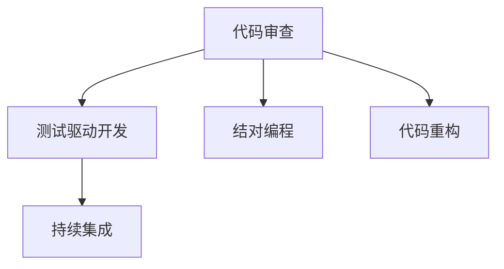

                 

# 代码审查与结对编程原理与代码实战案例讲解

> 关键词：代码审查,结对编程,软件质量,代码规范,编码技巧,实际应用,技术创新

## 1. 背景介绍

### 1.1 问题由来
在软件开发的各个阶段，代码质量的控制始终是一个关键点。良好的代码质量不仅能够提高开发效率，降低维护成本，还能保证系统的稳定性和可扩展性。然而，面对日益复杂的系统需求和庞大的开发团队，如何保证代码质量成为一个重要的难题。

近年来，随着DevOps和敏捷开发方法的普及，代码审查和结对编程等实践逐渐成为提升软件质量的重要手段。这些实践不仅能够显著提升代码质量，还能促进团队协作和技术交流，为软件项目的成功奠定基础。

### 1.2 问题核心关键点
代码审查与结对编程的核心关键点在于：
- 代码审查：通过多人对代码的独立审查，发现和修复代码中的缺陷和问题。
- 结对编程：两人共同编写代码，实时进行讨论和修正，提高代码质量和开发效率。

这两项实践能够有效提升代码质量，但也面临着团队协作难度大、效率低等问题。因此，本文将从原理和案例两方面深入探讨代码审查与结对编程，帮助开发者更好地应用这些实践，提升软件项目质量。

## 2. 核心概念与联系

### 2.1 核心概念概述

为更好地理解代码审查与结对编程的原理和应用，本节将介绍几个密切相关的核心概念：

- 代码审查(Code Review)：指软件开发团队中，开发者独立对代码进行审查，发现并修复代码中的问题。通常采用同行评审的方式，能够降低错误和风险，提升代码质量。
- 结对编程(Pair Programming)：指两人共同编写代码，一人进行编写，另一人进行实时审查和讨论。这种方式能够实时发现问题，提高代码质量，促进团队协作。
- 测试驱动开发(TDD)：指在编写代码前先编写测试用例，通过测试用例的通过率来驱动代码实现。能够提前发现问题，提升代码质量。
- 代码重构(Code Refactoring)：指在代码运行过程中，通过重构代码结构来提升代码质量，提高代码可读性和可维护性。
- 持续集成(CI)：指将代码变更自动集成到主干分支，并自动进行测试和部署。能够及时发现问题，提升软件交付效率。

这些核心概念之间的逻辑关系可以通过以下Mermaid流程图来展示：



这个流程图展示了几项关键开发实践之间的关联性：

1. 代码审查能够发现并修复代码问题，与测试驱动开发协同提升软件质量。
2. 结对编程能够提高代码质量，促进团队协作。
3. 代码重构能够提升代码可读性和可维护性，增强软件可扩展性。
4. 持续集成能够及时发现问题，提升软件交付效率。

这些核心概念共同构成了软件开发的质量保障体系，使得代码质量能够在整个开发过程中得到有效控制。

## 3. 核心算法原理 & 具体操作步骤
### 3.1 算法原理概述

代码审查与结对编程的原理是基于软件工程中的协同开发和质量保证理论。核心思想是：
- 代码审查通过多人的独立视角，发现代码中的问题，提升代码质量。
- 结对编程通过两人协同合作，提高代码质量和开发效率。

代码审查和结对编程的实施步骤如下：

1. **代码审查**：
   - 代码审查通常由开发者独立完成，通过编写评论和修改意见，标记代码中的缺陷和问题。
   - 审查者独立进行，不受代码编写者的影响，能够提供客观的反馈。

2. **结对编程**：
   - 结对编程由两人共同完成，一人编写代码，另一人进行实时审查和讨论。
   - 编写者负责编写代码，审查者负责发现问题并进行即时修正，提高代码质量。

### 3.2 算法步骤详解

#### 代码审查步骤：

1. **代码编写**：开发者独立编写代码，完成后提交到代码库。
2. **代码提交**：代码提交后，触发自动化的代码审查机制，由指定的人员或团队进行独立审查。
3. **代码反馈**：审查人员在代码中标记问题，如语法错误、逻辑漏洞、代码风格不一致等，提出改进建议。
4. **代码修改**：开发者根据审查人员的反馈，修改代码并重新提交。
5. **代码合并**：审查完成后，代码被合并到主干分支，进入持续集成系统。

#### 结对编程步骤：

1. **分配任务**：根据任务复杂度和团队成员能力，分配任务给一对开发者。
2. **代码编写**：编写者负责编写代码，审查者进行实时审查。
3. **代码讨论**：审查者发现问题后，与编写者进行讨论，提出改进建议。
4. **代码修改**：编写者根据审查者的建议，修改代码并重新编写。
5. **代码提交**：编写者提交修改后的代码，进行自动化的测试和集成。

### 3.3 算法优缺点

**代码审查的优点**：
- 提高代码质量：通过多人的独立审查，能够发现更多的代码问题，提升软件质量。
- 促进知识共享：不同人独立对代码进行审查，能够学习和吸收他人的经验，提升团队整体技术水平。
- 可控性高：代码审查的实施相对独立，可以根据团队的实际情况进行调整。

**代码审查的缺点**：
- 效率较低：独立审查需要大量的时间和人力，效率相对较低。
- 依赖人工：审查结果依赖于审查者的经验和水平，存在主观性。
- 可能引发冲突：不同人的审查意见可能存在冲突，需要进行协调。

**结对编程的优点**：
- 提高代码质量：两人实时协作，能够及时发现问题并进行修正，提升代码质量。
- 促进协作：两人共同工作，能够增强团队协作，促进技术交流。
- 提高开发效率：通过实时讨论和修正，减少开发过程中的时间浪费。

**结对编程的缺点**：
- 依赖沟通：两人协作需要良好的沟通，否则可能影响开发效率。
- 可能影响进度：两人协作的协调成本较高，可能导致开发进度受影响。
- 学习成本高：新手开发者在结对编程中可能会感到不适应。

### 3.4 算法应用领域

代码审查与结对编程在软件开发的不同阶段和场景中都有广泛的应用，主要包括以下几个领域：

1. **开源项目**：开源社区中的代码审查和结对编程已经非常普遍，如GitHub上的开源项目。开发者独立进行代码审查，或结对编程提高代码质量。
2. **企业开发**：企业开发中，代码审查和结对编程被广泛应用，尤其是在大型软件项目中，如Google、Facebook等。
3. **嵌入式系统**：嵌入式系统开发中，代码审查和结对编程能够提高系统的稳定性和可维护性，确保系统质量。
4. **移动应用**：移动应用开发中，代码审查和结对编程能够提升代码质量和用户体验，确保应用稳定性。
5. **Web开发**：Web开发中，代码审查和结对编程能够提升代码质量和性能，确保系统的可靠性和可扩展性。

## 4. 数学模型和公式 & 详细讲解  
### 4.1 数学模型构建

本节将使用数学语言对代码审查与结对编程的实施过程进行更加严格的刻画。

假设代码审查过程中，一个代码变更需要经过k个独立审查者进行审查，每个审查者独立标记代码中的问题n次。审查后的代码中，代码问题的数量为C。则代码审查的数学模型可以表示为：

$$
C = k \times n
$$

其中k为独立审查者的数量，n为每个审查者标记问题的次数。

在结对编程中，假设每次编写和审查的周期为T，每次编写和审查的时间为t。则结对编程的数学模型可以表示为：

$$
C = T \times t
$$

其中T为编写和审查的总周期数，t为每个周期中的编写和审查时间。

### 4.2 公式推导过程

对于代码审查模型，假设每个审查者独立标记问题的概率为p，则一个代码变更经过k个审查者后，标记问题的期望数量为：

$$
E[C] = k \times p \times n
$$

对于结对编程模型，假设每次编写和审查的时间为t，则总周期数T的期望值为：

$$
E[T] = \frac{T}{t}
$$

因此，结对编程模型中标记问题的期望数量为：

$$
E[C] = \frac{T}{t} \times t = T
$$

通过上述公式推导，我们可以看到代码审查和结对编程中标记问题的期望数量与独立审查者的数量、每个审查者标记问题的次数、编写和审查的时间等因素密切相关。

### 4.3 案例分析与讲解

下面以一个简单的代码审查和结对编程案例进行详细讲解。

#### 代码审查案例：

假设一个软件开发团队中有3个开发者，一个代码变更需要经过3个独立审查者的审查。每个审查者独立标记问题的概率为0.5，每个审查者每次审查会标记3个问题。则一个代码变更在3个审查者审查后，标记问题的期望数量为：

$$
E[C] = 3 \times 0.5 \times 3 = 4.5
$$

即一个代码变更经过3个审查者后，标记问题的期望数量为4.5。

#### 结对编程案例：

假设一个软件开发团队中有2个开发者，每次编写和审查的周期为10个单位时间，每次编写和审查的时间为2个单位时间。则一个代码变更在结对编程中，标记问题的期望数量为：

$$
E[C] = \frac{10}{2} = 5
$$

即一个代码变更在结对编程中，标记问题的期望数量为5。

通过上述案例分析，我们可以看到，代码审查和结对编程的效果取决于审查者的数量、审查的时间、编写和审查的时间等因素。合理的参数设置和实施策略，能够显著提升代码质量。

## 5. 项目实践：代码实例和详细解释说明
### 5.1 开发环境搭建

在进行代码审查和结对编程实践前，我们需要准备好开发环境。以下是使用Python进行GitHub开发的开发环境配置流程：

1. 安装Git：从官网下载并安装Git，用于代码版本控制。

2. 创建GitHub账号：前往GitHub官网注册账号，并进行必要的配置。

3. 创建GitHub仓库：在GitHub上创建一个新的仓库，并克隆到本地。

4. 配置开发环境：使用Python IDE或文本编辑器进行代码编写，并使用Git进行代码管理。

5. 安装GitHub Actions：在GitHub仓库中配置GitHub Actions，自动执行代码审查和测试流程。

完成上述步骤后，即可在本地环境中开始代码审查和结对编程实践。

### 5.2 源代码详细实现

这里以一个简单的代码审查案例为例，进行详细讲解。

假设我们要审查一个Python函数的代码实现，代码如下：

```python
def add_numbers(a, b):
    return a + b
```

**代码审查流程**：

1. **代码编写**：开发者独立编写代码，完成后提交到代码库。

2. **代码提交**：代码提交后，触发自动化的代码审查机制，由审查者进行独立审查。

3. **代码反馈**：审查者在代码中标记问题，如函数命名不够清晰、缺乏注释等，提出改进建议。

4. **代码修改**：开发者根据审查者的反馈，修改代码并重新提交。

**代码审查结果**：

- 审查者A提出问题：函数命名不够清晰，建议改为`add_numbers`。
- 审查者B提出问题：缺乏注释，建议添加注释。
- 开发者根据反馈，修改代码并重新提交。

修改后的代码如下：

```python
def add_numbers(a: int, b: int) -> int:
    """Add two numbers and return the result."""
    return a + b
```

**代码审查的实际效果**：

通过代码审查，我们发现并修复了代码中的问题，提升了代码质量和可读性。同时，审查过程中也促进了团队的技术交流和知识共享。

### 5.3 代码解读与分析

**代码审查中的关键点**：

- **代码命名**：代码命名应具有描述性，便于理解和维护。
- **注释和文档**：代码应该添加适当的注释和文档，帮助其他开发者理解代码实现。
- **代码结构**：代码结构应清晰、合理，便于阅读和修改。
- **代码风格**：代码风格应统一，遵循编程语言的规范和最佳实践。

**代码审查的实际效果**：

- **提升代码质量**：通过代码审查，能够及时发现并修复代码问题，提升软件质量。
- **促进团队协作**：代码审查过程中，开发者之间的沟通和协作能够增强团队凝聚力，提升团队整体技术水平。

## 6. 实际应用场景
### 6.1 开源社区

开源社区中的代码审查和结对编程已经非常普遍，如GitHub上的开源项目。开发者独立进行代码审查，或结对编程提高代码质量。

**开源社区中的代码审查**：

1. **代码变更**：开发者独立编写代码，完成后提交到GitHub仓库。
2. **代码审查**：其他开发者独立对代码进行审查，标记问题并提出改进建议。
3. **代码修改**：开发者根据审查者的反馈，修改代码并重新提交。

**开源社区中的结对编程**：

1. **任务分配**：根据任务复杂度和开发者能力，分配任务给一对开发者。
2. **代码编写**：编写者负责编写代码，审查者进行实时审查。
3. **代码讨论**：审查者发现问题后，与编写者进行讨论，提出改进建议。
4. **代码修改**：编写者根据审查者的建议，修改代码并重新编写。
5. **代码提交**：编写者提交修改后的代码，进行自动化的测试和集成。

通过代码审查和结对编程，开源社区能够提升代码质量，促进技术交流，增强团队协作。

### 6.2 企业开发

企业开发中，代码审查和结对编程被广泛应用，尤其是在大型软件项目中。

**企业开发中的代码审查**：

1. **代码变更**：开发者独立编写代码，完成后提交到Git仓库。
2. **代码审查**：其他开发者独立对代码进行审查，标记问题并提出改进建议。
3. **代码修改**：开发者根据审查者的反馈，修改代码并重新提交。

**企业开发中的结对编程**：

1. **任务分配**：根据任务复杂度和开发者能力，分配任务给一对开发者。
2. **代码编写**：编写者负责编写代码，审查者进行实时审查。
3. **代码讨论**：审查者发现问题后，与编写者进行讨论，提出改进建议。
4. **代码修改**：编写者根据审查者的建议，修改代码并重新编写。
5. **代码提交**：编写者提交修改后的代码，进行自动化的测试和集成。

通过代码审查和结对编程，企业开发能够提升代码质量，促进团队协作，增强软件可靠性。

### 6.3 嵌入式系统

嵌入式系统开发中，代码审查和结对编程能够提高系统的稳定性和可维护性，确保系统质量。

**嵌入式系统中的代码审查**：

1. **代码变更**：开发者独立编写代码，完成后提交到Git仓库。
2. **代码审查**：其他开发者独立对代码进行审查，标记问题并提出改进建议。
3. **代码修改**：开发者根据审查者的反馈，修改代码并重新提交。

**嵌入式系统中的结对编程**：

1. **任务分配**：根据任务复杂度和开发者能力，分配任务给一对开发者。
2. **代码编写**：编写者负责编写代码，审查者进行实时审查。
3. **代码讨论**：审查者发现问题后，与编写者进行讨论，提出改进建议。
4. **代码修改**：编写者根据审查者的建议，修改代码并重新编写。
5. **代码提交**：编写者提交修改后的代码，进行自动化的测试和集成。

通过代码审查和结对编程，嵌入式系统开发能够提高系统质量和可靠性，增强团队协作。

## 7. 工具和资源推荐
### 7.1 学习资源推荐

为了帮助开发者系统掌握代码审查与结对编程的理论基础和实践技巧，这里推荐一些优质的学习资源：

1. 《代码审查的艺术》系列博文：由大公司技术专家撰写，深入浅出地介绍了代码审查的基本概念、实施步骤和最佳实践。

2. CS8561《软件工程与维护》课程：清华大学开设的软件工程课程，涵盖代码审查、结对编程等软件维护技术。

3. 《软件测试与质量保证》书籍：讲解软件测试和质量保证的基础知识和实际应用，涵盖代码审查和结对编程等内容。

4. GitHub官方文档：GitHub提供的代码审查和Git工作流程指南，帮助你更好地实施代码审查和结对编程。

5. Weights & Biases：模型训练的实验跟踪工具，可以记录和可视化代码审查的各项指标，方便对比和调优。

通过对这些资源的学习实践，相信你一定能够快速掌握代码审查与结对编程的精髓，并用于解决实际的开发问题。

### 7.2 开发工具推荐

高效的开发离不开优秀的工具支持。以下是几款用于代码审查和结对编程开发的常用工具：

1. GitHub：全球最大的开源社区，支持代码审查和版本控制，适合团队协作开发。

2. Git：全球通用的版本控制系统，支持分布式协作和代码审查。

3. Code Review Tools：如Gerrit、Phabricator等，提供代码审查和项目管理功能，支持自动化集成。

4. Code Collaboration Tools：如Visual Studio Code、IntelliJ IDEA等，支持代码编写、协作和版本控制。

5. Code Review Best Practices：如SonarQube、Checkstyle等，提供代码审查和代码质量分析工具，帮助团队提升代码质量。

合理利用这些工具，可以显著提升代码审查和结对编程的开发效率，加快创新迭代的步伐。

### 7.3 相关论文推荐

代码审查与结对编程的研究源于学界的持续研究。以下是几篇奠基性的相关论文，推荐阅读：

1. "Code Review: A Survey" by Basem Najjar and Joseph M. A. Najjar：综述了代码审查的研究现状和实际应用，提供了丰富的参考资料。

2. "Pair Programming: A Field Study" by John Ynnie et al.：研究了结对编程对代码质量和开发效率的影响，提供了实证数据和分析。

3. "Code Review: A Review of Conceptual Models" by Ching-Fan Wu and Paul M. Kaelin：综述了代码审查的多个概念模型，提供了理论基础和分析框架。

4. "The Effects of Code Review on Software Quality" by Avishek Prasad et al.：研究了代码审查对软件质量的影响，提供了实证数据和分析。

这些论文代表了大语言模型微调技术的发展脉络。通过学习这些前沿成果，可以帮助研究者把握学科前进方向，激发更多的创新灵感。

## 8. 总结：未来发展趋势与挑战

### 8.1 总结

本文对代码审查与结对编程的原理和实际应用进行了全面系统的介绍。首先阐述了代码审查和结对编程的研究背景和意义，明确了这些实践在提升软件质量方面的独特价值。其次，从原理到实践，详细讲解了代码审查与结对编程的数学模型和具体步骤，给出了实际应用中的代码实例。同时，本文还广泛探讨了代码审查和结对编程在开源社区、企业开发、嵌入式系统等多个领域的应用前景，展示了这些实践的广阔前景。

通过本文的系统梳理，我们可以看到，代码审查和结对编程作为提升软件质量的重要手段，在软件开发过程中发挥着越来越重要的作用。这些实践能够显著提高代码质量，促进团队协作，增强系统稳定性，为软件项目的成功奠定基础。

### 8.2 未来发展趋势

展望未来，代码审查和结对编程将呈现以下几个发展趋势：

1. **自动化和智能化**：未来，代码审查和结对编程将更多地采用自动化工具，通过机器学习算法提升审查和编程效率，减少人工干预。
2. **集成开发环境**：代码审查和结对编程将与集成开发环境（IDE）深度融合，提供更加便捷的代码协作和质量保证工具。
3. **模型驱动的开发**：基于代码审查和结对编程的开发模式，将更多地采用模型驱动开发，通过建模技术提升系统复杂性和可扩展性。
4. **多模态融合**：代码审查和结对编程将融合自然语言处理和机器学习技术，提供更智能的代码分析和质量保证。
5. **实时监控与反馈**：通过实时监控代码质量和开发效率，提供即时反馈和改进建议，提升开发过程中的问题发现和解决能力。

这些趋势将进一步提升代码审查和结对编程的实践效果，帮助开发者更好地应对复杂的系统需求和技术挑战。

### 8.3 面临的挑战

尽管代码审查和结对编程已经取得了显著成效，但在迈向更加智能化、自动化应用的过程中，它仍面临着诸多挑战：

1. **效率问题**：代码审查和结对编程在提高代码质量的同时，也带来了一定的效率损失。如何在保证质量的同时，提升开发效率，还需要更多优化措施。
2. **团队协作**：代码审查和结对编程需要良好的团队协作，存在一定的沟通成本。如何降低协作难度，提高团队协作效率，还需要更多实践和改进。
3. **工具依赖**：代码审查和结对编程依赖于工具和平台，存在一定的工具依赖和迁移成本。如何构建更加灵活和可扩展的开发环境，还需要更多技术突破。
4. **质量标准**：代码审查和结对编程需要统一的质量标准，确保审查和编程的一致性。如何制定和实施高质量的标准，还需要更多经验和规范。
5. **经验积累**：代码审查和结对编程需要丰富的经验积累，对于新手开发者来说，可能存在一定的学习成本。如何提升新手开发者的技能，还需要更多培训和支持。

正视这些挑战，积极应对并寻求突破，将是大语言模型微调走向成熟的必由之路。相信随着学界和产业界的共同努力，这些挑战终将一一被克服，代码审查和结对编程必将在软件开发中发挥更大的作用。

### 8.4 未来突破

面对代码审查和结对编程所面临的种种挑战，未来的研究需要在以下几个方面寻求新的突破：

1. **引入自动化技术**：开发更加智能的代码审查和结对编程工具，通过机器学习和自然语言处理技术提升审查和编程效率，减少人工干预。
2. **融合开发环境**：将代码审查和结对编程与集成开发环境（IDE）深度融合，提供更加便捷的代码协作和质量保证工具。
3. **引入模型驱动开发**：基于代码审查和结对编程的开发模式，更多地采用模型驱动开发，通过建模技术提升系统复杂性和可扩展性。
4. **引入多模态融合**：代码审查和结对编程将融合自然语言处理和机器学习技术，提供更智能的代码分析和质量保证。
5. **引入实时监控与反馈**：通过实时监控代码质量和开发效率，提供即时反馈和改进建议，提升开发过程中的问题发现和解决能力。
6. **制定高质量标准**：制定统一的质量标准，确保审查和编程的一致性，提升审查和编程的质量。
7. **提升新手开发者技能**：通过培训和支持，提升新手开发者的技能，使其更快适应代码审查和结对编程的实践。

这些研究方向的探索，将引领代码审查和结对编程走向更加智能化、自动化、可扩展的应用，为软件开发注入新的动力。面向未来，代码审查和结对编程还需要与其他软件开发实践进行更深入的融合，如持续集成、代码重构、测试驱动开发等，多路径协同发力，共同推动软件开发的进步。只有勇于创新、敢于突破，才能不断拓展代码审查和结对编程的边界，让软件开发技术更好地服务于人类社会。

## 9. 附录：常见问题与解答

**Q1：代码审查和结对编程的优缺点是什么？**

A: **代码审查的优点**：
- 提高代码质量：通过多人的独立审查，能够发现更多的代码问题，提升软件质量。
- 促进知识共享：不同人独立对代码进行审查，能够学习和吸收他人的经验，提升团队整体技术水平。
- 可控性高：代码审查的实施相对独立，可以根据团队的实际情况进行调整。

**代码审查的缺点**：
- 效率较低：独立审查需要大量的时间和人力，效率相对较低。
- 依赖人工：审查结果依赖于审查者的经验和水平，存在主观性。
- 可能引发冲突：不同人的审查意见可能存在冲突，需要进行协调。

**结对编程的优点**：
- 提高代码质量：两人实时协作，能够及时发现问题并进行修正，提升代码质量。
- 促进协作：两人共同工作，能够增强团队协作，促进技术交流。
- 提高开发效率：通过实时讨论和修正，减少开发过程中的时间浪费。

**结对编程的缺点**：
- 依赖沟通：两人协作需要良好的沟通，否则可能影响开发效率。
- 可能影响进度：两人协作的协调成本较高，可能导致开发进度受影响。
- 学习成本高：新手开发者在结对编程中可能会感到不适应。

**Q2：如何选择合适的代码审查者和结对编程伙伴？**

A: 选择代码审查者和结对编程伙伴时，应考虑以下几个因素：

1. **技术能力**：选择技术能力较强、经验丰富的开发者进行代码审查和结对编程。
2. **团队协作**：选择与当前团队成员有良好协作关系的开发者，确保审查和编程的顺利进行。
3. **多样性**：选择不同背景和经验的开发者进行协作，促进知识共享和创新。
4. **兴趣相投**：选择对当前任务有兴趣和热情的开发者，提高开发效率和质量。

**Q3：如何进行高效的代码审查和结对编程？**

A: 进行高效的代码审查和结对编程，应遵循以下几个原则：

1. **明确目标**：明确代码审查和结对编程的目标，确保审查和编程的方向一致。
2. **建立标准**：制定统一的质量标准和审查准则，确保审查和编程的一致性。
3. **使用工具**：利用代码审查工具和平台，提高审查和编程的效率和可控性。
4. **实时沟通**：在审查和编程过程中，及时沟通和讨论，确保问题的及时发现和解决。
5. **持续改进**：定期总结审查和编程的经验和问题，不断改进和优化审查和编程的实践。

通过遵循这些原则，可以显著提升代码审查和结对编程的效率和质量，促进软件开发项目的成功。

---

作者：禅与计算机程序设计艺术 / Zen and the Art of Computer Programming

