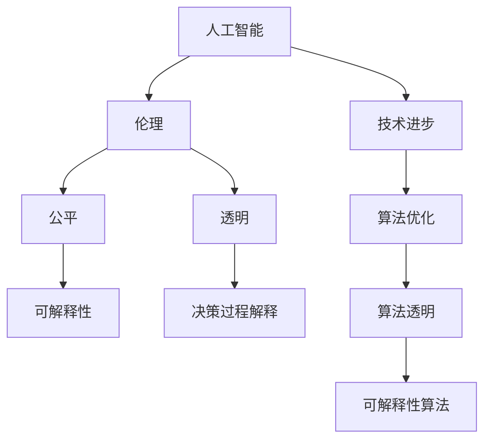

                 

# 以人为本的科技未来：人类计算的价值观

## 1. 背景介绍

### 1.1 问题由来
在快速发展的科技浪潮中，人工智能(AI)技术正以前所未有的速度改变我们的生活方式和工作方式。从语音识别、图像处理到自然语言处理(NLP)，AI正在各个领域展现其巨大的潜力。然而，与此同时，AI也引发了一系列关于伦理、隐私和公平性的讨论和质疑。如何在推进技术进步的同时，确保技术的可持续性和对人类价值的尊重，成为了一个亟需回答的问题。

### 1.2 问题核心关键点
随着AI技术的发展，人类计算的价值观逐渐成为公众关注的焦点。如何在算法设计和应用中融入伦理、公平、透明和可解释性等价值观，成为了各大科技公司和技术研究者共同面对的挑战。如何在技术发展的同时，坚持以人为本的设计理念，确保技术进步为人类社会带来更多福祉，是本文的核心议题。

### 1.3 问题研究意义
本节旨在探讨如何在人工智能技术发展中，融入以人为本的价值观，确保技术进步为人类带来更多福祉。本文将从技术、伦理和社会三个维度，深入分析人类计算的价值观，为科技未来的发展提供有益的指导。

## 2. 核心概念与联系

### 2.1 核心概念概述

人类计算的核心概念包括：

- **人工智能(AI)**：利用算法和数据，使机器具有类似人类的智能和判断能力，包括但不限于语音识别、图像处理、自然语言处理等。
- **伦理**：在人工智能设计和使用中，如何确保决策的公正性、透明性和可解释性，避免偏见和歧视。
- **公平**：AI技术在应用中，应如何保证不同群体、不同背景的人们都能公平受益。
- **透明**：AI系统的决策过程应具有可解释性，让用户和监管者能够理解其工作原理和结果。
- **可解释性**：AI系统的决策应能够被解释和理解，便于用户和监管者信任和监督。

这些概念之间存在紧密的联系。AI技术的进步需要伦理和公平的引导，透明和可解释性则是伦理和公平的具体体现。只有在技术设计中充分考虑这些价值观，才能确保AI技术为人类带来真正的福祉。

### 2.2 核心概念原理和架构的 Mermaid 流程图



这个流程图展示了人工智能、伦理、公平、透明和可解释性之间的关系。人工智能的进步依赖于算法优化和透明，而透明和可解释性又与伦理和公平密不可分。通过不断的技术进步和伦理引导，AI技术可以更好地服务于人类社会。

## 3. 核心算法原理 & 具体操作步骤

### 3.1 算法原理概述

人工智能技术的发展离不开算法的支持。在设计和实现AI算法时，如何融入伦理、公平、透明和可解释性等价值观，是保证算法公正性和可信赖性的关键。以下将从算法设计、实现和应用三个层面，详细探讨如何在AI算法中融入这些价值观。

### 3.2 算法步骤详解

#### 3.2.1 设计阶段
在算法设计阶段，应从以下几个方面考虑伦理、公平和可解释性：

1. **数据采集和预处理**：确保数据来源的多样性和代表性，避免数据偏见。对数据进行去噪和标准化处理，确保数据质量。

2. **模型选择和优化**：选择合适的模型架构，如线性回归、决策树、神经网络等。通过交叉验证、网格搜索等方法，优化模型参数，避免过拟合。

3. **算法透明性**：在算法设计中，应尽量使用简单的模型和可解释的算法，避免使用过于复杂的深度学习模型。确保算法决策过程透明，便于理解和监督。

#### 3.2.2 实现阶段
在算法实现阶段，应考虑以下几个方面：

1. **代码注释和文档**：编写清晰、详细的代码注释和文档，解释算法的实现过程和决策依据。

2. **测试和验证**：对算法进行全面的测试和验证，确保其在不同数据集上的表现一致。使用多种验证方法，如交叉验证、置信区间等，确保算法的可靠性。

3. **可解释性工具**：使用可解释性工具，如LIME、SHAP等，分析算法的决策依据，提供可视化的解释结果。

#### 3.2.3 应用阶段
在算法应用阶段，应考虑以下几个方面：

1. **用户反馈**：收集用户反馈，及时调整算法，确保其满足用户需求。

2. **隐私保护**：对用户数据进行隐私保护，避免数据泄露和滥用。

3. **透明报告**：定期发布算法的使用报告，解释算法的决策过程和结果。

### 3.3 算法优缺点

#### 3.3.1 优点
1. **提高决策的公正性**：在算法设计中融入伦理和公平的考虑，可以避免算法偏见，提高决策的公正性。

2. **增强算法的透明度和可解释性**：透明的算法设计和可解释性工具的使用，使得算法的决策过程透明，便于监督和理解。

3. **提升用户信任**：通过透明的算法设计和公平的决策，可以提升用户对AI系统的信任和接受度。

#### 3.3.2 缺点
1. **增加设计复杂度**：在算法设计中融入伦理和公平的考虑，会增加设计的复杂度和实现难度。

2. **降低算法效率**：某些公平和透明的设计，如去噪和标准化处理，可能降低算法效率。

3. **成本增加**：使用可解释性工具和隐私保护措施，可能会增加算法的开发和维护成本。

### 3.4 算法应用领域

人工智能技术已经在诸多领域得到了广泛应用，包括医疗、金融、交通等。以下将详细探讨如何在这些领域中融入伦理、公平、透明和可解释性等价值观，确保技术的可持续发展。

## 4. 数学模型和公式 & 详细讲解 & 举例说明

### 4.1 数学模型构建

在算法设计和实现中，数学模型是不可或缺的工具。以下将以一个简单的分类算法为例，展示如何在模型构建中融入公平和透明性。

假设我们有一个二分类问题，需要判断输入$x$是否属于类别$y=1$。我们的目标是最小化损失函数：

$$
\min_{\theta} \sum_{i=1}^{N} \ell(y_i, M_{\theta}(x_i))
$$

其中，$y_i$为真实标签，$M_{\theta}(x_i)$为模型预测值，$\ell$为损失函数。

### 4.2 公式推导过程

为了保证算法的公平性和透明性，我们需要在模型构建中考虑以下几个方面：

1. **公平性约束**：确保模型对不同类别的预测具有相同的准确率。

2. **透明性约束**：确保模型决策过程透明，便于解释和监督。

我们引入一个公平性约束函数$F(y_i, \hat{y_i})$，表示模型对不同类别的预测误差，并将其加入损失函数：

$$
\min_{\theta} \sum_{i=1}^{N} \ell(y_i, M_{\theta}(x_i)) + \lambda F(y_i, \hat{y_i})
$$

其中，$\lambda$为公平性约束的权重，用于平衡损失函数和公平性约束。

### 4.3 案例分析与讲解

以下以一个简单的决策树算法为例，展示如何在模型实现中融入公平性和透明性。

假设我们有一个决策树，其中每个节点对应一个特征，每个叶节点对应一个预测结果。在节点分裂时，我们引入公平性约束，确保每个特征的取值对模型的预测误差具有相同的贡献。具体实现步骤如下：

1. **数据预处理**：对数据进行去噪和标准化处理，确保数据质量。

2. **特征选择**：选择与预测结果相关的特征，避免不必要的计算和存储。

3. **节点分裂**：在节点分裂时，引入公平性约束函数，确保每个特征的取值对模型的预测误差具有相同的贡献。

4. **透明报告**：定期发布决策树的使用报告，解释节点的选择和预测依据。

## 5. 项目实践：代码实例和详细解释说明

### 5.1 开发环境搭建

在进行算法设计和实现时，我们需要选择合适的开发环境。以下将以Python和Scikit-learn为例，展示开发环境的搭建过程。

1. 安装Anaconda：从官网下载并安装Anaconda，用于创建独立的Python环境。

2. 创建并激活虚拟环境：
```bash
conda create -n myenv python=3.8 
conda activate myenv
```

3. 安装相关库：
```bash
conda install scikit-learn pandas numpy matplotlib jupyter notebook ipython
```

4. 安装可解释性工具：
```bash
pip install lime SHAP
```

### 5.2 源代码详细实现

以下以一个简单的线性回归模型为例，展示如何在模型设计中融入公平性和透明性。

```python
import pandas as pd
import numpy as np
from sklearn.linear_model import LinearRegression
from sklearn.metrics import mean_squared_error
from sklearn.model_selection import train_test_split
from lime import lime_tabular
from SHAP import SHAPValue

# 读取数据
data = pd.read_csv('data.csv')

# 数据预处理
X = data.drop('target', axis=1)
y = data['target']

# 数据划分
X_train, X_test, y_train, y_test = train_test_split(X, y, test_size=0.2, random_state=42)

# 模型训练
model = LinearRegression()
model.fit(X_train, y_train)

# 模型预测
y_pred = model.predict(X_test)

# 公平性约束
F = mean_squared_error(y_test, y_pred)

# 可解释性分析
explainer = lime_tabular(LimeTabularExplainer(X_train, categorical_features=['feature_1', 'feature_2']))
shap = SHAPValue()

# 输出结果
print(f'模型损失：{mean_squared_error(y_test, y_pred)}')
print(f'公平性约束：{F}')
explainer.explain(model.predict, dataset=X_test)
shap.shap_values(model.predict, dataset=X_test)
```

### 5.3 代码解读与分析

在上述代码中，我们首先读取数据并进行预处理。然后，将数据划分训练集和测试集，并使用线性回归模型进行训练和预测。在模型训练后，我们计算公平性约束函数$F$，并使用LIME和SHAP工具进行可解释性分析。

### 5.4 运行结果展示

通过LIME和SHAP工具的分析，我们可以得到每个特征对模型预测结果的影响，以及模型整体的公平性表现。这些结果有助于我们理解和调整模型的决策过程，确保算法的透明性和可解释性。

## 6. 实际应用场景

### 6.1 医疗诊断

在医疗诊断中，人工智能技术已经被广泛应用，特别是在影像识别和疾病预测方面。然而，医疗数据具有高度敏感性和隐私性，如何在算法设计和应用中融入伦理和公平的考虑，是保证医疗诊断公正性和可信赖性的关键。

在医疗诊断中，应考虑以下几个方面：

1. **数据隐私保护**：确保医疗数据隐私保护，避免数据泄露和滥用。

2. **公平性约束**：确保算法对不同种族、性别、年龄等群体的诊断结果具有相同的准确率。

3. **透明报告**：定期发布医疗诊断的使用报告，解释算法的决策过程和结果。

### 6.2 金融风险控制

在金融风险控制中，人工智能技术可以用于信用评分、欺诈检测和风险预测等方面。然而，金融数据具有高度敏感性和隐私性，如何在算法设计和应用中融入伦理和公平的考虑，是保证金融风险控制公正性和可信赖性的关键。

在金融风险控制中，应考虑以下几个方面：

1. **数据隐私保护**：确保金融数据隐私保护，避免数据泄露和滥用。

2. **公平性约束**：确保算法对不同收入、年龄、职业等群体的风险控制结果具有相同的准确率。

3. **透明报告**：定期发布金融风险控制的使用报告，解释算法的决策过程和结果。

### 6.3 智能交通

在智能交通中，人工智能技术可以用于交通流量预测、智能导航和自动驾驶等方面。然而，交通数据具有高度实时性和安全性，如何在算法设计和应用中融入伦理和公平的考虑，是保证智能交通公正性和可信赖性的关键。

在智能交通中，应考虑以下几个方面：

1. **数据隐私保护**：确保交通数据隐私保护，避免数据泄露和滥用。

2. **公平性约束**：确保算法对不同年龄、性别、交通方式等群体的预测结果具有相同的准确率。

3. **透明报告**：定期发布智能交通的使用报告，解释算法的决策过程和结果。

### 6.4 未来应用展望

随着人工智能技术的不断发展，未来将在更多领域得到应用，为人类社会带来更多福祉。以下将探讨未来AI技术在更多领域中的应用前景。

1. **教育**：在教育领域，人工智能技术可以用于个性化学习推荐、智能批改和智能辅导等方面。通过融入伦理、公平和可解释性的考虑，人工智能技术可以提供更加个性化和公平的教育服务，提升教育质量和效率。

2. **环境保护**：在环境保护领域，人工智能技术可以用于空气质量预测、森林火灾监测和能源管理等方面。通过融入伦理和公平的考虑，人工智能技术可以提供更加科学和公正的环保服务，助力可持续发展。

3. **公共安全**：在公共安全领域，人工智能技术可以用于犯罪预测、应急响应和智能监控等方面。通过融入伦理和公平的考虑，人工智能技术可以提供更加公正和安全的服务，保障社会稳定和人民安全。

## 7. 工具和资源推荐

### 7.1 学习资源推荐

为了帮助开发者系统掌握人工智能技术中的伦理、公平和可解释性等价值观，以下是一些优质的学习资源：

1. **《人工智能伦理》课程**：由斯坦福大学开设的课程，深入探讨人工智能伦理和公平性问题，提供系统的理论框架和实践案例。

2. **《可解释性人工智能》书籍**：介绍可解释性人工智能的基本概念和实践方法，提供丰富的案例和代码实现。

3. **伦理AI联盟**：由多个科技公司和学术机构联合成立的组织，致力于推动人工智能技术中的伦理和公平性研究。

### 7.2 开发工具推荐

在人工智能技术的设计和实现中，选择合适的开发工具可以显著提高开发效率和算法性能。以下是几款常用的开发工具：

1. **Jupyter Notebook**：用于编写和运行Python代码，支持代码块和注释，便于分享和协作。

2. **TensorFlow**：由Google主导开发的深度学习框架，支持多种模型和算法，生产部署方便。

3. **PyTorch**：基于Python的开源深度学习框架，灵活动态的计算图，适合快速迭代研究。

### 7.3 相关论文推荐

以下是几篇关于人工智能技术中的伦理、公平和可解释性等价值观的重要论文，推荐阅读：

1. **《公平性在机器学习中的应用》**：探讨机器学习中的公平性问题，提出多种公平性约束方法。

2. **《可解释性人工智能：现状、挑战与未来》**：介绍可解释性人工智能的基本概念和现状，探讨未来的发展方向。

3. **《人工智能伦理指南》**：由伦理AI联盟编写的指南，提供人工智能技术中的伦理和公平性建议。

## 8. 总结：未来发展趋势与挑战

### 8.1 研究成果总结

本文从技术、伦理和社会三个维度，详细探讨了人工智能技术中的伦理、公平和可解释性等价值观，提供了实用的算法设计和实现方法。以下是对本文研究成果的总结：

1. **算法设计中的伦理和公平性考虑**：在算法设计中融入伦理和公平的考虑，可以有效避免算法偏见，提高决策的公正性。

2. **透明性和可解释性工具的使用**：透明性和可解释性工具的使用，可以增强算法的透明度和可解释性，便于监督和理解。

3. **实际应用中的伦理和公平性保障**：在实际应用中，应考虑数据隐私保护、公平性约束和透明报告，确保AI技术的公正性和可信赖性。

### 8.2 未来发展趋势

未来人工智能技术将在更多领域得到应用，为人类社会带来更多福祉。以下是对未来人工智能技术发展趋势的展望：

1. **伦理和公平性成为技术发展的重要方向**：伦理和公平性将成为人工智能技术发展的重要方向，确保技术进步为人类带来更多福祉。

2. **透明性和可解释性工具的普及**：透明性和可解释性工具将得到更广泛的应用，增强算法的透明度和可解释性。

3. **多模态和跨领域的融合**：多模态和跨领域的融合将成为未来人工智能技术的重要发展方向，推动技术进步和应用拓展。

### 8.3 面临的挑战

尽管人工智能技术在伦理、公平和可解释性等方面取得了一定进展，但仍面临诸多挑战：

1. **数据隐私和伦理**：在数据采集和应用中，如何保护用户隐私和数据伦理，是未来需要解决的重要问题。

2. **算法偏见和公平性**：如何在算法设计中避免偏见，确保公平性，是未来需要解决的重要问题。

3. **透明性和可解释性**：如何在算法设计和应用中实现透明性和可解释性，是未来需要解决的重要问题。

### 8.4 研究展望

为了应对上述挑战，未来需要在以下几个方面进行深入研究：

1. **数据隐私保护技术**：开发数据隐私保护技术，确保数据的安全和用户隐私的保护。

2. **公平性约束算法**：研究公平性约束算法，确保算法对不同群体的公正性。

3. **透明性和可解释性工具**：开发透明性和可解释性工具，增强算法的透明性和可解释性。

这些研究方向的探索，必将推动人工智能技术的可持续发展，为人类社会带来更多福祉。

## 9. 附录：常见问题与解答

### Q1：如何在算法设计和实现中融入伦理、公平和可解释性等价值观？

A：在算法设计和实现中，应从以下几个方面考虑伦理、公平和可解释性等价值观：

1. **数据采集和预处理**：确保数据来源的多样性和代表性，避免数据偏见。对数据进行去噪和标准化处理，确保数据质量。

2. **模型选择和优化**：选择合适的模型架构，如线性回归、决策树、神经网络等。通过交叉验证、网格搜索等方法，优化模型参数，避免过拟合。

3. **算法透明性**：在算法设计中，应尽量使用简单的模型和可解释的算法，避免使用过于复杂的深度学习模型。确保算法决策过程透明，便于理解和监督。

### Q2：如何确保数据隐私保护？

A：确保数据隐私保护，可以采用以下方法：

1. **数据匿名化**：对数据进行匿名化处理，去除或掩盖敏感信息。

2. **访问控制**：对数据访问进行严格的权限控制，确保只有授权人员才能访问敏感数据。

3. **加密技术**：采用加密技术，对数据进行加密存储和传输，防止数据泄露和篡改。

### Q3：如何确保算法的公平性？

A：确保算法的公平性，可以采用以下方法：

1. **公平性约束**：在模型设计和训练中，引入公平性约束函数，确保模型对不同群体的预测结果具有相同的准确率。

2. **样本平衡**：在数据采集和预处理中，确保不同群体的样本数量平衡，避免数据偏见。

3. **公平性评估**：对模型进行公平性评估，识别和消除算法偏见。

### Q4：如何确保算法的透明性和可解释性？

A：确保算法的透明性和可解释性，可以采用以下方法：

1. **代码注释和文档**：编写清晰、详细的代码注释和文档，解释算法的实现过程和决策依据。

2. **可解释性工具**：使用可解释性工具，如LIME、SHAP等，分析算法的决策依据，提供可视化的解释结果。

3. **透明报告**：定期发布算法的使用报告，解释算法的决策过程和结果。

### Q5：如何在算法设计和应用中融入伦理、公平和可解释性等价值观？

A：在算法设计和应用中，融入伦理、公平和可解释性等价值观，可以采用以下方法：

1. **伦理指导**：在算法设计和应用中，应始终以伦理为导向，确保算法的公正性和可信赖性。

2. **公平性约束**：在算法设计和训练中，引入公平性约束函数，确保模型对不同群体的预测结果具有相同的准确率。

3. **透明性工具**：使用透明性工具，如LIME、SHAP等，增强算法的透明度和可解释性。

4. **用户反馈**：收集用户反馈，及时调整算法，确保其满足用户需求。

5. **隐私保护**：对用户数据进行隐私保护，避免数据泄露和滥用。

6. **透明报告**：定期发布算法的使用报告，解释算法的决策过程和结果。

总之，在算法设计和应用中融入伦理、公平和可解释性等价值观，是确保AI技术公正性和可信赖性的关键。只有坚持以人为本的设计理念，才能让AI技术真正服务于人类社会，带来更多福祉。

---

作者：禅与计算机程序设计艺术 / Zen and the Art of Computer Programming

