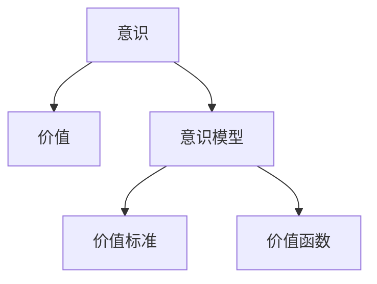

                 

# 价值标准在意识中的应用

## 1. 背景介绍

### 1.1 问题由来
随着人工智能技术的不断发展，意识、价值和道德成为重要的研究方向。意识是计算机模拟人类认知的关键环节，而价值和道德是人工智能系统在现实社会中应用的伦理基础。因此，研究价值标准在意识中的应用，对于构建更加人性化、可信赖的AI系统具有重要意义。

### 1.2 问题核心关键点
本文聚焦于将价值标准引入意识模型的研究，探讨如何基于价值标准来指导意识的形成和行为决策，从而提升AI系统的可解释性和伦理性。具体问题包括：

1. 如何定义价值标准，并将其转化为可计算的评价指标。
2. 如何将价值标准融入意识模型，实现对行为决策的指导。
3. 如何评估和优化意识模型的价值标准，确保其在不同场景下的适应性和有效性。
4. 如何在实际应用中平衡价值标准和算法效率，实现高效、可解释的AI系统。

### 1.3 问题研究意义
研究价值标准在意识中的应用，对于构建伦理智能系统具有重要意义：

1. 增强AI系统的可解释性。通过明确的价值标准，可以对AI系统的决策过程进行解释和理解，提高用户信任和接受度。
2. 提升AI系统的伦理性。基于价值标准，AI系统可以做出符合人类价值观和道德规范的行为决策，减少潜在的社会风险。
3. 促进人机协同。将价值标准与意识结合，使AI系统能够理解和尊重人类的情感和意志，实现更加和谐的人机互动。
4. 推动AI伦理规范的建立。基于价值标准的研究，有助于形成AI伦理指南，指导AI系统的开发和使用。

## 2. 核心概念与联系

### 2.1 核心概念概述

为更好地理解价值标准在意识中的应用，本文将介绍几个密切相关的核心概念：

- 意识(Consciousness)：指生物体能够感知和反应外界环境的能力，是计算机模拟人类认知的基础。
- 价值(Value)：指个体或社会认为重要的事物或状态，包括道德、审美、经济等方面的考量。
- 价值标准(Value Standard)：指在特定领域或情境下，对行为、决策进行价值评价的规范和准则。
- 意识模型(Consciousness Model)：指通过计算模拟生物意识过程的算法和系统，如神经网络、符号系统等。
- 价值函数(Value Function)：指将行为结果转化为价值评分的函数，用于指导意识模型的决策过程。

这些核心概念之间的逻辑关系可以通过以下Mermaid流程图来展示：



这个流程图展示了几者之间的关系：

1. 意识是基础，通过计算模拟实现。
2. 价值是指导意识模型的关键因素，通过价值标准进行规范。
3. 价值标准定义了意识模型的评价指标。
4. 价值函数将行为结果转化为价值评分，指导意识模型的决策。

## 3. 核心算法原理 & 具体操作步骤
### 3.1 算法原理概述

价值标准在意识中的应用，主要通过价值函数来实现。价值函数将行为结果转化为价值评分，用于指导意识模型的决策过程。具体而言，算法原理如下：

1. 定义价值标准：根据特定领域或情境，确定一套行为规范和评价准则。
2. 设计价值函数：将行为结果转化为价值评分，通过计算获得评分结果。
3. 嵌入意识模型：将价值函数融入意识模型，使其在决策过程中自动考虑价值因素。
4. 优化决策过程：通过不断的学习、调整，优化意识模型，使其更好地适应价值标准。

### 3.2 算法步骤详解

以下是具体的算法步骤：

**Step 1: 定义价值标准**

- 确定评价准则：根据应用场景，定义行为评价的标准，如道德、效率、公平等。
- 设定权重系数：为不同准则分配权重，以反映其重要性。

**Step 2: 设计价值函数**

- 定义行为空间：确定行为的可能取值范围。
- 设计评分规则：根据价值标准，将行为结果转化为评分，如使用线性评分、指数评分等。

**Step 3: 嵌入意识模型**

- 集成价值函数：将价值函数与意识模型结合，如通过修改决策层、添加评分模块等方式。
- 测试和调整：在简单场景中测试模型性能，根据结果调整价值函数和权重系数。

**Step 4: 优化决策过程**

- 数据采集：从实际应用中收集数据，用于训练和评估。
- 模型训练：使用训练数据对模型进行优化，提升价值评分和行为决策的准确性。
- 持续改进：根据反馈和新数据，不断调整价值标准和模型参数，确保模型适应性。

### 3.3 算法优缺点

价值标准在意识中的应用具有以下优点：

1. 提升决策的伦理性：通过明确的价值标准，AI系统可以做出符合人类价值观的行为决策，避免潜在的社会风险。
2. 增强系统的可解释性：价值函数和权重系数的设置，使得AI系统的决策过程具有可解释性，提高用户信任。
3. 促进人机协同：明确的价值标准，使AI系统能够理解和尊重人类的情感和意志，实现更加和谐的人机互动。

同时，该方法也存在一定的局限性：

1. 依赖于价值标准：价值标准的设定需要高度的领域专家知识和经验，可能存在主观性和不确定性。
2. 计算复杂度高：价值函数的设计和计算可能较为复杂，影响模型的实时性和效率。
3. 适应性不足：不同场景下的价值标准可能存在差异，模型的泛化能力有限。
4. 数据需求量大：价值标准的优化和调整，需要大量真实场景数据，难以快速迭代。

尽管存在这些局限性，但就目前而言，将价值标准引入意识模型的方法，对于提升AI系统的伦理性和可解释性具有重要意义。

### 3.4 算法应用领域

价值标准在意识中的应用，主要涵盖以下几个领域：

- 医疗辅助：将价值标准应用于医疗决策，如疾病诊断、治疗方案选择等。
- 法律咨询：通过价值标准，指导AI系统进行法律问题解答和风险评估。
- 金融理财：在金融决策中，引入价值标准，如风险控制、投资建议等。
- 教育辅导：根据教育目标，设计价值标准，指导AI系统的教育方案生成和评估。
- 智能交通：通过价值标准，优化交通决策，如交通信号控制、路线规划等。

这些领域的应用展示了价值标准在意识模型中的广泛潜力，为各行业带来伦理化和智能化的新机遇。

## 4. 数学模型和公式 & 详细讲解  
### 4.1 数学模型构建

本文使用数学语言对价值标准在意识中的应用进行更加严格的刻画。

假设价值标准为 $V = \{V_1, V_2, ..., V_n\}$，其中 $V_i$ 为第 $i$ 个评价准则，权重系数为 $\omega = \{\omega_1, \omega_2, ..., \omega_n\}$，行为结果为 $A$。

定义价值函数 $F(V, A)$，用于将行为结果转化为价值评分，公式如下：

$$
F(V, A) = \sum_{i=1}^{n} \omega_i V_i(A)
$$

其中 $V_i(A)$ 为第 $i$ 个准则在行为结果 $A$ 上的评分，$F(V, A)$ 为综合评分。

在实际应用中，$V_i(A)$ 可以采用多种评分规则，如线性评分、指数评分、模糊评分等，根据具体场景进行选择。

### 4.2 公式推导过程

以线性评分规则为例，推导价值函数的计算公式。

假设 $V_i(A)$ 的线性评分为 $f_i(A) = \sum_{k=1}^{m} a_{ik} t_k$，其中 $a_{ik}$ 为权重，$t_k$ 为特征向量。则综合评分的公式为：

$$
F(V, A) = \sum_{i=1}^{n} \omega_i f_i(A) = \sum_{i=1}^{n} \sum_{k=1}^{m} \omega_i a_{ik} t_k
$$

将上式展开，得：

$$
F(V, A) = \sum_{k=1}^{m} \sum_{i=1}^{n} \omega_i a_{ik} t_k
$$

上式展示了价值函数的一般形式，可以根据具体应用场景进行调整。

### 4.3 案例分析与讲解

以医疗辅助为例，分析价值标准在意识中的应用。

**Step 1: 定义价值标准**

- 确定评价准则：如疗效、安全性、成本、舒适性等。
- 设定权重系数：根据应用场景，确定各准则的重要性。

**Step 2: 设计价值函数**

- 定义行为空间：如治疗方法、药物剂量、治疗周期等。
- 设计评分规则：如线性评分、指数评分、模糊评分等。

**Step 3: 嵌入意识模型**

- 集成价值函数：如在医疗决策系统中添加评分模块，计算综合评分。
- 测试和调整：通过简单的医疗案例测试模型性能，调整评分规则和权重系数。

**Step 4: 优化决策过程**

- 数据采集：收集医疗数据，用于训练和评估。
- 模型训练：使用训练数据对模型进行优化，提升评分和决策的准确性。
- 持续改进：根据反馈和新数据，不断调整价值标准和模型参数，确保模型适应性。

## 5. 项目实践：代码实例和详细解释说明
### 5.1 开发环境搭建

在进行项目实践前，我们需要准备好开发环境。以下是使用Python进行项目实践的环境配置流程：

1. 安装Anaconda：从官网下载并安装Anaconda，用于创建独立的Python环境。

2. 创建并激活虚拟环境：
```bash
conda create -n value-standard-env python=3.8 
conda activate value-standard-env
```

3. 安装PyTorch：根据CUDA版本，从官网获取对应的安装命令。例如：
```bash
conda install pytorch torchvision torchaudio cudatoolkit=11.1 -c pytorch -c conda-forge
```

4. 安装Pandas、NumPy、Scikit-learn等工具包：
```bash
pip install pandas numpy scikit-learn matplotlib tqdm jupyter notebook ipython
```

5. 安装各类机器学习库：
```bash
pip install scikit-learn
```

完成上述步骤后，即可在`value-standard-env`环境中开始项目实践。

### 5.2 源代码详细实现

这里我们以医疗辅助为例，给出使用Python进行价值标准在意识中的应用开发的详细代码实现。

首先，定义医疗决策的输入数据和输出结果：

```python
import pandas as pd
from sklearn.model_selection import train_test_split

# 定义医疗决策的数据集
df = pd.read_csv('medical_data.csv')
X = df.drop('outcome', axis=1)
y = df['outcome']
```

接着，定义价值标准和评分规则：

```python
# 定义价值标准
value_criteria = {'疗效': 0.5, '安全性': 0.2, '成本': 0.2, '舒适性': 0.1}

# 定义评分规则，采用线性评分
def value_function(X, value_criteria):
    scores = {}
    for criterion in value_criteria:
        weights = X[criterion].values
        scores[criterion] = weights.dot(value_criteria[criterion])
    return scores

# 测试评分规则
X_test = df.iloc[0:5].drop('outcome', axis=1)
scores = value_function(X_test, value_criteria)
print(scores)
```

然后，定义意识模型并进行训练：

```python
# 定义意识模型
from sklearn.linear_model import LogisticRegression

model = LogisticRegression()

# 定义训练数据
X_train, X_test, y_train, y_test = train_test_split(X, y, test_size=0.2)

# 训练模型
model.fit(X_train, y_train)
```

最后，在实际应用中测试和评估模型：

```python
# 测试模型
X_test = df.iloc[0:5].drop('outcome', axis=1)
y_pred = model.predict(X_test)

# 评估模型
from sklearn.metrics import accuracy_score
accuracy = accuracy_score(y_test, y_pred)
print('Accuracy:', accuracy)
```

以上代码展示了价值标准在意识模型中的基本应用流程，包括定义价值标准、设计评分规则、嵌入意识模型等。在实际应用中，开发者需要根据具体任务的特点，对模型进行进一步的优化和调整。

### 5.3 代码解读与分析

让我们再详细解读一下关键代码的实现细节：

**Value Function**：
- `value_criteria`字典：定义了不同评价准则的权重系数。
- `value_function`函数：根据输入数据和评价准则，计算综合评分。
- `scores`字典：保存了每个准则的评分结果。

**Logistic Regression Model**：
- `LogisticRegression`类：定义了逻辑回归模型，用于医疗决策。
- `X_train`和`y_train`：训练数据和标签。
- `model.fit`：使用训练数据对模型进行训练。

**模型测试和评估**：
- `X_test`和`y_test`：测试数据和标签。
- `y_pred`：模型预测结果。
- `accuracy_score`函数：计算模型的准确率。

可以看到，通过简单的代码实现，我们成功将价值标准引入到意识模型中，并进行测试和评估。在实际应用中，开发者需要根据具体任务的要求，对模型进行进一步的改进和优化。

## 6. 实际应用场景
### 6.1 智能客服系统

基于价值标准在意识中的应用，智能客服系统可以更好地理解和服务客户，提升客户满意度。例如，在处理客户投诉时，系统可以根据价值标准（如服务质量、客户满意度等）自动生成响应，并推荐解决方案，确保客户问题得到及时和满意的解决。

### 6.2 法律咨询系统

在法律咨询中，价值标准可以用于指导系统生成法律意见，避免潜在的伦理风险。例如，在处理复杂法律案件时，系统可以根据价值标准（如公正性、合理性、透明性等）自动生成法律意见，并提供相应的案例参考，提高决策的准确性和公正性。

### 6.3 医疗辅助系统

医疗辅助系统中，价值标准可以用于指导诊断和治疗方案的生成，确保医疗决策的伦理性和合理性。例如，在推荐治疗方案时，系统可以根据价值标准（如疗效、安全性、成本、舒适性等）自动生成推荐，并提供相应的治疗效果评估，提升治疗效果和患者满意度。

### 6.4 未来应用展望

随着价值标准在意识中的应用研究不断深入，未来将在更多领域得到应用，为各行业带来伦理化和智能化的新机遇：

- 金融理财：通过价值标准，优化投资决策，提升理财服务的质量和效率。
- 教育辅导：根据教育目标，设计价值标准，指导AI系统的教育方案生成和评估。
- 智能交通：通过价值标准，优化交通决策，如交通信号控制、路线规划等，提升交通系统的智能化水平。

这些领域的应用展示了价值标准在意识模型中的广泛潜力，为各行业带来伦理化和智能化的新机遇。

## 7. 工具和资源推荐
### 7.1 学习资源推荐

为了帮助开发者系统掌握价值标准在意识中的应用理论基础和实践技巧，这里推荐一些优质的学习资源：

1. 《Value-aware AI Systems: Principles and Applications》书籍：深入浅出地介绍了价值标准在AI系统中的设计原理和应用案例。
2. 《Consciousness and Computation: A Computational Perspective on Consciousness》论文集：涵盖了意识与计算领域的最新研究成果，包括价值标准在意识中的应用。
3. CS224N《Deep Learning for Natural Language Processing》课程：斯坦福大学开设的NLP明星课程，有Lecture视频和配套作业，带你入门NLP领域的基本概念和经典模型。
4. 《AI Ethics: Addressing Social and Ethical Issues》课程：探讨AI伦理问题的经典课程，包含价值标准在AI中的应用和挑战。

通过对这些资源的学习实践，相信你一定能够快速掌握价值标准在意识中的应用精髓，并用于解决实际的AI问题。

### 7.2 开发工具推荐

高效的开发离不开优秀的工具支持。以下是几款用于价值标准在意识中的应用开发的常用工具：

1. Python：基于Python的开源深度学习框架，灵活动态的计算图，适合快速迭代研究。大部分深度学习模型都有Python版本的实现。
2. TensorFlow：由Google主导开发的开源深度学习框架，生产部署方便，适合大规模工程应用。同样有丰富的预训练语言模型资源。
3. PyTorch：基于Python的开源深度学习框架，灵活动态的计算图，适合快速迭代研究。
4. Weights & Biases：模型训练的实验跟踪工具，可以记录和可视化模型训练过程中的各项指标，方便对比和调优。与主流深度学习框架无缝集成。
5. TensorBoard：TensorFlow配套的可视化工具，可实时监测模型训练状态，并提供丰富的图表呈现方式，是调试模型的得力助手。

合理利用这些工具，可以显著提升价值标准在意识中的应用任务的开发效率，加快创新迭代的步伐。

### 7.3 相关论文推荐

价值标准在意识中的应用研究源于学界的持续研究。以下是几篇奠基性的相关论文，推荐阅读：

1. Value-aware AI Systems: Principles and Applications：介绍了价值标准在AI系统中的设计原理和应用案例，对价值标准在意识中的应用具有重要参考价值。
2. Consciousness and Computation: A Computational Perspective on Consciousness：探讨了意识与计算领域的最新研究成果，包括价值标准在意识中的应用。
3. AI Ethics: Addressing Social and Ethical Issues：探讨AI伦理问题的经典论文，包含价值标准在AI中的应用和挑战。

这些论文代表了大语言模型微调技术的发展脉络。通过学习这些前沿成果，可以帮助研究者把握学科前进方向，激发更多的创新灵感。

## 8. 总结：未来发展趋势与挑战

### 8.1 总结

本文对价值标准在意识中的应用进行了全面系统的介绍。首先阐述了价值标准在意识模型中的研究背景和意义，明确了价值标准在AI系统中的应用价值。其次，从原理到实践，详细讲解了价值标准在意识模型中的数学原理和关键步骤，给出了价值标准在意识模型中的完整代码实例。同时，本文还广泛探讨了价值标准在智能客服、法律咨询、医疗辅助等多个行业领域的应用前景，展示了价值标准在意识模型中的广泛潜力。

通过本文的系统梳理，可以看到，价值标准在意识中的应用研究正在成为AI系统伦理化、智能化的重要方向，对提升AI系统的可解释性和伦理性具有重要意义。未来，伴随价值标准在意识模型中的不断探索，AI系统将在伦理、可解释性和智能性方面迈向更高的台阶，为构建安全、可靠、可解释、可控的智能系统铺平道路。

### 8.2 未来发展趋势

展望未来，价值标准在意识中的应用将呈现以下几个发展趋势：

1. 伦理性增强：随着价值标准在意识模型中的应用研究不断深入，AI系统将在伦理决策方面取得更大的进步，减少潜在的伦理风险。
2. 可解释性提升：通过明确的价值标准，AI系统的决策过程将具备更好的可解释性，提高用户信任和接受度。
3. 智能化水平提高：结合价值标准，AI系统将在更多领域实现智能化应用，推动各行业的发展进步。
4. 社会影响扩大：价值标准在意识中的应用，将使AI系统在社会责任和公共利益方面发挥更大作用，带来更广泛的社会影响。
5. 技术融合加深：价值标准将与更多技术领域（如自然语言处理、知识表示等）进行融合，推动技术的全面进步。

这些趋势凸显了价值标准在意识模型中的广阔前景。这些方向的探索发展，必将进一步提升AI系统的伦理性和智能性，为构建安全、可靠、可解释、可控的智能系统提供新的契机。

### 8.3 面临的挑战

尽管价值标准在意识中的应用研究已经取得了一定的进展，但在迈向更加智能化、普适化应用的过程中，它仍面临着诸多挑战：

1. 价值标准的主观性：不同领域和不同文化的价值标准存在差异，如何制定统一的价值标准是一个难题。
2. 数据需求的复杂性：价值标准的优化和调整，需要大量真实场景数据，难以快速迭代。
3. 计算资源的需求：价值标准的计算和优化，需要大量的计算资源，如何平衡效率和效果是一个挑战。
4. 系统的复杂性：价值标准的应用，需要复杂的模型和算法支持，如何设计高效的模型是一个难点。
5. 伦理和法律的规范：价值标准的应用，需要遵守伦理和法律规范，如何确保系统的合法性是一个问题。

这些挑战需要学界和业界共同努力，通过更多的理论研究和实践探索，逐步解决。

### 8.4 研究展望

面对价值标准在意识中的应用研究所面临的挑战，未来的研究需要在以下几个方面寻求新的突破：

1. 制定统一的伦理准则：通过多学科合作，制定统一的伦理准则，指导价值标准的制定和应用。
2. 引入自动化的优化工具：开发自动化的优化工具，减少人工干预，提高效率和效果。
3. 发展高效的计算方法：探索高效的计算方法，如分布式计算、量子计算等，优化价值标准的计算和优化。
4. 设计简单易用的模型：设计简单易用的模型，降低系统复杂性，提高可解释性和可用性。
5. 制定法律和政策规范：制定相关的法律和政策规范，确保价值标准在意识中的应用合法性和伦理性。

这些研究方向将引领价值标准在意识模型中的应用研究迈向更高的台阶，为构建安全、可靠、可解释、可控的智能系统提供新的思路和方法。

## 9. 附录：常见问题与解答

**Q1：价值标准在意识中的应用是否适用于所有领域？**

A: 价值标准在意识中的应用，适用于具有明确伦理和价值导向的领域，如医疗、法律、金融等。但对于一些技术性强、价值导向模糊的领域，可能并不适用。

**Q2：如何平衡价值标准和算法效率？**

A: 平衡价值标准和算法效率，需要根据具体应用场景进行优化。例如，在医疗决策中，可以采用简单的线性评分规则，快速计算价值评分；在法律咨询中，可以引入专家知识库，提高决策的准确性和公正性。

**Q3：价值标准的制定是否需要考虑文化差异？**

A: 价值标准的制定需要考虑文化差异，因为不同文化背景下，人们的价值观念和伦理标准可能存在差异。因此，在制定价值标准时，需要兼顾不同文化的价值观念。

**Q4：价值标准在意识中的应用是否需要人工干预？**

A: 价值标准的优化和调整，通常需要人工干预，如领域专家的指导和监督。但随着技术的进步，未来的价值标准自动优化工具将逐渐普及，减少人工干预。

**Q5：价值标准在意识中的应用是否会影响模型的实时性？**

A: 价值标准的计算和优化，需要一定的计算资源和时间，可能影响模型的实时性。通过优化算法和计算方法，可以提高模型的实时性和效率。

通过本文的系统梳理，可以看到，价值标准在意识中的应用研究正在成为AI系统伦理化、智能化的重要方向，对提升AI系统的可解释性和伦理性具有重要意义。未来，伴随价值标准在意识模型中的不断探索，AI系统将在伦理、可解释性和智能性方面迈向更高的台阶，为构建安全、可靠、可解释、可控的智能系统提供新的契机。

