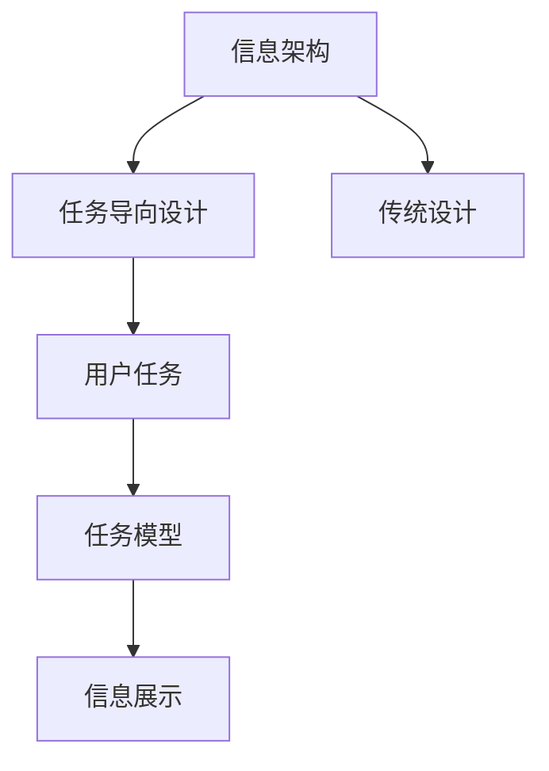

                 

# 任务导向设计对信息架构的深远影响

## 1. 背景介绍

### 1.1 问题由来

在当前数字化信息时代，信息架构（Information Architecture, IA）作为设计信息展示和组织的重要手段，已成为网页设计、数字内容管理、用户界面（UI）设计等各个领域的基础。然而，传统的信息架构往往过于关注内容信息的静态展示和组织，而忽视了用户任务需求的多样性和动态变化，导致用户在使用信息时容易产生困惑和障碍。

任务导向设计（Task-Oriented Design, TOD）作为当前设计领域的一种新范式，强调以用户任务为中心，关注用户完成任务时的路径和需求，从根本上提升信息展示和组织的有效性。本文将探讨任务导向设计如何深远影响信息架构，推动其向更加用户导向和功能导向的方向发展。

### 1.2 问题核心关键点

任务导向设计之所以能够影响信息架构，主要是因为其关注点在于：

1. **用户任务目标**：明确用户需要完成的具体任务，从而设计出更贴合用户需求的信息结构和展示形式。
2. **任务路径优化**：通过理解用户的任务流程，优化信息架构的布局，简化用户操作路径，提高任务完成效率。
3. **任务反馈机制**：引入及时的任务反馈，使用户能够实时了解任务进展，增强用户体验。

本文将从核心概念、算法原理、实践案例等多个维度深入探讨任务导向设计对信息架构的影响，并提出未来发展的趋势和面临的挑战。

## 2. 核心概念与联系

### 2.1 核心概念概述

为更好地理解任务导向设计对信息架构的影响，本节将介绍几个密切相关的核心概念：

- **信息架构（Information Architecture, IA）**：一种设计学科，关注信息内容的组织和展示，以提升用户体验和信息查找效率。
- **任务导向设计（Task-Oriented Design, TOD）**：一种设计方法论，以用户任务为中心，优化信息结构，提升信息展示的有效性。
- **用户任务（User Task）**：用户在使用产品或服务时所需要完成的具体行为或目标。
- **任务模型（Task Model）**：描述用户完成特定任务所需的步骤、信息和操作界面。
- **信息展示（Information Display）**：通过布局、排版、颜色等手段展示信息内容，使其易于理解和使用。

这些核心概念之间的逻辑关系可以通过以下Mermaid流程图来展示：



这个流程图展示了一个从信息架构到任务导向设计的转化过程：

1. 信息架构首先关注内容的组织和展示。
2. 通过引入任务导向设计，信息架构更加关注用户任务目标。
3. 任务模型详细描述用户完成任务的路径和需求。
4. 信息展示则通过优化布局和排版，确保信息的有效展示。

## 3. 核心算法原理 & 具体操作步骤

### 3.1 算法原理概述

任务导向设计对信息架构的影响，主要体现在以下几个方面：

1. **任务模型构建**：通过理解用户任务，构建详细的任务模型，从而设计出更合理的信息结构。
2. **信息展示优化**：根据任务模型，优化信息展示的形式，使信息展示更加直观和易用。
3. **用户反馈集成**：设计用户反馈机制，及时获取用户的使用情况和满意度，持续优化信息架构。

### 3.2 算法步骤详解

基于任务导向设计的信息架构构建主要包括以下几个关键步骤：

**Step 1: 任务调研与分析**
- 收集用户需求和行为数据，通过问卷调查、用户访谈等方式了解用户任务目标和需求。
- 分析用户任务类型，分类任务为简单、复杂或创造性任务。

**Step 2: 任务建模**
- 绘制用户任务流程图，详细描述每个任务步骤和所需信息。
- 设计任务界面原型，包括信息的展示方式、操作界面等。

**Step 3: 信息架构设计**
- 根据任务模型，设计信息架构，明确内容的组织层次和展示方式。
- 优化信息展示形式，如布局、颜色、排版等，提升用户理解和使用效率。

**Step 4: 用户反馈与迭代**
- 设计用户反馈机制，如日志记录、用户评论等，收集用户使用情况和满意度。
- 根据反馈结果，持续优化信息架构和展示形式，迭代改进。

### 3.3 算法优缺点

任务导向设计对信息架构的影响具有以下优点：

1. **用户导向性**：通过关注用户任务，设计出更贴合用户需求的信息结构。
2. **任务流程优化**：优化用户任务路径，减少操作步骤，提升任务完成效率。
3. **信息展示明确**：明确展示信息结构和展示形式，增强用户理解和使用。

同时，该方法也存在一定的局限性：

1. **设计和实施复杂**：需要详细理解用户任务和需求，设计复杂且耗时。
2. **数据依赖性高**：依赖大量用户调研和行为数据，获取数据成本高。
3. **用户反馈难以量化**：用户反馈难以量化，影响优化效果的评估。

尽管存在这些局限性，但就目前而言，任务导向设计仍然是大规模信息架构设计的有效工具。未来相关研究的重点在于如何进一步降低数据获取成本，提高任务建模的自动化水平，同时兼顾用户反馈的可量化性和有效性。

### 3.4 算法应用领域

任务导向设计在多个领域已得到广泛应用，以下是几个典型案例：

- **数字图书馆**：通过任务导向设计，优化信息架构，提升用户查找和浏览图书的效率。
- **电子商务网站**：优化搜索和推荐功能，简化购物流程，提升用户购买体验。
- **企业知识管理系统**：设计知识分类和搜索架构，提高员工查找和利用内部知识的效率。
- **医疗信息平台**：优化信息展示和查询功能，帮助医生和患者快速获取所需信息。

除了这些典型应用外，任务导向设计还被创新性地应用到更多场景中，如智能客服系统、旅游信息平台、教育培训系统等，为信息架构的优化提供了新的思路。

## 4. 数学模型和公式 & 详细讲解 & 举例说明

### 4.1 数学模型构建

任务导向设计的数学模型主要涉及用户任务路径的建模和信息展示的优化。以下是一个简单的用户任务路径模型：

假设用户完成任务需要经过$n$个步骤，每个步骤所需的信息为$x_i$，操作界面为$u_i$。则用户任务模型的数学表示如下：

$$
\mathcal{T} = \{(x_1, u_1), (x_2, u_2), ..., (x_n, u_n)\}
$$

其中$x_i$和$u_i$分别为第$i$个步骤的信息和操作界面。

### 4.2 公式推导过程

根据任务模型$\mathcal{T}$，信息展示的优化目标是最大化用户任务完成效率。设每个步骤的信息展示效率为$e_i$，则总的信息展示效率为：

$$
\mathcal{E} = \sum_{i=1}^n e_i
$$

通过优化$e_i$，可以提升信息展示的整体效率。具体优化方法包括：

- 减少不必要的信息展示：去除冗余信息，提升信息展示的准确性。
- 优化信息展示方式：通过图表、标签等手段，提高信息的可读性。
- 简化操作界面：减少用户的操作步骤，提高操作的便捷性。

### 4.3 案例分析与讲解

假设一个电商网站的商品浏览任务，涉及以下步骤：

1. 搜索框输入关键词
2. 展示搜索结果
3. 选择商品并查看详细信息
4. 加入购物车并结算

基于任务导向设计，可以构建如下用户任务模型：

$$
\mathcal{T} = \{(\text{搜索框}, \text{关键词}), (\text{搜索结果}, \text{商品列表}), (\text{商品详情}, \text{商品描述}), (\text{购物车}, \text{商品数量}), (\text{结算}, \text{订单信息})\}
$$

通过优化搜索结果和商品详情的界面展示，提升用户浏览和选择商品的效率。同时，简化操作界面，减少操作步骤，提升用户的购买体验。

## 5. 项目实践：代码实例和详细解释说明

### 5.1 开发环境搭建

在进行任务导向设计的信息架构实践前，我们需要准备好开发环境。以下是使用HTML、CSS、JavaScript等前端技术进行任务导向设计实践的环境配置流程：

1. 安装Node.js和npm，作为JavaScript的运行环境。
2. 创建项目目录，初始化npm项目。
3. 安装相关依赖库，如React、D3.js、Axios等。

完成上述步骤后，即可在项目环境中开始任务导向设计的信息架构实践。

### 5.2 源代码详细实现

下面我们以电商网站商品浏览任务为例，给出使用React技术对信息展示进行任务导向设计的代码实现。

首先，定义任务模型：

```javascript
const taskModel = {
    step1: {
        title: "搜索商品",
        info: "请输入商品关键词"
    },
    step2: {
        title: "显示搜索结果",
        info: "请选择商品"
    },
    step3: {
        title: "查看商品详情",
        info: "请查看商品描述"
    },
    step4: {
        title: "加入购物车",
        info: "请填写商品数量"
    },
    step5: {
        title: "结算订单",
        info: "请填写订单信息"
    }
};
```

然后，定义信息展示组件：

```javascript
function TaskInfo({ step }) {
    return (
        <div>
            <h2>{step.title}</h2>
            <p>{step.info}</p>
        </div>
    );
}

function TaskDisplay({ tasks }) {
    return (
        <div>
            {tasks.map(task => <TaskInfo key={task.title} step={task} />)}
        </div>
    );
}
```

接着，设计任务流程图：

```javascript
function TaskFlow({ tasks }) {
    return (
        <div>
            <TaskDisplay tasks={tasks} />
            <svg>
                {tasks.map((task, index) => (
                    <path key={index} d={`M0,${index * 50} L${tasks.length * 50},${index * 50}`} />
                ))}
            </svg>
        </div>
    );
}
```

最后，整合任务模型和信息展示：

```javascript
const TaskApp = () => {
    const tasks = [
        { title: "搜索商品", info: "请输入商品关键词" },
        { title: "显示搜索结果", info: "请选择商品" },
        { title: "查看商品详情", info: "请查看商品描述" },
        { title: "加入购物车", info: "请填写商品数量" },
        { title: "结算订单", info: "请填写订单信息" }
    ];

    return (
        <div>
            <TaskFlow tasks={tasks} />
            <TaskDisplay tasks={tasks} />
        </div>
    );
}
```

以上代码展示了使用React技术进行任务导向设计的全过程：

1. 定义任务模型，描述用户任务流程和所需信息。
2. 设计信息展示组件，对每个任务步骤的信息进行展示。
3. 设计任务流程图，通过SVG展示用户任务路径。
4. 整合任务模型和信息展示，形成完整的信息架构。

### 5.3 代码解读与分析

让我们再详细解读一下关键代码的实现细节：

**TaskModel类**：
- `step1`到`step5`：定义了电商网站的商品浏览任务中的每个步骤，包括步骤标题和所需信息。

**TaskInfo组件**：
- 对每个任务步骤的信息进行展示，采用`<h2>`和`<p>`标签分别展示步骤标题和信息。

**TaskDisplay组件**：
- 将任务模型中的每个步骤传递给`TaskInfo`组件，并渲染到页面上。

**TaskFlow组件**：
- 设计任务流程图，使用SVG绘制任务路径，通过`<path>`标签表示任务之间的连接。

**TaskApp组件**：
- 整合任务模型、信息展示和任务流程图，形成一个完整的电商商品浏览任务的信息架构。

**App根组件**：
- 将`TaskFlow`和`TaskDisplay`组件整合到页面上，形成用户任务导向的信息展示。

可以看到，React技术使得任务导向设计的信息架构构建变得简洁高效。开发者可以将更多精力放在任务模型的设计和信息展示的优化上，而不必过多关注底层的实现细节。

当然，工业级的系统实现还需考虑更多因素，如动态数据渲染、组件复用、用户交互等。但核心的任务导向设计基本与此类似。

## 6. 实际应用场景

### 6.1 智慧城市信息管理

智慧城市信息管理平台的设计，需要考虑不同用户（如市民、企业、政府部门）的任务需求和信息展示需求。通过任务导向设计，可以有效提升信息展示的针对性和有效性，从而优化智慧城市信息管理系统的用户体验。

具体而言，可以收集不同用户的信息需求和使用场景，设计详细的功能任务模型。例如，针对市民的智慧城市信息管理，可以设计如下任务模型：

1. 城市公共服务查询
2. 公共交通信息获取
3. 公共设施搜索
4. 紧急事件报警
5. 个人账户管理

基于这些任务模型，可以设计出适合不同用户的信息展示界面和操作流程，提升用户的使用体验。

### 6.2 医疗健康信息平台

医疗健康信息平台的设计，需要考虑医生的诊断和治疗任务需求，以及患者的就医和健康管理需求。通过任务导向设计，可以优化信息展示，提高医疗系统的效率和准确性。

具体而言，可以设计如下医生和患者的任务模型：

**医生任务模型**：
1. 病历查询和分析
2. 病人信息录入
3. 诊断和治疗方案制定
4. 病人随访和记录

**患者任务模型**：
1. 病史记录和查询
2. 健康状况监测
3. 医生在线咨询
4. 药物使用记录

基于这些任务模型，可以设计出适合医生和患者的信息展示界面和操作流程，提升医疗系统的效率和准确性。

### 6.3 教育培训信息平台

教育培训信息平台的设计，需要考虑学生和教师的任务需求和信息展示需求。通过任务导向设计，可以有效提升信息展示的针对性和有效性，从而优化教育培训系统的用户体验。

具体而言，可以设计如下学生和教师的任务模型：

**学生任务模型**：
1. 课程学习
2. 作业提交和反馈
3. 考试准备
4. 在线讨论和互动

**教师任务模型**：
1. 课程设计和管理
2. 作业批改和反馈
3. 在线课程讲授
4. 学生互动和评估

基于这些任务模型，可以设计出适合学生和教师的信息展示界面和操作流程，提升教育培训系统的效率和效果。

### 6.4 未来应用展望

随着任务导向设计技术的发展，其在信息架构设计中的应用前景将更加广阔。未来，任务导向设计将推动信息架构向更加用户导向和功能导向的方向发展，具体趋势如下：

1. **多渠道支持**：任务导向设计将扩展到多个渠道，如网页、移动应用、智能音箱等，提供统一的体验。
2. **实时交互**：引入实时交互设计，提升用户的参与感和互动性。
3. **个性化展示**：根据用户的历史行为和偏好，个性化展示信息和操作界面，提升用户满意度。
4. **智能推荐**：结合智能推荐技术，提供个性化的任务导向展示，提升用户的使用体验。

这些趋势将使信息架构设计更加智能化和个性化，带来更加优质和高效的信息展示和用户体验。

## 7. 工具和资源推荐

### 7.1 学习资源推荐

为了帮助开发者系统掌握任务导向设计的方法和实践技巧，这里推荐一些优质的学习资源：

1. **《信息架构设计》系列书籍**：介绍信息架构设计的核心概念、方法和实践案例，帮助设计师掌握信息架构设计的基本原理。
2. **《任务导向设计》课程**：由UX设计专家开设的在线课程，系统讲解任务导向设计的方法和技巧，帮助设计师提升设计能力。
3. **《设计心理学》书籍**：探讨用户心理和行为，帮助设计师更好地理解用户需求，设计出更加贴合用户任务的信息架构。
4. **Dribbble和Behance**：展示优秀的设计作品和案例，帮助设计师学习和借鉴任务导向设计的成功经验。

通过对这些资源的学习实践，相信你一定能够快速掌握任务导向设计的精髓，并用于解决实际的信息架构问题。

### 7.2 开发工具推荐

高效的任务导向设计需要优秀的工具支持。以下是几款用于信息架构设计的常用工具：

1. **Sketch**：广泛使用的UI设计工具，支持任务导向设计的原型设计。
2. **Balsamiq**：快速原型设计工具，支持任务导向设计的快速迭代。
3. **Figma**：基于云端的设计工具，支持多人协作和任务导向设计的实时修改。
4. **Axure RP**：原型设计工具，支持任务导向设计的复杂功能和交互。

合理利用这些工具，可以显著提升任务导向设计的信息架构开发效率，加快创新迭代的步伐。

### 7.3 相关论文推荐

任务导向设计在信息架构设计中的应用，受到了学术界的广泛关注。以下是几篇奠基性的相关论文，推荐阅读：

1. **《信息架构设计基础》**：介绍信息架构设计的核心概念和方法，系统讲解任务导向设计的理论基础。
2. **《任务导向设计的实践指南》**：提供任务导向设计的具体案例和实践方法，帮助设计师提升设计能力。
3. **《多渠道信息架构设计》**：探讨跨渠道信息架构设计的理论和实践，提升信息展示的多样性和用户体验。

这些论文代表了大规模信息架构设计的演进脉络。通过学习这些前沿成果，可以帮助研究者把握学科前进方向，激发更多的创新灵感。

## 8. 总结：未来发展趋势与挑战

### 8.1 总结

本文对任务导向设计对信息架构的深远影响进行了全面系统的介绍。首先阐述了任务导向设计在信息架构设计中的重要性和影响机制，明确了任务导向设计在提升信息展示和用户体验方面的独特价值。其次，从核心概念、算法原理、实践案例等多个维度深入探讨了任务导向设计对信息架构的全面影响，并提出了未来发展的趋势和面临的挑战。

通过本文的系统梳理，可以看到，任务导向设计已经深刻改变了信息架构的构建方式，推动其向更加用户导向和功能导向的方向发展。未来，随着技术的发展和应用场景的拓展，任务导向设计必将在信息架构设计中发挥更大的作用，带来更加高效和优化的信息展示和用户体验。

### 8.2 未来发展趋势

展望未来，任务导向设计在信息架构设计中的应用将呈现以下几个发展趋势：

1. **智能化和个性化**：结合人工智能和机器学习技术，提供个性化的信息展示和操作界面，提升用户的使用体验。
2. **多模态融合**：引入多模态信息展示和交互，提升信息展示的多样性和用户体验。
3. **实时反馈**：引入实时反馈机制，及时获取用户的使用情况和满意度，持续优化信息架构。
4. **跨渠道一致性**：提供跨渠道的一致性信息展示和操作界面，提升用户的连贯性和体验。
5. **人机协同**：引入人机协同设计，提升信息展示的效率和准确性，增强用户的使用体验。

这些趋势将使任务导向设计在信息架构设计中发挥更大的作用，带来更加高效和优化的信息展示和用户体验。

### 8.3 面临的挑战

尽管任务导向设计在信息架构设计中的应用前景广阔，但在实际应用过程中，仍然面临诸多挑战：

1. **设计和实施复杂**：任务导向设计需要详细理解用户任务和需求，设计复杂且耗时。
2. **数据依赖性高**：依赖大量用户调研和行为数据，获取数据成本高。
3. **用户反馈难以量化**：用户反馈难以量化，影响优化效果的评估。
4. **跨渠道一致性**：提供跨渠道的一致性信息展示和操作界面，需要多渠道设计和管理。
5. **技术和资源限制**：结合人工智能和机器学习技术，需要更高的技术和资源投入。

尽管存在这些挑战，但通过不断优化设计方法和工具，引入人工智能和机器学习技术，任务导向设计必将在信息架构设计中发挥更大的作用，带来更加高效和优化的信息展示和用户体验。

### 8.4 研究展望

未来，任务导向设计在信息架构设计中的应用需要更多的研究和实践，以下是几个重要的研究方向：

1. **用户任务建模**：进一步探索用户任务建模的方法和技术，提高任务模型的准确性和可操作性。
2. **任务导向设计工具**：开发更加智能和灵活的任务导向设计工具，支持多渠道和实时交互的设计。
3. **个性化展示**：结合个性化展示技术，提供个性化的信息展示和操作界面，提升用户的使用体验。
4. **智能推荐**：结合智能推荐技术，提供个性化的任务导向展示，提升用户的使用体验。
5. **跨渠道一致性**：探索跨渠道信息架构设计的方法和技术，提供一致性的信息展示和操作界面。

这些研究方向将推动任务导向设计在信息架构设计中的不断进步，带来更加高效和优化的信息展示和用户体验。

## 9. 附录：常见问题与解答

**Q1: 任务导向设计如何提升用户体验？**

A: 任务导向设计通过明确用户任务目标和路径，优化信息展示和操作界面，从而提升用户体验。具体而言，任务导向设计关注用户完成任务时的路径和需求，通过优化任务路径和信息展示，减少操作步骤，简化操作界面，提升用户的使用效率和满意度。

**Q2: 任务导向设计如何处理复杂任务？**

A: 对于复杂任务，任务导向设计可以采用任务分解和分阶段的策略，将复杂任务拆分为多个简单任务，逐步完成。例如，在设计电商网站的商品购买流程时，可以将整个流程拆分为搜索商品、查看详情、加入购物车、结算订单等多个子任务，逐步完成。同时，通过优化每个子任务的信息展示和操作界面，提升用户的使用体验。

**Q3: 任务导向设计和信息架构设计的区别是什么？**

A: 任务导向设计强调以用户任务为中心，关注用户完成任务的路径和需求，优化信息展示和操作界面。而信息架构设计则更多关注内容的组织和展示，提升信息查找效率和用户体验。任务导向设计是信息架构设计的一部分，通过关注用户任务，优化信息展示和操作界面，提升用户体验。

**Q4: 任务导向设计如何应对数据量不足的问题？**

A: 任务导向设计依赖大量用户调研和行为数据，但当数据量不足时，可以通过用户行为分析和模拟仿真等方法，获取更多的任务模型和用户需求。例如，可以使用A/B测试等方法，收集用户对信息展示和操作界面的反馈，持续优化任务导向设计。

**Q5: 任务导向设计如何适应快速变化的用户需求？**

A: 任务导向设计需要持续收集用户反馈，及时调整任务模型和信息展示。可以通过引入实时反馈机制，如用户评论、在线调查等，获取用户对信息展示和操作界面的反馈，持续优化任务导向设计。同时，引入自适应设计和个性化展示技术，根据用户的历史行为和偏好，动态调整信息展示和操作界面，适应快速变化的用户需求。

通过以上解答，相信你能够更好地理解任务导向设计在信息架构设计中的重要性和影响机制，掌握任务导向设计的核心方法和实践技巧，推动信息架构设计向更加用户导向和功能导向的方向发展。总之，任务导向设计已经成为信息架构设计的重要方法，通过关注用户任务，优化信息展示和操作界面，提升用户体验，推动信息架构设计不断进步。面向未来，任务导向设计必将在信息架构设计中发挥更大的作用，带来更加高效和优化的信息展示和用户体验。

