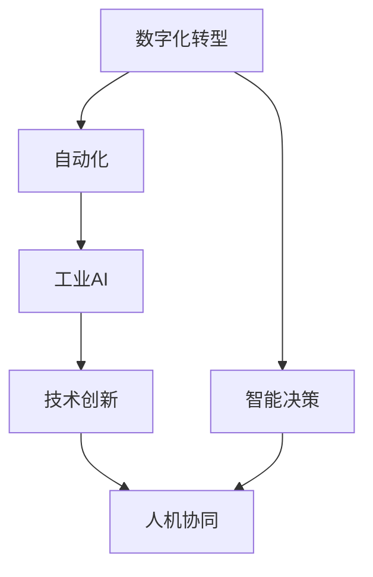

                 

# 企业转型中的AI应用技术

> 关键词：企业转型, AI应用, 数字化转型, 数据驱动, 智能决策, 自动化, 人机协同, 工业AI, 技术创新

## 1. 背景介绍

### 1.1 问题由来

在快速发展的数字化时代，企业的生存和发展面临着前所未有的挑战。传统制造业、零售业、金融业等行业正面临着转型升级的压力，尤其在新冠疫情的冲击下，加快数字化转型已成为企业的共识。企业转型不仅是简单的数字化，更是一场全方位的变革，涉及企业架构、业务流程、文化理念等多个层面的变革。在此过程中，AI技术的应用成为推动企业转型的关键力量。

### 1.2 问题核心关键点

企业转型中的AI应用技术旨在通过数据驱动、智能决策、自动化和智能化手段，提升企业的运营效率、产品质量、客户体验和市场竞争力。AI技术能够辅助企业在市场变化中快速响应，通过数据分析和机器学习算法，帮助企业做出更科学的决策，提升业务运营的智能化水平，最终实现企业的可持续发展。

AI技术在企业中的应用，不仅局限于传统的IT部门，还深入到业务运营的各个环节，如生产制造、客户服务、市场营销、人力资源等。AI技术能够通过自动化和智能化手段，提高企业的运营效率，降低成本，提升客户满意度，推动企业的数字化转型。

### 1.3 问题研究意义

研究企业转型中的AI应用技术，对于推动企业的数字化转型，提升企业的市场竞争力，具有重要意义：

1. 提高运营效率：AI技术能够自动化处理大量的数据和业务流程，提升运营效率，降低人力成本。
2. 提升决策质量：AI技术通过数据分析和预测模型，辅助企业做出更科学、更准确的决策。
3. 增强市场竞争力：AI技术能够帮助企业快速响应市场变化，提升产品和服务的竞争力。
4. 推动业务创新：AI技术能够辅助企业发现新的业务机会，推动创新发展。
5. 提升客户体验：AI技术能够提供个性化的客户服务和智能推荐，提升客户满意度。

## 2. 核心概念与联系

### 2.1 核心概念概述

为更好地理解企业转型中的AI应用技术，本节将介绍几个密切相关的核心概念：

- 数字化转型(Digital Transformation)：通过应用数字技术和创新思维，变革企业运营模式，提升企业竞争力的过程。
- 智能决策(Intelligent Decision Making)：利用AI技术进行数据分析、预测和决策，提升决策质量。
- 自动化(Automation)：通过AI技术实现业务的自动化处理，提高运营效率，降低成本。
- 人机协同(Human-Machine Collaboration)：AI技术与人的协同工作，提升工作效率和质量。
- 工业AI(Industrial AI)：AI技术在工业生产中的应用，提高生产效率，优化生产流程。
- 技术创新(Technological Innovation)：通过应用新技术和新方法，提升企业技术水平和市场竞争力。

这些核心概念之间的逻辑关系可以通过以下Mermaid流程图来展示：



这个流程图展示了大语言模型的核心概念及其之间的关系：

1. 数字化转型是大语言模型的基础，是应用AI技术的起点。
2. 智能决策和自动化是数字化转型的关键手段，提升决策质量和运营效率。
3. 工业AI和自动化技术能够将AI技术应用到生产制造等关键环节，提升生产效率。
4. 技术创新推动了数字化转型和智能决策技术的发展，为应用提供技术支撑。
5. 人机协同提升了AI技术的灵活性和适应性，增强了企业的创新能力和竞争力。

这些概念共同构成了企业数字化转型的技术框架，为企业应用AI技术提供了全面的指导。通过理解这些核心概念，我们可以更好地把握AI技术在企业中的应用场景和潜在价值。

## 3. 核心算法原理 & 具体操作步骤
### 3.1 算法原理概述

企业转型中的AI应用技术，其核心思想是通过数据驱动、智能决策、自动化和智能化手段，提升企业的运营效率和决策质量。在技术实现上，主要采用以下几个关键算法和操作步骤：

- 数据驱动：利用大数据和机器学习算法，从海量数据中提取有价值的信息，支持决策制定。
- 智能决策：通过构建预测模型和优化算法，辅助企业做出科学、准确的决策。
- 自动化处理：利用AI技术实现业务的自动化处理，提高运营效率。
- 人机协同：利用自然语言处理和计算机视觉等技术，增强人机交互和协同工作。

### 3.2 算法步骤详解

企业转型中的AI应用技术，一般包括以下几个关键步骤：

**Step 1: 数据采集与清洗**
- 收集企业内部和外部的数据，包括财务数据、客户数据、供应链数据等。
- 对数据进行清洗和预处理，去除噪声和异常值，确保数据质量。

**Step 2: 数据分析与建模**
- 利用机器学习算法和数据挖掘技术，对数据进行分析和建模，提取有价值的信息。
- 构建预测模型和优化算法，支持决策制定。
- 利用自然语言处理和计算机视觉等技术，实现数据的语义理解和图像识别。

**Step 3: 自动化与智能化**
- 利用自动化工具和AI算法，实现业务的自动化处理，提高运营效率。
- 利用智能决策系统，支持企业快速响应市场变化。
- 利用人机协同技术，增强企业的工作效率和创新能力。

**Step 4: 评估与优化**
- 对AI应用效果进行评估，测量其对企业运营效率、决策质量和客户体验的影响。
- 根据评估结果，不断优化AI应用模型和算法，提升应用效果。

### 3.3 算法优缺点

企业转型中的AI应用技术，具有以下优点：
1. 提升运营效率：AI技术能够自动化处理大量的数据和业务流程，提高运营效率。
2. 提升决策质量：AI技术通过数据分析和预测模型，辅助企业做出更科学、更准确的决策。
3. 降低成本：AI技术能够减少人工干预，降低人力成本。
4. 增强市场竞争力：AI技术能够帮助企业快速响应市场变化，提升产品和服务的竞争力。

同时，该方法也存在一定的局限性：
1. 对数据质量要求高：AI技术依赖于高质量的数据，数据质量差会影响应用效果。
2. 技术门槛高：AI应用需要专业技术人员，技术门槛较高。
3. 实施成本高：AI应用需要大量的硬件和软件投入，实施成本较高。
4. 需要持续维护：AI应用需要持续的维护和优化，才能保持最佳状态。

尽管存在这些局限性，但就目前而言，基于AI的应用方法仍然是大企业转型中的主流手段。未来相关研究的重点在于如何降低AI应用的实施成本，提高应用的灵活性和可扩展性，同时兼顾数据安全和隐私保护等因素。

### 3.4 算法应用领域

企业转型中的AI应用技术，在多个领域得到了广泛的应用，例如：

- 生产制造：利用AI技术进行生产计划优化、质量检测和故障预测，提升生产效率和产品质量。
- 供应链管理：利用AI技术进行库存管理、需求预测和物流优化，降低库存成本，提升供应链效率。
- 客户服务：利用AI技术进行智能客服、客户分析和推荐系统，提升客户满意度和忠诚度。
- 市场营销：利用AI技术进行市场分析和消费者行为预测，制定精准的市场营销策略。
- 人力资源：利用AI技术进行人才招聘、绩效评估和培训推荐，优化人力资源管理。

除了上述这些经典领域外，AI技术还被创新性地应用到更多场景中，如智能运营、风险控制、金融科技等，为企业的数字化转型提供了新的解决方案。随着AI技术的不断演进，相信AI应用将会在更多领域得到应用，为企业的可持续发展提供新的动力。

## 4. 数学模型和公式 & 详细讲解 & 举例说明

### 4.1 数学模型构建

本节将使用数学语言对企业转型中的AI应用技术进行更加严格的刻画。

记企业内部的经营数据为 $D=\{(x_i,y_i)\}_{i=1}^N, x_i \in \mathcal{X}, y_i \in \mathcal{Y}$，其中 $x_i$ 为企业的经营指标，如销售额、利润率、客户满意度等；$y_i$ 为对应的目标变量，如市场份额、客户流失率等。

定义企业内部的AI应用模型为 $M_{\theta}$，其中 $\theta$ 为模型参数，用于拟合数据。

企业内部AI应用的优化目标是最小化误差函数，即：

$$
\min_{\theta} \sum_{i=1}^N \ell(M_{\theta}(x_i),y_i)
$$

其中 $\ell$ 为误差函数，如均方误差、交叉熵等。

### 4.2 公式推导过程

以下我们以预测市场份额为例，推导预测模型和误差函数的计算公式。

假设企业内部的经营数据 $D=\{(x_i,y_i)\}_{i=1}^N$，其中 $x_i$ 为历史销售数据，$y_i$ 为对应的市场份额。我们希望利用历史数据 $D$ 训练一个预测模型 $M_{\theta}$，用于预测新的市场份额。

首先，通过数据预处理和特征工程，将原始数据 $D$ 转换为模型输入 $x_i \in \mathcal{X}$，输出为市场份额 $y_i \in \mathcal{Y}$。然后，构建预测模型 $M_{\theta}$，利用历史数据进行训练：

$$
M_{\theta}(x_i) = \mathbf{W}^T\mathbf{x}_i + b
$$

其中 $\mathbf{W}$ 为权重矩阵，$b$ 为偏置项，$\mathbf{x}_i$ 为输入特征向量。

利用均方误差作为误差函数 $\ell$，计算模型预测值与真实值之间的差异：

$$
\ell(M_{\theta}(x_i),y_i) = (M_{\theta}(x_i) - y_i)^2
$$

然后，最小化误差函数，得到最优模型参数 $\theta^*$：

$$
\theta^* = \mathop{\arg\min}_{\theta} \sum_{i=1}^N \ell(M_{\theta}(x_i),y_i)
$$

在得到最优模型参数后，可以利用该模型对新的数据进行预测，从而支持企业的决策制定。

### 4.3 案例分析与讲解

**案例1：生产制造中的预测维护**
- 背景：制造业企业希望通过预测设备故障，减少停机时间和维修成本。
- 技术实现：利用历史生产数据和设备状态数据，构建预测模型 $M_{\theta}$，输出设备故障的概率。
- 数据处理：对生产数据进行特征工程，提取与设备故障相关的特征。
- 模型训练：利用历史故障数据进行模型训练，得到最优模型参数 $\theta^*$。
- 结果应用：在生产线上实时监测设备状态，预测设备故障，进行维护和调度。

**案例2：供应链管理中的需求预测**
- 背景：零售企业希望通过预测市场需求，优化库存管理，减少库存成本。
- 技术实现：利用历史销售数据和市场数据，构建预测模型 $M_{\theta}$，输出未来的市场需求。
- 数据处理：对销售数据进行特征工程，提取与市场需求相关的特征。
- 模型训练：利用历史销售数据进行模型训练，得到最优模型参数 $\theta^*$。
- 结果应用：根据市场需求预测结果，制定库存计划，优化物流调度。

## 5. 项目实践：代码实例和详细解释说明
### 5.1 开发环境搭建

在进行AI应用项目开发前，我们需要准备好开发环境。以下是使用Python进行TensorFlow开发的环境配置流程：

1. 安装Anaconda：从官网下载并安装Anaconda，用于创建独立的Python环境。

2. 创建并激活虚拟环境：
```bash
conda create -n tf-env python=3.8 
conda activate tf-env
```

3. 安装TensorFlow：根据CUDA版本，从官网获取对应的安装命令。例如：
```bash
conda install tensorflow tensorflow-gpu=2.4 -c conda-forge -c pypi
```

4. 安装TensorBoard：
```bash
conda install tensorboard
```

5. 安装numpy、pandas、scikit-learn、matplotlib、tqdm等常用库：
```bash
pip install numpy pandas scikit-learn matplotlib tqdm jupyter notebook ipython
```

完成上述步骤后，即可在`tf-env`环境中开始AI应用项目的开发。

### 5.2 源代码详细实现

下面我们以预测市场份额的项目为例，给出使用TensorFlow进行AI应用的完整代码实现。

```python
import tensorflow as tf
from sklearn.model_selection import train_test_split
from sklearn.preprocessing import MinMaxScaler
import pandas as pd
import numpy as np

# 读取数据
data = pd.read_csv('sales_data.csv')
data = data.dropna()

# 特征工程
features = ['Sales', 'Cost', 'MarketShare']
X = data[features].values
y = data['MarketShare'].values.reshape(-1, 1)

# 标准化处理
scaler = MinMaxScaler()
X = scaler.fit_transform(X)

# 划分训练集和测试集
X_train, X_test, y_train, y_test = train_test_split(X, y, test_size=0.2, random_state=42)

# 定义模型
model = tf.keras.Sequential([
    tf.keras.layers.Dense(32, activation='relu', input_shape=(3,)),
    tf.keras.layers.Dense(1)
])

# 编译模型
model.compile(optimizer=tf.keras.optimizers.Adam(0.01), loss='mse')

# 训练模型
model.fit(X_train, y_train, epochs=100, batch_size=32, validation_data=(X_test, y_test))

# 预测新数据
new_data = np.array([[100, 20, 0.5]])
new_data = scaler.transform(new_data)
prediction = model.predict(new_data)
print(prediction)
```

以上是使用TensorFlow进行AI应用预测模型开发的完整代码实现。可以看到，利用TensorFlow，我们可以快速构建和训练预测模型，实现对市场份额的预测。

### 5.3 代码解读与分析

让我们再详细解读一下关键代码的实现细节：

**特征工程部分**：
- 首先，读取数据文件，去除缺失值。
- 然后，选择与目标变量相关的特征，并对其进行标准化处理。
- 最后，将数据划分为训练集和测试集。

**模型定义与编译**：
- 定义一个简单的神经网络模型，包含一个输入层、一个隐藏层和一个输出层。
- 使用Adam优化器和均方误差损失函数，编译模型。

**模型训练与预测**：
- 使用训练集进行模型训练，设置100个epochs和32个批次的训练。
- 使用测试集进行模型验证，输出模型的验证损失。
- 对新数据进行标准化处理，并利用训练好的模型进行预测。

可以看到，TensorFlow提供了灵活的API，方便进行AI应用的快速迭代开发。开发者可以根据具体应用场景，设计不同的模型架构和优化策略，实现高效的AI应用开发。

## 6. 实际应用场景

### 6.1 智能制造

智能制造是企业数字化转型的重要方向之一。利用AI技术，可以实现生产过程的自动化和智能化，提升生产效率和产品质量。

**背景**：传统制造业面临生产效率低、产品质量不稳定等问题。

**技术实现**：利用工业互联网和AI技术，对生产设备进行实时监控，预测设备故障，实现生产计划的优化和调整。例如，利用机器学习模型对生产数据进行分析和建模，预测设备的故障概率和维护周期。

**应用效果**：实现生产过程的自动化和智能化，提高生产效率和产品质量，降低生产成本。

### 6.2 智能客服

智能客服是企业数字化转型的重要应用场景之一。利用AI技术，可以实现客户服务的自动化和智能化，提升客户满意度和忠诚度。

**背景**：传统客服系统面临成本高、响应速度慢、服务质量不稳定等问题。

**技术实现**：利用自然语言处理和机器学习技术，构建智能客服系统，实现客户问题的自动解答和引导。例如，利用机器学习模型对客户问题进行分类和回答，利用知识图谱提供多轮对话的上下文理解。

**应用效果**：实现客户服务的自动化和智能化，提升客户满意度和忠诚度，降低客服成本。

### 6.3 智能供应链

智能供应链是企业数字化转型的重要应用场景之一。利用AI技术，可以实现供应链管理的自动化和智能化，提升供应链效率和竞争力。

**背景**：传统供应链管理面临信息不对称、库存成本高、物流效率低等问题。

**技术实现**：利用AI技术，对供应链数据进行分析和建模，实现需求预测、库存管理和物流优化。例如，利用机器学习模型对历史销售数据和市场数据进行建模，预测未来的市场需求和库存水平，优化物流调度和库存管理。

**应用效果**：实现供应链管理的自动化和智能化，提升供应链效率和竞争力，降低供应链成本。

### 6.4 未来应用展望

随着AI技术的不断演进，企业转型中的AI应用技术将呈现以下几个发展趋势：

1. 数据驱动决策：AI技术将更加依赖数据驱动的决策制定，提升决策的科学性和准确性。
2. 自动化流程：AI技术将深入到业务流程的各个环节，实现业务的自动化处理，提升运营效率。
3. 智能化分析：AI技术将提供更加深入的业务分析，帮助企业发现新的业务机会，推动创新发展。
4. 人机协同：AI技术与人的协同工作，将进一步提升工作效率和创新能力。
5. 工业AI：AI技术将更加深入到工业生产中，提升生产效率和产品质量。
6. 数据安全：AI技术将更加注重数据安全和隐私保护，确保企业数据的安全性。

这些趋势凸显了AI技术在企业转型中的重要性和潜力，相信随着AI技术的不断发展和应用，企业数字化转型将迎来新的机遇和挑战。

## 7. 工具和资源推荐
### 7.1 学习资源推荐

为了帮助开发者系统掌握AI应用技术，这里推荐一些优质的学习资源：

1. 《TensorFlow实战》：由Google官方出版的TensorFlow实战指南，详细介绍了TensorFlow的使用方法和最佳实践。
2. 《深度学习入门》：由深度学习专家李沐所写的深度学习入门教程，涵盖深度学习的基础知识和经典模型。
3. 《Python数据科学手册》：由Python语言专家Jake VanderPlas所写的Python数据科学指南，涵盖Python在数据科学领域的应用。
4. Kaggle：数据科学竞赛平台，提供丰富的数据集和竞赛题目，帮助开发者锻炼实战能力。
5. Coursera：在线学习平台，提供多个AI应用相关的课程，包括深度学习、自然语言处理、计算机视觉等。

通过对这些资源的学习实践，相信你一定能够快速掌握AI应用技术的精髓，并用于解决实际的业务问题。

### 7.2 开发工具推荐

高效的开发离不开优秀的工具支持。以下是几款用于AI应用开发的常用工具：

1. TensorFlow：由Google主导开发的开源深度学习框架，生产部署方便，适合大规模工程应用。
2. PyTorch：基于Python的开源深度学习框架，灵活的动态计算图，适合快速迭代研究。
3. Scikit-learn：开源机器学习库，提供了丰富的机器学习算法和工具，方便快速建模和评估。
4. Jupyter Notebook：开源的交互式编程环境，方便进行代码开发和数据可视化。
5. TensorBoard：TensorFlow配套的可视化工具，实时监测模型训练状态，提供丰富的图表呈现方式。

合理利用这些工具，可以显著提升AI应用项目的开发效率，加快创新迭代的步伐。

### 7.3 相关论文推荐

AI应用技术的发展源于学界的持续研究。以下是几篇奠基性的相关论文，推荐阅读：

1. Google AI Blog：“How Google is using TensorFlow for AI at Scale”，介绍了TensorFlow在AI大模型训练和应用中的作用。
2. Facebook AI Research：“Fast and Accurate Prediction with Deep Neural Networks on Spark”，介绍了AI应用在大数据处理中的应用。
3. Amazon AWS：“Machine Learning in the Cloud: Transforming Business Processes with AI”，介绍了AI应用在云计算中的实践。
4. IBM AI：“AI in Manufacturing: A Journey from the Factory Floor to the Executive Office”，介绍了AI在智能制造中的应用。
5. Microsoft AI：“Accelerating Business Value with AI”，介绍了AI应用在企业数字化转型中的重要性。

这些论文代表了大语言模型微调技术的发展脉络。通过学习这些前沿成果，可以帮助研究者把握学科前进方向，激发更多的创新灵感。

## 8. 总结：未来发展趋势与挑战

### 8.1 总结

本文对企业转型中的AI应用技术进行了全面系统的介绍。首先阐述了企业转型中AI应用技术的背景和意义，明确了AI应用在推动企业数字化转型中的重要价值。其次，从原理到实践，详细讲解了AI应用的数学模型和操作步骤，给出了AI应用开发的完整代码实例。同时，本文还广泛探讨了AI应用在智能制造、智能客服、智能供应链等多个行业领域的应用前景，展示了AI应用技术的巨大潜力。此外，本文精选了AI应用的各类学习资源，力求为读者提供全方位的技术指引。

通过本文的系统梳理，可以看到，AI应用技术在企业转型中的广泛应用，推动了企业的数字化转型，提升了企业的市场竞争力和运营效率。未来，伴随AI技术的不断演进，企业转型中的AI应用技术将迎来新的发展机遇和挑战。

### 8.2 未来发展趋势

展望未来，企业转型中的AI应用技术将呈现以下几个发展趋势：

1. 数据驱动决策：AI技术将更加依赖数据驱动的决策制定，提升决策的科学性和准确性。
2. 自动化流程：AI技术将深入到业务流程的各个环节，实现业务的自动化处理，提升运营效率。
3. 智能化分析：AI技术将提供更加深入的业务分析，帮助企业发现新的业务机会，推动创新发展。
4. 人机协同：AI技术与人的协同工作，将进一步提升工作效率和创新能力。
5. 工业AI：AI技术将更加深入到工业生产中，提升生产效率和产品质量。
6. 数据安全：AI技术将更加注重数据安全和隐私保护，确保企业数据的安全性。

这些趋势凸显了AI技术在企业转型中的重要性和潜力，相信随着AI技术的不断发展和应用，企业数字化转型将迎来新的机遇和挑战。

### 8.3 面临的挑战

尽管AI应用技术已经取得了瞩目成就，但在迈向更加智能化、普适化应用的过程中，它仍面临着诸多挑战：

1. 数据质量瓶颈：AI应用依赖高质量的数据，数据质量差会影响应用效果。
2. 技术门槛高：AI应用需要专业技术人员，技术门槛较高。
3. 实施成本高：AI应用需要大量的硬件和软件投入，实施成本较高。
4. 持续维护：AI应用需要持续的维护和优化，才能保持最佳状态。
5. 数据安全和隐私保护：AI应用需要注重数据安全和隐私保护，确保企业数据的安全性。
6. 算法透明性：AI应用的决策过程需要更强的可解释性和可审计性，确保算法的透明性和公正性。

尽管存在这些挑战，但通过持续的技术创新和优化，相信AI应用技术将不断克服困难，推动企业数字化转型迈向新的高度。

### 8.4 研究展望

面对企业转型中AI应用技术所面临的挑战，未来的研究需要在以下几个方面寻求新的突破：

1. 数据治理：建立完善的数据治理机制，提升数据质量，保障数据安全和隐私保护。
2. 算法透明性：提升AI应用的算法透明性和可解释性，增强算法的公正性和可信性。
3. 持续优化：通过持续的优化和迭代，提升AI应用的稳定性和鲁棒性。
4. 跨领域融合：推动AI应用与物联网、大数据、区块链等技术的融合，提升AI应用的广度和深度。
5. 人机协同：探索人机协同的优化方法，增强人机协作的效率和效果。
6. 工业AI：推动AI技术在工业领域的应用，提升生产效率和产品质量。

这些研究方向的探索，必将引领企业转型中的AI应用技术迈向更高的台阶，为企业的可持续发展提供新的动力。相信随着学界和产业界的共同努力，这些挑战终将一一被克服，AI应用技术将在推动企业数字化转型中扮演越来越重要的角色。

## 9. 附录：常见问题与解答

**Q1：AI应用技术是否适用于所有企业？**

A: AI应用技术虽然对企业的数字化转型具有重要推动作用，但并不是所有企业都适合应用AI技术。AI应用需要企业具备一定的技术实力和数据基础。对于一些中小企业，可以先从简单的自动化流程开始，逐步引入AI技术。对于一些传统行业，可以考虑与技术公司合作，共同开发AI应用。

**Q2：如何选择合适的AI应用场景？**

A: 选择合适的AI应用场景需要根据企业的业务需求和数据情况。建议先进行数据分析和业务流程评估，确定关键业务环节和改进方向。然后，根据数据特点和业务需求，选择合适的AI应用技术，进行试点和验证。最后，根据试点结果进行推广和优化。

**Q3：AI应用技术是否需要大规模硬件投入？**

A: AI应用技术需要一定的硬件投入，特别是对于深度学习和模型训练。但对于一些轻量级的AI应用，如基于自然语言处理的应用，可以通过云平台进行部署，减少硬件成本。同时，采用分布式计算和混合精度训练等技术，也可以降低硬件成本。

**Q4：AI应用技术如何保障数据安全和隐私保护？**

A: AI应用技术需要注重数据安全和隐私保护，建议采用数据脱敏、访问控制、数据加密等措施，确保数据的安全性。同时，建立完善的数据治理机制，保障数据的质量和完整性。

**Q5：AI应用技术如何确保算法的透明性和公正性？**

A: AI应用的决策过程需要更强的可解释性和可审计性，建议采用可解释的模型和算法，提供透明的决策过程。同时，引入伦理导向的评估指标，确保算法的透明性和公正性。

这些问题的回答，希望能为你解答企业转型中的AI应用技术所面临的疑问，进一步推动AI应用技术的广泛应用和优化。

