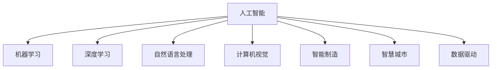

                 

# 企业转型中的AI应用技术

> 关键词：企业转型,人工智能,AI应用,技术创新,数字化转型,数据驱动

## 1. 背景介绍

### 1.1 问题由来

随着全球经济的发展和技术的进步，企业面临着前所未有的挑战。市场竞争加剧、客户需求多样化、生产成本上升等问题，迫使企业必须进行深层次的转型，以保持竞争力和盈利能力。然而，传统企业的转型之路充满阻碍，仅靠自身的努力难以在短时间内完成。在这一背景下，人工智能（AI）技术的出现为企业的转型提供了新的可能。AI技术能够从数据中提取价值，优化决策过程，提升效率，从而实现企业转型。

### 1.2 问题核心关键点

企业转型中的AI应用核心关键点包括以下几点：

- **数据驱动决策**：AI技术能够从海量数据中提取有价值的信息，辅助决策者进行科学决策。
- **智能自动化**：AI技术能够实现自动化生产、智能客服、预测分析等功能，提高工作效率。
- **个性化服务**：AI技术能够根据用户行为和偏好提供个性化推荐和服务，提升用户体验。
- **跨领域应用**：AI技术在制造、金融、医疗等多个领域具有广泛应用，帮助企业突破行业边界。
- **协同合作**：AI技术可以与企业内部员工、供应商、客户等形成协同合作，实现资源优化配置。

### 1.3 问题研究意义

研究企业转型中的AI应用技术，对于企业转型具有重要的意义：

- **降低转型成本**：AI技术能够自动化和智能化企业运营，降低转型过程中的成本和风险。
- **提升转型速度**：AI技术能够快速分析和处理海量数据，加速企业转型的进程。
- **增强企业竞争力**：AI技术能够帮助企业优化产品和服务，提升市场竞争力。
- **促进产业升级**：AI技术能够推动传统产业向智能化、数字化转型，促进产业升级。
- **实现可持续发展**：AI技术能够帮助企业实现节能减排、环境保护等目标，推动可持续发展。

## 2. 核心概念与联系

### 2.1 核心概念概述

为更好地理解企业转型中的AI应用技术，本节将介绍几个关键概念：

- **人工智能（AI）**：通过模拟人类智能行为，实现自动化、智能化决策的技术。
- **机器学习（ML）**：通过算法让机器从数据中学习规律，提升决策准确性。
- **深度学习（DL）**：基于神经网络模型，通过多层非线性变换进行复杂模式识别和学习。
- **自然语言处理（NLP）**：让机器能够理解、处理和生成自然语言的技术。
- **计算机视觉（CV）**：让机器能够感知和理解图像、视频等视觉信息的技术。
- **智能制造（Smart Manufacturing）**：将AI技术应用于制造业，实现智能化的生产、管理和服务。
- **智慧城市（Smart City）**：将AI技术应用于城市管理和服务，实现智能化的城市运营。
- **数据驱动（Data-Driven）**：基于数据进行决策和管理，提升决策的科学性和准确性。

这些核心概念之间的逻辑关系可以通过以下Mermaid流程图来展示：



这个流程图展示了大语言模型的核心概念及其之间的关系：

1. 人工智能通过机器学习、深度学习、自然语言处理、计算机视觉等技术，实现自动化和智能化。
2. 智能制造和智慧城市是人工智能在特定领域的具体应用。
3. 数据驱动是AI技术的基础，通过数据分析和处理，提升决策的科学性和准确性。

这些概念共同构成了企业转型中的AI应用框架，为企业提供了全面、系统的技术支持。通过理解这些核心概念，我们可以更好地把握企业转型中的AI应用技术。

## 3. 核心算法原理 & 具体操作步骤
### 3.1 算法原理概述

企业转型中的AI应用技术，本质上是通过AI技术实现企业内部的自动化和智能化管理。其核心思想是：利用AI技术从数据中提取价值，优化企业的决策和管理过程，提升运营效率和服务质量。

形式化地，假设企业运营的决策目标为 $T$，相关数据集为 $D=\{(x_i,y_i)\}_{i=1}^N$，其中 $x_i$ 表示企业运营的各项指标，$y_i$ 表示目标值（如收入、利润、客户满意度等）。AI应用的目标是找到最优决策方案 $t^*$，使得：

$$
t^*=\mathop{\arg\min}_{t} \mathcal{L}(t,D)
$$

其中 $\mathcal{L}$ 为针对目标 $T$ 设计的损失函数，用于衡量决策方案 $t$ 与目标值 $y$ 之间的差异。常见的损失函数包括均方误差损失、交叉熵损失等。

通过梯度下降等优化算法，AI应用过程不断更新决策方案 $t$，最小化损失函数 $\mathcal{L}$，使得决策方案 $t$ 逼近最优解。由于 AI 技术已经通过数据预训练获得了丰富的知识，因此即便在少量标注数据的情况下，也能够快速收敛到理想的目标方案 $t^*$。

### 3.2 算法步骤详解

企业转型中的AI应用技术通常包括以下几个关键步骤：

**Step 1: 数据准备与预处理**
- 收集企业运营的相关数据，清洗和处理数据，去除噪音和异常值。
- 将数据进行特征工程，提取和构造有意义的特征向量。
- 对数据进行标准化和归一化处理，提高模型训练的效率和效果。

**Step 2: 模型选择与设计**
- 根据企业运营目标，选择合适的AI模型，如回归模型、分类模型、聚类模型等。
- 设计模型架构，包括输入层、隐藏层、输出层等，根据企业数据特点选择合适的激活函数、损失函数等。
- 对模型进行超参数调优，如学习率、批次大小、迭代轮数等。

**Step 3: 模型训练与优化**
- 将准备好的数据划分为训练集、验证集和测试集，使用训练集进行模型训练。
- 在验证集上监测模型性能，使用早停策略防止过拟合。
- 对模型进行优化，如正则化、Dropout等，提高模型的泛化能力和鲁棒性。
- 在测试集上评估模型性能，对比不同模型的效果，选择最优模型。

**Step 4: 模型部署与应用**
- 将训练好的模型部署到企业内部的信息系统或云平台。
- 结合业务场景，设计模型应用的接口和流程。
- 对模型进行实时监控和维护，确保模型运行的稳定性和高效性。
- 根据企业反馈，持续改进和优化模型，提升模型效果。

### 3.3 算法优缺点

企业转型中的AI应用技术具有以下优点：

1. **提升效率**：AI技术能够自动化处理和分析海量数据，提高企业运营效率。
2. **降低成本**：通过智能化的决策和管理，降低企业运营成本。
3. **提升质量**：AI技术能够提供精准的预测和分析，提升产品和服务质量。
4. **灵活性高**：AI模型能够根据业务需求快速调整和优化。
5. **数据驱动**：基于数据驱动的决策，提高决策的科学性和准确性。

同时，该方法也存在一定的局限性：

1. **数据质量依赖**：AI模型的性能高度依赖于数据的质量和完整性。
2. **模型解释性不足**：AI模型的决策过程复杂，难以解释和调试。
3. **计算资源需求高**：AI模型需要大量的计算资源进行训练和优化。
4. **业务理解难度**：AI技术复杂，企业内部员工可能难以理解和使用。
5. **隐私安全风险**：AI模型需要大量的用户数据，可能带来隐私安全风险。

尽管存在这些局限性，但就目前而言，AI应用技术在企业转型中的应用已展现出巨大的潜力。未来相关研究的重点在于如何进一步降低对数据质量的需求，提高模型的可解释性和鲁棒性，同时兼顾隐私和安全等因素。

### 3.4 算法应用领域

企业转型中的AI应用技术在多个领域得到了广泛应用，例如：

- **智能制造**：通过AI技术实现智能化的生产调度、质量控制、设备维护等，提高生产效率和产品质量。
- **智能客服**：利用AI技术实现自动化的客户服务，如智能客服机器人、聊天机器人等，提升客户满意度。
- **销售预测**：通过AI技术对销售数据进行预测和分析，指导企业制定合理的销售策略。
- **供应链管理**：利用AI技术优化供应链流程，实现自动化的库存管理、物流调度和需求预测。
- **风险管理**：通过AI技术进行风险评估和预测，帮助企业规避金融风险。
- **个性化营销**：利用AI技术对用户行为进行分析和预测，提供个性化的产品推荐和服务。

除了上述这些经典应用外，AI技术在企业转型中的创新应用还在不断涌现，如智能合同、智能合同、智能物流等，为企业的智能化转型提供了新的路径。

## 4. 数学模型和公式 & 详细讲解  
### 4.1 数学模型构建

本节将使用数学语言对企业转型中的AI应用技术进行更加严格的刻画。

假设企业运营的目标为 $T$，相关数据集为 $D=\{(x_i,y_i)\}_{i=1}^N$。假设选择的AI模型为 $M_{\theta}$，其中 $\theta$ 为模型参数。AI应用的目标是最小化目标函数 $\mathcal{L}(\theta)$，使得模型预测值与真实值尽可能接近。

定义模型 $M_{\theta}$ 在输入 $x$ 上的预测输出为 $\hat{y}=M_{\theta}(x)$，目标函数为：

$$
\mathcal{L}(\theta) = \frac{1}{N} \sum_{i=1}^N \ell(M_{\theta}(x_i),y_i)
$$

其中 $\ell$ 为损失函数，常见的损失函数包括均方误差损失、交叉熵损失等。

AI应用的优化目标是最小化目标函数 $\mathcal{L}(\theta)$，即找到最优参数 $\theta^*$，使得模型能够高效地处理和分析数据，实现企业转型的目标。

### 4.2 公式推导过程

以下我们以销售预测任务为例，推导均方误差损失函数及其梯度的计算公式。

假设模型 $M_{\theta}$ 在输入 $x$ 上的预测输出为 $\hat{y}=M_{\theta}(x)$，真实标签 $y_i$ 为连续变量，如销售额。均方误差损失函数定义为：

$$
\ell(M_{\theta}(x),y) = \frac{1}{2}(y - \hat{y})^2
$$

将其代入目标函数公式，得：

$$
\mathcal{L}(\theta) = \frac{1}{2N}\sum_{i=1}^N (y_i - M_{\theta}(x_i))^2
$$

根据链式法则，目标函数对参数 $\theta_k$ 的梯度为：

$$
\frac{\partial \mathcal{L}(\theta)}{\partial \theta_k} = \frac{1}{N} \sum_{i=1}^N (-y_i + \hat{y})\frac{\partial \hat{y}}{\partial \theta_k}
$$

其中 $\frac{\partial \hat{y}}{\partial \theta_k}$ 可进一步递归展开，利用自动微分技术完成计算。

在得到目标函数的梯度后，即可带入参数更新公式，完成模型的迭代优化。重复上述过程直至收敛，最终得到适应企业转型目标的最优模型参数 $\theta^*$。

## 5. 项目实践：代码实例和详细解释说明
### 5.1 开发环境搭建

在进行AI应用实践前，我们需要准备好开发环境。以下是使用Python进行TensorFlow开发的环境配置流程：

1. 安装Anaconda：从官网下载并安装Anaconda，用于创建独立的Python环境。

2. 创建并激活虚拟环境：
```bash
conda create -n tensorflow-env python=3.8 
conda activate tensorflow-env
```

3. 安装TensorFlow：根据CUDA版本，从官网获取对应的安装命令。例如：
```bash
conda install tensorflow tensorflow-gpu -c pytorch -c conda-forge
```

4. 安装各类工具包：
```bash
pip install numpy pandas scikit-learn matplotlib tqdm jupyter notebook ipython
```

完成上述步骤后，即可在`tensorflow-env`环境中开始AI应用实践。

### 5.2 源代码详细实现

下面我们以销售预测任务为例，给出使用TensorFlow进行销售预测的Python代码实现。

首先，定义销售预测任务的数据处理函数：

```python
import tensorflow as tf
from tensorflow.keras import layers
import pandas as pd

def load_data(file_path):
    data = pd.read_csv(file_path)
    features = ['feature1', 'feature2', 'feature3', ...]
    target = 'target'
    X = data[features].values
    y = data[target].values
    return X, y

# 定义模型
def build_model(input_shape):
    model = tf.keras.Sequential([
        layers.Dense(64, activation='relu', input_shape=input_shape),
        layers.Dense(32, activation='relu'),
        layers.Dense(1)
    ])
    return model

# 加载数据
X, y = load_data('sales_data.csv')

# 定义模型
model = build_model(input_shape=X.shape[1:])

# 编译模型
model.compile(optimizer=tf.keras.optimizers.Adam(learning_rate=0.001), loss='mse')

# 训练模型
model.fit(X, y, epochs=100, batch_size=32, validation_split=0.2)
```

然后，定义训练和评估函数：

```python
import matplotlib.pyplot as plt

def train_epoch(model, X_train, y_train, X_val, y_val, batch_size):
    train_losses = []
    val_losses = []
    for epoch in range(epochs):
        for batch in range(len(X_train) // batch_size):
            x_train = X_train[batch*batch_size:(batch+1)*batch_size]
            y_train = y_train[batch*batch_size:(batch+1)*batch_size]
            model.train_on_batch(x_train, y_train)
            train_loss = model.loss(X_train, y_train).numpy()
            train_losses.append(train_loss)
        val_loss = model.evaluate(X_val, y_val)[0]
        val_losses.append(val_loss)
        print(f'Epoch {epoch+1}, train loss: {train_loss:.4f}, val loss: {val_loss:.4f}')
    plt.plot(train_losses, label='train loss')
    plt.plot(val_losses, label='val loss')
    plt.legend()
    plt.show()

def evaluate(model, X_test, y_test):
    mse = model.evaluate(X_test, y_test)[0]
    print(f'Test MSE: {mse:.4f}')
```

最后，启动训练流程并在测试集上评估：

```python
epochs = 100
batch_size = 32

for epoch in range(epochs):
    train_epoch(model, X_train, y_train, X_val, y_val, batch_size)

evaluate(model, X_test, y_test)
```

以上就是使用TensorFlow对销售预测任务进行AI应用的完整代码实现。可以看到，得益于TensorFlow的强大封装，我们可以用相对简洁的代码完成模型的训练和评估。

### 5.3 代码解读与分析

让我们再详细解读一下关键代码的实现细节：

**load_data函数**：
- 定义数据加载函数，用于读取数据文件，并将特征和目标分离。

**build_model函数**：
- 定义模型架构，包括多个密集层。
- 使用ReLU激活函数和Adam优化器，设置学习率为0.001。

**train_epoch函数**：
- 对数据进行批量处理，在每个批次上进行模型训练。
- 在每个epoch后计算训练集和验证集的损失，并在图表中可视化损失变化。

**evaluate函数**：
- 在测试集上评估模型的均方误差。

**训练流程**：
- 定义总的epoch数和批大小，开始循环迭代。
- 每个epoch内，先在训练集上训练，并在验证集上监测模型性能。
- 在测试集上评估模型，输出最终结果。

可以看到，TensorFlow提供的高级API使得模型的构建、训练和评估过程变得非常简便。开发者可以将更多精力放在数据预处理和模型优化上，而不必过多关注底层实现细节。

当然，工业级的系统实现还需考虑更多因素，如模型的保存和部署、超参数的自动搜索、更灵活的模型架构等。但核心的AI应用范式基本与此类似。

## 6. 实际应用场景
### 6.1 智能制造

基于AI技术实现的智能制造系统，能够实现生产流程的自动化和智能化管理。通过实时监控和分析生产数据，系统可以预测设备故障、优化生产调度、提高产品质量。例如，利用AI技术进行设备故障预测，可以提前识别设备故障，避免停机和损失。

在技术实现上，可以收集生产过程中的各种数据，如设备状态、原料消耗、温度、湿度等，并建立预测模型。使用监督学习或强化学习等方法，训练模型对设备故障进行预测。根据预测结果，系统可以提前进行维护和修理，提高生产效率和产品质量。

### 6.2 智能客服

智能客服系统能够实现自动化的客户服务，提高客户满意度，降低人力成本。通过AI技术对客户咨询进行自然语言处理，系统可以自动识别和分类问题，并给出相应的回答。例如，利用自然语言处理技术，系统可以对客户咨询进行情感分析，识别情绪波动，提供更加人性化的服务。

在技术实现上，可以收集历史客户咨询数据，使用监督学习或迁移学习等方法，训练模型对新咨询进行分类和回答。结合知识图谱和专家知识，系统可以进一步提升回答的准确性和实用性。

### 6.3 供应链管理

基于AI技术的供应链管理系统，能够实现供应链流程的自动化和智能化管理。通过实时监控和分析供应链数据，系统可以优化库存管理、物流调度和需求预测。例如，利用AI技术进行需求预测，可以准确预测市场需求，避免库存积压和短缺。

在技术实现上，可以收集供应链中的各种数据，如订单数量、库存水平、运输状态等，并建立预测模型。使用监督学习或强化学习等方法，训练模型对需求进行预测。根据预测结果，系统可以优化库存水平和物流调度，提高供应链效率和响应速度。

### 6.4 未来应用展望

随着AI技术的发展，未来AI应用将在更多领域得到应用，为企业的智能化转型提供新的可能。

在智慧城市建设中，AI技术可以应用于城市管理和服务，实现智能化的城市运营。例如，利用AI技术进行交通管理，可以优化交通流量，减少拥堵。

在金融行业，AI技术可以应用于风险管理、欺诈检测、客户服务等。例如，利用AI技术进行风险评估，可以识别和预防金融欺诈，保护客户利益。

在医疗行业，AI技术可以应用于疾病诊断、治疗方案、患者管理等。例如，利用AI技术进行疾病预测，可以早期发现病情，提高治疗效果。

总之，AI技术在企业转型中的广泛应用，将推动企业迈向智能化、数字化转型，实现可持续发展。未来，随着AI技术的不断进步和完善，企业将在更多领域探索和应用AI技术，为社会创造更多的价值。

## 7. 工具和资源推荐
### 7.1 学习资源推荐

为了帮助开发者系统掌握AI应用技术，这里推荐一些优质的学习资源：

1. **Deep Learning Specialization by Andrew Ng**：斯坦福大学推出的深度学习系列课程，系统介绍了深度学习的基本原理和应用，适合初学者和中级开发者。

2. **TensorFlow Developer Guide**：TensorFlow官方文档，详细介绍了TensorFlow的使用方法、API参考等，适合开发者快速上手TensorFlow。

3. **PyTorch Tutorials**：PyTorch官方文档，提供了大量示例代码和教程，适合开发者学习PyTorch。

4. **Google AI Blog**：Google AI团队博客，提供了最新的AI研究成果、技术分享和应用案例，适合开发者了解AI技术的最新进展。

5. **Kaggle**：数据科学竞赛平台，提供了大量的数据集和竞赛项目，适合开发者进行实践和练手。

通过对这些资源的学习实践，相信你一定能够快速掌握AI应用技术的精髓，并用于解决实际的业务问题。

### 7.2 开发工具推荐

高效的开发离不开优秀的工具支持。以下是几款用于AI应用开发的常用工具：

1. **TensorFlow**：由Google主导开发的开源深度学习框架，生产部署方便，适合大规模工程应用。

2. **PyTorch**：由Facebook主导开发的开源深度学习框架，灵活高效，适合研究和原型开发。

3. **Jupyter Notebook**：交互式的编程环境，支持代码块和图表展示，适合开发者进行数据处理和模型训练。

4. **Hugging Face Transformers**：提供了大量预训练语言模型和工具库，适合开发者进行NLP任务开发。

5. **DataRobot**：自动化的机器学习平台，能够自动进行数据处理、模型训练和超参数优化，适合开发者快速开发和部署AI应用。

6. **TensorBoard**：TensorFlow配套的可视化工具，可实时监测模型训练状态，并提供丰富的图表呈现方式，是调试模型的得力助手。

合理利用这些工具，可以显著提升AI应用开发的效率，加快创新迭代的步伐。

### 7.3 相关论文推荐

AI应用技术的发展源于学界的持续研究。以下是几篇奠基性的相关论文，推荐阅读：

1. **AlexNet: ImageNet Classification with Deep Convolutional Neural Networks**：提出卷积神经网络（CNN）架构，开创了深度学习在图像分类领域的应用。

2. **LeNet-5: Convolutional Neural Networks for Handwritten Digit Recognition**：提出卷积神经网络（CNN）架构，为图像识别任务提供了重要基础。

3. **AlphaGo: Mastering the Game of Go without Human Knowledge**：提出深度强化学习算法，实现了在复杂游戏AI中战胜人类高手的突破。

4. **ImageNet Large Scale Visual Recognition Challenge**：提出大规模图像识别任务，推动了深度学习在计算机视觉领域的进步。

5. **GPT-3: Language Models are Unsupervised Multitask Learners**：提出大规模语言模型（GPT-3），展示了预训练模型在自然语言处理任务中的强大能力。

这些论文代表了大数据技术和AI技术的最新进展，是学习和研究AI应用技术的重要参考资料。

## 8. 总结：未来发展趋势与挑战

### 8.1 总结

本文对企业转型中的AI应用技术进行了全面系统的介绍。首先阐述了AI技术在企业转型中的重要意义，明确了AI应用技术在提高效率、降低成本、提升质量等方面的独特价值。其次，从原理到实践，详细讲解了AI应用技术的基本流程，包括数据准备、模型选择、训练优化、模型部署等关键步骤，给出了AI应用的完整代码实现。同时，本文还广泛探讨了AI应用技术在智能制造、智能客服、供应链管理等多个领域的应用前景，展示了AI应用技术的广阔前景。此外，本文精选了AI应用技术的各类学习资源，力求为读者提供全方位的技术指引。

通过本文的系统梳理，可以看到，AI应用技术在企业转型中发挥着越来越重要的作用，成为企业提高运营效率、降低成本、提升服务质量的重要手段。未来，随着AI技术的不断进步和完善，AI应用技术将在更多领域得到应用，为企业的智能化转型提供新的可能。

### 8.2 未来发展趋势

展望未来，AI应用技术将呈现以下几个发展趋势：

1. **技术融合**：AI应用技术将与物联网、大数据、云计算等技术深度融合，推动企业向智能化、数字化转型。

2. **边缘计算**：AI应用技术将逐步向边缘计算方向发展，实现实时处理和决策，提高企业运营效率。

3. **自动化部署**：AI应用技术将向自动化部署方向发展，通过容器化、微服务等技术，实现快速部署和扩展。

4. **多模态融合**：AI应用技术将融合多模态数据，如文本、图像、视频等，提升对复杂场景的理解和处理能力。

5. **实时分析**：AI应用技术将实现实时分析和处理，帮助企业快速响应市场变化和客户需求。

6. **跨行业应用**：AI应用技术将在更多行业得到应用，如医疗、金融、教育等，推动各行各业向智能化、数字化转型。

以上趋势凸显了AI应用技术的广阔前景。这些方向的探索发展，将进一步提升AI应用技术的性能和应用范围，为企业的智能化转型提供新的动力。

### 8.3 面临的挑战

尽管AI应用技术在企业转型中展现出了巨大的潜力，但在迈向更加智能化、普适化应用的过程中，它仍面临着诸多挑战：

1. **数据质量和隐私**：AI模型的性能高度依赖于数据质量和隐私保护，数据不完整、质量差或存在隐私风险，都将影响模型的效果。

2. **模型复杂性**：AI模型的结构和算法复杂，难以解释和调试，对企业的技术水平要求较高。

3. **计算资源需求高**：AI模型需要大量的计算资源进行训练和优化，对企业的硬件设施提出了较高的要求。

4. **业务理解难度**：AI技术复杂，企业内部员工可能难以理解和使用，需要相应的培训和支持。

5. **应用落地难度**：AI技术的应用需要跨部门协作，涉及到数据、模型、业务等多个方面，实施难度较大。

尽管存在这些挑战，但通过持续的技术创新和优化，相信AI应用技术在企业转型中必将发挥更大的作用，推动企业迈向智能化、数字化转型。

### 8.4 研究展望

面对AI应用技术在企业转型中面临的挑战，未来的研究需要在以下几个方面寻求新的突破：

1. **自动化数据处理**：开发自动化数据处理工具，提高数据收集、清洗和处理的效率。

2. **模型压缩与优化**：开发模型压缩和优化技术，降低计算资源需求，提高模型部署效率。

3. **模型可解释性**：开发模型可解释性技术，提升模型的透明度和可理解性。

4. **跨行业知识融合**：将跨行业的知识与AI技术结合，提升模型的泛化能力和应用效果。

5. **实时监控与反馈**：开发实时监控和反馈机制，提高模型应用的稳定性和鲁棒性。

6. **伦理与安全**：在AI模型设计和应用中引入伦理和安全机制，确保模型的公平、透明和安全性。

这些研究方向的探索，将引领AI应用技术向更高的台阶发展，为企业的智能化转型提供更为可靠的技术支持。

## 9. 附录：常见问题与解答

**Q1：AI应用技术是否适用于所有企业？**

A: AI应用技术适用于多种类型的企业，但不同企业对AI应用的需求和目标不同，需要根据具体情况进行定制化设计。

**Q2：如何选择适合企业的AI应用技术？**

A: 选择适合企业的AI应用技术需要考虑企业的数据情况、业务需求、技术水平和预算等多个方面。一般建议从简单的任务入手，逐步扩展AI应用的范围。

**Q3：如何应对AI应用中的数据隐私问题？**

A: 应对AI应用中的数据隐私问题，需要在数据采集、处理和存储等环节进行严格控制，确保数据的合法性、完整性和安全性。

**Q4：如何提升AI模型的可解释性？**

A: 提升AI模型的可解释性需要开发模型可解释性技术，如LIME、SHAP等，在模型训练和应用过程中，提供模型决策的解释和说明。

**Q5：如何降低AI应用的技术门槛？**

A: 降低AI应用的技术门槛需要开发易用的工具和平台，如自动化的数据处理工具、可视化界面等，提高企业员工的技术接受度和应用效率。

通过对这些问题的回答，可以帮助读者更好地理解和应用AI应用技术，在企业转型中发挥其最大效用。

---

作者：禅与计算机程序设计艺术 / Zen and the Art of Computer Programming

