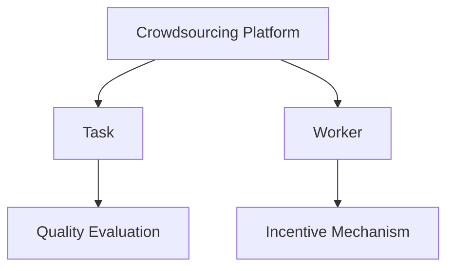

                 

# 众包：释放集体智慧的力量

## 1. 背景介绍

### 1.1 问题由来
众包（Crowdsourcing）是指通过互联网平台，将任务或项目分散给大量独立、分布式的个人或团队来完成。近年来，随着互联网技术的发展，众包模式在全球范围内得到了广泛应用，涵盖内容创作、数据分析、软件开发等多个领域。

众包模式通过整合大规模、低成本的人力资源，能够在短时间内完成大规模任务，具有显著的灵活性和效率优势。例如，亚马逊的土耳其机器人（Amazon Mechanical Turk, MTurk）平台，每天可以处理数百万个众包任务，帮助企业快速完成数据标注、图像识别、文本翻译等任务。

### 1.2 问题核心关键点
众包模式的核心在于如何高效组织和管理大量分散的资源，确保任务高质量完成。其主要包括以下几个关键点：
- 任务分配与调度：将任务合理分配给适合的人或团队，避免资源浪费和任务堆积。
- 质量控制与评价：对完成任务的质量进行评估和反馈，确保输出结果的准确性和可靠性。
- 激励机制与协作：设计合适的激励机制，鼓励用户积极参与，同时通过协作平台促进团队协作。
- 数据隐私与安全：保护用户数据隐私，防止数据泄露和滥用。

这些问题对众包模式的成功应用具有重要影响，需要在技术和管理上不断优化。

### 1.3 问题研究意义
研究众包模式，对于拓展互联网技术在企业和社会中的应用，提升人力资源的利用效率，具有重要意义：
- 降低成本。通过众包平台，企业能够以低成本快速完成大量任务，减少固定成本和运营成本。
- 提升效率。众包模式充分利用网络优势，实现任务并行处理，提高项目完成效率。
- 推动创新。众包平台汇聚了全球最优秀的人才，能够加速创新项目开发，催生更多创新产品。
- 改善用户体验。众包模式能够提供多样化的服务，满足不同用户需求，提升用户体验。
- 促进社会公平。众包平台为低收入人群提供工作机会，缓解就业压力，促进社会公平。

## 2. 核心概念与联系

### 2.1 核心概念概述

为更好地理解众包模式的运作机制，本节将介绍几个密切相关的核心概念：

- 众包平台（Crowdsourcing Platform）：即任务分发和资源管理平台，例如MTurk、Tasktab、Upwork等。
- 任务（Task）：需要完成的具体工作，通常包括任务描述、要求、报酬等。
- 工作者（Worker）：通过众包平台接任务的个人或团队，通常需要经过审核和培训。
- 质量评价（Quality Evaluation）：对完成任务的准确性、完成度和合规性进行评估，通常由系统或平台管理员完成。
- 激励机制（Incentive Mechanism）：平台设计的奖励和惩罚措施，包括任务报酬、排名奖励等。

这些概念之间的逻辑关系可以通过以下Mermaid流程图来展示：



这个流程图展示了一些核心概念之间的联系：

1. 众包平台将任务下发给工作者。
2. 工作者完成并上传任务结果，平台进行质量评估。
3. 平台根据质量评价调整工作者的报酬和排名，以激励高绩效工作者。

## 3. 核心算法原理 & 具体操作步骤
### 3.1 算法原理概述

众包任务的自动化处理通常分为以下几个步骤：

1. **任务发布与分配**：平台接收用户提交的任务，将其分发到符合要求的工作者，并将任务描述、要求和报酬等信息发送给工作者。
2. **任务执行**：工作者根据任务要求提交工作结果，通常包括文本、图片、代码等。
3. **质量评价**：平台使用自动化工具或人工方式对工作结果进行评估，通常使用标注数据集进行自动标注，或邀请专业人士进行手动评估。
4. **结果反馈**：根据质量评价结果，平台对工作者进行奖励或惩罚，并为用户提供任务完成结果和质量评价报告。

这一过程通过计算机程序和算法实现，能够高效、大规模地处理众包任务。

### 3.2 算法步骤详解

以下是一个典型的众包任务处理流程的详细步骤：

**Step 1: 任务发布与分配**

平台接收用户提交的任务，包括任务描述、要求、报酬等。任务发布后，平台根据工作者资质和历史表现，将任务分配给合适的工作者。

- **任务描述**：详细描述任务内容、输出格式、质量要求等。
- **任务要求**：列出任务完成的具体要求，包括技术规格、交付时间等。
- **报酬**：明确任务完成的报酬，通常包括基础报酬和绩效奖金。

**Step 2: 任务执行**

工作者根据任务要求提交工作结果，通常需要经过以下几个步骤：

- **准备工作**：下载平台提供的资源，例如数据集、工具包等，确保工作环境配置正确。
- **任务执行**：根据任务要求编写代码、分析数据、创建内容等。
- **结果上传**：完成工作后将结果上传平台，例如提交代码、上传文件、填写报告等。

**Step 3: 质量评价**

平台使用自动化工具或人工方式对工作结果进行评估，确保其符合任务要求和质量标准。

- **自动化评估**：使用预先训练的模型或算法对工作结果进行自动标注或评估，例如文本分类、图像识别、代码质量检测等。
- **人工评估**：邀请专业人士或众包平台管理员对工作结果进行手动评估，确保自动化评估的准确性。

**Step 4: 结果反馈**

根据质量评价结果，平台对工作者进行奖励或惩罚，并为用户提供任务完成结果和质量评价报告。

- **奖励机制**：根据质量评价结果，对高质量的工作者进行奖励，例如增加报酬、提升排名等。
- **惩罚机制**：对低质量的工作者进行惩罚，例如扣除报酬、暂停账户等。
- **结果展示**：向用户展示任务完成结果和质量评价报告，供用户确认和反馈。

### 3.3 算法优缺点

众包模式具有以下优点：

1. 成本低廉。通过众包平台，企业能够以较低成本完成大量任务，减少固定成本和运营成本。
2. 效率高。众包模式充分利用网络优势，实现任务并行处理，提高项目完成效率。
3. 灵活性高。平台可以根据需求灵活分配任务，快速响应市场变化。
4. 创新能力强。众包平台汇聚了全球最优秀的人才，能够加速创新项目开发，催生更多创新产品。

同时，众包模式也存在一些缺点：

1. 质量控制难。平台难以完全控制工作者的工作过程和结果，存在一定质量风险。
2. 可靠性差。工作者可能存在不认真完成任务、提交虚假结果等问题。
3. 激励机制设计复杂。设计合适的激励机制，需要考虑多方面因素，平衡公平性和效率。
4. 数据隐私和安全问题。平台需要保护用户数据隐私，防止数据泄露和滥用。

尽管存在这些局限性，但众包模式作为一种灵活高效的任务处理方式，已经广泛应用于多个领域，展示了强大的生命力和应用潜力。

### 3.4 算法应用领域

众包模式已经广泛应用于多个领域，例如：

- 内容创作：通过众包平台发布内容创作任务，例如文章撰写、视频制作等，满足用户多样化需求。
- 数据分析：利用众包平台进行数据分析任务，例如数据标注、图像识别、文本分类等，提供高质量的数据资源。
- 软件开发：通过众包平台发布软件开发任务，例如代码编写、测试、修复等，加速软件开发进程。
- 市场调研：利用众包平台进行市场调研，例如问卷调查、用户反馈收集等，获取真实用户反馈。
- 人力资源管理：通过众包平台进行人力资源管理，例如招聘、培训、绩效评估等，优化人力资源配置。

除了上述这些经典应用外，众包模式还在更多场景中得到创新应用，如可控内容生成、个性化推荐、数据增强等，为互联网技术和应用的不断创新提供了新的方向。

## 4. 数学模型和公式 & 详细讲解 & 举例说明

### 4.1 数学模型构建

假设众包平台上有$N$个任务，每个任务需要$M$个工作者完成。任务要求为$Q$，质量评价标准为$P$。工作者质量评价为$R$。

定义平台的任务分配策略为$\mathcal{A}(Q)$，工作者分配策略为$\mathcal{W}(Q)$，质量评价策略为$\mathcal{E}(P)$。则任务处理流程可以用以下数学模型表示：

$$
\begin{aligned}
&\text{最小化} \quad \sum_{i=1}^{N} \max\limits_{j \in \mathcal{W}(Q)} \ell(Q, \mathcal{A}(Q), R) \\
&\text{其中} \quad \ell(Q, \mathcal{A}(Q), R) \text{为任务处理的质量损失函数} \\
&\text{满足} \quad \mathcal{A}(Q) \text{和} \mathcal{W}(Q) \text{的策略约束} \\
&\text{同时} \quad R \text{满足质量评价策略} \mathcal{E}(P)
\end{aligned}
$$

其中，$\ell(Q, \mathcal{A}(Q), R)$表示任务处理的质量损失函数，通常由数据标注、图像识别、代码质量检测等预训练模型进行自动评估。

### 4.2 公式推导过程

以下我们以文本分类任务为例，推导质量评估的数学模型。

假设平台接收的任务为$T=\{(t_i, y_i)\}_{i=1}^N$，其中$t_i$为文本，$y_i$为分类标签。任务分配给工作者$W$，工作者提交的工作结果为$s_j$。

平台使用预先训练的BERT模型进行自动标注，设模型输出为$\hat{y}_j$。则自动标注的质量损失函数为：

$$
\ell(T, \mathcal{A}(T), R) = \frac{1}{N} \sum_{i=1}^N \sum_{j=1}^M \ell(y_i, \hat{y}_j) + \frac{\lambda}{M} \sum_{j=1}^M ||R_j - \mathcal{E}(R_j)||^2
$$

其中，$\ell(y_i, \hat{y}_j)$表示分类任务的质量损失函数，通常使用交叉熵损失。$\lambda$为质量评估惩罚系数，控制自动化评估结果的权重。

### 4.3 案例分析与讲解

假设一个众包平台接收了100个文本分类任务，每个任务需要5个工作者完成。任务描述为文本分类，质量评价标准为分类准确度。平台使用预训练的BERT模型进行自动标注。

- **任务发布与分配**：平台将任务$T=\{(t_i, y_i)\}_{i=1}^{100}$发布，分配给5个工作者，每个工作者处理20个任务。
- **任务执行**：工作者根据任务要求提交工作结果$s_j$，平台使用BERT模型进行自动标注$\hat{y}_j$。
- **质量评价**：平台根据自动标注结果计算质量损失，对每个工作者进行评价，计算质量评估惩罚$R_j$。
- **结果反馈**：平台根据质量评价结果，对工作者进行奖励或惩罚，并为用户提供任务完成结果和质量评价报告。

## 5. 项目实践：代码实例和详细解释说明
### 5.1 开发环境搭建

在进行众包任务处理实践前，我们需要准备好开发环境。以下是使用Python进行众包任务处理的开发环境配置流程：

1. 安装Python：从官网下载并安装Python，建议使用3.6或以上版本。
2. 安装相关依赖库：使用pip安装requests、beautifulsoup4、pandas等库，用于数据处理和API调用。
3. 配置API调用参数：在代码中配置MTurk等众包平台的API密钥和认证信息。

完成上述步骤后，即可在本地环境中开始众包任务处理实践。

### 5.2 源代码详细实现

下面我们以MTurk平台的任务处理为例，给出使用Python进行众包任务处理的代码实现。

```python
import requests
import pandas as pd
from bs4 import BeautifulSoup

# 定义MTurk API密钥
MTURK_ACCESS_KEY = 'YOUR_ACCESS_KEY'
MTURK_SECRET_KEY = 'YOUR_SECRET_KEY'

# 定义请求头
headers = {
    'Authorization': 'AccessKeyID '+ MTURK_ACCESS_KEY,
    'Content-Type': 'application/x-amz-json-1.1'
}

# 定义API请求函数
def request_mturk(method, endpoint, params=None):
    url = f'https://mturk-requester.www.mturk.com/{endpoint}'
    response = requests.request(method, url, headers=headers, json=params)
    return response.json()

# 定义获取任务列表的函数
def get_tasks():
    response = request_mturk('GET', '/Requester/GetHITs', {
        'RequesterId': 'YOUR_REQUESTER_ID',
        'MaxNumHITs': 100
    })
    tasks = pd.DataFrame(response['HITs'])
    return tasks

# 定义获取任务描述和要求的函数
def get_task_description(task_id):
    response = request_mturk('GET', f'/Requester/GetHIT/{task_id}', {
        'RequesterId': 'YOUR_REQUESTER_ID'
    })
    task_description = response['HIT']['submission_attributes']
    return task_description

# 定义提交工作结果的函数
def submit_result(task_id, worker_id, result):
    response = request_mturk('POST', f'/HIT/ReturnHIT', {
        'RequesterId': 'YOUR_REQUESTER_ID',
        'HITId': task_id,
        'ReturnedHITId': task_id,
        'WorkerId': worker_id,
        'AssignmentId': 'NEW_ASSIGNMENT_ID',
        'Result': result
    })
    return response

# 定义任务处理流程
def process_task(task_id):
    task_description = get_task_description(task_id)
    task_requirement = task_description['title']
    task_result = input(task_requirement)
    submit_result(task_id, 'YOUR_WORKER_ID', task_result)

# 获取任务列表并处理任务
tasks = get_tasks()
for task in tasks['HITId']:
    process_task(task)
```

以上代码实现了从MTurk平台获取任务列表、获取任务描述和要求、提交工作结果等步骤，具体解释如下：

**get_tasks函数**：
- 通过API请求获取MTurk平台上最多100个任务列表。
- 将任务列表转换为pandas DataFrame，便于处理和分析。

**get_task_description函数**：
- 通过API请求获取指定任务ID的任务描述和要求。
- 将任务描述和要求转换为字典类型，便于后续处理。

**submit_result函数**：
- 通过API请求提交工作结果，包含任务ID、工作者ID、新任务ID和结果。
- 返回API响应，用于判断提交结果是否成功。

**process_task函数**：
- 获取指定任务ID的任务描述和要求。
- 根据任务要求获取用户输入的任务结果。
- 提交任务结果并处理后续反馈。

**主程序**：
- 获取任务列表，遍历每个任务ID，处理任务。

### 5.3 代码解读与分析

让我们再详细解读一下关键代码的实现细节：

**请求头设置**：
- 设置请求头中的AccessKeyID和Content-Type，用于API认证和请求格式指定。

**API请求函数**：
- 封装API请求函数，支持GET和POST请求，并返回JSON格式的响应数据。

**获取任务列表函数**：
- 使用GET请求获取MTurk平台上最多100个任务列表。
- 将任务列表转换为pandas DataFrame，便于后续处理和分析。

**获取任务描述和要求函数**：
- 使用GET请求获取指定任务ID的任务描述和要求。
- 将任务描述和要求转换为字典类型，便于后续处理。

**提交工作结果函数**：
- 使用POST请求提交工作结果，包含任务ID、工作者ID、新任务ID和结果。
- 返回API响应，用于判断提交结果是否成功。

**任务处理函数**：
- 获取指定任务ID的任务描述和要求。
- 根据任务要求获取用户输入的任务结果。
- 提交任务结果并处理后续反馈。

**主程序**：
- 获取任务列表，遍历每个任务ID，处理任务。

### 5.4 运行结果展示

运行上述代码后，用户可以在控制台依次输入MTurk平台上的每个任务要求，并将结果提交给平台，完成众包任务的处理。

```
任务要求：请为以下文本进行情感分类：文本内容
```

## 6. 实际应用场景
### 6.1 智能客服系统

基于众包平台的智能客服系统，能够高效处理客户咨询，提高服务质量和响应速度。通过众包平台，企业可以构建大规模客服团队，利用其灵活性和低成本优势，快速响应客户需求。

具体实现上，可以利用众包平台发布客服咨询任务，实时分发给符合要求的工作者。工作者根据任务要求，提供准确、详细的答案，平台自动评估和反馈，保证服务质量。

### 6.2 金融舆情监测

金融领域需要对市场舆情进行实时监测，及时发现和防范金融风险。通过众包平台，金融机构可以发布舆情监测任务，快速获取大量高质量的市场信息。

具体实现上，可以利用众包平台发布舆情监测任务，要求工作者对指定的新闻、评论等文本进行情感分类、关键字提取等处理。平台根据工作者提交的报告，进行质量评价和反馈，确保监测结果的准确性。

### 6.3 个性化推荐系统

个性化推荐系统需要实时获取用户行为数据，并进行实时推荐。通过众包平台，推荐系统可以快速获取大量用户反馈，优化推荐算法。

具体实现上，可以利用众包平台发布个性化推荐任务，要求工作者对用户行为数据进行分析和处理，提供推荐结果。平台根据工作者提交的结果，进行质量评价和反馈，不断优化推荐算法。

### 6.4 未来应用展望

随着技术的不断进步，众包模式在更多领域将得到创新应用，展现出更大的发展潜力。

- **医疗领域**：通过众包平台发布医学影像标注、病历分析等任务，快速获取高质量医学数据，加速医疗研究和创新。
- **教育领域**：利用众包平台发布教育资源标注、教材编写等任务，快速获取高质量教育资源，提升教育质量。
- **环保领域**：通过众包平台发布环境监测、数据分析等任务，快速获取环境数据，支持环保政策制定和环境治理。
- **公共安全领域**：利用众包平台发布视频分析、犯罪侦查等任务，快速获取安全信息，提升公共安全保障水平。

## 7. 工具和资源推荐
### 7.1 学习资源推荐

为了帮助开发者系统掌握众包模式的理论和实践，这里推荐一些优质的学习资源：

1. 《众包经济学：新工作方式的经济模型》：内容简介为：这本书通过分析不同行业中的众包案例，揭示了众包模式的经济原理和应用价值，是理解众包模式的入门读物。
2. 《机器学习实战：Python、NLP、R语言和数据挖掘应用》：内容简介为：这本书深入浅出地介绍了机器学习和自然语言处理的基本原理和应用，涵盖了众包模式中的许多关键技术。
3. 《众包平台：未来工作的兴起》：内容简介为：这本书从经济学的角度探讨了众包模式的兴起和应用，分析了众包平台的商业模式和发展前景。
4. 《众包模式：互联网时代的新就业形态》：内容简介为：这本书从社会学角度分析了众包模式的兴起和影响，探讨了众包模式对就业市场的影响和挑战。
5. 《众包平台的成功之道：如何设计有效的众包平台》：内容简介为：这本书详细介绍了如何设计和管理高效的众包平台，提供了大量的成功案例和实践经验。

通过对这些资源的学习实践，相信你一定能够快速掌握众包模式的精髓，并用于解决实际的NLP问题。

### 7.2 开发工具推荐

高效的开发离不开优秀的工具支持。以下是几款用于众包任务处理的常用工具：

1. Python：Python是一种高效、灵活的编程语言，适合进行众包任务的数据处理和API调用。
2. requests：Python请求库，方便进行API请求和响应处理。
3. pandas：Python数据处理库，方便进行数据清洗和分析。
4. BeautifulSoup：Python解析库，方便进行网页解析和数据提取。
5. Google Colab：谷歌推出的在线Jupyter Notebook环境，免费提供GPU/TPU算力，方便进行实验和分享。

合理利用这些工具，可以显著提升众包任务处理的开发效率，加快创新迭代的步伐。

### 7.3 相关论文推荐

众包模式的发展源于学界的持续研究。以下是几篇奠基性的相关论文，推荐阅读：

1. <a href="https://www.aclweb.org/anthology/C06-1037/">Crowdsourcing: A Cross-Disciplinary Review and Synthesis</a>：这篇论文总结了众包模式在各领域的应用和影响，提供了大量的实证研究和案例分析。
2. <a href="https://www.aclweb.org/anthology/N14-1015/">Crowdsourcing Knowledge Bases</a>：这篇论文探讨了众包平台在知识图谱构建中的应用，提供了大量的理论框架和实证分析。
3. <a href="https://www.aclweb.org/anthology/I13-2289/">Crowdsourcing for NLP: Applications, Trends, and Challenges</a>：这篇论文总结了众包模式在自然语言处理中的应用和挑战，提供了大量的技术细节和解决方案。
4. <a href="https://www.aclweb.org/anthology/N17-1184/">Collaborative Crowdsourcing for NLP Tasks</a>：这篇论文探讨了如何通过协作机制提升众包模式的效率和效果，提供了大量的实证研究和理论框架。
5. <a href="https://www.aclweb.org/anthology/N15-1163/">Efficient Crowdsourcing in NLP: A Survey</a>：这篇论文总结了众包模式在NLP任务中的效率提升和优化方法，提供了大量的技术细节和实证分析。

这些论文代表了大众化模式的最新研究成果，帮助你深入理解众包模式的理论基础和实践技巧。

## 8. 总结：未来发展趋势与挑战
### 8.1 总结

本文对众包模式进行了全面系统的介绍。首先阐述了众包模式的兴起背景和研究意义，明确了众包模式在企业和社会中的应用价值。其次，从原理到实践，详细讲解了众包模式的数学模型和操作步骤，给出了完整的代码实例和详细解释。同时，本文还广泛探讨了众包模式在智能客服、金融舆情、个性化推荐等多个行业领域的应用前景，展示了众包模式的强大生命力和应用潜力。

通过本文的系统梳理，可以看到，众包模式已经成为互联网技术的重要应用范式，极大地拓展了人力资源的利用效率，为互联网技术的产业化进程提供了重要支持。未来，伴随技术的不断进步，众包模式将在更多领域得到创新应用，为社会各行业的发展注入新的动力。

### 8.2 未来发展趋势

展望未来，众包模式的发展趋势包括以下几个方面：

1. **自动化程度提升**：随着AI技术的发展，自动化工具和算法将进一步提升众包模式的效率和质量。自动化标注、自动化评价等技术将广泛应用，降低人力成本和任务处理时间。
2. **平台集成增强**：众包平台将更多地与外部系统集成，提供更丰富、更高效的任务处理和反馈机制。例如，与数据分析系统集成，提供实时数据监控和反馈；与AI系统集成，提供智能任务分配和质量评估。
3. **分布式协同增强**：众包平台将更加注重分布式协同，通过区块链等技术实现更高效的任务分配和协同处理。例如，利用智能合约技术，确保任务分配的公平性和透明性；利用分布式存储技术，提高数据存储和处理的可靠性。
4. **人工智能融合**：众包模式将与人工智能技术深度融合，提供更智能、更高效的任务处理和分析。例如，利用机器学习技术，提高质量评估的准确性和可靠性；利用自然语言处理技术，提高任务描述和要求的准确性和可读性。
5. **跨领域应用拓展**：众包模式将拓展到更多领域，提供更广泛、更多样化的任务处理和分析。例如，在医疗、教育、环保等垂直领域，提供更多高质量的数据资源和分析结果。

### 8.3 面临的挑战

尽管众包模式已经取得了显著成效，但在其发展和应用过程中，仍面临一些挑战：

1. **数据隐私和安全问题**：众包平台需要保护用户数据隐私，防止数据泄露和滥用。如何平衡数据利用和隐私保护，是众包平台面临的重要挑战。
2. **任务质量控制问题**：平台难以完全控制工作者的工作过程和结果，存在一定质量风险。如何设计合理的任务分配和质量评估机制，确保任务高质量完成，是众包平台需要解决的问题。
3. **激励机制设计问题**：设计合适的激励机制，需要考虑多方面因素，平衡公平性和效率。如何设计高效、公正的激励机制，激励工作者积极参与，是众包平台需要优化的问题。
4. **系统架构复杂性**：众包平台涉及数据处理、任务调度、质量评估等多个环节，系统架构复杂。如何设计高效、可扩展的系统架构，是众包平台需要解决的问题。

尽管存在这些挑战，但随着技术的不断进步和应用的不断拓展，相信众包模式将在更多领域得到创新应用，为社会各行业的发展注入新的动力。

### 8.4 研究展望

面向未来，众包模式需要在以下几个方向进行持续研究和优化：

1. **自动化和智能化**：进一步提升众包模式的自动化和智能化水平，降低人力成本和任务处理时间。例如，利用AI技术提高任务分配的公平性和透明性，提高质量评估的准确性和可靠性。
2. **跨领域应用**：拓展众包模式在更多领域的应用，提供更广泛、更多样化的任务处理和分析。例如，在医疗、教育、环保等垂直领域，提供更多高质量的数据资源和分析结果。
3. **数据隐私和安全**：进一步提升数据隐私和安全性保障，确保用户数据隐私和平台安全。例如，利用区块链等技术实现数据加密和分布式存储，防止数据泄露和滥用。
4. **系统架构优化**：设计高效、可扩展的系统架构，支持更多、更复杂的任务处理和分析。例如，利用云计算、大数据等技术，提升系统处理能力和可靠性。
5. **社会影响研究**：研究众包模式对社会各行业的影响，特别是对就业、公平、伦理等问题的研究。例如，研究众包模式对就业市场的影响，探索合理的政策引导和规范管理。

## 9. 附录：常见问题与解答

**Q1：众包平台如何保证任务高质量完成？**

A: 众包平台通过以下方式保证任务高质量完成：

1. **任务分配策略**：根据工作者资质和历史表现，将任务合理分配给适合的工作者，避免资源浪费和任务堆积。
2. **质量评价机制**：使用自动化工具或人工方式对工作结果进行评估，确保其符合任务要求和质量标准。
3. **激励机制设计**：设计合理的激励机制，激励工作者积极参与，保证任务高质量完成。例如，通过报酬、排名等方式激励高质量的工作者。

**Q2：如何降低众包平台的任务分配成本？**

A: 众包平台可以通过以下方式降低任务分配成本：

1. **任务预分配**：提前预测任务需求，预分配部分任务给工作者，减少任务分配的延迟时间。
2. **批量处理**：将多个任务一起分配给工作者，减少任务分配和调度的时间成本。
3. **智能推荐系统**：利用机器学习算法，推荐最合适的工作者处理任务，减少人工干预和任务堆积。

**Q3：众包平台如何保证任务评价的公平性和透明性？**

A: 众包平台可以通过以下方式保证任务评价的公平性和透明性：

1. **多维度评价**：从任务准确度、完成度、合规性等多个维度进行评价，确保评价的全面性和公平性。
2. **自动化评价**：使用自动化工具进行初步评价，减少人工干预和评价误差。
3. **公开评价结果**：公开评价结果和反馈机制，确保评价的透明性和可追溯性。

**Q4：如何设计高效的众包平台激励机制？**

A: 众包平台可以通过以下方式设计高效的激励机制：

1. **报酬设计**：设计合理的报酬结构，包括基础报酬和绩效奖金。例如，基础报酬为完成任务的基本报酬，绩效奖金为高质量完成的任务奖励。
2. **排名机制**：通过排名激励工作者积极参与。例如，根据工作质量和工作量，排名前三的工作者可以获得更多报酬和奖励。
3. **绩效评估**：定期进行绩效评估，调整工作者的报酬和排名。例如，根据历史表现和当前工作质量，调整工作者的报酬和排名。

**Q5：众包平台如何保护用户数据隐私？**

A: 众包平台可以通过以下方式保护用户数据隐私：

1. **数据加密**：使用加密技术对用户数据进行保护，防止数据泄露和滥用。
2. **分布式存储**：利用分布式存储技术，分散存储用户数据，提高数据安全和可靠性。
3. **匿名化处理**：对用户数据进行匿名化处理，确保数据隐私和安全。

---

作者：禅与计算机程序设计艺术 / Zen and the Art of Computer Programming

