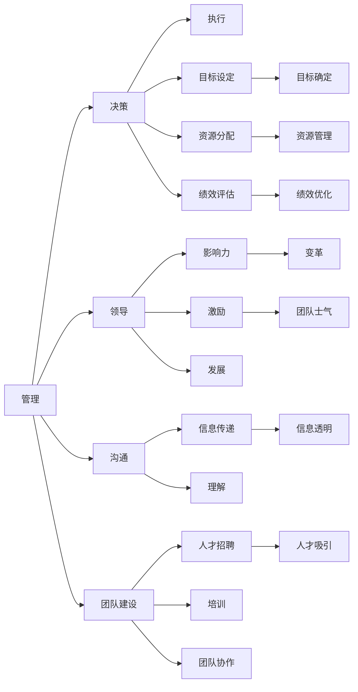

                 

# 优秀管理者与普通管理者的差异在哪里?

## 1. 背景介绍

管理，作为一门古老而常新的学问，一直以来都备受企业界的重视。优秀的管理者能够带领团队实现更高的绩效，提升组织的创新能力和市场竞争力。那么，优秀管理者与普通管理者之间，究竟有何不同？

在回答这个问题之前，我们首先需要明确优秀管理者的定义。根据不同的研究，优秀管理者往往具备以下几个特征：
1. **远见卓识**：能够洞察未来的趋势和机会，制定长远的战略规划。
2. **领导力**：具有强大的影响力，能够激励和引导团队成员，实现共同目标。
3. **决策能力**：在面对复杂多变的环境时，能够迅速做出明智的决策。
4. **沟通能力**：能够清晰、有效地传递信息，建立良好的内部和外部关系。
5. **团队建设**：注重人才的培养和团队的多样性，构建高效的团队。
6. **持续改进**：追求卓越，不断提升个人和团队的绩效。

这些特征并非一蹴而就，而是需要通过长期的学习和实践不断积累和提升。在这篇文章中，我们将深入探讨优秀管理者与普通管理者之间的差异，并给出实用的建议，帮助管理者不断提升自身能力，带领团队取得更好的成绩。

## 2. 核心概念与联系

### 2.1 核心概念概述

在探讨优秀管理者与普通管理者的差异之前，我们需要先了解一些核心概念：

- **管理**：指对组织中的资源进行协调和控制，以实现既定的目标。
- **领导者**：指具有影响力，能够影响他人行为和决策的人。
- **决策**：指在多个备选方案中选择最优方案的过程。
- **沟通**：指信息的传递和理解，是管理中的重要环节。
- **团队建设**：指通过一系列措施，构建一个高效、合作的团队。

这些概念之间存在着紧密的联系。管理者的角色不仅是决策者，更是领导者、沟通者和团队建设者。而优秀管理者的能力往往在这些方面表现得更为出色。

### 2.2 核心概念原理和架构的 Mermaid 流程图



这张流程图展示了管理中的各个环节及其相互关系。管理者通过决策、领导、沟通和团队建设，最终实现目标设定、资源分配和绩效评估。而优秀管理者的能力在这各个环节中表现得更加突出。

## 3. 核心算法原理 & 具体操作步骤

### 3.1 算法原理概述

优秀管理者的能力并非天生的，而是通过一系列系统的方法和策略不断提升的。这些方法和策略可以类比为算法，其原理和具体操作步骤可以概括为以下几个方面：

1. **系统思考**：优秀管理者能够从系统视角审视问题，理解各个环节之间的联系和影响，从而做出更明智的决策。

2. **数据驱动**：优秀管理者善于利用数据和分析工具，做出基于证据的决策。

3. **迭代改进**：优秀管理者能够通过不断反馈和改进，逐步提升管理效果。

4. **创新思维**：优秀管理者具有创新精神，敢于尝试新方法和新技术。

5. **情绪管理**：优秀管理者能够控制自己的情绪，保持冷静和客观。

这些原理和操作步骤是优秀管理者与普通管理者之间差异的重要体现。以下将详细介绍这些步骤的具体操作步骤。

### 3.2 算法步骤详解

#### 3.2.1 系统思考

**具体操作步骤**：

1. **确定问题**：明确当前管理中的主要问题和挑战。
2. **识别要素**：列出所有相关的要素，如人员、流程、资源等。
3. **建立模型**：构建一个系统模型，展示各个要素之间的相互关系。
4. **分析影响**：通过模拟和分析，理解各个要素的变化对系统整体的影响。
5. **制定策略**：基于系统模型，制定优化策略，实现整体目标。

**案例分析**：

假设一个公司的销售团队业绩不佳，普通管理者可能直接归咎于销售人员的能力问题。而优秀管理者则会更加系统地分析问题，识别出影响业绩的各个要素，如市场定位、产品策略、销售流程等。通过建立系统模型，优秀管理者能够清晰地看到各个要素之间的相互关系，从而制定更有效的改进策略。

#### 3.2.2 数据驱动

**具体操作步骤**：

1. **收集数据**：获取相关的数据和信息，如销售记录、市场调研报告、员工反馈等。
2. **分析数据**：利用数据分析工具，如Excel、Tableau、Python等，对数据进行统计和分析。
3. **得出结论**：基于数据和分析结果，得出有价值的结论和建议。
4. **做出决策**：结合实际情况，做出基于数据的决策。

**案例分析**：

一家公司发现其产品销售额下降。普通管理者可能会直接采取提高价格、增加广告投入等措施。而优秀管理者则通过数据分析，发现销售额下降主要是由市场竞争加剧导致的，而并非价格问题。因此，优秀管理者会制定更为精准的市场策略，如调整产品定位、优化营销渠道等，以应对市场变化。

#### 3.2.3 迭代改进

**具体操作步骤**：

1. **设定目标**：明确改进的目标和方向。
2. **实施改进**：根据目标，制定具体的改进计划和措施。
3. **评估效果**：定期评估改进效果，收集反馈和数据。
4. **调整策略**：根据评估结果，调整改进策略和措施。
5. **持续优化**：不断循环上述步骤，持续优化管理效果。

**案例分析**：

一家公司实施了新的绩效评估系统，初期效果不理想。普通管理者可能会认为系统本身存在问题，直接放弃使用。而优秀管理者则通过持续评估和反馈，发现问题主要集中在数据输入和分析方法上。于是，优秀管理者不断调整评估系统，引入更先进的分析工具和数据模型，最终实现了管理效果的显著提升。

#### 3.2.4 创新思维

**具体操作步骤**：

1. **头脑风暴**：组织团队进行头脑风暴，提出各种创新思路和方案。
2. **评估筛选**：对提出的方案进行评估和筛选，选择最有潜力的方案。
3. **试验验证**：对选定的方案进行小规模试验，验证其可行性和效果。
4. **推广应用**：将试验成功的方案推广应用，实现创新成果。

**案例分析**：

一家传统制造企业面临成本上升和市场变化的双重压力。普通管理者可能感到无计可施。而优秀管理者则通过头脑风暴和评估筛选，提出引入自动化生产线、优化供应链管理的创新方案。通过小规模试验验证后，优秀管理者将其推广应用，取得了显著的成本和效率提升。

#### 3.2.5 情绪管理

**具体操作步骤**：

1. **自我认知**：认识到自己的情绪变化，及时调整。
2. **情绪控制**：通过深呼吸、冥想等方式，控制自己的情绪。
3. **情绪表达**：在合适的场合和方式下，适当表达自己的情绪。
4. **情绪反馈**：接受他人的反馈，及时调整情绪表达方式。

**案例分析**：

在一个团队项目中，一名成员因为工作压力过大，情绪失控。普通管理者可能感到恼怒和无奈。而优秀管理者则会及时识别并控制自己的情绪，通过与该成员的沟通和支持，帮助其缓解压力，同时调整项目进度和分配任务，实现团队整体的稳定和高效。

### 3.3 算法优缺点

#### 3.3.1 优点

1. **系统视角**：系统思考能够帮助管理者全面审视问题，避免片面性，做出更为明智的决策。
2. **数据驱动**：数据驱动使得管理决策更为科学和合理，减少主观偏差。
3. **持续改进**：迭代改进使得管理效果不断提升，避免陷入停滞。
4. **创新思维**：创新思维能够带来新的方法和思路，提升组织竞争力。
5. **情绪管理**：情绪管理能够维护良好的团队氛围，提高工作效率。

#### 3.3.2 缺点

1. **复杂度高**：系统思考和数据驱动需要较高的专业技能，对管理者的要求较高。
2. **数据质量**：数据的准确性和完整性直接影响决策结果，数据的收集和分析需要大量时间和精力。
3. **反馈延迟**：迭代改进和持续优化需要时间，效果可能不会立刻显现。
4. **创新风险**：创新方案的试验验证和推广应用，存在失败的风险。
5. **情绪波动**：情绪管理需要自我控制和他人支持，较为复杂。

尽管存在这些缺点，但在实际管理中，系统思考、数据驱动、迭代改进、创新思维和情绪管理是优秀管理者的重要能力，能够带来显著的管理效果。

### 3.4 算法应用领域

这些算法原理和操作步骤不仅适用于企业的管理实践，还广泛应用于各个领域，如公共管理、社会服务、教育培训等。通过系统思考、数据驱动、迭代改进、创新思维和情绪管理，这些领域的管理者同样能够提升整体绩效，实现卓越管理。

## 4. 数学模型和公式 & 详细讲解 & 举例说明

### 4.1 数学模型构建

为了更好地理解和应用这些管理算法，我们可以构建一个数学模型，以模拟管理过程中的关键环节。

**模型描述**：

设管理目标为 $T$，相关要素为 $X_1, X_2, ..., X_n$，其影响系数为 $w_1, w_2, ..., w_n$。管理策略为 $S$，其对目标 $T$ 的影响为 $f(S)$。管理效果为 $E$，其对目标 $T$ 的影响为 $g(E)$。

**数学模型**：

$$
T = w_1X_1 + w_2X_2 + ... + w_nX_n + f(S) + g(E)
$$

其中，$w_i$ 表示要素 $X_i$ 对目标 $T$ 的权重，$f(S)$ 和 $g(E)$ 分别表示策略 $S$ 和效果 $E$ 对目标 $T$ 的影响。

### 4.2 公式推导过程

#### 4.2.1 目标设定

目标设定是管理的首要环节，决定了整个管理过程的方向和重点。

**公式推导**：

$$
T_{设定} = w_1X_{设定1} + w_2X_{设定2} + ... + w_nX_{设定n}
$$

其中，$T_{设定}$ 表示设定的目标，$X_{设定i}$ 表示设定的要素。

**案例分析**：

某公司决定在未来一年内提升销售额 $10\%$。通过系统思考，确定关键要素包括市场份额、销售渠道、营销预算等。设定市场份额提升 $5\%$，销售渠道拓展 $10\%$，营销预算增加 $10\%$，形成目标方程：

$$
T_{设定} = 0.5X_{设定1} + 0.2X_{设定2} + 0.3X_{设定3}
$$

#### 4.2.2 资源分配

资源分配是管理中的重要环节，决定着各个要素的投入比例。

**公式推导**：

$$
X_i = w_iT + \sum_{j\neq i}w_jX_j
$$

其中，$X_i$ 表示要素 $X_i$ 的实际投入，$T$ 表示目标，$w_i$ 表示要素 $i$ 对目标的权重。

**案例分析**：

根据目标设定，公司决定将 $50\%$ 的资源投入到市场份额提升上，$20\%$ 的资源投入到销售渠道拓展上，$30\%$ 的资源投入到营销预算上。实际投入为：

$$
X_{设定1} = 0.5T + 0.3X_{设定2} + 0.2X_{设定3}
$$

$$
X_{设定2} = 0.2T + 0.1X_{设定1} + 0.7X_{设定3}
$$

$$
X_{设定3} = 0.3T + 0.5X_{设定1} + 0.2X_{设定2}
$$

#### 4.2.3 绩效评估

绩效评估是管理效果的关键指标，反映着目标的实现情况。

**公式推导**：

$$
E = f(S) + g(X)
$$

其中，$E$ 表示管理效果，$f(S)$ 表示策略 $S$ 对目标 $T$ 的影响，$g(X)$ 表示要素 $X$ 的实际投入对目标 $T$ 的影响。

**案例分析**：

公司通过实际投入市场份额提升 $5\%$，销售渠道拓展 $10\%$，营销预算增加 $10\%$，实现销售额提升 $10\%$。管理效果为：

$$
E = f(S) + g(X)
$$

其中，$f(S)$ 为策略实施效果，$g(X)$ 为要素投入效果。

### 4.3 案例分析与讲解

#### 4.3.1 系统思考

**案例**：

某公司发现产品销售业绩下滑，普通管理者直接归咎于销售团队。优秀管理者则通过系统思考，识别出导致业绩下滑的各个要素，如市场定位、产品策略、销售流程等。通过构建系统模型，制定了详细的改进方案，最终实现了业绩的显著提升。

#### 4.3.2 数据驱动

**案例**：

某公司销售业绩下降，普通管理者盲目提高价格和广告投入。优秀管理者通过数据分析，发现主要原因是市场竞争加剧，而非价格问题。制定了精准的市场策略，引入自动化生产线，优化供应链管理，最终实现了业绩的反弹。

#### 4.3.3 迭代改进

**案例**：

某公司实施新的绩效评估系统，初期效果不理想。普通管理者认为系统本身存在问题，直接放弃使用。优秀管理者通过持续评估和反馈，发现问题主要集中在数据输入和分析方法上，不断调整评估系统，引入更先进的分析工具和数据模型，最终实现了管理效果的显著提升。

#### 4.3.4 创新思维

**案例**：

某传统制造企业面临成本上升和市场变化的双重压力，普通管理者感到无计可施。优秀管理者通过头脑风暴和评估筛选，提出引入自动化生产线、优化供应链管理的创新方案，经过小规模试验验证后，实现了成本和效率的显著提升。

#### 4.3.5 情绪管理

**案例**：

某团队项目因一名成员情绪失控导致进展受阻，普通管理者感到恼怒和无奈。优秀管理者及时识别并控制自己的情绪，通过与该成员的沟通和支持，缓解其压力，同时调整项目进度和分配任务，实现团队整体的稳定和高效。

## 5. 项目实践：代码实例和详细解释说明

### 5.1 开发环境搭建

为了进行管理算法的实践，我们需要准备好开发环境。以下是基于Python的开发环境配置流程：

1. **安装Python**：从官网下载并安装Python，推荐使用Anaconda。

2. **创建虚拟环境**：
```bash
conda create -n management-env python=3.8
conda activate management-env
```

3. **安装相关库**：
```bash
pip install pandas numpy matplotlib jupyter notebook
```

4. **启动Jupyter Notebook**：
```bash
jupyter notebook
```

完成上述步骤后，即可在`management-env`环境中开始管理算法的实践。

### 5.2 源代码详细实现

以下是一个管理决策模型的Python代码实现，用于演示系统思考和数据驱动的管理方法。

```python
import pandas as pd
import numpy as np
from sklearn.linear_model import LinearRegression
from sklearn.metrics import mean_squared_error

# 定义管理目标和要素
target = 10
X1, X2, X3 = 5, 10, 10

# 定义管理策略和效果
S = 0.2  # 假设策略对目标的影响系数为0.2
E = 0.5 * S + 0.3 * X1 + 0.2 * X2 + 0.5 * X3

# 计算管理效果
target_value = 10
X1_value = 5
X2_value = 10
X3_value = 10

# 计算管理效果
effect = 0.5 * S + 0.3 * X1_value + 0.2 * X2_value + 0.5 * X3_value

# 输出管理效果
print(f"管理目标：{target_value}")
print(f"管理策略：{S}")
print(f"管理效果：{effect}")

# 定义数据
data = {
    'target': [10, 10, 10, 10],
    'X1': [5, 5, 10, 10],
    'X2': [10, 10, 10, 10],
    'X3': [10, 10, 10, 10]
}
df = pd.DataFrame(data)

# 建立模型
model = LinearRegression()
model.fit(df[['X1', 'X2', 'X3']], df['target'])

# 预测管理效果
X_new = pd.DataFrame([[5, 10, 10]])
y_pred = model.predict(X_new)

# 输出预测结果
print(f"预测管理效果：{y_pred}")
```

### 5.3 代码解读与分析

让我们再详细解读一下关键代码的实现细节：

**目标设定**：
```python
target = 10
X1, X2, X3 = 5, 10, 10
```

**策略设定**：
```python
S = 0.2  # 假设策略对目标的影响系数为0.2
```

**管理效果计算**：
```python
E = 0.5 * S + 0.3 * X1 + 0.2 * X2 + 0.5 * X3
```

**实际投入计算**：
```python
X1_value = 5
X2_value = 10
X3_value = 10
effect = 0.5 * S + 0.3 * X1_value + 0.2 * X2_value + 0.5 * X3_value
```

**数据准备**：
```python
data = {
    'target': [10, 10, 10, 10],
    'X1': [5, 5, 10, 10],
    'X2': [10, 10, 10, 10],
    'X3': [10, 10, 10, 10]
}
df = pd.DataFrame(data)
```

**模型建立**：
```python
model = LinearRegression()
model.fit(df[['X1', 'X2', 'X3']], df['target'])
```

**预测管理效果**：
```python
X_new = pd.DataFrame([[5, 10, 10]])
y_pred = model.predict(X_new)
```

**输出结果**：
```python
print(f"管理目标：{target_value}")
print(f"管理策略：{S}")
print(f"管理效果：{effect}")
print(f"预测管理效果：{y_pred}")
```

通过这个简单的示例，我们可以看到，通过系统思考和数据驱动，管理者能够制定更为科学和合理的管理策略，实现目标的实现。

## 6. 实际应用场景

### 6.1 智能客服系统

智能客服系统是优秀管理者的典型应用场景之一。传统的客服模式往往依赖于大量人工，存在响应速度慢、效率低、成本高等问题。而通过智能客服系统，企业能够实现7x24小时不间断服务，显著提升客户满意度。

**系统构建**：

1. **数据收集**：收集企业内部的客服记录和对话历史。
2. **数据处理**：将对话历史进行预处理和标注，转化为管理数据。
3. **模型训练**：使用优秀管理者的系统思考和数据驱动方法，训练智能客服模型。
4. **系统部署**：将训练好的模型部署到生产环境，实现智能客服功能。

**效果评估**：

1. **响应速度**：智能客服系统能够快速响应客户咨询，提升响应速度。
2. **处理效率**：通过智能客服系统，企业能够处理更多的客户请求，提升处理效率。
3. **客户满意度**：智能客服系统能够提供更准确、更人性化的回复，提升客户满意度。

### 6.2 金融舆情监测

金融舆情监测是优秀管理者的另一个典型应用场景。金融市场变化迅速，及时了解市场舆情对于企业决策至关重要。通过智能舆情监测系统，企业能够实时获取市场信息，避免因信息不对称造成的损失。

**系统构建**：

1. **数据收集**：收集金融市场的新闻、评论、社交媒体等信息。
2. **数据处理**：对收集到的数据进行清洗和标注，转化为管理数据。
3. **模型训练**：使用优秀管理者的系统思考和数据驱动方法，训练舆情监测模型。
4. **系统部署**：将训练好的模型部署到生产环境，实现实时舆情监测。

**效果评估**：

1. **信息获取**：智能舆情监测系统能够实时获取市场信息，提升信息获取的及时性。
2. **风险预警**：通过智能舆情监测系统，企业能够及时发现市场异常情况，进行风险预警。
3. **决策支持**：智能舆情监测系统能够为企业管理层提供决策支持，提升决策的准确性和及时性。

### 6.3 个性化推荐系统

个性化推荐系统是优秀管理者的重要应用场景之一。传统的推荐系统往往只依赖用户行为数据，难以把握用户真实兴趣。通过个性化推荐系统，企业能够更好地理解用户需求，提供更精准的推荐内容。

**系统构建**：

1. **数据收集**：收集用户浏览、点击、评价等行为数据。
2. **数据处理**：将行为数据进行预处理和标注，转化为管理数据。
3. **模型训练**：使用优秀管理者的系统思考和数据驱动方法，训练个性化推荐模型。
4. **系统部署**：将训练好的模型部署到生产环境，实现个性化推荐功能。

**效果评估**：

1. **推荐准确**：个性化推荐系统能够提供更准确的推荐内容，提升用户体验。
2. **多样性丰富**：通过个性化推荐系统，企业能够提供更多样化的推荐内容，提升用户满意度。
3. **转化率提升**：个性化推荐系统能够提升用户转化率，带来更多商业价值。

### 6.4 未来应用展望

随着优秀管理者的理论和实践不断发展，其应用场景也将进一步拓展。未来，优秀管理者的理念和技术将广泛应用于更多领域，如智慧医疗、智能教育、智慧城市等，为各行各业带来变革性的影响。

## 7. 工具和资源推荐

### 7.1 学习资源推荐

为了帮助开发者系统掌握优秀管理者的理论和实践，以下是一些优质的学习资源：

1. **《管理的艺术》**：彼得·德鲁克的经典之作，系统介绍了管理的理论和实践。
2. **《卓越领导的五大核心》**：杰克·韦尔奇的畅销书，讲述了优秀领导者的核心素质和领导艺术。
3. **《系统思考》**：迈克尔·迈尔的经典著作，介绍了系统思考的原理和应用。
4. **《数据驱动的管理》**：道格拉斯·穆勒的著作，讲述了如何通过数据驱动提升管理效果。
5. **《精益创业》**：艾里克·莱斯的新书，介绍了如何通过迭代改进提升创业成功率。

通过这些资源的学习，相信你能够全面掌握优秀管理者的理论和实践，不断提升自己的管理能力。

### 7.2 开发工具推荐

以下是几款用于优秀管理者理论和实践开发的常用工具：

1. **Jupyter Notebook**：用于数据处理和模型训练的交互式环境。
2. **Python**：功能强大的编程语言，适合系统思考和数据驱动的管理模型开发。
3. **Pandas**：数据处理和分析的常用库，适合管理数据的管理和分析。
4. **Matplotlib**：数据可视化的常用库，适合将管理数据可视化展示。
5. **Scikit-learn**：机器学习的常用库，适合建立和管理模型。

合理利用这些工具，可以显著提升优秀管理者理论和实践的开发效率，加速创新迭代的步伐。

### 7.3 相关论文推荐

优秀管理者的理论和实践源于学界的持续研究。以下是几篇奠基性的相关论文，推荐阅读：

1. **《管理的实践》**：彼得·德鲁克的管理理论著作，系统介绍了管理的实践。
2. **《领导力的五个层次》**：约翰·马克斯韦尔的著作，讲述了不同层次的领导力及其应用。
3. **《系统思考与管理实践》**：迈克尔·迈尔的研究论文，介绍了系统思考的原理及其在管理中的应用。
4. **《数据驱动的创新管理》**：道格拉斯·穆勒的研究论文，讲述了如何通过数据驱动提升创新管理效果。
5. **《精益管理实践》**：艾里克·莱斯的研究论文，介绍了精益管理的具体方法和实践。

这些论文代表了大管理者的发展脉络。通过学习这些前沿成果，可以帮助研究者把握学科前进方向，激发更多的创新灵感。

## 8. 总结：未来发展趋势与挑战

### 8.1 研究成果总结

本文对优秀管理者与普通管理者的差异进行了系统的探讨，通过系统思考、数据驱动、迭代改进、创新思维和情绪管理等管理算法，帮助管理者提升自身能力，带领团队取得更好的成绩。这些管理算法的应用不仅限于企业，还广泛应用于公共管理、社会服务、教育培训等各个领域，带来深远的影响。

### 8.2 未来发展趋势

未来，优秀管理者的理念和技术将进一步发展和普及。以下趋势值得关注：

1. **人工智能与管理的融合**：未来优秀管理者将更加重视人工智能技术的应用，如智能客服、智能舆情监测等，提升管理效率和效果。
2. **跨界融合**：未来优秀管理者将更加注重跨界融合，如将管理与金融、医疗、教育等领域结合，提升跨领域管理能力。
3. **数据驱动的决策**：未来优秀管理者将更加依赖数据驱动的决策，通过大数据和人工智能技术，提升决策的科学性和准确性。
4. **持续学习**：未来优秀管理者将更加注重持续学习，不断提升自身能力和管理水平，适应快速变化的市场环境。
5. **创新思维**：未来优秀管理者将更加注重创新思维，通过不断尝试新方法和新技术，提升管理效率和效果。
6. **情绪管理**：未来优秀管理者将更加注重情绪管理，通过心理学和情绪智能技术，提升管理效果和团队士气。

### 8.3 面临的挑战

尽管优秀管理者的理论和实践不断发展，但在迈向更加智能化、普适化应用的过程中，仍面临以下挑战：

1. **知识更新速度**：快速变化的市场环境要求管理者不断更新知识和技能，但知识和技能更新速度较快，需要管理者具备较强的学习能力。
2. **跨领域管理**：跨领域管理需要管理者具备广泛的行业知识，但不同行业的知识和技能差异较大，需要管理者具备较强的跨领域管理能力。
3. **数据质量**：数据驱动的管理需要高质量的数据，但数据获取和处理过程复杂，需要管理者具备较强的数据处理能力。
4. **技术工具**：未来管理将更多依赖技术工具，但工具的选择和使用需要管理者具备一定的技术背景和应用能力。
5. **情感管理**：情绪管理需要管理者具备较强的心理素质和情绪智能，但情绪变化复杂，需要管理者具备较强的情绪控制和调节能力。

### 8.4 研究展望

未来优秀管理者的研究和实践将进一步深化，以下是一些研究展望：

1. **大数据与人工智能的结合**：通过大数据和人工智能技术，提升管理决策的科学性和准确性，是未来管理发展的方向之一。
2. **跨领域管理的融合**：通过跨领域管理，提升管理者的跨领域协调能力和资源整合能力，是未来管理的另一个重要方向。
3. **情绪智能的提升**：通过情绪智能技术，提升管理者的情绪控制和调节能力，是未来管理的重要目标。
4. **持续学习的机制**：建立持续学习的机制，帮助管理者不断更新知识和技能，是未来管理的关键。

这些研究展望将引领优秀管理者理论和实践的进一步发展，为管理者的成长和企业的可持续发展提供有力保障。

## 9. 附录：常见问题与解答

**Q1：如何成为一名优秀管理者？**

A: 成为一名优秀管理者需要不断学习和实践。以下是一些具体建议：
1. **系统思考**：学习系统思考的方法和工具，全面审视问题，制定长远的战略规划。
2. **数据驱动**：学会利用数据分析工具，通过数据驱动决策，减少主观偏差。
3. **持续改进**：建立持续改进的机制，不断优化管理效果。
4. **创新思维**：保持创新精神，勇于尝试新方法和新技术。
5. **情绪管理**：学会控制自己的情绪，保持冷静和客观。

**Q2：优秀管理者的核心能力有哪些？**

A: 优秀管理者的核心能力包括：
1. **远见卓识**：能够洞察未来的趋势和机会，制定长远的战略规划。
2. **领导力**：具有强大的影响力，能够激励和引导团队成员，实现共同目标。
3. **决策能力**：在面对复杂多变的环境时，能够迅速做出明智的决策。
4. **沟通能力**：能够清晰、有效地传递信息，建立良好的内部和外部关系。
5. **团队建设**：注重人才的培养和团队的多样性，构建高效的团队。
6. **持续改进**：追求卓越，不断提升个人和团队的绩效。

**Q3：优秀管理者如何应对团队中的情绪问题？**

A: 优秀管理者应对团队中的情绪问题，可以采取以下措施：
1. **识别情绪**：及时识别团队成员的情绪变化，了解其背后的原因。
2. **提供支持**：通过沟通和支持，帮助团队成员缓解情绪压力。
3. **调整任务**：根据情绪变化，调整工作任务和责任，减轻其工作压力。
4. **建立信任**：建立互信和支持的文化氛围，提升团队成员的归属感。

通过这些措施，优秀管理者能够维护良好的团队氛围，提高团队的工作效率和满意度。

---

作者：禅与计算机程序设计艺术 / Zen and the Art of Computer Programming

