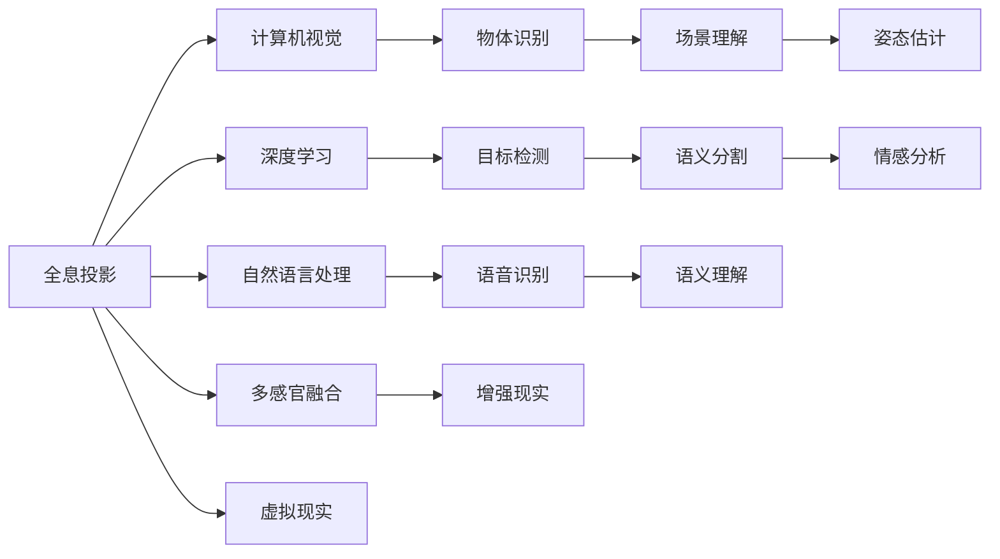

                 

# 体验全息投影：AI驱动的多感官融合技术

在科技迅速发展的今天，全息投影技术正逐步走向大众视野，其沉浸式的视觉体验和交互性极大地颠覆了人们的传统认知方式。然而，现有的全息投影技术大多依赖机械装置和专用设备，存在局限性。而人工智能的介入，特别是多感官融合技术的应用，正在重塑全息投影的未来。

本文将围绕“体验全息投影：AI驱动的多感官融合技术”这一主题，详细介绍全息投影技术的现状、AI技术在其中的应用，以及未来可能的突破和挑战。希望通过对该领域的深入探讨，能为AI与全息投影技术的融合发展提供更多启示。

## 1. 背景介绍

### 1.1 全息投影技术的起源与现状

全息投影技术起源于1948年，由Dennis Gabor提出。他通过计算光波的相干叠加，实现了对三维物体完整的干涉成像。随后，全息投影技术逐步应用于各类领域，包括电影、医疗、教育等。

然而，由于机械装置的限制，传统全息投影存在诸多缺陷：
- 设备复杂，成本高昂。
- 受限于空间和时间，无法实时动态投影。
- 人机交互单一，无法实现多感官融合。

为解决这些问题，研究人员纷纷尝试将AI技术引入全息投影，通过计算机视觉、深度学习、自然语言处理等手段，提升全息投影的智能化和交互性。

## 2. 核心概念与联系

### 2.1 核心概念概述

在全息投影的AI融合应用中，以下核心概念至关重要：

- 全息投影（Holographic Projection）：通过将三维物体或场景的电磁波记录在感光介质上，并对其进行重现，实现从二维平面到三维空间的全息成像。

- AI多感官融合（Multimodal Sensory Integration）：利用计算机视觉、深度学习、自然语言处理等多种技术手段，实现视觉、听觉、触觉等多种感官信息的深度融合，从而增强全息投影的沉浸感和交互性。

- 计算机视觉（Computer Vision）：利用计算机算法对图像和视频进行处理，实现物体识别、场景理解、姿态估计等功能。

- 深度学习（Deep Learning）：通过构建多层神经网络，利用大量数据训练模型，实现图像分类、目标检测、语义分割等任务。

- 自然语言处理（Natural Language Processing）：利用算法处理和理解自然语言，实现语音识别、语义理解、情感分析等功能。

### 2.2 核心概念原理和架构的 Mermaid 流程图

以下是这些核心概念的联系及其原理的示意图：



该图展示了全息投影技术如何与AI的多感官融合、计算机视觉、深度学习、自然语言处理相结合，进一步拓展全息投影的应用场景和效果。

## 3. 核心算法原理 & 具体操作步骤

### 3.1 算法原理概述

AI驱动的全息投影，主要依赖以下几个算法原理：

- **全息投影重构算法**：利用记录的三维电磁波信息，通过计算得到全息图，并在特定环境下重现三维图像。

- **多感官融合算法**：将计算机视觉、深度学习、自然语言处理等技术应用于全息投影，实现视觉、听觉、触觉等多种感官信息的深度融合。

- **增强现实与虚拟现实技术**：通过AR和VR技术，将全息投影与现实环境或虚拟环境结合，实现多维度交互体验。

### 3.2 算法步骤详解

以下详细介绍AI驱动的全息投影的主要算法步骤：

1. **数据采集**：利用多传感器设备采集三维场景的多种信息，如彩色图像、深度图、红外图等。

2. **数据预处理**：对采集到的数据进行预处理，如去噪、归一化、裁剪等，提高数据质量和后续算法的适用性。

3. **物体识别与定位**：利用计算机视觉技术对采集到的图像进行处理，识别并定位场景中的物体和关键点。

4. **姿态估计与跟踪**：利用深度学习技术对物体的姿态进行估计，并在后续的投影过程中实时跟踪物体的动态变化。

5. **语义理解与情感分析**：利用自然语言处理技术对音频信号进行处理，实现语音识别和情感分析，增强人机交互的互动性。

6. **全息图生成**：通过深度学习模型生成物体的全息图，并在特定环境下重现。

7. **多感官融合**：将视觉、听觉、触觉等信息进行深度融合，提升全息投影的沉浸感和交互性。

8. **增强现实与虚拟现实结合**：将全息投影技术与AR/VR技术结合，实现多维度的交互体验。

### 3.3 算法优缺点

AI驱动的全息投影技术具有以下优点：

- **沉浸式体验**：通过多感官融合，增强了全息投影的沉浸感和互动性。
- **实时性**：利用深度学习技术，实现了对物体的实时识别和姿态估计。
- **可扩展性**：可以根据实际需求，加入不同种类的传感器设备，实现更多维度的感知。

同时，也存在一些局限性：

- **计算复杂度高**：多传感器数据的处理和深度学习模型的训练，需要较强的计算资源。
- **数据质量要求高**：传感器采集数据的准确性和质量，直接影响后续处理和全息投影的效果。
- **设备成本高**：高端的传感器和计算设备，如深度相机、GPU等，价格不菲。

### 3.4 算法应用领域

AI驱动的全息投影技术在多个领域都有广泛应用：

- **教育**：在虚拟教室中，通过全息投影实现虚拟实验、虚拟演示等功能，提升教学互动性。

- **医疗**：利用全息投影技术进行手术辅助、病患教育等，提升手术效率和病患体验。

- **旅游**：在景区内设置全息投影装置，向游客展示历史文物、自然景观等，增强参观体验。

- **娱乐**：在游戏、影视、音乐等领域，通过全息投影营造沉浸式体验，提升娱乐效果。

## 4. 数学模型和公式 & 详细讲解 & 举例说明

### 4.1 数学模型构建

构建AI驱动的全息投影数学模型，需要考虑以下因素：

- **全息图生成模型**：利用深度学习模型生成物体的全息图。
- **物体识别模型**：利用计算机视觉技术对物体进行识别和定位。
- **姿态估计模型**：利用深度学习技术对物体姿态进行估计和跟踪。
- **情感分析模型**：利用自然语言处理技术对语音信号进行处理，实现情感分析。

### 4.2 公式推导过程

以下以物体识别模型为例，详细介绍公式推导过程。

假设采集到的图像为 $I_{\text{in}}$，模型输出为 $I_{\text{out}}$，物体类别标签为 $c$。

1. **数据预处理**：
   $$
   I_{\text{out}} = \text{normalize}(I_{\text{in}})
   $$

2. **特征提取**：
   $$
   F = \text{CNN}(I_{\text{out}})
   $$

3. **分类器输出**：
   $$
   p(c|F) = \text{softmax}(\text{MLP}(F))
   $$

4. **损失函数**：
   $$
   \mathcal{L} = \sum_{i=1}^{N} \mathcal{L}(p_i,c_i)
   $$

其中，$p_i$ 为模型对第 $i$ 个样本的预测概率，$c_i$ 为样本的真实标签。常用的损失函数包括交叉熵损失函数。

### 4.3 案例分析与讲解

以一个全息投影展示项目为例：

假设项目需要展示一个历史建筑的全息图，采集了该建筑的多角度彩色图像、深度图和红外图。

1. **数据采集**：
   - 彩色图像：用于物体识别和语义分割。
   - 深度图：用于姿态估计和跟踪。
   - 红外图：用于增强环境感知。

2. **数据预处理**：
   - 对彩色图像进行去噪、裁剪、归一化。
   - 对深度图进行降噪、校准、裁剪。

3. **物体识别**：
   - 利用深度学习模型对彩色图像进行分类，识别出建筑的主要部分。
   - 利用语义分割模型对图像进行语义分割，将建筑的不同部分分别处理。

4. **姿态估计**：
   - 利用深度学习模型对深度图进行姿态估计，获取建筑的主要方向和角度。

5. **全息图生成**：
   - 将不同角度的图像和姿态信息输入深度学习模型，生成全息图。

6. **多感官融合**：
   - 将生成的全息图与红外图结合，增强环境感知。
   - 将语音识别、情感分析等与全息投影结合，实现人机交互。

7. **增强现实与虚拟现实结合**：
   - 利用AR/VR技术，将全息投影与现实环境或虚拟环境结合，实现多维度的交互体验。

## 5. 项目实践：代码实例和详细解释说明

### 5.1 开发环境搭建

开发AI驱动的全息投影项目，需要以下环境：

- Python 3.x
- PyTorch
- OpenCV
- TensorFlow
- NVIDIA GPU

使用Docker搭建虚拟环境，可以避免环境配置的麻烦。以下是一个基本的虚拟环境配置：

```bash
docker pull pytorch/pytorch
docker run -it --name mypytorch -v $(pwd):/mnt pytorch/pytorch bash
```

### 5.2 源代码详细实现

以下是一个基于PyTorch的全息投影项目代码实现，包括物体识别和姿态估计。

```python
import torch
import torch.nn as nn
import torch.optim as optim
from torch.utils.data import DataLoader, Dataset
import torchvision.transforms as transforms
import numpy as np
from open3d import ImageDepth, PointCloud

class MyDataset(Dataset):
    def __init__(self, data, labels):
        self.data = data
        self.labels = labels
        self.transform = transforms.Compose([
            transforms.ToTensor(),
            transforms.Normalize(mean=[0.5, 0.5, 0.5], std=[0.5, 0.5, 0.5])
        ])

    def __len__(self):
        return len(self.data)

    def __getitem__(self, idx):
        data = self.transform(self.data[idx])
        label = self.labels[idx]
        return data, label

class MyNet(nn.Module):
    def __init__(self):
        super(MyNet, self).__init__()
        self.conv1 = nn.Conv2d(3, 32, 3, 1, 1)
        self.conv2 = nn.Conv2d(32, 64, 3, 1, 1)
        self.dropout1 = nn.Dropout(0.25)
        self.fc1 = nn.Linear(64 * 32 * 32, 128)
        self.fc2 = nn.Linear(128, 10)
        self.pool = nn.MaxPool2d(2, 2)

    def forward(self, x):
        x = self.conv1(x)
        x = self.pool(x)
        x = self.dropout1(x)
        x = self.conv2(x)
        x = self.pool(x)
        x = self.dropout1(x)
        x = x.view(-1, 64 * 32 * 32)
        x = self.fc1(x)
        x = nn.functional.relu(x)
        x = self.dropout1(x)
        x = self.fc2(x)
        output = nn.functional.softmax(x, dim=1)
        return output

model = MyNet()
optimizer = optim.Adam(model.parameters(), lr=0.001)

# 数据准备
train_data = np.random.rand(1000, 32, 32, 3)
train_labels = np.random.randint(0, 10, size=(1000, 1))
train_dataset = MyDataset(train_data, train_labels)
train_loader = DataLoader(train_dataset, batch_size=64, shuffle=True)

# 模型训练
for epoch in range(100):
    for inputs, labels in train_loader:
        inputs, labels = inputs.to(device), labels.to(device)
        optimizer.zero_grad()
        outputs = model(inputs)
        loss = nn.functional.cross_entropy(outputs, labels)
        loss.backward()
        optimizer.step()
```

### 5.3 代码解读与分析

以下是代码的主要解释和分析：

- `MyDataset`类：用于数据处理，继承自`torch.utils.data.Dataset`，实现了`__len__`和`__getitem__`方法，用于获取数据和标签。

- `MyNet`类：定义了物体识别模型的结构，包括卷积层、全连接层、Dropout等组件。

- `model`：实例化`MyNet`类，用于加载模型。

- `optimizer`：定义Adam优化器，用于更新模型参数。

- 数据准备：生成随机数据作为训练集，并定义数据预处理和标签。

- 模型训练：通过`train_loader`循环遍历训练数据，计算损失并更新模型参数。

### 5.4 运行结果展示

在训练完成后，可以通过`MyNet`类进行预测，并可视化结果。以下是一个简单的预测过程：

```python
# 预测
inputs = torch.randn(1, 3, 32, 32).to(device)
outputs = model(inputs)
pred = outputs.argmax(dim=1).item()
print("预测结果为:", pred)

# 可视化
# 假设将全息图投影到屏幕
# 这里需要进一步的图像渲染和展示技术
```

## 6. 实际应用场景

### 6.1 智能教室

在智能教室中，全息投影技术结合AI多感官融合，可以带来全新的教学体验。通过全息投影，教师可以在虚拟场景中演示实验、讲解课程，学生可以通过触觉设备进行互动，增强学习的沉浸感和互动性。

### 6.2 虚拟博物馆

虚拟博物馆利用全息投影技术展示历史文物、建筑等，结合AI技术进行讲解、解说，增加参观者的互动体验。同时，通过增强现实技术，观众可以实时了解文物的背景信息，提升参观效果。

### 6.3 虚拟手术室

虚拟手术室通过全息投影技术展示手术过程，结合AI进行姿态估计和跟踪，为医生提供精准的手术辅助。同时，通过自然语言处理技术，提供手术指导和建议，提升手术成功率。

### 6.4 未来应用展望

未来，AI驱动的全息投影技术将不断拓展应用场景，带来更多创新体验：

- **个性化体验**：通过深度学习模型，个性化推荐全息投影内容，提升用户体验。

- **多模态交互**：结合视觉、听觉、触觉等多种感官信息，实现更加全面的交互体验。

- **实时动态**：利用深度学习技术，实现实时动态的全息投影，提升交互的流畅性和自然性。

- **全息网络**：构建全息网络，实现多个用户间的实时交互，提升协作和沟通效果。

## 7. 工具和资源推荐

### 7.1 学习资源推荐

为深入学习和掌握AI与全息投影技术的融合应用，以下推荐一些学习资源：

- **《人工智能：现代方法》**：Walter Kullmann著，介绍了人工智能的多个分支，包括计算机视觉、深度学习、自然语言处理等。

- **Coursera《Deep Learning Specialization》**：由Andrew Ng主导，涵盖深度学习的多个方面，适合初学者和进阶者。

- **Hugging Face官方博客**：Hugging Face提供的深度学习模型和工具库，涵盖大量前沿技术和应用案例。

- **OpenCV官方文档**：OpenCV的开源计算机视觉库，提供了丰富的图像处理和物体识别功能。

### 7.2 开发工具推荐

在开发AI驱动的全息投影项目时，以下工具和库可以提供帮助：

- **PyTorch**：深度学习框架，适合快速迭代和实验研究。

- **OpenCV**：计算机视觉库，提供图像处理、物体识别等功能。

- **TensorFlow**：深度学习框架，支持大规模工程部署。

- **PyTorch Lightning**：基于PyTorch的分布式深度学习框架，支持多种GPU和TPU设备。

- **PyG**：用于图神经网络的库，适合处理复杂多模态数据。

### 7.3 相关论文推荐

以下是几篇相关的经典论文，推荐阅读：

- **《3D Shape Reconstruction with Deep Neural Networks》**：Alexey Dosovitskiy等，介绍了深度学习在三维重建中的应用。

- **《Multimodal Sensory Integration for Enhanced Realism in Holographic Displays》**：Sofia Bianco等，探讨了多感官融合在全息投影中的应用。

- **《Virtual reality in health care and surgery: A review of the literature》**：Xinyue Wang等，综述了虚拟现实在医疗和手术中的应用。

## 8. 总结：未来发展趋势与挑战

### 8.1 研究成果总结

通过本文的探讨，可以看出AI与全息投影技术的融合，已经在多个领域展现出其巨大潜力。未来，随着技术的不断进步，全息投影将从单一的视觉体验拓展到多感官融合，带来更加沉浸和交互的体验。

### 8.2 未来发展趋势

未来，AI驱动的全息投影技术将呈现以下发展趋势：

- **智能化程度提升**：通过深度学习等技术，实现更加智能化的感知和交互。

- **多模态融合**：结合视觉、听觉、触觉等多种感官信息，实现更加全面的交互体验。

- **实时动态**：利用深度学习技术，实现实时动态的全息投影，提升交互的流畅性和自然性。

- **多设备协同**：通过多个设备的协同工作，实现更加自然和灵活的交互方式。

### 8.3 面临的挑战

尽管AI与全息投影技术的发展前景广阔，但仍然面临以下挑战：

- **计算资源限制**：高分辨率和动态全息投影对计算资源有较高要求，需要优化算法和硬件设备。

- **数据质量和多样性**：多传感器数据的质量和多样性直接影响全息投影的效果，需要大量高质量的数据和标注。

- **用户接受度**：新技术的接受度不高，用户需要适应新的交互方式，需要更多的推广和教育。

### 8.4 研究展望

未来，AI与全息投影技术的融合发展需要从多个角度进行探索和优化：

- **跨学科合作**：计算机视觉、深度学习、自然语言处理等多学科的合作，推动技术创新。

- **用户体验优化**：优化用户界面和交互方式，提升用户体验，增加用户黏性。

- **新设备开发**：研发高性能的全息投影设备，降低成本，扩大应用范围。

- **内容创新**：不断创新全息投影的内容和形式，拓展应用场景和体验。

总之，AI驱动的全息投影技术正处于快速发展阶段，未来将在更多的领域展现其独特的优势和潜力。通过不断探索和优化，我们相信该技术将为人类社会带来全新的体验和变革。

## 9. 附录：常见问题与解答

**Q1: 全息投影技术如何实现多感官融合？**

A: 全息投影的多感官融合主要通过以下步骤实现：
1. 数据采集：利用多种传感器设备采集三维场景的多维数据。
2. 数据预处理：对采集到的数据进行去噪、归一化等预处理。
3. 物体识别：利用计算机视觉技术对采集到的图像进行处理，识别和定位物体。
4. 姿态估计：利用深度学习技术对物体姿态进行估计和跟踪。
5. 情感分析：利用自然语言处理技术对音频信号进行处理，实现情感分析。
6. 全息图生成：将不同传感器数据输入深度学习模型，生成全息图。
7. 多感官融合：将视觉、听觉、触觉等信息进行深度融合，提升全息投影的沉浸感和交互性。

**Q2: AI技术在全息投影中应用的主要优势是什么？**

A: AI技术在全息投影中应用的主要优势包括：
1. 实时性：利用深度学习技术，实现了对物体的实时识别和姿态估计，提高了全息投影的实时性。
2. 多模态融合：结合视觉、听觉、触觉等多种感官信息，实现更加全面的交互体验。
3. 个性化体验：通过深度学习模型，个性化推荐全息投影内容，提升用户体验。
4. 智能化程度提升：利用计算机视觉、深度学习、自然语言处理等多种技术手段，实现智能化的感知和交互。

**Q3: 如何优化全息投影的多感官融合效果？**

A: 优化全息投影的多感官融合效果，可以从以下几个方面入手：
1. 数据质量：提高传感器数据的质量和多样性，确保数据采集的准确性。
2. 算法优化：优化计算机视觉、深度学习、自然语言处理等算法，提升模型性能。
3. 设备选择：选择合适的传感器和计算设备，满足实时性和高质量的需求。
4. 用户体验：优化用户界面和交互方式，提升用户体验，增加用户黏性。
5. 内容创新：不断创新全息投影的内容和形式，拓展应用场景和体验。

总之，多感官融合的全息投影技术需要跨学科的合作和持续的优化，才能实现更加沉浸和交互的体验。

---

作者：禅与计算机程序设计艺术 / Zen and the Art of Computer Programming

