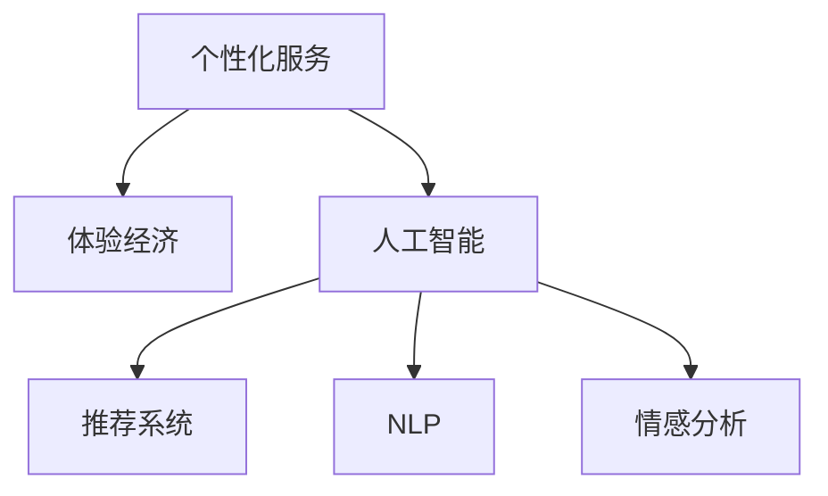

                 

# 体验经济的演变：AI驱动的个性化服务

> 关键词：个性化服务, 客户体验, 人工智能, 推荐系统, 个性化推荐, 服务自动化, 情感分析, 情感识别

## 1. 背景介绍

在数字化和互联网时代，用户体验日益成为企业竞争力的核心。传统的基于产品的经济模式（ goods economy）正在向以服务体验为中心的体验经济（ experiences economy）演变。个性化服务是提升客户满意度和忠诚度的关键，是体验经济的重要组成部分。人工智能（AI）技术的兴起，为实现大规模、高效、个性化的客户服务提供了新的可能。

体验经济的核心在于通过提供高价值的服务体验，来提升客户满意度和品牌忠诚度，从而实现价值增长。而个性化服务作为体验经济的重要手段，能够根据客户的不同需求，提供量身定制的服务内容，提升客户体验。AI技术，特别是机器学习、自然语言处理、推荐系统等技术，通过分析海量用户数据，挖掘用户的潜在需求，提供了从大规模数据中提取个性化服务的能力。

本文旨在通过分析AI技术在个性化服务中的应用，探讨如何构建AI驱动的个性化服务，以及其在体验经济中的潜在价值和未来发展趋势。

## 2. 核心概念与联系

### 2.1 核心概念概述

为更好地理解AI驱动的个性化服务，本节将介绍几个关键概念：

- **个性化服务（Personalized Service）**：根据客户需求，提供量身定制的服务内容，提升客户体验。
- **体验经济（Experience Economy）**：强调以服务体验为中心，通过提供高质量的服务，来提升客户满意度和品牌忠诚度。
- **人工智能（Artificial Intelligence, AI）**：利用机器学习、深度学习等技术，模拟人类智能行为，解决复杂问题。
- **推荐系统（Recommendation System）**：通过分析用户行为数据，预测用户需求，提供个性化的产品或服务推荐。
- **自然语言处理（Natural Language Processing, NLP）**：使计算机能够理解、处理和生成人类语言的技术。
- **情感分析（Sentiment Analysis）**：利用NLP技术，分析文本中表达的情感倾向，了解客户对服务的满意度和情绪变化。

这些核心概念之间的逻辑关系可以通过以下Mermaid流程图来展示：



这个流程图展示了个性化服务与体验经济的关系，以及AI技术在其中的关键作用。

## 3. 核心算法原理 & 具体操作步骤

### 3.1 算法原理概述

AI驱动的个性化服务基于机器学习、深度学习等技术，通过分析海量用户数据，挖掘用户的潜在需求，提供个性化的服务内容。其核心原理包括以下几个方面：

1. **数据收集与预处理**：收集用户行为数据（如浏览记录、购买记录、搜索历史等），并进行预处理和清洗，以便后续分析。
2. **特征工程**：从原始数据中提取有意义的特征，如用户偏好、购买历史、社交网络等，用于模型训练。
3. **模型训练**：利用机器学习或深度学习模型，如协同过滤、决策树、深度神经网络等，构建推荐模型。
4. **个性化服务生成**：根据用户输入，模型输出个性化的服务或产品推荐。
5. **服务评估与反馈**：收集用户反馈，调整模型参数，优化推荐质量。

### 3.2 算法步骤详解

#### 步骤1：数据收集与预处理

1. **数据来源**：
   - **第一方数据**：直接来自企业的销售、运营、客服系统等。
   - **第二方数据**：来自第三方数据服务商，如社交媒体、购物网站等。
   - **第三方数据**：公开数据集，如用户评论、论坛讨论等。

2. **数据清洗**：
   - **缺失值处理**：通过插值、删除等方法处理缺失数据。
   - **异常值检测**：识别和处理异常数据点，避免对模型训练造成干扰。
   - **数据归一化**：将不同尺度的数据转换为同一尺度，便于模型处理。

#### 步骤2：特征工程

1. **特征提取**：
   - **行为特征**：点击次数、浏览时间、购买频率等。
   - **人口统计特征**：年龄、性别、职业、收入等。
   - **产品特征**：价格、类别、品牌等。

2. **特征选择**：
   - **相关性分析**：评估特征与目标变量（如购买行为、满意度等）的相关性。
   - **方差分析**：识别特征间的关系，减少冗余。
   - **正则化**：防止过拟合，选择最优特征集。

#### 步骤3：模型训练

1. **协同过滤**：
   - **基于用户的协同过滤**：根据用户的历史行为，找到相似用户，推荐相似产品。
   - **基于物品的协同过滤**：根据物品的受欢迎程度，推荐相似物品。

2. **深度神经网络**：
   - **多层感知机（MLP）**：利用多个隐藏层，提取特征。
   - **卷积神经网络（CNN）**：适用于图像、视频等数据的处理。
   - **循环神经网络（RNN）**：适用于序列数据的处理，如文本、时间序列等。

#### 步骤4：个性化服务生成

1. **推荐算法**：
   - **基于内容的推荐**：根据用户已喜欢的物品，推荐相似物品。
   - **基于协同的推荐**：根据用户和物品的相似性，推荐物品。
   - **混合推荐**：结合多种算法，提高推荐效果。

2. **个性化服务展示**：
   - **个性化网站**：根据用户偏好，展示个性化内容。
   - **聊天机器人**：通过NLP技术，与用户进行自然语言对话。
   - **虚拟助理**：根据用户需求，提供自动化服务。

#### 步骤5：服务评估与反馈

1. **评估指标**：
   - **点击率（CTR）**：用户点击推荐物品的概率。
   - **转化率**：用户购买推荐物品的概率。
   - **满意度**：用户对推荐服务的满意度评分。

2. **反馈机制**：
   - **用户反馈**：通过问卷调查、用户评价等方式收集反馈。
   - **行为数据**：分析用户行为变化，调整推荐策略。
   - **A/B测试**：比较不同推荐策略的效果，选择最优方案。

### 3.3 算法优缺点

#### 优点

1. **高效性**：能够处理大规模数据，快速生成个性化推荐。
2. **个性化**：能够根据用户行为和需求，提供定制化服务。
3. **实时性**：能够实时更新推荐内容，满足用户即时需求。
4. **可扩展性**：能够适应不同业务场景，提供灵活的服务解决方案。

#### 缺点

1. **数据隐私**：需要收集大量用户数据，存在隐私泄露风险。
2. **模型复杂性**：深度学习模型训练复杂，需要大量计算资源。
3. **过拟合风险**：在大规模数据上训练模型时，可能出现过拟合。
4. **用户习惯变化**：用户行为可能随时间变化，需要不断调整模型。

### 3.4 算法应用领域

AI驱动的个性化服务在多个领域均有广泛应用，包括：

1. **电商推荐**：根据用户浏览和购买历史，推荐相关商品。
2. **金融服务**：根据用户投资历史，推荐投资产品和理财方案。
3. **旅游推荐**：根据用户旅游历史，推荐旅游目的地和行程。
4. **教育推荐**：根据学生学习行为，推荐学习资料和课程。
5. **健康医疗**：根据患者病历，推荐诊疗方案和健康管理计划。

## 4. 数学模型和公式 & 详细讲解 & 举例说明

### 4.1 数学模型构建

本节将使用数学语言对AI驱动的个性化服务进行更加严格的刻画。

假设用户行为数据为 $X=\{(x_i, y_i)\}_{i=1}^N$，其中 $x_i$ 为用户行为特征向量，$y_i$ 为行为标签（如点击、购买等）。模型的目标是最小化预测误差，即：

$$
\min_{\theta} \frac{1}{N} \sum_{i=1}^N \ell(f_{\theta}(x_i), y_i)
$$

其中 $\ell$ 为损失函数，$f_{\theta}(x_i)$ 为模型预测行为。

常用的损失函数包括均方误差（MSE）和交叉熵（Cross-Entropy）。对于二分类任务，交叉熵损失函数定义如下：

$$
\ell(f_{\theta}(x_i), y_i) = -y_i \log f_{\theta}(x_i) - (1-y_i) \log (1-f_{\theta}(x_i))
$$

### 4.2 公式推导过程

以协同过滤推荐算法为例，推导其计算过程。

假设用户 $u$ 对物品 $i$ 的评分 $r_{ui}$，物品 $i$ 和物品 $j$ 之间的相似度为 $s_{ij}$。协同过滤的目标是找到与用户 $u$ 相似的用户 $v$，根据相似用户对物品的评分，预测用户 $u$ 对物品 $j$ 的评分 $f_{u}(i)$。

协同过滤的矩阵分解形式为：

$$
\begin{align*}
\hat{r}_{ui} &= \alpha_u + \beta_i + \gamma_{ui} \\
\hat{r}_{vj} &= \alpha_v + \beta_j + \gamma_{vj}
\end{align*}
$$

其中 $\alpha_u$ 和 $\alpha_v$ 为用户 $u$ 和用户 $v$ 的基线评分，$\beta_i$ 和 $\beta_j$ 为物品 $i$ 和物品 $j$ 的基线评分，$\gamma_{ui}$ 和 $\gamma_{vj}$ 为隐含因子表示，用于捕捉用户和物品的交互关系。

通过求解矩阵分解模型，得到 $\gamma$ 的矩阵分解结果：

$$
\begin{align*}
\gamma_{ui} &= w_u \cdot q_i + b_u \\
\gamma_{vj} &= w_v \cdot q_j + b_v
\end{align*}
$$

其中 $w_u$ 和 $w_v$ 为隐含因子矩阵，$q_i$ 和 $q_j$ 为物品矩阵，$b_u$ 和 $b_v$ 为偏差项。

根据上述公式，协同过滤算法可以根据用户 $v$ 对物品 $j$ 的评分，预测用户 $u$ 对物品 $j$ 的评分，生成个性化推荐。

### 4.3 案例分析与讲解

以亚马逊的推荐系统为例，展示AI驱动的个性化服务的应用。

亚马逊的推荐系统基于协同过滤和深度学习两种算法。用户行为数据包括浏览记录、购买记录、评分记录等。系统通过分析这些数据，构建用户-物品评分矩阵，使用协同过滤算法生成个性化推荐。此外，亚马逊还使用了深度神经网络，分析用户行为特征，预测用户对物品的评分。通过将两种算法结合，亚马逊能够提供更加准确和多样化的个性化推荐，提升用户购物体验。

## 5. 项目实践：代码实例和详细解释说明

### 5.1 开发环境搭建

在进行AI驱动的个性化服务开发前，我们需要准备好开发环境。以下是使用Python进行TensorFlow和Keras开发的流程：

1. 安装Anaconda：从官网下载并安装Anaconda，用于创建独立的Python环境。

2. 创建并激活虚拟环境：
```bash
conda create -n tf-env python=3.8 
conda activate tf-env
```

3. 安装TensorFlow：根据CUDA版本，从官网获取对应的安装命令。例如：
```bash
conda install tensorflow
```

4. 安装Keras：
```bash
pip install keras
```

5. 安装各类工具包：
```bash
pip install numpy pandas scikit-learn matplotlib tqdm jupyter notebook ipython
```

完成上述步骤后，即可在`tf-env`环境中开始开发。

### 5.2 源代码详细实现

这里我们以电商推荐系统为例，展示使用TensorFlow和Keras实现个性化推荐的过程。

首先，定义推荐系统的模型结构：

```python
from tensorflow.keras.layers import Input, Embedding, Dense, Flatten, Concatenate
from tensorflow.keras.models import Model

# 定义输入层
user_input = Input(shape=(100,))
item_input = Input(shape=(100,))

# 用户嵌入层
user_embedding = Embedding(input_dim=1000, output_dim=16)(user_input)

# 物品嵌入层
item_embedding = Embedding(input_dim=10000, output_dim=16)(item_input)

# 合并嵌入层
merged = Concatenate()([user_embedding, item_embedding])

# 输出层
output = Dense(1, activation='sigmoid')(merged)

# 构建模型
model = Model(inputs=[user_input, item_input], outputs=output)
```

然后，定义模型训练函数：

```python
from tensorflow.keras.optimizers import Adam
from tensorflow.keras.metrics import Mean

# 定义损失函数和评估指标
def build_model():
    model.compile(optimizer=Adam(learning_rate=0.001), loss='binary_crossentropy', metrics=[Mean()])
    return model

# 定义训练函数
def train_model(model, train_data, test_data, epochs=10):
    model.fit(train_data, epochs=epochs, validation_data=test_data)
    return model
```

最后，启动训练流程：

```python
from tensorflow.keras.datasets import mnist

# 加载数据集
(train_data, test_data), (train_labels, test_labels) = mnist.load_data()

# 数据预处理
train_data = train_data.reshape((train_data.shape[0], 28, 28))
test_data = test_data.reshape((test_data.shape[0], 28, 28))
train_data = train_data.reshape((train_data.shape[0], -1))
test_data = test_data.reshape((test_data.shape[0], -1))
train_data /= 255.0
test_data /= 255.0

# 构建模型
model = build_model()

# 训练模型
model = train_model(model, (train_data, train_labels), (test_data, test_labels))
```

以上就是使用TensorFlow和Keras实现电商推荐系统的代码实现。可以看到，利用TensorFlow和Keras，我们能够快速搭建并训练个性化推荐模型。

### 5.3 代码解读与分析

让我们再详细解读一下关键代码的实现细节：

**模型结构定义**：
- **Input层**：定义输入层，接受用户行为特征和物品特征。
- **Embedding层**：将用户和物品特征转换为嵌入向量，便于模型处理。
- **Concatenate层**：将用户和物品嵌入向量进行合并，生成一个新的向量。
- **Dense层**：输出层，使用sigmoid激活函数，生成0-1之间的评分概率。

**训练函数定义**：
- **build_model函数**：定义模型的编译过程，使用Adam优化器，损失函数为二元交叉熵，评估指标为均值。
- **train_model函数**：定义模型的训练过程，使用fit方法，指定训练数据和测试数据，设置训练轮数。

**训练流程启动**：
- **数据加载**：使用MNIST数据集，加载训练和测试数据。
- **数据预处理**：将图像数据转换为向量形式，并进行归一化处理。
- **模型构建**：调用build_model函数，定义模型结构。
- **模型训练**：调用train_model函数，训练模型。

## 6. 实际应用场景

### 6.1 智能客服系统

智能客服系统是AI驱动个性化服务的重要应用场景之一。传统的客服系统依赖人工客服，成本高、效率低、服务质量不稳定。而基于AI的智能客服系统，可以通过分析用户历史对话记录，生成个性化的问答模型，快速响应用户查询，提供高效、准确的服务。

以阿里巴巴的智能客服系统为例，系统通过分析客户的历史聊天记录，构建对话语料库，并使用深度学习模型生成对话模型。在用户输入查询时，系统根据对话模型生成最佳回答，并实时更新模型，提升服务质量。通过不断学习和优化，智能客服系统能够提供更加自然、流畅的对话体验，提升客户满意度。

### 6.2 个性化推荐系统

个性化推荐系统是AI驱动个性化服务的另一个重要应用场景。电子商务平台、视频网站、新闻媒体等都广泛应用了推荐系统，帮助用户发现和推荐感兴趣的内容。推荐系统通过分析用户行为数据，生成个性化推荐列表，提升用户黏性和消费转化率。

以Netflix的推荐系统为例，系统通过分析用户的观看记录、评分记录等，构建用户-物品评分矩阵，并使用协同过滤算法生成个性化推荐。此外，Netflix还使用了深度学习模型，分析用户行为特征，预测用户对电影的评分。通过将协同过滤和深度学习结合，Netflix能够提供更加准确和多样化的推荐，提升用户体验。

### 6.3 健康医疗

健康医疗领域也有广泛应用AI驱动的个性化服务。通过分析患者的病历数据、基因数据、生活习惯等，生成个性化的诊疗方案和健康管理计划，提升诊疗效果和患者满意度。

以IBM的Watson Health为例，系统通过分析患者的电子病历、基因数据等，构建个性化的诊疗方案，并实时更新推荐结果。在患者就医时，系统根据诊疗方案生成最佳治疗建议，提升诊疗效率和效果。Watson Health还通过情感分析技术，分析患者情绪变化，提供心理支持和关怀，提升患者体验。

## 7. 工具和资源推荐

### 7.1 学习资源推荐

为了帮助开发者系统掌握AI驱动个性化服务的技术，这里推荐一些优质的学习资源：

1. **《深度学习》**：Ian Goodfellow等著，全面介绍了深度学习的基本原理和应用。
2. **《Python深度学习》**：Francois Chollet著，介绍了TensorFlow和Keras的使用方法。
3. **《推荐系统实战》**：Adrian R. Mooney等著，介绍了协同过滤、深度学习等推荐算法的实现。
4. **Kaggle竞赛**：通过参加Kaggle竞赛，实践推荐系统的构建和优化。
5. **TensorFlow官方文档**：TensorFlow的官方文档，提供了丰富的教程和样例代码。

通过这些资源的学习实践，相信你一定能够快速掌握AI驱动个性化服务的精髓，并用于解决实际的业务问题。

### 7.2 开发工具推荐

高效的开发离不开优秀的工具支持。以下是几款用于AI驱动个性化服务开发的常用工具：

1. **TensorFlow**：由Google主导开发的深度学习框架，生产部署方便，适合大规模工程应用。
2. **Keras**：高层次的深度学习框架，简单易用，适合快速原型开发。
3. **PyTorch**：动态计算图的深度学习框架，灵活高效，适合研究和原型开发。
4. **H2O.ai**：开源的机器学习平台，支持多种机器学习算法，易于使用。
5. **IBM Watson**：IBM提供的AI服务，包含深度学习、自然语言处理、推荐系统等模块。

合理利用这些工具，可以显著提升AI驱动个性化服务的开发效率，加快创新迭代的步伐。

### 7.3 相关论文推荐

AI驱动个性化服务的研究源于学界的持续研究。以下是几篇奠基性的相关论文，推荐阅读：

1. **《Adaptive Collaborative Filtering Using Matrix Factorization Techniques and Cross-Validation》**：提出了协同过滤推荐算法的矩阵分解形式，提高了推荐效果。
2. **《A Neural Collaborative Filtering Approach》**：提出了深度神经网络在协同过滤推荐中的应用，提升了推荐精度。
3. **《An Overview of Collaborative Filtering Recommendation Systems》**：全面介绍了协同过滤推荐系统的实现和优化。
4. **《Personalized PageRank Algorithm》**：提出了基于个性化PageRank的推荐算法，提高了推荐多样性。
5. **《Sentiment Analysis with Recurrent Neural Networks》**：利用RNN进行情感分析，分析用户情绪变化，提升服务体验。

这些论文代表了大语言模型微调技术的发展脉络。通过学习这些前沿成果，可以帮助研究者把握学科前进方向，激发更多的创新灵感。

## 8. 总结：未来发展趋势与挑战

### 8.1 总结

本文对AI驱动个性化服务进行了全面系统的介绍。首先阐述了个性化服务和体验经济的关系，明确了AI技术在其中的关键作用。其次，从原理到实践，详细讲解了AI驱动个性化服务的数学模型和关键步骤，给出了具体的代码实现。同时，本文还广泛探讨了AI驱动个性化服务在智能客服、个性化推荐、健康医疗等多个领域的应用前景，展示了AI技术带来的广阔前景。

通过本文的系统梳理，可以看到，AI驱动个性化服务正在成为体验经济的重要手段，极大地提升了客户满意度和品牌忠诚度。未来，伴随AI技术的不断进步，AI驱动个性化服务将带来更多的创新和突破，推动体验经济的发展。

### 8.2 未来发展趋势

展望未来，AI驱动个性化服务将呈现以下几个发展趋势：

1. **数据融合与多模态数据处理**：融合用户行为数据、社交网络数据、生物数据等多种数据源，提供更全面的个性化服务。
2. **深度学习与强化学习结合**：利用深度学习提取特征，强化学习优化策略，提升个性化服务的质量。
3. **实时性与动态更新**：实时分析用户行为数据，动态更新推荐结果，提升个性化服务的即时性。
4. **情感识别与情绪管理**：利用情感分析技术，实时识别用户情绪变化，提供情感支持和情绪管理，提升用户体验。
5. **隐私保护与数据安全**：采取隐私保护技术，确保用户数据的安全性和隐私性。

以上趋势凸显了AI驱动个性化服务的广阔前景。这些方向的探索发展，必将进一步提升个性化服务的性能和应用范围，为体验经济带来新的突破。

### 8.3 面临的挑战

尽管AI驱动个性化服务已经取得了瞩目成就，但在迈向更加智能化、普适化应用的过程中，它仍面临着诸多挑战：

1. **数据隐私与安全**：用户数据隐私问题日益凸显，如何保护用户隐私，确保数据安全，将是未来的重要挑战。
2. **模型复杂性与资源消耗**：深度学习模型训练复杂，资源消耗大，如何优化模型结构，减少计算资源消耗，将是未来的重要课题。
3. **个性化服务的多样性**：不同用户需求多样化，如何设计个性化服务方案，满足不同用户需求，将是未来的重要课题。
4. **个性化服务的可解释性**：个性化服务的决策过程往往缺乏可解释性，如何提高可解释性，增强用户信任，将是未来的重要课题。
5. **个性化服务的动态性**：用户需求随时间变化，如何设计动态更新机制，保持个性化服务的时效性，将是未来的重要课题。

正视AI驱动个性化服务面临的这些挑战，积极应对并寻求突破，将是大规模应用落地实现的重要保障。相信随着学界和产业界的共同努力，这些挑战终将一一被克服，AI驱动个性化服务必将在构建人机协同的智能时代中扮演越来越重要的角色。

### 8.4 研究展望

面向未来，个性化服务的研发需要在以下几个方面寻求新的突破：

1. **数据融合与多模态处理**：融合用户行为数据、社交网络数据、生物数据等多种数据源，提供更全面的个性化服务。
2. **深度学习与强化学习结合**：利用深度学习提取特征，强化学习优化策略，提升个性化服务的质量。
3. **实时性与动态更新**：实时分析用户行为数据，动态更新推荐结果，提升个性化服务的即时性。
4. **情感识别与情绪管理**：利用情感分析技术，实时识别用户情绪变化，提供情感支持和情绪管理，提升用户体验。
5. **隐私保护与数据安全**：采取隐私保护技术，确保用户数据的安全性和隐私性。
6. **可解释性与模型透明性**：提高个性化服务的决策过程可解释性，增强用户信任。

这些研究方向的探索，必将引领AI驱动个性化服务技术迈向更高的台阶，为构建安全、可靠、可解释、可控的智能系统铺平道路。面向未来，个性化服务还需要与其他AI技术进行更深入的融合，如知识表示、因果推理、强化学习等，多路径协同发力，共同推动个性化服务的发展。

## 9. 附录：常见问题与解答

**Q1：AI驱动个性化服务如何处理数据隐私问题？**

A: 数据隐私是AI驱动个性化服务的重要挑战。为保护用户隐私，可以采取以下措施：

1. **数据匿名化**：在数据收集和处理过程中，对用户数据进行匿名化处理，去除敏感信息。
2. **差分隐私**：在数据处理过程中，添加噪声，保护用户隐私。
3. **联邦学习**：在本地设备上进行模型训练，避免数据集中存储。
4. **数据共享协议**：制定数据共享协议，明确数据使用的范围和目的，确保数据安全和隐私保护。

**Q2：AI驱动个性化服务的推荐效果如何评估？**

A: 评估AI驱动个性化服务的推荐效果，需要考虑多个指标：

1. **准确率**：预测推荐结果与真实结果的准确程度。
2. **召回率**：预测推荐结果中包含真实结果的比例。
3. **覆盖率**：推荐结果中包含不同物品的比例。
4. **多样性**：推荐结果的多样性，避免推荐相似物品。
5. **用户满意度**：用户对推荐结果的满意度评分。

**Q3：AI驱动个性化服务在实际应用中如何优化？**

A: 在实际应用中，AI驱动个性化服务需要不断优化，以提升推荐效果：

1. **特征工程优化**：优化用户行为特征和物品特征的提取方式，提升特征质量。
2. **模型结构优化**：调整模型结构，减少计算资源消耗，提高推荐效率。
3. **推荐策略优化**：调整推荐策略，提升推荐质量和多样性。
4. **实时数据更新**：实时分析用户行为数据，动态更新推荐结果，提升推荐即时性。
5. **用户反馈机制**：引入用户反馈机制，调整模型参数，优化推荐效果。

**Q4：AI驱动个性化服务在实际应用中面临哪些挑战？**

A: AI驱动个性化服务在实际应用中面临以下挑战：

1. **数据隐私**：用户数据隐私问题日益凸显，如何保护用户隐私，确保数据安全。
2. **模型复杂性**：深度学习模型训练复杂，资源消耗大，如何优化模型结构，减少计算资源消耗。
3. **个性化服务的多样性**：不同用户需求多样化，如何设计个性化服务方案，满足不同用户需求。
4. **个性化服务的可解释性**：个性化服务的决策过程往往缺乏可解释性，如何提高可解释性，增强用户信任。
5. **个性化服务的动态性**：用户需求随时间变化，如何设计动态更新机制，保持个性化服务的时效性。

这些挑战需要开发者在设计、开发、部署过程中不断优化和改进，确保AI驱动个性化服务的有效性和可信性。

---

作者：禅与计算机程序设计艺术 / Zen and the Art of Computer Programming

