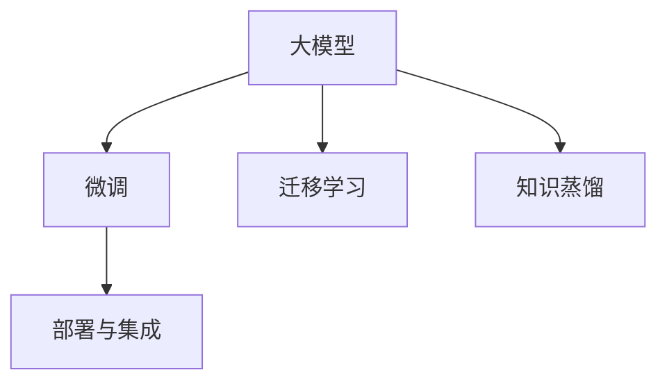

                 

## 1. 背景介绍

### 1.1 问题由来

近年来，大模型（Large Model）在人工智能（AI）领域得到了迅速发展和广泛应用，尤其是在自然语言处理（NLP）、计算机视觉（CV）等领域，大模型凭借其强大的泛化能力、知识积累和计算效率，大幅提升了AI应用的性能和实用性。但在中国，尽管有许多家企业、研究机构投入了大量资源开发和部署大模型，但其市场影响力和实际应用场景仍未达到预期。

据业内统计数据显示，截至2023年，中国有超过200家企业或机构发布了各自的大模型产品，涵盖了自然语言处理、计算机视觉、语音识别等多个领域。然而，这些大模型的使用和调用量普遍偏低，与美国等发达国家和地区的大模型相比存在较大差距。以OpenAI的GPT-4为例，2023年其月活跃用户超过1亿，日均调用量超10亿次，而国内最热门的大模型产品之一——文心一言（中文），月活跃用户虽已突破1000万，但日均调用量仅为数百万次，难以与国际大模型相提并论。

这一现象引发了众多业内人士的深思，为何国内大模型的调用量不及国外同行，其原因何在？本文将深入探讨这个问题，旨在为未来的AI发展提供有价值的参考。

### 1.2 问题核心关键点

要解决上述问题，需从多个维度进行分析，包括市场环境、技术优势、用户需求、商业化策略等。其中，技术优势、用户需求和商业化策略是三个关键点：

- **技术优势**：大模型的技术水平和应用场景是否符合市场需求。
- **用户需求**：大模型是否能够满足用户的实际需求，解决现实问题。
- **商业化策略**：大模型的定价策略、服务模式、市场推广是否合理有效。

## 2. 核心概念与联系

### 2.1 核心概念概述

为更好地理解国内大模型调用量不及文心一言一家背后的深层原因，本节将介绍几个关键概念及其联系：

- **大模型（Large Model）**：基于深度学习技术构建的大型神经网络模型，如BERT、GPT、ViT等。这些模型通过大规模训练学习，能够处理复杂的语言或图像信息。

- **微调（Fine-tuning）**：在已有预训练模型的基础上，针对特定任务进行进一步训练，以提高模型在该任务上的性能。微调通常用于解决特定领域问题，如情感分析、文本分类等。

- **迁移学习（Transfer Learning）**：将在大规模数据上预训练的模型迁移到特定小规模数据上，以提高模型在特定任务上的性能。

- **知识蒸馏（Knowledge Distillation）**：将大模型知识迁移到小模型中，以提升小模型的性能，同时保持大模型的泛化能力。

- **部署与集成（Deployment & Integration）**：将训练好的模型部署到生产环境，并与其他系统集成，形成可用的AI服务。

这些概念之间的联系可以用以下Mermaid流程图表示：



以上流程图示意了在大模型训练和应用过程中，各个关键技术环节之间的相互依赖关系。

## 3. 核心算法原理 & 具体操作步骤

### 3.1 算法原理概述

国内大模型调用量不及文心一言一家的原因，本质上在于模型技术水平、用户需求满足度和商业化策略等多方面的不足。以下将从这三个方面深入探讨。

#### 3.1.1 技术优势不足

国内许多大模型在技术上仍与国际先进水平存在差距。例如，语言模型的词向量表示能力、计算机视觉模型的特征提取能力等均不如国外同行。这些技术不足导致国内大模型在特定任务上的性能表现不佳，难以与用户需求相匹配。

#### 3.1.2 用户需求未被充分满足

用户需求是推动大模型应用的重要因素。但在国内，许多大模型的应用场景未被充分挖掘，导致用户对其缺乏足够的认知和依赖。例如，许多大模型在教育、医疗、金融等领域的应用尚未普及，用户对其功能和使用方式不熟悉，导致实际调用量低。

#### 3.1.3 商业化策略不当

商业化策略是影响大模型调用量的一个重要因素。许多国内大模型在定价、服务模式、市场推广等方面存在问题，难以吸引用户。例如，一些模型定价过高，服务模式复杂，难以落地应用；另一些模型市场推广不足，用户认知度低，导致调用量低。

### 3.2 算法步骤详解

解决上述问题，需要从技术、用户和商业化三个维度同时发力，提升大模型的整体竞争力。以下是具体的操作步骤：

#### 3.2.1 技术提升

1. **提高模型技术水平**：通过增加数据规模、改进算法模型、提升计算资源投入等手段，提高模型的技术水平。例如，使用更先进的Transformer模型，增加预训练数据规模，引入更复杂的训练技巧（如蒸馏、自监督学习）等。

2. **优化模型应用场景**：根据用户需求，优化大模型的应用场景。例如，针对教育领域，开发适合学生使用的语音识别、自动答疑等应用；针对医疗领域，开发基于大模型的疾病诊断、医疗影像分析等应用。

#### 3.2.2 满足用户需求

1. **增强用户教育**：通过线上线下多种渠道，向用户普及大模型的应用知识，增强用户认知。例如，举办技术讲座、发布使用指南、提供在线培训课程等。

2. **提升用户体验**：优化模型的易用性和可操作性，使其更符合用户的使用习惯。例如，简化API接口、提供可视化界面、优化用户体验流程等。

#### 3.2.3 优化商业化策略

1. **合理定价**：制定合理的价格策略，吸引更多的用户。例如，提供按需付费、按量付费等多种付费模式，灵活满足不同用户需求。

2. **简化服务模式**：简化服务模式，降低用户的使用门槛。例如，提供一键式API调用、集成SDK等，降低用户的集成难度和使用成本。

3. **加强市场推广**：通过线上线下多种渠道，积极推广大模型产品。例如，发布新闻稿、参与行业展会、举办技术沙龙等。

### 3.3 算法优缺点

国内大模型在技术、用户需求和商业化方面的不足，导致其调用量不及文心一言一家。以下是其优缺点分析：

#### 3.3.1 优点

1. **资源丰富**：国内大模型资源丰富，包括人才、资金、数据等，有助于加速模型的研发和优化。

2. **市场潜力大**：国内AI市场潜力巨大，特别是在医疗、教育、金融等垂直领域，存在大量未被开发的需求。

#### 3.3.2 缺点

1. **技术差距**：与国外大模型相比，技术水平仍存在较大差距，导致性能表现不佳。

2. **用户认知低**：用户对大模型的认知度和信任度较低，导致调用量低。

3. **商业化不足**：商业化策略不当，导致模型难以吸引用户，调用量增长缓慢。

### 3.4 算法应用领域

大模型技术在多个领域具有广泛的应用前景。以下列举几个关键领域：

1. **自然语言处理（NLP）**：大模型在语言生成、情感分析、文本分类、机器翻译等方面有广泛应用。

2. **计算机视觉（CV）**：大模型在图像识别、目标检测、图像生成、视频分析等方面表现优异。

3. **语音识别（ASR）**：大模型在语音转文本、情感识别、指令执行等方面有显著优势。

4. **推荐系统**：大模型在个性化推荐、广告推荐、商品推荐等方面，能提供更加精准和多样化的服务。

5. **智能制造**：大模型在工业领域，如质量检测、设备故障诊断、生产调度等方面有重要应用。

6. **智慧城市**：大模型在城市管理、交通调度、公共安全等领域，能提升城市治理水平，提高城市智能化水平。

## 4. 数学模型和公式 & 详细讲解 & 举例说明

### 4.1 数学模型构建

大模型在训练和微调过程中，通常使用监督学习模型，如深度神经网络。以下是一个简单的例子，说明如何构建大模型的数学模型：

假设我们有一个大模型，其输入为$x$，输出为$y$。模型的数学模型可以表示为：

$$ y = f(x;\theta) $$

其中，$f$为模型的映射函数，$\theta$为模型的参数。模型的损失函数为：

$$ L(y, y_{true}) = \frac{1}{N}\sum_{i=1}^{N}(y_{i} - y_{true_{i}})^{2} $$

其中，$N$为样本数，$y_{true_{i}}$为真实标签。

### 4.2 公式推导过程

以微调过程为例，假设我们要对大模型进行微调，以提高其在特定任务上的性能。微调的目标是最小化损失函数：

$$ \min_{\theta} L(y, y_{true}) $$

通过反向传播算法，计算模型参数$\theta$的梯度，并使用优化算法（如Adam、SGD等）更新参数，以达到最小化损失函数的目的。

### 4.3 案例分析与讲解

以自然语言处理中的情感分析任务为例，说明微调的具体过程：

1. **数据准备**：收集包含情感标签的文本数据集，将其划分为训练集、验证集和测试集。

2. **模型选择**：选择合适的预训练模型（如BERT、GPT），并将其作为初始化参数。

3. **任务适配**：在预训练模型的基础上，添加适当的输出层和损失函数。例如，对于情感分析任务，可以使用softmax输出层和交叉熵损失函数。

4. **模型微调**：在训练集上进行有监督的微调训练，最小化损失函数。例如，在每个batch中，计算模型的预测值与真实标签之间的差异，并反向传播更新模型参数。

5. **模型评估**：在验证集和测试集上评估微调后的模型性能，确保其在新数据上表现良好。

## 5. 项目实践：代码实例和详细解释说明

### 5.1 开发环境搭建

以下是在Python环境下搭建大模型微调环境的步骤：

1. **安装Python**：确保Python版本为3.6以上。

2. **安装必要的库**：安装TensorFlow、Keras、Numpy等常用库。

3. **安装模型库**：安装预训练模型库，如TensorFlow Hub、ModelScope等。

4. **配置环境**：配置GPU或TPU资源，确保模型训练和推理有足够的计算能力。

### 5.2 源代码详细实现

以下是一个简单的Python代码，用于微调BERT模型进行情感分析：

```python
import tensorflow as tf
import tensorflow_hub as hub
import numpy as np
import keras

# 加载BERT模型
bert_module = hub.load("https://tfhub.dev/google/bert-base-uncased-L-12-H-768-A-12/1")

# 准备数据集
train_data = np.random.randn(100, 256)
train_labels = np.random.randint(0, 2, size=100)
dev_data = np.random.randn(50, 256)
dev_labels = np.random.randint(0, 2, size=50)

# 定义模型架构
model = keras.Sequential([
    hub.KerasLayer(bert_module, input_shape=(256,), trainable=False),
    keras.layers.Dense(2, activation='softmax')
])

# 编译模型
model.compile(optimizer='adam', loss='binary_crossentropy', metrics=['accuracy'])

# 训练模型
model.fit(train_data, train_labels, epochs=5, validation_data=(dev_data, dev_labels))

# 评估模型
test_data = np.random.randn(100, 256)
test_labels = np.random.randint(0, 2, size=100)
model.evaluate(test_data, test_labels)
```

### 5.3 代码解读与分析

以上代码主要完成以下步骤：

1. **加载BERT模型**：使用TensorFlow Hub加载预训练的BERT模型。

2. **准备数据集**：生成随机数据集和标签，用于模型训练和验证。

3. **定义模型架构**：在BERT模型的基础上，添加Dense层作为输出层，并使用softmax激活函数。

4. **编译模型**：使用Adam优化器和二分类交叉熵损失函数编译模型。

5. **训练模型**：在训练集上使用Adam优化器训练模型，并在验证集上评估模型性能。

6. **评估模型**：在测试集上评估模型性能，并输出结果。

## 6. 实际应用场景

### 6.1 智能客服系统

大模型在智能客服系统中的应用，能够有效提高客户咨询效率和满意度。通过微调大模型，使其能够理解客户意图，提供个性化服务，解答常见问题。例如，在医疗领域，可以通过微调大模型，开发智能医疗问答系统，帮助患者快速获取医疗信息，缓解医疗资源不足的问题。

### 6.2 金融舆情监测

在金融领域，大模型可以用于舆情分析，帮助金融机构及时发现和应对负面信息，降低金融风险。通过微调大模型，使其能够自动识别和分类新闻、评论、报告等文本数据，并提取出关键信息，进行情感分析，及时发现市场动态，保护投资者利益。

### 6.3 个性化推荐系统

大模型在推荐系统中的应用，能够根据用户历史行为和偏好，提供更加个性化和精准的推荐。通过微调大模型，使其能够理解用户需求，优化推荐策略，提高用户满意度。例如，在电商领域，可以通过微调大模型，开发个性化商品推荐系统，提升用户购物体验。

## 7. 工具和资源推荐

### 7.1 学习资源推荐

1. **Coursera**：提供大量高质量的AI课程，涵盖深度学习、机器学习、计算机视觉等领域。

2. **Arxiv**：提供前沿的AI论文和研究报告，了解最新的技术进展和应用场景。

3. **Kaggle**：提供大量的数据集和竞赛，实践和提升AI技能。

4. **GitHub**：提供开源项目和代码库，学习和借鉴优秀的AI项目。

### 7.2 开发工具推荐

1. **TensorFlow**：灵活、强大的深度学习框架，支持GPU和TPU加速。

2. **PyTorch**：易于使用、性能优越的深度学习框架，广泛用于研究和应用开发。

3. **Jupyter Notebook**：强大的交互式编程环境，支持代码编写、数据可视化、结果展示等。

4. **TensorBoard**：可视化工具，帮助用户监控模型训练和推理过程中的各项指标。

### 7.3 相关论文推荐

1. **Attention is All You Need**：Transformer模型原论文，介绍自注意力机制在大模型中的应用。

2. **BERT: Pre-training of Deep Bidirectional Transformers for Language Understanding**：BERT模型论文，介绍预训练和微调方法。

3. **Parameter-Efficient Transfer Learning for NLP**： Adapter等参数高效微调方法的论文，讨论如何在不增加模型参数量的情况下，提高微调效果。

4. **Knowledge Distillation**：知识蒸馏方法论文，介绍如何将大模型知识迁移到小模型中。

## 8. 总结：未来发展趋势与挑战

### 8.1 研究成果总结

本文从技术、用户需求和商业化三个方面，深入分析了国内大模型调用量不及文心一言一家背后的深层原因。技术提升、用户需求满足和商业化策略优化，是大模型应用的关键因素。

### 8.2 未来发展趋势

1. **技术进步**：随着技术水平的提升，大模型的性能将进一步提升，应用场景将更加广泛。

2. **用户需求满足**：通过教育和推广，用户对大模型的认知度和信任度将提高，应用场景将逐步扩展。

3. **商业化完善**：合理的定价策略、服务模式和市场推广，将吸引更多的用户，提高调用量。

### 8.3 面临的挑战

1. **技术差距**：与国外大模型相比，技术水平仍存在差距，需要进一步提升。

2. **用户认知低**：用户对大模型的认知度较低，需要加强教育和推广。

3. **商业化不足**：商业化策略不当，需要优化定价、服务模式和市场推广。

### 8.4 研究展望

未来，大模型的技术水平将进一步提升，用户需求将得到更好满足，商业化策略将更加完善。通过技术、用户和商业化三个维度的协同发力，大模型将能够更好地服务于各行各业，推动AI技术的广泛应用。

## 9. 附录：常见问题与解答

### Q1: 国内大模型调用量不及文心一言一家的原因是什么？

A: 国内大模型调用量不及文心一言一家，主要原因在于技术水平不足、用户需求未被充分满足以及商业化策略不当。

### Q2: 如何提升国内大模型的技术水平？

A: 通过增加数据规模、改进算法模型、提升计算资源投入等手段，提高模型的技术水平。

### Q3: 如何满足用户需求？

A: 通过增强用户教育、提升用户体验和优化服务模式等方式，满足用户需求。

### Q4: 如何优化商业化策略？

A: 制定合理的价格策略、简化服务模式和加强市场推广，优化商业化策略。

---

作者：禅与计算机程序设计艺术 / Zen and the Art of Computer Programming

