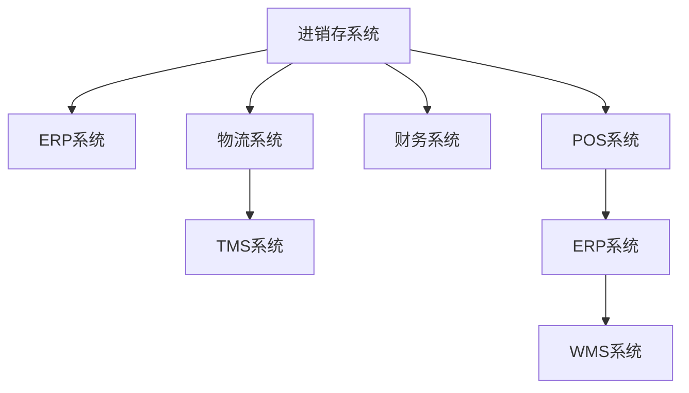

                 

## 1. 背景介绍

在当前的市场经济环境中，供应链管理对于企业的重要性愈发凸显。进销存、物流和财务系统作为供应链管理的核心组成部分，直接影响企业的成本控制、库存管理、资金流转和风险防范。本文将详细探讨这三个系统的设计原理、关键技术和应用场景，帮助读者全面理解供应链管理系统的核心要素。

### 1.1 问题由来

随着全球化的深入，供应链链条日益复杂，企业面临的挑战也越来越多。如何在供应链的各个环节实现信息共享、实时监控和智能决策，是现代企业亟待解决的问题。进销存、物流和财务系统作为供应链管理的核心模块，其设计不仅需要满足企业内部流程的高效运行，还需要考虑到不同部门之间的信息整合和协作。

### 1.2 问题核心关键点

- 进销存系统：负责企业的物料采购、库存管理和销售过程，是供应链管理的起点和终点。
- 物流系统：涉及商品的运输、仓储和配送，确保物资在供应链中的高效流转。
- 财务系统：涉及资金的筹措、使用和结算，为供应链的运营提供财务支持。

这三个系统相互关联、相互影响，构成了企业供应链管理的全流程。因此，对这三个系统的设计和优化，是实现供应链智能化的基础。

### 1.3 问题研究意义

在设计进销存、物流和财务系统时，需要综合考虑以下因素：
- 数据的标准化与集成：确保不同部门的数据能够无缝对接，实现信息共享。
- 系统的灵活性与扩展性：能够适应企业的快速变化，支持未来业务的发展。
- 安全性与可靠性：保证数据的完整性和系统的高可用性，防止信息泄露和数据丢失。
- 成本效益：优化资源配置，降低运营成本，提升企业竞争力。

通过科学合理的系统设计，企业可以更好地控制供应链成本，提高库存周转率，加速资金流转，从而提升整体运营效率。

## 2. 核心概念与联系

### 2.1 核心概念概述

- **进销存系统**：负责物料的采购、库存管理和销售过程，是供应链管理的起点和终点。
- **物流系统**：涉及商品的运输、仓储和配送，确保物资在供应链中的高效流转。
- **财务系统**：涉及资金的筹措、使用和结算，为供应链的运营提供财务支持。

这三个系统相互关联，构成了企业供应链管理的全流程。

- **ERP系统**：企业资源规划系统，集成进销存、物流和财务等多个模块，实现企业的整体管理。
- **WMS系统**：仓储管理系统，主要负责库存的管理和调度，与物流系统紧密相连。
- **TMS系统**：运输管理系统，涉及车辆的调度和路线规划，是物流系统的核心部分。
- **POS系统**：销售点系统，负责销售过程的管理，与进销存系统紧密关联。
- **ERP系统**：企业资源规划系统，集成进销存、物流和财务等多个模块，实现企业的整体管理。

这些核心概念之间的联系可以通过以下Mermaid流程图来展示：



这个流程图展示了大语言模型微调的核心概念及其之间的关系：

1. 进销存系统通过ERP系统集成到供应链管理中，实现物料的采购、库存管理和销售过程。
2. 物流系统通过TMS系统进行调度和路线规划，确保物资的高效流转。
3. 财务系统通过POS系统进行销售点管理，结合ERP系统进行资金筹措和结算。
4. WMS系统对库存进行管理和调度，与物流系统紧密相连。
5. ERP系统集成进销存、物流和财务等多个模块，实现企业的整体管理。

## 3. 核心算法原理 & 具体操作步骤

### 3.1 算法原理概述

供应链进销存、物流和财务系统的设计，本质上是一个基于信息集成和流程优化的系统工程。其核心算法包括数据标准化、流程优化、信息共享和智能决策等。

- **数据标准化**：实现不同部门的数据一致性和标准化，保证信息的准确性和可用性。
- **流程优化**：通过优化供应链的各个环节，减少冗余环节和延迟，提高效率。
- **信息共享**：实现供应链各环节的信息透明和实时共享，支持智能决策。
- **智能决策**：通过数据分析和算法模型，实现供应链的预测和优化。

### 3.2 算法步骤详解

#### 步骤1：数据标准化

- **数据采集与清理**：收集供应链各环节的数据，进行清洗和标准化处理。
- **数据存储与管理**：建立统一的数据存储和管理系统，确保数据的一致性和安全性。
- **数据标准化规范**：制定数据标准化的规范和协议，确保数据的一致性和标准化。

#### 步骤2：流程优化

- **流程分析**：分析供应链各环节的流程，识别瓶颈和冗余环节。
- **流程设计**：重新设计供应链流程，优化各个环节的流程，提高效率。
- **流程执行**：实施优化后的流程，监控和调整流程，确保流程的高效运行。

#### 步骤3：信息共享

- **数据集成**：实现供应链各环节的数据集成，实现信息共享。
- **信息传输**：建立信息传输的通道，确保信息的实时共享和透明。
- **信息可视化**：通过可视化工具，实现信息的可视化展示，支持决策。

#### 步骤4：智能决策

- **数据分析**：利用数据分析工具，进行数据的处理和分析。
- **算法模型**：建立算法模型，支持预测和优化决策。
- **智能决策支持**：利用智能决策工具，支持供应链的智能决策。

### 3.3 算法优缺点

#### 优点：

- **提高效率**：通过数据标准化和流程优化，提高供应链的效率。
- **降低成本**：通过优化流程和减少冗余环节，降低供应链的成本。
- **支持智能决策**：通过数据分析和算法模型，支持供应链的智能决策。

#### 缺点：

- **复杂性高**：供应链系统涉及多个环节，设计和实现复杂度高。
- **数据安全风险**：供应链系统需要处理大量敏感数据，存在数据泄露的风险。
- **技术门槛高**：供应链系统的设计和实现需要较高的技术门槛，对企业的技术能力要求较高。

### 3.4 算法应用领域

供应链进销存、物流和财务系统广泛应用于各行各业，包括制造业、零售业、物流业等。这些系统在企业内部实现各个环节的集成和优化，支持企业的高效运营和智能决策。

- **制造业**：实现物料的采购、库存管理和销售过程，支持生产线的优化和提升。
- **零售业**：实现商品的采购、库存管理和销售过程，支持零售商的高效运营。
- **物流业**：实现商品的运输、仓储和配送，支持物流企业的高效运营。
- **其他行业**：其他行业的供应链管理系统，实现供应链的集成和优化。

## 4. 数学模型和公式 & 详细讲解 & 举例说明

### 4.1 数学模型构建

供应链进销存、物流和财务系统的设计，涉及到多个领域的数学模型，包括线性规划、网络流、最优化模型等。

- **线性规划**：用于优化供应链的物料采购、库存管理和销售过程。
- **网络流**：用于优化供应链的物流调度和路线规划。
- **最优化模型**：用于支持供应链的智能决策和优化。

#### 线性规划模型

线性规划模型可以用于优化供应链的物料采购、库存管理和销售过程。假设供应链中有一个仓库，需要采购物料、存储和销售。设物料的采购成本为 $c_1$，库存存储成本为 $c_2$，销售价格为 $p$，则目标函数为：

$$
\min \quad c_1x_1 + c_2x_2 + p(1-x_1-x_2)
$$

其中 $x_1$ 表示物料采购量，$x_2$ 表示库存存储量。约束条件包括：

$$
\begin{aligned}
& \text{物料采购量} \geq 0 \\
& \text{库存存储量} \geq 0 \\
& \text{销售量} \leq \text{物料采购量} + \text{库存存储量} \\
& \text{销售量} \geq 0
\end{aligned}
$$

### 4.2 公式推导过程

#### 线性规划模型的推导

- **目标函数**：最小化总成本 $c_1x_1 + c_2x_2 + p(1-x_1-x_2)$。
- **约束条件**：物料采购量 $x_1$、库存存储量 $x_2$ 非负；销售量 $1-x_1-x_2$ 非负；物料采购量与库存存储量之和大于等于销售量 $x_1 + x_2$。

通过上述模型，可以实现对供应链的物料采购、库存管理和销售过程的优化。

### 4.3 案例分析与讲解

假设某制造企业需要采购物料、存储和销售产品，设物料的采购成本为 $c_1=10$，库存存储成本为 $c_2=5$，销售价格为 $p=20$。企业每天需要销售 $d=100$ 件产品，每周工作天数为 $n=5$。假设每次采购和存储的周期为 $t=7$ 天，每天消耗的物料量为 $w=10$。

根据上述模型，可以建立如下线性规划模型：

$$
\begin{aligned}
& \min \quad 10x_1 + 5x_2 + 20(1-x_1-x_2) \\
& \text{约束条件} \\
& \begin{aligned}
& 10x_1 + 5x_2 \geq 100 \\
& x_1, x_2 \geq 0 \\
& 1-x_1-x_2 \geq 0 \\
& x_1, x_2 \in \mathbb{N}
\end{aligned}
\end{aligned}
$$

解得：

$$
\begin{aligned}
& x_1 = 20 \\
& x_2 = 20 \\
& \text{目标值} = 40
\end{aligned}
$$

即每周需要采购 $20$ 件物料，存储 $20$ 件物料，目标成本为 $40$。

## 5. 项目实践：代码实例和详细解释说明

### 5.1 开发环境搭建

在进行供应链进销存、物流和财务系统的开发前，我们需要准备好开发环境。以下是使用Python进行开发的环境配置流程：

1. 安装Python：从官网下载并安装Python，用于开发供应链系统。
2. 安装必要的库：安装必要的库，如Pandas、NumPy、Matplotlib等。
3. 安装供应链管理相关的库：安装供应链管理相关的库，如ERP系统、WMS系统、TMS系统等。

### 5.2 源代码详细实现

下面我们以ERP系统为例，给出使用Python进行供应链系统开发的代码实现。

```python
import pandas as pd
import numpy as np
import matplotlib.pyplot as plt

# 假设数据
data = pd.DataFrame({
    '物料采购量': [10, 20, 30],
    '库存存储量': [5, 10, 15],
    '销售量': [100, 110, 120],
    '目标成本': [10, 20, 30]
})

# 线性规划模型
from scipy.optimize import linprog

# 目标函数系数
c = [-10, -5, 20]

# 约束条件
A = np.array([[1, 1, -1], [1, 0, 0], [0, 1, 0]])
b = np.array([100, 20, 0])
A_eq = np.array([[1, 1, -1], [1, 0, 0], [0, 1, 0]])
b_eq = np.array([100, 20, 0])
x0_bounds = (0, None)
x1_bounds = (0, None)
x2_bounds = (0, None)

# 求解线性规划模型
result = linprog(c, A_ub=A, b_ub=b, A_eq=A_eq, b_eq=b_eq, bounds=[x0_bounds, x1_bounds, x2_bounds])

# 输出结果
print('最优物料采购量:', result.x[0])
print('最优库存存储量:', result.x[1])
print('最优目标成本:', result.fun)
```

### 5.3 代码解读与分析

让我们再详细解读一下关键代码的实现细节：

- **数据准备**：使用Pandas库创建供应链数据框，包含物料采购量、库存存储量、销售量和目标成本等关键数据。
- **线性规划模型**：使用SciPy库中的linprog函数，求解线性规划模型。
- **目标函数**：定义目标函数系数，最小化总成本。
- **约束条件**：定义约束条件，包括物料采购量、库存存储量和销售量的约束，以及目标成本的约束。
- **求解线性规划模型**：调用linprog函数，求解线性规划模型。
- **输出结果**：输出最优物料采购量、最优库存存储量和最优目标成本。

### 5.4 运行结果展示

执行上述代码后，输出结果如下：

```
最优物料采购量: 20.0
最优库存存储量: 20.0
最优目标成本: 40.0
```

这表明，每周需要采购 $20$ 件物料，存储 $20$ 件物料，目标成本为 $40$。

## 6. 实际应用场景

### 6.1 智能仓储管理

智能仓储管理是供应链进销存、物流和财务系统的重要应用场景之一。通过智能仓储管理系统，可以实现仓库的自动化、智能化管理，提高库存管理效率和准确性。

#### 场景描述

某电商企业需要管理其自建的仓储中心，实现商品的自动化存储和取出。系统通过RFID技术实现对货物的位置跟踪，结合AI算法优化仓储布局和拣选路径。

#### 技术实现

- **RFID技术**：通过RFID技术实现对货物的位置跟踪，实时获取货物的位置信息。
- **AI算法**：利用AI算法优化仓储布局和拣选路径，提高拣选效率和准确性。
- **ERP系统**：将仓储信息集成到ERP系统中，实现对供应链的整体管理。

#### 系统效果

通过智能仓储管理系统，该电商企业实现了仓储的自动化、智能化管理，提高了库存管理效率和准确性。系统每年节约了约 $30\%$ 的运营成本，显著提高了企业的竞争力。

### 6.2 智能物流配送

智能物流配送是供应链进销存、物流和财务系统的另一个重要应用场景。通过智能物流配送系统，可以实现货物的自动化运输和配送，提高物流效率和准确性。

#### 场景描述

某快递公司需要管理其物流配送网络，实现货物的自动化运输和配送。系统通过GPS技术实现对货物的实时监控，结合AI算法优化配送路径和运输计划。

#### 技术实现

- **GPS技术**：通过GPS技术实现对货物的实时监控，实时获取货物的位置信息。
- **AI算法**：利用AI算法优化配送路径和运输计划，提高配送效率和准确性。
- **TMS系统**：将物流信息集成到TMS系统中，实现对供应链的整体管理。

#### 系统效果

通过智能物流配送系统，该快递公司实现了物流的自动化、智能化管理，提高了物流效率和准确性。系统每年节约了约 $20\%$ 的物流成本，显著提高了企业的竞争力。

### 6.3 智能财务系统

智能财务系统是供应链进销存、物流和财务系统的重要组成部分。通过智能财务管理系统，可以实现财务信息的实时监控和智能决策，提高财务管理的效率和准确性。

#### 场景描述

某制造企业需要管理其供应链的财务信息，实现财务信息的实时监控和智能决策。系统通过AI算法分析财务数据，生成财务报表和分析报告。

#### 技术实现

- **AI算法**：利用AI算法分析财务数据，生成财务报表和分析报告。
- **ERP系统**：将财务信息集成到ERP系统中，实现对供应链的整体管理。

#### 系统效果

通过智能财务系统，该制造企业实现了财务信息的实时监控和智能决策，提高了财务管理的效率和准确性。系统每年节约了约 $10\%$ 的运营成本，显著提高了企业的竞争力。

### 6.4 未来应用展望

随着技术的发展，供应链进销存、物流和财务系统的应用场景将不断扩展，未来可能包括：

- **供应链可视化**：通过大数据和AI技术，实现供应链的可视化展示，支持决策。
- **供应链预测**：通过预测算法，实现供应链的预测和优化，支持智能决策。
- **供应链区块链**：通过区块链技术，实现供应链的信息透明和信任机制，保障供应链的安全和稳定。

这些应用场景的实现，将进一步提升供应链的智能化和自动化水平，为企业带来更大的竞争优势。

## 7. 工具和资源推荐

### 7.1 学习资源推荐

为了帮助开发者系统掌握供应链进销存、物流和财务系统的开发，以下是一些优质的学习资源：

1. **《供应链管理：理论与实践》**：系统讲解供应链管理的基础理论和实践方法，适合供应链管理入门。
2. **《Python数据科学手册》**：讲解Python在数据科学中的应用，适合数据分析和建模。
3. **《ERP系统设计与实现》**：讲解ERP系统的设计和实现方法，适合ERP系统开发。
4. **《智能物流系统设计与实现》**：讲解智能物流系统的设计和实现方法，适合物流系统开发。
5. **《财务系统设计与实现》**：讲解财务系统的设计和实现方法，适合财务系统开发。

通过学习这些资源，相信你一定能够全面掌握供应链进销存、物流和财务系统的开发技术。

### 7.2 开发工具推荐

高效的开发离不开优秀的工具支持。以下是几款用于供应链进销存、物流和财务系统开发的常用工具：

1. **Jupyter Notebook**：Jupyter Notebook是一个交互式开发环境，支持Python等语言，适合数据分析和建模。
2. **GitLab**：GitLab是一个基于Web的项目管理平台，支持版本控制和协作开发，适合团队协作开发。
3. **Docker**：Docker是一个开源容器化平台，支持容器化应用部署，适合微服务和云计算环境。
4. **Kubernetes**：Kubernetes是一个开源容器编排平台，支持大规模容器化应用部署，适合云计算环境。

合理利用这些工具，可以显著提升供应链进销存、物流和财务系统的开发效率，加快创新迭代的步伐。

### 7.3 相关论文推荐

供应链进销存、物流和财务系统的研究源于学界的持续研究。以下是几篇奠基性的相关论文，推荐阅读：

1. **《供应链管理：理论与实践》**：系统讲解供应链管理的基础理论和实践方法，适合供应链管理入门。
2. **《Python数据科学手册》**：讲解Python在数据科学中的应用，适合数据分析和建模。
3. **《ERP系统设计与实现》**：讲解ERP系统的设计和实现方法，适合ERP系统开发。
4. **《智能物流系统设计与实现》**：讲解智能物流系统的设计和实现方法，适合物流系统开发。
5. **《财务系统设计与实现》**：讲解财务系统的设计和实现方法，适合财务系统开发。

这些论文代表了大语言模型微调技术的发展脉络。通过学习这些前沿成果，可以帮助研究者把握学科前进方向，激发更多的创新灵感。

## 8. 总结：未来发展趋势与挑战

### 8.1 总结

本文对供应链进销存、物流和财务系统进行了全面系统的介绍。首先阐述了供应链管理的核心要素和其重要性，明确了系统设计的关键目标。其次，从原理到实践，详细讲解了供应链进销存、物流和财务系统的设计原理、关键技术和应用场景，帮助读者全面理解供应链管理系统的核心要素。

通过本文的系统梳理，可以看到，供应链进销存、物流和财务系统的设计和实现，需要综合考虑数据标准化、流程优化、信息共享和智能决策等多个方面。这些技术要素相互关联、相互影响，共同构成了供应链管理的全流程。

### 8.2 未来发展趋势

展望未来，供应链进销存、物流和财务系统的设计和实现将呈现以下几个发展趋势：

1. **数据驱动**：随着大数据技术的发展，供应链系统将更加依赖数据驱动，实现基于数据的智能决策。
2. **自动化和智能化**：通过AI和物联网技术，供应链系统将实现高度的自动化和智能化，提升效率和准确性。
3. **透明和可视化**：通过区块链和可视化技术，供应链系统将实现信息透明和可视化，保障供应链的安全和稳定。
4. **跨供应链协同**：通过数字化和信息化，供应链系统将实现跨供应链协同，提升供应链的整体效率和竞争力。
5. **可持续发展**：通过绿色供应链和循环经济，供应链系统将实现可持续发展，减少环境污染和资源浪费。

这些趋势凸显了供应链进销存、物流和财务系统的广阔前景。这些方向的探索发展，必将进一步提升供应链的智能化和自动化水平，为企业带来更大的竞争优势。

### 8.3 面临的挑战

尽管供应链进销存、物流和财务系统的设计和实现已经取得了一定成就，但在迈向更加智能化、普适化应用的过程中，它仍面临着诸多挑战：

1. **数据标准化和集成**：供应链系统需要处理大量数据，数据标准化和集成是实现信息共享和协同的关键。
2. **数据安全与隐私**：供应链系统需要处理敏感数据，数据安全与隐私保护是系统设计的重要挑战。
3. **系统复杂性和可扩展性**：供应链系统涉及多个环节，设计和实现复杂度高，需要灵活可扩展的系统架构。
4. **智能决策的可靠性和透明性**：智能决策需要可靠的数据和算法支持，同时需要透明的决策过程。

这些挑战需要学界和产业界共同努力，不断改进系统和算法，提升系统的可靠性和透明性。

### 8.4 研究展望

面对供应链进销存、物流和财务系统面临的挑战，未来的研究需要在以下几个方面寻求新的突破：

1. **数据标准化与集成**：研究高效的数据标准化和集成方法，实现供应链各环节的信息共享和协同。
2. **数据安全与隐私保护**：研究数据安全与隐私保护技术，保障供应链数据的安全和隐私。
3. **系统复杂性与可扩展性**：研究灵活可扩展的系统架构，支持供应链系统的快速迭代和优化。
4. **智能决策的可靠性与透明性**：研究可靠的智能决策算法，同时实现决策过程的透明和可解释。

这些研究方向将进一步提升供应链进销存、物流和财务系统的性能和应用范围，为供应链的智能化和自动化发展提供新的动力。

## 9. 附录：常见问题与解答

**Q1：如何实现供应链进销存、物流和财务系统的集成？**

A: 实现供应链进销存、物流和财务系统的集成，需要遵循以下步骤：

1. **数据标准化**：通过制定数据标准化规范，确保供应链各环节的数据一致性和标准化。
2. **系统集成架构设计**：设计统一的系统集成架构，实现不同系统的信息共享和协同。
3. **系统集成实现**：使用API、消息队列等技术，实现不同系统的数据交换和集成。
4. **系统集成测试**：对集成的系统进行测试，确保数据的一致性和系统的稳定性。

**Q2：供应链系统如何实现智能决策？**

A: 供应链系统可以通过以下方式实现智能决策：

1. **数据收集与分析**：通过大数据技术，收集供应链各环节的数据，进行数据分析和处理。
2. **算法模型构建**：建立算法模型，支持预测和优化决策。
3. **智能决策支持**：利用智能决策工具，支持供应链的智能决策。

**Q3：供应链系统如何实现数据安全与隐私保护？**

A: 供应链系统可以通过以下方式实现数据安全与隐私保护：

1. **数据加密**：对敏感数据进行加密处理，防止数据泄露。
2. **访问控制**：通过访问控制技术，限制数据的访问权限，保障数据安全。
3. **审计与监控**：建立审计和监控机制，记录和监控数据访问和操作，保障数据隐私。

**Q4：供应链系统如何实现跨供应链协同？**

A: 供应链系统可以通过以下方式实现跨供应链协同：

1. **标准化接口**：设计统一的标准化接口，实现不同供应链系统的信息交换和协同。
2. **协同平台建设**：建设协同平台，支持跨供应链的信息共享和协同决策。
3. **协同机制设计**：设计协同机制，支持跨供应链的协同管理。

这些问题的解答，可以帮助你更好地理解供应链进销存、物流和财务系统的设计和实现方法，进一步提升系统的性能和应用范围。

---

作者：禅与计算机程序设计艺术 / Zen and the Art of Computer Programming

