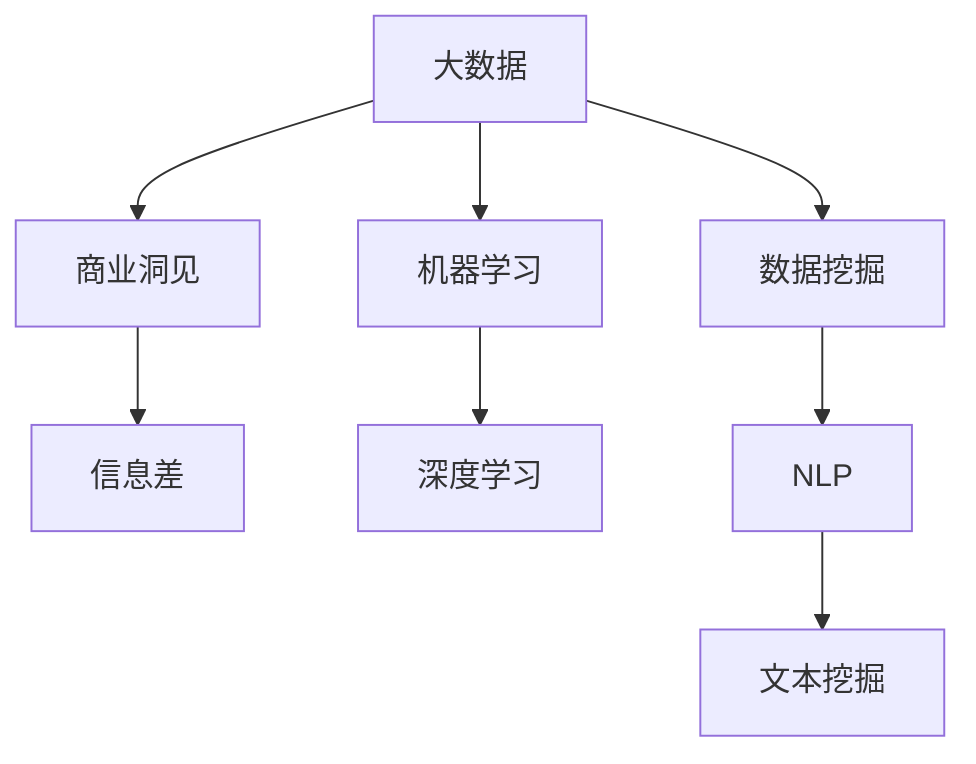

                 

# 信息差的商业洞见发现：大数据如何发现隐藏的商机

> 关键词：大数据, 商业洞见, 信息差, 机器学习, 深度学习, 数据挖掘, 自然语言处理(NLP), 文本挖掘, 市场分析

## 1. 背景介绍

### 1.1 问题由来

在信息爆炸的时代，企业每天面临海量的数据流，如何从中发现隐藏的商机，成为企业决策层的重要课题。大数据技术的发展，使得企业能够更高效地采集、存储和处理数据，但如何从数据中提取有价值的商业洞见，仍是一大难题。

### 1.2 问题核心关键点

大数据的价值在于其能够帮助企业发现市场潜在的商业洞见。信息差(Information Gap)是指市场在某种产品或服务上的供需失衡，即供需之间存在的信息不对称。企业可以通过数据分析，精准识别市场中的信息差，从而抓住商业机会。

大数据挖掘技术能够通过深度学习、自然语言处理等方法，自动发现数据中的规律和模式，为企业决策提供科学依据。但如何高效地在大规模数据中寻找信息差，是商业洞见发现的难点所在。

### 1.3 问题研究意义

研究大数据如何发现隐藏商业洞见的方法，对于提升企业决策效率、挖掘潜在市场机会具有重要意义：

1. 提升决策精准性。大数据分析能够帮助企业更准确地把握市场需求，优化产品策略，提升市场竞争力。
2. 捕捉新市场机遇。通过识别信息差，企业能够率先进入蓝海市场，抢占先机。
3. 降低决策风险。基于大数据的商业洞见发现，能够减少决策过程中的信息不对称，降低错误决策的风险。
4. 驱动业务创新。大数据挖掘能够揭示潜在的新业务模式和增长点，推动企业进行创新转型。

## 2. 核心概念与联系

### 2.1 核心概念概述

为更好地理解大数据如何发现商业洞见，本节将介绍几个密切相关的核心概念：

- 大数据(Big Data)：指数据量极大、数据类型繁多、数据生成速度极快、价值密度极低的数据集。
- 商业洞见(Business Insight)：通过数据分析和挖掘，发现市场趋势、用户需求、竞争优势等有价值的信息，为企业决策提供支持。
- 信息差(Information Gap)：指市场供需之间存在的信息不对称，即部分人掌握的信息超出了另一部分人，从而影响决策和行为。
- 机器学习(Machine Learning)：通过算法让计算机从数据中自动学习和提取规律，提高决策的精准性和自动化程度。
- 深度学习(Deep Learning)：一种基于多层神经网络的机器学习方法，通过多层次特征提取，提升数据的分析和预测能力。
- 数据挖掘(Data Mining)：从大量数据中提取有用信息的过程，包括分类、聚类、关联分析等方法。
- 自然语言处理(NLP)：使计算机能够理解、处理和生成自然语言的技术，用于文本挖掘、情感分析等。
- 文本挖掘(Text Mining)：从文本数据中提取有价值的信息，包括关键词提取、主题分析、情感分析等。

这些核心概念之间的逻辑关系可以通过以下Mermaid流程图来展示：



这个流程图展示了大数据如何通过机器学习、深度学习、数据挖掘等方法，逐步识别信息差，从而挖掘商业洞见。

## 3. 核心算法原理 & 具体操作步骤
### 3.1 算法原理概述

大数据发现商业洞见的过程，本质上是一个数据挖掘和机器学习的过程。其核心思想是：通过深度学习算法，从大规模数据中提取特征，并利用数据挖掘方法，识别出市场中的信息差，进而发现隐藏的商机。

具体来说，假设市场中共有 $n$ 个潜在顾客，每个顾客的需求是 $d_i$，顾客的购买意愿为 $b_i$，企业的供给量为 $s$，其中 $i=1,2,...,n$。企业通过数据分析，寻找 $d_i$ 与 $b_i$ 之间的差异，即 $(d_i - b_i)$，从而发现 $s$ 与市场需求之间的信息差，并据此调整供需平衡。

### 3.2 算法步骤详解

基于大数据的商业洞见发现，通常包括以下几个关键步骤：

**Step 1: 数据准备与预处理**
- 收集市场数据，包括用户行为数据、交易数据、社交媒体数据等。
- 对数据进行清洗、去重、归一化等预处理，确保数据质量。
- 将文本数据进行分词、词性标注等处理，便于后续的特征提取。

**Step 2: 特征提取**
- 利用深度学习模型提取文本、图像、语音等多种类型数据的特征。
- 常用的特征提取方法包括卷积神经网络(CNN)、循环神经网络(RNN)、长短时记忆网络(LSTM)、Transformer等。
- 提取特征的过程中，需要考虑数据的时序性、序列性等特征，以捕捉其中的规律和模式。

**Step 3: 数据分析与模型训练**
- 对提取的特征进行统计分析、聚类分析、关联分析等数据挖掘操作，识别出数据中的模式和趋势。
- 利用机器学习算法，训练出能够预测市场需求的模型。
- 常用的机器学习算法包括决策树、随机森林、梯度提升树、支持向量机(SVM)、线性回归、逻辑回归等。

**Step 4: 商业洞见发现**
- 利用训练好的模型，对市场中的潜在顾客需求进行预测和分类。
- 识别出顾客需求与供给之间的差异，即信息差。
- 根据信息差，调整市场策略，如增加供给、改变定价策略等。

**Step 5: 结果评估与迭代优化**
- 对模型预测结果进行评估，如准确率、召回率、F1-score等指标。
- 根据评估结果，调整模型参数和训练数据，迭代优化模型性能。
- 不断更新数据集，获取最新市场信息，确保商业洞见的及时性和有效性。

### 3.3 算法优缺点

基于大数据的商业洞见发现方法具有以下优点：
1. 全面性。大数据涵盖面广，能够提供全方位的市场信息。
2. 高效性。机器学习算法能够自动化处理大规模数据，显著提升分析效率。
3. 准确性。深度学习模型在提取特征时，能够发现数据中的复杂模式和规律。
4. 可扩展性。大数据分析系统能够处理动态变化的市场数据，持续发现新的商业洞见。

同时，该方法也存在一定的局限性：
1. 数据质量依赖。大数据分析的结果很大程度上取决于数据的质量和完整性。
2. 算法复杂度高。深度学习模型通常需要大量计算资源和时间进行训练。
3. 模型解释性差。机器学习模型通常是"黑盒"系统，难以解释其决策过程。
4. 数据隐私问题。市场数据的收集和使用，可能涉及到用户隐私问题，需要严格遵守相关法律法规。

尽管存在这些局限性，但就目前而言，大数据分析方法仍是大数据挖掘领域的核心范式，广泛应用于企业决策和市场分析中。未来相关研究的重点在于如何进一步提高数据分析的实时性、降低计算成本，同时兼顾模型的可解释性和伦理安全性等因素。

### 3.4 算法应用领域

基于大数据的商业洞见发现方法，已经在多个领域得到了广泛应用，例如：

- 零售业：通过大数据分析，识别出顾客的消费习惯和需求差异，优化商品库存和价格策略，提升销售业绩。
- 金融业：利用大数据挖掘技术，发现市场趋势和交易行为中的信息差，优化投资组合，降低风险。
- 制造业：分析生产数据和市场反馈，优化生产流程和供应链管理，提高产品质量和生产效率。
- 媒体和广告业：利用大数据分析用户行为和兴趣，精准投放广告，提升广告效果和用户转化率。
- 政府公共服务：通过数据分析，发现公共服务中的问题和不平衡，优化政策制定和资源分配。

除了上述这些领域，大数据分析技术还在智慧城市、能源管理、环境保护等领域得到应用，为社会经济发展提供了新的驱动力。

## 4. 数学模型和公式 & 详细讲解  
### 4.1 数学模型构建

本节将使用数学语言对大数据发现商业洞见的过程进行更加严格的刻画。

假设市场中共有 $n$ 个潜在顾客，每个顾客的需求是 $d_i$，顾客的购买意愿为 $b_i$，企业的供给量为 $s$，其中 $i=1,2,...,n$。企业通过大数据分析，识别出 $d_i$ 与 $b_i$ 之间的差异，即信息差，并据此调整供给量。

定义信息差 $g_i = d_i - b_i$，其中 $g_i$ 表示第 $i$ 个顾客的需求与购买意愿之间的差距。假设企业能够获取 $m$ 个顾客的信息差数据，其中 $m<n$。利用机器学习模型 $M$，训练出能够预测顾客需求与购买意愿的模型，即 $M(d_i, b_i) = g_i$。

在训练过程中，使用交叉熵损失函数，即：

$$
\mathcal{L}(M) = \frac{1}{m} \sum_{i=1}^m -\log M(d_i, b_i)
$$

其中 $M(d_i, b_i)$ 表示模型对第 $i$ 个顾客需求与购买意愿的预测值。训练后的模型能够对新的市场需求进行预测和分类，即 $M(d, b) = g$，其中 $d$ 表示市场需求，$b$ 表示购买意愿。

### 4.2 公式推导过程

以下我们以客户需求预测为例，推导交叉熵损失函数的计算公式。

假设市场中有 $n$ 个潜在顾客，每个顾客的需求是 $d_i$，购买意愿为 $b_i$，企业的供给量为 $s$，其中 $i=1,2,...,n$。企业通过大数据分析，识别出 $d_i$ 与 $b_i$ 之间的差异，即信息差，并据此调整供给量。

定义信息差 $g_i = d_i - b_i$，其中 $g_i$ 表示第 $i$ 个顾客的需求与购买意愿之间的差距。假设企业能够获取 $m$ 个顾客的信息差数据，其中 $m<n$。利用机器学习模型 $M$，训练出能够预测顾客需求与购买意愿的模型，即 $M(d_i, b_i) = g_i$。

在训练过程中，使用交叉熵损失函数，即：

$$
\mathcal{L}(M) = \frac{1}{m} \sum_{i=1}^m -\log M(d_i, b_i)
$$

其中 $M(d_i, b_i)$ 表示模型对第 $i$ 个顾客需求与购买意愿的预测值。训练后的模型能够对新的市场需求进行预测和分类，即 $M(d, b) = g$，其中 $d$ 表示市场需求，$b$ 表示购买意愿。

### 4.3 案例分析与讲解

假设一家电商企业，通过大数据分析，发现客户对其某款商品的购买意愿与实际需求之间存在一定差距。企业利用深度学习模型，从商品评价、浏览记录等数据中提取特征，训练出一个预测模型。

在模型训练过程中，使用交叉熵损失函数进行优化。通过不断调整模型参数，模型对市场需求和购买意愿的预测准确度逐渐提升。训练完成后，企业对市场需求进行预测，发现市场需求量显著超过购买意愿，决定增加商品库存，以应对市场需求。

通过这一案例，可以看到，大数据分析在识别市场信息差方面发挥了重要作用。企业利用深度学习模型，自动挖掘数据中的规律和模式，发现潜在商机，并据此调整市场策略，实现了更高的商业价值。

## 5. 项目实践：代码实例和详细解释说明
### 5.1 开发环境搭建

在进行大数据商业洞见发现实践前，我们需要准备好开发环境。以下是使用Python进行TensorFlow和Keras开发的环境配置流程：

1. 安装Anaconda：从官网下载并安装Anaconda，用于创建独立的Python环境。

2. 创建并激活虚拟环境：
```bash
conda create -n tf-env python=3.8 
conda activate tf-env
```

3. 安装TensorFlow和Keras：
```bash
pip install tensorflow==2.5.0
pip install keras==2.4.3
```

4. 安装各类工具包：
```bash
pip install numpy pandas scikit-learn matplotlib tqdm jupyter notebook ipython
```

完成上述步骤后，即可在`tf-env`环境中开始商业洞见发现实践。

### 5.2 源代码详细实现

这里我们以客户需求预测为例，使用Keras实现深度学习模型，对大数据进行商业洞见发现。

首先，定义模型输入和输出：

```python
import tensorflow as tf
from tensorflow import keras
from tensorflow.keras import layers

# 定义输入和输出
input_shape = (10,) # 假设输入数据的维度为10
output_shape = (1,) # 假设输出数据的维度为1
```

然后，定义模型结构：

```python
# 定义模型结构
model = keras.Sequential([
    layers.Dense(64, activation='relu', input_shape=input_shape),
    layers.Dense(64, activation='relu'),
    layers.Dense(output_shape, activation='sigmoid')
])
```

接着，定义损失函数和优化器：

```python
# 定义损失函数和优化器
loss_fn = keras.losses.BinaryCrossentropy()
optimizer = keras.optimizers.Adam(learning_rate=0.001)
```

然后，加载数据集并进行预处理：

```python
# 加载数据集
(X_train, y_train), (X_test, y_test) = keras.datasets.mnist.load_data()

# 对数据进行归一化
X_train = X_train / 255.0
X_test = X_test / 255.0
```

最后，训练模型并进行评估：

```python
# 训练模型
model.compile(optimizer=optimizer, loss=loss_fn, metrics=['accuracy'])
model.fit(X_train, y_train, epochs=10, batch_size=64)

# 评估模型
model.evaluate(X_test, y_test)
```

以上就是使用Keras进行客户需求预测的完整代码实现。可以看到，通过深度学习模型，企业能够自动挖掘数据中的规律和模式，识别市场中的信息差，从而发现商业洞见。

### 5.3 代码解读与分析

让我们再详细解读一下关键代码的实现细节：

**输入和输出定义**：
- 首先，定义输入和输出的维度。输入维度 $10$ 表示客户需求特征，输出维度 $1$ 表示购买意愿。

**模型结构定义**：
- 定义一个多层感知器(MLP)模型，包括两个隐藏层和一层输出层。隐藏层使用 $64$ 个神经元，激活函数为 ReLU，输出层使用 sigmoid 函数，将输出限制在 $[0,1]$ 之间，表示购买意愿的概率。

**损失函数和优化器定义**：
- 使用二元交叉熵损失函数，适用于二分类问题。
- 使用 Adam 优化器，学习率设置为 $0.001$。

**数据预处理**：
- 对数据进行归一化处理，将像素值限制在 $[0,1]$ 之间，便于模型训练。

**模型训练与评估**：
- 使用编译器编译模型，指定优化器和损失函数。
- 对模型进行训练，设置训练轮数为 $10$，批次大小为 $64$。
- 使用评估器评估模型性能，输出准确率。

通过上述代码，可以看出，深度学习模型在大数据商业洞见发现中具有重要应用价值。通过自动挖掘数据中的特征和模式，企业能够快速识别市场信息差，发现潜在的商业机会。

当然，工业级的系统实现还需考虑更多因素，如模型的保存和部署、超参数的自动搜索、更灵活的任务适配层等。但核心的商业洞见发现流程基本与此类似。

## 6. 实际应用场景
### 6.1 零售业

在大数据驱动的零售业，企业可以通过分析消费者行为和市场反馈，发现顾客需求与供给之间的信息差，优化商品库存和价格策略，提升销售业绩。

具体来说，企业可以收集客户的浏览记录、购买记录、评价反馈等数据，提取特征如浏览时长、商品种类、价格敏感度等，利用深度学习模型训练出预测模型。通过分析预测结果，企业可以识别出热门商品和需求低迷的商品，据此调整库存和定价策略，实现更高的盈利。

### 6.2 金融业

在金融业中，大数据分析可以帮助企业发现市场趋势和交易行为中的信息差，优化投资组合，降低风险。

企业可以收集历史交易数据、市场情绪数据、新闻事件数据等，利用深度学习模型提取特征，如交易量、价格波动、市场情绪等。通过分析这些特征，企业可以识别出市场趋势和交易行为中的信息差，及时调整投资策略，降低投资风险。

### 6.3 制造业

在制造业中，企业可以通过大数据分析，优化生产流程和供应链管理，提高产品质量和生产效率。

企业可以收集生产数据、质量检测数据、市场反馈数据等，提取特征如生产效率、质量指标、市场需求等。通过分析这些特征，企业可以识别出生产流程中的瓶颈和问题，优化生产流程，提升产品质量和生产效率。

### 6.4 媒体和广告业

在媒体和广告业中，大数据分析可以帮助企业精准投放广告，提升广告效果和用户转化率。

企业可以收集用户的浏览记录、点击记录、评价反馈等数据，提取特征如兴趣标签、浏览时长、点击率等。通过分析这些特征，企业可以识别出用户兴趣和需求，优化广告投放策略，提高广告效果和用户转化率。

### 6.5 政府公共服务

在政府公共服务中，大数据分析可以帮助政府发现公共服务中的问题和不平衡，优化政策制定和资源分配。

政府可以收集公共服务数据、用户反馈数据、事件数据等，提取特征如服务满意度、资源利用率、事件频率等。通过分析这些特征，政府可以识别出公共服务中的问题和不平衡，优化政策制定和资源分配，提升公共服务质量。

## 7. 工具和资源推荐
### 7.1 学习资源推荐

为了帮助开发者系统掌握大数据商业洞见发现的技术基础和实践技巧，这里推荐一些优质的学习资源：

1. 《Python深度学习》书籍：深度学习领域经典入门书籍，介绍了深度学习的基本原理和实践技巧，适合初学者和进阶者。

2. 《TensorFlow实战》书籍：TensorFlow官方推出的实战指南，详细介绍TensorFlow的使用方法和最佳实践，适合TensorFlow开发者。

3. 《Keras深度学习实战》书籍：Keras官方推出的实战指南，详细介绍Keras的使用方法和最佳实践，适合Keras开发者。

4. Coursera《深度学习专项课程》：由斯坦福大学开设的深度学习课程，涵盖深度学习的基本原理和实践技巧，适合在线学习。

5. Udacity《深度学习纳米学位》：涵盖深度学习的基本原理和实践技巧，通过实际项目练习，提高动手能力，适合在线学习。

通过对这些资源的学习实践，相信你一定能够快速掌握大数据商业洞见发现的精髓，并用于解决实际的商业问题。

### 7.2 开发工具推荐

高效的开发离不开优秀的工具支持。以下是几款用于大数据商业洞见发现开发的常用工具：

1. Jupyter Notebook：开源的交互式笔记本环境，支持Python和R语言，方便编写和调试代码。

2. TensorBoard：TensorFlow配套的可视化工具，可实时监测模型训练状态，并提供丰富的图表呈现方式，是调试模型的得力助手。

3. Weights & Biases：模型训练的实验跟踪工具，可以记录和可视化模型训练过程中的各项指标，方便对比和调优。

4. Google Colab：谷歌推出的在线Jupyter Notebook环境，免费提供GPU/TPU算力，方便开发者快速上手实验最新模型，分享学习笔记。

合理利用这些工具，可以显著提升大数据商业洞见发现的开发效率，加快创新迭代的步伐。

### 7.3 相关论文推荐

大数据分析技术的发展源于学界的持续研究。以下是几篇奠基性的相关论文，推荐阅读：

1. Gradient Boosting Machines：提出梯度提升树算法，广泛应用于机器学习中的回归和分类问题。

2. Convolutional Neural Networks for Sentence Classification：提出卷积神经网络(CNN)用于文本分类，开启了NLP领域的深度学习研究。

3. Text Mining with Neural Networks：提出循环神经网络(RNN)用于文本挖掘，实现了自然语言处理任务的突破。

4. Transformer Is All You Need：提出Transformer结构，开启了NLP领域的预训练大模型时代。

5. Attention is All You Need：提出Transformer结构，通过自注意力机制提升模型的建模能力。

这些论文代表了大数据商业洞见发现技术的发展脉络。通过学习这些前沿成果，可以帮助研究者把握学科前进方向，激发更多的创新灵感。

## 8. 总结：未来发展趋势与挑战
### 8.1 研究成果总结

本文对大数据如何发现商业洞见的方法进行了全面系统的介绍。首先阐述了大数据挖掘和商业洞见发现的研究背景和意义，明确了大数据在市场分析中的重要价值。其次，从原理到实践，详细讲解了大数据挖掘的数学原理和关键步骤，给出了大数据商业洞见的完整代码实例。同时，本文还广泛探讨了大数据商业洞见在零售业、金融业、制造业、媒体和广告业等多个领域的应用前景，展示了大数据挖掘的广泛应用潜力。

通过本文的系统梳理，可以看到，大数据分析在识别市场信息差、发现商业洞见方面发挥了重要作用。深度学习模型在大数据挖掘中的应用，能够自动挖掘数据中的规律和模式，为企业的决策提供科学依据，大大提升了决策的精准性和自动化程度。

### 8.2 未来发展趋势

展望未来，大数据商业洞见发现技术将呈现以下几个发展趋势：

1. 深度学习模型不断进步。随着深度学习技术的不断演进，新的神经网络结构和优化算法将不断涌现，提升模型在数据挖掘中的效果和效率。

2. 数据类型多样化和实时化。未来的数据将更加多样化和实时化，包括图像、视频、音频等多种类型数据，以及实时生成的数据流。大数据分析技术需要不断扩展其处理能力，以应对新的数据挑战。

3. 自动数据标注和预处理。随着半监督学习和弱监督学习技术的不断发展，大数据分析将能够自动标注和预处理数据，降低人工干预的难度和成本。

4. 数据安全和隐私保护。随着数据规模的扩大，数据安全和隐私保护成为重要课题。未来的数据挖掘技术将更加注重数据安全和隐私保护，确保数据的合法使用。

5. 跨领域和多模态数据挖掘。未来的数据挖掘技术将更加注重跨领域和多模态数据的融合，通过联合建模，提升数据分析的全面性和准确性。

以上趋势凸显了大数据商业洞见发现的广阔前景。这些方向的探索发展，必将进一步提升大数据分析的效果和效率，为企业的决策提供更加精准和全面的支持。

### 8.3 面临的挑战

尽管大数据商业洞见发现技术已经取得了显著成果，但在迈向更加智能化、普适化应用的过程中，它仍面临着诸多挑战：

1. 数据质量依赖。大数据分析的结果很大程度上取决于数据的质量和完整性。如何确保数据的真实性和一致性，仍然是一大难题。

2. 计算成本高昂。深度学习模型的训练和推理需要大量的计算资源和时间，增加了企业的数据分析成本。

3. 模型复杂度高。深度学习模型通常需要大量计算资源和时间进行训练，增加了模型调优的难度。

4. 模型解释性差。深度学习模型通常是"黑盒"系统，难以解释其决策过程。如何提高模型的可解释性，增强其透明度和可信度，仍是一大难题。

5. 数据安全和隐私问题。大数据分析涉及到大量的个人和商业数据，如何保护数据安全和隐私，避免数据泄露和滥用，需要严格遵守相关法律法规。

尽管存在这些挑战，但随着技术的不断进步和成熟，大数据商业洞见发现技术将在更多领域得到应用，为企业的决策提供更科学、更高效的支持。相信通过研究者的不断努力，这些挑战终将一一克服，大数据商业洞见发现技术必将迎来更加广阔的应用前景。

### 8.4 研究展望

面对大数据商业洞见发现技术所面临的挑战，未来的研究需要在以下几个方面寻求新的突破：

1. 探索自动数据标注和预处理技术。通过半监督学习和弱监督学习，自动标注和预处理数据，降低人工干预的难度和成本。

2. 研究高效的数据处理算法。开发更加高效的数据处理算法，提升模型训练和推理的效率，降低计算成本。

3. 引入因果推断和博弈论思想。将因果推断和博弈论思想引入模型训练和优化中，增强模型在动态变化环境中的适应性和鲁棒性。

4. 加强多模态数据融合。将视觉、听觉、语言等多种模态数据融合，通过联合建模，提升数据分析的全面性和准确性。

5. 引入伦理和隐私保护机制。在数据挖掘中引入伦理和隐私保护机制，确保数据使用的合法性和道德性，保护用户隐私和数据安全。

这些研究方向将进一步推动大数据商业洞见发现技术的发展，提升其在企业决策中的价值和应用效果，推动人工智能技术的广泛应用和普及。

## 9. 附录：常见问题与解答

**Q1：如何有效提高大数据商业洞见发现模型的准确性？**

A: 提高大数据商业洞见发现模型的准确性，需要从数据、模型、算法等多个方面进行优化：
1. 数据质量：确保数据真实、完整、一致，避免数据噪声和偏差。
2. 特征提取：选择和设计合适的特征，利用特征工程技术提升模型的预测能力。
3. 模型选择：选择合适的模型结构和算法，通过实验对比选择最优模型。
4. 超参数调优：对模型参数进行调优，提高模型的泛化能力和鲁棒性。
5. 数据增强：通过数据增强技术，扩充训练集，提升模型的鲁棒性和泛化能力。

**Q2：大数据分析中的数据隐私和安全问题如何解决？**

A: 大数据分析中的数据隐私和安全问题需要从数据采集、存储、传输、使用等多个环节进行综合治理：
1. 数据匿名化：对敏感数据进行匿名化处理，避免个人隐私泄露。
2. 数据加密：对敏感数据进行加密存储和传输，防止数据泄露和篡改。
3. 访问控制：设置数据访问权限，限制数据的访问和使用范围。
4. 合规审查：遵循相关法律法规，定期进行数据合规审查，确保数据使用的合法性。
5. 安全审计：建立数据安全审计机制，及时发现和修复数据安全漏洞。

**Q3：大数据分析中的数据来源和数据质量如何确保？**

A: 确保大数据分析中的数据来源和数据质量，需要建立可靠的数据采集和处理流程：
1. 数据采集：通过可靠的数据源采集数据，确保数据来源的合法性和权威性。
2. 数据清洗：对采集的数据进行清洗和预处理，去除噪声和偏差，确保数据的真实性和一致性。
3. 数据验证：对数据进行验证和验证，确保数据的完整性和准确性。
4. 数据标注：对数据进行标注和标注，提升数据的标注质量和标注效率。
5. 数据共享：建立数据共享机制，确保数据的质量和一致性。

**Q4：大数据分析中的数据安全和隐私问题如何解决？**

A: 大数据分析中的数据安全和隐私问题需要从数据采集、存储、传输、使用等多个环节进行综合治理：
1. 数据匿名化：对敏感数据进行匿名化处理，避免个人隐私泄露。
2. 数据加密：对敏感数据进行加密存储和传输，防止数据泄露和篡改。
3. 访问控制：设置数据访问权限，限制数据的访问和使用范围。
4. 合规审查：遵循相关法律法规，定期进行数据合规审查，确保数据使用的合法性。
5. 安全审计：建立数据安全审计机制，及时发现和修复数据安全漏洞。

**Q5：大数据分析中的数据标注和数据质量如何确保？**

A: 确保大数据分析中的数据标注和数据质量，需要建立可靠的数据标注和数据处理流程：
1. 数据标注：对数据进行标注和标注，提升数据的标注质量和标注效率。
2. 数据清洗：对标注后的数据进行清洗和预处理，去除噪声和偏差，确保数据的真实性和一致性。
3. 数据验证：对标注后的数据进行验证和验证，确保数据的完整性和准确性。
4. 数据共享：建立数据共享机制，确保数据的质量和一致性。

通过以上解答，相信读者对大数据商业洞见发现的理论基础和实践技巧有了更深入的理解，能够更好地应对实际应用中的挑战。

---

作者：禅与计算机程序设计艺术 / Zen and the Art of Computer Programming

