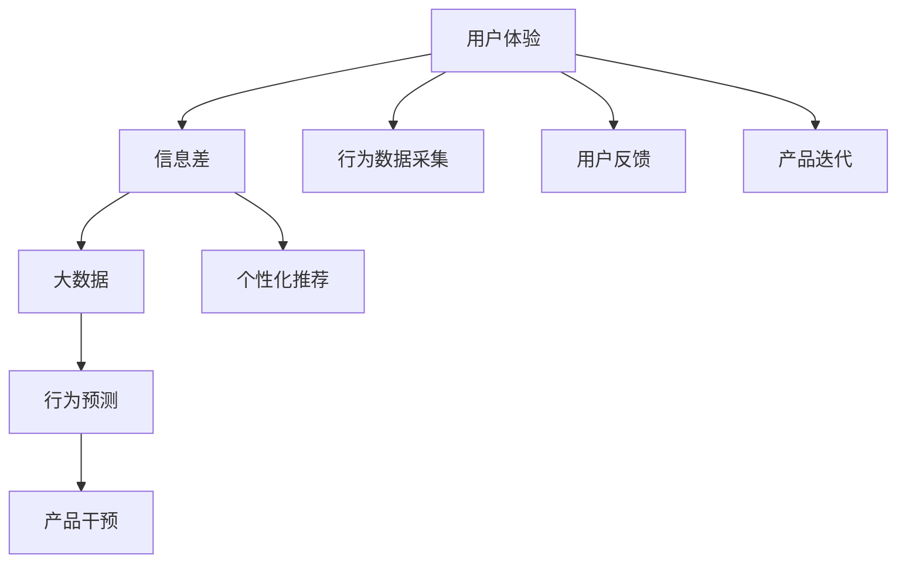

                 

# 信息差的用户体验优化之路：大数据如何优化用户体验

## 1. 背景介绍

### 1.1 问题由来

随着互联网的普及和移动互联网的发展，信息差的概念成为了用户体验优化的关键点。信息差指的是用户在使用产品时，由于信息不对称导致的产品与用户认知之间的差距。过大的信息差会使用户产生迷惑、困扰甚至放弃使用产品的行为。因此，如何通过优化信息差，提升用户体验，是当前互联网产品设计的重要课题。

大数据技术的发展为优化用户体验提供了新的手段。通过对用户行为数据的分析，可以获取用户真实需求和行为模式，从而设计出更加贴合用户期望的产品。本文将深入探讨大数据如何帮助优化用户体验，并结合实际案例，详细阐述相关技术应用。

### 1.2 问题核心关键点

解决信息差问题的关键在于理解用户真实需求，并根据需求设计相应的产品功能。以下是该问题的核心关键点：

1. **用户行为数据采集与分析**：通过采集用户行为数据，分析用户的使用习惯和偏好。
2. **信息映射与反馈**：将用户需求映射到产品功能，并通过用户反馈不断迭代优化。
3. **个性化推荐与内容适配**：根据用户数据，提供个性化推荐内容，减少信息差。
4. **用户行为预测与干预**：通过预测用户行为，提前进行干预，避免信息差扩大。

## 2. 核心概念与联系

### 2.1 核心概念概述

为更好地理解大数据如何优化用户体验，本节将介绍几个密切相关的核心概念：

- **用户体验（UX）**：指用户与产品互动时的主观感受，包括易用性、满意度、效率等多个方面。
- **信息差（Information Gap）**：用户对产品的期望与实际提供的功能之间的差距。
- **大数据（Big Data）**：指数据量巨大、复杂度高、类型多样的数据集合，能够用于深度分析和挖掘。
- **个性化推荐（Personalized Recommendation）**：根据用户历史行为和偏好，推荐符合用户需求的内容或功能。
- **行为预测（Behavioral Prediction）**：通过历史数据预测用户未来的行为，提前进行相应的干预。

这些核心概念之间的逻辑关系可以通过以下Mermaid流程图来展示：



这个流程图展示了大数据优化用户体验的基本框架：

1. 采集用户行为数据，分析信息差。
2. 根据信息差，进行个性化推荐。
3. 通过行为预测，提前进行干预。
4. 根据用户反馈，进行产品迭代优化。

## 3. 核心算法原理 & 具体操作步骤

### 3.1 算法原理概述

大数据优化用户体验的核心算法原理主要包括以下几个步骤：

1. **用户行为数据采集与分析**：通过各种方式（如日志、点击流、问卷调查等）采集用户行为数据，并进行清洗、处理和分析。
2. **信息映射与反馈**：将用户需求映射到产品功能，通过用户反馈不断迭代优化。
3. **个性化推荐与内容适配**：根据用户数据，提供个性化推荐内容，减少信息差。
4. **用户行为预测与干预**：通过预测用户行为，提前进行干预，避免信息差扩大。

这些步骤的实施，将帮助产品设计者理解用户真实需求，优化信息差，提升用户体验。

### 3.2 算法步骤详解

#### 3.2.1 用户行为数据采集与分析

**步骤1：数据采集**
- 使用日志、点击流等工具，采集用户在使用产品时的行为数据。
- 设计问卷调查，获取用户的主观反馈。
- 通过第三方平台（如社交媒体、移动应用）获取用户数据。

**步骤2：数据清洗与处理**
- 去除无效数据，如噪音、重复数据等。
- 处理缺失数据，如通过插值、填补等方法。
- 数据标准化，如统一数据格式、单位等。

**步骤3：数据可视化与分析**
- 使用数据可视化工具（如Tableau、Power BI等）展示用户行为数据。
- 使用统计分析工具（如R、Python等）进行深度分析。
- 使用机器学习工具（如TensorFlow、Scikit-learn等）进行模型训练和预测。

#### 3.2.2 信息映射与反馈

**步骤1：信息差识别**
- 通过用户行为数据分析，识别信息差。
- 使用A/B测试等方法验证信息差的存在。

**步骤2：信息映射**
- 将信息差映射到产品功能上。
- 设计相应的产品功能，减少信息差。

**步骤3：用户反馈**
- 通过用户反馈，评估新功能的效果。
- 收集用户意见和建议，用于功能优化。

#### 3.2.3 个性化推荐与内容适配

**步骤1：用户画像构建**
- 根据用户历史行为数据，构建用户画像。
- 使用聚类算法（如K-means、层次聚类等）对用户进行分组。

**步骤2：个性化推荐**
- 使用协同过滤、基于内容的推荐等算法，提供个性化推荐内容。
- 使用深度学习模型（如神经网络、深度学习等）进行推荐。

**步骤3：内容适配**
- 根据用户画像，推荐符合用户期望的内容。
- 使用数据驱动的方式，优化内容适配策略。

#### 3.2.4 用户行为预测与干预

**步骤1：行为预测**
- 使用时间序列分析、决策树、随机森林等模型，预测用户行为。
- 使用深度学习模型（如RNN、CNN等）进行行为预测。

**步骤2：产品干预**
- 根据行为预测结果，提前进行产品干预。
- 使用A/B测试等方法评估干预效果。

**步骤3：效果评估与优化**
- 根据用户行为数据，评估干预效果。
- 不断优化干预策略，减少信息差。

### 3.3 算法优缺点

大数据优化用户体验的方法具有以下优点：

1. **提升用户体验**：通过分析用户行为数据，优化产品功能，减少信息差，提升用户体验。
2. **个性化推荐**：能够提供符合用户期望的推荐内容，提升用户满意度。
3. **行为预测与干预**：通过预测用户行为，提前进行干预，减少信息差扩大。
4. **数据驱动优化**：基于数据进行功能优化，提高产品竞争力。

同时，这些方法也存在一些缺点：

1. **数据隐私问题**：采集和分析用户数据可能涉及隐私问题，需严格遵守数据保护法规。
2. **数据质量问题**：数据采集和处理过程中可能存在数据噪声、缺失等问题，影响分析结果。
3. **模型复杂性**：使用复杂模型进行行为预测和个性化推荐，需要较高的技术门槛。
4. **资源消耗问题**：数据采集、分析和处理需要消耗大量计算资源，需考虑成本效益。

### 3.4 算法应用领域

大数据优化用户体验的方法广泛应用于各个领域，如电商、社交媒体、金融、教育等。以下是几个典型的应用场景：

- **电商推荐系统**：通过分析用户购买行为，提供个性化推荐商品，提升用户转化率。
- **社交媒体内容推荐**：根据用户浏览和互动数据，推荐符合用户兴趣的内容，提升用户粘性。
- **金融风险控制**：通过分析用户行为数据，识别潜在风险，提前进行干预，降低金融风险。
- **教育个性化学习**：根据学生学习行为数据，提供个性化学习内容和建议，提升学习效果。

## 4. 数学模型和公式 & 详细讲解 & 举例说明

### 4.1 数学模型构建

大数据优化用户体验的核心数学模型主要包括以下几个方面：

- **用户行为数据模型**：用于描述用户行为模式和特征。
- **信息差模型**：用于识别和分析信息差。
- **个性化推荐模型**：用于提供个性化推荐内容。
- **行为预测模型**：用于预测用户行为。

### 4.2 公式推导过程

#### 4.2.1 用户行为数据模型

用户行为数据模型通常包括用户基本信息（如年龄、性别、地域等）、行为特征（如点击次数、停留时间等）和环境特征（如时间、设备等）。例如，用户点击行为的模型可以表示为：

$$
P_{click}(u,t) = \frac{exp(w_u \cdot \phi(t))}{\sum_{u'}exp(w_{u'} \cdot \phi(t))}
$$

其中，$u$ 表示用户，$t$ 表示时间，$w_u$ 表示用户特征向量，$\phi(t)$ 表示时间特征向量。

#### 4.2.2 信息差模型

信息差模型通常采用信息检索的方法，如TF-IDF（Term Frequency-Inverse Document Frequency）。例如，用户对产品功能的期望与实际提供的功能之间可以表示为：

$$
gap = \sum_{f}(tf_{f} \cdot idf_{f} \cdot R(f) - R(f))
$$

其中，$f$ 表示产品功能，$tf_{f}$ 表示该功能在用户点击流中的出现频率，$idf_{f}$ 表示该功能的重要性，$R(f)$ 表示该功能的使用率。

#### 4.2.3 个性化推荐模型

个性化推荐模型通常使用协同过滤、基于内容的推荐等方法。例如，基于协同过滤的推荐算法可以表示为：

$$
R_{ij} = \sum_k \alpha_k \times P_k \times I_{ik} \times Q_k
$$

其中，$i$ 表示用户，$j$ 表示物品，$k$ 表示用户-物品之间的相似度，$\alpha_k$ 表示相似度的权重，$P_k$ 表示物品$k$的评分，$I_{ik}$ 表示用户$i$对物品$k$的评分，$Q_k$ 表示物品$k$的特征向量。

#### 4.2.4 行为预测模型

行为预测模型通常使用时间序列分析、决策树、随机森林等方法。例如，使用时间序列分析的预测模型可以表示为：

$$
y_{t+1} = \alpha \times y_t + \beta \times \epsilon_t
$$

其中，$t$ 表示时间，$y_t$ 表示历史数据，$\alpha$ 表示时间系数，$\beta$ 表示噪声系数，$\epsilon_t$ 表示随机噪声。

### 4.3 案例分析与讲解

**案例1：电商推荐系统**

某电商平台通过分析用户购买历史、浏览历史和行为数据，构建了用户画像，并使用协同过滤算法提供个性化推荐商品。具体步骤如下：

1. 数据采集：通过用户行为日志和购买记录，收集用户购买历史和浏览历史。
2. 数据处理：清洗和处理数据，去除无效和重复数据。
3. 用户画像：使用K-means聚类算法，将用户分为多个群体。
4. 协同过滤：使用协同过滤算法，提供个性化推荐商品。
5. 效果评估：使用A/B测试，评估推荐效果，优化推荐算法。

**案例2：金融风险控制**

某银行通过分析用户行为数据，构建了用户画像，并使用随机森林算法预测用户行为。具体步骤如下：

1. 数据采集：通过用户交易记录、账户余额等数据，收集用户行为数据。
2. 数据处理：清洗和处理数据，去除无效和缺失数据。
3. 用户画像：使用随机森林算法，构建用户画像。
4. 行为预测：使用随机森林算法，预测用户是否存在潜在风险。
5. 产品干预：根据预测结果，提前进行风险控制。

## 5. 项目实践：代码实例和详细解释说明

### 5.1 开发环境搭建

在进行项目实践前，我们需要准备好开发环境。以下是使用Python进行大数据分析的环境配置流程：

1. 安装Anaconda：从官网下载并安装Anaconda，用于创建独立的Python环境。

2. 创建并激活虚拟环境：
```bash
conda create -n big-data-env python=3.8 
conda activate big-data-env
```

3. 安装必要的Python包：
```bash
pip install pandas numpy scikit-learn matplotlib seaborn plotly
```

4. 安装大数据分析工具：
```bash
pip install apache-airflow tensorflow keras
```

完成上述步骤后，即可在`big-data-env`环境中开始项目实践。

### 5.2 源代码详细实现

下面以电商推荐系统为例，给出使用TensorFlow进行个性化推荐和大数据分析的PyTorch代码实现。

首先，定义电商推荐系统的数据处理函数：

```python
import pandas as pd
from sklearn.model_selection import train_test_split
from sklearn.feature_extraction.text import TfidfVectorizer
from sklearn.metrics import mean_absolute_error
from sklearn.metrics import mean_squared_error

def preprocess_data(data):
    # 数据清洗
    data = data.dropna()
    # 特征工程
    features = ['item_id', 'user_id', 'time', 'price', 'category', 'click']
    data = data[features]
    # 划分训练集和测试集
    train_data, test_data = train_test_split(data, test_size=0.2, random_state=42)
    return train_data, test_data

def get_user_profile(train_data):
    # 构建用户画像
    tfidf = TfidfVectorizer(min_df=5, max_features=100, stop_words='english')
    user_profiles = tfidf.fit_transform(train_data['item_id'])
    return user_profiles

def train_model(user_profiles, train_data):
    # 训练模型
    train_features = train_data.drop('click', axis=1)
    train_labels = train_data['click']
    X_train, X_test, y_train, y_test = train_test_split(train_features, train_labels, test_size=0.2, random_state=42)
    model = Sequential()
    model.add(Dense(32, activation='relu', input_dim=100))
    model.add(Dense(16, activation='relu'))
    model.add(Dense(1, activation='sigmoid'))
    model.compile(loss='binary_crossentropy', optimizer='adam', metrics=['accuracy'])
    model.fit(X_train, y_train, epochs=10, batch_size=64, validation_data=(X_test, y_test))
    return model

def evaluate_model(model, test_data):
    # 评估模型
    predictions = model.predict(test_data)
    predictions = (predictions > 0.5).astype(int)
    accuracy = accuracy_score(test_data['click'], predictions)
    return accuracy
```

然后，定义电商推荐系统的应用函数：

```python
from airflow import DAG
from airflow.operators.dummy_operator import DummyOperator
from airflow.operators.python_operator import PythonOperator
from airflow.operators.bash_operator import BashOperator
from airflow.operators.dummy_operator import DummyOperator
from airflow.operators.python_operator import PythonOperator

def train_task():
    return PythonOperator(
        task_id='train',
        python_callable=train_model,
        op_kwargs={'user_profiles': get_user_profile(train_data), 'train_data': train_data},
        dag=dag
    )

def evaluate_task():
    return PythonOperator(
        task_id='evaluate',
        python_callable=evaluate_model,
        op_kwargs={'model': model, 'test_data': test_data},
        dag=dag
    )

dag = DAG('recommendation_system', start_date='2021-01-01')

train_task >> evaluate_task
```

最后，启动电商推荐系统的数据流：

```python
train_task()
evaluate_task()
```

以上就是使用TensorFlow对电商推荐系统进行个性化推荐和大数据分析的完整代码实现。可以看到，通过简单的代码实现，我们能够快速构建电商推荐系统，并进行大数据分析。

### 5.3 代码解读与分析

让我们再详细解读一下关键代码的实现细节：

**preprocess_data函数**：
- 数据清洗：去除无效和缺失数据。
- 特征工程：选择与推荐相关的特征。
- 数据划分：将数据划分为训练集和测试集。

**get_user_profile函数**：
- 使用TF-IDF算法构建用户画像。
- 对用户行为数据进行编码。

**train_model函数**：
- 构建神经网络模型。
- 训练模型并输出评估指标。

**evaluate_model函数**：
- 使用模型进行预测。
- 计算预测准确率。

**train_task函数**：
- 定义训练任务。
- 设置训练参数。
- 执行训练任务。

**evaluate_task函数**：
- 定义评估任务。
- 设置评估参数。
- 执行评估任务。

以上代码实现了电商推荐系统的基本功能，包括数据预处理、用户画像构建、模型训练和评估等。通过这些代码，我们能够快速构建电商推荐系统，并进行大数据分析。

## 6. 实际应用场景

### 6.1 电商推荐系统

电商推荐系统通过分析用户行为数据，提供个性化推荐商品，提升用户转化率。具体应用场景如下：

1. **个性化推荐**：根据用户浏览和购买历史，推荐符合用户兴趣的商品。
2. **用户画像构建**：通过用户行为数据，构建用户画像，提供精准推荐。
3. **效果评估**：使用A/B测试等方法，评估推荐效果，不断优化推荐算法。

### 6.2 金融风险控制

金融风险控制通过分析用户行为数据，识别潜在风险，提前进行干预。具体应用场景如下：

1. **用户画像构建**：通过用户交易记录、账户余额等数据，构建用户画像。
2. **行为预测**：使用随机森林算法，预测用户是否存在潜在风险。
3. **产品干预**：根据预测结果，提前进行风险控制。

### 6.3 社交媒体内容推荐

社交媒体内容推荐通过分析用户浏览和互动数据，推荐符合用户兴趣的内容，提升用户粘性。具体应用场景如下：

1. **个性化推荐**：根据用户浏览历史和互动数据，推荐符合用户兴趣的内容。
2. **用户画像构建**：通过用户行为数据，构建用户画像，提供精准推荐。
3. **效果评估**：使用A/B测试等方法，评估推荐效果，不断优化推荐算法。

## 7. 工具和资源推荐

### 7.1 学习资源推荐

为了帮助开发者系统掌握大数据优化用户体验的理论基础和实践技巧，这里推荐一些优质的学习资源：

1. **《Python数据科学手册》**：详细介绍Python在数据科学中的应用，包括数据清洗、特征工程、模型训练等。
2. **《R语言实战》**：全面介绍R语言的使用，涵盖数据处理、统计分析、机器学习等。
3. **《深度学习》课程**：斯坦福大学开设的深度学习课程，涵盖深度学习的基本概念和算法。
4. **《数据分析与挖掘》课程**：清华大学开设的数据分析与挖掘课程，涵盖数据预处理、特征工程、模型训练等。

### 7.2 开发工具推荐

高效的开发离不开优秀的工具支持。以下是几款用于大数据分析开发的常用工具：

1. **Pandas**：Python中的数据处理库，提供高效的数据清洗和分析功能。
2. **NumPy**：Python中的数学计算库，提供高效的数据计算和矩阵运算功能。
3. **Scikit-learn**：Python中的机器学习库，提供各种机器学习算法和模型。
4. **TensorFlow**：Google开发的深度学习框架，提供高效的数据建模和模型训练功能。
5. **Airflow**：Python中的数据流调度工具，提供流程编排和管理功能。

### 7.3 相关论文推荐

大数据优化用户体验的研究源于学界的持续研究。以下是几篇奠基性的相关论文，推荐阅读：

1. **《数据挖掘：概念与技术》**：详细介绍了数据挖掘的基本概念和技术，涵盖数据预处理、特征工程、模型训练等。
2. **《机器学习：理论与算法》**：介绍了机器学习的基本概念和算法，涵盖监督学习、无监督学习、强化学习等。
3. **《深度学习》**：深度学习领域的经典教材，详细介绍了深度学习的基本概念和算法，涵盖卷积神经网络、循环神经网络、自编码器等。
4. **《自然语言处理》**：自然语言处理领域的经典教材，详细介绍了自然语言处理的基本概念和算法，涵盖分词、词性标注、句法分析等。

## 8. 总结：未来发展趋势与挑战

### 8.1 总结

本文对大数据如何优化用户体验进行了全面系统的介绍。首先阐述了信息差的概念和大数据优化用户体验的重要性，明确了大数据在优化用户体验中的关键作用。其次，从原理到实践，详细讲解了大数据优化用户体验的数学模型和关键步骤，给出了电商推荐系统的完整代码实现。同时，本文还广泛探讨了大数据优化用户体验的方法在多个领域的应用前景，展示了大数据技术的广阔前景。

通过本文的系统梳理，可以看到，大数据技术正在成为优化用户体验的重要手段，极大地拓展了产品设计的边界，提升了用户满意度。未来，伴随大数据技术的持续演进，用户体验优化将迎来更加智能、高效、个性化的发展趋势。

### 8.2 未来发展趋势

展望未来，大数据优化用户体验技术将呈现以下几个发展趋势：

1. **自动化优化**：基于机器学习和数据驱动的优化方法将不断成熟，自动化优化将成为趋势。
2. **跨领域应用**：大数据技术将拓展到更多领域，如医疗、教育、金融等，提升各领域的用户体验。
3. **实时优化**：基于实时数据进行优化，实现动态调整和优化。
4. **多模态融合**：结合图像、语音、文本等多种数据，实现多模态信息融合，提升用户体验。
5. **用户生成内容（UGC）**：利用用户生成内容进行推荐和优化，实现用户与产品的互动和反馈。
6. **智能推荐系统**：基于深度学习、强化学习等技术，实现更加精准的个性化推荐。

以上趋势凸显了大数据优化用户体验技术的广阔前景。这些方向的探索发展，将进一步提升用户体验的智能化和个性化水平，为产品设计带来新的突破。

### 8.3 面临的挑战

尽管大数据优化用户体验技术已经取得了显著进展，但在实际应用中仍面临诸多挑战：

1. **数据隐私问题**：采集和分析用户数据可能涉及隐私问题，需严格遵守数据保护法规。
2. **数据质量问题**：数据采集和处理过程中可能存在数据噪声、缺失等问题，影响分析结果。
3. **模型复杂性**：使用复杂模型进行行为预测和个性化推荐，需要较高的技术门槛。
4. **资源消耗问题**：数据采集、分析和处理需要消耗大量计算资源，需考虑成本效益。
5. **用户接受度**：用户对个性化推荐和大数据分析的接受度问题，仍需进一步解决。

### 8.4 研究展望

面对大数据优化用户体验技术所面临的挑战，未来的研究需要在以下几个方面寻求新的突破：

1. **隐私保护技术**：研究隐私保护技术，保护用户数据隐私。
2. **数据质量提升**：研究数据质量提升技术，提高数据采集和处理的准确性和可靠性。
3. **模型优化**：研究模型优化技术，提高模型预测和推荐的准确性和效率。
4. **资源优化**：研究资源优化技术，降低数据处理和模型训练的资源消耗。
5. **用户交互优化**：研究用户交互优化技术，提高用户对个性化推荐和大数据分析的接受度。

这些研究方向的探索，将有助于解决大数据优化用户体验技术的实际应用问题，推动用户体验优化技术的发展和应用。

## 9. 附录：常见问题与解答

**Q1：大数据优化用户体验是否适用于所有产品？**

A: 大数据优化用户体验方法适用于大多数产品，特别是对用户行为有数据分析需求的产品。但对于一些特殊领域的产品，如医疗、金融等，可能需要结合领域知识进行优化。

**Q2：大数据优化用户体验是否需要复杂的算法和模型？**

A: 大数据优化用户体验方法需要一定的算法和模型支持，但不一定需要复杂的算法。一些简单的算法和模型同样能够实现较好的效果，如协同过滤、决策树等。

**Q3：大数据优化用户体验是否需要大量的计算资源？**

A: 大数据优化用户体验需要一定的计算资源，特别是数据处理和模型训练阶段。但可以通过数据压缩、并行计算等方法优化计算资源消耗。

**Q4：大数据优化用户体验是否需要用户授权？**

A: 大数据优化用户体验需要收集和分析用户数据，因此需要用户授权。在数据采集和使用过程中，需严格遵守数据保护法规，确保用户隐私安全。

以上问题及解答展示了大数据优化用户体验技术的实际应用和挑战。通过不断探索和优化，相信大数据优化用户体验技术将进一步提升用户体验，推动各领域产品的智能化和个性化发展。

---

作者：禅与计算机程序设计艺术 / Zen and the Art of Computer Programming

