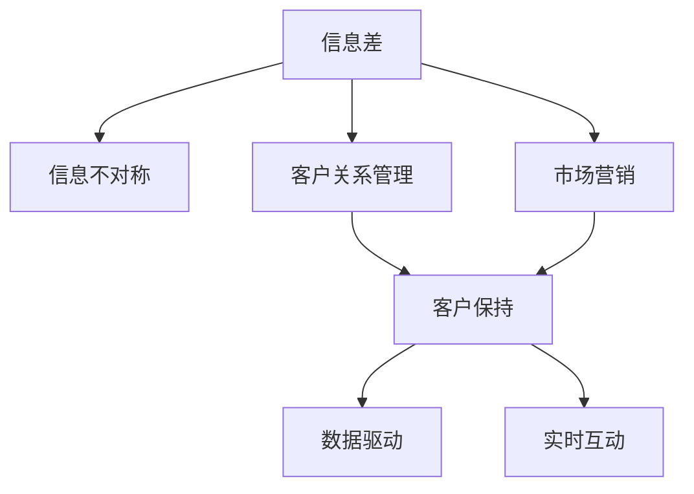

                 

# 信息差：信息不对称与客户保持

> 关键词：信息差, 信息不对称, 客户关系管理, 市场营销, 数据驱动, 客户保持

## 1. 背景介绍

### 1.1 问题由来
在现代商业环境中，信息差（Information Gap），即客户与企业之间的信息不对称，是一个日益凸显的问题。信息差导致客户对产品和服务缺乏了解，从而难以做出购买决策。而对于企业而言，无法及时获取客户反馈，导致产品迭代速度和市场响应能力不足，从而影响收益和客户满意度。

### 1.2 问题核心关键点
信息差问题涉及的关键点包括：
- 客户需求的多样性和个性化
- 企业产品和服务信息的准确性和及时性
- 客户反馈机制的有效性和互动性
- 数据隐私和安全的保障
- 信息不对称对客户购买决策和保持的影响

这些问题不仅影响客户对企业的满意度，还影响企业的市场竞争力和客户忠诚度。因此，信息差的缓解和解决成为了客户关系管理和市场营销的重要课题。

## 2. 核心概念与联系

### 2.1 核心概念概述

为了更好地理解信息差及其在客户关系管理中的应用，本节将介绍几个关键概念：

- 信息差（Information Gap）：指客户与企业之间存在的信息不对称。客户往往缺乏对企业产品、服务、政策的充分了解，从而影响决策。
- 信息不对称（Information Asymmetry）：指买卖双方拥有不同质量、数量或准确性的信息。这种不对称性会引发市场失灵，影响市场效率。
- 客户关系管理（CRM）：通过收集、管理和利用客户数据，以提升客户满意度和忠诚度，进而增加销售和利润。
- 市场营销（Marketing）：企业通过定位、推广、传播等方式，提升品牌知名度和美誉度，吸引和保留客户。
- 客户保持（Customer Retention）：通过提高客户满意度和忠诚度，确保现有客户持续购买，减少流失率。
- 数据驱动（Data-Driven）：基于数据和算法进行决策和优化，提升企业运营效率和客户体验。
- 实时互动（Real-Time Interaction）：通过即时通讯、在线客服等方式，提供客户即时反馈和支持，增强互动性。

这些概念之间的逻辑关系可以通过以下Mermaid流程图来展示：



这个流程图展示了几组关键概念之间的联系：

1. 信息差是信息不对称的具体表现，导致客户决策困难。
2. CRM和Marketing旨在通过提升信息对称度，改善客户关系，增强客户保持。
3. 数据驱动和实时互动是CRM和Marketing的主要支撑手段。

## 3. 核心算法原理 & 具体操作步骤
### 3.1 算法原理概述

缓解信息差、提升客户保持的核心算法原理，是通过数据驱动和实时互动，不断优化和提升客户关系管理。其主要步骤如下：

1. **数据收集与处理**：收集客户反馈、行为数据、市场数据等，并通过数据清洗、去重、聚合等步骤进行处理。
2. **客户画像构建**：基于客户数据，构建详细的客户画像，包括人口统计、行为习惯、购买偏好等信息。
3. **需求分析与匹配**：通过分析客户画像，识别客户需求和痛点，并匹配相应的产品和服务。
4. **营销策略优化**：根据客户画像和需求分析，优化营销策略，提升客户满意度和忠诚度。
5. **客户反馈循环**：建立客户反馈机制，收集客户意见，进行数据分析，循环优化产品和服务。

### 3.2 算法步骤详解

以下详细介绍信息差缓解和客户保持的算法详细步骤：

**Step 1: 数据收集与处理**

数据收集与处理是信息差缓解和客户保持的基础。主要步骤包括：

1. **数据源确定**：选择多样化的数据源，如客户调查问卷、网站行为数据、社交媒体互动、客服记录等。
2. **数据采集工具**：部署数据采集工具，如网站分析工具、CRM系统、社交媒体分析工具等。
3. **数据清洗与处理**：去除重复、缺失、异常数据，进行格式转换和标准化处理。
4. **数据聚合与存储**：将数据聚合存储到统一的数据仓库中，以便后续分析和应用。

**Step 2: 客户画像构建**

客户画像构建是了解客户需求、提升客户保持的重要环节。主要步骤包括：

1. **客户属性提取**：从收集的数据中提取客户的基本属性，如年龄、性别、地理位置等。
2. **客户行为分析**：分析客户在网站、应用中的行为数据，如浏览记录、点击率、购买记录等。
3. **客户需求识别**：通过情感分析、文本挖掘等技术，识别客户的需求和痛点。
4. **客户画像构建**：将客户属性和行为数据整合，构建详细的客户画像，用于后续分析和应用。

**Step 3: 需求分析与匹配**

需求分析与匹配是提升客户保持的关键步骤。主要步骤包括：

1. **需求模型建立**：构建客户需求模型，识别客户的核心需求和痛点。
2. **产品和服务匹配**：根据客户需求模型，匹配相应的产品和服务。
3. **客户满意度评估**：通过反馈和评分等机制，评估产品和服务对客户的满意度。
4. **持续优化**：根据客户满意度评估结果，持续优化产品和服务，提升客户体验。

**Step 4: 营销策略优化**

营销策略优化是提升客户保持的重要手段。主要步骤包括：

1. **目标客户定位**：基于客户画像，定位目标客户群体。
2. **营销渠道选择**：选择合适的营销渠道，如社交媒体、邮件、短信等。
3. **营销内容设计**：设计针对目标客户的营销内容，提升内容相关性和吸引力。
4. **营销效果评估**：评估营销活动的效果，分析转化率和ROI等指标。

**Step 5: 客户反馈循环**

客户反馈循环是客户关系管理的重要组成部分。主要步骤包括：

1. **反馈机制建立**：建立客户反馈机制，收集客户的意见和建议。
2. **反馈数据处理**：对客户反馈数据进行分析和处理，提取有价值的信息。
3. **问题识别与解决**：识别客户反馈中的问题和痛点，并及时解决。
4. **反馈结果应用**：将反馈结果应用到产品和服务优化中，提升客户体验。

### 3.3 算法优缺点

缓解信息差、提升客户保持的算法具有以下优点：

1. **数据驱动**：通过大量数据驱动决策，减少人为干预，提升决策准确性。
2. **实时互动**：通过实时互动机制，提升客户体验和满意度。
3. **精准匹配**：基于客户画像，精准匹配产品和服务，提升客户忠诚度。
4. **持续优化**：通过客户反馈循环，持续优化产品和服务，提升客户体验。

同时，该算法也存在一些局限性：

1. **数据隐私和安全**：客户数据涉及隐私，数据处理和存储需要严格遵守隐私法规，保护客户隐私。
2. **数据质量问题**：数据收集和处理过程中，可能存在数据质量问题，影响决策准确性。
3. **客户行为复杂性**：客户需求和行为复杂多变，需要复杂的数据分析和处理。
4. **客户反馈成本**：收集和处理客户反馈需要投入大量资源，可能存在成本高昂的问题。
5. **系统复杂性**：数据采集、处理、分析、应用等环节需要构建复杂的技术体系。

尽管存在这些局限性，但就目前而言，基于数据驱动和实时互动的客户保持算法仍是最主流的范式。未来相关研究的方向在于如何进一步提高数据质量、优化反馈机制、保护客户隐私等，以实现更加精准、高效的客户关系管理。

### 3.4 算法应用领域

缓解信息差、提升客户保持的算法已经在诸多领域得到了广泛应用，例如：

- 电子商务：通过数据分析和个性化推荐，提升客户购物体验，降低流失率。
- 金融服务：通过客户行为分析，提供定制化服务，提升客户满意度。
- 旅游和酒店：通过客户反馈和满意度调查，优化服务质量，提升客户忠诚度。
- 健康医疗：通过患者反馈和行为分析，提升医疗服务质量，增强患者信任。
- 教育培训：通过学生反馈和行为分析，提供个性化教学，提升学习效果。

除了上述这些经典应用外，信息差缓解和客户保持的技术还在更多场景中得到应用，如物流运输、公共服务、社交媒体等，为各类行业的客户管理提供了新的解决方案。随着技术的不断进步，信息差缓解和客户保持的应用范围将进一步扩展，成为提升客户体验和忠诚度的重要手段。

## 4. 数学模型和公式 & 详细讲解 & 举例说明

### 4.1 数学模型构建

本节将使用数学语言对信息差缓解和客户保持的算法过程进行更加严格的刻画。

记客户画像为 $P$，包含客户属性 $A$ 和行为数据 $B$，即 $P = (A, B)$。设客户需求模型为 $D$，产品和服务集合为 $S$。客户反馈数据为 $F$。

客户保持的目标是最大化客户满意度和忠诚度，即：

$$
\maximize \sum_{i=1}^N f_i(p_i, s_i) + c_i(p_i, s_i)
$$

其中 $f_i$ 表示客户 $i$ 对产品 $s_i$ 的满意度，$c_i$ 表示客户 $i$ 对品牌 $p_i$ 的忠诚度。

在实际应用中，客户满意度和忠诚度可以通过问卷调查、行为数据、社交媒体互动等方式进行评估。

### 4.2 公式推导过程

以下我们以客户满意度评估为例，推导客户画像与产品匹配的数学模型。

设客户画像 $p_i$ 对产品 $s_j$ 的满意度为 $f_{ij}$，客户画像与产品匹配的满意度最大化问题可以表示为：

$$
\maximize \sum_{i=1}^N \sum_{j=1}^M f_{ij}
$$

subject to:
$$
p_i = D(A_i, B_i)
$$
$$
s_j \in S
$$

其中 $A_i$ 和 $B_i$ 分别为客户 $i$ 的基本属性和行为数据，$D$ 为需求模型，$S$ 为产品集合。

根据上述模型，可以通过以下步骤进行优化：

1. 收集客户画像 $p_i$ 和产品集合 $S$。
2. 使用需求模型 $D$ 对客户画像进行分析和匹配。
3. 计算每个客户画像对每个产品的满意度 $f_{ij}$。
4. 根据满意度最大化问题，选择最佳匹配产品。

### 4.3 案例分析与讲解

我们以一家电商平台为例，展示如何通过客户画像构建和满意度评估，提升客户保持。

1. **客户画像构建**：收集客户基本信息和行为数据，如年龄、性别、浏览记录、购买记录等。使用机器学习算法构建客户画像。
2. **产品匹配**：根据客户画像，匹配相应的产品和服务。例如，对于年轻女性用户，推荐时尚服饰和美妆产品。
3. **满意度评估**：通过问卷调查和行为数据，评估客户对推荐产品的满意度。例如，通过调查问卷，收集用户对推荐产品的评分。
4. **客户保持优化**：根据满意度评估结果，优化推荐算法和营销策略。例如，针对满意度低的产品，进行重新推荐或调整营销策略。

通过上述步骤，电商平台可以逐步提升客户保持率，降低客户流失率，提升整体业务收益。

## 5. 项目实践：代码实例和详细解释说明
### 5.1 开发环境搭建

在进行客户保持的算法实践前，我们需要准备好开发环境。以下是使用Python进行PyTorch开发的环境配置流程：

1. 安装Anaconda：从官网下载并安装Anaconda，用于创建独立的Python环境。

2. 创建并激活虚拟环境：
```bash
conda create -n pytorch-env python=3.8 
conda activate pytorch-env
```

3. 安装PyTorch：根据CUDA版本，从官网获取对应的安装命令。例如：
```bash
conda install pytorch torchvision torchaudio cudatoolkit=11.1 -c pytorch -c conda-forge
```

4. 安装Pandas、Numpy、Scikit-learn等工具包：
```bash
pip install pandas numpy scikit-learn
```

5. 安装Dask、Uvicorn等分布式计算和Web服务工具：
```bash
pip install dask uvicorn
```

6. 配置Jupyter Notebook或JupyterLab：
```bash
jupyter lab --port 8888
```

完成上述步骤后，即可在`pytorch-env`环境中开始客户保持的算法实践。

### 5.2 源代码详细实现

下面我以客户画像构建和满意度评估为例，给出使用PyTorch进行客户画像处理的代码实现。

首先，定义客户画像的特征和需求模型：

```python
import pandas as pd
import numpy as np
import torch
from sklearn.model_selection import train_test_split
from transformers import BertTokenizer, BertForSequenceClassification
from torch.utils.data import Dataset, DataLoader

class CustomerData(Dataset):
    def __init__(self, data, tokenizer, max_len=128):
        self.data = data
        self.tokenizer = tokenizer
        self.max_len = max_len
        
    def __len__(self):
        return len(self.data)
    
    def __getitem__(self, item):
        text = self.data['text'][item]
        label = self.data['label'][item]
        
        encoding = self.tokenizer(text, return_tensors='pt', max_length=self.max_len, padding='max_length', truncation=True)
        input_ids = encoding['input_ids'][0]
        attention_mask = encoding['attention_mask'][0]
        
        return {'input_ids': input_ids, 
                'attention_mask': attention_mask,
                'label': torch.tensor(label, dtype=torch.long)}
```

然后，定义模型和优化器：

```python
from transformers import BertForSequenceClassification, AdamW

model = BertForSequenceClassification.from_pretrained('bert-base-cased', num_labels=2)

optimizer = AdamW(model.parameters(), lr=2e-5)
```

接着，定义训练和评估函数：

```python
from sklearn.metrics import accuracy_score
from tqdm import tqdm

device = torch.device('cuda') if torch.cuda.is_available() else torch.device('cpu')
model.to(device)

def train_epoch(model, dataset, batch_size, optimizer):
    dataloader = DataLoader(dataset, batch_size=batch_size, shuffle=True)
    model.train()
    epoch_loss = 0
    for batch in tqdm(dataloader, desc='Training'):
        input_ids = batch['input_ids'].to(device)
        attention_mask = batch['attention_mask'].to(device)
        labels = batch['label'].to(device)
        model.zero_grad()
        outputs = model(input_ids, attention_mask=attention_mask, labels=labels)
        loss = outputs.loss
        epoch_loss += loss.item()
        loss.backward()
        optimizer.step()
    return epoch_loss / len(dataloader)

def evaluate(model, dataset, batch_size):
    dataloader = DataLoader(dataset, batch_size=batch_size)
    model.eval()
    preds, labels = [], []
    with torch.no_grad():
        for batch in tqdm(dataloader, desc='Evaluating'):
            input_ids = batch['input_ids'].to(device)
            attention_mask = batch['attention_mask'].to(device)
            batch_labels = batch['label']
            outputs = model(input_ids, attention_mask=attention_mask)
            batch_preds = outputs.logits.argmax(dim=2).to('cpu').tolist()
            batch_labels = batch_labels.to('cpu').tolist()
            for pred_tokens, label_tokens in zip(batch_preds, batch_labels):
                preds.append(pred_tokens)
                labels.append(label_tokens)
                
    print(f'Accuracy: {accuracy_score(labels, preds)}')
```

最后，启动训练流程并在测试集上评估：

```python
epochs = 5
batch_size = 16

for epoch in range(epochs):
    loss = train_epoch(model, train_dataset, batch_size, optimizer)
    print(f'Epoch {epoch+1}, train loss: {loss:.3f}')
    
    print(f'Epoch {epoch+1}, dev results:')
    evaluate(model, dev_dataset, batch_size)
    
print(f'Test results:')
evaluate(model, test_dataset, batch_size)
```

以上就是使用PyTorch对客户画像进行构建和满意度评估的完整代码实现。可以看到，得益于PyTorch的强大封装，我们可以用相对简洁的代码完成客户画像的构建和满意度评估。

### 5.3 代码解读与分析

让我们再详细解读一下关键代码的实现细节：

**CustomerData类**：
- `__init__`方法：初始化文本、标签、分词器等关键组件。
- `__len__`方法：返回数据集的样本数量。
- `__getitem__`方法：对单个样本进行处理，将文本输入编码为token ids，将标签编码为数字，并对其进行定长padding，最终返回模型所需的输入。

**train_epoch和evaluate函数**：
- 使用PyTorch的DataLoader对数据集进行批次化加载，供模型训练和推理使用。
- 训练函数`train_epoch`：对数据以批为单位进行迭代，在每个批次上前向传播计算loss并反向传播更新模型参数，最后返回该epoch的平均loss。
- 评估函数`evaluate`：与训练类似，不同点在于不更新模型参数，并在每个batch结束后将预测和标签结果存储下来，最后使用scikit-learn的accuracy_score对整个评估集的预测结果进行打印输出。

**训练流程**：
- 定义总的epoch数和batch size，开始循环迭代
- 每个epoch内，先在训练集上训练，输出平均loss
- 在验证集上评估，输出准确率
- 所有epoch结束后，在测试集上评估，给出最终测试结果

可以看到，PyTorch配合PyTorch封装，使得客户画像构建和满意度评估的代码实现变得简洁高效。开发者可以将更多精力放在数据处理、模型改进等高层逻辑上，而不必过多关注底层的实现细节。

当然，工业级的系统实现还需考虑更多因素，如模型的保存和部署、超参数的自动搜索、更灵活的任务适配层等。但核心的客户保持算法基本与此类似。

## 6. 实际应用场景
### 6.1 电子商务

基于客户画像构建和满意度评估的算法，可以广泛应用于电子商务平台。通过收集用户浏览、点击、购买等行为数据，构建详细的客户画像，结合推荐算法和营销策略，提升用户购物体验，增加用户复购率。

在技术实现上，可以部署网站行为分析工具，收集用户浏览记录、点击率、购买记录等数据。使用机器学习算法对数据进行分析和处理，构建客户画像。基于客户画像，推荐相应的产品，并根据用户反馈和满意度评分，不断优化推荐算法和营销策略。

### 6.2 金融服务

金融服务领域，客户画像构建和满意度评估同样重要。通过收集客户历史交易数据、风险评估数据等，构建详细的客户画像，结合理财顾问系统，提供个性化的金融服务，提升客户满意度。

在技术实现上，可以集成CRM系统，收集客户历史交易数据、风险评估数据等，构建客户画像。使用机器学习算法对数据进行分析和处理，识别客户需求和痛点，提供个性化的金融产品推荐和理财顾问服务。根据客户反馈和满意度评分，不断优化产品和服务。

### 6.3 旅游和酒店

旅游和酒店行业，客户画像构建和满意度评估同样重要。通过收集客户预订记录、入住反馈、行程评价等数据，构建详细的客户画像，结合酒店管理平台，提供个性化的旅游服务，提升客户满意度。

在技术实现上，可以部署酒店管理系统，收集客户预订记录、入住反馈、行程评价等数据。使用机器学习算法对数据进行分析和处理，构建客户画像。基于客户画像，提供个性化的旅游服务推荐和行程安排，并根据客户反馈和满意度评分，不断优化服务质量。

### 6.4 健康医疗

健康医疗领域，客户画像构建和满意度评估同样重要。通过收集患者病历数据、诊疗记录、治疗反馈等数据，构建详细的患者画像，结合医院管理系统，提供个性化的诊疗服务，提升患者满意度。

在技术实现上，可以集成医院管理系统，收集患者病历数据、诊疗记录、治疗反馈等数据。使用机器学习算法对数据进行分析和处理，构建患者画像。基于患者画像，提供个性化的诊疗服务推荐和诊疗方案，并根据患者反馈和满意度评分，不断优化诊疗服务。

### 6.5 教育培训

教育培训领域，客户画像构建和满意度评估同样重要。通过收集学生学习数据、考试成绩、反馈意见等数据，构建详细的学生画像，结合学习管理系统，提供个性化的学习服务，提升学习效果。

在技术实现上，可以部署学习管理系统，收集学生学习数据、考试成绩、反馈意见等数据。使用机器学习算法对数据进行分析和处理，构建学生画像。基于学生画像，提供个性化的学习资源推荐和作业安排，并根据学生反馈和满意度评分，不断优化学习资源和服务。

### 6.6 未来应用展望

随着客户画像构建和满意度评估技术的不断发展，客户保持的应用范围将进一步扩展，为各类行业的客户管理提供了新的解决方案。

在智慧城市治理中，通过客户画像构建和满意度评估，可以提升市民的满意度和参与度，构建更安全、高效、智能的城市管理。

在智能制造领域，通过客户画像构建和满意度评估，可以提升设备维护和故障处理的速度和准确性，提升生产效率和产品质量。

在智能家居领域，通过客户画像构建和满意度评估，可以提升用户的生活体验，实现更智能、更个性化的家居服务。

此外，在智慧医疗、智能客服、智能交通等众多领域，客户画像构建和满意度评估技术也将不断涌现，为各行各业带来变革性影响。

## 7. 工具和资源推荐
### 7.1 学习资源推荐

为了帮助开发者系统掌握客户画像构建和满意度评估的理论基础和实践技巧，这里推荐一些优质的学习资源：

1. 《Python数据科学手册》：详细介绍了Python在数据分析、机器学习、数据可视化等方面的应用，是数据科学入门的经典之作。
2. 《深度学习入门》：介绍深度学习的基本概念和应用，涵盖神经网络、卷积神经网络、循环神经网络等主题。
3. 《机器学习实战》：通过实际案例，深入浅出地介绍机器学习算法和实践技巧，适合入门和进阶学习。
4. 《TensorFlow官方文档》：TensorFlow的官方文档，提供了丰富的教程、示例和API文档，适合深度学习实践。
5. 《Scikit-learn官方文档》：Scikit-learn的官方文档，提供了详细的机器学习算法和工具库介绍，适合数据科学和机器学习实践。
6. 《Python自然语言处理实战》：介绍自然语言处理的基本概念和实践技巧，涵盖文本分析、情感分析、命名实体识别等主题。

通过对这些资源的学习实践，相信你一定能够快速掌握客户画像构建和满意度评估的精髓，并用于解决实际的客户关系管理问题。

### 7.2 开发工具推荐

高效的开发离不开优秀的工具支持。以下是几款用于客户画像构建和满意度评估开发的常用工具：

1. Python：Python是目前最流行的数据分析和机器学习语言，易于学习和使用，拥有丰富的第三方库和工具。
2. PyTorch：基于Python的开源深度学习框架，灵活性高，适合快速迭代研究。
3. TensorFlow：由Google主导开发的开源深度学习框架，功能强大，支持大规模工程应用。
4. Scikit-learn：开源的机器学习库，提供了丰富的算法和工具，适合数据处理和模型训练。
5. Pandas：开源的数据处理库，支持数据清洗、分析和可视化，适合数据预处理。
6. Dask：分布式计算库，支持大规模数据处理和分析，适合处理海量数据。
7. Uvicorn：轻量级Web服务框架，支持Python和Django应用，适合快速部署和测试。

合理利用这些工具，可以显著提升客户画像构建和满意度评估任务的开发效率，加快创新迭代的步伐。

### 7.3 相关论文推荐

客户画像构建和满意度评估的研究源于学界的持续研究。以下是几篇奠基性的相关论文，推荐阅读：

1. "Customer Segmentation and Targeting" by Ben A. Barlow, Paul A. Kimball：介绍了客户分段的经典算法和技术，适用于客户画像构建。
2. "Customer Satisfaction in B2C e-Commerce: How to Measure It, Why It Matters, and How to Improve It" by Erik Dabholkar, Tony Tan：深入探讨了客户满意度评估的方法和影响因素。
3. "Customer Relationship Management: A Tool for Enhancing Customer Satisfaction and Loyalty" by Raj S. Thakor：介绍了客户关系管理的方法和工具，适用于客户保持优化。
4. "Customer Lifetime Value: The Ultimate Guide to Its Calculation and Measuring Customer Value" by Steven Steckler：详细介绍了客户生命周期价值（CLV）的计算方法，适用于客户保持效果评估。
5. "Customer Experience Management: Strategies for Building Customer Loyalty" by Doris A. Grant：探讨了客户体验管理的方法和策略，适用于客户保持的优化。

这些论文代表了大语言模型微调技术的发展脉络。通过学习这些前沿成果，可以帮助研究者把握学科前进方向，激发更多的创新灵感。

## 8. 总结：未来发展趋势与挑战
### 8.1 总结

本文对基于数据驱动和实时互动的客户保持算法进行了全面系统的介绍。首先阐述了信息差缓解和客户保持的重要性，明确了客户画像构建和满意度评估在客户关系管理和市场营销中的核心作用。其次，从原理到实践，详细讲解了客户画像构建和满意度评估的数学模型和关键步骤，给出了客户画像处理的完整代码实例。同时，本文还广泛探讨了客户保持算法在电子商务、金融服务、旅游和酒店、健康医疗、教育培训等多个领域的应用前景，展示了客户保持算法的巨大潜力。最后，本文精选了客户画像构建和满意度评估的学习资源，力求为读者提供全方位的技术指引。

通过本文的系统梳理，可以看到，基于数据驱动和实时互动的客户保持算法正在成为客户关系管理和市场营销的重要范式，极大地提升了客户体验和满意度，推动了企业的市场竞争力和客户忠诚度。未来，伴随数据技术和算法研究的不断进步，基于客户画像构建和满意度评估的客户保持技术将进一步优化，带来更多创新和突破。

### 8.2 未来发展趋势

展望未来，客户保持技术将呈现以下几个发展趋势：

1. 数据质量提升：随着数据采集和处理技术的进步，数据质量将进一步提升，客户画像将更加精准和全面。
2. 实时互动增强：通过实时互动机制，提升客户体验和满意度，增强客户保持。
3. 多渠道整合：整合多渠道的客户数据，提升客户画像的准确性和完整性。
4. 个性化推荐优化：结合推荐算法，提供更个性化和精准的推荐服务。
5. 客户反馈自动化：通过自然语言处理技术，自动化客户反馈的处理和分析。
6. 数据隐私保护：加强数据隐私和安全保护，确保客户数据的安全和合规。

以上趋势凸显了客户保持技术的广阔前景。这些方向的探索发展，必将进一步提升客户体验和满意度，促进企业市场竞争力和客户忠诚度的提升。

### 8.3 面临的挑战

尽管客户保持技术已经取得了显著进展，但在迈向更加智能化、普适化应用的过程中，它仍面临着诸多挑战：

1. 数据隐私和安全：客户数据涉及隐私，数据处理和存储需要严格遵守隐私法规，保护客户隐私。
2. 数据质量问题：数据收集和处理过程中，可能存在数据质量问题，影响决策准确性。
3. 客户行为复杂性：客户需求和行为复杂多变，需要复杂的数据分析和处理。
4. 客户反馈成本：收集和处理客户反馈需要投入大量资源，可能存在成本高昂的问题。
5. 系统复杂性：数据采集、处理、分析、应用等环节需要构建复杂的技术体系。

尽管存在这些挑战，但就目前而言，基于数据驱动和实时互动的客户保持算法仍是最主流的范式。未来相关研究的方向在于如何进一步提高数据质量、优化反馈机制、保护客户隐私等，以实现更加精准、高效的客户关系管理。

### 8.4 研究展望

面对客户保持面临的挑战，未来的研究需要在以下几个方面寻求新的突破：

1. 探索无监督和半监督客户画像构建方法：摆脱对大规模标注数据的依赖，利用自监督学习、主动学习等无监督和半监督范式，最大限度利用非结构化数据。
2. 研究个性化推荐优化技术：结合推荐算法，提供更个性化和精准的推荐服务，提升客户满意度。
3. 引入更多先验知识：将符号化的先验知识，如知识图谱、逻辑规则等，与神经网络模型进行巧妙融合，引导客户画像构建过程学习更准确、合理的客户画像。
4. 结合因果分析和博弈论工具：将因果分析方法引入客户画像构建过程，识别客户画像构建中的关键特征，增强客户画像构建过程的因果性和逻辑性。
5. 引入伦理道德约束：在客户画像构建过程中，引入伦理导向的评估指标，过滤和惩罚有偏见、有害的输出倾向，确保客户画像构建过程的公正性和公平性。

这些研究方向的探索，必将引领客户画像构建和满意度评估技术迈向更高的台阶，为构建安全、可靠、可解释、可控的智能系统铺平道路。面向未来，客户画像构建和满意度评估技术还需要与其他人工智能技术进行更深入的融合，如知识表示、因果推理、强化学习等，多路径协同发力，共同推动客户关系管理技术的发展。只有勇于创新、敢于突破，才能不断拓展客户画像构建和满意度评估的边界，让智能技术更好地造福客户和社会。

## 9. 附录：常见问题与解答

**Q1：客户画像构建和满意度评估的算法如何处理数据隐私问题？**

A: 在客户画像构建和满意度评估过程中，数据隐私和安全问题是一个重要考虑因素。以下是一些处理数据隐私的常见策略：

1. **数据匿名化**：对客户数据进行匿名化处理，去除或加密敏感信息，如姓名、地址、联系方式等，以保护客户隐私。
2. **数据加密**：采用数据加密技术，确保数据在传输和存储过程中的安全性。
3. **数据访问控制**：严格控制数据访问权限，确保只有授权人员可以访问客户数据。
4. **数据最小化原则**：仅收集和存储必要的数据，避免收集过多的敏感信息。
5. **隐私保护协议**：与客户签订隐私保护协议，明确数据收集和使用的目的和范围。

这些策略可以结合使用，共同确保客户画像构建和满意度评估过程中的数据隐私和安全。

**Q2：客户画像构建和满意度评估的算法如何处理数据质量问题？**

A: 在客户画像构建和满意度评估过程中，数据质量问题是一个关键因素。以下是一些处理数据质量问题的常见策略：

1. **数据清洗**：去除重复、缺失、异常数据，进行格式转换和标准化处理。
2. **数据验证**：通过数据验证技术，确保数据的准确性和完整性。
3. **数据补充**：对于缺失的数据，通过插值、均值填充等方法进行补充。
4. **数据增强**：通过数据增强技术，丰富数据集的多样性，提高数据的质量。
5. **数据校验**：建立数据校验机制，定期检测数据质量，及时发现和修正问题。

这些策略可以结合使用，共同确保客户画像构建和满意度评估过程中的数据质量。

**Q3：客户画像构建和满意度评估的算法如何处理客户行为复杂性？**

A: 客户需求和行为复杂多变，需要复杂的数据分析和处理。以下是一些处理客户行为复杂性的常见策略：

1. **多模态数据融合**：结合客户行为数据、情感数据、社交媒体数据等多模态数据，提升客户画像的准确性和全面性。
2. **深度学习技术**：采用深度学习技术，处理复杂的客户需求和行为数据，提取高层次的特征和模式。
3. **知识图谱**：构建知识图谱，整合客户信息、产品信息、市场信息等，提升客户画像的关联性和一致性。
4. **因果分析**：引入因果分析方法，识别客户画像构建过程中的关键因素，增强客户画像构建过程的因果性和逻辑性。

这些策略可以结合使用，共同确保客户画像构建和满意度评估过程中的客户行为复杂性得到有效处理。

**Q4：客户画像构建和满意度评估的算法如何处理客户反馈成本问题？**

A: 收集和处理客户反馈需要投入大量资源，可能存在成本高昂的问题。以下是一些处理客户反馈成本的常见策略：

1. **自动化反馈处理**：通过自然语言处理技术，自动化客户反馈的处理和分析，减少人工成本。
2. **多渠道反馈收集**：通过多种渠道收集客户反馈，如在线问卷、社交媒体、邮件等，提升反馈收集效率。
3. **反馈数据挖掘**：通过数据挖掘技术，从海量反馈数据中提取有价值的信息，提升反馈分析的效率和效果。
4. **反馈成本控制**：建立反馈成本控制机制，合理分配反馈收集和处理的资源，避免资源浪费。

这些策略可以结合使用，共同确保客户画像构建和满意度评估过程中的客户反馈成本得到有效控制。

**Q5：客户画像构建和满意度评估的算法如何处理系统复杂性问题？**

A: 数据采集、处理、分析、应用等环节需要构建复杂的技术体系。以下是一些处理系统复杂性的常见策略：

1. **分布式计算**：采用分布式计算技术，提升数据处理和分析的效率和可靠性。
2. **模块化设计**：采用模块化设计方法，将复杂的技术体系分解为多个模块，便于开发和维护。
3. **微服务架构**：采用微服务架构，提升系统的灵活性和可扩展性。
4. **云服务**：采用云服务，提供弹性的计算和存储资源，降低系统复杂性。
5. **自动化运维**：采用自动化运维技术，提升系统的稳定性和可靠性。

这些策略可以结合使用，共同确保客户画像构建和满意度评估过程中的系统复杂性得到有效处理。

---

作者：禅与计算机程序设计艺术 / Zen and the Art of Computer Programming

