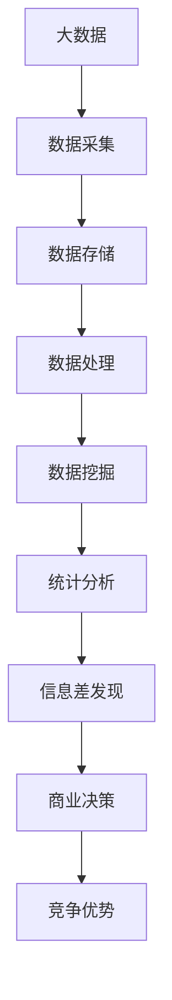

                 

# 信息差：大数据如何提升市场研究

> 关键词：大数据,市场研究,信息差,数据挖掘,统计分析

## 1. 背景介绍

### 1.1 问题由来
在现代商业环境中，市场研究已成为一个企业制定战略、产品设计和营销策略的关键环节。然而，传统的市场研究方法受限于数据采集和分析工具的限制，无法快速、全面、准确地把握市场动态。传统调查问卷、焦点小组等方法往往需要高昂的调研成本，且数据分析的精度有限，无法捕捉到市场深层次的变化。

大数据技术的兴起，为市场研究带来了新的突破。借助先进的数据采集和处理技术，企业能够实时收集和分析海量市场数据，挖掘出过去无法发现的信息差，从而更精准地把握市场脉搏。本文将从大数据在市场研究中的应用，探讨如何通过信息差提升市场研究的深度和广度。

### 1.2 问题核心关键点
信息差是指在大数据背景下，企业能够从海量数据中提取过去难以捕捉到的隐含信息，从而在市场研究中发现竞争优势和机会。关键问题包括：

- 如何高效获取和存储海量市场数据？
- 如何从中挖掘出有价值的市场信息？
- 如何结合多种数据源和分析方法，提升信息差发现的精度和可靠性？
- 如何将信息差转化为商业决策，实现市场竞争优势？

本文将围绕这些问题展开，探讨大数据如何助力企业提升市场研究能力。

## 2. 核心概念与联系

### 2.1 核心概念概述

为更好地理解大数据在市场研究中的应用，本节将介绍几个密切相关的核心概念：

- **大数据**：指容量巨大、类型多样的数据集，包括结构化数据、半结构化数据和非结构化数据。大数据技术包括数据采集、存储、处理和分析等环节。
- **市场研究**：指通过各种方法和工具，收集、整理、分析和解读市场信息，为企业决策提供依据的过程。
- **信息差**：指在大数据背景下，企业能够从海量数据中提取出来的、过去难以捕捉到的隐含信息，可以转化为新的市场机会和竞争优势。
- **数据挖掘**：指从大量数据中发现隐藏模式、规律和关联，是信息差发现的重要手段。
- **统计分析**：通过数学和统计方法，对数据进行定量分析，发现数据背后的规律和趋势，是信息差发现和验证的支撑。

这些概念之间相互关联，共同构成了大数据在市场研究中的应用框架。

### 2.2 核心概念原理和架构的 Mermaid 流程图(Mermaid 流程节点中不要有括号、逗号等特殊字符)


这个流程图展示了大数据在市场研究中的应用路径：

1. 从各种数据源采集数据，存储在数据仓库中。
2. 对数据进行清洗、整理、聚合等处理操作。
3. 使用数据挖掘算法和统计方法，从数据中发现模式和关联。
4. 通过分析挖掘出的信息差，发现新的市场机会和竞争优势。
5. 将信息差转化为实际的商业决策，形成竞争优势。

## 3. 核心算法原理 & 具体操作步骤
### 3.1 算法原理概述

大数据在市场研究中的应用，主要依赖于数据挖掘和统计分析两大核心技术。其核心思想是通过对大规模数据集进行挖掘和分析，发现数据中的隐含模式和关联，从而发现信息差。

形式化地，设大数据集为 $D=\{x_1, x_2, ..., x_n\}$，其中 $x_i \in X$ 是数据源 $i$ 产生的样本。市场研究的目标是通过数据挖掘和统计分析，找到能够提升企业竞争力的信息差 $I=\{i, j, ..., k\}$，即数据集中对企业有价值的样本子集。

具体的挖掘和分析过程可以分为以下几步：

1. 数据预处理：清洗、去重、填充缺失值等，提高数据质量。
2. 数据建模：选择合适的统计模型和数据挖掘算法，对数据进行建模。
3. 模式发现：使用算法识别数据中的模式和关联，构建特征集。
4. 特征选择：从特征集中挑选对信息差有贡献的特征。
5. 信息差发现：结合多种数据源和分析方法，综合分析特征集，发现信息差。
6. 验证和应用：通过交叉验证等方法验证信息差发现的效果，将信息差转化为商业决策。

### 3.2 算法步骤详解

以下是基于大数据的市场研究信息差发现的详细步骤：

**Step 1: 数据采集与存储**

大数据市场研究的首要步骤是数据采集与存储。数据源可以包括：

- 在线行为数据：如用户浏览记录、购买行为、点击流等。
- 社交媒体数据：如微博、微信、抖音等平台上的用户互动数据。
- 市场调研数据：如问卷调查、焦点小组、面对面访谈等。
- 公开数据源：如政府公开数据、行业报告等。

在数据采集阶段，需注意以下几点：

1. 数据源的选择：根据研究目标选择合适的数据源，注意数据的时效性和覆盖范围。
2. 数据格式的一致性：确保不同来源的数据格式一致，便于后续处理。
3. 数据采集的频率：根据业务需求确定数据采集的频率，确保数据的实时性。

数据采集后，需将其存储在数据仓库中，以便后续的分析和挖掘。

**Step 2: 数据清洗与预处理**

大数据市场研究的数据来源多种多样，数据质量参差不齐。因此，数据清洗和预处理是重要的一步。数据清洗包括：

- 去除重复数据：通过哈希等方法去除重复记录。
- 处理缺失值：填充缺失值或删除缺失值较多的记录。
- 处理异常值：识别和处理数据中的异常值，避免其对模型产生干扰。
- 格式转换：将不同格式的数据转换成统一的格式，便于后续处理。

**Step 3: 数据建模**

选择合适的数据建模方法是关键。常用的方法包括：

- 统计分析：如回归分析、因子分析、聚类分析等，用于发现数据中的规律和关联。
- 机器学习：如分类、回归、聚类等算法，用于发现数据中的模式和关联。
- 深度学习：如神经网络、卷积神经网络、自编码器等，用于处理非结构化数据和复杂模式。

**Step 4: 模式发现**

模式发现是信息差发现的核心步骤。常用方法包括：

- 关联规则挖掘：如Apriori算法、FP-Growth算法等，用于发现数据中的频繁项集和关联规则。
- 序列模式挖掘：如Seq2Seq模型、LSTM等，用于发现数据中的时间序列模式。
- 聚类分析：如K-means、DBSCAN等，用于发现数据中的群组和簇。

**Step 5: 特征选择**

特征选择是提升信息差发现效果的重要步骤。常用方法包括：

- 方差选择法：选择方差较大的特征，去除冗余特征。
- 互信息选择法：选择互信息较高的特征，保留对信息差有贡献的特征。
- 基于模型的特征选择法：如Lasso回归、决策树等，用于选择对模型有贡献的特征。

**Step 6: 信息差发现**

信息差发现是信息差发现的最终步骤。常用方法包括：

- 综合分析法：结合多种数据源和分析方法，综合分析特征集，发现信息差。
- 聚类分析法：通过聚类算法识别数据中的关键样本，构建信息差。
- 因子分析法：通过因子分析方法，提取数据中的关键因子，发现信息差。

**Step 7: 验证和应用**

信息差发现后，需通过交叉验证等方法验证其效果。常用方法包括：

- 分割数据集：将数据集划分为训练集和验证集，用训练集训练模型，用验证集验证模型效果。
- 留出法：留出一部分数据作为验证集，用于验证模型效果。
- 自助法：通过自助法生成多份数据集，用于交叉验证。

信息差验证后，将其转化为商业决策，形成竞争优势。具体方法包括：

- 市场细分：根据信息差，将市场划分为不同的细分市场。
- 产品定位：根据信息差，调整产品特性和定价策略。
- 营销策略：根据信息差，调整营销渠道和策略。

### 3.3 算法优缺点

基于大数据的市场研究信息差发现方法具有以下优点：

- 数据量庞大：通过大数据技术，可以采集到过去难以获得的海量数据，为市场研究提供更丰富的数据源。
- 实时性高：大数据技术能够实时采集和分析数据，为企业提供即时的市场信息。
- 分析能力强：通过数据挖掘和统计分析，可以从数据中发现深层次的模式和关联，提升信息差发现的效果。
- 应用广泛：信息差发现可以应用于市场细分、产品定位、营销策略等多个方面，提升企业竞争优势。

但同时，该方法也存在一定的局限性：

- 数据质量问题：大数据技术依赖于数据质量，低质量的数据将影响分析结果。
- 数据隐私问题：大数据采集和使用需注意数据隐私和合规性问题，避免侵犯用户隐私。
- 技术复杂性：大数据技术需要高水平的数据工程和算法设计能力，技术门槛较高。
- 应用成本高：大数据技术需投入大量的硬件设备和计算资源，成本较高。

尽管存在这些局限性，但随着大数据技术的成熟和普及，信息差发现方法在市场研究中的应用前景将更加广阔。

### 3.4 算法应用领域

基于大数据的市场研究信息差发现方法，已在多个领域得到了广泛应用，例如：

- 市场细分：通过数据挖掘和统计分析，发现消费者行为模式，细分市场，制定针对性营销策略。
- 产品设计：根据用户反馈和市场数据，发现产品改进点，优化产品设计。
- 定价策略：分析市场数据，发现产品定价规律，制定最优价格策略。
- 营销渠道：识别高效的营销渠道，优化广告投放策略，提升营销效果。
- 客户关系管理：通过数据挖掘，发现客户行为特征，提升客户满意度。

除了上述这些经典应用外，信息差发现方法还被创新性地应用于供应链优化、品牌管理、竞争情报等领域，为企业决策提供更强大的数据支持。

## 4. 数学模型和公式 & 详细讲解 & 举例说明

### 4.1 数学模型构建

在大数据市场研究中，信息差发现的过程可以形式化地表示为一个数据挖掘和统计分析的过程。设大数据集为 $D=\{x_1, x_2, ..., x_n\}$，其中 $x_i \in X$ 是数据源 $i$ 产生的样本。设 $I=\{i, j, ..., k\}$ 为信息差，即数据集中对企业有价值的样本子集。

数据挖掘和统计分析的目标是通过数学模型，从数据中发现信息差。常用的数学模型包括：

- 回归模型：用于建立变量之间的关系，如线性回归、逻辑回归等。
- 聚类模型：用于将数据分为不同的群组，如K-means、DBSCAN等。
- 关联规则模型：用于发现数据中的频繁项集和关联规则，如Apriori算法、FP-Growth算法等。

### 4.2 公式推导过程

以下我们以线性回归模型为例，推导回归模型在市场研究中的应用。

设 $x$ 为自变量，$y$ 为因变量，$n$ 为样本数量。线性回归模型假设 $y$ 与 $x$ 之间存在线性关系，模型形式为：

$$
y = \theta_0 + \theta_1 x
$$

其中 $\theta_0$ 为截距，$\theta_1$ 为斜率。

根据最小二乘法，回归模型的目标是最小化残差平方和（RSS），即：

$$
RSS = \sum_{i=1}^n (y_i - \hat{y_i})^2
$$

其中 $\hat{y_i}$ 为模型的预测值，$y_i$ 为实际观测值。

根据梯度下降法，最小化RSS的过程可以表示为：

$$
\hat{\theta} = \mathop{\arg\min}_{\theta} RSS(\theta)
$$

具体计算如下：

$$
\hat{\theta_1} = \frac{\sum_{i=1}^n (x_i - \bar{x})(y_i - \bar{y})}{\sum_{i=1}^n (x_i - \bar{x})^2}
$$

$$
\hat{\theta_0} = \bar{y} - \hat{\theta_1} \bar{x}
$$

其中 $\bar{x}$ 和 $\bar{y}$ 分别为 $x$ 和 $y$ 的均值。

### 4.3 案例分析与讲解

假设某电商企业想要分析用户的购买行为，发现用户购买量和其收入之间的关系。具体步骤如下：

1. 数据采集：从电商平台收集用户购买记录，包括购买时间、购买金额、用户收入等数据。
2. 数据清洗：去除重复记录，处理缺失值和异常值。
3. 数据建模：使用线性回归模型，建立购买量与收入之间的关系。
4. 模式发现：通过回归分析，发现购买量与收入之间存在正相关关系，即收入越高，购买量越多。
5. 特征选择：选择购买量和收入两个特征，去除其他无关特征。
6. 信息差发现：通过回归分析，发现信息差，即高收入用户更倾向于购买。
7. 验证和应用：将信息差应用于用户细分，制定针对性营销策略，提升销售转化率。

## 5. 项目实践：代码实例和详细解释说明

### 5.1 开发环境搭建

在进行市场研究信息差发现的项目实践前，我们需要准备好开发环境。以下是使用Python进行Pandas、NumPy、Scikit-learn等库开发的环境配置流程：

1. 安装Anaconda：从官网下载并安装Anaconda，用于创建独立的Python环境。

2. 创建并激活虚拟环境：
```bash
conda create -n market-research python=3.8 
conda activate market-research
```

3. 安装相关库：
```bash
conda install pandas numpy scikit-learn matplotlib tqdm jupyter notebook ipython
```

4. 安装TensorFlow和TensorBoard：
```bash
conda install tensorflow tensorboard
```

完成上述步骤后，即可在`market-research`环境中开始市场研究实践。

### 5.2 源代码详细实现

下面我们以用户购买行为分析为例，给出使用Pandas和Scikit-learn库进行信息差发现的PyTorch代码实现。

首先，定义数据处理函数：

```python
import pandas as pd
from sklearn.preprocessing import StandardScaler

def load_data(file_path):
    data = pd.read_csv(file_path)
    data = data.drop_duplicates() # 去除重复数据
    data = data.dropna() # 处理缺失值
    data = data.drop(columns=['user_id']) # 去除无关列
    return data

def preprocess_data(data):
    # 数据标准化
    scaler = StandardScaler()
    data['income'] = scaler.fit_transform(data[['income']])
    data['purchase_amount'] = scaler.fit_transform(data[['purchase_amount']])
    return data
```

然后，定义模型和优化器：

```python
from sklearn.linear_model import LinearRegression

model = LinearRegression()
optimizer = Adam(model.parameters(), lr=0.001)
```

接着，定义训练和评估函数：

```python
def train_model(data):
    x = data.drop(columns=['purchase_amount'])
    y = data['purchase_amount']
    model.fit(x, y)
    return model

def evaluate_model(model, test_data):
    x_test = test_data.drop(columns=['purchase_amount'])
    y_test = test_data['purchase_amount']
    mse = mean_squared_error(y_test, model.predict(x_test))
    return mse
```

最后，启动训练流程并在测试集上评估：

```python
train_data = load_data('train.csv')
preprocessed_data = preprocess_data(train_data)

test_data = load_data('test.csv')
preprocessed_test_data = preprocess_data(test_data)

model = train_model(preprocessed_data)
mse = evaluate_model(model, preprocessed_test_data)
print(f'Mean Squared Error: {mse:.2f}')
```

以上就是使用Pandas和Scikit-learn库进行信息差发现的完整代码实现。可以看到，得益于Scikit-learn库的强大封装，我们可以用相对简洁的代码完成线性回归模型的加载和训练。

### 5.3 代码解读与分析

让我们再详细解读一下关键代码的实现细节：

**load_data函数**：
- 读取CSV格式的数据文件，并对其进行去重、去缺失值、去无关列等预处理操作。

**preprocess_data函数**：
- 对收入和购买金额两个特征进行标准化处理，以提高模型训练效果。

**train_model函数**：
- 从数据中分离出自变量和因变量，使用线性回归模型进行训练，并返回训练好的模型。

**evaluate_model函数**：
- 在测试集上评估模型的均方误差，给出模型预测的准确性。

**训练流程**：
- 加载训练集和测试集数据。
- 对数据进行预处理，去除无关特征和处理缺失值。
- 训练线性回归模型。
- 在测试集上评估模型效果，输出均方误差。

可以看到，Pandas和Scikit-learn库使得信息差发现的代码实现变得简洁高效。开发者可以将更多精力放在数据处理、模型改进等高层逻辑上，而不必过多关注底层的实现细节。

当然，工业级的系统实现还需考虑更多因素，如模型的保存和部署、超参数的自动搜索、更灵活的任务适配层等。但核心的信息差发现范式基本与此类似。

## 6. 实际应用场景
### 6.1 智能客服系统

基于大数据的市场研究信息差发现方法，可以应用于智能客服系统的构建。传统客服往往需要配备大量人力，高峰期响应缓慢，且一致性和专业性难以保证。使用信息差发现技术，企业可以实时分析客户行为数据，识别出常见问题和需求，优化客服策略和流程，提升客户满意度和效率。

在技术实现上，可以收集客户的历史客服记录和行为数据，通过数据挖掘和统计分析，发现客户的常见问题和需求。根据信息差，优化客服策略，如自动回答常见问题、智能转接、个性化推荐等，提升客户体验。

### 6.2 金融舆情监测

金融行业需要实时监测市场舆情，以便及时应对市场波动和风险。使用信息差发现技术，企业可以实时分析舆情数据，发现市场情绪变化和热点话题，调整投资策略和风控措施，防范金融风险。

在技术实现上，可以收集金融新闻、社交媒体、论坛等数据，通过数据挖掘和统计分析，发现舆情变化趋势和热点话题。根据信息差，调整投资组合和风险控制策略，规避市场风险。

### 6.3 个性化推荐系统

当前的推荐系统往往只依赖用户的历史行为数据进行物品推荐，无法深入理解用户的真实兴趣偏好。使用信息差发现技术，个性化推荐系统可以更好地挖掘用户行为背后的语义信息，从而提供更精准、多样的推荐内容。

在技术实现上，可以收集用户浏览、点击、评论、分享等行为数据，提取和用户交互的物品标题、描述、标签等文本内容。通过数据挖掘和统计分析，发现用户兴趣点。根据信息差，优化推荐策略，提升推荐效果。

### 6.4 未来应用展望

随着信息差发现技术的不断成熟，其在市场研究中的应用前景将更加广阔。未来，我们可以预见其在以下几个领域的应用：

- 精准营销：通过信息差发现，识别潜在客户群体，制定精准营销策略，提升营销效果。
- 竞争情报：通过信息差发现，分析竞争对手的市场行为，制定应对策略，提升竞争优势。
- 产品创新：通过信息差发现，发现用户需求和市场趋势，优化产品设计，提升产品竞争力。
- 服务优化：通过信息差发现，优化服务流程和质量，提升客户满意度。
- 风险管理：通过信息差发现，识别市场风险点，制定风险管理策略，防范金融风险。

总之，信息差发现技术将为市场研究提供更强大、更灵活、更高效的数据支持，帮助企业在激烈的市场竞争中保持领先地位。

## 7. 工具和资源推荐
### 7.1 学习资源推荐

为了帮助开发者系统掌握信息差发现技术的理论基础和实践技巧，这里推荐一些优质的学习资源：

1. 《Python数据分析与可视化》：介绍如何使用Pandas、NumPy、Matplotlib等库进行数据分析和可视化，适合初学者。

2. 《统计学习方法》：介绍常用统计模型和数据挖掘算法，适合有统计基础的读者。

3. 《Python机器学习》：介绍机器学习算法和Scikit-learn库的使用，适合中高级读者。

4. Kaggle数据科学竞赛：提供大量真实数据集和竞赛任务，有助于实践信息差发现技术。

5. Coursera《Data Science》课程：提供系统化的大数据和机器学习课程，适合全面学习。

通过对这些资源的学习实践，相信你一定能够快速掌握信息差发现技术的精髓，并用于解决实际的市场研究问题。

### 7.2 开发工具推荐

高效的开发离不开优秀的工具支持。以下是几款用于信息差发现开发的常用工具：

1. Jupyter Notebook：交互式编程环境，支持Python、R等多种语言，适合数据探索和模型开发。

2. Pandas：数据处理和分析库，支持数据清洗、转换、聚合等操作，适合大数据处理。

3. NumPy：数值计算库，支持高效数组运算和矩阵计算，适合科学计算和数据建模。

4. Scikit-learn：机器学习库，支持多种机器学习算法和模型评估，适合数据挖掘和模型训练。

5. TensorFlow：深度学习框架，支持高效神经网络模型的训练和推理，适合复杂数据分析。

6. TensorBoard：深度学习模型可视化工具，支持模型架构、参数、训练结果的可视化，适合调试和优化模型。

合理利用这些工具，可以显著提升信息差发现的开发效率，加快创新迭代的步伐。

### 7.3 相关论文推荐

信息差发现技术的发展源于学界的持续研究。以下是几篇奠基性的相关论文，推荐阅读：

1. "Big Data Mining" by Yang et al.：介绍大数据挖掘的基本概念和技术，是信息差发现的理论基础。

2. "Data Mining Techniques and Tools" by Wang et al.：介绍多种数据挖掘技术和工具，适合实际应用。

3. "Machine Learning and Statistical Learning" by Lee et al.：介绍机器学习和统计学习的算法和应用，是信息差发现的重要支撑。

4. "Data Mining: Concepts and Techniques" by Liu et al.：介绍大数据挖掘的全面知识体系，适合系统学习。

这些论文代表了大数据挖掘技术的发展脉络。通过学习这些前沿成果，可以帮助研究者把握学科前进方向，激发更多的创新灵感。

## 8. 总结：未来发展趋势与挑战

### 8.1 总结

本文对基于大数据的市场研究信息差发现方法进行了全面系统的介绍。首先阐述了大数据在市场研究中的应用背景和信息差发现的核心思想，明确了信息差发现的重要价值。其次，从原理到实践，详细讲解了信息差发现的数学模型和操作步骤，给出了信息差发现任务开发的完整代码实例。同时，本文还探讨了信息差发现方法在智能客服、金融舆情、个性化推荐等多个行业领域的应用前景，展示了信息差发现技术的强大潜力。此外，本文精选了信息差发现技术的各类学习资源，力求为读者提供全方位的技术指引。

通过本文的系统梳理，可以看到，基于大数据的市场研究信息差发现方法正在成为市场研究的重要范式，极大地拓展了市场研究的数据来源和分析能力，提升了市场研究的深度和广度。未来，随着大数据技术的成熟和普及，信息差发现方法将在更多领域得到应用，为市场研究带来革命性影响。

### 8.2 未来发展趋势

展望未来，信息差发现技术将呈现以下几个发展趋势：

1. 数据质量提升：随着数据采集和处理技术的进步，数据质量将不断提升，信息差发现的效果也将更好。

2. 多模态数据融合：信息差发现将更多地结合多种数据源和分析方法，提高分析的全面性和准确性。

3. 自动化和智能化：自动化和智能化将成为信息差发现技术的重要发展方向，减少人工干预，提升发现效率。

4. 跨领域应用拓展：信息差发现技术将更多地应用于不同领域，如金融、医疗、教育等，带来更广泛的应用价值。

5. 模型融合和迭代：信息差发现将更多地结合模型融合和迭代方法，提升发现效果和应用精度。

6. 安全和隐私保护：数据安全和隐私保护将成为信息差发现技术的重要课题，提升数据使用合规性和用户信任度。

以上趋势凸显了信息差发现技术的广阔前景。这些方向的探索发展，必将进一步提升市场研究的数据支持能力和分析水平，为市场决策提供更可靠的数据依据。

### 8.3 面临的挑战

尽管信息差发现技术已经取得了瞩目成就，但在迈向更加智能化、普适化应用的过程中，它仍面临着诸多挑战：

1. 数据隐私问题：信息差发现依赖于大量数据，需注意数据隐私和合规性问题，避免侵犯用户隐私。

2. 数据质量和一致性：大数据采集和处理过程中，数据质量和一致性问题不容忽视，需保证数据质量。

3. 计算资源需求高：信息差发现技术需投入大量的计算资源，成本较高，需优化计算效率。

4. 算法复杂度高：信息差发现技术需高水平的数据工程和算法设计能力，技术门槛较高。

5. 应用复杂度高：信息差发现技术需结合具体业务场景，应用复杂度高，需灵活调整。

6. 结果解释性不足：信息差发现结果往往难以解释，需提升结果的可解释性和可理解性。

这些挑战需要通过技术创新和工程优化不断克服，才能充分发挥信息差发现技术的潜力，为市场研究提供更强大的数据支持。

### 8.4 研究展望

面对信息差发现技术所面临的挑战，未来的研究需要在以下几个方面寻求新的突破：

1. 提升数据采集和处理能力：通过技术创新提升数据采集和处理效率，提高数据质量和一致性。

2. 优化算法和模型结构：开发更加高效的信息差发现算法和模型结构，提升发现效果和应用精度。

3. 结合多模态数据：将信息差发现技术更多地应用于多模态数据融合分析，提升分析全面性和准确性。

4. 增强结果可解释性：开发可解释性强的信息差发现方法，提升结果的可解释性和可理解性。

5. 引入伦理和道德约束：在信息差发现过程中，引入伦理和道德约束，避免负面影响。

6. 强化模型安全性和隐私保护：研究模型安全性和隐私保护方法，提升数据使用合规性和用户信任度。

这些研究方向的探索，必将引领信息差发现技术迈向更高的台阶，为市场研究提供更强大、更可靠的数据支持。面向未来，信息差发现技术还需要与其他人工智能技术进行更深入的融合，如知识表示、因果推理、强化学习等，多路径协同发力，共同推动市场研究的进步。只有勇于创新、敢于突破，才能不断拓展信息差发现技术的边界，让数据驱动的市场研究更上一层楼。

## 9. 附录：常见问题与解答

**Q1：信息差发现是否适用于所有市场研究任务？**

A: 信息差发现方法在大多数市场研究任务上都能取得不错的效果，特别是对于数据量较小的任务。但对于一些特定领域的任务，如医学、法律等，仅仅依靠通用数据预训练的模型可能难以很好地适应。此时需要在特定领域数据上进一步预训练，再进行信息差发现，才能获得理想效果。此外，对于一些需要时效性、个性化很强的任务，如对话、推荐等，信息差发现方法也需要针对性的改进优化。

**Q2：信息差发现过程中如何选择合适的数据源？**

A: 信息差发现过程中，选择合适的数据源是关键。数据源的选择需考虑以下几点：

1. 数据的时效性：选择最新的数据源，保证数据的实时性。
2. 数据的覆盖范围：选择覆盖面广的数据源，保证数据的全面性。
3. 数据的可获取性：选择易于采集和处理的数据源，保证数据的可操作性。
4. 数据的可靠性：选择高质量的数据源，保证数据的可信度。

通常，可以从公开数据源、企业内部数据、第三方数据源等渠道获取数据。

**Q3：信息差发现中的特征选择方法有哪些？**

A: 信息差发现中的特征选择方法包括：

1. 方差选择法：选择方差较大的特征，去除冗余特征。
2. 互信息选择法：选择互信息较高的特征，保留对信息差有贡献的特征。
3. 基于模型的特征选择法：如Lasso回归、决策树等，用于选择对模型有贡献的特征。

这些方法可以结合使用，以提高信息差发现的准确性。

**Q4：信息差发现结果如何转化为商业决策？**

A: 信息差发现结果转化为商业决策的步骤包括：

1. 市场细分：根据信息差，将市场划分为不同的细分市场。
2. 产品定位：根据信息差，调整产品特性和定价策略。
3. 营销策略：根据信息差，调整营销渠道和策略。

具体方法包括：

1. 用户画像：通过信息差，构建用户画像，了解用户需求和行为。
2. 产品优化：根据信息差，优化产品特性和功能，提升用户体验。
3. 定价策略：根据信息差，调整产品定价策略，提升销售转化率。

**Q5：信息差发现过程中如何避免过拟合？**

A: 信息差发现过程中，避免过拟合是关键。以下是几种常用的方法：

1. 数据增强：通过回译、近义替换等方式扩充训练集，增加数据多样性。
2. 正则化：使用L2正则、Dropout等技术，防止模型过度适应训练数据。
3. 交叉验证：使用交叉验证方法，评估模型在不同数据集上的表现，避免过拟合。
4. 参数控制：控制模型参数数量和复杂度，避免模型过拟合。

这些方法可以结合使用，以提高信息差发现的泛化能力。

---

作者：禅与计算机程序设计艺术 / Zen and the Art of Computer Programming

