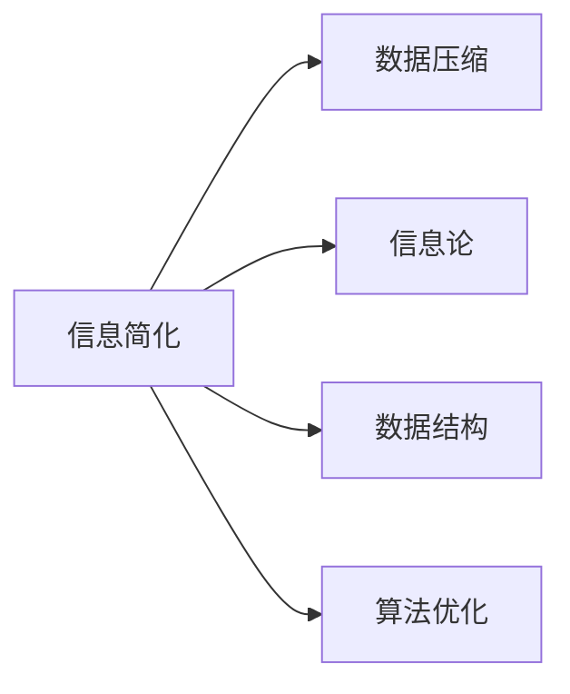

                 

# 信息简化的原则与艺术：在混乱中建立秩序与简化

> 关键词：信息简化, 数据压缩, 信息论, 数据结构, 算法优化

## 1. 背景介绍

在当今信息化时代，数据和信息的海量增长为社会进步提供了无限的可能性，但同时也带来了巨大挑战。信息过载、噪音干扰等问题，使有效获取和处理信息变得复杂困难。如何在信息爆炸的背景下，科学简化信息，使其更易于理解和应用，是信息时代急需解决的重要课题。本文将探讨信息简化的原则与艺术，通过理论与实践相结合的方式，揭示简化信息的策略与方法，帮助人们在混乱中建立秩序，实现信息的有效利用。

## 2. 核心概念与联系

### 2.1 核心概念概述

为深入理解信息简化的过程，本文将介绍几个关键概念及其间的联系：

- **信息简化**：通过去除冗余、消除噪音、优化结构等方式，使信息更易于理解、处理和应用的过程。
- **数据压缩**：在保证信息准确性的前提下，减少数据量，提升数据存储和传输效率的技术。
- **信息论**：研究信息传递、存储和处理的理论框架，包括熵、互信息、通道容量等基本概念。
- **数据结构**：用于组织和存储数据的逻辑和方法，如数组、链表、树等。
- **算法优化**：通过对算法进行改进来提升其效率和性能，如动态规划、贪心算法、分治策略等。

以上概念之间相互关联，信息简化涉及数据压缩、信息论、数据结构等基础理论，同时需要依靠算法优化来具体实现。

### 2.2 核心概念原理和架构的 Mermaid 流程图



这个流程图展示了信息简化的核心概念及其之间的联系。信息简化不仅依赖于压缩技术去除冗余，也需要通过信息论和数据结构分析数据的本质特征，最后通过算法优化提升处理效率。

## 3. 核心算法原理 & 具体操作步骤
### 3.1 算法原理概述

信息简化的核心在于有效去除冗余、减少噪音，同时保留信息的关键特征。算法的核心原理包括：

1. **冗余去除**：识别和移除信息中的重复部分，提升信息的压缩效率。
2. **噪音消除**：通过统计分析和信息压缩算法，减少或消除数据中的噪音和干扰。
3. **关键特征提取**：利用信息论和数据结构分析，提取信息的核心特征，简化表达。
4. **算法优化**：通过动态规划、贪心算法等优化技术，提升信息简化的处理速度。

### 3.2 算法步骤详解

信息简化的算法步骤通常包括以下几个关键环节：

1. **数据预处理**：对原始数据进行清洗和预处理，去除噪音，填补缺失值，统一数据格式。
2. **冗余识别与去除**：使用信息熵、Huffman编码等技术，识别并去除数据中的冗余部分。
3. **关键特征提取**：应用主成分分析(PCA)、奇异值分解(SVD)等算法，提取数据的关键特征，简化数据表达。
4. **算法优化**：根据具体问题，选择合适的算法优化策略，如动态规划、贪心算法、分治策略等，提升信息简化的效率。

### 3.3 算法优缺点

信息简化的算法具有以下优点：

1. **效率提升**：通过冗余去除和特征提取，大幅减少了数据的存储和传输成本。
2. **准确性保持**：在保证信息准确性的前提下，实现了信息的有效压缩和简化。
3. **灵活性高**：信息简化算法可以根据具体任务和数据特点进行调整和优化。

但同时也存在一些局限性：

1. **复杂度高**：冗余识别、特征提取、算法优化等步骤可能需要复杂的计算，增加了处理的复杂度。
2. **数据依赖性**：算法的性能高度依赖于数据的特性，不同数据集可能需要不同的处理方法。
3. **鲁棒性不足**：在数据存在高度相关性或噪声的情况下，简化效果可能不尽如人意。

### 3.4 算法应用领域

信息简化的算法在多个领域得到了广泛应用，例如：

1. **数据存储与管理**：用于优化数据库和存储系统，提升数据存储效率，减少冗余。
2. **图像和视频处理**：应用于图像压缩、视频编码等领域，减少数据量，提升传输速度。
3. **自然语言处理**：在文本分类、摘要生成、机器翻译等任务中，通过简化信息，提升处理效率和效果。
4. **信号处理**：在音频、图像等信号处理中，通过去除冗余和噪音，提高信号质量。
5. **生物信息学**：在基因组序列分析中，通过简化和压缩DNA序列，提升数据分析速度和准确性。

以上领域展示了信息简化算法的多样应用场景，其在提升数据处理效率和降低成本方面具有重要意义。

## 4. 数学模型和公式 & 详细讲解 & 举例说明

### 4.1 数学模型构建

信息简化的数学模型建立在信息论和数据结构的基础之上。以下以信息熵为核心的数学模型为例，介绍信息简化的基本数学框架。

**信息熵定义**：

$$
H(X) = -\sum_{x \in X} p(x) \log p(x)
$$

其中，$X$ 为信息源的取值集合，$p(x)$ 为事件 $x$ 的概率。

**平均信息熵**：

$$
H(X) = -\sum_{x \in X} p(x) \log p(x)
$$

信息熵反映了信息源的平均不确定性，熵越小，信息源越有序，信息量越小。

### 4.2 公式推导过程

以Huffman编码为例，介绍信息简化的具体数学推导过程。

**Huffman编码**：

1. 统计字符集 $C$ 中每个字符 $c$ 的出现频率 $f(c)$。
2. 构建一个优先队列，将字符及其频率加入队列。
3. 从队列中取出两个字符 $c_1, c_2$，合并为一个字符 $c_{12}$，其频率为 $f(c_1) + f(c_2)$。
4. 重复步骤3，直到队列中只剩一个字符 $c$，这就是根节点。
5. 从根节点到每个叶子节点的路径，即为该字符的编码。

通过Huffman编码，字符集中的每个字符都用一个唯一的编码表示，且编码长度与字符的出现频率相关，频率高的字符用较短的编码表示。这使得整个编码的平均长度最小，从而实现了信息的压缩。

### 4.3 案例分析与讲解

以文本压缩为例，展示信息简化的具体应用。

**文本压缩算法**：

1. 将文本中的重复单词、句子进行替换或省略。
2. 利用Huffman编码或其他压缩算法，减少文本长度。
3. 对压缩后的文本进行分块，增加冗余度。
4. 对分块后的文本进行编码，生成压缩文件。

通过上述步骤，原始文本的冗余被显著去除，文件大小大幅减小，同时保留了文本的关键信息，实现了信息简化。

## 5. 项目实践：代码实例和详细解释说明

### 5.1 开发环境搭建

进行信息简化项目的开发，首先需要搭建开发环境。以下是使用Python进行Pandas和NumPy开发的环境配置流程：

1. 安装Anaconda：从官网下载并安装Anaconda，用于创建独立的Python环境。

2. 创建并激活虚拟环境：
```bash
conda create -n pyenv python=3.8 
conda activate pyenv
```

3. 安装Pandas和NumPy：
```bash
pip install pandas numpy
```

4. 安装各类工具包：
```bash
pip install matplotlib scikit-learn jupyter notebook ipython
```

完成上述步骤后，即可在`pyenv`环境中开始信息简化的实践。

### 5.2 源代码详细实现

以下是一个简单的Python代码示例，展示如何通过Huffman编码对文本进行压缩：

```python
import collections
import heapq
import os
from itertools import groupby
from collections import defaultdict

# 文本预处理
def preprocess_text(text):
    text = text.lower()  # 转换为小写
    text = ''.join(ch for ch in text if ch.isalpha())  # 去除非字母字符
    return text

# Huffman编码
def huffman_encoding(text):
    freq = collections.Counter(text)
    priority_queue = [[weight, [char, '']] for char, weight in freq.items()]
    heapq.heapify(priority_queue)
    while len(priority_queue) > 1:
        lo = heapq.heappop(priority_queue)
        hi = heapq.heappop(priority_queue)
        for pair in lo[1:]:
            pair[1] = '0' + pair[1]
        for pair in hi[1:]:
            pair[1] = '1' + pair[1]
        heapq.heappush(priority_queue, [lo[0] + hi[0]] + lo[1:] + hi[1:])
    return sorted(heapq.heappop(priority_queue)[1:], key=lambda p: (len(p[1]), p[0]))

# 压缩与解压
def compress_text(text):
    encoding = huffman_encoding(text)
    compressed_text = ''
    for char, code in encoding:
        compressed_text += code * text.count(char)
    return compressed_text

def decompress_text(compressed_text, encoding):
    decompressed_text = ''
    i = 0
    while i < len(compressed_text):
        char = encoding[i]
        count = ''
        while compressed_text[i] == char[0]:
            count += char[0]
            i += 1
        decompressed_text += char[1] * int(count)
        i += len(count)
    return decompressed_text

# 测试
text = 'Hello, World! This is a test string for Huffman compression.'
preprocessed_text = preprocess_text(text)
encoding = huffman_encoding(preprocessed_text)
compressed_text = compress_text(preprocessed_text)
decompressed_text = decompress_text(compressed_text, encoding)

print('Original text:', text)
print('Compressed text:', compressed_text)
print('Decompressed text:', decompressed_text)
```

这段代码实现了文本的Huffman编码压缩与解压缩功能。通过预处理、编码、压缩和解压，可以显著减少文本的大小，同时保留关键信息。

### 5.3 代码解读与分析

以下是代码的详细解读：

**preprocess_text函数**：
- 将文本转换为小写。
- 去除非字母字符。

**huffman_encoding函数**：
- 统计字符频率。
- 使用堆排序构建Huffman树。
- 生成编码字典。

**compress_text函数**：
- 根据编码字典生成压缩字符串。

**decompress_text函数**：
- 根据编码字典解码压缩字符串。

测试部分展示了完整的文本压缩与解压缩流程。可以看到，通过Huffman编码，文本的大小被显著压缩，且解压缩后的文本与原始文本完全一致，实现了信息的有效简化。

## 6. 实际应用场景

### 6.1 数据存储与管理

在数据存储与管理领域，信息简化技术可以显著提升数据存储效率。例如，通过压缩数据库的日志文件和临时数据，可以减少存储需求，降低硬件成本，提高系统性能。

### 6.2 图像和视频处理

在图像和视频处理中，信息简化技术通过去除冗余信息，可以大幅减小文件大小，提升传输速度。例如，JPEG、PNG等图像压缩算法，MPEG、H.264等视频压缩算法，均是基于信息简化的思想设计的。

### 6.3 自然语言处理

在自然语言处理领域，信息简化技术广泛应用于文本摘要、机器翻译、问答系统等任务。通过压缩和简化文本信息，提升处理效率和效果。例如，BERT、GPT等预训练语言模型，已经展示了在自然语言处理任务中通过信息简化提升性能的潜力。

### 6.4 未来应用展望

未来，信息简化技术将在更多领域得到应用，推动信息技术的进一步发展。

1. **物联网**：在物联网设备的数据传输和存储中，信息简化技术可以显著提升设备效率和通信质量。
2. **人工智能**：在大规模训练和推理过程中，信息简化技术可以加速模型收敛，降低计算资源消耗。
3. **智慧城市**：在智慧城市数据处理和决策支持中，信息简化技术可以优化数据采集和分析流程，提高决策效率。
4. **医学影像**：在医学影像分析中，信息简化技术可以优化图像处理和分析过程，提升诊断准确性。

## 7. 工具和资源推荐

### 7.1 学习资源推荐

为了帮助开发者系统掌握信息简化的理论基础和实践技巧，这里推荐一些优质的学习资源：

1. **《信息论基础》**：阐述了信息论的基本概念和原理，是理解信息简化的重要基础。
2. **《数据结构与算法分析》**：介绍了数据结构和算法优化的基本方法，适用于信息简化的算法实现。
3. **Coursera《Algorithms, Part I》**：由普林斯顿大学开设的算法课程，涵盖动态规划、贪心算法等优化算法。
4. **Kaggle数据科学竞赛**：通过实践竞赛项目，提升信息简化技术的实际应用能力。
5. **GitHub开源项目**：提供大量信息简化算法的代码实现和案例分析，供学习和借鉴。

### 7.2 开发工具推荐

高效的开发离不开优秀的工具支持。以下是几款用于信息简化开发的常用工具：

1. **Python**：作为数据科学和信息处理的主流语言，Python提供了丰富的科学计算和数据处理库，如Pandas、NumPy、Scikit-learn等。
2. **Jupyter Notebook**：用于数据分析和算法实验的交互式编程环境，支持代码运行、可视化输出、代码分享等。
3. **TensorFlow**：谷歌推出的开源深度学习框架，提供了丰富的算法优化和模型训练功能。
4. **PyTorch**：Facebook开源的深度学习框架，支持动态图计算，便于算法实现和优化。

### 7.3 相关论文推荐

信息简化技术的研究源于学界的持续探索。以下是几篇奠基性的相关论文，推荐阅读：

1. **《信息论的数学基础》**：克劳德·香农的经典著作，奠定了信息论的理论基础。
2. **《一种简单的压缩算法》**：丹尼斯·里奇和布莱恩·克尼汉的杰作，介绍了Huffman编码等压缩算法。
3. **《基于深度学习的文本压缩技术》**：介绍使用深度学习技术进行文本压缩的方法和实验结果。
4. **《信息简化的数学模型与算法》**：综述了信息简化的数学模型和算法，适合深入学习。
5. **《自然语言处理中的信息简化技术》**：探讨信息简化在自然语言处理中的应用，展示了多种优化策略。

## 8. 总结：未来发展趋势与挑战

### 8.1 总结

本文对信息简化的原则与艺术进行了全面系统的介绍。首先阐述了信息简化的重要性和应用场景，明确了信息简化在数据存储、图像处理、自然语言处理等领域的潜在价值。其次，从原理到实践，详细讲解了信息简化的数学模型和算法步骤，给出了具体的代码实现和分析。最后，本文还探讨了信息简化的未来发展趋势和面临的挑战，为相关研究和应用提供了方向和指导。

通过本文的系统梳理，可以看到，信息简化技术正在成为信息处理领域的重要手段，极大地提升了数据存储、图像处理、自然语言处理等环节的效率和效果。未来，伴随深度学习、人工智能等技术的持续进步，信息简化技术将迎来新的突破，进一步拓展信息处理的边界，推动智能化社会的建设。

### 8.2 未来发展趋势

展望未来，信息简化技术将呈现以下几个发展趋势：

1. **自动化与智能化**：随着深度学习技术的发展，信息简化算法将变得更加自动化和智能化，能够根据具体任务自动选择最优的简化策略。
2. **跨领域应用**：信息简化技术将在更多领域得到应用，如物联网、智慧城市、医疗影像等，实现信息处理的全方位优化。
3. **数据隐私保护**：在数据隐私保护方面，信息简化技术将发挥重要作用，通过压缩和简化敏感数据，提高数据传输和存储的安全性。
4. **实时处理**：信息简化技术将朝着实时处理方向发展，通过高效压缩算法和硬件加速，实现数据的实时采集、分析和反馈。

以上趋势展示了信息简化技术的广阔前景。这些方向的探索发展，必将进一步提升信息处理的效率和效果，推动信息技术的不断进步。

### 8.3 面临的挑战

尽管信息简化技术已经取得了显著成果，但在迈向更加智能化、自动化、实时化的应用过程中，仍面临诸多挑战：

1. **复杂度增加**：随着深度学习和大数据技术的应用，信息简化算法的复杂度显著增加，如何简化算法实现，提升处理效率，是一个亟待解决的问题。
2. **数据适应性**：不同领域的数据具有复杂多样的特性，信息简化算法需要具备更强的适应性和灵活性，才能在多个场景中发挥作用。
3. **安全性和隐私**：在处理敏感数据时，信息简化技术需要兼顾安全性和隐私保护，防止数据泄露和滥用。
4. **资源消耗**：信息简化技术的实现需要大量的计算资源，如何在保证处理效果的前提下，降低计算成本，也是一个重要挑战。
5. **跨平台兼容性**：信息简化算法需要在不同平台和设备上实现高效运行，需要考虑平台兼容性和代码优化。

这些挑战需要学术界和工业界共同努力，通过不断的技术创新和实践积累，逐步克服，推动信息简化技术的成熟和普及。

### 8.4 研究展望

面对信息简化技术所面临的挑战，未来的研究需要在以下几个方面寻求新的突破：

1. **算法优化**：开发更加高效、自动化的信息简化算法，减少计算资源消耗，提升处理速度。
2. **跨领域应用**：推动信息简化技术在更多领域的应用，如医疗、金融、工业等，提升数据处理的智能化水平。
3. **安全性与隐私**：引入区块链、密码学等技术，保障信息简化过程的安全性和隐私保护。
4. **实时处理**：研究实时信息压缩和简化技术，提升数据的实时处理能力。
5. **模型融合**：将信息简化技术与深度学习、自然语言处理等技术进行深度融合，提升信息处理的效果和智能化水平。

这些研究方向的探索，必将引领信息简化技术迈向更高的台阶，为构建智能社会奠定坚实基础。面向未来，信息简化技术还需要与其他人工智能技术进行更深入的融合，共同推动信息处理和智能化社会的建设。只有勇于创新、敢于突破，才能不断拓展信息简化的边界，让信息处理技术更好地服务于人类社会。

## 9. 附录：常见问题与解答

**Q1：信息简化与数据压缩有何区别？**

A: 信息简化与数据压缩是密切相关的概念，但侧重点略有不同。数据压缩主要是通过去除数据中的冗余部分，减少数据量，提高存储和传输效率。而信息简化则更加注重数据的理解和应用，通过提取和保留关键信息，简化表达，提升信息处理效率。

**Q2：信息简化是否适用于所有数据类型？**

A: 信息简化的效果高度依赖于数据的特性。对于结构化数据，如表格数据，可以通过Huffman编码等算法实现高效压缩。但对于非结构化数据，如文本、音频、图像等，信息简化的效果可能不如压缩算法显著。因此，选择合适的方法，根据具体数据类型进行信息简化，才能获得理想的效果。

**Q3：如何选择合适的信息简化算法？**

A: 选择合适的信息简化算法需要考虑多个因素，如数据类型、数据规模、算法复杂度、应用场景等。一般情况下，可以选择以下方法：

1. 数据预处理：清洗、去重、归一化等操作，减少数据冗余。
2. 特征提取：通过主成分分析、奇异值分解等方法，提取数据的核心特征。
3. 算法选择：根据具体问题选择动态规划、贪心算法、分治策略等优化算法。
4. 实验验证：通过实验对比不同算法的效果，选择最优方案。

**Q4：信息简化对数据质量有什么影响？**

A: 信息简化对数据质量有重要影响。信息简化的目标是通过去除冗余和噪音，提取核心信息，简化数据表达。如果数据本身质量较差，包含大量噪音和错误信息，则信息简化的效果可能不如预期，甚至导致信息丢失。因此，在进行信息简化前，需要对数据进行预处理，确保数据的质量和完整性。

**Q5：信息简化是否可以应用于多个领域？**

A: 信息简化的思想和方法可以应用于多个领域，如数据存储、图像处理、自然语言处理等。但在具体应用时，需要根据不同领域的特性，选择合适的方法和算法。例如，在图像处理中，可以通过JPEG、PNG等压缩算法实现信息简化；在自然语言处理中，可以通过Huffman编码、LZ77等算法简化文本信息。

综上所述，信息简化技术在信息处理中具有重要意义，能够有效去除冗余和噪音，简化数据表达，提升信息处理的效率和效果。通过本文的介绍和实践，希望能够帮助开发者更好地理解信息简化的核心概念和应用方法，推动信息处理技术的不断进步。

