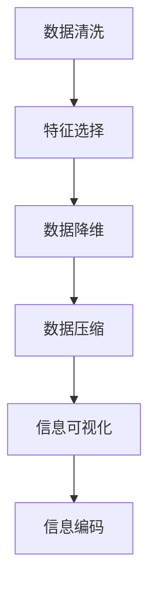

                 

## 1. 背景介绍

在当今信息爆炸的时代，数据和信息的产生速度远远超过了人类认知处理的速度，信息的过载成为我们面临的一大挑战。如何从海量、复杂的数据中提取出有用的信息，并将其简化呈现，是IT行业不断探索的重要课题。这一过程被称为“信息简化”，旨在通过技术和策略，帮助人类从信息的海洋中快速找到所需的信息，减少认知负担，提高决策效率。

### 1.1 问题由来

信息简化技术在各行各业中都有着广泛的应用，如商业智能（BI）、数据分析、搜索引擎优化（SEO）、人工智能等。无论是处理结构化数据、半结构化数据还是非结构化数据，简化信息的需求都是迫切且普遍的。在商业决策中，领导者们需要快速获取关键指标和趋势，以指导战略。在数据科学中，研究人员需要处理海量数据，寻找模式和关联。在人工智能中，模型和算法的设计依赖于数据的有效整合与简化。

### 1.2 问题核心关键点

信息简化的核心关键点在于如何高效、准确地从复杂数据中提取关键信息，并将其以简洁明了的格式展现出来。这涉及以下几个方面：

1. **数据清洗和预处理**：去除噪音、处理缺失值、标准化数据格式等，确保数据的质量和一致性。
2. **特征选择和降维**：识别重要特征，减少数据维度，提高模型的泛化能力。
3. **信息压缩与编码**：使用算法和技术手段，将复杂的信息压缩为简化的形式，如生成压缩文件、编码字符串等。
4. **可视化与展示**：利用图表、仪表盘等工具，将数据转化为易于理解的视觉形式。

这些问题点共同构成了信息简化的核心挑战，需要通过科学的方法和工具来解决。

## 2. 核心概念与联系

### 2.1 核心概念概述

信息简化涉及多个关键概念，包括但不限于：

- **数据清洗**：识别并处理数据中的噪音和异常值，确保数据质量。
- **特征选择**：识别并选取对任务有贡献的特征，降低数据维度，提高模型效率。
- **数据降维**：通过算法将高维数据映射到低维空间，便于数据可视化和处理。
- **数据压缩**：使用算法将数据体积减小，减少存储空间和传输带宽。
- **信息可视化**：将数据以图形、图表的形式呈现，帮助人们快速理解和分析数据。
- **信息编码**：将信息转化为便于处理和传输的编码形式，如文本编码、图像编码等。

这些概念之间的联系可以通过以下Mermaid流程图来展示：



这个流程图展示了信息简化的主要流程，从数据质量提升到数据压缩，再到可视化呈现，最终将信息以编码形式展现。

### 2.2 核心概念原理和架构的 Mermaid 流程图

由于概念较多，为简化理解，这里仅提供部分核心概念的原理和架构图示：


**数据清洗**：通过去除重复、异常值、缺失值等操作，确保数据质量。

**特征选择**：使用算法（如信息增益、L1正则化等）选择最相关的特征，减少冗余信息。

**数据降维**：使用PCA、LDA等算法将高维数据映射到低维空间，如二维或三维。

**数据压缩**：使用算法（如Huffman编码、Gzip压缩等）减小数据体积，便于存储和传输。

**信息可视化**：使用图表（如柱状图、饼图、散点图等）将数据转化为易于理解的视觉形式。

**信息编码**：使用算法（如哈夫曼编码、Base64编码等）将信息转化为便于处理和传输的形式。

## 3. 核心算法原理 & 具体操作步骤

### 3.1 算法原理概述

信息简化的核心算法主要分为数据预处理、特征选择、数据降维、数据压缩和信息可视化几个部分。

1. **数据预处理**：通过清洗和转换，去除噪音，处理缺失值，标准化数据格式。
2. **特征选择**：通过算法选择最有用的特征，减少冗余信息，提高模型效率。
3. **数据降维**：通过算法将高维数据映射到低维空间，便于数据可视化和处理。
4. **数据压缩**：使用算法减小数据体积，便于存储和传输。
5. **信息可视化**：使用图表将数据转化为易于理解的视觉形式，便于分析和决策。
6. **信息编码**：使用算法将信息转化为便于处理和传输的形式。

### 3.2 算法步骤详解

#### 数据预处理

**Step 1: 数据收集与整理**
- 收集来自不同源的数据，确保数据来源多样性。
- 对数据进行初步整理，去除重复和异常数据。
- 处理缺失值，如使用均值、中位数、插值等方法填补。

**Step 2: 数据标准化**
- 对数值型数据进行标准化处理，如归一化、标准化等。
- 对文本数据进行分词、去除停用词、词干提取等预处理。
- 对图像数据进行尺寸调整、灰度转换等预处理。

#### 特征选择

**Step 1: 特征提取**
- 对原始数据进行特征提取，如统计、时序、文本向量化等。
- 使用算法（如信息增益、L1正则化、LDA等）选择最有用的特征。
- 使用特征重要性排序，选择对目标变量影响最大的特征。

**Step 2: 特征降维**
- 对选定的特征进行降维处理，如PCA、LDA、ICA等。
- 选择合适的维度，减少特征数量，提高模型效率。

#### 数据降维

**Step 1: 选择合适的降维算法**
- 根据数据类型选择合适的降维算法，如PCA、LDA、ICA等。
- 确定降维后的维度，如二维或三维。

**Step 2: 执行降维算法**
- 对数据应用降维算法，获得降维后的数据。
- 评估降维效果，确保降维后数据保持重要信息。

#### 数据压缩

**Step 1: 选择合适的压缩算法**
- 根据数据类型选择合适的压缩算法，如Huffman编码、Gzip压缩、Base64编码等。
- 根据数据量和存储要求，选择合适的压缩比。

**Step 2: 执行压缩算法**
- 对数据应用压缩算法，获得压缩后的数据。
- 评估压缩效果，确保压缩后数据质量和可用性。

#### 信息可视化

**Step 1: 选择合适的可视化工具**
- 根据数据类型选择合适的可视化工具，如Matplotlib、Tableau、D3.js等。
- 根据任务需求选择合适的图表类型，如柱状图、饼图、散点图等。

**Step 2: 执行数据可视化**
- 对数据应用可视化工具，生成可视化图表。
- 调整图表参数，确保图表清晰、美观、易于理解。

#### 信息编码

**Step 1: 选择合适的编码算法**
- 根据数据类型选择合适的编码算法，如哈夫曼编码、Base64编码等。
- 根据数据量和传输要求，选择合适的编码长度。

**Step 2: 执行信息编码**
- 对数据应用编码算法，获得编码后的数据。
- 评估编码效果，确保编码后数据可用性。

### 3.3 算法优缺点

**优点**：

1. **提高效率**：通过减少数据量和特征数量，提高模型训练和推理的效率。
2. **降低复杂度**：简化数据表示形式，降低复杂度，便于理解和分析。
3. **增强泛化能力**：减少噪音和冗余信息，提高模型泛化能力。
4. **支持决策**：通过可视化工具，支持快速数据理解和决策。

**缺点**：

1. **信息损失**：压缩和降维可能导致信息损失，需要权衡信息量和处理效率。
2. **技术门槛**：算法的选择和参数调整需要一定的技术背景。
3. **数据依赖**：算法的效果依赖于数据的质量和特征选择。

### 3.4 算法应用领域

信息简化技术广泛应用于以下几个领域：

1. **商业智能（BI）**：帮助企业领导者快速获取关键指标和趋势，支持战略决策。
2. **数据分析**：处理和分析海量数据，发现模式和关联，支持业务优化。
3. **搜索引擎优化（SEO）**：通过简化网站结构和内容，提高搜索引擎排名和用户满意度。
4. **人工智能（AI）**：简化数据和特征，提高模型效率和泛化能力，支持AI应用开发。
5. **自然语言处理（NLP）**：简化文本数据，支持文本分类、情感分析、机器翻译等NLP任务。
6. **图像处理**：简化图像数据，支持图像压缩、特征提取、识别等任务。

## 4. 数学模型和公式 & 详细讲解  
### 4.1 数学模型构建

信息简化涉及多个数学模型，这里以数据降维为例进行详细讲解。

假设原始数据集为 $X \in \mathbb{R}^{n \times d}$，其中 $n$ 为样本数，$d$ 为特征数。目标是将数据降维至 $k$ 维空间，降维后的数据表示为 $Y \in \mathbb{R}^{n \times k}$。

常见的数据降维算法包括主成分分析（PCA）、线性判别分析（LDA）等。以PCA为例，其数学模型如下：

**Step 1: 数据标准化**
- 对数据进行标准化处理，使得各特征具有相同的量级。

$$
X_{std} = \frac{X - \mu}{\sigma}
$$

其中 $\mu$ 为均值，$\sigma$ 为标准差。

**Step 2: 计算协方差矩阵**
- 计算标准化后的数据的协方差矩阵 $C = X_{std}X_{std}^T$。

**Step 3: 特征值分解**
- 对协方差矩阵进行特征值分解，得到特征值 $\lambda_1 \geq \lambda_2 \geq ... \geq \lambda_d$ 和对应的特征向量 $U \in \mathbb{R}^{d \times d}$。

**Step 4: 选择前 $k$ 个特征向量**
- 选择前 $k$ 个特征向量，构成矩阵 $U_k$。

**Step 5: 计算降维后的数据**
- 计算降维后的数据 $Y = X_{std}U_k$。

### 4.2 公式推导过程

PCA的推导过程如下：

设数据集为 $X \in \mathbb{R}^{n \times d}$，其中 $n$ 为样本数，$d$ 为特征数。标准化后的数据为 $X_{std} \in \mathbb{R}^{n \times d}$。协方差矩阵为 $C = X_{std}X_{std}^T$。对协方差矩阵进行特征值分解，得到特征值 $\lambda_1 \geq \lambda_2 \geq ... \geq \lambda_d$ 和对应的特征向量 $U \in \mathbb{R}^{d \times d}$。

PCA的目标是最小化以下损失函数：

$$
\min_{U_k} \text{tr}(X_{std}U_k^TU_k)
$$

其中 $\text{tr}$ 为矩阵迹，$U_k \in \mathbb{R}^{d \times k}$ 为选定的特征向量矩阵。

通过求解上述最小化问题，可以找到最优的 $U_k$，使得降维后的数据 $Y = X_{std}U_k$ 最小化重构误差，同时保留最多的信息。

### 4.3 案例分析与讲解

以一个简单的二维数据集为例，展示PCA的降维过程：

假设数据集为：

$$
X = \begin{bmatrix}
1 & 3 \\
2 & 4 \\
3 & 5 \\
4 & 6
\end{bmatrix}
$$

标准化后的数据为：

$$
X_{std} = \frac{X - \mu}{\sigma} = \begin{bmatrix}
0.3 & 0.7 \\
-0.4 & 0.6 \\
0.7 & 0.9 \\
1 & 1
\end{bmatrix}
$$

计算协方差矩阵：

$$
C = X_{std}X_{std}^T = \begin{bmatrix}
1.46 & 0.7 \\
0.7 & 0.96
\end{bmatrix}
$$

对协方差矩阵进行特征值分解，得到特征值 $\lambda_1 = 1.746, \lambda_2 = 0.36$ 和对应的特征向量 $U = \begin{bmatrix}
0.89 & -0.44 \\
0.44 & 0.89
\end{bmatrix}$。

选择前两个特征向量，构成矩阵 $U_k = \begin{bmatrix}
0.89 & -0.44 \\
0.44 & 0.89
\end{bmatrix}$。

计算降维后的数据：

$$
Y = X_{std}U_k = \begin{bmatrix}
0.3 & 0.7 \\
-0.4 & 0.6 \\
0.7 & 0.9 \\
1 & 1
\end{bmatrix} \begin{bmatrix}
0.89 & -0.44 \\
0.44 & 0.89
\end{bmatrix} = \begin{bmatrix}
0.93 & -0.4 \\
-0.43 & 0.96 \\
0.97 & -0.13 \\
0.91 & 0.16
\end{bmatrix}
$$

## 5. 项目实践：代码实例和详细解释说明

### 5.1 开发环境搭建

在进行信息简化项目实践前，需要准备好开发环境。以下是使用Python进行scikit-learn开发的环境配置流程：

1. 安装Anaconda：从官网下载并安装Anaconda，用于创建独立的Python环境。

2. 创建并激活虚拟环境：
```bash
conda create -n info-simplify python=3.8 
conda activate info-simplify
```

3. 安装scikit-learn：
```bash
conda install scikit-learn
```

4. 安装相关工具包：
```bash
pip install numpy pandas matplotlib seaborn
```

完成上述步骤后，即可在`info-simplify`环境中开始信息简化的实践。

### 5.2 源代码详细实现

下面我们以数据降维（PCA）为例，给出使用scikit-learn进行PCA算法实现的Python代码。

首先，导入必要的库和数据集：

```python
import numpy as np
from sklearn.decomposition import PCA
from sklearn.preprocessing import StandardScaler
from sklearn.datasets import make_classification
from sklearn.decomposition import PCA

X, y = make_classification(n_samples=1000, n_features=10, n_informative=5, n_redundant=0, random_state=42)
```

然后，定义数据标准化和PCA降维函数：

```python
def standardize(X):
    return StandardScaler().fit_transform(X)

def pca(X, n_components=2):
    scaler = StandardScaler()
    X_scaled = scaler.fit_transform(X)
    pca = PCA(n_components=n_components)
    Y = pca.fit_transform(X_scaled)
    return Y
```

最后，调用函数进行数据标准化和PCA降维，并展示降维后的数据：

```python
X_scaled = standardize(X)
Y = pca(X_scaled)
print("PCA后数据形状：", Y.shape)
```

这就是使用scikit-learn进行数据标准化和PCA降维的完整代码实现。可以看到，scikit-learn的封装使得降维算法的实现变得简洁高效。

### 5.3 代码解读与分析

让我们再详细解读一下关键代码的实现细节：

**StandardScaler类**：
- `StandardScaler`类用于对数据进行标准化处理，使得各特征具有相同的量级。
- `fit_transform`方法用于拟合数据并计算标准化参数，然后应用标准化参数进行数据转换。

**PCA类**：
- `PCA`类用于执行主成分分析（PCA），将数据降维至指定维度。
- `fit_transform`方法用于拟合数据并计算降维参数，然后应用降维参数进行数据转换。

**pca函数**：
- 调用`StandardScaler`类对数据进行标准化。
- 调用`PCA`类对标准化后的数据进行降维，保留前两个主成分。
- 返回降维后的数据。

## 6. 实际应用场景

### 6.1 智能推荐系统

信息简化技术在智能推荐系统中得到了广泛应用。通过简化用户行为数据，提取关键特征，推荐系统能够更准确地预测用户偏好，提供个性化推荐。

具体而言，可以从用户的历史行为数据中提取关键特征，如浏览记录、购买历史、评分等，进行降维和特征选择。降维后的数据可以输入到推荐模型中，帮助模型学习用户偏好，生成个性化推荐。

### 6.2 金融风险管理

在金融风险管理中，信息简化技术可以帮助银行和金融机构快速识别潜在风险，做出快速决策。

具体而言，可以从海量交易数据中提取关键指标，如交易金额、交易频率、异常交易等，进行降维和特征选择。降维后的数据可以输入到风险评估模型中，帮助模型识别高风险交易，及时采取措施，降低金融风险。

### 6.3 健康数据分析

在健康数据分析中，信息简化技术可以帮助医生快速识别疾病模式，制定治疗方案。

具体而言，可以从患者的历史病历数据中提取关键指标，如病情记录、检查结果、用药记录等，进行降维和特征选择。降维后的数据可以输入到疾病诊断模型中，帮助模型识别疾病模式，制定个性化治疗方案。

### 6.4 未来应用展望

随着信息简化技术的不断演进，其在更多领域的应用前景值得期待。未来，信息简化技术将与大数据、人工智能、区块链等前沿技术结合，进一步拓展应用边界，提升数据处理和决策效率。

## 7. 工具和资源推荐

### 7.1 学习资源推荐

为了帮助开发者系统掌握信息简化技术，这里推荐一些优质的学习资源：

1. 《数据科学与机器学习基础》（Data Science and Machine Learning Foundations）：由知名教授Andrew Ng等人所著，系统介绍了数据科学和机器学习的基本概念和算法，是入门数据科学的必读书籍。
2. Coursera《数据科学专项课程》（Data Science Specialization）：由Johns Hopkins University开设的专项课程，涵盖数据科学中的核心技能，包括数据清洗、数据可视化、机器学习等。
3. Kaggle：全球最大的数据科学竞赛平台，提供了大量的数据集和竞赛项目，是实践数据科学和机器学习的绝佳平台。
4. scikit-learn官方文档：提供了详细的API文档和使用指南，是scikit-learn学习的重要资源。
5. TensorFlow官方文档：提供了详细的API文档和使用指南，是TensorFlow学习的重要资源。

通过对这些资源的学习实践，相信你一定能够快速掌握信息简化技术的精髓，并用于解决实际的业务问题。

### 7.2 开发工具推荐

高效的开发离不开优秀的工具支持。以下是几款用于信息简化开发的常用工具：

1. Python：简单易学，功能强大，广泛应用于数据科学和机器学习领域。
2. Jupyter Notebook：开源的交互式编程环境，支持代码编写、数据可视化、结果展示，是数据科学和机器学习项目开发的必备工具。
3. scikit-learn：Python中的机器学习库，提供了丰富的算法和工具，支持数据预处理、特征选择、降维等。
4. Matplotlib：Python中的数据可视化库，支持绘制各种类型的图表，是数据科学和机器学习项目开发的必备工具。
5. Seaborn：Python中的数据可视化库，支持绘制美观、专业的统计图表，是数据科学和机器学习项目开发的必备工具。

合理利用这些工具，可以显著提升信息简化任务的开发效率，加快创新迭代的步伐。

### 7.3 相关论文推荐

信息简化技术的发展源于学界的持续研究。以下是几篇奠基性的相关论文，推荐阅读：

1. Johnson, R. P., & Witten, I. H. (1966). Computer-aided data analysis. Addison-Wesley.
2. Hastie, T., Tibshirani, R., & Friedman, J. H. (2009). The elements of statistical learning. Springer Series in Statistics.
3. Shlens, J. (2016). A Tutorial on Principal Component Analysis and Matrix Decompositions. arXiv preprint arXiv:1601.05231.
4. Pei, J., & Shrivastava, S. (2018). Generative Adversarial Networks: An Overview. arXiv preprint arXiv:1811.10597.
5. Hinton, G. E., Salakhutdinov, R. R., & Osindero, S. (2006). A fast learning algorithm for deep belief nets. Neural Computation, 18(7), 1527-1554.

这些论文代表了大数据和机器学习领域的发展脉络，是学习和研究信息简化技术的宝贵资料。

## 8. 总结：未来发展趋势与挑战

### 8.1 总结

本文对信息简化的核心概念和算法进行了全面系统的介绍。首先阐述了信息简化的研究背景和意义，明确了其在全球数据驱动环境中的重要地位。其次，从原理到实践，详细讲解了信息简化的数学原理和关键步骤，给出了信息简化任务开发的完整代码实例。同时，本文还广泛探讨了信息简化的实际应用场景，展示了其在多个领域中的广泛应用前景。此外，本文精选了信息简化的各类学习资源，力求为读者提供全方位的技术指引。

通过本文的系统梳理，可以看到，信息简化技术在数据驱动的决策和应用中扮演着不可或缺的角色。在商业智能、数据分析、智能推荐等多个领域，信息简化技术已经成为提升数据处理和决策效率的关键手段。未来，伴随技术的不断进步，信息简化技术将在更多领域得到应用，为数据驱动的智能化转型提供坚实的基础。

### 8.2 未来发展趋势

展望未来，信息简化技术将呈现以下几个发展趋势：

1. **自动化程度提高**：随着自动化机器学习（AutoML）技术的发展，信息简化的自动化程度将不断提高，减少人工干预，提高效率。
2. **跨领域应用拓展**：信息简化技术将在更多领域得到应用，如医疗、金融、制造等，为不同领域的智能化转型提供支持。
3. **数据隐私保护加强**：在数据隐私保护要求日益严格的趋势下，信息简化技术将更多地采用差分隐私等技术手段，确保数据安全和隐私保护。
4. **多模态数据融合**：信息简化技术将更多地融合文本、图像、语音等多种模态数据，支持多模态数据分析和建模。
5. **智能化应用普及**：随着深度学习和大数据技术的发展，信息简化技术将在更多实际应用中得到应用，如智能推荐、智能决策、智能分析等。

### 8.3 面临的挑战

尽管信息简化技术已经取得了一定的成就，但在迈向智能化、普适化的过程中，它仍面临诸多挑战：

1. **数据质量问题**：信息简化技术的有效性和精度高度依赖于数据的质量和数量，低质量数据将导致信息简化效果差。
2. **算法复杂度**：现有的信息简化算法往往复杂度高，需要高水平的技术和算法支持，增加了技术难度。
3. **计算资源限制**：信息简化任务涉及大量计算，需要高性能的计算资源和工具支持。
4. **应用场景复杂性**：不同应用场景对信息简化的需求和要求不同，需要针对具体场景进行优化和定制。

### 8.4 研究展望

面对信息简化技术所面临的挑战，未来的研究需要在以下几个方面寻求新的突破：

1. **自动化简化技术**：开发更智能、更高效的信息简化算法，减少人工干预，提高自动化程度。
2. **多模态数据融合**：将文本、图像、语音等多种模态数据进行融合，提升多模态信息简化效果。
3. **跨领域应用**：探索信息简化技术在更多领域的应用，如医疗、金融、制造等。
4. **数据隐私保护**：引入差分隐私等技术手段，确保数据安全和隐私保护。
5. **智能化应用**：结合深度学习和大数据技术，推动信息简化技术在更多实际应用中的普及和应用。

这些研究方向的探索，必将引领信息简化技术迈向更高的台阶，为数据驱动的智能化转型提供坚实的技术基础。

## 9. 附录：常见问题与解答

**Q1：信息简化技术的核心是什么？**

A: 信息简化的核心是高效地从复杂数据中提取关键信息，并将其以简洁明了的格式展现出来。这涉及到数据预处理、特征选择、数据降维、数据压缩和信息可视化等多个步骤。

**Q2：信息简化技术如何应用在推荐系统中？**

A: 在推荐系统中，信息简化技术可以通过对用户行为数据进行降维和特征选择，提取关键特征，然后将其输入到推荐模型中，帮助模型学习用户偏好，生成个性化推荐。

**Q3：信息简化技术是否适用于医疗数据？**

A: 信息简化技术同样适用于医疗数据。可以从患者的历史病历数据中提取关键指标，如病情记录、检查结果、用药记录等，进行降维和特征选择，然后将其输入到疾病诊断模型中，帮助模型识别疾病模式，制定个性化治疗方案。

**Q4：信息简化技术在实际应用中需要注意哪些问题？**

A: 在实际应用中，信息简化技术需要注意以下问题：
1. 数据质量问题：确保数据的质量和数量，避免低质量数据对简化效果的影响。
2. 算法复杂度：选择合适的算法，并根据数据量和复杂度进行参数调优。
3. 计算资源限制：信息简化任务涉及大量计算，需要高性能的计算资源和工具支持。
4. 应用场景复杂性：针对具体应用场景进行优化和定制，确保简化效果。

---

作者：禅与计算机程序设计艺术 / Zen and the Art of Computer Programming

