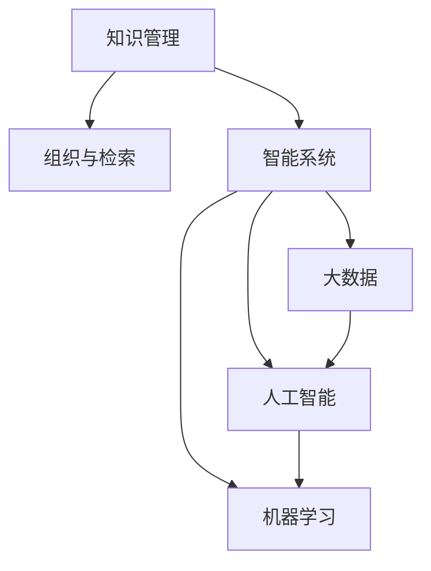

                 

# 信息过载与知识管理系统实施指南：有效组织和检索信息

> 关键词：信息过载,知识管理,组织与检索,智能系统,大数据,人工智能,机器学习

## 1. 背景介绍

### 1.1 问题由来

随着互联网技术的发展，我们早已进入信息时代。无论是线上社交媒体、网络新闻、科研论文，还是线下新闻出版、书籍杂志、广播电视，信息无处不在，我们每个人每天都接收着海量的信息。

在信息爆炸的背景下，无论是个人用户还是企业组织，都面临着信息过载的困境。大量无序杂乱的信息不仅占用了宝贵的时间，还可能导致误导和决策失误。因此，如何有效组织和检索信息，成为现代信息社会的一项重要任务。

### 1.2 问题核心关键点

信息过载的问题主要体现在以下几个方面：

- **数据量大**：互联网的海量数据使传统手工处理信息变得不再可行，需要借助计算机自动化的手段。
- **数据复杂**：结构化和非结构化数据混杂，需要不同的方法进行管理和处理。
- **数据更新快**：动态数据源使得信息的过期问题变得突出，需要及时更新和维护。
- **数据多样化**：音频、视频、图片等不同类型的数据带来了新的挑战，需要统一的体系进行管理。
- **数据共享与协作**：随着远程办公和协作工具的普及，如何保障数据共享的安全性和高效性也是一大难题。

解决信息过载的根本在于构建有效的知识管理系统(Knowledge Management System, KMS)，通过智能化的方法对信息进行组织、存储、检索和应用，提高信息利用的效率和质量。

## 2. 核心概念与联系

### 2.1 核心概念概述

要构建一个有效的知识管理系统，首先需要了解以下几个核心概念：

- **知识管理**：通过创建和维护知识库，帮助个人和团队捕捉、整合、共享和应用知识，以支持决策和创新。
- **组织与检索**：设计合适的组织架构和检索算法，对海量信息进行结构化处理，快速响应查询需求。
- **智能系统**：利用人工智能和机器学习技术，对知识进行自动化的生成、整理和检索，提高管理效率。
- **大数据**：通过处理大规模数据集，从中找到潜在的知识和模式，支撑知识管理系统的构建。
- **人工智能**：以数据为基础，通过算法进行模式识别、分类、聚类、预测等，辅助信息组织和检索。
- **机器学习**：构建基于样本的数据模型，通过学习历史数据预测未来信息，实现自动化管理。

这些概念通过以下Mermaid流程图进行展示：



这个流程图展示了知识管理系统的核心组成及其相互关系：

1. 知识管理是核心目标。
2. 组织与检索是实现基础。
3. 智能系统是技术手段。
4. 大数据是数据支撑。
5. 人工智能是算法基础。
6. 机器学习是应用工具。

这些概念共同构成了知识管理系统的基础框架，指导着系统的设计和实现。

## 3. 核心算法原理 & 具体操作步骤

### 3.1 算法原理概述

构建知识管理系统，首要的是确定其算法原理。常见的知识管理算法可以分为以下几类：

1. **文本挖掘与信息抽取**：通过自然语言处理技术，从文本中提取关键信息，如实体、关系、关键词等，形成知识图谱。
2. **文档分类与聚类**：通过机器学习算法，将文档按主题分类，或进行相似度聚类，方便后续检索。
3. **推荐系统**：利用用户行为数据和历史评分，推荐可能感兴趣的知识内容，辅助用户发现新信息。
4. **实体识别与链接**：识别文本中的实体，并链接到知识图谱中的实体节点，建立知识关联。
5. **信息抽取与整合**：从多个数据源中抽取信息，并整合到一个统一的模型中，避免冗余和遗漏。

这些算法需要在大规模数据集上进行训练和验证，以找到最优的模型参数和特征表示。

### 3.2 算法步骤详解

构建知识管理系统，一般包括以下关键步骤：

**Step 1: 数据收集与预处理**

- 收集各类信息源数据，如网页、文献、视频、图片等。
- 清洗和去重，去除噪声和冗余数据，构建高质量的数据集。
- 数据标注和标准化，如实体识别、关系抽取等，为后续算法提供数据支持。

**Step 2: 文本挖掘与信息抽取**

- 应用自然语言处理技术，提取文本中的实体、关系、关键词等关键信息。
- 构建知识图谱，将抽取的信息以节点和边的形式组织起来，形成知识图结构。
- 应用实体链接技术，将抽取的信息链接到已有的知识图谱中，扩展知识覆盖面。

**Step 3: 文档分类与聚类**

- 利用机器学习算法，如朴素贝叶斯、支持向量机等，对文档进行主题分类。
- 应用聚类算法，如K-means、层次聚类等，将文档按相似度进行聚类，形成知识集合。
- 使用关键词和标签等元数据，增强分类和聚类的效果。

**Step 4: 推荐系统构建**

- 收集用户行为数据，如点击、评分、搜索记录等，构建用户画像。
- 应用协同过滤、内容推荐等算法，生成个性化推荐列表。
- 不断迭代优化推荐算法，提升推荐效果。

**Step 5: 知识库构建与检索**

- 构建结构化知识库，将文本信息、图像信息、视频信息等整合在一起，形成统一的存储形式。
- 设计高效的检索算法，如倒排索引、向量空间模型等，快速响应查询需求。
- 应用搜索提示、拼写纠错等技术，提高检索的准确性和用户体验。

**Step 6: 知识应用与反馈**

- 集成知识管理系统到实际应用中，如CRM系统、内容管理系统等。
- 实时更新知识库，确保数据的实时性和准确性。
- 应用反馈机制，收集用户评价和建议，不断优化系统性能。

### 3.3 算法优缺点

知识管理系统构建算法具有以下优点：

1. **自动化处理**：自动抽取、分类、聚类、推荐等过程，减少了人工干预。
2. **高效准确**：应用机器学习算法，提高了信息处理的效率和准确性。
3. **可扩展性**：可以处理大规模数据集，支持知识管理的持续扩展。
4. **灵活性**：支持不同类型的知识表示和查询，适应不同应用场景。

同时，这些算法也存在一定的局限性：

1. **数据质量要求高**：数据清洗和标注需要大量人力和时间，数据质量影响算法效果。
2. **模型复杂**：复杂的机器学习模型需要大量计算资源，可能面临计算瓶颈。
3. **隐私风险**：大规模数据处理可能涉及用户隐私，需要严格的数据保护措施。
4. **算法透明性不足**：部分算法模型，如深度学习模型，难以解释其内部机制。
5. **通用性不足**：特定领域的知识管理算法，难以直接应用于其他领域。

尽管存在这些局限，但整体而言，基于算法的知识管理系统仍然是当前最先进的技术手段。未来研究需进一步提高算法的自动化水平和可解释性，同时降低数据质量对算法的依赖。

### 3.4 算法应用领域

知识管理系统广泛应用于各种领域，如：

- **企业知识管理**：通过集成内部文档、项目记录、客户信息等，提高团队协作效率。
- **科研知识管理**：构建科研文献数据库、实验室记录等，支持科研人员的知识共享和创新。
- **医学知识管理**：整合医学文献、病人病历、临床试验数据，辅助医生诊断和治疗。
- **教育知识管理**：构建课程库、教材库、题库等，辅助教师教学和学生学习。
- **政府知识管理**：集成政策法规、公共记录、经济数据等，支撑政府决策和管理。

以上应用领域展示了知识管理系统在实际工作中的广泛适用性。不同行业需要根据自身特点，定制化开发符合实际需求的系统。

## 4. 数学模型和公式 & 详细讲解  
### 4.1 数学模型构建

构建知识管理系统的数学模型一般包括：

- **知识表示模型**：如向量空间模型、语义网络模型等，用于表示知识结构。
- **分类模型**：如朴素贝叶斯、支持向量机等，用于文档分类。
- **聚类模型**：如K-means、层次聚类等，用于文档聚类。
- **推荐模型**：如协同过滤、矩阵分解等，用于用户推荐。

以向量空间模型为例，假设文档集合 $\mathcal{D}$，文档中包含 $n$ 个词，用 $\mathbf{d}_i=(d_{i1},d_{i2},...,d_{in})$ 表示第 $i$ 个文档的词频向量，每个词 $j$ 的权重为 $w_j$，则向量空间模型表示为：

$$
\mathbf{d}_i = \sum_{j=1}^n w_j \mathbf{t}_j
$$

其中 $\mathbf{t}_j=(t_{j1},t_{j2},...,t_{jn})$ 表示词 $j$ 的权重向量。

### 4.2 公式推导过程

向量空间模型的推导基于以下假设：

- 文档 $i$ 与文档 $j$ 相似，当且仅当 $i$ 和 $j$ 的词频向量 $\mathbf{d}_i$ 和 $\mathbf{d}_j$ 相似。
- 相似度可以用向量点积表示，即 $\mathbf{d}_i \cdot \mathbf{d}_j$。

设 $\mathbf{t}_j$ 为第 $j$ 个词的权重向量，则 $\mathbf{d}_i$ 和 $\mathbf{d}_j$ 的点积为：

$$
\mathbf{d}_i \cdot \mathbf{d}_j = \sum_{k=1}^n w_i^k t_j^k
$$

为了提高相似度计算的准确性，可以引入词权重 $w_j$ 和文档权重 $w_i^k$，其中 $w_i^k$ 表示第 $i$ 个文档对第 $k$ 个词的关注度。最终，向量空间模型的相似度计算公式为：

$$
similarity(\mathbf{d}_i,\mathbf{d}_j) = \frac{\sum_{k=1}^n w_i^k t_j^k}{\sqrt{\sum_{k=1}^n (w_i^k)^2}\sqrt{\sum_{k=1}^n (t_j^k)^2}}
$$

在实际应用中，还需要结合信息检索算法，如倒排索引、TF-IDF 等，构建高效的查询匹配系统，提高信息检索的效率和准确性。

### 4.3 案例分析与讲解

以企业知识管理为例，假设一个企业有大量文档数据，其中包含公司业务、技术文档、客户记录等。应用知识管理系统时，可以按照以下步骤进行：

**Step 1: 数据收集**

- 从公司内网、邮件系统、项目管理软件等收集文档数据。
- 对数据进行清洗和去重，去除噪声和冗余内容。

**Step 2: 文本挖掘**

- 应用自然语言处理技术，提取文档中的实体、关系、关键词等。
- 构建知识图谱，将提取的信息以节点和边的形式组织起来。

**Step 3: 文档分类**

- 利用朴素贝叶斯算法对文档进行分类，分为技术文档、业务文档、客户记录等类别。
- 应用聚类算法，将分类后的文档按主题进行聚类，形成知识集合。

**Step 4: 推荐系统**

- 收集员工浏览、下载、搜索记录等行为数据，构建员工画像。
- 应用协同过滤算法，生成个性化推荐列表，如最新文档、相关文档等。

**Step 5: 知识库构建**

- 将分类后的文档、知识图谱、推荐结果等整合到一个统一的存储形式中，构建知识库。
- 设计高效的检索算法，如倒排索引、TF-IDF 等，快速响应查询需求。

**Step 6: 知识应用**

- 将知识管理系统集成到企业办公系统、项目管理软件等应用中。
- 实时更新知识库，确保数据的实时性和准确性。

通过以上步骤，企业可以构建一个高效的知识管理系统，提升团队协作效率，加速知识创新和应用。

## 5. 项目实践：代码实例和详细解释说明
### 5.1 开发环境搭建

在进行知识管理系统的项目实践前，我们需要准备好开发环境。以下是使用Python进行TensorFlow开发的环境配置流程：

1. 安装Anaconda：从官网下载并安装Anaconda，用于创建独立的Python环境。

2. 创建并激活虚拟环境：
```bash
conda create -n tf-env python=3.8 
conda activate tf-env
```

3. 安装TensorFlow：根据CUDA版本，从官网获取对应的安装命令。例如：
```bash
conda install tensorflow=2.6 -c conda-forge
```

4. 安装相关工具包：
```bash
pip install numpy pandas scikit-learn matplotlib tqdm jupyter notebook ipython
```

完成上述步骤后，即可在`tf-env`环境中开始知识管理系统的开发实践。

### 5.2 源代码详细实现

下面以构建推荐系统为例，给出使用TensorFlow进行知识管理系统的PyTorch代码实现。

首先，定义推荐系统的数据处理函数：

```python
import tensorflow as tf
from tensorflow.keras.layers import Input, Dense, Embedding, Flatten
from tensorflow.keras.models import Model
from tensorflow.keras.callbacks import EarlyStopping

# 定义输入层和嵌入层
user_input = Input(shape=(1,), name='user')
item_input = Input(shape=(1,), name='item')
user_embeddings = Embedding(input_dim=num_users, output_dim=embedding_dim)(user_input)
item_embeddings = Embedding(input_dim=num_items, output_dim=embedding_dim)(item_input)

# 定义神经网络结构
flattened_user = Flatten()(user_embeddings)
flattened_item = Flatten()(item_embeddings)
concatenated = tf.keras.layers.concatenate([flattened_user, flattened_item])
dense_layer = Dense(hidden_dim, activation='relu')(concatenated)
output = Dense(1, activation='sigmoid')(dense_layer)

# 定义推荐模型
model = Model(inputs=[user_input, item_input], outputs=output)
```

然后，定义推荐系统的训练和评估函数：

```python
def train(model, train_data, batch_size, epochs, early_stopping):
    model.compile(optimizer='adam', loss='binary_crossentropy', metrics=['accuracy'])
    model.fit(train_data, epochs=epochs, batch_size=batch_size, callbacks=[early_stopping])

def evaluate(model, test_data, batch_size):
    test_loss, test_accuracy = model.evaluate(test_data, batch_size=batch_size)
    print(f'Test Loss: {test_loss:.4f}, Test Accuracy: {test_accuracy:.4f}')
```

接着，训练和评估推荐模型：

```python
epochs = 10
batch_size = 32

# 加载训练数据和测试数据
train_data = ...
test_data = ...

# 定义早期停止器，防止过拟合
early_stopping = EarlyStopping(patience=3)

# 训练推荐模型
train(model, train_data, batch_size, epochs, early_stopping)

# 评估推荐模型
evaluate(model, test_data, batch_size)
```

以上就是使用TensorFlow构建推荐系统的完整代码实现。可以看到，TensorFlow提供了丰富的深度学习组件，使得模型的设计和训练变得简洁高效。

### 5.3 代码解读与分析

让我们再详细解读一下关键代码的实现细节：

**推荐系统类**：
- `Input`层：用于输入用户ID和物品ID，`Embedding`层：将ID序列转化为嵌入向量。
- `Flatten`层：将嵌入向量展开为向量。
- `Dense`层：构建神经网络结构，`output`层：输出预测值。
- `Model`层：封装输入层和输出层，构建完整的推荐模型。

**训练函数**：
- `compile`方法：设置优化器、损失函数和评价指标。
- `fit`方法：执行模型训练，设置批量大小和迭代轮数。
- `callbacks`参数：添加早期停止器，防止模型过拟合。

**评估函数**：
- `evaluate`方法：计算模型在测试数据上的损失和准确率。

**训练和评估流程**：
- 定义训练轮数、批量大小等参数。
- 加载训练数据和测试数据。
- 创建早期停止器，避免过拟合。
- 执行模型训练，输出训练过程中的损失和准确率。
- 执行模型评估，输出测试集上的损失和准确率。

可以看到，TensorFlow提供了强大的深度学习框架，使得构建推荐系统变得轻而易举。通过简洁的代码实现，可以快速迭代和优化推荐模型。

当然，工业级的系统实现还需考虑更多因素，如模型的保存和部署、超参数的自动搜索、更灵活的任务适配层等。但核心的推荐范式基本与此类似。

## 6. 实际应用场景
### 6.1 智能客服系统

智能客服系统是知识管理系统的重要应用场景之一。通过构建知识库和推荐系统，智能客服能够理解用户意图，自动生成回复，快速响应客户咨询。

以客户服务为例，当客户咨询关于某个产品的信息时，智能客服可以：

- 从知识库中提取相关文档，理解客户需求。
- 应用推荐系统，生成可能感兴趣的产品信息。
- 结合自然语言处理技术，生成自然的对话回答。

这种基于知识管理系统的智能客服，能够大幅提升客户体验，降低企业运营成本。

### 6.2 金融数据分析

金融数据分析是知识管理系统在企业应用中的另一个重要场景。通过构建知识库和推荐系统，金融分析师可以：

- 应用推荐系统，发现重要的财经新闻和分析报告。
- 从知识库中提取关键数据，构建决策模型。
- 利用自然语言处理技术，快速理解市场动态和财经术语。

这种基于知识管理系统的金融数据分析，能够帮助分析师高效获取信息，快速做出投资决策。

### 6.3 医疗信息管理

医疗信息管理是知识管理系统的典型应用场景。通过构建知识库和推荐系统，医生和研究人员可以：

- 应用推荐系统，查找最新的医学文献和研究成果。
- 从知识库中提取病人的病历数据，快速生成诊断报告。
- 利用自然语言处理技术，理解病人的病史和症状。

这种基于知识管理系统的医疗信息管理，能够提升医疗服务质量，加速新药研发进程。

### 6.4 未来应用展望

随着知识管理系统的不断发展，未来在更多领域将有广泛的应用：

- **智慧城市**：通过构建城市数据知识库和推荐系统，提升城市治理水平，优化公共服务。
- **智能制造**：应用知识管理系统，优化生产流程，提高产品质量和生产效率。
- **在线教育**：构建知识库和推荐系统，提升在线教学效果，个性化推荐学习资源。
- **智能家居**：通过知识管理系统，优化家庭自动化系统，提升家居智能化水平。
- **智慧农业**：应用知识管理系统，优化农作流程，提升农业生产效率。

知识管理系统的应用前景广阔，相信未来会在更多垂直行业得到推广和应用，带来深远的影响。

## 7. 工具和资源推荐
### 7.1 学习资源推荐

为了帮助开发者系统掌握知识管理系统的理论基础和实践技巧，这里推荐一些优质的学习资源：

1. 《知识管理理论与实践》系列博文：由知识管理专家撰写，深入浅出地介绍了知识管理的核心概念和实践方法。

2. 《信息检索与自然语言处理》课程：上海交通大学开设的在线课程，涵盖了信息检索和自然语言处理的基本知识，适合初学者入门。

3. 《推荐系统实战》书籍：谷歌资深工程师所著，全面介绍了推荐系统的构建和优化方法，包含丰富的代码实例。

4. Google Scholar：谷歌学术搜索引擎，查找最新的学术论文和研究进展，掌握知识管理系统的最新动态。

5. arXiv：预印本论文库，获取前沿的科研论文，了解知识管理系统的前沿技术。

通过对这些资源的学习实践，相信你一定能够快速掌握知识管理系统的精髓，并用于解决实际的业务问题。

### 7.2 开发工具推荐

高效的开发离不开优秀的工具支持。以下是几款用于知识管理系统开发的常用工具：

1. TensorFlow：由Google主导开发的深度学习框架，生产部署方便，适合大规模工程应用。

2. PyTorch：基于Python的开源深度学习框架，灵活性高，适合快速迭代研究。

3. Elasticsearch：分布式搜索引擎，支持大规模文本数据的存储和检索，快速响应查询需求。

4. Solr：Apache基金会推出的搜索引擎，支持复杂的文本查询和数据结构，适用于大数据场景。

5. Apache Hadoop：大数据处理框架，支持大规模数据的分布式存储和计算，确保数据处理的可扩展性和可靠性。

6. Apache Spark：基于内存的分布式计算框架，支持多种数据处理方式，提升数据处理效率。

合理利用这些工具，可以显著提升知识管理系统的开发效率，加快创新迭代的步伐。

### 7.3 相关论文推荐

知识管理系统和推荐技术的发展源于学界的持续研究。以下是几篇奠基性的相关论文，推荐阅读：

1. Clustering Algorithms for Large-Scale Multimedia Databases with Local Sensitive Hashing（基于敏感散列的大型多媒体数据库聚类算法）
2. Context-Aware Document Clustering for Information Retrieval（信息检索中的上下文感知文档聚类）
3. Context-Aware Recommendation System for Enhanced E-Learning Experience（增强在线学习体验的上下文感知推荐系统）
4. Research on Recommendation System for E-Commerce Big Data（基于大数据的电子商务推荐系统研究）
5. Knowledge Discovery in Databases: A Guide to Current Research Practices（数据库中的知识发现：当前研究实践指南）

这些论文代表了大规模知识管理系统的算法演进和应用实践。通过学习这些前沿成果，可以帮助研究者把握学科前进方向，激发更多的创新灵感。

## 8. 总结：未来发展趋势与挑战

### 8.1 总结

本文对知识管理系统实施的各个方面进行了全面系统的介绍。首先阐述了信息过载的背景和知识管理系统的目标，明确了系统实施的核心步骤和方法。其次，从算法原理到具体实现，详细讲解了推荐系统的构建过程，并给出了代码实例和详细解释。同时，本文还广泛探讨了知识管理系统的实际应用场景，展示了其在智能客服、金融分析、医疗信息管理等多个领域的应用前景。

通过本文的系统梳理，可以看到，知识管理系统在实际应用中已经取得了显著成效，为解决信息过载问题提供了有效的方案。未来，随着数据量的不断增长和技术的不断进步，知识管理系统将更加智能化、高效化，实现更全面、更深入的智能应用。

### 8.2 未来发展趋势

知识管理系统的未来发展趋势主要包括以下几个方向：

1. **自动化处理**：知识管理系统的自动化程度将不断提升，减少人工干预，提高系统效率。
2. **智能化推荐**：推荐系统的智能化程度将不断提高，提供更加个性化和精准的推荐服务。
3. **大数据应用**：知识管理系统将更好地与大数据技术结合，实现更全面、更深入的信息处理。
4. **多模态融合**：知识管理系统将支持多模态数据处理，整合文本、图像、视频等多种信息源。
5. **持续学习**：知识管理系统将具备持续学习能力，不断更新和优化知识库，适应数据分布的变化。
6. **人机协同**：知识管理系统将实现更高程度的人机协同，提升信息处理和知识共享的效果。

以上趋势凸显了知识管理系统在信息时代的巨大潜力和应用前景，相信未来会有更多创新的应用场景和突破性进展。

### 8.3 面临的挑战

尽管知识管理系统已经取得了长足的发展，但在实际应用中仍面临诸多挑战：

1. **数据质量问题**：知识管理系统的性能很大程度上依赖于数据质量，数据清洗和标注需要大量人力和时间。
2. **算法复杂性**：推荐系统等复杂算法需要高强度的计算资源，可能面临计算瓶颈。
3. **隐私和安全**：大规模数据处理可能涉及用户隐私，需要严格的数据保护措施。
4. **系统扩展性**：知识管理系统的可扩展性和伸缩性需要进一步优化，以应对大规模数据处理需求。
5. **人机交互**：知识管理系统的人机交互界面需要进一步优化，提升用户体验。
6. **知识更新**：知识库的实时更新和维护需要自动化机制，避免知识过时。

解决这些挑战需要进一步的技术创新和工程实践，推动知识管理系统的不断改进和完善。

### 8.4 研究展望

面向未来，知识管理系统还需要在以下几个方面进行深入研究：

1. **自动化和智能化**：开发更加自动化和智能化的知识管理算法，减少人工干预。
2. **多模态融合**：实现文本、图像、视频等多模态数据的整合和处理。
3. **知识图谱**：构建更加全面、精准的知识图谱，支持更深入的智能应用。
4. **持续学习**：开发持续学习机制，保持知识库的实时性和动态性。
5. **人机协同**：实现更高程度的人机协同，提升信息处理和知识共享的效果。
6. **安全性**：加强知识管理系统的人机交互安全和数据保护。

这些研究方向将推动知识管理系统的不断进步，带来更全面、更高效、更智能的知识应用。

## 9. 附录：常见问题与解答

**Q1：知识管理系统如何处理大规模数据？**

A: 知识管理系统处理大规模数据，主要依赖以下技术：

- **分布式计算**：通过Apache Hadoop等分布式计算框架，实现数据的分布式存储和计算。
- **大数据平台**：如Hive、Spark等，支持大规模数据的快速处理和分析。
- **高效索引**：如Elasticsearch等搜索引擎，提供高效的文本索引和检索功能。
- **增量更新**：通过增量更新机制，实时更新知识库，保持数据的实时性和动态性。

这些技术手段能够显著提升知识管理系统的处理能力，适应大规模数据处理需求。

**Q2：知识管理系统如何提高推荐准确性？**

A: 提高推荐准确性，主要从以下几个方面进行优化：

- **数据质量**：确保数据的质量和完整性，避免噪音和冗余。
- **特征工程**：构建更全面的特征表示，提高模型的预测能力。
- **算法优化**：选择和优化推荐算法，如协同过滤、矩阵分解等。
- **上下文感知**：引入上下文信息，提高推荐的相关性和个性化。
- **模型更新**：不断更新推荐模型，适应数据分布的变化。

通过以上优化措施，能够显著提高推荐系统的准确性和用户满意度。

**Q3：知识管理系统如何保护用户隐私？**

A: 保护用户隐私是知识管理系统的重要任务，主要采取以下措施：

- **数据匿名化**：对用户数据进行匿名化处理，防止用户被识别。
- **访问控制**：采用访问控制技术，确保只有授权用户可以访问知识库。
- **数据加密**：对存储和传输的数据进行加密，防止数据泄露。
- **隐私政策**：制定隐私政策，明确数据使用和保护的原则和范围。
- **用户反馈**：提供用户反馈机制，及时处理用户隐私投诉和建议。

这些措施能够有效保护用户隐私，增强知识管理系统的可信度。

通过本文的系统梳理，可以看到，知识管理系统在解决信息过载问题方面已经取得了显著成效，为信息时代带来了诸多便利。未来，随着技术的不断进步，知识管理系统将更加智能化、高效化，带来更全面、更深入的智能应用，推动信息社会的发展。相信未来知识管理系统将会迎来更多的创新和突破，为人类认知智能的进步贡献力量。

---

作者：禅与计算机程序设计艺术 / Zen and the Art of Computer Programming

