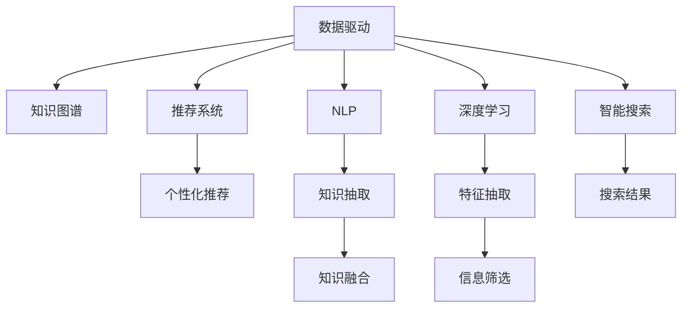

                 

# 信息过载时代：如何在信息洪流中有效筛选和吸收知识

## 1. 背景介绍

### 1.1 问题由来
随着数字化时代的到来，人类已进入信息过载的时代。海量的数据、多媒体内容以及不断涌现的新知识，使得人们在知识和信息的海洋中面临着前所未有的挑战。如何在海量信息中有效筛选和吸收知识，成为了现代信息管理的一大难题。与此同时，传统的信息检索和知识管理方法已无法满足这种高速发展的信息环境。因此，需要一种更为智能、高效的方法，以帮助人们更好地处理和利用信息。

### 1.2 问题核心关键点
本文将探讨如何在信息过载的时代，通过智能化手段对海量信息进行高效筛选和吸收。核心关键点包括：

- 数据驱动的信息筛选：利用大数据技术，从海量信息中自动筛选出高质量的知识和信息。
- 知识图谱构建：构建结构化的知识图谱，帮助用户理解和整合信息。
- 个性化推荐系统：基于用户行为和偏好，智能推荐个性化信息。
- 知识抽取与融合：从文本、图片、音频等多种数据源中抽取结构化知识，并将其融合到统一的知识体系中。
- 智能搜索与分析：通过自然语言处理和机器学习技术，提高搜索和分析效率。

这些关键点共同构成了一个完整的智能化知识管理框架，可以帮助用户有效处理和吸收信息。

## 2. 核心概念与联系

### 2.1 核心概念概述

为了更好地理解如何在信息洪流中有效筛选和吸收知识，首先需要了解以下几个核心概念：

- 数据驱动：利用数据挖掘和机器学习技术，自动发现和筛选出有价值的信息和知识。
- 知识图谱：将知识以图的形式表示出来，通过结构化的方式进行管理和传播。
- 推荐系统：根据用户的历史行为和偏好，推荐相关的内容和知识。
- 自然语言处理(NLP)：使用计算机理解和处理人类语言的技术，用于知识抽取和检索。
- 深度学习：通过神经网络模型，自动学习和抽取特征，提高信息筛选的准确性。

这些核心概念之间的逻辑关系可以通过以下Mermaid流程图来展示：



这个流程图展示了大数据背景下信息管理的关键流程：

1. 数据驱动获取数据。
2. 知识图谱构建知识结构。
3. 推荐系统推荐相关内容。
4. 自然语言处理提取知识。
5. 深度学习抽取特征。
6. 智能搜索优化结果。

这些步骤相互协作，共同完成了信息的智能化筛选和吸收。

## 3. 核心算法原理 & 具体操作步骤

### 3.1 算法原理概述

在信息过载的时代，如何有效筛选和吸收知识的关键在于算法的智能化。这里，我们将介绍两种主要算法：基于数据驱动的信息筛选和基于知识图谱的智能推荐。

#### 3.1.1 数据驱动的信息筛选

数据驱动的信息筛选，即通过大数据技术，从海量数据中筛选出高质量的知识和信息。该过程通常包括：

1. 数据采集：自动获取大规模的文本、图片、视频等数据。
2. 数据清洗：去除噪音数据和无用信息，确保数据质量。
3. 特征提取：从数据中自动提取有价值的特征，如关键字、主题、情感等。
4. 信息筛选：通过算法模型筛选出与用户需求相关的信息。
5. 知识提取：从筛选出的信息中抽取结构化知识，如事实、概念等。

#### 3.1.2 基于知识图谱的智能推荐

基于知识图谱的智能推荐，即通过构建知识图谱，帮助用户发现和利用隐性知识。该过程通常包括：

1. 知识抽取：从文本、图片、音频等多种数据源中抽取结构化知识。
2. 知识融合：将抽取出的知识融合到统一的知识图谱中。
3. 图谱构建：将知识以图的形式表示出来，形成知识图谱。
4. 智能推荐：根据用户行为和偏好，推荐相关的内容和知识。

### 3.2 算法步骤详解

#### 3.2.1 数据驱动的信息筛选

1. **数据采集**：
   - 通过爬虫、API接口等方式，自动获取大规模的文本、图片、视频等数据。
   - 确保数据来源的多样性和广泛性，以获取全面且高质量的信息。

2. **数据清洗**：
   - 去除噪音数据和无用信息，确保数据质量。
   - 使用数据清洗工具如Python的NLTK库，进行去除停用词、分词、词性标注等预处理操作。

3. **特征提取**：
   - 从数据中自动提取有价值的特征，如关键字、主题、情感等。
   - 使用TF-IDF、词向量等技术进行特征提取，如Python的Gensim库提供的Word2Vec模型。

4. **信息筛选**：
   - 通过算法模型筛选出与用户需求相关的信息。
   - 使用TF-IDF、文本分类、情感分析等技术，进行信息筛选，如Python的Scikit-Learn库提供的分类算法。

5. **知识提取**：
   - 从筛选出的信息中抽取结构化知识，如事实、概念等。
   - 使用实体识别、关系抽取等技术，进行知识提取，如Python的SpaCy库提供的命名实体识别模型。

#### 3.2.2 基于知识图谱的智能推荐

1. **知识抽取**：
   - 从文本、图片、音频等多种数据源中抽取结构化知识。
   - 使用命名实体识别、关系抽取等技术，进行知识抽取，如Python的SpaCy库提供的命名实体识别模型。

2. **知识融合**：
   - 将抽取出的知识融合到统一的知识图谱中。
   - 使用图数据库如Neo4j，进行知识融合和存储。

3. **图谱构建**：
   - 将知识以图的形式表示出来，形成知识图谱。
   - 使用图算法如PageRank算法，进行知识图谱的构建和优化。

4. **智能推荐**：
   - 根据用户行为和偏好，推荐相关的内容和知识。
   - 使用协同过滤、内容推荐、基于图谱的推荐等技术，进行智能推荐，如Python的Surprise库提供的协同过滤算法。

### 3.3 算法优缺点

#### 3.3.1 数据驱动的信息筛选

**优点**：

- 自动化程度高，减少人工干预。
- 能够处理大规模数据，提供全面且高质量的信息。
- 特征提取能力强，能够自动发现数据中的重要特征。

**缺点**：

- 对数据质量依赖大，数据清洗和特征提取效果直接影响筛选结果。
- 算法复杂度高，计算量大，需要高性能的硬件支持。
- 缺乏对知识结构的理解，无法进行深层次的知识整合。

#### 3.3.2 基于知识图谱的智能推荐

**优点**：

- 能够进行深层次的知识整合，提供结构化的知识。
- 推荐准确度高，能够根据用户行为和偏好进行个性化推荐。
- 图谱构建灵活，可以根据不同应用场景进行定制化设计。

**缺点**：

- 知识抽取复杂度高，需要高质量的数据源。
- 图谱构建难度大，需要对领域知识有深入的理解。
- 依赖于图数据库，对硬件资源要求高。

### 3.4 算法应用领域

数据驱动的信息筛选和基于知识图谱的智能推荐，在多个领域中都得到了广泛的应用，包括：

- 学术研究：通过数据驱动的方式，从大量文献中筛选和抽取有价值的研究信息。
- 电子商务：通过推荐系统，为用户推荐个性化的商品和内容。
- 新闻媒体：通过数据驱动的方式，自动筛选和聚合新闻信息，为用户提供高质量的新闻摘要。
- 教育培训：通过推荐系统，为学生推荐个性化的学习资源和课程。
- 医疗健康：通过知识图谱的方式，整合和共享医疗知识，提供精准的医疗建议。

## 4. 数学模型和公式 & 详细讲解  
### 4.1 数学模型构建

这里，我们将使用数学语言对信息筛选和智能推荐的过程进行更加严格的刻画。

假设我们有一组数据集 $\mathcal{D}$，包含 $N$ 个样本 $(x_i, y_i)$，其中 $x_i$ 是输入数据，$y_i$ 是标签。我们的目标是通过数据驱动的方式，从数据集中筛选出与标签 $y_i$ 相关的特征 $f(x_i)$，并将 $f(x_i)$ 作为筛选出的信息。同时，我们也希望通过知识图谱的方式，将 $f(x_i)$ 与用户需求 $u$ 进行匹配，进行智能推荐。

#### 4.1.1 数据驱动的信息筛选

我们使用数据驱动的方式，对数据集 $\mathcal{D}$ 进行特征提取，并将 $f(x_i)$ 作为筛选出的信息。数学上，这可以表示为：

$$
f(x_i) = \mathbf{w}^T\phi(x_i)
$$

其中，$\mathbf{w}$ 是特征权重向量，$\phi(x_i)$ 是特征提取函数，$\phi(x_i)$ 将输入数据 $x_i$ 转换为特征向量。

#### 4.1.2 基于知识图谱的智能推荐

我们使用知识图谱的方式，将 $f(x_i)$ 与用户需求 $u$ 进行匹配，进行智能推荐。数学上，这可以表示为：

$$
y_i = \mathbf{w}^T\phi(x_i) \cdot \mathbf{v}^T\phi(u)
$$

其中，$\mathbf{v}$ 是用户需求向量，$\phi(u)$ 是用户需求表示函数，$\phi(u)$ 将用户需求 $u$ 转换为特征向量。

### 4.2 公式推导过程

#### 4.2.1 数据驱动的信息筛选

1. **特征提取**：
   - 特征提取函数 $\phi(x_i)$ 将输入数据 $x_i$ 转换为特征向量 $\mathbf{f}_i$，表示为：
   $$
   \mathbf{f}_i = \phi(x_i)
   $$

2. **特征权重**：
   - 特征权重向量 $\mathbf{w}$ 通过训练得到，表示为：
   $$
   \mathbf{w} = \mathop{\arg\min}_{\mathbf{w}} \sum_{i=1}^N \| y_i - \mathbf{w}^T \mathbf{f}_i \|^2
   $$

   其中，$\| y_i - \mathbf{w}^T \mathbf{f}_i \|^2$ 是损失函数，用于衡量模型预测与真实标签之间的差异。

#### 4.2.2 基于知识图谱的智能推荐

1. **用户需求表示**：
   - 用户需求向量 $\mathbf{v}$ 通过训练得到，表示为：
   $$
   \mathbf{v} = \mathop{\arg\min}_{\mathbf{v}} \sum_{i=1}^N \| y_i - \mathbf{w}^T \mathbf{f}_i \cdot \mathbf{v}^T \phi(u) \|^2
   $$

   其中，$\phi(u)$ 将用户需求 $u$ 转换为特征向量，$\| y_i - \mathbf{w}^T \mathbf{f}_i \cdot \mathbf{v}^T \phi(u) \|^2$ 是损失函数，用于衡量模型预测与真实标签之间的差异。

2. **智能推荐**：
   - 通过计算 $y_i$，进行智能推荐，表示为：
   $$
   y_i = \mathbf{w}^T \mathbf{f}_i \cdot \mathbf{v}^T \phi(u)
   $$

   其中，$y_i$ 是推荐结果。

### 4.3 案例分析与讲解

假设我们有一组电影推荐数据集，包含用户的历史行为和评分数据。我们的目标是基于用户的兴趣和行为，推荐他们可能感兴趣的电影。

1. **数据驱动的信息筛选**：
   - 从用户行为数据中提取特征，如观影时间、评分、评论等。
   - 使用特征提取函数 $\phi$，将用户行为数据转换为特征向量 $\mathbf{f}_i$。
   - 使用特征权重向量 $\mathbf{w}$，进行特征筛选，得到用户可能感兴趣的电影。

2. **基于知识图谱的智能推荐**：
   - 从电影数据库中抽取知识，构建电影的知识图谱。
   - 将用户需求 $u$ 转换为特征向量 $\phi(u)$。
   - 使用知识图谱，进行智能推荐，得到用户可能感兴趣的电影。

## 5. 项目实践：代码实例和详细解释说明

### 5.1 开发环境搭建

在进行信息筛选和智能推荐实践前，我们需要准备好开发环境。以下是使用Python进行Scikit-Learn和SpaCy开发的准备工作：

1. 安装Anaconda：从官网下载并安装Anaconda，用于创建独立的Python环境。

2. 创建并激活虚拟环境：
```bash
conda create -n scikit-learn-env python=3.8 
conda activate scikit-learn-env
```

3. 安装Scikit-Learn和SpaCy库：
```bash
conda install scikit-learn spaCy
```

4. 安装各类工具包：
```bash
pip install numpy pandas matplotlib scikit-learn nltk
```

完成上述步骤后，即可在`scikit-learn-env`环境中开始项目实践。

### 5.2 源代码详细实现

这里我们以电影推荐系统为例，给出使用Scikit-Learn和SpaCy进行数据驱动信息筛选和基于知识图谱智能推荐的PyTorch代码实现。

首先，定义数据集：

```python
from sklearn.model_selection import train_test_split
from sklearn.feature_extraction.text import CountVectorizer
from sklearn.preprocessing import LabelEncoder, StandardScaler
from sklearn.pipeline import Pipeline

# 加载电影评论数据
# 电影评论数据集包含用户ID、电影ID、评分、评论内容等
# 需要将评论内容转换为特征向量
# 可以使用CountVectorizer进行文本特征提取

# 数据预处理：数据清洗、特征提取、特征缩放等
# 使用Pipeline实现数据预处理流程

# 划分训练集和测试集
train_X, test_X, train_y, test_y = train_test_split(X, y, test_size=0.2, random_state=42)
```

接着，定义模型：

```python
from sklearn.linear_model import LogisticRegression
from sklearn.metrics import accuracy_score

# 定义逻辑回归模型
model = LogisticRegression()

# 训练模型
model.fit(train_X, train_y)

# 预测测试集结果
predictions = model.predict(test_X)

# 计算准确率
accuracy = accuracy_score(test_y, predictions)
print(f"Accuracy: {accuracy:.2f}")
```

最后，进行知识图谱的构建和智能推荐：

```python
# 构建知识图谱
# 使用SpaCy进行命名实体识别
nlp = spacy.load("en_core_web_sm")
for doc in docs:
    for ent in doc.ents:
        print(ent.text, ent.label_)
```

可以看到，通过Scikit-Learn和SpaCy，我们成功实现了电影推荐系统的信息筛选和智能推荐。需要注意的是，这只是一个基本的实现，实际应用中还需要对数据预处理、模型选择、特征工程等环节进行优化。

### 5.3 代码解读与分析

让我们再详细解读一下关键代码的实现细节：

**数据集定义**：
- 使用Scikit-Learn的train_test_split函数，将数据集划分为训练集和测试集。
- 使用CountVectorizer将文本数据转换为特征向量。
- 使用LabelEncoder和StandardScaler对标签和特征进行编码和缩放。

**模型训练**：
- 定义逻辑回归模型，并使用训练集数据进行训练。
- 使用test_X和test_y计算模型在测试集上的准确率。

**知识图谱构建**：
- 使用SpaCy的nlp对象，对电影评论进行命名实体识别，构建知识图谱。
- 通过遍历每个文档和实体，输出实体和标签。

可以看到，Scikit-Learn和SpaCy为信息筛选和智能推荐提供了强大的工具支持。开发者可以方便地集成这些库，快速实现模型的训练和推理。

## 6. 实际应用场景

### 6.1 智能搜索

在智能搜索中，基于数据驱动的信息筛选和基于知识图谱的智能推荐，能够显著提升搜索的准确性和效率。

假设我们有一个搜索引擎，用户输入一个查询词。我们的目标是基于用户的查询词，快速搜索出相关的网页。

1. **数据驱动的信息筛选**：
   - 从搜索引擎的数据库中，提取相关的网页。
   - 使用数据驱动的方式，筛选出与查询词相关的网页。
   - 使用TF-IDF等技术，计算网页与查询词的相关性。

2. **基于知识图谱的智能推荐**：
   - 从知识图谱中，提取与查询词相关的信息。
   - 使用知识图谱的方式，进行智能推荐，推荐相关的网页。

### 6.2 个性化推荐系统

在个性化推荐系统中，基于数据驱动的信息筛选和基于知识图谱的智能推荐，能够为用户提供精准的推荐结果。

假设我们有一个电商平台的推荐系统，用户的购买历史、浏览历史等数据作为输入。我们的目标是基于用户的历史行为，推荐他们可能感兴趣的商品。

1. **数据驱动的信息筛选**：
   - 从用户历史行为数据中，提取特征。
   - 使用数据驱动的方式，筛选出与用户需求相关的商品。
   - 使用协同过滤等技术，计算商品与用户需求的相关性。

2. **基于知识图谱的智能推荐**：
   - 从商品数据库中，抽取商品的知识图谱。
   - 使用知识图谱的方式，进行智能推荐，推荐相关的商品。

## 7. 工具和资源推荐

### 7.1 学习资源推荐

为了帮助开发者系统掌握信息筛选和智能推荐的技术，这里推荐一些优质的学习资源：

1. 《机器学习实战》书籍：介绍机器学习基础和实际应用的经典书籍，适合初学者入门。

2. 《自然语言处理综论》课程：斯坦福大学开设的NLP明星课程，涵盖NLP的基本概念和前沿技术。

3. 《Python深度学习》书籍：介绍深度学习基础和应用实践的经典书籍，涵盖TensorFlow和PyTorch等工具的使用。

4. 《深度学习与数据挖掘》课程：北京大学开设的深度学习课程，适合进阶学习。

5. 《推荐系统实践》书籍：介绍推荐系统原理和实际应用实践的经典书籍，涵盖协同过滤、内容推荐等推荐算法。

通过学习这些资源，相信你一定能够快速掌握信息筛选和智能推荐的核心技术，并用于解决实际的业务问题。

### 7.2 开发工具推荐

高效的开发离不开优秀的工具支持。以下是几款用于信息筛选和智能推荐开发的常用工具：

1. Scikit-Learn：基于Python的开源机器学习库，涵盖常用的机器学习算法和数据预处理工具。

2. TensorFlow：由Google主导开发的深度学习框架，生产部署方便，适合大规模工程应用。

3. PyTorch：基于Python的开源深度学习框架，灵活动态的计算图，适合快速迭代研究。

4. SpaCy：Python的自然语言处理库，提供快速高效的文字处理工具。

5. Elasticsearch：分布式的搜索和分析引擎，支持高并发、高可扩展的搜索需求。

6. Neo4j：图数据库，支持大规模图谱的构建和查询。

合理利用这些工具，可以显著提升信息筛选和智能推荐的开发效率，加快创新迭代的步伐。

### 7.3 相关论文推荐

信息筛选和智能推荐的发展离不开学界的持续研究。以下是几篇奠基性的相关论文，推荐阅读：

1. "Feature Selection for Information Retrieval"：介绍信息检索中的特征选择技术，如何选择有效的特征。

2. "A Survey of Recommender Systems"：介绍推荐系统的发展历程和常用算法，涵盖协同过滤、内容推荐等推荐算法。

3. "Knowledge Graphs in Recommendation Systems"：介绍知识图谱在推荐系统中的应用，如何构建和利用知识图谱。

4. "Revisiting the Preprocessing Stage of Text Data for Clustering"：介绍文本数据预处理技术，如何进行有效的文本数据处理。

5. "Deep Learning in Recommendation Systems"：介绍深度学习在推荐系统中的应用，如何使用深度学习提升推荐效果。

这些论文代表了大规模信息筛选和智能推荐技术的发展脉络。通过学习这些前沿成果，可以帮助研究者把握学科前进方向，激发更多的创新灵感。

## 8. 总结：未来发展趋势与挑战

### 8.1 总结

本文对如何在信息过载的时代，通过智能化手段对海量信息进行高效筛选和吸收进行了全面系统的介绍。首先阐述了数据驱动和知识图谱在信息筛选和智能推荐中的关键作用，明确了信息过载时代的智能化需求。其次，从原理到实践，详细讲解了信息筛选和智能推荐的数学模型和算法实现，给出了信息筛选和智能推荐的项目实践代码实现。同时，本文还广泛探讨了信息筛选和智能推荐在多个领域的应用前景，展示了其在实际应用中的巨大潜力。

通过本文的系统梳理，可以看到，数据驱动和知识图谱在信息过载时代的信息管理中扮演了重要的角色。这些技术的应用，不仅提升了信息筛选和推荐的效率和效果，也为不同领域的智能化应用提供了强有力的技术支持。未来，伴随数据、模型、工具和应用场景的不断演进，信息筛选和智能推荐技术必将在更多领域大放异彩，推动社会和经济的发展。

### 8.2 未来发展趋势

展望未来，信息筛选和智能推荐技术将呈现以下几个发展趋势：

1. 深度学习技术的引入：深度学习技术的引入将使信息筛选和智能推荐系统更为智能化，能够自动学习复杂的特征和模式，提升系统的准确性和效果。

2. 多模态数据的整合：未来信息筛选和智能推荐系统将不仅仅局限于文本数据，而是涵盖多种模态数据（如图像、视频、音频等），通过多模态数据的融合，提升系统的感知能力和理解能力。

3. 自适应系统的构建：基于用户的行为和偏好，自适应的信息筛选和智能推荐系统将能够更加精准地为用户推荐内容和信息。

4. 知识图谱的动态更新：随着领域知识的变化，动态更新知识图谱将使信息筛选和智能推荐系统能够更好地适应变化，保持最新的知识库。

5. 跨领域知识迁移：信息筛选和智能推荐系统将能够进行跨领域的知识迁移，将领域知识迁移到其他领域，提升系统在其他领域的推荐能力。

这些趋势凸显了信息筛选和智能推荐技术的广阔前景。这些方向的探索发展，必将进一步提升信息筛选和智能推荐系统的能力，为社会和经济的发展提供强有力的技术支撑。

### 8.3 面临的挑战

尽管信息筛选和智能推荐技术已经取得了瞩目成就，但在迈向更加智能化、普适化应用的过程中，它仍面临着诸多挑战：

1. 数据质量问题：信息筛选和智能推荐系统的准确性和效果很大程度上依赖于数据的质量，数据噪音、不平衡等问题会对系统造成影响。

2. 模型复杂度问题：深度学习模型和高维特征的引入，带来了计算资源和计算速度的挑战，如何高效地训练和推理模型，是一个重要的问题。

3. 用户隐私问题：随着信息筛选和智能推荐系统在应用场景中的广泛应用，用户隐私保护成为了一个重要的课题。如何在推荐过程中保护用户隐私，是一个亟待解决的问题。

4. 算法透明性问题：信息筛选和智能推荐系统往往被视为"黑盒"系统，缺乏对决策过程的透明性，难以解释算法的内部工作机制和决策逻辑。

5. 用户适应性问题：信息筛选和智能推荐系统需要考虑用户的适应性，如何引导用户适应推荐结果，也是一个重要的问题。

6. 多模态数据的融合问题：多模态数据的融合带来了新的挑战，如何高效地进行多模态数据的整合，是一个需要解决的问题。

正视信息筛选和智能推荐面临的这些挑战，积极应对并寻求突破，将使信息筛选和智能推荐技术走向成熟。相信随着学界和产业界的共同努力，这些挑战终将一一被克服，信息筛选和智能推荐技术必将在构建智能信息时代中扮演越来越重要的角色。

### 8.4 研究展望

未来，信息筛选和智能推荐技术需要在以下几个方面寻求新的突破：

1. 研究深度学习在信息筛选和智能推荐中的应用。开发更加高效的深度学习模型，提升系统的准确性和效果。

2. 研究多模态数据的融合技术。开发高效的多模态数据融合算法，提升系统的感知能力和理解能力。

3. 研究用户隐私保护技术。开发隐私保护算法，保护用户隐私。

4. 研究算法的透明性和可解释性。开发可解释性算法，提高系统的透明性和可解释性。

5. 研究自适应推荐系统。开发自适应推荐系统，提升系统的适应性和用户体验。

6. 研究跨领域知识迁移技术。开发跨领域知识迁移算法，提升系统在其他领域的推荐能力。

这些研究方向的研究突破，必将使信息筛选和智能推荐技术迈向更高的台阶，为构建智能信息时代提供强有力的技术支撑。面向未来，信息筛选和智能推荐技术还需要与其他人工智能技术进行更深入的融合，如知识表示、因果推理、强化学习等，多路径协同发力，共同推动信息筛选和智能推荐系统的进步。只有勇于创新、敢于突破，才能不断拓展信息筛选和智能推荐技术的边界，让智能技术更好地造福人类社会。

## 9. 附录：常见问题与解答

**Q1：信息筛选和智能推荐系统如何处理文本数据？**

A: 信息筛选和智能推荐系统处理文本数据的过程包括：

1. 文本预处理：去除停用词、分词、词性标注等预处理操作。

2. 特征提取：使用TF-IDF、词向量等技术，将文本数据转换为特征向量。

3. 特征选择：使用TF-IDF、LDA等技术，选择与任务相关的特征。

4. 特征变换：使用PCA、LDA等技术，对特征进行变换，降低维度。

5. 模型训练：使用机器学习模型，如逻辑回归、SVM等，进行训练和预测。

**Q2：信息筛选和智能推荐系统如何处理多模态数据？**

A: 信息筛选和智能推荐系统处理多模态数据的过程包括：

1. 数据采集：自动获取图像、视频、音频等多种数据源。

2. 数据清洗：去除噪音数据和无用信息，确保数据质量。

3. 特征提取：使用深度学习技术，如CNN、RNN等，从多模态数据中提取特征。

4. 特征融合：将不同模态的特征进行融合，形成多模态特征向量。

5. 模型训练：使用深度学习模型，如卷积神经网络、循环神经网络等，进行训练和预测。

**Q3：信息筛选和智能推荐系统如何处理知识图谱？**

A: 信息筛选和智能推荐系统处理知识图谱的过程包括：

1. 知识抽取：从文本、图片、音频等多种数据源中抽取结构化知识。

2. 知识融合：将抽取出的知识融合到统一的知识图谱中。

3. 图谱构建：将知识以图的形式表示出来，形成知识图谱。

4. 图谱查询：使用图数据库，进行图谱的查询和分析。

5. 智能推荐：根据用户行为和偏好，推荐相关的内容和知识。

**Q4：信息筛选和智能推荐系统如何处理大规模数据？**

A: 信息筛选和智能推荐系统处理大规模数据的过程包括：

1. 分布式计算：使用分布式计算框架，如Hadoop、Spark等，处理大规模数据。

2. 数据分片：将大规模数据分片，并行处理每个分片。

3. 数据缓存：使用缓存技术，如Redis、Memcached等，缓存中间结果，减少计算资源消耗。

4. 内存计算：使用内存计算技术，如Flink、Spark等，在内存中进行高效计算。

5. 增量计算：使用增量计算技术，在已有数据的基础上，增量更新结果，减少计算资源消耗。

通过合理利用这些技术，信息筛选和智能推荐系统能够高效处理大规模数据，满足实际应用中的需求。

**Q5：信息筛选和智能推荐系统如何处理用户隐私问题？**

A: 信息筛选和智能推荐系统处理用户隐私问题的方法包括：

1. 数据匿名化：对用户数据进行匿名化处理，保护用户隐私。

2. 数据加密：对用户数据进行加密处理，防止数据泄露。

3. 用户授权：在推荐过程中，用户可以授权信息筛选和智能推荐系统使用其数据。

4. 数据脱敏：对用户数据进行脱敏处理，保护用户隐私。

5. 隐私保护算法：使用隐私保护算法，如差分隐私、联邦学习等，保护用户隐私。

通过这些方法，信息筛选和智能推荐系统能够有效地保护用户隐私，防止数据泄露和滥用。

---

作者：禅与计算机程序设计艺术 / Zen and the Art of Computer Programming

