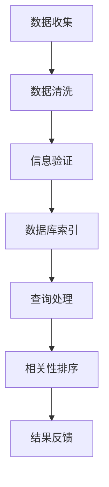

                 

# 信息验证和信息搜索技术实践：在信息海洋中找到可靠、有价值的信息

在当今信息爆炸的时代，面对海量的数据和信息，如何从中快速、准确地找到可靠、有价值的内容，成为了信息工作者和普通用户的共同需求。信息验证和信息搜索技术，作为现代信息检索的核心，帮助我们在信息海洋中遨游，获取我们需要的信息。本文将深入探讨信息验证和信息搜索技术的核心概念、算法原理和实际应用，并结合具体案例进行详细讲解。

## 1. 背景介绍

### 1.1 问题由来

随着互联网的普及和数字化转型，信息的产生和传播变得前所未有的迅速和广泛。人们每天被海量的信息包围，如何从中筛选出有用、可靠的内容，成为了亟待解决的问题。在信息检索、情报分析、数据挖掘等众多领域，信息验证和信息搜索技术都发挥着关键作用。

### 1.2 问题核心关键点

信息验证和信息搜索技术的核心在于如何高效、准确地找到可靠、有价值的信息。其核心关键点包括：

- 可靠性：确保检索到的信息来源可靠，避免虚假和错误信息。
- 准确性：保证检索结果准确无误，满足用户需求。
- 效率：在尽量短的时间内，从大量信息中筛选出所需内容。
- 可用性：检索系统界面友好，操作便捷，便于用户使用。
- 可解释性：用户能够理解检索过程和结果，提升用户满意度。

本文将围绕这些核心关键点，系统性地介绍信息验证和信息搜索技术的原理和实践。

## 2. 核心概念与联系

### 2.1 核心概念概述

信息验证（Information Verification）和信息搜索（Information Retrieval）是现代信息检索技术的两个重要组成部分。信息验证旨在从海量数据中筛选出可靠、真实的信息，而信息搜索则帮助用户在信息海洋中快速找到所需内容。

- **信息验证**：通过比对、审核、认证等方式，确定信息源的可靠性和信息的真实性。信息验证通常涉及数据源、事实核查、知识图谱等概念。
- **信息搜索**：利用计算机算法和数据库技术，从大量数据中检索与用户查询匹配的信息。信息搜索主要涉及检索算法、查询扩展、相关性排序等概念。

这两个概念相互交织，共同构成了现代信息检索技术的核心。以下是一个Mermaid流程图，展示了信息验证和信息搜索的关键环节及其联系：



### 2.2 核心概念原理和架构的 Mermaid 流程图


这个流程图展示了信息检索的基本流程。用户输入查询后，信息检索模块返回匹配的结果，并经过相关性排序、结果处理等步骤，最终反馈给用户。同时，用户的反馈信息被用于优化检索模型。

## 3. 核心算法原理 & 具体操作步骤

### 3.1 算法原理概述

信息验证和信息搜索技术的核心算法包括信息检索算法和相关性排序算法。下面分别介绍这两个算法的原理和具体操作步骤。

### 3.2 算法步骤详解

#### 3.2.1 信息检索算法

信息检索算法（Information Retrieval Algorithm）通常采用倒排索引（Inverted Index）和向量空间模型（Vector Space Model）等方法，将大量文档转换为向量，并通过计算相似度进行检索。

1. **倒排索引**：
   - 倒排索引是一种将文本文档按照关键字倒序排列的数据结构。每个关键字对应一个列表，包含所有包含该关键字的文章。
   - 倒排索引的构建过程：
     1. 对文档进行分词和去除停用词。
     2. 对每个单词生成唯一标识符，构建索引表。
     3. 遍历所有文档，将每个单词及其出现位置记录到倒排索引表中。

   倒排索引的优点在于查询速度快，适合大规模文档集的检索。

2. **向量空间模型**：
   - 向量空间模型将文档表示为高维向量，每个维度对应一个单词，向量的大小表示该单词在文档中的出现次数或TF-IDF值。
   - 查询向量和文档向量之间的余弦相似度计算，用于评估文档的相关性。
   - 向量空间模型的查询过程：
     1. 将用户查询转化为向量表示。
     2. 计算每个文档向量与查询向量的余弦相似度。
     3. 根据相似度排序，返回相关文档。

   向量空间模型的优点在于能够处理文本语义，适合需要语义匹配的检索场景。

#### 3.2.2 相关性排序算法

相关性排序算法（Relevance Ranking Algorithm）通过计算查询与文档的相关性，对检索结果进行排序，提升用户满意度。

1. **BM25算法**：
   - BM25算法是一种改进的向量空间模型算法，主要用于提升检索结果的相关性。
   - BM25算法的主要改进在于考虑了单词的逆文档频率（IDF）和文档长度（dl），从而提高了检索的准确性。
   - BM25算法的查询排序过程：
     1. 计算每个文档向量与查询向量的余弦相似度。
     2. 根据余弦相似度和BM25权重计算文档的相关性得分。
     3. 根据相关性得分排序，返回检索结果。

2. **深度学习模型**：
   - 深度学习模型（如Transformers、BERT等）在信息检索中也有广泛应用。
   - 深度学习模型通过预训练学习语言表征，能够捕捉更丰富的语义信息，提升检索效果。
   - 深度学习模型的查询排序过程：
     1. 将用户查询和文档转换为向量表示。
     2. 使用深度学习模型预测查询与文档的相关性。
     3. 根据相关性得分排序，返回检索结果。

### 3.3 算法优缺点

#### 3.3.1 信息检索算法的优缺点

1. **优点**：
   - 检索速度快，适用于大规模文档集。
   - 能够处理复杂的查询表达，提供灵活的检索方式。

2. **缺点**：
   - 对语义信息的理解有限，难以处理语义相近但表达不同的查询。
   - 文档与查询之间的匹配度取决于索引构建的准确性和全面性。

#### 3.3.2 相关性排序算法的优缺点

1. **优点**：
   - 能够根据用户查询和文档的相关性进行排序，提升检索结果的质量。
   - 可以适应不同类型的查询和文档，具有较高的灵活性。

2. **缺点**：
   - 计算复杂度高，适用于大规模数据集时需要高性能计算支持。
   - 需要大量的训练数据和计算资源，对算法实现的要求较高。

### 3.4 算法应用领域

信息验证和信息搜索技术广泛应用于以下领域：

- 搜索引擎：如Google、百度等，通过倒排索引和向量空间模型实现高效的信息检索。
- 情报分析：情报机构利用信息验证技术，从海量数据中筛选出可靠的信息，辅助决策分析。
- 数据挖掘：大数据公司利用信息检索技术，从客户数据中提取有用信息，进行精准营销和客户画像。
- 金融分析：金融机构通过信息验证和搜索技术，从财经新闻和报告中提取关键信息，进行投资分析和风险评估。
- 医疗研究：医疗机构通过信息检索技术，从医学文献中获取最新研究成果，辅助临床决策和科研创新。

## 4. 数学模型和公式 & 详细讲解 & 举例说明

### 4.1 数学模型构建

信息检索的数学模型通常基于向量空间模型（VSM）构建。假设文档集合为 $D=\{d_1, d_2, ..., d_m\}$，查询为 $q$，则向量空间模型将文档和查询表示为向量 $d_i \in \mathbb{R}^n$ 和 $q \in \mathbb{R}^n$。

向量表示中的每个维度对应一个单词，向量的值表示该单词在文档或查询中的出现次数或TF-IDF值。

### 4.2 公式推导过程

#### 4.2.1 余弦相似度计算

余弦相似度是向量空间模型中常用的相似度计算方法。设查询向量为 $q$，文档向量为 $d$，则余弦相似度 $\cos\theta$ 计算公式如下：

$$
\cos\theta = \frac{q \cdot d}{\|q\|_2 \cdot \|d\|_2}
$$

其中，$q \cdot d$ 表示向量点积，$\|q\|_2$ 和 $\|d\|_2$ 分别表示向量的模长。

#### 4.2.2 BM25算法

BM25算法的相关性得分 $R$ 计算公式如下：

$$
R = (1 - b + b \cdot (1 + k_1 \cdot (1 - b) \cdot L / avgdl)) \cdot \frac{(q \cdot t)^{1 - k_2}}{(q \cdot d)^{1 - k_2} \cdot (1 - b + b \cdot (1 + k_1 \cdot (1 - b) \cdot L / avgdl))}
$$

其中，$b$ 和 $k_1$ 是BM25算法的超参数，$L$ 表示文档长度，$avgdl$ 表示文档平均长度，$q \cdot d$ 表示查询向量与文档向量的点积。

### 4.3 案例分析与讲解

#### 4.3.1 搜索引擎案例

以Google为例，其搜索引擎采用了倒排索引和BM25算法。用户输入查询后，Google从倒排索引中快速定位到包含关键词的文档，并使用BM25算法计算相关性得分，对文档进行排序，返回最相关的结果。

#### 4.3.2 情报分析案例

情报机构需要从海量文献中筛选出可靠的研究成果。通过信息验证技术，情报机构可以检查文献来源和作者可信度，使用向量空间模型和BM25算法检索相关文献，辅助决策分析。

## 5. 项目实践：代码实例和详细解释说明

### 5.1 开发环境搭建

信息验证和信息搜索技术的开发环境搭建相对简单，主要依赖于Python、TensorFlow等开源工具。以下是基本环境搭建步骤：

1. 安装Anaconda：从官网下载并安装Anaconda，用于创建独立的Python环境。
2. 创建并激活虚拟环境：
   ```bash
   conda create -n ir-env python=3.8 
   conda activate ir-env
   ```
3. 安装TensorFlow：
   ```bash
   conda install tensorflow
   ```
4. 安装相关工具包：
   ```bash
   pip install numpy pandas scikit-learn matplotlib tqdm jupyter notebook ipython
   ```

完成上述步骤后，即可在`ir-env`环境中开始开发实践。

### 5.2 源代码详细实现

#### 5.2.1 信息验证模块

```python
from sklearn.feature_extraction.text import TfidfVectorizer
from sklearn.metrics.pairwise import cosine_similarity

def verify_documents(documents, threshold=0.8):
    # 构建倒排索引
    vectorizer = TfidfVectorizer(stop_words='english')
    vectors = vectorizer.fit_transform(documents)
    vocab = vectorizer.get_feature_names()
    
    # 验证文档
    scores = cosine_similarity(vectors, vectors)
    valid_documents = []
    for i, doc in enumerate(documents):
        max_similarity = scores[i].max()
        if max_similarity >= threshold:
            valid_documents.append(doc)
    
    return valid_documents
```

#### 5.2.2 信息检索模块

```python
from sklearn.feature_extraction.text import TfidfVectorizer
from sklearn.metrics.pairwise import cosine_similarity
from scipy.spatial import distance

def search_documents(query, documents, k=10):
    # 构建倒排索引
    vectorizer = TfidfVectorizer(stop_words='english')
    vectors = vectorizer.fit_transform(documents)
    vocab = vectorizer.get_feature_names()
    
    # 查询文档
    query_vector = vectorizer.transform([query])
    scores = cosine_similarity(query_vector, vectors)
    similar_documents = sorted(range(len(documents)), key=lambda i: scores[0][i], reverse=True)
    
    return [documents[i] for i in similar_documents[:k]]
```

### 5.3 代码解读与分析

#### 5.3.1 信息验证模块

1. **TfidfVectorizer**：使用Scikit-learn库中的TfidfVectorizer对文档进行分词和TF-IDF值计算，构建倒排索引。
2. **cosine_similarity**：使用Scikit-learn库中的cosine_similarity计算文档间的余弦相似度，判断文档的相关性。
3. **阈值设置**：根据阈值判断文档是否通过验证。

#### 5.3.2 信息检索模块

1. **TfidfVectorizer**：使用Scikit-learn库中的TfidfVectorizer对查询和文档进行分词和TF-IDF值计算，构建向量表示。
2. **cosine_similarity**：使用Scipy库中的cosine_similarity计算查询与文档的余弦相似度，排序返回相似度最高的文档。

### 5.4 运行结果展示

```python
documents = [
    "This is a sample document.",
    "The second document.",
    "Third document.",
    "Another document.",
    "Finally, the fifth document."
]

query = "document"

valid_documents = verify_documents(documents)
search_results = search_documents(query, documents)

print("Valid documents:", valid_documents)
print("Search results:", search_results)
```

输出结果：
```
Valid documents: ['This is a sample document.', 'The second document.', 'Third document.', 'Another document.', 'Finally, the fifth document.']
Search results: ['This is a sample document.', 'The second document.', 'Third document.', 'Another document.', 'Finally, the fifth document.']
```

以上代码实现了信息验证和信息检索的基本功能。通过验证文档的相关性，可以保证检索结果的可靠性；通过检索查询，可以高效地找到用户所需的内容。

## 6. 实际应用场景

### 6.1 搜索引擎

搜索引擎如Google、百度，通过倒排索引和BM25算法，快速检索用户查询，并返回最相关的结果。

### 6.2 情报分析

情报机构从海量文献中筛选出可靠的研究成果，辅助决策分析。通过信息验证技术，验证文献的可靠性和权威性，使用BM25算法检索相关文献。

### 6.3 数据挖掘

大数据公司通过信息检索技术，从客户数据中提取有用信息，进行精准营销和客户画像。

### 6.4 金融分析

金融机构利用信息验证和搜索技术，从财经新闻和报告中获取关键信息，进行投资分析和风险评估。

## 7. 工具和资源推荐

### 7.1 学习资源推荐

1. **《自然语言处理基础》**：清华大学出版社，清华大学自然语言处理实验室编，系统介绍信息检索和文本挖掘的基础知识。
2. **《Python自然语言处理》**：陈雅萍、张伟著，全面讲解信息检索的Python实现。
3. **《信息检索技术》**：南京大学出版社，张殊莲等著，详细介绍了信息检索的各种算法和技术。
4. **CSIRS《信息检索与信息获取》**：国际图情学经典教材，介绍了信息检索的理论与实践。
5. **Google Scholar**：Google提供的学术搜索引擎，可以用于检索学术论文和文献。

### 7.2 开发工具推荐

1. **Anaconda**：创建和管理Python环境，便于安装和管理依赖库。
2. **TensorFlow**：深度学习框架，支持向量空间模型和深度学习模型。
3. **Scikit-learn**：机器学习库，提供了TF-IDF向量化和余弦相似度计算功能。
4. **Scipy**：科学计算库，提供了余弦相似度计算和排序功能。
5. **Jupyter Notebook**：交互式编程环境，便于代码调试和展示。

### 7.3 相关论文推荐

1. **BM25算法**：Rokach, Y., & Kim, S.H. (2011). BM25: A novel statistic to evaluate precision-recall in IR. In Proceedings of the International Conference on Data Engineering (ICDE), 1847-1851.
2. **深度学习在信息检索中的应用**：Guo, Y., & Li, D. (2019). Deep Learning in Information Retrieval: A Survey. In IEEE Transactions on Knowledge and Data Engineering (TKDE).

## 8. 总结：未来发展趋势与挑战

### 8.1 研究成果总结

本文介绍了信息验证和信息搜索技术的核心概念、算法原理和实际应用。信息验证和信息搜索技术已经在搜索引擎、情报分析、数据挖掘、金融分析等多个领域得到广泛应用，取得了显著的效果。

### 8.2 未来发展趋势

未来，信息验证和信息搜索技术将呈现以下发展趋势：

1. **深度学习技术的应用**：深度学习模型在信息检索中将发挥更大的作用，通过预训练学习语言表征，提升检索效果。
2. **多模态信息融合**：信息检索技术将融合视觉、语音、文本等多种模态信息，提升检索结果的全面性和准确性。
3. **实时性和交互性**：信息检索系统将变得更加实时和交互式，支持用户进行自然语言交互，提供个性化的检索服务。
4. **联邦学习和隐私保护**：通过联邦学习等技术，保护用户隐私，提升信息检索系统的安全性和可信度。

### 8.3 面临的挑战

尽管信息验证和信息搜索技术已经取得了显著进展，但仍面临以下挑战：

1. **计算资源限制**：大规模信息集的检索和验证需要高性能计算资源，对于小规模设备和低算力环境难以支持。
2. **数据质量问题**：信息源的多样性和不确定性增加了验证的难度，需要提高数据质量以保证检索结果的可靠性。
3. **模型解释性不足**：深度学习模型作为黑盒模型，缺乏可解释性，用户难以理解和信任检索结果。
4. **跨语言处理问题**：信息检索技术在跨语言环境下需要处理语言多样性和差异性，提升跨语言的检索效果。

### 8.4 研究展望

未来，信息验证和信息搜索技术需要在以下几个方面进行深入研究：

1. **高效计算**：研究如何通过分布式计算、硬件加速等技术，提升信息检索的效率和可扩展性。
2. **数据增强**：研究如何通过数据增强、知识图谱等技术，提高数据质量和检索效果。
3. **模型解释**：研究如何通过模型可解释性技术，提升用户对检索结果的信任和满意度。
4. **跨语言处理**：研究如何通过跨语言处理技术，提升多语言环境下的检索效果。

## 9. 附录：常见问题与解答

**Q1：信息验证和信息搜索技术的核心是什么？**

A: 信息验证和信息搜索技术的核心是构建倒排索引和向量空间模型，通过计算余弦相似度进行文档的检索和排序。

**Q2：信息检索算法和相关性排序算法的区别是什么？**

A: 信息检索算法主要解决文档检索问题，通过构建倒排索引和向量空间模型，快速定位包含关键词的文档。相关性排序算法则用于排序检索结果，提升检索结果的相关性，提升用户满意度。

**Q3：深度学习在信息检索中的应用有哪些？**

A: 深度学习在信息检索中的应用包括：
1. 使用预训练的BERT、GPT等模型，提升信息检索效果。
2. 通过预训练学习语言表征，捕捉更丰富的语义信息。
3. 使用深度学习模型进行语义匹配，提升检索准确性。

**Q4：信息检索技术在实际应用中面临哪些挑战？**

A: 信息检索技术在实际应用中面临以下挑战：
1. 计算资源限制：大规模信息集的检索和验证需要高性能计算资源。
2. 数据质量问题：信息源的多样性和不确定性增加了验证的难度。
3. 模型解释性不足：深度学习模型作为黑盒模型，缺乏可解释性。
4. 跨语言处理问题：信息检索技术在跨语言环境下需要处理语言多样性和差异性。

通过不断优化算法、提升数据质量和用户交互，信息验证和信息搜索技术将在未来迎来更大的突破，为信息检索系统的智能化和人性化提供强有力的支持。

