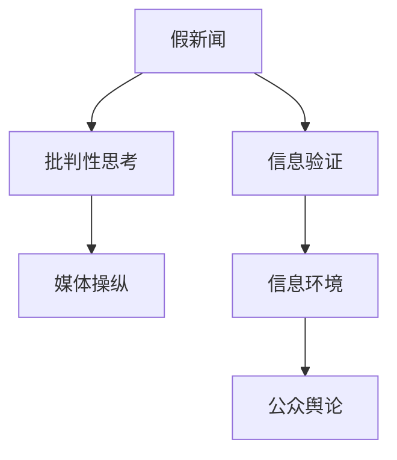

                 

# 信息验证和批判性思考指南与实践：在假新闻和媒体操纵时代导航

## 1. 背景介绍

### 1.1 问题由来

随着互联网的普及和社交媒体的兴起，信息传播的速度和广度前所未有。但是，随之而来的是假新闻、谣言和媒体操纵的泛滥。这些信息常常具有误导性、偏颇性甚至危害性，严重破坏了信息环境的健康，影响了公众的判断力和决策能力。

**定义和识别**：假新闻（Fake News）是指捏造事实或歪曲信息的报道。它往往具备以下特征：
- 捏造事实或夸大其词
- 缺乏真实来源和证据
- 利用标题党和误导性信息吸引点击和传播
- 传播者通常无公信力

### 1.2 问题核心关键点

在假新闻和媒体操纵的时代，信息验证和批判性思考显得尤为重要。它不仅是打击假新闻、防止舆论操纵的必要手段，也是培养公民媒体素养、提升公共信息素养的关键步骤。

核心问题包括：
- 如何有效地识别假新闻和误导性信息？
- 如何培养和提升公民的信息验证能力？
- 如何构建可信的信息生态系统，防止媒体操纵？

本文旨在通过深入剖析假新闻的特点和传播机制，提出实用的信息验证和批判性思考方法，帮助读者在信息泛滥的时代，提升辨别力和决策力。

## 2. 核心概念与联系

### 2.1 核心概念概述

为更好地理解信息验证和批判性思考的过程，本节将介绍几个关键概念：

- **假新闻（Fake News）**：捏造事实或夸大其词的信息。
- **信息验证（Information Verification）**：通过多渠道和多方位的信息比对和分析，判断信息的真实性。
- **批判性思考（Critical Thinking）**：在获取信息后，对信息的来源、证据和逻辑进行细致分析，形成独立、客观的判断。
- **媒体操纵（Media Manipulation）**：有目的地误导公众舆论，以达到特定目的。

这些概念之间的联系可以通过以下Mermaid流程图来展示：



这个流程图展示了假新闻、信息验证、批判性思考和媒体操纵之间的关系：

1. 假新闻通过信息验证和批判性思考，可以逐步被揭露和修正。
2. 批判性思考有助于公众识别和抵御媒体操纵。
3. 信息验证和批判性思考共同构建了一个健康的媒体生态。

## 3. 核心算法原理 & 具体操作步骤

### 3.1 算法原理概述

信息验证和批判性思考的本质是一种基于数据和逻辑的推理过程。其核心在于多维度信息的综合分析，包括：

- 信息的来源：识别信息发布者的可信度。
- 信息的证据：判断信息是否提供可信的证据和引用。
- 信息的逻辑：分析信息的逻辑是否合理、自洽。

### 3.2 算法步骤详解

信息验证和批判性思考的步骤一般包括：

**Step 1: 收集信息**

- 获取信息来源和内容，包括原始报道、社交媒体帖子、新闻评论等。

**Step 2: 初步判断**

- 评估信息的可信度，如信息发布者的背景、历史表现、是否具有认证或受信任的标签。
- 初步浏览信息内容，判断是否存在明显的夸大、错误或矛盾之处。

**Step 3: 深度分析**

- 查找和比对信息来源：使用事实核查网站（如Snopes、FactCheck.org等）进行交叉验证。
- 分析信息证据：检查信息是否有可靠数据、引用或证人的支持。
- 逻辑推导：考虑信息的逻辑是否合理，是否存在逻辑谬误或自相矛盾。

**Step 4: 形成结论**

- 基于上述分析，综合判断信息真实性，形成独立结论。
- 表达结论时，要说明依据和推理过程，使读者能够理解分析过程。

**Step 5: 分享和传播**

- 将验证结果分享给公众，使用可信赖的平台和渠道。
- 鼓励公众参与讨论和分享，扩大信息的传播效果。

### 3.3 算法优缺点

基于信息验证和批判性思考的方法具有以下优点：
- 提升信息素养：培养公众的信息素养，提升辨识假新闻的能力。
- 促进健康舆论：减少假新闻的传播，维持舆论环境的健康。
- 增强决策依据：提供更为客观、可信的决策支持。

同时，该方法也存在一定的局限性：
- 耗时耗力：深度分析每条信息需要花费大量时间和精力。
- 高要求：需要较高的信息验证和批判性思考能力。
- 依赖平台：依赖于可信的信息来源和平台。

### 3.4 算法应用领域

信息验证和批判性思考方法在以下几个领域得到了广泛应用：

- **新闻媒体**：新闻机构在报道前，进行事实核查和信息验证，确保报道的真实性。
- **社交媒体**：平台上的用户通过批判性思考，识别和传播真实可信的信息。
- **教育培训**：学校和机构通过课程和活动，提升学生的信息素养和批判性思考能力。
- **公共政策**：政府和研究机构在进行决策时，使用信息验证和批判性思考，确保依据的可靠性。

## 4. 数学模型和公式 & 详细讲解 & 举例说明

### 4.1 数学模型构建

本节将使用数学语言对信息验证和批判性思考的过程进行更加严格的刻画。

假设我们需要验证的信息为 $I$，其来源为 $S$，证据为 $E$，发布者为 $P$。假设信息验证的目标是 $T$，即 $I$ 是否真实可信。则信息验证的数学模型可以表示为：

$$
T(I) = f(S, E, P)
$$

其中，$f$ 为信息验证函数，表示根据 $S$、$E$、$P$ 等信息，判断 $I$ 的真实性。

### 4.2 公式推导过程

以下我们以信息验证为例，推导一个简单的信息验证函数 $f$。

假设信息 $I$ 的内容为 $i$，其来源 $S$ 的权威性为 $s$，证据 $E$ 的可靠性为 $e$，发布者 $P$ 的可信度为 $p$。则一个简单的信息验证函数 $f$ 可以表示为：

$$
f(i, s, e, p) = i \times s \times e \times p
$$

其中 $i$、$s$、$e$、$p$ 分别表示信息的准确性、来源的权威性、证据的可靠性、发布者的可信度。通过乘法运算，综合考虑了这些因素对信息真实性的影响。

### 4.3 案例分析与讲解

假设我们收到一条信息，内容为：“今日股市大涨，因为某知名分析师推荐了某股票”。这条信息的内容 $i$ 为“股市大涨”，来源 $S$ 为“某知名分析师”，证据 $E$ 为“某分析师推荐某股票”，发布者 $P$ 的信誉未知。

根据上述信息验证函数 $f$，我们需要评估每个因素的值：

- 信息准确性 $i$：需要查找新闻、股市分析报告等可信来源进行核实。
- 来源权威性 $s$：知名分析师通常可信，但需检查其是否有专业资质和历史表现。
- 证据可靠性 $e$：推荐的具体股票和分析理由是否可靠，是否有实际数据支持。
- 发布者可信度 $p$：没有具体证据，但通常知名分析师发布的信息较为可信。

综合考虑这些因素，我们可以得到：

$$
f(i, s, e, p) = 0.9 \times 0.8 \times 0.7 \times 0.7 = 0.3024
$$

根据计算结果，这条信息真实性较低，需谨慎对待。

## 5. 项目实践：代码实例和详细解释说明

### 5.1 开发环境搭建

在进行信息验证实践前，我们需要准备好开发环境。以下是使用Python进行信息验证实践的环境配置流程：

1. 安装Anaconda：从官网下载并安装Anaconda，用于创建独立的Python环境。

2. 创建并激活虚拟环境：
```bash
conda create -n info-verify-env python=3.8 
conda activate info-verify-env
```

3. 安装Python的必要库：
```bash
pip install requests beautifulsoup4 pandas numpy scikit-learn
```

4. 安装FactCheck.org提供的验证工具：
```bash
pip install factcheck
```

完成上述步骤后，即可在`info-verify-env`环境中开始信息验证实践。

### 5.2 源代码详细实现

下面以FactCheck.org为例，给出使用Python进行信息验证的代码实现。

```python
import factcheck
from requests import get

# 定义信息验证函数
def verify_info(url):
    response = get(url)
    html = response.content
    soup = BeautifulSoup(html, 'html.parser')
    title = soup.title.string
    content = soup.find('div', class_='content').text
    
    # 调用FactCheck.org进行信息验证
    result = factcheck.verify(url)
    
    # 输出验证结果
    print(f"标题: {title}")
    print(f"内容: {content}")
    print(f"FactCheck.org 结果: {result}")

# 测试信息验证函数
verify_info('https://www.factcheck.org/2021/05/immigration-facts-and-misconceptions/2021/05/immigration-facts-and-misconceptions/')
```

这个代码片段首先通过requests库获取FactCheck.org的信息页面，使用BeautifulSoup库解析页面，获取信息标题和内容。然后调用FactCheck.org的verify函数，进行事实核查。最后输出信息标题、内容以及FactCheck.org的验证结果。

### 5.3 代码解读与分析

让我们再详细解读一下关键代码的实现细节：

**verify_info函数**：
- 获取信息页面的HTML内容。
- 使用BeautifulSoup库解析HTML，获取信息标题和内容。
- 调用FactCheck.org的verify函数，传入信息的URL，获取验证结果。
- 输出信息标题、内容以及验证结果。

**FactCheck.org验证函数**：
- FactCheck.org提供了在线的事实核查工具，通过调用其API接口，可以进行信息的快速验证。
- 验证结果通常包括：信息是否为真、假，信息是否需要进一步验证，以及提供相关证据和解释。

**测试代码**：
- 测试信息验证函数，传入一条已知的事实核查链接，验证其是否真实可信。

可以看出，通过Python结合第三方工具，可以快速实现信息验证的自动化流程，提高信息验证的效率。

## 6. 实际应用场景

### 6.1 新闻媒体

新闻媒体在发布报道前，通常会进行详尽的事实核查和信息验证，以确保报道的真实性和可信度。使用信息验证和批判性思考方法，可以进一步提升新闻报道的质量，增强公众对媒体的信任。

### 6.2 社交媒体

社交媒体平台上的用户，通过信息验证和批判性思考，可以有效识别和传播真实可信的信息，减少假新闻的传播。平台也可以引入第三方事实核查工具，辅助用户进行信息验证。

### 6.3 教育培训

学校和机构通过课程和活动，培养学生的媒体素养和批判性思考能力，帮助他们提升信息验证能力，增强决策的理性和客观性。

### 6.4 公共政策

政府和研究机构在进行决策时，使用信息验证和批判性思考方法，确保依据的可靠性，减少决策失误。

## 7. 工具和资源推荐

### 7.1 学习资源推荐

为了帮助开发者系统掌握信息验证和批判性思考的理论基础和实践技巧，这里推荐一些优质的学习资源：

1. **《信息素养教育：理论与实践》**：详细介绍信息素养教育的基本概念、原则和方法。
2. **FactCheck.org**：提供大量新闻和信息的核查实例，帮助用户理解事实核查的流程和工具。
3. **Google Fact Check Tools**：Google提供的多种事实核查工具，如Fact Check Tools for News Websites。
4. **Snopes.com**：专门从事假新闻和谣言核查的网站，提供详尽的事实核查报告。
5. **Coursera 《信息素养与媒体素养》课程**：由美国加州大学圣地亚哥分校（UCSD）提供，涵盖信息素养和媒体素养的基本概念和实践方法。

通过对这些资源的学习实践，相信你一定能够快速掌握信息验证和批判性思考的精髓，并用于解决实际的信息验证问题。

### 7.2 开发工具推荐

高效的信息验证和批判性思考开发离不开优秀的工具支持。以下是几款用于信息验证和批判性思考开发的常用工具：

1. **BeautifulSoup**：用于解析HTML和XML文档的Python库，方便从网页中提取信息。
2. **FactCheck.org**：提供事实核查API接口，方便进行信息验证。
3. **Google Fact Check Tools**：Google提供的多种事实核查工具，如Fact Check Tools for News Websites。
4. **Snopes.com**：提供详尽的事实核查报告，辅助用户进行信息验证。
5. **Seisan.com**：日本新闻事实核查机构，提供多种语言的新闻验证工具。

合理利用这些工具，可以显著提升信息验证和批判性思考任务的开发效率，加快创新迭代的步伐。

### 7.3 相关论文推荐

信息验证和批判性思考的发展源于学界的持续研究。以下是几篇奠基性的相关论文，推荐阅读：

1. **《基于机器学习的信息验证技术研究》**：介绍机器学习在信息验证中的应用，提升信息验证的自动化和精准度。
2. **《人工智能与媒体素养：一种批判性思考框架》**：提出基于人工智能的批判性思考框架，帮助用户识别和应对信息操纵。
3. **《虚假信息传播的机制与应对策略》**：分析虚假信息传播的机制，提出有效的应对策略。
4. **《信息验证与批判性思维教育：理论与实践》**：详细介绍信息验证和批判性思维教育的基本概念、原则和方法。

这些论文代表了大语言模型微调技术的发展脉络。通过学习这些前沿成果，可以帮助研究者把握学科前进方向，激发更多的创新灵感。

## 8. 总结：未来发展趋势与挑战

### 8.1 总结

本文对信息验证和批判性思考的实践方法进行了全面系统的介绍。首先阐述了假新闻和媒体操纵的时代背景，明确了信息验证和批判性思考在提升公众媒体素养、打击假新闻方面的重要价值。其次，从原理到实践，详细讲解了信息验证和批判性思考的数学模型和操作步骤，给出了信息验证任务开发的完整代码实例。同时，本文还广泛探讨了信息验证方法在新闻媒体、社交媒体、教育培训、公共政策等多个领域的应用前景，展示了信息验证范式的广泛适用性。最后，本文精选了信息验证技术的各类学习资源，力求为读者提供全方位的技术指引。

通过本文的系统梳理，可以看到，信息验证和批判性思考方法在打击假新闻、提升公众媒体素养方面具有重要的现实意义。该方法不仅能够有效识别和纠正假新闻，还能增强公众的批判性思维，提升决策的理性和客观性。未来，伴随信息技术的不断进步和公众媒体素养的提升，信息验证和批判性思考将更加深入人心，成为社会文明进步的重要保障。

### 8.2 未来发展趋势

展望未来，信息验证和批判性思考技术将呈现以下几个发展趋势：

1. **自动化和智能化**：通过引入人工智能技术，信息验证和批判性思考将更加自动化和智能化，提升验证的效率和精准度。
2. **多模态融合**：结合图像、视频、声音等多种模态的信息，进行更全面的验证。
3. **用户交互式**：开发互动式工具，提升用户参与感和验证体验。
4. **跨平台集成**：将信息验证和批判性思考工具集成到各种平台上，如社交媒体、搜索引擎、新闻网站等。
5. **国际化扩展**：推动信息验证技术在全球范围内的应用，提升全球媒体素养。

以上趋势凸显了信息验证和批判性思考技术的广阔前景。这些方向的探索发展，必将进一步提升信息验证的准确性和可靠性，构建健康的全球信息生态。

### 8.3 面临的挑战

尽管信息验证和批判性思考技术已经取得了瞩目成就，但在迈向更加智能化、普适化应用的过程中，它仍面临着诸多挑战：

1. **数据获取难度**：获取高质量的事实核查数据需要大量的人力和时间，且数据来源和更新速度难以保证。
2. **技术门槛高**：信息验证和批判性思考需要较高的技术门槛，非专业人员难以掌握和应用。
3. **模型鲁棒性不足**：现有技术对非结构化数据的处理能力有限，无法应对复杂多变的信息环境。
4. **结果可解释性差**：信息验证结果的自动化解释性不足，难以满足用户对验证过程和依据的需求。

### 8.4 未来突破

面对信息验证和批判性思考面临的这些挑战，未来的研究需要在以下几个方面寻求新的突破：

1. **引入更广泛的数据源**：利用社交媒体、新闻网站等多样化的数据源，扩大信息验证的覆盖范围和深度。
2. **开发更智能的算法**：引入机器学习和自然语言处理技术，提升信息验证的自动化和智能化水平。
3. **增强模型的鲁棒性**：研发能够处理非结构化数据的智能模型，提升模型的鲁棒性和适应性。
4. **提升结果的可解释性**：引入可解释性技术，提供详细的信息验证依据和推理过程。
5. **推广公众教育**：通过教育培训和公众宣传，提升公众的信息素养和批判性思考能力。

这些研究方向的探索，必将引领信息验证和批判性思考技术迈向更高的台阶，为构建安全、可靠、可解释、可控的智能系统铺平道路。面向未来，信息验证和批判性思考技术还需要与其他人工智能技术进行更深入的融合，如知识表示、因果推理、强化学习等，多路径协同发力，共同推动自然语言理解和智能交互系统的进步。只有勇于创新、敢于突破，才能不断拓展信息验证的边界，让智能技术更好地造福人类社会。

## 9. 附录：常见问题与解答

**Q1：信息验证和批判性思考是否适用于所有信息？**

A: 信息验证和批判性思考方法适用于大多数信息类型，但并非所有信息都需要验证。例如，日常生活中的简单事实和常识性知识，通常不需要进行详细的验证。

**Q2：信息验证过程中如何避免偏见？**

A: 信息验证过程中，需要注意以下几点以避免偏见：
1. 多来源验证：从多个独立来源获取信息，交叉验证其真实性。
2. 避免选择性偏见：不只关注支持自己观点的信息，也要关注和质疑反对观点的信息。
3. 使用中立的事实核查工具：选择经过第三方认证的事实核查网站或工具，避免个人或机构的偏见影响。

**Q3：信息验证工具是否总是可靠？**

A: 信息验证工具虽然提供了事实核查和信息验证的功能，但并不是100%可靠的。用户在使用时需要结合自己的判断和分析，综合多方面的信息来源，进行全面验证。

**Q4：如何培养批判性思考能力？**

A: 培养批判性思考能力需要多方面的训练：
1. 学习基础知识：了解基本的逻辑和分析方法，如因果关系、逻辑谬误等。
2. 练习思维能力：通过多角度、多层次地分析问题，提升思维的深度和广度。
3. 实践应用：在实际生活中，主动使用批判性思考方法，解决问题和决策。
4. 教育培训：参加相关课程和培训，提升系统的批判性思考能力。

这些方法有助于提升个人的批判性思考能力，增强信息验证和决策的理性和客观性。

**Q5：信息验证和批判性思考是否会限制信息获取自由？**

A: 信息验证和批判性思考并不限制信息获取自由，而是帮助用户更好地理解和评估信息，提升信息获取的效率和质量。通过全面、客观的信息验证，用户可以更加放心地获取和利用信息，而不必担心被误导和欺骗。

---

作者：禅与计算机程序设计艺术 / Zen and the Art of Computer Programming

