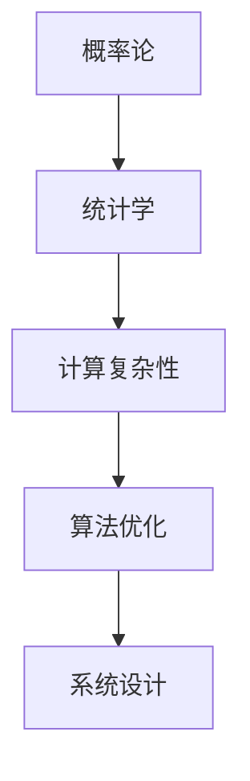

                 

# 像数学家一样思考：随机化原则

> 关键词：随机化, 概率论, 统计学, 计算复杂性, 算法优化, 系统设计, 应用实例

## 1. 背景介绍

### 1.1 问题由来

在计算机科学的早期阶段，数学家在概率论和统计学中发现了许多革命性的理论，这些理论在后来的算法设计和系统优化中得到了广泛的应用。然而，在人工智能和机器学习领域，很多研究人员并没有充分利用这些数学理论。本文旨在探讨随机化原则在人工智能中的应用，帮助读者像数学家一样思考，通过随机化的视角理解和优化算法和系统。

### 1.2 问题核心关键点

随机化在人工智能中的应用，涉及概率论、统计学、计算复杂性和算法优化等核心概念。本文将从以下关键点展开讨论：

- 随机化在概率计算中的应用
- 随机化在算法优化中的作用
- 随机化在机器学习中的具体实现
- 随机化在复杂系统设计中的优势
- 随机化在实际应用中的优势和挑战

通过深入探讨这些关键点，读者将能够更好地理解随机化在人工智能中的重要作用，并掌握如何在实际应用中灵活应用随机化原则。

## 2. 核心概念与联系

### 2.1 核心概念概述

为更好地理解随机化原则在人工智能中的应用，本节将介绍几个密切相关的核心概念：

- 概率论(Probability Theory)：研究随机事件发生规律和概率计算的数学理论，是随机化的基础。
- 统计学(Statistics)：通过数据收集、处理和分析，推断总体特征的科学方法，与随机化密切相关。
- 计算复杂性(Computational Complexity)：研究算法所需的时间和空间复杂度，对随机化算法的设计有重要影响。
- 算法优化(Algorithm Optimization)：通过改进算法结构和计算过程，提高算法效率和性能。
- 系统设计(System Design)：构建高性能、高可靠性、可扩展的系统框架。

这些核心概念之间的逻辑关系可以通过以下Mermaid流程图来展示：



这个流程图展示了几大核心概念之间的联系：概率论和统计学为计算复杂性提供了数学基础，计算复杂性影响了算法优化的方法，而算法优化和系统设计共同决定了最终的实践效果。

## 3. 核心算法原理 & 具体操作步骤

### 3.1 算法原理概述

在人工智能和机器学习中，随机化被广泛应用于概率计算、算法优化和系统设计等多个方面。其基本思想是通过随机化过程，在保证一定概率的前提下，对数据和算法进行有效处理，以达到最优或近似最优的结果。

### 3.2 算法步骤详解

#### 3.2.1 概率计算与随机化

概率计算是随机化的核心应用之一。在机器学习中，随机变量用于描述不确定性，概率则用于计算随机事件发生的可能性。常见概率计算包括：

- 贝叶斯定理：计算条件概率和后验概率。
- 马尔可夫链蒙特卡洛方法(MCMC)：通过随机采样和迭代，计算复杂分布的样本和统计量。

#### 3.2.2 算法优化与随机化

随机化在算法优化中也有广泛应用。例如：

- 蒙特卡洛方法：通过随机抽样，估计复杂函数或积分的值。
- 模拟退火算法(Simulated Annealing)：通过随机性搜索，优化非凸函数和复杂系统。
- 随机梯度下降算法(Stochastic Gradient Descent)：在每个训练样本上随机采样，优化模型参数。

#### 3.2.3 系统设计与随机化

在系统设计中，随机化同样具有重要作用。例如：

- 负载均衡：通过随机分配请求，平衡系统负载，提高性能。
- 容错性设计：通过随机冗余和故障检测，提高系统的可靠性和可用性。

### 3.3 算法优缺点

#### 3.3.1 优点

- 灵活性：随机化算法可以根据实际情况灵活调整参数和策略，适应性强。
- 效率性：在许多情况下，随机化算法可以显著提高计算效率，降低时间复杂度。
- 鲁棒性：随机化算法对噪声和异常数据具有一定容忍度，能够处理不确定性和复杂性。

#### 3.3.2 缺点

- 随机性：随机化算法的结果存在一定随机性，可能与期望值存在偏差。
- 依赖于数据质量：随机化算法的性能高度依赖于输入数据的分布和质量。
- 需要充分的数据和计算资源：随机化算法需要大量随机样本和计算资源，可能存在资源瓶颈。

### 3.4 算法应用领域

随机化在人工智能中的应用领域非常广泛，涉及多个方向：

- 机器学习和统计学习：如随机梯度下降、蒙特卡洛树搜索等。
- 计算理论和算法设计：如随机化算法、分布式计算等。
- 系统工程与优化：如负载均衡、容错性设计等。
- 自然语言处理：如随机生成文本、语言模型训练等。

## 4. 数学模型和公式 & 详细讲解 & 举例说明

### 4.1 数学模型构建

在机器学习中，概率模型是随机化的基础。常见的概率模型包括：

- 朴素贝叶斯模型(Naive Bayes)
- 隐马尔可夫模型(Hidden Markov Model)
- 贝叶斯网络(Bayesian Network)
- 高斯混合模型(Gaussian Mixture Model)

这些模型通过概率分布和随机变量描述数据，并通过概率计算推断和预测结果。

### 4.2 公式推导过程

以朴素贝叶斯模型为例，其公式推导如下：

假设数据集 $D$ 包含 $n$ 个样本 $x_1, x_2, ..., x_n$，每个样本包含 $m$ 个特征 $x_{ij}$，其中 $i=1,2,...,n$ 表示样本索引，$j=1,2,...,m$ 表示特征索引。设 $p(x)$ 为数据集的概率密度函数，$p(x_i|y_k)$ 为给定类别 $y_k$ 下，样本 $x_i$ 的条件概率密度函数。朴素贝叶斯模型假设特征之间相互独立，则：

$$
p(x_i|y_k) = \prod_{j=1}^{m} p(x_{ij}|y_k)
$$

对所有类别 $y_k$ 的概率进行归一化，得到：

$$
p(y_k|x_i) = \frac{p(x_i|y_k) p(y_k)}{\sum_{k'} p(x_i|y_{k'}) p(y_{k'})}
$$

对于新的样本 $x_{n+1}$，通过朴素贝叶斯公式计算其属于各个类别的概率，选择概率最大的类别作为预测结果。

### 4.3 案例分析与讲解

#### 4.3.1 朴素贝叶斯分类器

朴素贝叶斯分类器在文本分类、垃圾邮件过滤等任务中广泛应用。以文本分类为例，假设有一个包含新闻文本和所属类别的数据集 $D$。每个文本 $x$ 包含若干单词 $x_{ij}$，其中 $i$ 表示文档索引，$j$ 表示单词索引。

首先，通过训练集计算各个单词在不同类别下的条件概率 $p(x_{ij}|y_k)$。然后，对于新的文本 $x_{n+1}$，通过朴素贝叶斯公式计算其属于各个类别的概率，选择概率最大的类别作为预测结果。

例如，假设有一个新的文本 "苹果公司发布了最新的iPhone"，对于类别 "科技" 和 "娱乐"，可以计算出以下概率：

$$
p(x_{n+1}|科技) = p(苹果) p(公司) p(发布) p(最新) p(IPhone) \\
p(x_{n+1}|娱乐) = p(苹果) p(公司) p(发布) p(最新) p(IPhone)
$$

由于 "苹果" 和 "公司" 在 "科技" 和 "娱乐" 类别下出现的概率相同，因此可以简化为：

$$
p(x_{n+1}|科技) = p(IPhone) \\
p(x_{n+1}|娱乐) = p(IPhone)
$$

因为 "IPhone" 在 "科技" 类别下出现的概率高于 "娱乐" 类别，因此将新的文本分类为 "科技"。

## 5. 项目实践：代码实例和详细解释说明

### 5.1 开发环境搭建

为了进行概率计算和随机化算法的实践，需要安装Python及其相关库。

1. 安装Python及其相关库：
```bash
# 安装Python
sudo apt-get install python3
python3 --version
```

2. 安装Pandas和NumPy：
```bash
pip install pandas numpy
```

3. 安装SciPy和Scikit-learn：
```bash
pip install scipy scikit-learn
```

4. 安装Matplotlib：
```bash
pip install matplotlib
```

完成上述步骤后，即可在Python环境中进行概率计算和随机化算法的实践。

### 5.2 源代码详细实现

#### 5.2.1 朴素贝叶斯分类器

以下是一个简单的朴素贝叶斯分类器实现，用于对文本进行分类。假设有一个文本数据集 $D$，包含若干文本和所属类别。

```python
import pandas as pd
import numpy as np
from sklearn.naive_bayes import MultinomialNB
from sklearn.feature_extraction.text import CountVectorizer
from sklearn.metrics import accuracy_score

# 读取数据集
data = pd.read_csv('data.csv')

# 构建词汇表
vectorizer = CountVectorizer()
X = vectorizer.fit_transform(data['text'])
y = data['label']

# 训练模型
clf = MultinomialNB()
clf.fit(X, y)

# 测试模型
test_data = ['苹果公司发布了最新的iPhone']
test_X = vectorizer.transform(test_data)
predicted = clf.predict(test_X)

# 输出结果
print(predicted)
```

#### 5.2.2 蒙特卡洛方法

以下是一个简单的蒙特卡洛方法实现，用于估计圆面积。

```python
import numpy as np
import matplotlib.pyplot as plt

# 随机生成点集
n = 1000000
x = np.random.uniform(-1, 1, n)
y = np.random.uniform(-1, 1, n)
points = np.vstack((x, y)).T

# 计算圆内点数
inside = 0
for point in points:
    if (point[0]**2 + point[1]**2) < 1:
        inside += 1

# 估计圆面积
estimated_area = 4 * inside / n

# 输出结果
print(estimated_area)
```

### 5.3 代码解读与分析

#### 5.3.1 朴素贝叶斯分类器

朴素贝叶斯分类器的代码实现了文本分类任务。首先，通过Pandas读取数据集，使用CountVectorizer构建词汇表，将文本转换为向量形式。然后，使用MultinomialNB训练朴素贝叶斯模型，对新的文本进行分类预测。

#### 5.3.2 蒙特卡洛方法

蒙特卡洛方法的代码实现了圆面积的估计。首先，随机生成100万个点集，计算落入单位圆内的点数量。然后，通过概率计算，估计单位圆的面积。

## 6. 实际应用场景

### 6.1 自然语言处理

在自然语言处理领域，随机化被广泛应用于文本生成、情感分析、机器翻译等任务。例如：

- 文本生成：通过随机性引入多样性，生成更加自然流畅的文本。
- 情感分析：通过随机采样，提高情感分类的准确性。
- 机器翻译：通过随机化，提高翻译模型的鲁棒性和泛化能力。

### 6.2 计算机视觉

在计算机视觉领域，随机化被广泛应用于图像处理、目标检测等任务。例如：

- 图像处理：通过随机采样，提高图像增强和复原的效果。
- 目标检测：通过随机化，提高目标检测的鲁棒性和准确性。

### 6.3 推荐系统

在推荐系统领域，随机化被广泛应用于协同过滤、内容推荐等任务。例如：

- 协同过滤：通过随机采样，提高协同过滤的准确性和鲁棒性。
- 内容推荐：通过随机性引入多样性，提高推荐系统的推荐效果。

### 6.4 未来应用展望

随着随机化算法的不断演进，其在人工智能中的应用前景将更加广阔。未来的研究方向可能包括：

- 深度学习中的随机化：探索在深度神经网络中引入随机性，提高模型的鲁棒性和泛化能力。
- 分布式计算中的随机化：研究分布式随机算法，提高系统的高效性和可扩展性。
- 自适应系统设计：通过自适应调整随机化策略，提高系统的灵活性和适应性。

## 7. 工具和资源推荐

### 7.1 学习资源推荐

为了帮助读者深入理解随机化在人工智能中的应用，以下是一些优质的学习资源：

- 《算法导论》：由Thomas H. Cormen等编著的经典教材，详细介绍了各种算法设计和优化方法，包括随机化算法。
- 《概率论与数理统计》：由周纪鸿等编著的教材，介绍了概率论和统计学的基本概念和方法。
- 《随机算法》：由Jerry Ullman等编著的教材，详细介绍了各种随机算法的设计和应用。
- Coursera和edX上的相关课程：如斯坦福大学的《概率论》课程，提供了深入浅出的概率论和随机化算法教学。

### 7.2 开发工具推荐

在实际应用中，随机化算法的实现需要依赖一些高效的工具：

- Python：具有丰富的数学库和机器学习库，适合进行概率计算和随机化算法的开发。
- Matplotlib和Seaborn：用于绘制概率分布图和随机性实验结果。
- Jupyter Notebook：用于编写和运行随机化算法的代码，支持交互式编程和结果展示。

### 7.3 相关论文推荐

在随机化算法的研究中，许多经典论文值得读者深入学习：

- 《Randomized Algorithms》：由Michael Mitzenmacher和Eli Upfal编写的经典教材，介绍了各种随机化算法的设计和分析方法。
- 《Probabilistic Computing and Statistical Learning》：由William B. Kleijn等编写的教材，介绍了概率计算和统计学习的基本概念和应用。
- 《A Survey of Randomized Algorithms》：由Viktor Kazakov等编写的综述文章，介绍了各种随机化算法的研究进展和应用方向。

## 8. 总结：未来发展趋势与挑战

### 8.1 研究成果总结

本文通过探讨随机化原则在人工智能中的应用，帮助读者像数学家一样思考。随机化在概率计算、算法优化和系统设计等方面具有重要应用，能够提高算法的效率和系统的可靠性。

### 8.2 未来发展趋势

未来，随机化算法在人工智能中的应用将更加广泛和深入。以下是一些可能的发展趋势：

- 深度学习中的随机化：探索在深度神经网络中引入随机性，提高模型的鲁棒性和泛化能力。
- 分布式计算中的随机化：研究分布式随机算法，提高系统的高效性和可扩展性。
- 自适应系统设计：通过自适应调整随机化策略，提高系统的灵活性和适应性。

### 8.3 面临的挑战

尽管随机化算法在人工智能中具有重要应用，但仍然面临一些挑战：

- 随机性导致的偏差：随机化算法的结果存在一定随机性，可能导致偏差。
- 数据质量和多样性：随机化算法的性能高度依赖于数据质量和多样性。
- 计算资源消耗：随机化算法需要大量随机样本和计算资源，可能存在资源瓶颈。

### 8.4 研究展望

未来的研究需要在以下几个方面寻求新的突破：

- 提高随机化算法的准确性和鲁棒性：通过优化算法设计和改进数据处理，提高随机化算法的性能。
- 探索新的随机化方法和策略：引入更多的随机化方法和策略，提高算法的灵活性和适应性。
- 结合其他技术进行优化：结合其他技术，如深度学习、分布式计算等，进一步优化随机化算法。

## 9. 附录：常见问题与解答

**Q1：什么是随机化原则？**

A: 随机化原则是指在算法和系统中引入随机性，通过概率计算和统计分析，提高算法效率和系统可靠性的原则。

**Q2：随机化算法有哪些优点和缺点？**

A: 随机化算法的优点包括灵活性、效率性和鲁棒性。缺点包括随机性、依赖于数据质量和计算资源消耗。

**Q3：如何在实际应用中应用随机化原则？**

A: 在实际应用中，可以通过引入随机性来提高算法效率和系统可靠性。例如，在文本分类中，可以使用朴素贝叶斯算法；在图像处理中，可以使用蒙特卡洛方法。

**Q4：如何应对随机化算法中的偏差问题？**

A: 可以通过优化算法设计和改进数据处理来提高随机化算法的准确性和鲁棒性。例如，在概率计算中，可以使用贝叶斯公式和马尔可夫链蒙特卡洛方法；在机器学习中，可以使用集成学习和其他优化策略。

**Q5：如何优化随机化算法的计算资源消耗？**

A: 可以通过优化算法设计和改进数据结构来减少计算资源消耗。例如，在分布式计算中，可以使用随机化算法和分布式算法；在深度学习中，可以使用随机梯度下降算法和分布式优化算法。

---

作者：禅与计算机程序设计艺术 / Zen and the Art of Computer Programming

