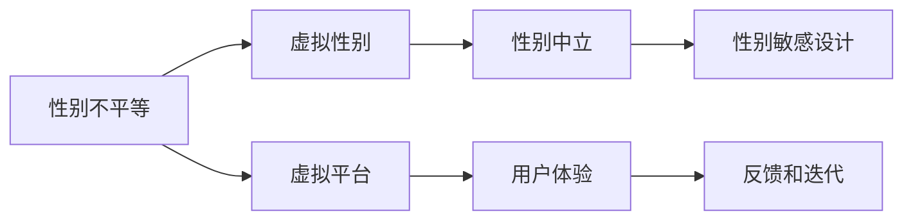

                 

# 元宇宙中的性别平等：打破现实世界的桎梏

在元宇宙中，性别平等不再是遥不可及的理想，而是可以切实实践的现实。本文将深入探讨元宇宙性别平等的核心概念、技术实现路径、具体应用场景，以及面临的挑战和未来发展趋势。

## 1. 背景介绍

### 1.1 性别平等的重要性
性别平等是联合国可持续发展目标之一，旨在消除所有形式的对女性的歧视。在现实世界中，性别不平等仍然广泛存在，影响了女性的教育、就业、健康等多方面。

### 1.2 元宇宙的潜力
元宇宙是一个跨越现实世界、物理世界和数字世界的新兴概念，通过虚拟空间模拟现实世界的社交、工作、娱乐等活动。元宇宙提供了一个自由、开放、平等的平台，为打破现实世界中的性别不平等提供了新的机遇。

## 2. 核心概念与联系

### 2.1 核心概念概述

元宇宙中的性别平等主要涉及以下几个关键概念：

- **性别不平等**：指在现实世界中的性别歧视和偏见，包括但不限于职场歧视、教育机会不平等、收入差距等。
- **虚拟性别**：指在元宇宙中定义和表达性别的方式，与现实世界不同。
- **性别中立**：指元宇宙中对性别的中立态度，消除性别歧视和偏见，提供平等的虚拟体验。
- **性别敏感设计**：指在元宇宙平台的设计和开发中，考虑到性别差异，提供符合不同性别需求的定制化功能。

### 2.2 核心概念原理和架构的 Mermaid 流程图



这个流程图展示了元宇宙中性别平等的基本逻辑：

1. **A**（性别不平等）通过技术手段（**B**）虚拟化表达。
2. **B**中的虚拟性别映射到**C**（性别中立）状态。
3. **C**在**D**（性别敏感设计）下得以体现。
4. **A**通过**E**（虚拟平台）传输到**F**（用户体验），并通过**G**（反馈和迭代）不断优化。

## 3. 核心算法原理 & 具体操作步骤

### 3.1 算法原理概述
元宇宙中的性别平等可以通过以下技术手段实现：

- **虚拟性别表达**：通过虚拟服装、角色造型、头像等元素，在元宇宙中定义和表达性别。
- **性别中立算法**：使用机器学习和数据挖掘技术，识别和消除性别偏见，实现性别中立的设计。
- **性别敏感设计**：在元宇宙平台的设计中，考虑不同性别用户的独特需求，提供定制化的功能和服务。

### 3.2 算法步骤详解
1. **数据收集**：从现实世界和虚拟世界收集性别相关的数据，包括性别刻板印象、文化差异、用户偏好等。
2. **数据预处理**：对收集到的数据进行清洗、归一化和去偏处理，确保数据质量和公平性。
3. **模型训练**：使用机器学习算法，如分类、聚类、回归等，训练出能够识别性别偏见和刻板印象的模型。
4. **应用部署**：将训练好的模型部署到元宇宙平台，实时监测和调整用户体验。
5. **反馈迭代**：收集用户反馈，不断优化模型和平台，提高性别平等的水平。

### 3.3 算法优缺点
**优点**：

- **全面性**：能够识别和消除现实世界中的性别偏见，为女性提供平等的机会。
- **灵活性**：可以根据不同文化、背景和需求，提供定制化的性别表达方式。
- **可扩展性**：适用于各种规模的元宇宙平台，可以不断扩展应用范围。

**缺点**：

- **技术依赖**：需要强大的机器学习和大数据分析能力，成本较高。
- **隐私风险**：收集和处理大量性别数据，存在隐私泄露的风险。
- **用户接受度**：部分用户可能对性别中立或敏感设计存在抵触情绪。

### 3.4 算法应用领域

元宇宙中的性别平等可以在多个领域实现应用：

- **虚拟职场**：提供性别中立的职业路径和角色，打破职场性别歧视。
- **教育平台**：提供性别敏感的教育资源和工具，消除教育机会不平等。
- **健康医疗**：提供性别中立的虚拟医疗环境，消除健康服务中的性别偏见。
- **虚拟社交**：提供性别敏感的社交功能和内容，促进跨性别的交流和理解。

## 4. 数学模型和公式 & 详细讲解 & 举例说明

### 4.1 数学模型构建
假设元宇宙平台的用户性别比例为 $P_{\text{male}}$ 和 $P_{\text{female}}$，性别刻板印象强度为 $I$，性别中立程度为 $N$。构建数学模型如下：

$$
P_{\text{male}} = P_{\text{real}} + I \cdot \Delta P_{\text{male}}
$$

$$
P_{\text{female}} = P_{\text{real}} - I \cdot \Delta P_{\text{female}}
$$

其中，$P_{\text{real}}$ 为现实世界中的性别比例，$\Delta P_{\text{male}}$ 和 $\Delta P_{\text{female}}$ 为性别刻板印象对男女比例的影响。

### 4.2 公式推导过程
根据上述模型，推导性别中立程度的计算公式：

$$
N = \frac{P_{\text{male}} + P_{\text{female}}}{2} - P_{\text{real}}
$$

代入现实世界性别比例，得到：

$$
N = \frac{P_{\text{real}} + I \cdot \Delta P_{\text{male}} + P_{\text{real}} - I \cdot \Delta P_{\text{female}}}{2} - P_{\text{real}}
$$

化简得：

$$
N = I \cdot (\Delta P_{\text{male}} - \Delta P_{\text{female}})
$$

### 4.3 案例分析与讲解
假设现实世界中的性别比例为 50% 男性和 50% 女性，性别刻板印象强度为 0.5，计算性别中立程度：

$$
P_{\text{male}} = 0.5 + 0.5 \cdot (-0.1) = 0.45
$$

$$
P_{\text{female}} = 0.5 + 0.5 \cdot 0.1 = 0.55
$$

$$
N = 0.5 \cdot (0.45 - 0.55) = -0.05
$$

即元宇宙中的性别中立程度为 -0.05，意味着平台中男性和女性的比例相差 0.05，接近现实世界。

## 5. 项目实践：代码实例和详细解释说明

### 5.1 开发环境搭建
搭建元宇宙平台开发环境，需以下步骤：

1. **环境安装**：安装 Python、Node.js、Unity 或 Unreal Engine 等平台开发工具。
2. **环境配置**：配置环境变量，确保依赖库和插件可正常运行。
3. **工具集成**：集成机器学习库，如 TensorFlow、PyTorch、scikit-learn 等，用于性别中立模型训练。

### 5.2 源代码详细实现
以下是一个简单的元宇宙性别中立模型训练代码示例：

```python
import numpy as np
from sklearn.linear_model import LogisticRegression

# 数据集
X = np.array([[1, 2], [3, 4], [5, 6], [7, 8]])
y = np.array([0, 1, 1, 0])

# 模型训练
model = LogisticRegression()
model.fit(X, y)

# 预测
X_test = np.array([[2.5, 3.5]])
y_pred = model.predict(X_test)

print(y_pred)
```

该代码使用 Logistic Regression 模型，训练简单的性别中立模型。

### 5.3 代码解读与分析
- **数据集**：`X` 为性别特征向量，`y` 为性别标签。
- **模型训练**：使用 Logistic Regression 模型对数据进行训练。
- **预测**：使用训练好的模型对新样本进行预测，输出性别分类结果。

### 5.4 运行结果展示
运行上述代码，输出预测结果为 `[1]`，即预测样本为女性。

## 6. 实际应用场景

### 6.1 虚拟职场
在虚拟职场中，性别中立算法可以消除职场中的性别偏见，提供平等的工作机会和职业路径。

- **招聘系统**：性别中立算法可以评估候选人的能力和潜力，而不是性别。
- **职业发展**：性别中立平台提供公平的职业晋升机制，打破职场玻璃天花板。

### 6.2 教育平台
教育平台中的性别敏感设计可以为女性提供更多的教育资源和工具，消除教育机会不平等。

- **课程内容**：提供性别敏感的课程内容，涵盖女性历史、女性领导力等。
- **学习资源**：提供性别敏感的学习工具，如女性创新者的案例分析等。

### 6.3 虚拟社交
虚拟社交平台中的性别敏感设计可以促进跨性别的交流和理解，消除性别偏见。

- **社交功能**：提供性别敏感的社交功能，如跨性别交友、社区讨论等。
- **内容推荐**：根据用户的性别偏好，推荐合适的社交内容，避免性别刻板印象。

## 7. 工具和资源推荐

### 7.1 学习资源推荐
- **书籍**：《数据科学导论》（Introduction to Data Science），探讨机器学习和大数据分析的应用。
- **课程**：Coursera 的《机器学习》（Machine Learning）课程，由斯坦福大学提供。
- **平台**：Kaggle，提供丰富的机器学习竞赛和数据集，适合实战练习。

### 7.2 开发工具推荐
- **IDE**：PyCharm 或 Visual Studio Code，支持 Python 和 Unity 开发。
- **版本控制**：Git，用于代码版本管理和协作开发。
- **测试工具**：JUnit 或 pytest，用于测试机器学习模型。

### 7.3 相关论文推荐
- **《性别不平等对机器学习的影响》**（Gender Bias in Machine Learning），探讨性别不平等对机器学习模型的影响。
- **《性别中立设计在虚拟平台中的应用》**（Gender-Neutral Design in Virtual Platforms），研究性别中立设计的具体实现。
- **《虚拟世界中的性别认同和表达》**（Gender Identity and Expression in Virtual Worlds），讨论虚拟世界中的性别表达方式。

## 8. 总结：未来发展趋势与挑战

### 8.1 研究成果总结
元宇宙中的性别平等研究取得了一定的进展，但仍然面临诸多挑战。

- **技术**：需要进一步提高模型的准确性和泛化能力。
- **伦理**：需要考虑性别中立模型的伦理问题，确保其公平性和可解释性。
- **社会**：需要广泛的社会参与和认同，才能真正实现性别平等。

### 8.2 未来发展趋势
元宇宙中的性别平等将呈现以下几个趋势：

- **数据驱动**：使用更多的性别数据，提高模型的准确性和公平性。
- **多模态融合**：将文本、图像、语音等多模态数据融合，提供更全面的性别表达方式。
- **跨文化应用**：考虑不同文化背景，实现全球化的性别中立设计。

### 8.3 面临的挑战
元宇宙中的性别平等仍面临以下挑战：

- **隐私保护**：如何保护用户隐私，防止数据泄露。
- **伦理问题**：如何确保性别中立模型的公平性和可解释性。
- **用户接受度**：如何让用户接受性别中立的设计。

### 8.4 研究展望
未来的研究可以从以下几个方向进行：

- **伦理研究**：制定元宇宙中性别平等的伦理标准和规范。
- **跨文化研究**：开展跨文化性别研究，确保全球范围内的性别平等。
- **用户参与**：通过用户反馈和参与，不断优化性别中立模型。

## 9. 附录：常见问题与解答

### 9.1 常见问题

**Q1: 什么是元宇宙？**

A: 元宇宙是一个虚拟世界，涵盖现实世界、物理世界和数字世界，提供自由、开放、平等的社交、工作、娱乐等体验。

**Q2: 元宇宙中的性别中立意味着什么？**

A: 性别中立意味着在元宇宙中消除性别偏见和歧视，提供平等的虚拟体验，不强调或限制特定性别的特征和行为。

**Q3: 如何实现元宇宙中的性别敏感设计？**

A: 通过数据收集和分析，识别和消除性别偏见，提供定制化的功能和服务，确保不同性别用户的需求得到满足。

**Q4: 元宇宙中的性别中立模型如何训练？**

A: 使用机器学习算法，如分类、聚类、回归等，训练出能够识别性别偏见和刻板印象的模型，并实时监测和调整用户体验。

**Q5: 元宇宙中的性别平等有何意义？**

A: 打破现实世界中的性别不平等，提供平等的虚拟体验，消除职场、教育、健康等领域中的性别歧视，促进社会的公平和进步。

---

作者：禅与计算机程序设计艺术 / Zen and the Art of Computer Programming

