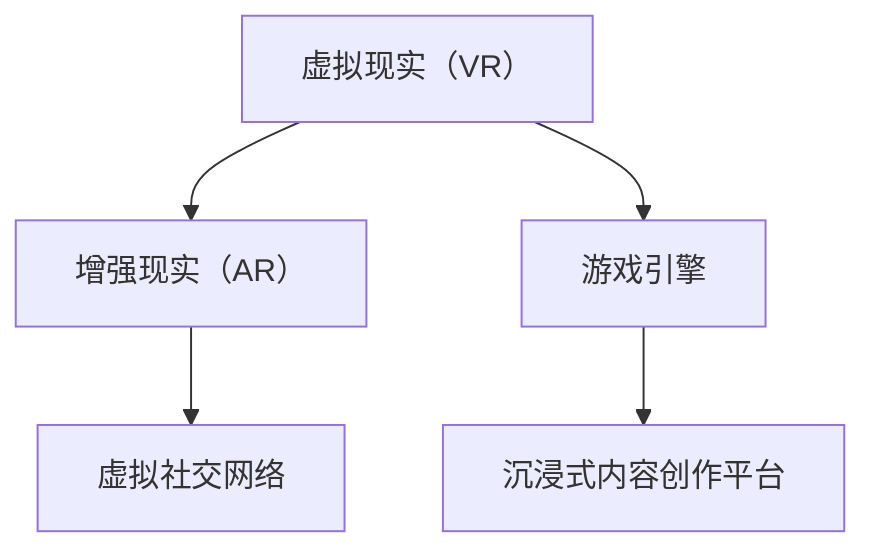

                 

# 元宇宙娱乐产业:沉浸式体验的极致追求

> 关键词：元宇宙, 沉浸式体验, 虚拟现实(VR), 增强现实(AR), 游戏引擎, 虚拟社交, 沉浸式内容

## 1. 背景介绍

### 1.1 问题由来

随着虚拟现实技术（Virtual Reality, VR）、增强现实技术（Augmented Reality, AR）以及相关硬件设备的不断成熟，元宇宙（Metaverse）的概念日益引起广泛关注。元宇宙是一个高度融合的虚拟现实世界，融合了虚拟与现实的特性，涵盖游戏、社交、教育、商业等多个领域。它将提供前所未有的沉浸式体验，实现“无限可能”的交互方式和场景。

### 1.2 问题核心关键点

元宇宙娱乐产业的发展主要依赖于以下核心技术：

- **虚拟现实（VR）和增强现实（AR）技术**：提供沉浸式感官体验，使用户在虚拟世界中如同置身其中。
- **高性能游戏引擎**：负责模拟和渲染复杂的虚拟场景和交互效果，支持海量用户并发。
- **虚拟社交网络**：允许用户以数字身份在虚拟世界中交互，构建虚拟社区和内容生态。
- **沉浸式内容创作平台**：提供工具和平台，方便开发者创建和发布高质量的沉浸式内容。

### 1.3 问题研究意义

元宇宙娱乐产业的崛起，不仅将带来全新的游戏体验，还将拓展社交、教育、商业等领域的界限，创造新的商业模式。研究沉浸式体验的实现原理和技术路径，对于推动元宇宙娱乐产业的发展具有重要意义：

1. 提供极致的沉浸式体验，满足用户的感官需求。
2. 拓展虚拟与现实的融合程度，实现无缝交互。
3. 降低用户门槛，提高用户参与度，创造更大的市场空间。
4. 推动多领域产业协同，形成新的价值链条，促进经济转型升级。

## 2. 核心概念与联系

### 2.1 核心概念概述

为更好地理解元宇宙娱乐产业的沉浸式体验技术，本节将介绍几个核心概念：

- **虚拟现实（VR）**：通过计算机生成的仿真环境，使用户沉浸在三维虚拟世界。
- **增强现实（AR）**：将虚拟信息叠加在真实世界之上，实现虚实融合的体验。
- **游戏引擎**：如Unity、Unreal Engine等，提供3D场景渲染、物理模拟等功能，是构建虚拟世界的基础。
- **虚拟社交网络**：如Roblox、Meta Platforms等，提供虚拟社交和互动平台，构建虚拟社区。
- **沉浸式内容创作平台**：如Blender、Adobe Creative Cloud等，提供丰富的工具和素材，支持用户创作沉浸式内容。

这些概念之间的逻辑关系可以通过以下Mermaid流程图来展示：



这个流程图展示了几大核心概念及其之间的关系：

1. VR和AR技术，通过硬件设备和软件引擎，为沉浸式体验提供感官输入和虚拟环境。
2. 游戏引擎，负责模拟和渲染虚拟场景，实现交互效果。
3. 虚拟社交网络，提供虚拟世界的社交平台，构建社区生态。
4. 沉浸式内容创作平台，支持用户创作和发布虚拟内容，丰富虚拟世界。

这些概念共同构成了元宇宙娱乐产业的技术基础，使得沉浸式体验得以实现。

## 3. 核心算法原理 & 具体操作步骤
### 3.1 算法原理概述

沉浸式体验的实现，主要依赖于计算机图形学、人体工程学、人工智能等领域的算法和技术。其核心原理包括：

- **传感器融合与跟踪**：通过光学、惯性传感器等，实时捕捉用户的空间位置和姿态，实现虚拟环境与真实世界的同步。
- **物理引擎模拟**：使用物理引擎模拟真实世界的物理特性，如重力、碰撞、摩擦等，增强沉浸感。
- **多模态交互设计**：结合视觉、听觉、触觉等多模态信息，提升用户体验。
- **动态内容生成**：使用机器学习等技术，实时生成和更新虚拟场景和角色，保持动态互动。

### 3.2 算法步骤详解

基于上述原理，沉浸式体验的实现主要包括以下步骤：

**Step 1: 准备虚拟环境**

- 创建虚拟场景，使用游戏引擎加载3D模型、贴图、光照等，构建虚拟世界的背景和环境。
- 添加虚拟角色，使用骨骼动画、肌肉系统等技术，实现角色的动态行为。

**Step 2: 用户交互设计**

- 设计交互界面，包括控制器、手势识别、语音命令等，让用户能够与虚拟世界进行交互。
- 实现多模态输入输出，如音频、触觉反馈等，提升沉浸感。

**Step 3: 传感器融合与跟踪**

- 使用光学传感器（如Camera）、惯性传感器（如IMU）等，实时获取用户的空间位置和姿态。
- 结合传感器数据，进行数据融合和运动跟踪，实现虚拟环境与真实世界的同步。

**Step 4: 物理引擎模拟**

- 使用物理引擎模拟真实世界的物理特性，如碰撞检测、刚体物理、流体模拟等。
- 根据用户输入，实时更新虚拟角色的状态和动作，增强互动性。

**Step 5: 动态内容生成**

- 使用机器学习算法，实时生成和更新虚拟场景和角色，增加动态效果。
- 结合自然语言处理等技术，实现自然对话和交互，增强用户体验。

### 3.3 算法优缺点

沉浸式体验的算法具有以下优点：

- **沉浸感强**：多模态输入输出和高精度传感器融合，提供高度沉浸的感官体验。
- **动态互动**：实时生成和更新虚拟内容，增加动态互动，提高用户参与度。
- **跨平台支持**：支持VR头盔、AR眼镜、手机等多种设备，拓展用户使用场景。

同时，这些算法也存在一些缺点：

- **技术复杂**：涉及传感器融合、物理模拟、机器学习等多领域技术，开发难度大。
- **硬件依赖**：需要高性能传感器和渲染设备，用户入门门槛高。
- **计算资源消耗大**：实时渲染和动态生成内容，对计算资源要求较高。

### 3.4 算法应用领域

沉浸式体验的算法已经广泛应用于以下领域：

- **虚拟游戏**：如《Beat Saber》、《Half-Life: Alyx》等，提供高度沉浸的游戏体验。
- **虚拟旅游**：如《Google Earth》、《National Geographic VR》等，让用户探索虚拟世界。
- **虚拟音乐会**：如《Live in VR》、《A-Ron Live in VR》等，提供虚拟演唱会的沉浸式体验。
- **虚拟社交**：如《Rec Room》、《Altiverse》等，构建虚拟社交平台，实现虚拟聚会。
- **虚拟教育**：如《Microsoft HoloLens Education》、《Google Expeditions》等，提供沉浸式学习体验。

此外，沉浸式体验的应用还在不断拓展，涵盖虚拟房产、虚拟演出、虚拟会议等多个领域，为各行各业带来新的应用场景。

## 4. 数学模型和公式 & 详细讲解 & 举例说明

### 4.1 数学模型构建

为更好地理解沉浸式体验的数学原理，本节将构建一个简单的虚拟环境模型，并推导其基本公式。

假设虚拟环境为一个三维空间 $\mathbb{R}^3$，其中每个点的位置表示为 $\mathbf{r} = (x,y,z)$。用户的位置和姿态表示为 $\mathbf{p} = (\mathbf{r}, \mathbf{a})$，其中 $\mathbf{r}$ 为位置向量，$\mathbf{a}$ 为姿态向量（包括方向和旋转角度）。

**传感器融合模型**：

$$
\mathbf{p}_t = \mathbf{p}_{t-1} + \Delta \mathbf{p}_t = \mathbf{p}_{t-1} + \mathbf{u}_t + \mathbf{n}_t
$$

其中，$\Delta \mathbf{p}_t$ 为位置和姿态的更新量，$\mathbf{u}_t$ 为传感器输入（如加速计、陀螺仪数据），$\mathbf{n}_t$ 为传感器噪声。

**物理引擎模型**：

假设用户输入一个加速指令 $\mathbf{a}_t$，则根据牛顿第二定律，用户的加速度和位置更新量为：

$$
\mathbf{f}_t = \mathbf{m} \mathbf{a}_t, \quad \Delta \mathbf{p}_t = \mathbf{f}_t \Delta t
$$

其中 $\mathbf{f}_t$ 为用户的力，$\mathbf{m}$ 为用户质量，$\Delta t$ 为时间步长。

**多模态交互模型**：

假设用户使用语音指令进行交互，则语音识别模型将语音转换为文本，再由NLP模型转换为执行指令：

$$
\text{text} = \text{ASR}(\text{audio}), \quad \text{command} = \text{NLP}(\text{text})
$$

其中，$\text{ASR}$ 为自动语音识别模型，$\text{NLP}$ 为自然语言处理模型。

### 4.2 公式推导过程

以虚拟环境的传感器融合模型为例，进行公式推导：

设上一时刻用户的位置和姿态为 $\mathbf{p}_{t-1} = (\mathbf{r}_{t-1}, \mathbf{a}_{t-1})$，传感器输入为 $\mathbf{u}_t$，传感器噪声为 $\mathbf{n}_t$，则下一时刻用户的位置和姿态为：

$$
\mathbf{p}_t = \mathbf{p}_{t-1} + \Delta \mathbf{p}_t = \mathbf{p}_{t-1} + (\mathbf{u}_t + \mathbf{n}_t)
$$

假设 $\mathbf{u}_t$ 和 $\mathbf{n}_t$ 均为均值为0，方差为 $\sigma^2$ 的正态分布，则 $\Delta \mathbf{p}_t$ 的方差为：

$$
\text{Var}(\Delta \mathbf{p}_t) = \text{Var}(\mathbf{u}_t + \mathbf{n}_t) = \text{Var}(\mathbf{u}_t) + \text{Var}(\mathbf{n}_t) = \sigma_u^2 + \sigma_n^2
$$

其中，$\sigma_u^2$ 和 $\sigma_n^2$ 分别为传感器输入和噪声的方差。

根据以上推导，可以计算出下一时刻用户位置的均值和方差，进一步计算出虚拟环境与真实世界同步的精度和鲁棒性。

### 4.3 案例分析与讲解

**案例：虚拟游戏《Beat Saber》**

《Beat Saber》是一款结合VR和AR的节奏类游戏，玩家通过手柄和头显，在虚拟空间中跟随节奏打击彩色光块，获得沉浸式体验。其核心算法包括：

- **传感器融合与跟踪**：通过光学传感器和惯性传感器融合，实现虚拟环境和用户位置、姿态的同步。
- **物理引擎模拟**：使用刚体物理引擎，模拟光块和打击棒在虚拟空间中的动态效果。
- **动态内容生成**：根据玩家动作和节奏，实时生成光块和音乐，增强互动性。

通过这些算法，《Beat Saber》提供了高度沉浸的虚拟游戏体验，成为虚拟现实游戏领域的佼佼者。

## 5. 项目实践：代码实例和详细解释说明
### 5.1 开发环境搭建

在进行沉浸式体验的实践前，我们需要准备好开发环境。以下是使用Unity3D进行VR应用开发的开发环境配置流程：

1. 安装Unity Hub：从官网下载并安装Unity Hub，用于管理Unity版本。

2. 创建项目：在Unity Hub中创建一个新的Unity项目，选择VR开发模板。

3. 安装VR插件：安装VR SDK插件，如SteamVR、OpenXR等，用于支持VR硬件设备。

4. 安装VR设备：连接VR头盔、手柄等设备，并在Unity中配置好设备参数。

5. 安装外部库：安装需要的外部库和资源，如Google ARCore、ARKit等，用于增强现实开发。

完成上述步骤后，即可在Unity中开始沉浸式体验的开发。

### 5.2 源代码详细实现

这里我们以《Beat Saber》为例，给出使用Unity3D进行VR游戏开发的代码实现。

首先，定义游戏场景和光源：

```csharp
using UnityEngine;
using UnityEngine.UI;

public class LevelScene : MonoBehaviour
{
    public GameObject[] Sabers;
    public GameObject[] Blocks;
    
    void Start()
    {
        // 初始化光块和打击棒
        foreach (GameObject block in Blocks)
        {
            block.SetActive(true);
        }
        
        foreach (GameObject saber in Sabers)
        {
            saber.SetActive(false);
        }
    }
}
```

然后，定义传感器融合和物理引擎的代码：

```csharp
using UnityEngine;
using UnityEngine.VR;

public class MotionController : MonoBehaviour
{
    public GameObject Saber;
    private bool canMove = false;
    private bool isGrabbing = false;
    
    void Update()
    {
        if (canMove)
        {
            // 获取用户的手柄位置和姿态
            VRPose pose = Camera.main.transform.position;
            
            // 将手柄位置和姿态转换为向量
            Vector3 position = new Vector3(pose.position.x, pose.position.y, pose.position.z);
            Quaternion rotation = pose.rotation;
            
            // 模拟打击棒的运动效果
            Saber.transform.localPosition = position;
            Saber.transform.localRotation = rotation;
        }
    }
}
```

接着，定义动态内容生成的代码：

```csharp
using UnityEngine;
using UnityEngine.UI;

public class BeatSaber : MonoBehaviour
{
    public GameObject Block;
    private bool isPlaying = false;
    
    void Update()
    {
        if (isPlaying)
        {
            // 根据音乐节奏生成光块
            Vector3 position = new Vector3(0, 0, 0);
            Quaternion rotation = new Quaternion(0, 0, 0, 1);
            Block.transform.position = position;
            Block.transform.rotation = rotation;
            
            // 调整光块位置和旋转角度
            float t = Time.timeSinceLevelStart * 0.1f;
            Block.transform.Translate(new Vector3(0, 0, -5));
            Block.transform.Rotate(new Vector3(0, 1, 0), t * 10);
        }
    }
}
```

最后，启动游戏流程并在VR头盔上测试：

```csharp
using UnityEngine;
using UnityEngine.UI;

public class GameController : MonoBehaviour
{
    public GameObject Block;
    public MotionController motionController;
    public BeatSaber beatSaber;
    
    void Start()
    {
        // 初始化场景和光源
        SceneManager.LoadScene("LevelScene");
        
        // 初始化光块和打击棒
        Block.SetActive(true);
        Saber.SetActive(false);
        
        // 初始化传感器融合和物理引擎
        motionController.canMove = false;
        beatSaber.isPlaying = false;
    }
}
```

以上就是使用Unity3D进行VR游戏开发的完整代码实现。可以看到，借助Unity强大的开发工具和平台支持，我们可以快速构建高度沉浸的虚拟游戏体验。

### 5.3 代码解读与分析

让我们再详细解读一下关键代码的实现细节：

**LevelScene类**：
- 定义光块和打击棒的预加载和初始化。

**MotionController类**：
- 实现传感器融合和用户输入的跟踪。
- 根据用户输入模拟打击棒的运动。

**BeatSaber类**：
- 实现动态内容的生成和更新。
- 根据音乐节奏调整光块的位置和旋转角度。

**GameController类**：
- 实现场景加载和初始化。
- 配置传感器融合和物理引擎。

可以看到，Unity3D提供了丰富的API和工具支持，大大简化了VR游戏的开发流程。开发者只需关注游戏逻辑和算法实现，即可快速构建高质量的沉浸式体验。

当然，实际开发中还需要考虑更多因素，如用户界面设计、游戏音效、网络连接等。但核心的开发框架和思路，可以通过上述代码示例进行快速上手和实践。

## 6. 实际应用场景
### 6.1 虚拟游戏

虚拟游戏是沉浸式体验的核心应用领域，通过VR、AR技术，结合高性能游戏引擎和沉浸式内容创作平台，提供沉浸式游戏体验。

**案例：《Half-Life: Alyx》**

《Half-Life: Alyx》是一款由Valve公司开发的VR射击游戏，玩家通过头显和手柄，在虚拟世界中探索和战斗。其核心技术包括：

- **传感器融合与跟踪**：通过光学传感器和惯性传感器融合，实现虚拟环境和用户位置、姿态的同步。
- **物理引擎模拟**：使用物理引擎模拟现实世界的物理特性，增强沉浸感。
- **动态内容生成**：根据玩家动作和游戏进程，实时生成和更新虚拟场景和敌人，增强互动性。

通过这些技术，《Half-Life: Alyx》提供了高度沉浸的游戏体验，成为VR游戏领域的里程碑作品。

### 6.2 虚拟旅游

虚拟旅游是沉浸式体验的另一个重要应用领域，通过VR技术，用户可以探索虚拟世界，体验不同国家和城市的风景和文化。

**案例：《Google Earth》**

《Google Earth》是一款由Google开发的虚拟旅游应用，用户可以通过VR头盔，在虚拟地球中自由探索，查看世界各地的地形、地貌、城市、建筑等。其核心技术包括：

- **传感器融合与跟踪**：通过光学传感器和惯性传感器融合，实现虚拟环境和用户位置、姿态的同步。
- **高精度地图渲染**：使用高精度地图数据，渲染逼真的虚拟地球。
- **用户交互设计**：提供多模态交互方式，如语音命令、手势控制等，提升用户体验。

通过这些技术，《Google Earth》提供了高度沉浸的虚拟旅游体验，让用户足不出户，就能环游世界。

### 6.3 虚拟音乐会

虚拟音乐会是沉浸式体验的新兴应用领域，通过VR和AR技术，用户可以在虚拟空间中享受音乐会演出，体验沉浸式音乐体验。

**案例：《Live in VR》**

《Live in VR》是一款由The Killers乐队举办的虚拟音乐会应用，用户通过VR头盔和手柄，在虚拟空间中与乐队成员互动，享受音乐演出。其核心技术包括：

- **传感器融合与跟踪**：通过光学传感器和惯性传感器融合，实现虚拟环境和用户位置、姿态的同步。
- **高精度音频渲染**：使用高精度音频技术，模拟真实的音乐厅效果。
- **实时内容生成**：根据观众动作和音乐节奏，实时生成和更新虚拟场景和演出效果。

通过这些技术，《Live in VR》提供了高度沉浸的音乐会体验，让用户仿佛置身现场，享受音乐演出。

### 6.4 虚拟社交

虚拟社交是沉浸式体验的重要应用领域，通过VR技术，用户可以在虚拟世界中与朋友互动，构建虚拟社区。

**案例：《Rec Room》**

《Rec Room》是一款由Rec Room Games开发的VR社交应用，用户可以通过VR头盔和手柄，在虚拟空间中与朋友进行各种互动，如聊天、打桌球、跳迪斯科等。其核心技术包括：

- **传感器融合与跟踪**：通过光学传感器和惯性传感器融合，实现虚拟环境和用户位置、姿态的同步。
- **多模态交互设计**：提供语音命令、手势控制、手柄输入等多种交互方式，提升用户体验。
- **动态内容生成**：根据用户输入和互动，实时生成和更新虚拟场景和角色，增加互动性。

通过这些技术，《Rec Room》提供了高度沉浸的虚拟社交体验，让用户与朋友在虚拟世界中自由互动。

## 7. 工具和资源推荐
### 7.1 学习资源推荐

为了帮助开发者系统掌握沉浸式体验的开发技术和实践，这里推荐一些优质的学习资源：

1. **Unity官方文档**：提供了丰富的API文档和教程，帮助开发者快速上手Unity3D开发。

2. **Valve SDK文档**：Valve公司提供的VR SDK文档，详细介绍了VR开发的基础知识和最佳实践。

3. **ARKit官方文档**：苹果公司提供的ARKit开发文档，提供了AR应用开发的完整指南。

4. **Google ARCore官方文档**：Google公司提供的ARCore开发文档，提供了AR应用开发的完整指南。

5. **《Virtual Reality Development with Unity》书籍**：由Unity官方出版的VR开发书籍，涵盖Unity3D的VR开发技术和实践。

6. **《Mastering Unity3D for Virtual Reality》书籍**：详细介绍了Unity3D在VR开发中的技术和实践，适合中高级开发者。

通过学习这些资源，相信你一定能够快速掌握沉浸式体验的开发技术和实践。

### 7.2 开发工具推荐

高效的开发离不开优秀的工具支持。以下是几款用于沉浸式体验开发的常用工具：

1. **Unity3D**：由Unity Technologies开发的游戏引擎，支持VR、AR开发，提供强大的3D渲染和物理引擎。

2. **Unreal Engine**：由Epic Games开发的游戏引擎，支持VR、AR开发，提供高度逼真的虚拟场景和物理模拟。

3. **SteamVR**：由Valve公司开发的VR SDK，支持Steam平台，提供多种VR设备支持。

4. **OpenXR**：由Khronos Group开发的VR标准，支持多种VR平台和设备，提供统一的VR开发规范。

5. **Google ARCore**：由Google公司开发的AR开发框架，支持Android平台，提供丰富的AR开发工具和资源。

6. **ARKit**：由苹果公司开发的AR开发框架，支持iOS平台，提供丰富的AR开发工具和资源。

合理利用这些工具，可以显著提升沉浸式体验的开发效率，加快创新迭代的步伐。

### 7.3 相关论文推荐

沉浸式体验的开发涉及计算机图形学、人体工程学、人工智能等多个领域，以下是几篇奠基性的相关论文，推荐阅读：

1. **《Real-time Interaction in 3D Spaces》**：Muller R, Greer M, Stokata P, et al. 介绍了实时3D空间交互的基础技术和算法。

2. **《Depth-Aware Placement and Tracking in Virtual Reality》**：Krüger F, D Sidebotham, G Cofer W, et al. 介绍了虚拟现实中的深度感知和传感器融合技术。

3. **《Human Pose Estimation for 3D User Interfaces》**：Nazad M, Gu J, Irani Z, et al. 介绍了人体姿态估计算法，用于虚拟现实中的交互设计。

4. **《Computer Vision for Virtual Reality》**：Sung H, Park C, Estrada A, et al. 介绍了计算机视觉技术在虚拟现实中的应用。

5. **《A Survey of Virtual Reality Systems and Applications》**：Kim J, Yoo S, Kim J, et al. 综述了虚拟现实系统的技术和应用现状。

这些论文代表了大规模沉浸式体验开发的技术脉络，通过学习这些前沿成果，可以帮助研究者把握学科前进方向，激发更多的创新灵感。

## 8. 总结：未来发展趋势与挑战

### 8.1 总结

本文对沉浸式体验的开发技术进行了全面系统的介绍。首先阐述了沉浸式体验的核心概念和研究意义，明确了其技术基础和实现路径。其次，从原理到实践，详细讲解了沉浸式体验的数学模型和关键算法，给出了实际应用的代码实现。同时，本文还探讨了沉浸式体验在虚拟游戏、虚拟旅游、虚拟音乐会、虚拟社交等多个领域的应用前景，展示了其广阔的市场空间。

通过本文的系统梳理，可以看到，沉浸式体验的开发技术已经日趋成熟，推动着元宇宙娱乐产业的发展。随着VR、AR技术的不断进步，以及游戏引擎和沉浸式内容创作平台的不断优化，沉浸式体验将进一步普及和落地，为人类带来更加丰富和逼真的虚拟世界。

### 8.2 未来发展趋势

展望未来，沉浸式体验的发展趋势主要包括以下几个方面：

1. **技术成熟度提升**：随着VR、AR技术的不断优化，传感器融合、物理引擎模拟等技术将更加成熟，用户体验将进一步提升。

2. **硬件设备普及**：随着VR头盔、AR眼镜等设备的普及，沉浸式体验将逐渐从专业用户向普通用户普及。

3. **跨平台协同**：不同平台和设备之间的协同将更加紧密，用户可以在多种设备和平台间无缝切换，享受一致的沉浸式体验。

4. **生态系统完善**：随着VR、AR应用的不断丰富，虚拟社交、虚拟旅游、虚拟音乐会等生态系统将逐渐完善，形成良性循环。

5. **跨领域融合**：沉浸式体验将与其他领域的技术进行深度融合，如虚拟现实与物联网、人工智能等，实现更全面的虚拟世界构建。

以上趋势凸显了沉浸式体验的广阔前景，为元宇宙娱乐产业的发展提供了强劲动力。

### 8.3 面临的挑战

尽管沉浸式体验的发展前景广阔，但在迈向更加智能化、普适化应用的过程中，它仍面临诸多挑战：

1. **硬件成本高**：高质量的VR头盔、AR眼镜等设备，价格较高，限制了沉浸式体验的普及。

2. **内容缺乏**：高质量的沉浸式内容缺乏，限制了用户的使用体验和兴趣。

3. **开发难度大**：沉浸式体验开发涉及多领域技术，开发难度大，需要跨学科的团队协作。

4. **用户体验不稳定**：传感器融合、物理引擎模拟等技术复杂，容易导致用户体验不稳定。

5. **安全隐私问题**：沉浸式体验涉及大量用户数据和隐私信息，需要采取严格的安全措施。

6. **内容审核机制**：沉浸式体验中的内容审核机制需要完善，防止不良内容传播。

### 8.4 研究展望

为了应对这些挑战，未来的研究需要在以下几个方面寻求新的突破：

1. **降低硬件成本**：开发性价比更高的VR头盔、AR眼镜等设备，降低用户入门门槛。

2. **丰富内容生态**：开发更多高质量的沉浸式内容，提升用户体验和参与度。

3. **简化开发流程**：开发更易用的VR、AR开发工具和平台，降低开发难度。

4. **提高稳定性**：优化传感器融合和物理引擎算法，提高用户体验的稳定性和一致性。

5. **加强安全隐私保护**：开发严格的内容审核机制，保护用户数据和隐私。

6. **探索跨领域融合**：探索沉浸式体验与其他领域技术的融合，拓展应用场景和功能。

这些研究方向将为沉浸式体验技术的发展提供新的思路和方法，推动元宇宙娱乐产业迈向成熟和普及。

## 9. 附录：常见问题与解答

**Q1: 什么是沉浸式体验？**

A: 沉浸式体验（Immersive Experience）是一种通过虚拟现实（VR）、增强现实（AR）等技术，创造高度逼真的虚拟环境，使用户全身心投入其中的体验方式。用户通过多模态输入输出设备（如VR头盔、手柄、手势识别等），与虚拟世界进行互动，获得高度沉浸和逼真的体验。

**Q2: 沉浸式体验的关键技术有哪些？**

A: 沉浸式体验的关键技术包括：

- **传感器融合与跟踪**：通过光学传感器和惯性传感器融合，实现虚拟环境和用户位置、姿态的同步。
- **物理引擎模拟**：使用物理引擎模拟现实世界的物理特性，增强沉浸感。
- **多模态交互设计**：提供语音命令、手势控制、手柄输入等多种交互方式，提升用户体验。
- **动态内容生成**：根据用户输入和互动，实时生成和更新虚拟场景和角色，增加互动性。

**Q3: 如何开发高质量的沉浸式内容？**

A: 开发高质量的沉浸式内容，需要以下步骤：

1. **设计内容**：根据项目需求和用户反馈，设计沉浸式内容的交互逻辑和体验流程。
2. **制作素材**：收集或创作高质量的3D模型、贴图、音频等素材，用于构建虚拟环境。
3. **编写脚本**：使用Unity、Unreal Engine等游戏引擎编写脚本，实现交互逻辑和动态效果。
4. **测试优化**：进行反复测试和优化，确保内容的稳定性和一致性。
5. **上线发布**：将内容打包和发布，供用户下载和体验。

**Q4: 沉浸式体验在哪些领域有应用？**

A: 沉浸式体验在多个领域都有应用，主要包括以下几个方面：

1. **虚拟游戏**：如《Beat Saber》、《Half-Life: Alyx》等，提供高度沉浸的游戏体验。
2. **虚拟旅游**：如《Google Earth》、《National Geographic VR》等，让用户探索虚拟世界。
3. **虚拟音乐会**：如《Live in VR》、《A-Ron Live in VR》等，提供虚拟演唱会的沉浸式体验。
4. **虚拟社交**：如《Rec Room》、《Altiverse》等，构建虚拟社交平台，实现虚拟聚会。
5. **虚拟教育**：如《Microsoft HoloLens Education》、《Google Expeditions》等，提供沉浸式学习体验。

**Q5: 沉浸式体验的开发难度大吗？**

A: 沉浸式体验的开发难度较大，需要跨学科的团队协作。开发过程中需要掌握计算机图形学、人体工程学、自然语言处理等多领域的知识。

但是，借助Unity、Unreal Engine等游戏引擎，以及VR SDK和AR开发框架，可以大大简化开发流程，降低开发难度。开发者只需关注算法实现和交互设计，即可快速构建高质量的沉浸式体验。

**Q6: 沉浸式体验的未来发展方向是什么？**

A: 沉浸式体验的未来发展方向主要包括以下几个方面：

1. **技术成熟度提升**：随着VR、AR技术的不断优化，传感器融合、物理引擎模拟等技术将更加成熟，用户体验将进一步提升。
2. **硬件设备普及**：随着VR头盔、AR眼镜等设备的普及，沉浸式体验将逐渐从专业用户向普通用户普及。
3. **跨平台协同**：不同平台和设备之间的协同将更加紧密，用户可以在多种设备和平台间无缝切换，享受一致的沉浸式体验。
4. **生态系统完善**：随着VR、AR应用的不断丰富，虚拟社交、虚拟旅游、虚拟音乐会等生态系统将逐渐完善，形成良性循环。
5. **跨领域融合**：沉浸式体验将与其他领域的技术进行深度融合，如虚拟现实与物联网、人工智能等，实现更全面的虚拟世界构建。

**Q7: 沉浸式体验有哪些挑战？**

A: 沉浸式体验的发展面临以下挑战：

1. **硬件成本高**：高质量的VR头盔、AR眼镜等设备，价格较高，限制了沉浸式体验的普及。
2. **内容缺乏**：高质量的沉浸式内容缺乏，限制了用户的使用体验和兴趣。
3. **开发难度大**：沉浸式体验开发涉及多领域技术，开发难度大，需要跨学科的团队协作。
4. **用户体验不稳定**：传感器融合、物理引擎模拟等技术复杂，容易导致用户体验不稳定。
5. **安全隐私问题**：沉浸式体验涉及大量用户数据和隐私信息，需要采取严格的安全措施。
6. **内容审核机制**：沉浸式体验中的内容审核机制需要完善，防止不良内容传播。

---

作者：禅与计算机程序设计艺术 / Zen and the Art of Computer Programming

