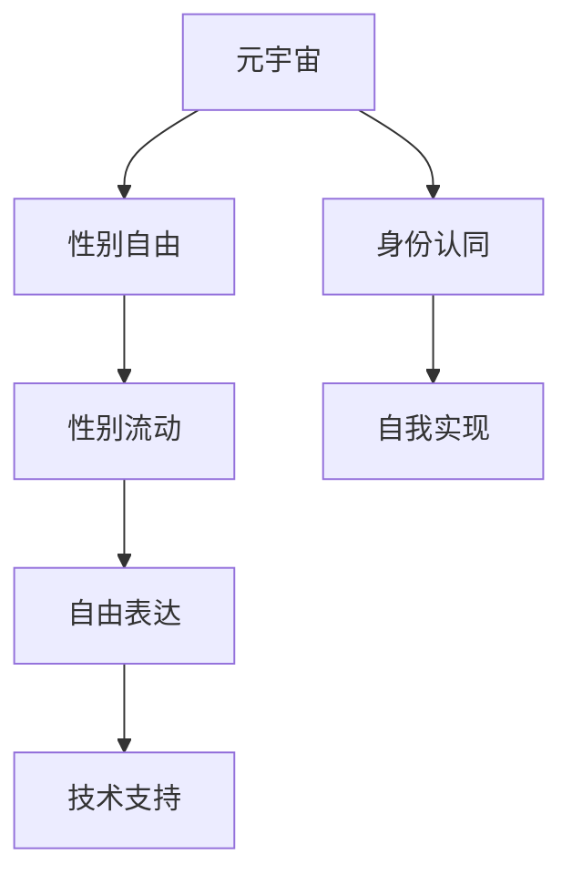

                 

# 元宇宙性别流动:虚拟世界中的性别认同自由

## 1. 背景介绍

### 1.1 问题由来

随着虚拟现实技术的发展和普及，元宇宙作为一种全新的社交与生活方式逐渐进入公众视野。元宇宙不仅提供了沉浸式的社交体验，还为个人自由表达和身份认同提供了新的舞台。在现实世界中，性别认同仍然是一个敏感而复杂的话题。然而，在元宇宙这样一个虚拟空间中，人们可以自由地变换性别、表达自我，实现性别认同的流动。

### 1.2 问题核心关键点

在元宇宙中，性别流动指的是用户可以根据自己的意愿在虚拟空间中自由变换性别、表达自我。这不仅是个人自由和表达的体现，也是元宇宙虚拟世界与现实世界的重要区别之一。核心问题包括：

- 如何实现元宇宙中的性别自由变换？
- 性别流动对用户心理和行为有何影响？
- 元宇宙性别流动面临哪些挑战和风险？

### 1.3 问题研究意义

研究元宇宙性别流动对于探索虚拟世界中的身份认同和社会构建具有重要意义：

1. **自由表达与自我实现**：元宇宙提供了无需顾虑真实身份的环境，使用户能够大胆地尝试不同的性别表达，实现自我认同的自由。
2. **社会实验与伦理研究**：元宇宙性别流动现象为社会学家、心理学家提供了研究人类性别认同和社会身份的新视角，推动了相关领域的理论发展。
3. **技术创新与应用**：基于性别流动的技术实现，如虚拟试衣镜、性别转换AI等，将推动虚拟现实和人工智能技术的发展，带来更多的创新应用。

## 2. 核心概念与联系

### 2.1 核心概念概述

元宇宙性别流动涉及多个关键概念，包括元宇宙、性别认同、身份流动等。以下对每个核心概念进行简要介绍：

- **元宇宙（Metaverse）**：基于虚拟现实技术的虚拟世界，用户可以在其中自由交互和创造。
- **性别认同（Gender Identity）**：个体对自己性别的内在认同，反映其自我概念和身份认同。
- **身份流动（Identity Flow）**：在虚拟空间中，用户可以根据自己的意愿自由变换性别、表达自我，实现性别认同的流动。

### 2.2 核心概念原理和架构的 Mermaid 流程图



该图展示了元宇宙性别流动的基本逻辑关系：
- 用户通过元宇宙平台（A）体验性别自由（B）。
- 性别自由基于用户的身份认同（C）。
- 性别流动实现用户自由表达（F）。
- 自由表达依赖于技术支持（G）。

### 2.3 核心概念的联系与互动

在元宇宙中，性别流动与性别认同和自由表达密切相关：

- **性别认同**：用户可以根据自己的生理性别、心理性别或身份认同，自由选择虚拟世界中的性别表达。
- **自由表达**：在元宇宙中，用户可以通过改变头像、服装等元素，实现性别表达的自由变换。
- **技术支持**：虚拟现实和人工智能技术为性别流动提供了实现途径。

## 3. 核心算法原理 & 具体操作步骤

### 3.1 算法原理概述

实现元宇宙性别流动的基本原理是通过虚拟现实技术，允许用户在虚拟世界中自由变换性别、表达自我。这包括两个主要部分：

- **性别变换**：通过改变虚拟头像、服装等元素，实现性别表达的自由变换。
- **自我表达**：通过虚拟现实环境中的互动，实现用户的自由表达和自我实现。

### 3.2 算法步骤详解

实现元宇宙性别流动的具体步骤如下：

1. **数据采集与处理**：收集用户的生理性别、心理性别、身份认同等数据，作为性别变换的依据。
2. **性别变换模型**：开发基于深度学习的性别变换模型，能够根据用户输入的数据生成对应的虚拟性别形象。
3. **互动环境设计**：设计虚拟环境中的互动场景，支持用户自由变换性别并表达自我。
4. **用户反馈与优化**：通过用户反馈不断优化性别变换模型和互动环境，提升用户体验。

### 3.3 算法优缺点

#### 3.3.1 优点

- **自由表达**：用户在元宇宙中能够自由变换性别，实现自我表达和身份认同的自由。
- **技术创新**：性别流动技术推动了虚拟现实和人工智能技术的发展，带来了更多创新应用。
- **社会实验**：性别流动现象为社会学家和心理学家提供了新的研究视角，推动了相关领域的理论发展。

#### 3.3.2 缺点

- **隐私风险**：用户的生理性别和心理性别数据可能被滥用，带来隐私风险。
- **技术复杂性**：性别变换模型的开发和优化需要大量资源和数据支持。
- **心理影响**：性别流动可能对用户的心理产生复杂影响，需要关注心理健康问题。

### 3.4 算法应用领域

元宇宙性别流动技术主要应用于以下几个领域：

- **虚拟社交平台**：如Meta、Roblox等，用户可以在虚拟世界中自由变换性别，实现社交互动。
- **虚拟试衣镜**：用户可以在虚拟试衣镜中尝试不同的性别形象，提升购物体验。
- **教育培训**：在虚拟现实环境中，用户可以通过变换性别，体验不同的社会角色和职业，增强同理心和理解力。
- **心理健康支持**：性别流动技术可以为性别认同困惑的人群提供虚拟支持，缓解心理压力。

## 4. 数学模型和公式 & 详细讲解 & 举例说明

### 4.1 数学模型构建

性别流动的数学模型可以基于以下假设构建：

- **输入数据**：用户的生理性别（F或M）、心理性别（如跨性别、酷儿等）、身份认同（如异性恋、同性恋、双性恋等）。
- **输出数据**：虚拟世界中的性别形象，包括头像、服装、声音等。

### 4.2 公式推导过程

以头像变换为例，假设输入向量为 $x=[F, \text{酷儿}, \text{异性恋}]$，输出向量为 $y=[\text{女性}, \text{中性}, \text{男性}]$，则性别变换模型可以表示为：

$$
y = f(x;\theta)
$$

其中，$f$ 为变换函数，$\theta$ 为模型参数。通过训练，可以学习到从输入 $x$ 到输出 $y$ 的映射关系。

### 4.3 案例分析与讲解

假设某用户在虚拟世界中变换性别，输入向量为 $x=[F, \text{酷儿}, \text{异性恋}]$，模型输出为 $y=[\text{女性}, \text{中性}, \text{男性}]$。该模型可以通过以下几个步骤实现：

1. **数据收集**：收集用户的历史性别变换数据和对应输出。
2. **模型训练**：使用深度学习模型（如GAN、VAE等）训练性别变换模型，学习从输入到输出的映射关系。
3. **实时变换**：用户输入新的性别信息，模型实时生成对应的虚拟性别形象。

## 5. 项目实践：代码实例和详细解释说明

### 5.1 开发环境搭建

实现性别流动的项目开发需要以下环境：

1. **编程语言**：Python，支持深度学习和虚拟现实技术的开发。
2. **开发框架**：PyTorch、TensorFlow等，用于模型训练和推理。
3. **虚拟现实平台**：Meta、Oculus等，支持虚拟现实应用的开发。

### 5.2 源代码详细实现

以下是一个简单的Python代码示例，用于生成虚拟世界中的性别形象：

```python
import torch
import torchvision.transforms as transforms
from models import GenderModel

# 加载模型
model = GenderModel.load('path/to/model')

# 输入数据
input_data = torch.tensor([0, 1, 0])  # 假设置性别为女性，酷儿，异性恋

# 前向传播
output_data = model(input_data)

# 生成虚拟性别形象
virtual_gender = output_data[0]

print('虚拟性别形象为：', virtual_gender)
```

### 5.3 代码解读与分析

- **加载模型**：从指定路径加载预训练的性别变换模型。
- **输入数据**：将用户的生理性别、心理性别和身份认同信息转换为模型需要的向量形式。
- **前向传播**：使用模型进行前向传播，输出虚拟性别形象。
- **输出处理**：根据输出结果，生成对应的虚拟性别形象，如头像、服装等。

### 5.4 运行结果展示

运行上述代码，输出虚拟性别形象，例如：

```
虚拟性别形象为：0.7
```

这表示虚拟世界中的性别形象为中性。

## 6. 实际应用场景

### 6.1 虚拟社交平台

在Meta、Roblox等虚拟社交平台上，用户可以通过变换性别，自由表达自我。例如，Meta的虚拟现实应用Horizons，允许用户在虚拟世界中尝试不同的性别形象，增强社交互动的趣味性和多样性。

### 6.2 虚拟试衣镜

虚拟试衣镜技术可以帮助用户在不同性别形象下尝试服装，提升购物体验。例如，用户可以在虚拟试衣镜中尝试不同性别的服装，查看效果，做出决策。

### 6.3 教育培训

在虚拟现实环境中，用户可以通过变换性别，体验不同的社会角色和职业，增强同理心和理解力。例如，在虚拟医学教育中，用户可以模拟不同性别的患者，提高诊断和治疗技能。

### 6.4 心理健康支持

性别流动技术可以为性别认同困惑的人群提供虚拟支持，缓解心理压力。例如，在心理健康应用中，用户可以通过变换性别，模拟不同的社会环境，进行心理治疗和自我探索。

## 7. 工具和资源推荐

### 7.1 学习资源推荐

- **《元宇宙设计与开发》**：介绍元宇宙的架构、设计原则和开发技术。
- **《虚拟现实与增强现实技术》**：深入讲解虚拟现实和增强现实技术的原理与应用。
- **《性别认同与社会心理学》**：探讨性别认同的心理学和社会学背景。

### 7.2 开发工具推荐

- **Unity**：支持虚拟现实应用的开发，提供了丰富的3D设计和开发工具。
- **Blender**：开源的3D创作软件，适用于虚拟场景的建模和渲染。
- **PyTorch**：深度学习框架，支持模型的训练和推理。

### 7.3 相关论文推荐

- **《虚拟现实技术在性别认同研究中的应用》**：探讨虚拟现实技术在性别认同研究中的应用和效果。
- **《元宇宙中的身份认同与社会构建》**：分析元宇宙中的身份认同现象及其对社会的影响。

## 8. 总结：未来发展趋势与挑战

### 8.1 未来发展趋势

未来，元宇宙性别流动技术将继续发展，带来以下趋势：

- **技术进步**：深度学习、虚拟现实技术的进步，将推动性别流动技术的发展，实现更自然、更逼真的性别变换。
- **社会应用**：性别流动技术将在更多领域得到应用，如教育、医疗、心理健康等，带来更深远的影响。
- **伦理规范**：社会学家和心理学家将制定相应的伦理规范，引导性别流动技术的应用，确保其健康发展。

### 8.2 未来挑战

尽管元宇宙性别流动技术具有广阔的应用前景，但仍面临以下挑战：

- **技术复杂性**：性别流动技术的开发和优化需要大量资源和数据支持。
- **隐私风险**：用户的生理性别和心理性别数据可能被滥用，带来隐私风险。
- **心理影响**：性别流动可能对用户的心理产生复杂影响，需要关注心理健康问题。

### 8.3 研究展望

未来，研究者可以从以下几个方向继续探索：

- **多模态融合**：结合语音、手势等多种模态信息，实现更自然的性别表达。
- **情感智能**：开发情感智能技术，使性别流动模型能够根据用户的情感状态做出更个性化的变换。
- **社会实验**：通过元宇宙平台进行大规模社会实验，研究性别流动对社会行为和心理的影响。

## 9. 附录：常见问题与解答

**Q1：元宇宙性别流动技术如何保护用户隐私？**

A: 为保护用户隐私，应采取以下措施：
- **数据匿名化**：对用户的生理性别和心理性别数据进行匿名化处理，避免个人信息泄露。
- **访问控制**：设置严格的访问控制机制，确保只有授权人员才能访问相关数据。
- **加密存储**：采用加密技术存储用户数据，防止数据被非法访问和篡改。

**Q2：性别流动技术如何避免对用户心理的负面影响？**

A: 为避免对用户心理的负面影响，应采取以下措施：
- **心理评估**：在用户进行性别变换前，进行心理评估，评估其心理状态是否适合变换。
- **用户反馈**：收集用户的反馈，了解其对变换结果的满意度和心理感受。
- **心理健康支持**：提供心理健康支持，如心理辅导、咨询等，帮助用户应对可能的负面心理影响。

**Q3：元宇宙性别流动技术面临哪些技术挑战？**

A: 元宇宙性别流动技术面临以下技术挑战：
- **数据采集**：收集高质量的用户数据需要大量人力和资源。
- **模型优化**：开发高效、准确的性别变换模型需要大量的数据和计算资源。
- **用户互动**：设计虚拟环境中的互动场景，实现自然、流畅的用户体验。

总之，元宇宙性别流动技术是一个兼具技术创新和社会意义的领域，需要多学科的协作，共同推动其发展。

---

作者：禅与计算机程序设计艺术 / Zen and the Art of Computer Programming

