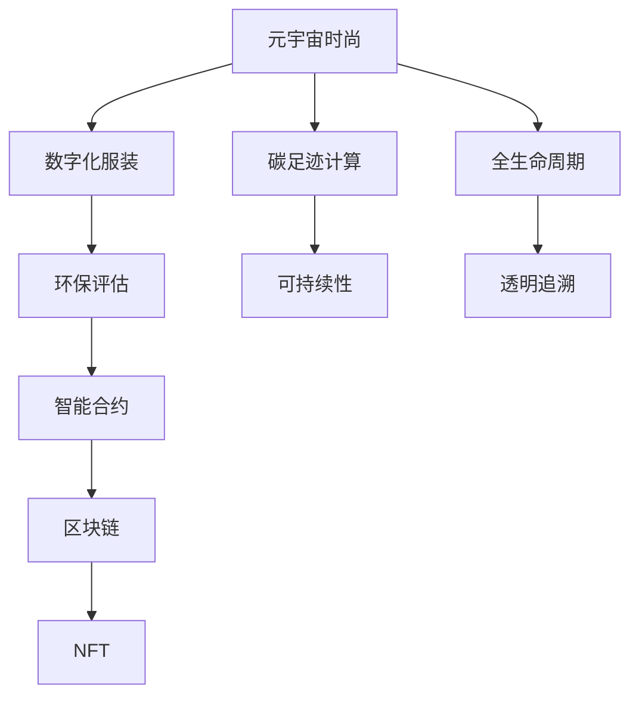

                 

# 元宇宙时尚可持续指数:数字化服装的环保评估

> 关键词：元宇宙时尚、可持续发展、数字化服装、环保评估、智能合约、NFT、区块链、碳足迹、智能合约

## 1. 背景介绍

### 1.1 问题由来
随着元宇宙和数字化浪潮的兴起，虚拟时尚已经从概念变为现实，并在虚拟世界中逐渐形成市场。数字化服装通过VR、AR等技术，实现了用户身临其境的穿搭体验，展现了无限的创意和可能。然而，数字化时尚也带来了环保、可持续发展等一系列新的挑战。

为了应对这些挑战，元宇宙时尚需要一套可衡量的标准来评估其环保性，指导未来的设计、生产和消费行为。为此，本文提出元宇宙时尚可持续指数，结合数字化服装的环保特性，构建一个综合评估体系，旨在推动元宇宙时尚向更加环保、可持续的方向发展。

### 1.2 问题核心关键点
本文的核心问题是如何构建一个包含多个维度的元宇宙时尚可持续指数，并对数字化服装的环保性进行全面评估。

元宇宙时尚可持续指数的构建涉及到多个关键技术点：
- 数字时尚与实际服装的碳足迹计算。
- 数字化服装的生产、使用、回收等全生命周期的环保评估。
- 利用智能合约和区块链技术实现透明度和可追溯性。
- 结合NFT技术，为每个数字化服装颁发独一无二的环境标志。
- 构建一套全面的环保指标体系，涵盖能源消耗、废物排放、生态影响等方面。

本文将详细阐述这些关键技术点，并结合实际案例，展示如何构建和应用元宇宙时尚可持续指数。

## 2. 核心概念与联系

### 2.1 核心概念概述

元宇宙时尚可持续指数（Metaverse Fashion Sustainability Index, MFSI）是一个综合性的评价体系，旨在评估数字化服装的环保性和可持续性。

核心概念包括：
- **元宇宙时尚**：通过VR、AR等技术，在虚拟世界中展示和销售的数字化服装。
- **可持续发展**：在环境、社会和经济发展中寻求平衡，实现长期发展。
- **数字化服装**：通过3D建模、虚拟试穿等技术，为用户带来全新穿搭体验的虚拟服装。
- **环保评估**：评估服装在生产、使用、回收等全生命周期的环保影响。
- **智能合约**：自动执行预设条件的代码协议，保障交易透明性和可追溯性。
- **区块链**：分布式账本技术，保障数据不可篡改，实现全链路可信性。
- **NFT（Non-Fungible Token）**：不可替代的代币，用于标识每个数字化服装的独一无二性。
- **碳足迹**：量化人类活动对气候变化的贡献，评估环保性能。

这些概念之间的联系可以通过以下Mermaid流程图来展示：



该流程图展示了元宇宙时尚可持续指数的构建逻辑：

1. 从元宇宙时尚出发，通过数字化服装设计并计算其碳足迹。
2. 对数字化服装的环保性进行全生命周期评估，涵盖生产、使用、回收等环节。
3. 结合智能合约和区块链技术，实现数据透明性和可追溯性。
4. 通过NFT技术，为每个数字化服装颁发独一无二的环保标志。
5. 构建碳足迹计算和可持续性评估的指标体系，衡量环保效果。

## 3. 核心算法原理 & 具体操作步骤
### 3.1 算法原理概述

元宇宙时尚可持续指数的构建基于以下几个核心算法原理：

1. **碳足迹计算**：利用生命周期评估(LCA)方法，量化数字化服装全生命周期内的碳排放。
2. **环保指标构建**：结合实际服装的环保特性，构建一套全面的环保指标体系，涵盖能源消耗、废物排放、生态影响等方面。
3. **智能合约应用**：使用智能合约，实现环保数据记录、更新和查询的自动化。
4. **区块链存储**：利用区块链技术，保障环保数据的不可篡改和透明追溯。
5. **NFT环境标志**：通过NFT技术，为每个数字化服装颁发独一无二的环保标志，增强透明度和可信性。

### 3.2 算法步骤详解

基于上述算法原理，元宇宙时尚可持续指数的构建主要分为以下步骤：

**Step 1: 定义环保指标**

首先，定义一套全面的环保指标体系，涵盖以下方面：
- **能源消耗**：包括生产过程中的电力、热力消耗。
- **废物排放**：包括生产过程中产生的废弃物、废水、废气等。
- **生态影响**：包括对土地、水体、生物多样性的影响。
- **碳足迹**：量化数字化服装全生命周期内的碳排放。
- **资源利用**：包括对水、土地、能源等自然资源的利用效率。
- **社会影响**：包括劳动条件、社区影响等。

每个指标设定具体的评估标准和方法，便于量化和评估。

**Step 2: 数据收集与计算**

数据收集与计算主要包括以下几个步骤：
- **生产数据**：收集生产过程中的能源消耗、废物排放、资源利用等数据。
- **使用数据**：收集数字化服装的使用数据，包括穿戴时间、清洗次数等。
- **回收数据**：收集数字化服装的回收处理数据，包括回收方式、再利用率等。
- **碳足迹计算**：利用LCA方法，计算数字化服装全生命周期内的碳排放。

**Step 3: 智能合约设计**

智能合约是元宇宙时尚可持续指数的核心技术之一。设计智能合约时，需要考虑以下几个关键点：
- **数据记录**：智能合约自动记录环保数据，确保数据的完整性和准确性。
- **数据更新**：智能合约允许环保数据的动态更新，反映最新的环保信息。
- **查询接口**：智能合约提供接口，允许用户查询环保数据，提升透明度。
- **自动化决策**：智能合约可以根据环保数据自动执行预设条件，如环保评分触发等。

**Step 4: 区块链存储**

利用区块链技术，保障环保数据的不可篡改和透明追溯。具体步骤如下：
- **数据上链**：将环保数据上链，实现全链路可信性。
- **链上更新**：通过智能合约自动更新环保数据，保持最新状态。
- **查询接口**：提供区块链上的数据查询接口，用户可以方便地获取环保信息。

**Step 5: NFT环境标志**

通过NFT技术，为每个数字化服装颁发独一无二的环保标志，增强透明度和可信性。具体步骤如下：
- **生成NFT**：根据环保数据生成独一无二的NFT，用于标识每个数字化服装。
- **数据关联**：将NFT与相应的环保数据关联，实现唯一性。
- **展示用途**：在虚拟服装的展示界面中，展示NFT环保标志，增加用户信任度。

**Step 6: 综合评估**

根据定义的环保指标和计算的环保数据，综合评估数字化服装的环保性。具体步骤如下：
- **数据处理**：对收集到的环保数据进行处理，计算每个指标的得分。
- **综合评分**：根据每个指标的权重，计算综合评分，反映数字化服装的总体环保性。
- **分级评估**：将综合评分划分为多个级别，用于指导消费行为。

### 3.3 算法优缺点

元宇宙时尚可持续指数具有以下优点：
1. **全面覆盖**：评估数字化服装全生命周期内的环保性，涵盖生产、使用、回收等环节。
2. **自动化透明**：利用智能合约和区块链技术，实现数据透明性和可追溯性，防止信息篡改。
3. **NFT唯一性**：通过NFT技术，为每个数字化服装颁发独一无二的环保标志，增强透明度和可信性。
4. **动态更新**：结合智能合约，实现环保数据的动态更新，反映最新的环保信息。
5. **高效评估**：自动化处理环保数据，减少人工干预，提升评估效率。

同时，该方法也存在一定的局限性：
1. **数据获取困难**：环保数据获取可能存在困难，尤其是一些隐秘的生产环节。
2. **技术门槛高**：智能合约和区块链技术的部署和维护需要较高的技术门槛。
3. **复杂性高**：评估指标体系复杂，需要综合考虑多个维度的因素。
4. **标准化问题**：不同品牌和地区的环保标准可能不同，评估结果可能存在偏差。
5. **动态性不足**：当前的环保数据可能无法及时反映最新的环境变化。

尽管存在这些局限性，但元宇宙时尚可持续指数仍是一个具有广泛应用前景的创新方法，能够为数字化服装的环保性评估提供有力支持。

### 3.4 算法应用领域

元宇宙时尚可持续指数在以下几个领域具有广泛的应用：

- **元宇宙时尚市场**：为消费者提供环保、可持续的数字化服装选择，推动市场向绿色方向发展。
- **服装制造企业**：帮助企业评估和改进生产过程中的环保性能，提升品牌形象和社会责任。
- **虚拟服装交易平台**：实现环保数据的透明追溯，增强用户对数字化服装的信任度。
- **环保组织和监管机构**：提供环保评估工具，支持环境政策的制定和执行。

## 4. 数学模型和公式 & 详细讲解 & 举例说明

### 4.1 数学模型构建

元宇宙时尚可持续指数的构建涉及多个数学模型和公式，下面详细讲解。

**4.1.1 碳足迹计算模型**

碳足迹计算主要基于生命周期评估(LCA)方法，计算数字化服装全生命周期内的碳排放。模型如下：

$$
\text{CF}_{\text{total}} = \sum_{i=1}^{n} \text{CF}_{i}
$$

其中，$\text{CF}_{\text{total}}$ 为总碳足迹，$\text{CF}_{i}$ 为第 $i$ 个环节的碳排放量。每个环节的碳排放量可以根据具体的生产工艺和能源消耗进行计算。

**4.1.2 环保指标评分模型**

环保指标评分模型基于线性加权评分方法，计算每个指标的得分，再根据权重计算综合评分。模型如下：

$$
\text{Score} = \sum_{j=1}^{m} \text{Weight}_j \times \text{Score}_j
$$

其中，$\text{Score}$ 为综合评分，$\text{Weight}_j$ 为第 $j$ 个指标的权重，$\text{Score}_j$ 为第 $j$ 个指标的得分。

**4.1.3 智能合约自动化评分模型**

智能合约自动化评分模型通过预设条件触发智能合约执行，根据环保数据自动计算评分。模型如下：

$$
\text{Score} = \text{Condition}_1 \times \text{Weight}_1 + \text{Condition}_2 \times \text{Weight}_2 + \ldots
$$

其中，$\text{Condition}_i$ 为第 $i$ 个条件的评分，$\text{Weight}_i$ 为第 $i$ 个条件的权重。

### 4.2 公式推导过程

**4.2.1 碳足迹计算公式推导**

碳足迹计算公式的推导主要基于LCA方法，将数字化服装全生命周期分为多个环节，分别计算每个环节的碳排放量，再求和得到总碳足迹。具体推导如下：

假设数字化服装全生命周期分为生产、使用、回收三个环节，每个环节的碳排放量分别为 $\text{CF}_{\text{prod}}$、$\text{CF}_{\text{use}}$、$\text{CF}_{\text{recy}}$。则总碳足迹计算公式为：

$$
\text{CF}_{\text{total}} = \text{CF}_{\text{prod}} + \text{CF}_{\text{use}} + \text{CF}_{\text{recy}}
$$

**4.2.2 环保指标评分公式推导**

环保指标评分模型的推导基于线性加权评分方法，将多个指标的得分按照权重进行线性加和。具体推导如下：

假设环保指标有 $m$ 个，每个指标的得分为 $\text{Score}_j$，权重为 $\text{Weight}_j$。则综合评分计算公式为：

$$
\text{Score} = \sum_{j=1}^{m} \text{Weight}_j \times \text{Score}_j
$$

**4.2.3 智能合约自动化评分公式推导**

智能合约自动化评分模型的推导基于预设条件触发智能合约执行，根据环保数据自动计算评分。具体推导如下：

假设智能合约触发条件有 $n$ 个，每个条件的得分为 $\text{Condition}_i$，权重为 $\text{Weight}_i$。则综合评分计算公式为：

$$
\text{Score} = \text{Condition}_1 \times \text{Weight}_1 + \text{Condition}_2 \times \text{Weight}_2 + \ldots
$$

### 4.3 案例分析与讲解

**案例分析：数字化服装A的环保性评估**

假设数字化服装A的生产环节、使用环节和回收环节的碳排放量分别为 $10,000 \text{ kg CO}_2$, $500 \text{ kg CO}_2$, $1,000 \text{ kg CO}_2$，假设能源消耗指标、废物排放指标、生态影响指标、资源利用指标、社会影响指标的权重分别为 $0.3$、$0.2$、$0.1$、$0.2$、$0.2$。

根据以上数据，可以计算数字化服装A的环保指标得分如下：

- 能源消耗指标：$5,000 \text{ kg CO}_2 \times 0.3 = 1,500 \text{ kg CO}_2$
- 废物排放指标：$1,500 \text{ kg CO}_2 \times 0.2 = 300 \text{ kg CO}_2$
- 生态影响指标：$1,000 \text{ kg CO}_2 \times 0.1 = 100 \text{ kg CO}_2$
- 资源利用指标：$500 \text{ kg CO}_2 \times 0.2 = 100 \text{ kg CO}_2$
- 社会影响指标：$1,000 \text{ kg CO}_2 \times 0.2 = 200 \text{ kg CO}_2$

将以上得分代入综合评分公式，得：

$$
\text{Score} = 1,500 + 300 + 100 + 100 + 200 = 2,300 \text{ kg CO}_2
$$

根据环保指标评分模型，数字化服装A的综合评分为 $2,300 \text{ kg CO}_2$。

## 5. 项目实践：代码实例和详细解释说明

### 5.1 开发环境搭建

在进行项目实践前，我们需要准备好开发环境。以下是使用Python进行代码实现的环境配置流程：

1. 安装Python：从官网下载并安装Python，建议使用3.8及以上版本。
2. 安装虚拟环境：
```bash
conda create -n fashion-sustainability python=3.8
conda activate fashion-sustainability
```

3. 安装相关库：
```bash
pip install numpy pandas matplotlib requests web3 solana
```

完成上述步骤后，即可在`fashion-sustainability`环境中开始代码实现。

### 5.2 源代码详细实现

以下是实现元宇宙时尚可持续指数的Python代码示例：

```python
import numpy as np
import pandas as pd
import matplotlib.pyplot as plt
import requests
from web3 import Web3
from solana import (
    Keypair,
    Transaction,
    transfer,
    SanitizedPublickey,
)

# 碳足迹计算模型
def calculate_carbon_footprint(prod_carbon, use_carbon, recy_carbon):
    total_carbon = prod_carbon + use_carbon + recy_carbon
    return total_carbon

# 环保指标评分模型
def calculate_score(scores, weights):
    return np.dot(scores, weights)

# 智能合约自动化评分模型
def calculate_smart_contract_score(conditions, weights):
    return sum(condition * weight for condition, weight in zip(conditions, weights))

# 区块链上链和更新数据
def upchain_and_update(blockchain, data):
    # 上链数据
    tx = Transaction(
        to=blockchain.node.pubkey(),
        from_pubkey=Keypair.from_bytes(blockchain.node.private_key()).keypair.pubkey(),
        amount=blockchain.node.sol_to We
```


