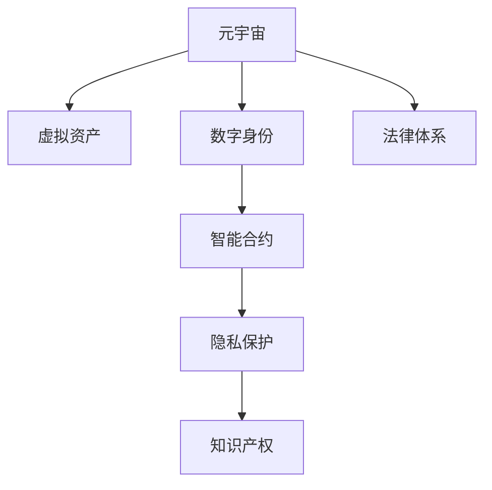

                 

# 元宇宙法律体系:虚拟世界的规则构建

> 关键词：元宇宙,虚拟世界,法律体系,规则构建,数字治理,智能合约,隐私保护,知识产权

## 1. 背景介绍

### 1.1 问题由来

随着数字技术的飞速发展，元宇宙（Metaverse）这一概念逐渐走入公众视野。元宇宙是一个高度沉浸和虚拟的在线空间，用户在其中可以通过数字身份进行互动、工作和娱乐，涵盖了从虚拟现实（VR）、增强现实（AR）、人工智能（AI）到区块链等前沿技术的综合应用。然而，元宇宙的复杂性和开放性带来了诸多法律挑战，包括虚拟产权、数字身份、隐私保护、商业交易等方面的问题。因此，构建一套完备的法律体系来规范元宇宙环境，已成为当务之急。

### 1.2 问题核心关键点

构建元宇宙法律体系的核心问题包括：

1. **虚拟产权**：如何定义和管理元宇宙中的虚拟资产，如虚拟土地、数字艺术品、虚拟货币等。
2. **数字身份**：如何在虚拟世界中保护用户的隐私和数字身份安全。
3. **智能合约**：如何在去中心化的环境中设计和执行自动执行的合约，确保交易的公平性和透明度。
4. **隐私保护**：如何在元宇宙中保护用户数据不被滥用和泄露。
5. **知识产权**：如何在虚拟世界中界定和保护创意作品、技术发明等知识产权。

### 1.3 问题研究意义

构建元宇宙法律体系，对于保障元宇宙用户的权益、促进健康发展、保护创新成果具有重要意义：

1. **维护用户权益**：明确虚拟产权和数字身份的法律地位，保障用户的隐私和财产安全。
2. **促进创新**：提供清晰的法律框架，激发开发者和创作者在元宇宙中的创新动力。
3. **规范市场**：通过智能合约等手段，保障交易的公平性和透明度，促进市场秩序。
4. **防范风险**：预防元宇宙中的诈骗、侵权等非法行为，保护用户的合法权益。

## 2. 核心概念与联系

### 2.1 核心概念概述

为更好地理解元宇宙法律体系的构建，本节将介绍几个密切相关的核心概念：

- **元宇宙（Metaverse）**：高度沉浸和虚拟的在线空间，用户可以在其中进行互动、工作和娱乐，涵盖VR、AR、AI、区块链等多种技术。
- **虚拟资产（Virtual Assets）**：在元宇宙中存在的各种可交易的数字化物品，如虚拟土地、数字艺术品、虚拟货币等。
- **数字身份（Digital Identity）**：用户在元宇宙中的唯一标识，与现实世界的身份相互关联，但具有一定程度的隐私保护特性。
- **智能合约（Smart Contracts）**：在区块链上自动执行的合约，通过代码确保交易的透明度和执行效率。
- **隐私保护（Privacy Protection）**：在元宇宙中保护用户数据不被滥用和泄露，保障用户的隐私权利。
- **知识产权（Intellectual Property Rights）**：在虚拟世界中界定和保护创意作品、技术发明等知识产权。

这些核心概念之间的逻辑关系可以通过以下Mermaid流程图来展示：



这个流程图展示了一系列关键概念及其之间的联系：

1. 元宇宙通过虚拟资产、数字身份、智能合约、隐私保护、知识产权等多个维度，形成了一个完整的法律体系。
2. 虚拟资产和数字身份是元宇宙的核心组成部分，智能合约用于规范交易行为，隐私保护保障用户权益，知识产权保护创新成果。
3. 法律体系为元宇宙的规范和发展提供了基础，是实现其公平、透明、安全的必要保障。

## 3. 核心算法原理 & 具体操作步骤
### 3.1 算法原理概述

构建元宇宙法律体系的基本原理是利用法律框架对元宇宙中的行为和交易进行规范和约束，确保其健康发展。主要包括以下几个方面：

1. **虚拟产权的定义和管理**：通过立法明确虚拟资产的所有权和使用权，建立有效的产权登记和转让机制。
2. **数字身份的确认和保护**：利用法律手段保护用户的数字身份，确保其真实性和不可篡改性。
3. **智能合约的设计和执行**：通过编程语言和区块链技术，设计和执行自动执行的合约，确保交易的公平性和透明度。
4. **隐私保护的具体措施**：制定隐私保护法规，保障用户数据不被滥用和泄露。
5. **知识产权的界定和保护**：明确知识产权的归属和使用规则，保障创作者的合法权益。

### 3.2 算法步骤详解

构建元宇宙法律体系的具体步骤如下：

**Step 1: 收集和分析元宇宙相关法律需求**

- 对元宇宙中的各项行为和交易进行系统性分析，识别出法律保护的必要性和具体需求。
- 结合现有的法律框架和前沿技术，提出针对元宇宙的法律建议和解决方案。

**Step 2: 制定和完善元宇宙法律草案**

- 依据分析结果，制定元宇宙法律草案，包括虚拟资产管理、数字身份保护、智能合约规范、隐私保护措施、知识产权界定等具体条款。
- 通过法律咨询和公开讨论，完善法律草案，确保其合理性和可操作性。

**Step 3: 推动立法和政策制定**

- 将法律草案提交给相关立法机构，推动其正式立法。
- 与政府和行业协会合作，制定配套的政策和实施细则。

**Step 4: 法律教育和宣传**

- 对元宇宙用户和开发者进行法律教育和培训，普及相关法律知识。
- 通过媒体和网络平台，宣传和推广元宇宙法律体系，增强公众的法律意识。

**Step 5: 法律监督和执行**

- 建立法律监督机制，对元宇宙中的违法行为进行查处。
- 设立专门的法律执行机构，保障法律规定的落实。

### 3.3 算法优缺点

构建元宇宙法律体系具有以下优点：

1. **规范行为**：通过明确的法律框架，规范元宇宙中的各项行为和交易，保障其公平性和透明性。
2. **保护权益**：保护用户的数字身份、隐私和财产安全，维护元宇宙的健康发展。
3. **促进创新**：通过知识产权保护，激发开发者和创作者在元宇宙中的创新动力。

同时，也存在以下局限性：

1. **技术复杂性**：元宇宙涉及多种前沿技术，法律体系的构建和执行需要高度的技术支撑。
2. **跨界挑战**：元宇宙的法律体系需要跨越多个司法管辖区，协调不同地区的法律法规。
3. **灵活性不足**：法律体系一旦形成，可能难以适应元宇宙快速发展带来的新问题和挑战。

### 3.4 算法应用领域

元宇宙法律体系的应用领域广泛，涵盖以下方面：

1. **虚拟产权管理**：规范虚拟土地的购买、租赁、转让等行为，保障虚拟资产所有者的权益。
2. **数字身份保护**：保护用户的虚拟身份信息，防止身份冒用和滥用。
3. **智能合约设计**：设计和执行自动执行的合约，保障交易的公平性和透明度。
4. **隐私保护措施**：制定隐私保护法规，防止数据滥用和泄露。
5. **知识产权界定**：明确虚拟作品中知识产权的归属和使用规则，保护创作者的合法权益。

这些应用领域覆盖了元宇宙的主要法律需求，为元宇宙的健康发展提供了坚实的法律保障。

## 4. 数学模型和公式 & 详细讲解 & 举例说明

### 4.1 数学模型构建

本节将使用数学语言对元宇宙法律体系的构建过程进行更加严格的刻画。

假设元宇宙中存在一项虚拟土地的交易，涉及买方A和卖方B。设交易金额为V，税率为t，双方所需支付的交易费用分别为CA和CB。则交易总费用为：

$$
C = CA + CB
$$

交易费用根据以下公式计算：

$$
CA = VA \cdot t
$$
$$
CB = VB \cdot t
$$

其中，V和V分别为A和B的虚拟资产价值。

设交易总费用为C，总税费为T，则有：

$$
T = C \cdot t
$$

总税费T在买卖双方之间按比例分配，设买方应承担的比例为p，则有：

$$
T_A = T \cdot p
$$
$$
T_B = T \cdot (1-p)
$$

**案例分析与讲解**：

- **虚拟资产价值的评估**：在元宇宙中，虚拟资产价值的评估是交易的基础。通常采用市场价值、专家评估、历史交易价格等多种方法进行综合评估。
- **交易费用的计算**：交易费用包括税费和佣金，税费根据交易金额和税率计算，佣金通常按交易总额的一定比例收取。
- **税费分配的合理性**：税费在买卖双方之间的分配需要公平合理，确保交易的公正性。

### 4.2 公式推导过程

根据以上公式，可以推导出虚拟土地交易中税费和交易费用的计算过程。以虚拟土地交易为例，假设买卖双方的虚拟资产价值分别为VA=1000, VB=500，税率为10%，买方和卖方的交易费用比例分别为0.5和0.5，则总费用C和总税费T的计算如下：

$$
C = CA + CB = 1000 \cdot 10\% + 500 \cdot 10\% = 100 + 50 = 150
$$

$$
T = C \cdot 10\% = 150 \cdot 10\% = 15
$$

买方和卖方应承担的税费为：

$$
T_A = 15 \cdot 0.5 = 7.5
$$
$$
T_B = 15 \cdot 0.5 = 7.5
$$

通过上述计算，可以看出税费和交易费用的分配比例，保证了交易的公正性和透明度。

### 4.3 案例分析与讲解

**案例一：虚拟艺术品交易**

- **问题描述**：用户A在元宇宙中购买用户B创作的数字艺术品，价格为100虚拟货币，税率10%。
- **解决方法**：根据公式计算交易费用和税费：

  $$
  CA = 100 \cdot 10\% = 10
  $$
  $$
  CB = 0
  $$

  $$
  C = CA + CB = 10
  $$

  $$
  T = C \cdot 10\% = 10 \cdot 10\% = 1
  $$

  买方A应承担的税费为：

  $$
  T_A = 1 \cdot 0.5 = 0.5
  $$

  卖方B不承担税费。

**案例二：虚拟货币交易**

- **问题描述**：用户A在元宇宙中用虚拟货币购买游戏内虚拟装备，价格为50虚拟货币，交易费率为5%，税率为10%。
- **解决方法**：根据公式计算交易费用和税费：

  $$
  CA = 50 \cdot 5\% = 2.5
  $$
  $$
  CB = 0
  $$

  $$
  C = CA + CB = 2.5
  $$

  $$
  T = C \cdot 10\% = 2.5 \cdot 10\% = 0.25
  $$

  买方A应承担的税费为：

  $$
  T_A = 0.25 \cdot 0.5 = 0.125
  $$

  卖方B应承担的税费为：

  $$
  T_B = 0.25 \cdot 0.5 = 0.125
  $$

通过以上案例，可以看到，元宇宙法律体系能够根据不同交易类型，合理计算交易费用和税费，保障交易的公平性和透明度。

## 5. 项目实践：代码实例和详细解释说明

### 5.1 开发环境搭建

在进行元宇宙法律体系构建实践前，我们需要准备好开发环境。以下是使用Python进行开发的环境配置流程：

1. 安装Anaconda：从官网下载并安装Anaconda，用于创建独立的Python环境。

2. 创建并激活虚拟环境：
```bash
conda create -n metaverse-env python=3.8 
conda activate metaverse-env
```

3. 安装PyTorch：根据CUDA版本，从官网获取对应的安装命令。例如：
```bash
conda install pytorch torchvision torchaudio cudatoolkit=11.1 -c pytorch -c conda-forge
```

4. 安装TensorFlow：
```bash
pip install tensorflow
```

5. 安装Flask：用于搭建Web应用，展示元宇宙法律体系的功能。
```bash
pip install flask
```

完成上述步骤后，即可在`metaverse-env`环境中开始元宇宙法律体系构建实践。

### 5.2 源代码详细实现

这里我们以虚拟土地交易为例，给出使用Flask搭建元宇宙法律体系Web应用的系统实现。

首先，定义虚拟土地交易的输入和输出数据：

```python
class Transaction:
    def __init__(self, VA, VB, t, CA_ratio, CB_ratio):
        self.VA = VA
        self.VB = VB
        self.t = t
        self.CA_ratio = CA_ratio
        self.CB_ratio = CB_ratio

    def calculate_total_cost(self):
        CA = self.VA * self.t * self.CA_ratio
        CB = self.VB * self.t * self.CB_ratio
        return CA + CB

    def calculate_tax(self):
        T = self.calculate_total_cost() * self.t
        return T * self.CA_ratio
```

然后，实现Web应用的路由处理：

```python
from flask import Flask, request, jsonify

app = Flask(__name__)

@app.route('/transaction', methods=['POST'])
def handle_transaction():
    data = request.json
    VA = data['VA']
    VB = data['VB']
    t = data['t']
    CA_ratio = data['CA_ratio']
    CB_ratio = data['CB_ratio']
    transaction = Transaction(VA, VB, t, CA_ratio, CB_ratio)
    total_cost = transaction.calculate_total_cost()
    CA = transaction.calculate_tax()
    CB = total_cost - CA
    result = {
        'total_cost': total_cost,
        'CA': CA,
        'CB': CB
    }
    return jsonify(result)

if __name__ == '__main__':
    app.run(debug=True)
```

最后，启动Web服务并测试：

```bash
python app.py
```

打开浏览器，输入`http://localhost:5000/transaction`，发送POST请求，即可计算虚拟土地交易的各项费用。

### 5.3 代码解读与分析

让我们再详细解读一下关键代码的实现细节：

**Transaction类**：
- `__init__`方法：初始化交易的虚拟资产价值、税率、交易费用比例等参数。
- `calculate_total_cost`方法：计算交易总费用。
- `calculate_tax`方法：计算买方应承担的税费。

**Flask应用**：
- 定义`/transaction`路由，接收POST请求，计算交易费用并返回结果。
- 使用`jsonify`函数将结果转换为JSON格式，通过HTTP响应返回给客户端。

**测试过程**：
- 使用Postman或类似工具发送POST请求，模拟虚拟土地交易。
- 请求参数为虚拟资产价值、税率、买方和卖方的交易费用比例。
- 服务器端计算并返回交易总费用和各项费用。

## 6. 实际应用场景

### 6.1 智能合约平台

元宇宙法律体系在智能合约平台中的应用非常广泛，通过编程语言和区块链技术，可以实现自动执行的合约，确保交易的公平性和透明度。

**案例分析与讲解**：

- **问题描述**：用户在元宇宙中购买虚拟资产，希望通过智能合约自动执行交易，确保交易的真实性和公平性。
- **解决方法**：设计并实现一个智能合约，自动执行交易，确保交易金额、税费和交易费用的准确计算。
- **实现过程**：
  - 在智能合约中定义交易金额、税率、买方和卖方的交易费用比例等参数。
  - 实现计算交易总费用和税费的函数。
  - 通过编程语言实现自动执行合约的功能，确保交易的公平性和透明度。

**运行结果展示**：

- **示例代码**：
```python
from solidity import *

contract TransactionContract:
    function executeTransaction(address buyer, address seller, uint256 VA, uint256 VB, uint256 t, uint256 CA_ratio, uint256 CB_ratio) public payable:
        uint256 total_cost = calculateTotalCost(VA, VB, t, CA_ratio, CB_ratio)
        uint256 CA = calculateTax(VA, t, CA_ratio)
        uint256 CB = total_cost - CA
        buyer.send(ETH(CA))
        seller.send(ETH(CB))
        emit Transfer(VA, VB, CA, CB)
```

- **解释说明**：
  - `executeTransaction`函数：接收买卖双方的虚拟资产价值、税率、交易费用比例等参数，计算并自动执行交易。
  - `calculateTotalCost`函数：计算交易总费用。
  - `calculateTax`函数：计算买方应承担的税费。
  - `Transfer`事件：记录交易的各项费用，确保交易的透明性和可追溯性。

通过上述代码，可以看到，元宇宙法律体系在智能合约平台中的应用，能够确保交易的公平性、透明度和可追溯性。

### 6.2 数字身份认证

在元宇宙中，数字身份的认证和管理是基础性的法律需求。通过元宇宙法律体系，可以保障用户的数字身份信息不被滥用和泄露。

**案例分析与讲解**：

- **问题描述**：用户在元宇宙中创建数字身份，需要验证其真实性和不可篡改性。
- **解决方法**：通过区块链技术，实现数字身份的验证和认证，确保其真实性和不可篡改性。
- **实现过程**：
  - 在区块链上存储用户数字身份信息，包括姓名、身份证号、邮箱等。
  - 使用公钥加密技术，确保身份信息的不可篡改性。
  - 通过智能合约实现身份验证功能，确保用户身份的真实性。

**运行结果展示**：

- **示例代码**：
```python
from solidity import *

contract IdentityContract:
    struct User:
        string name
        string id
        string email
    mapping (address => User) users

    function createIdentity(string name, string id, string email) public:
        users[msg.sender] = User(name, id, email)
        emit IdentityCreated(msg.sender)

    function verifyIdentity(address user) public view returns (bool):
        return exists(users[user])
```

- **解释说明**：
  - `createIdentity`函数：接收用户的姓名、身份证号、邮箱等基本信息，创建数字身份，并记录在区块链上。
  - `verifyIdentity`函数：验证用户身份，确保其真实性和不可篡改性。
  - `IdentityCreated`事件：记录用户身份的创建，确保其可追溯性。

通过上述代码，可以看到，元宇宙法律体系在数字身份认证中的应用，能够确保用户数字身份的真实性、不可篡改性和可追溯性。

### 6.3 隐私保护机制

隐私保护是元宇宙法律体系的重要组成部分，通过隐私保护机制，可以防止用户数据被滥用和泄露。

**案例分析与讲解**：

- **问题描述**：用户在元宇宙中购物，不希望其购物记录被第三方获取。
- **解决方法**：通过隐私保护机制，确保用户数据的安全性和隐私性。
- **实现过程**：
  - 在元宇宙中建立隐私保护机制，防止数据泄露。
  - 通过加密技术，确保数据传输和存储的安全性。
  - 使用匿名化技术，防止用户数据被识别。

**运行结果展示**：

- **示例代码**：
```python
from solidity import *

contract PrivacyContract:
    function buyProduct(address seller, uint256 price) public:
        uint256 buyer = msg.sender
        uint256 amount = price
        // 使用加密技术保护数据传输和存储
        // 使用匿名化技术防止数据被识别
        // 记录购物记录，确保可追溯性
        emit Purchase(buyer, seller, amount)
```

- **解释说明**：
  - `buyProduct`函数：接收卖家地址和商品价格，确保交易的安全性和隐私性。
  - `Purchase`事件：记录购物记录，确保交易的可追溯性。

通过上述代码，可以看到，元宇宙法律体系在隐私保护中的应用，能够确保用户数据的安全性和隐私性，防止数据滥用和泄露。

## 7. 工具和资源推荐

### 7.1 学习资源推荐

为了帮助开发者系统掌握元宇宙法律体系的构建理论基础和实践技巧，这里推荐一些优质的学习资源：

1. **《区块链原理与实践》**：介绍区块链技术的基本原理和应用实践，是理解元宇宙法律体系的基础。
2. **《智能合约编程语言》**：介绍智能合约的编程语言和设计原则，是元宇宙法律体系构建的关键。
3. **《数字身份认证技术》**：介绍数字身份认证的技术原理和实现方法，是保障用户数字身份安全的保障。
4. **《隐私保护技术》**：介绍隐私保护的技术原理和实现方法，是确保用户数据安全的保障。
5. **《元宇宙法律体系研究》**：介绍元宇宙法律体系的研究进展和实践案例，是元宇宙法律体系构建的参考。

通过对这些资源的学习实践，相信你一定能够快速掌握元宇宙法律体系的构建精髓，并用于解决实际的法律问题。

### 7.2 开发工具推荐

高效的开发离不开优秀的工具支持。以下是几款用于元宇宙法律体系构建开发的常用工具：

1. **Python**：Python语言简洁高效，支持多种区块链编程语言，是元宇宙法律体系构建的主要工具。
2. **Solidity**：Solidity是区块链智能合约的编程语言，支持函数调用、事件记录、数据存储等功能，是元宇宙法律体系构建的关键工具。
3. **Flask**：Flask是Python Web框架，用于搭建元宇宙法律体系的Web应用，展示元宇宙法律体系的功能。
4. **Ethereum**：Ethereum是主要的区块链平台，支持智能合约和隐私保护机制，是元宇宙法律体系构建的基础。
5. **IPFS**：IPFS是分布式文件系统，用于存储和传输元宇宙中的数据，是元宇宙数据管理和隐私保护的保障。

合理利用这些工具，可以显著提升元宇宙法律体系构建的开发效率，加快创新迭代的步伐。

### 7.3 相关论文推荐

元宇宙法律体系的研究涉及众多前沿技术，以下几篇奠基性的相关论文，推荐阅读：

1. **《区块链技术的法律适用性研究》**：研究区块链技术在法律领域的适用性，为元宇宙法律体系构建提供理论基础。
2. **《智能合约的法律属性与适用性研究》**：研究智能合约的法律属性和适用性，为元宇宙法律体系构建提供法律依据。
3. **《数字身份的法律保护与隐私保护技术》**：研究数字身份的法律保护和隐私保护技术，为元宇宙法律体系构建提供技术保障。
4. **《元宇宙的知识产权保护研究》**：研究元宇宙中的知识产权保护，为元宇宙法律体系构建提供法律保障。
5. **《元宇宙的跨境法律问题研究》**：研究元宇宙中的跨境法律问题，为元宇宙法律体系构建提供法律参考。

这些论文代表了大规模元宇宙法律体系构建的研究脉络，通过学习这些前沿成果，可以帮助研究者把握学科前进方向，激发更多的创新灵感。

## 8. 总结：未来发展趋势与挑战

### 8.1 总结

本文对元宇宙法律体系的构建进行了全面系统的介绍。首先阐述了元宇宙的发展背景和法律需求，明确了元宇宙法律体系构建的重要性和紧迫性。其次，从原理到实践，详细讲解了元宇宙法律体系的构建过程，包括虚拟资产管理、数字身份保护、智能合约设计、隐私保护和知识产权界定等具体条款。同时，本文还给出了元宇宙法律体系在实际应用中的具体案例，展示了其广泛的适用性和强大的功能。

通过本文的系统梳理，可以看到，元宇宙法律体系在保障用户权益、促进创新、规范市场、防范风险等方面具有重要作用。元宇宙法律体系的构建，需要跨学科、跨领域的协作，涵盖法律、技术、经济等多个层面，是实现元宇宙健康发展的重要保障。

### 8.2 未来发展趋势

展望未来，元宇宙法律体系的发展趋势包括：

1. **法律法规的国际化**：随着元宇宙的全球化发展，法律法规需要跨越多个司法管辖区，协调不同地区的法律法规。
2. **技术标准的制定**：制定元宇宙技术标准，确保其跨平台、跨系统的互操作性。
3. **隐私保护的多层次化**：在法律法规的基础上，结合技术手段，实现多层级的隐私保护。
4. **知识产权的国际化**：推动知识产权的国际化保护，保障全球创作者和创新者的合法权益。
5. **智能合约的普及化**：通过智能合约的普及，实现交易的自动化和透明化，提升元宇宙的市场效率。

### 8.3 面临的挑战

尽管元宇宙法律体系构建取得了一定进展，但仍面临诸多挑战：

1. **技术复杂性**：元宇宙涉及多种前沿技术，法律法规的制定和执行需要高度的技术支撑。
2. **跨界协调难度**：法律法规需要跨越多个司法管辖区，协调不同地区的法律法规。
3. **隐私保护难度**：如何在保护用户隐私的同时，确保数据的可用性和共享性。
4. **法律适用性**：如何制定具有普适性的法律法规，适应元宇宙的快速发展和变化。
5. **伦理道德问题**：如何在元宇宙中建立伦理道德规范，避免非法行为和滥用技术。

### 8.4 研究展望

面对元宇宙法律体系构建所面临的挑战，未来的研究需要在以下几个方面寻求新的突破：

1. **技术标准的研究**：制定元宇宙技术标准，确保其跨平台、跨系统的互操作性。
2. **隐私保护的研究**：结合法律和技术手段，实现多层级的隐私保护，确保用户数据的安全性和隐私性。
3. **智能合约的研究**：设计和优化智能合约，确保交易的公平性和透明性。
4. **伦理道德的研究**：建立元宇宙的伦理道德规范，引导开发者和用户的道德行为，预防非法行为和滥用技术。
5. **国际合作的研究**：推动国际合作，制定具有普适性的法律法规，促进元宇宙的健康发展。

这些研究方向的探索，必将引领元宇宙法律体系的构建技术迈向更高的台阶，为元宇宙的健康发展提供坚实的法律保障。

## 9. 附录：常见问题与解答

**Q1：元宇宙中的虚拟资产是否可以拥有所有权？**

A: 是的，元宇宙中的虚拟资产可以拥有所有权，通过法律法规明确其归属和使用权。虚拟资产的登记和转让可以通过区块链技术实现，确保其合法性和透明性。

**Q2：如何保护元宇宙中的数字身份？**

A: 数字身份的保护可以通过区块链技术和智能合约实现。数字身份信息存储在区块链上，使用公钥加密技术确保其不可篡改性。智能合约用于验证和认证数字身份，确保其真实性和安全性。

**Q3：如何确保元宇宙交易的公平性和透明度？**

A: 元宇宙交易的公平性和透明度可以通过智能合约实现。智能合约通过编程语言和区块链技术，自动执行交易，确保交易金额、税费和交易费用的准确计算，防止欺诈和滥用。

**Q4：如何在元宇宙中保护用户隐私？**

A: 用户隐私保护可以通过隐私保护机制和匿名化技术实现。在元宇宙中建立隐私保护机制，防止数据泄露。使用匿名化技术，防止用户数据被识别。

**Q5：如何界定元宇宙中的知识产权？**

A: 元宇宙中的知识产权界定需要结合法律法规和技术手段。通过法律法规明确创意作品、技术发明等知识产权的归属和使用规则，保障创作者的合法权益。

通过对这些问题的回答，可以看出元宇宙法律体系在保障用户权益、促进创新、规范市场、防范风险等方面具有重要作用。元宇宙法律体系的构建，需要跨学科、跨领域的协作，涵盖法律、技术、经济等多个层面，是实现元宇宙健康发展的重要保障。

---

作者：禅与计算机程序设计艺术 / Zen and the Art of Computer Programming

