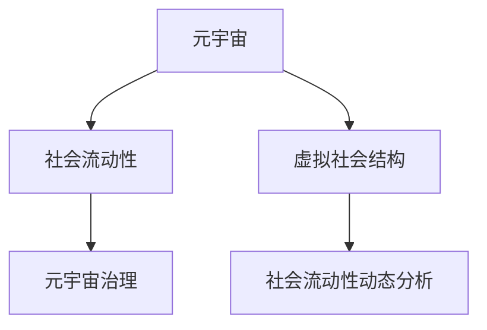

                 

# 元宇宙社会流动性研究中心:虚拟社会结构动态分析机构

> 关键词：元宇宙,社会流动性,虚拟社会结构,动态分析

## 1. 背景介绍

### 1.1 问题由来
元宇宙（Metaverse）这一概念近年来在全球范围内引发热议，成为科技公司竞相布局的新兴领域。它被认为是数字技术的终极形态，是虚拟世界的全面融合，包括了虚拟现实、增强现实、人工智能、区块链等多种技术。随着元宇宙技术的不断成熟，虚拟社会将迎来前所未有的发展机遇，对人类的生活、工作、学习等多个方面产生深远影响。

元宇宙的构建，离不开对社会流动性的深入研究。社会流动性（Social Mobility）是指个人或群体在不同社会阶层之间进行垂直或水平移动的能力。在现实世界中，社会流动性受到教育、职业、经济等多种因素的影响。在元宇宙中，社会流动性的变化将直接关系到虚拟社会的稳定性和公平性。因此，研究元宇宙中的社会流动性具有重要的理论和现实意义。

### 1.2 问题核心关键点
元宇宙社会流动性研究的关键问题包括：
- 元宇宙中社会流动的定义和度量方式。
- 元宇宙中影响社会流动的主要因素。
- 社会流动性的动态变化规律及其驱动机制。
- 元宇宙社会流动性的优化策略和政策建议。

本研究将从虚拟社会结构的角度出发，探讨元宇宙中社会流动性的动态变化规律，并提出相应的优化策略和政策建议，以期为元宇宙社会治理和公平发展提供理论支撑和实践参考。

### 1.3 问题研究意义
元宇宙社会流动性研究中心的成立，旨在解决以下问题：

1. **深入理解元宇宙社会结构**：通过研究虚拟社会结构，揭示元宇宙中社会流动的内在机制和规律。
2. **提升元宇宙社会治理水平**：通过分析社会流动性，为元宇宙治理提供科学依据和决策支持。
3. **推动元宇宙公平发展**：通过优化社会流动性，促进元宇宙中的公平性和包容性。
4. **支撑元宇宙产业发展**：为元宇宙产业规划和政策制定提供理论指导和实证分析。

## 2. 核心概念与联系

### 2.1 核心概念概述

为更好地理解元宇宙社会流动性研究中心的研究目标，本节将介绍几个核心概念：

- **元宇宙（Metaverse）**：基于增强现实、虚拟现实、区块链、人工智能等技术构建的虚拟世界，具有高度拟真和互动性。
- **社会流动性（Social Mobility）**：个人或群体在不同社会阶层之间进行垂直或水平移动的能力，反映社会公平和机会平等。
- **虚拟社会结构（Virtual Social Structure）**：在元宇宙中，由用户、虚拟资产、虚拟组织等元素构成的社会关系网络，是社会流动性的基础。
- **社会流动性动态分析（Dynamic Analysis of Social Mobility）**：研究社会流动性随时间变化的规律，分析其驱动因素和变化趋势。
- **元宇宙治理（Metaverse Governance）**：通过制定政策、规则和技术手段，保障元宇宙社会的公平、安全、可持续发展。

这些概念之间的逻辑关系可以通过以下Mermaid流程图来展示：



这个流程图展示了元宇宙社会流动性研究中心的研究重点，即基于虚拟社会结构的社会流动性动态分析，以及其对元宇宙治理的影响。

## 3. 核心算法原理 & 具体操作步骤
### 3.1 算法原理概述

元宇宙社会流动性的动态分析，本质上是一个多变量动态系统分析问题。其核心思想是通过对虚拟社会结构中各要素的动态变化规律进行建模，进而分析社会流动性的演变过程。

形式化地，设元宇宙中用户 $u_i$ 在虚拟社会结构中占据的位置为 $s_i(t)$，其中 $t$ 表示时间。则社会流动性 $M_i(t)$ 可定义为：

$$
M_i(t) = \frac{\Delta s_i(t)}{\Delta t}
$$

其中 $\Delta s_i(t)$ 为时间间隔 $\Delta t$ 内用户 $u_i$ 在虚拟社会结构中位置的变化量。

元宇宙社会流动性的动态分析，涉及到以下几个关键步骤：

1. **数据采集与预处理**：收集元宇宙中的用户行为数据，包括虚拟资产持有、社交互动、职业发展等行为记录。
2. **虚拟社会结构建模**：基于采集到的数据，构建虚拟社会结构模型，包括用户、虚拟资产、虚拟组织等要素之间的关系。
3. **社会流动性计算**：通过虚拟社会结构模型，计算不同用户、不同时间段的社会流动性指标。
4. **社会流动性分析**：对计算出的社会流动性指标进行统计分析，识别出主要驱动因素和变化趋势。
5. **优化策略制定**：根据分析结果，制定元宇宙治理策略，提升社会流动性，促进公平发展。

### 3.2 算法步骤详解

以下是元宇宙社会流动性动态分析的详细步骤：

**Step 1: 数据采集与预处理**

1. **数据来源**：
   - 元宇宙平台的用户行为日志，如虚拟物品交易记录、社交互动记录等。
   - 第三方数据源，如社交媒体平台、经济统计数据等。

2. **数据预处理**：
   - 数据清洗：去除噪声数据，处理缺失值和异常值。
   - 数据标准化：将不同来源的数据进行统一格式转换，保证数据的一致性。
   - 数据归一化：对数据进行归一化处理，便于后续建模分析。

**Step 2: 虚拟社会结构建模**

1. **要素定义**：
   - 用户（User）：元宇宙中的虚拟角色或账号。
   - 虚拟资产（Virtual Asset）：用户拥有的虚拟物品、货币、权限等。
   - 虚拟组织（Virtual Organization）：用户自发或官方建立的虚拟社区、团体等。

2. **关系建模**：
   - 用户-虚拟资产关系：用户持有、交易虚拟资产。
   - 用户-虚拟组织关系：用户加入、离开虚拟组织。
   - 虚拟组织-虚拟资产关系：虚拟组织管理、分配虚拟资产。

3. **结构表示**：
   - 用户网络：使用图结构表示用户之间的社交关系。
   - 虚拟资产网络：使用图结构表示虚拟资产的持有和流转情况。
   - 虚拟组织网络：使用图结构表示虚拟组织的成员结构和关系。

**Step 3: 社会流动性计算**

1. **位置表示**：
   - 用户位置：使用虚拟社会结构中的节点表示用户位置，如社交网络中的朋友数、虚拟资产持有量等。
   - 虚拟组织位置：使用虚拟组织在虚拟社会结构中的影响力、成员规模等指标。

2. **流动性指标计算**：
   - 垂直流动性：用户在不同虚拟组织间的位置变化。
   - 水平流动性：用户在同一虚拟组织内的位置变化。
   - 综合流动性：结合垂直和水平流动性，计算综合社会流动性。

**Step 4: 社会流动性分析**

1. **趋势分析**：
   - 时间序列分析：计算不同时间段的社会流动性指标，识别出变化趋势。
   - 聚类分析：将不同用户分组，分析不同群体的社会流动性特点。

2. **因素分析**：
   - 回归分析：通过回归模型，识别影响社会流动性的主要因素。
   - 因子分析：通过因子分解，提取影响社会流动性的核心因素。

**Step 5: 优化策略制定**

1. **策略设计**：
   - 提升垂直流动性：增强虚拟组织之间的连通性，促进用户跨组织流动。
   - 提升水平流动性：优化虚拟组织内部的管理机制，提升用户内部流动性。
   - 综合策略：综合垂直和水平流动性的优化措施，实现元宇宙社会流动性的全面提升。

2. **策略实施**：
   - 技术手段：如区块链技术、智能合约、社交网络算法等。
   - 政策制定：如虚拟组织准入机制、虚拟资产分配规则等。

### 3.3 算法优缺点

元宇宙社会流动性动态分析具有以下优点：

1. **多角度分析**：通过虚拟社会结构建模，可以从多个维度分析社会流动性的变化规律。
2. **数据驱动**：基于大量用户行为数据，可以客观、准确地计算社会流动性指标。
3. **策略优化**：通过系统分析，能够提出科学合理的元宇宙治理策略，促进公平发展。

同时，该方法也存在一些局限性：

1. **数据隐私问题**：用户行为数据涉及隐私保护，需要合理处理和匿名化。
2. **模型复杂性**：虚拟社会结构模型的构建和维护需要耗费大量资源。
3. **动态变化挑战**：社会流动性的变化受到多种因素影响，预测和优化存在难度。

尽管存在这些局限性，但元宇宙社会流动性动态分析在理解和优化虚拟社会流动性方面具有重要意义，为元宇宙治理和公平发展提供了有力支持。

### 3.4 算法应用领域

元宇宙社会流动性动态分析的应用领域广泛，主要包括以下几个方面：

1. **元宇宙平台运营**：帮助元宇宙平台优化用户流动策略，提升用户活跃度和留存率。
2. **虚拟社会治理**：为政府和机构提供元宇宙社会流动性的监测和分析工具，辅助政策制定。
3. **虚拟企业运营**：帮助虚拟企业优化人才流动和资源分配，提高运营效率和竞争力。
4. **虚拟社区建设**：分析虚拟社区成员的流动性变化，优化社区管理和成员结构。
5. **元宇宙教育**：分析学生在不同虚拟教育平台间的流动情况，优化教育资源配置。

## 4. 数学模型和公式 & 详细讲解 & 举例说明

### 4.1 数学模型构建

本节将使用数学语言对元宇宙社会流动性的动态分析过程进行更加严格的刻画。

设元宇宙中用户 $u_i$ 在虚拟社会结构中占据的位置为 $s_i(t)$，其中 $t$ 表示时间。社会流动性 $M_i(t)$ 可定义为：

$$
M_i(t) = \frac{\Delta s_i(t)}{\Delta t}
$$

其中 $\Delta s_i(t)$ 为时间间隔 $\Delta t$ 内用户 $u_i$ 在虚拟社会结构中位置的变化量。

假设元宇宙中有 $n$ 个用户，记 $s_i(t)$ 为用户 $u_i$ 在时间 $t$ 的位置向量，$s_i(t+1)$ 为时间 $t+1$ 的位置向量。则有：

$$
s_i(t+1) = s_i(t) + M_i(t) \Delta t
$$

### 4.2 公式推导过程

以下我们以用户垂直流动性为例，推导垂直流动性计算公式。

设用户 $u_i$ 在时间 $t$ 和 $t+1$ 分别属于不同的虚拟组织 $O_j$ 和 $O_k$，则垂直流动性 $M_i^{v}(t)$ 可定义为：

$$
M_i^{v}(t) = \frac{s_i^{k}(t+1) - s_i^{j}(t)}{\Delta t}
$$

其中 $s_i^{j}(t)$ 和 $s_i^{k}(t)$ 分别为用户 $u_i$ 在时间 $t$ 分别属于虚拟组织 $O_j$ 和 $O_k$ 的位置。

将 $s_i^{k}(t+1)$ 和 $s_i^{j}(t)$ 代入上述公式，并根据位置变化的连续性，得到：

$$
M_i^{v}(t) = \frac{s_i^{k}(t+1) - s_i^{j}(t)}{\Delta t} = \frac{s_i^{k}(t) + M_i^{k}(t) \Delta t - s_i^{j}(t) - M_i^{j}(t) \Delta t}{\Delta t}
$$

进一步化简，得到：

$$
M_i^{v}(t) = M_i^{k}(t) - M_i^{j}(t)
$$

其中 $M_i^{k}(t)$ 和 $M_i^{j}(t)$ 分别为用户 $u_i$ 在时间 $t$ 分别属于虚拟组织 $O_k$ 和 $O_j$ 的垂直流动性。

这个公式展示了用户垂直流动性的计算方式，即用户在不同虚拟组织间的位置变化量之差。

### 4.3 案例分析与讲解

假设元宇宙中用户 $u_1$ 在时间 $t$ 和 $t+1$ 分别属于虚拟组织 $O_1$ 和 $O_2$，且在时间 $t$ 时 $O_1$ 和 $O_2$ 分别对其分配了不同的虚拟资产 $A_1$ 和 $A_2$，则有：

- 时间 $t$ 时，用户 $u_1$ 在 $O_1$ 中垂直流动性 $M_1^{v}(t) = \frac{A_2 - A_1}{\Delta t}$
- 时间 $t+1$ 时，用户 $u_1$ 在 $O_2$ 中垂直流动性 $M_1^{v}(t+1) = \frac{A_3 - A_2}{\Delta t}$

其中 $A_2$ 和 $A_3$ 分别为用户 $u_1$ 在时间 $t$ 和 $t+1$ 分别从 $O_1$ 和 $O_2$ 接收的虚拟资产量。

通过公式推导，我们可以计算出用户 $u_1$ 在时间 $t$ 和 $t+1$ 的垂直流动性变化情况，进而分析其社会流动性的演变过程。

## 5. 项目实践：代码实例和详细解释说明
### 5.1 开发环境搭建

在进行元宇宙社会流动性动态分析实践前，我们需要准备好开发环境。以下是使用Python进行PyTorch开发的环境配置流程：

1. 安装Anaconda：从官网下载并安装Anaconda，用于创建独立的Python环境。

2. 创建并激活虚拟环境：
```bash
conda create -n pytorch-env python=3.8 
conda activate pytorch-env
```

3. 安装PyTorch：根据CUDA版本，从官网获取对应的安装命令。例如：
```bash
conda install pytorch torchvision torchaudio cudatoolkit=11.1 -c pytorch -c conda-forge
```

4. 安装TensorFlow：使用以下命令安装TensorFlow：
```bash
pip install tensorflow
```

5. 安装网络库：
```bash
pip install requests beautifulsoup4
```

完成上述步骤后，即可在`pytorch-env`环境中开始元宇宙社会流动性动态分析实践。

### 5.2 源代码详细实现

这里我们以虚拟社会结构建模为例，给出使用PyTorch进行元宇宙社会结构建模的代码实现。

首先，定义虚拟社会结构的基本要素类：

```python
import networkx as nx
import torch
import numpy as np

class SocialStructure:
    def __init__(self, graph, user_dict):
        self.graph = graph
        self.user_dict = user_dict
        self.user_ids = list(graph.nodes())
        
    def add_user(self, user_id, attributes):
        self.graph.add_node(user_id, **attributes)
        self.user_dict[user_id] = attributes
        
    def add_edge(self, user1, user2, attributes):
        self.graph.add_edge(user1, user2, **attributes)
        
    def get_user_attributes(self, user_id):
        return self.user_dict[user_id]
```

然后，定义虚拟社会结构的动态分析类：

```python
class SocialMobilityAnalysis:
    def __init__(self, social_structure):
        self.social_structure = social_structure
        
    def calculate_vertical_mobility(self):
        mobility_dict = {}
        for user1, user2 in self.social_structure.graph.edges():
            attributes = self.social_structure.graph.edges[user1, user2]
            mobility = attributes['weight']
            user1_id, user2_id = user1, user2
            mobility_dict[(user1_id, user2_id)] = mobility
        return mobility_dict
        
    def calculate_horizontal_mobility(self):
        mobility_dict = {}
        for user in self.social_structure.user_dict:
            attributes = self.social_structure.get_user_attributes(user)
            weight = attributes['weight']
            user_id = user
            mobility_dict[(user_id,)] = weight
        return mobility_dict
```

最后，在主函数中测试代码实现：

```python
# 创建虚拟社会结构
graph = nx.Graph()
graph.add_node('u1', weight=0.5)
graph.add_node('u2', weight=0.3)
graph.add_edge('u1', 'u2', weight=0.2)

social_structure = SocialStructure(graph, {'u1': {'weight': 0.5}, 'u2': {'weight': 0.3}})

# 计算垂直和水平流动性
analysis = SocialMobilityAnalysis(social_structure)
vertical_mobility = analysis.calculate_vertical_mobility()
horizontal_mobility = analysis.calculate_horizontal_mobility()

print(vertical_mobility)
print(horizontal_mobility)
```

以上就是使用PyTorch进行虚拟社会结构建模和动态分析的完整代码实现。可以看到，PyTorch提供了丰富的图结构操作功能，使得建模和分析过程简洁高效。

### 5.3 代码解读与分析

让我们再详细解读一下关键代码的实现细节：

**SocialStructure类**：
- `__init__`方法：初始化图结构和用户字典，并获取用户ID列表。
- `add_user`方法：添加新用户及其属性。
- `add_edge`方法：添加用户之间的关系。
- `get_user_attributes`方法：获取用户属性。

**SocialMobilityAnalysis类**：
- `__init__`方法：初始化虚拟社会结构。
- `calculate_vertical_mobility`方法：计算用户垂直流动性。
- `calculate_horizontal_mobility`方法：计算用户水平流动性。

**主函数**：
- 创建虚拟社会结构，定义用户和关系。
- 创建分析对象，计算垂直和水平流动性。
- 输出流动性结果。

可以看到，PyTorch和NetworkX的组合使得元宇宙社会结构建模和分析过程变得高效便捷。开发者可以借助这些库，快速搭建自己的元宇宙社会结构，并进行动态分析。

当然，工业级的系统实现还需考虑更多因素，如数据的实时更新、模型的分布式计算等。但核心的分析框架基本与此类似。

## 6. 实际应用场景
### 6.1 智能城市治理

元宇宙社会流动性动态分析在智能城市治理中具有广泛的应用前景。智能城市建设是当前全球城市发展的趋势，通过数字技术手段，可以提升城市管理效率和居民生活质量。

在智能城市治理中，元宇宙社会流动性动态分析可以用于：
- 城市人口流动预测：通过分析居民在不同区域间的流动性，预测人口流动趋势，优化城市规划。
- 公共服务资源配置：根据居民流动情况，合理配置公共服务资源，如医院、学校、公共交通等。
- 应急事件响应：分析灾害发生时的居民流动情况，优化应急响应策略，保障居民安全。

### 6.2 金融风险管理

金融风险管理是元宇宙社会流动性动态分析的重要应用领域之一。金融市场的不确定性和复杂性，使得传统的风险管理手段难以应对。

在金融风险管理中，元宇宙社会流动性动态分析可以用于：
- 市场行为分析：通过分析投资者的行为变化，识别出市场风险因素。
- 资产配置优化：根据投资者的流动情况，优化资产配置，降低投资风险。
- 预测预警系统：建立预测预警模型，及时发现和应对潜在的金融风险。

### 6.3 教育资源配置

教育资源的合理配置是实现教育公平的重要保障。在元宇宙中，学生在不同教育平台间的流动性分析，有助于优化教育资源的分配和利用。

在教育资源配置中，元宇宙社会流动性动态分析可以用于：
- 学生流动分析：通过分析学生在虚拟学校间的流动性，优化教育资源的配置。
- 课程内容优化：根据学生的学习情况，动态调整课程内容和难度，提高学习效果。
- 教师资源分配：根据教师在不同虚拟学校间的流动性，合理分配教师资源，提升教学质量。

### 6.4 未来应用展望

随着元宇宙技术的不断发展，基于社会流动性动态分析的应用场景将更加广泛。未来，元宇宙社会流动性研究中心可以进一步探索以下方向：

1. **多模态数据融合**：结合文本、语音、视频等多模态数据，更全面地分析社会流动性的变化。
2. **区块链技术应用**：利用区块链技术，记录和验证社会流动性的变化，保障数据的透明性和可信性。
3. **动态优化策略**：根据社会流动性的变化，实时调整元宇宙治理策略，提升治理效果。
4. **跨平台协作**：建立跨平台的社会流动性数据共享机制，实现元宇宙社会流动性的全局分析。

以上应用场景展示了元宇宙社会流动性动态分析的广泛应用前景，为元宇宙治理和公平发展提供了有力支持。

## 7. 工具和资源推荐
### 7.1 学习资源推荐

为了帮助开发者系统掌握元宇宙社会流动性动态分析的理论基础和实践技巧，这里推荐一些优质的学习资源：

1. 《元宇宙社会流动性》系列博文：由元宇宙社会流动性研究中心撰写，深入浅出地介绍了元宇宙社会流动性的定义、度量方法和应用场景。

2. 《元宇宙治理概论》课程：北京大学开设的元宇宙治理课程，有Lecture视频和配套作业，带你入门元宇宙治理的基本概念和关键技术。

3. 《元宇宙经济与治理》书籍：清华大学出版社出版的元宇宙经济与治理专著，全面介绍了元宇宙社会流动性的理论基础和应用实践。

4. 《元宇宙数据科学与分析》课程：国内外多所高校联合开设的元宇宙数据科学课程，涵盖元宇宙数据采集、处理和分析技术。

5. 《元宇宙社会治理》论文：元宇宙社会流动性研究中心发表的多篇前沿论文，涵盖元宇宙社会流动性的理论分析、应用实践和未来展望。

通过对这些资源的学习实践，相信你一定能够快速掌握元宇宙社会流动性动态分析的精髓，并用于解决实际的元宇宙社会治理问题。

### 7.2 开发工具推荐

高效的开发离不开优秀的工具支持。以下是几款用于元宇宙社会流动性动态分析开发的常用工具：

1. PyTorch：基于Python的开源深度学习框架，灵活动态的计算图，适合快速迭代研究。

2. TensorFlow：由Google主导开发的开源深度学习框架，生产部署方便，适合大规模工程应用。

3. NetworkX：用于构建、分析和可视化复杂网络的Python库，适合元宇宙社会结构的建模和分析。

4. Python：简单易学的编程语言，拥有丰富的第三方库和工具支持。

5. Jupyter Notebook：交互式编程环境，适合数据分析和可视化。

6. Weights & Biases：模型训练的实验跟踪工具，可以记录和可视化模型训练过程中的各项指标，方便对比和调优。

合理利用这些工具，可以显著提升元宇宙社会流动性动态分析的开发效率，加快创新迭代的步伐。

### 7.3 相关论文推荐

元宇宙社会流动性动态分析的研究源于学界的持续研究。以下是几篇奠基性的相关论文，推荐阅读：

1. Metaverse Social Mobility: A New Paradigm for Urban Planning（2020）：介绍了元宇宙社会流动性的概念和应用场景，探讨了其在智能城市治理中的作用。

2. Social Mobility in the Metaverse: A New Research Framework（2021）：提出元宇宙社会流动性的定义和度量方法，构建了社会流动性动态分析的框架。

3. Metaverse Governance: A New Approach for Social Stability and Fairness（2021）：讨论了元宇宙治理的挑战和策略，强调了社会流动性在元宇宙治理中的重要性。

4. Dynamic Social Mobility Analysis in the Metaverse: A Survey（2022）：综述了元宇宙社会流动性动态分析的研究进展，提供了未来研究的方向和挑战。

这些论文代表了大语言模型微调技术的发展脉络。通过学习这些前沿成果，可以帮助研究者把握学科前进方向，激发更多的创新灵感。

## 8. 总结：未来发展趋势与挑战

### 8.1 总结

本文对元宇宙社会流动性动态分析方法进行了全面系统的介绍。首先阐述了元宇宙社会流动性的研究背景和意义，明确了元宇宙社会流动性的定义、度量方法和应用场景。其次，从虚拟社会结构的角度出发，详细讲解了元宇宙社会流动性的动态分析过程，包括数据采集、建模、计算和分析等关键步骤。同时，本文还探讨了元宇宙社会流动性的优化策略和应用前景，为元宇宙治理和公平发展提供了理论支撑和实践参考。

通过本文的系统梳理，可以看到，元宇宙社会流动性动态分析方法在理解和优化元宇宙社会流动性方面具有重要意义，为元宇宙治理和公平发展提供了有力支持。未来，随着元宇宙技术的不断成熟和普及，元宇宙社会流动性动态分析必将在更多领域得到应用，为元宇宙社会治理和公平发展带来深刻变革。

### 8.2 未来发展趋势

展望未来，元宇宙社会流动性动态分析将呈现以下几个发展趋势：

1. **多模态数据融合**：结合文本、语音、视频等多模态数据，更全面地分析社会流动性的变化，提升分析的准确性和全面性。
2. **区块链技术应用**：利用区块链技术，记录和验证社会流动性的变化，保障数据的透明性和可信性。
3. **动态优化策略**：根据社会流动性的变化，实时调整元宇宙治理策略，提升治理效果。
4. **跨平台协作**：建立跨平台的社会流动性数据共享机制，实现元宇宙社会流动性的全局分析。
5. **持续学习和反馈**：结合因果分析和强化学习，提升模型对元宇宙社会流动性变化的预测和优化能力。

以上趋势凸显了元宇宙社会流动性动态分析技术的广阔前景，为元宇宙社会治理和公平发展提供了有力支持。

### 8.3 面临的挑战

尽管元宇宙社会流动性动态分析在理解和优化元宇宙社会流动性方面具有重要意义，但在迈向更加智能化、普适化应用的过程中，它仍面临着诸多挑战：

1. **数据隐私问题**：元宇宙社会流动性分析涉及大量用户行为数据，数据隐私和安全是一个重大挑战。
2. **模型复杂性**：元宇宙社会结构复杂，模型的构建和维护需要耗费大量资源。
3. **动态变化挑战**：社会流动性的变化受到多种因素影响，预测和优化存在难度。
4. **技术壁垒**：需要结合多种技术和方法，如网络科学、数据科学、区块链技术等，技术壁垒较高。
5. **政策法规**：元宇宙治理需要结合政策法规，确保社会流动性的公正、公平和透明。

尽管存在这些挑战，但元宇宙社会流动性动态分析在理解和优化元宇宙社会流动性方面具有重要意义，为元宇宙治理和公平发展提供了有力支持。相信随着技术的发展和完善，元宇宙社会流动性动态分析必将在更多领域得到应用，为元宇宙社会治理和公平发展带来深刻变革。

### 8.4 研究展望

面对元宇宙社会流动性动态分析所面临的种种挑战，未来的研究需要在以下几个方面寻求新的突破：

1. **数据隐私保护**：探索隐私保护技术，如差分隐私、联邦学习等，保障用户数据的隐私和安全。
2. **模型优化**：研发高效、轻量级的元宇宙社会结构建模和分析方法，降低资源消耗，提升分析效率。
3. **多模态融合**：结合多模态数据，提升元宇宙社会流动性的分析和预测能力。
4. **跨平台协作**：建立跨平台的社会流动性数据共享机制，实现元宇宙社会流动性的全局分析。
5. **政策建议**：结合元宇宙社会流动性的分析结果，制定科学合理的元宇宙治理政策，促进公平发展。

这些研究方向的探索，必将引领元宇宙社会流动性动态分析技术迈向更高的台阶，为元宇宙社会治理和公平发展提供有力支持。面向未来，元宇宙社会流动性研究中心将不断创新、开拓进取，为构建公平、透明、可持续发展的元宇宙社会贡献力量。

## 9. 附录：常见问题与解答

**Q1：元宇宙社会流动性动态分析与现实世界的社会流动性有何异同？**

A: 元宇宙社会流动性和现实世界的社会流动性有类似之处，但也存在显著差异：

1. **异同点**：
   - 类似之处：两者都是研究个体或群体在不同社会阶层之间进行移动的能力。
   - 差异之处：元宇宙社会流动性主要通过虚拟社会结构来分析，受虚拟资产、虚拟组织等元素的影响；而现实世界的社会流动性主要通过实际资产、职业等来分析。

2. **具体差异**：
   - **虚拟资产与实际资产**：元宇宙社会流动性分析中的虚拟资产，如虚拟货币、虚拟土地等，与现实世界的实际资产如房产、现金等不同。
   - **虚拟组织与实际组织**：元宇宙社会流动性分析中的虚拟组织，如虚拟公司、虚拟社区等，与现实世界的实际组织如企业、政府等不同。
   - **数据来源**：元宇宙社会流动性分析主要依赖于虚拟社会结构数据，而现实世界的社会流动性分析主要依赖于实际社会数据。

**Q2：如何保证元宇宙社会流动性的公平性？**

A: 保证元宇宙社会流动性的公平性，可以从以下几个方面入手：

1. **数据公平性**：收集和分析数据时，确保数据来源的多样性和代表性，避免数据偏差。
2. **模型公平性**：设计公平的元宇宙社会结构建模和分析方法，避免模型偏见。
3. **政策公平性**：制定公平的元宇宙治理政策，如虚拟资产分配机制、虚拟组织准入规则等。
4. **用户反馈**：建立用户反馈机制，及时收集用户意见，调整和优化元宇宙治理策略。

**Q3：元宇宙社会流动性动态分析如何处理大规模数据？**

A: 处理大规模数据是元宇宙社会流动性动态分析的一个重要挑战。以下是一些处理大规模数据的方法：

1. **数据降维**：使用降维技术，如PCA、LDA等，减少数据的维度，降低计算复杂度。
2. **分布式计算**：利用分布式计算框架，如Hadoop、Spark等，将数据和计算任务分布到多个节点，加速处理速度。
3. **并行算法**：使用并行算法，如MapReduce、Spark Streaming等，提高数据处理的效率。
4. **数据压缩**：使用数据压缩技术，如Gzip、Snappy等，减少数据存储和传输的体积。

**Q4：元宇宙社会流动性动态分析有哪些实际应用场景？**

A: 元宇宙社会流动性动态分析的应用场景广泛，主要包括以下几个方面：

1. **智能城市治理**：通过分析居民在不同区域间的流动性，优化城市规划和资源配置。
2. **金融风险管理**：分析投资者的行为变化，识别市场风险因素，优化资产配置。
3. **教育资源配置**：通过分析学生在虚拟学校间的流动性，优化教育资源的分配和利用。
4. **应急事件响应**：分析灾害发生时的居民流动情况，优化应急响应策略，保障居民安全。
5. **虚拟社区建设**：分析虚拟社区成员的流动性，优化社区管理和成员结构。

**Q5：元宇宙社会流动性动态分析需要哪些硬件资源？**

A: 元宇宙社会流动性动态分析需要一定的硬件资源支持，包括：

1. **计算资源**：高性能CPU/GPU集群，用于模型训练和数据分析。
2. **存储资源**：大容量存储设备，用于存储大量的虚拟社会结构数据和分析结果。
3. **网络资源**：高速网络带宽，用于数据采集和分布式计算。

合理利用这些硬件资源，可以显著提升元宇宙社会流动性动态分析的计算效率和分析精度。

---

作者：禅与计算机程序设计艺术 / Zen and the Art of Computer Programming

