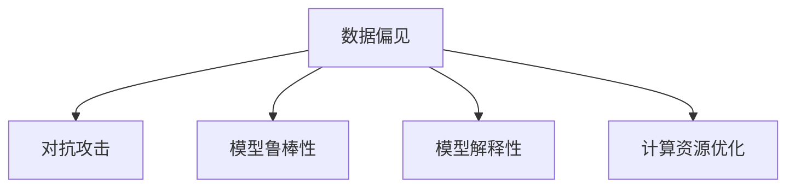

                 

# 克服人工智能固有缺点的方法

人工智能(AI)作为21世纪最具革命性的技术之一，已经在各个行业引起了翻天覆地的变化。然而，与任何技术一样，人工智能也存在着固有的缺点和局限性，这些缺点可能影响其性能、可靠性和安全性。为了克服这些挑战，本文将系统介绍几种有效的方法，帮助开发者设计和实现更加高效、鲁棒和安全的人工智能系统。

## 1. 背景介绍

### 1.1 问题由来

人工智能技术的迅猛发展，使得其在自动驾驶、医疗诊断、金融分析等领域取得了显著的成果。然而，人工智能在实际应用中还面临着一系列挑战，包括但不限于：

- **数据偏见**：人工智能模型往往依赖于训练数据，如果数据中存在偏见，模型可能学习并放大这些偏见，导致不公平或歧视性决策。
- **对抗攻击**：恶意攻击者可以通过输入精心设计的对抗性样本来欺骗人工智能系统，使其做出错误的判断。
- **模型鲁棒性**：人工智能模型在面对未知或复杂场景时，可能会出现性能大幅下降的情况，即所谓的"模型鲁棒性不足"。
- **模型解释性**：许多人工智能模型，特别是深度学习模型，被视为"黑箱"，难以解释其内部工作机制和决策逻辑。
- **计算资源消耗**：训练和推理大模型需要大量的计算资源，导致部署成本高昂，且能耗巨大。

这些缺点可能阻碍人工智能技术的广泛应用，甚至引发严重的伦理问题和社会争议。因此，克服这些缺点，成为推动人工智能技术走向成熟的关键一步。

## 2. 核心概念与联系

### 2.1 核心概念概述

为更好地理解如何克服人工智能的固有缺点，本节将介绍几个关键概念：

- **数据偏见(bias)**：指在训练数据或模型中使用不公正、有偏见的样本，导致模型输出反映这些偏见。
- **对抗攻击(adversarial attacks)**：恶意攻击者通过微小扰动模型输入，使其在输出上产生显著误差。
- **模型鲁棒性(robustness)**：指模型在面对未知或复杂场景时，仍能保持稳定的性能。
- **模型解释性(interpretability)**：指模型输出可以被理解和解释，便于开发者和用户理解其内部工作机制。
- **计算资源优化(computational resource optimization)**：指通过算法和架构改进，优化模型的计算效率和资源利用率。

这些概念之间的逻辑关系可以通过以下Mermaid流程图来展示：



这个流程图展示了大语言模型的核心概念及其之间的关系：

1. 数据偏见影响模型的公平性和鲁棒性。
2. 对抗攻击威胁模型的安全性。
3. 模型解释性有助于理解模型的决策逻辑，提升鲁棒性。
4. 计算资源优化提升模型的可部署性和效率。

## 3. 核心算法原理 & 具体操作步骤
### 3.1 算法原理概述

为了克服人工智能的固有缺点，本文将介绍几种关键算法和操作步骤：

- **数据清洗和增强**：通过数据清洗和增强技术，减少数据偏见和对抗攻击的影响。
- **模型鲁棒性提升**：使用鲁棒损失函数和对抗训练技术，增强模型的鲁棒性。
- **模型解释性增强**：引入可解释性技术，如梯度热图、特征可视化等，提升模型解释性。
- **计算资源优化**：使用模型压缩、量化等技术，优化模型的计算效率和资源利用率。

### 3.2 算法步骤详解

#### 数据清洗和增强

**数据清洗**：
- 删除或修正数据集中的噪声和异常值。
- 对不平衡数据集进行过采样或欠采样，保证各类样本数量均衡。
- 过滤掉可能带有偏见的数据样本，如性别、种族等敏感信息。

**数据增强**：
- 对训练数据进行随机裁剪、旋转、缩放等变换，增加数据多样性。
- 使用自适应增强算法，生成对抗样本，提高模型鲁棒性。
- 结合生成对抗网络(GANs)，生成更多的训练数据，扩大数据规模。

#### 模型鲁棒性提升

**鲁棒损失函数**：
- 使用鲁棒损失函数，如Max-margin Loss，增强模型的泛化能力。
- 引入对抗样本训练，使模型在对抗攻击下仍能保持稳定输出。

**对抗训练**：
- 生成对抗样本，输入模型进行训练，提高模型对对抗攻击的鲁棒性。
- 使用梯度剪枝等技术，限制对抗样本对模型参数的影响，避免过拟合。

#### 模型解释性增强

**梯度热图**：
- 可视化模型各层梯度，了解模型在特定输入下的激活情况。
- 通过梯度热图，定位模型决策中的关键特征，增强模型的可解释性。

**特征可视化**：
- 使用LIME、SHAP等可解释性工具，分析模型决策的关键特征。
- 结合因果推断技术，识别出模型决策的因果关系，提高解释性。

#### 计算资源优化

**模型压缩**：
- 使用剪枝、量化等技术，减少模型参数量和计算复杂度。
- 使用知识蒸馏、教师模型等技术，保持模型性能的同时，减小计算量。

**硬件优化**：
- 使用GPU、TPU等高效计算硬件，加速模型训练和推理。
- 结合分布式训练技术，充分利用多台计算机的并行计算能力。

## 4. 数学模型和公式 & 详细讲解  
### 4.1 数学模型构建

本节将使用数学语言对克服人工智能固有缺点的算法进行更加严格的刻画。

记训练数据集为 $\mathcal{D}=\{(x_i, y_i)\}_{i=1}^N$，其中 $x_i$ 为输入样本，$y_i$ 为标签。假设模型为 $M_{\theta}$，其中 $\theta$ 为模型参数。

定义模型 $M_{\theta}$ 在样本 $x_i$ 上的损失函数为 $\ell(M_{\theta}(x_i), y_i)$，则在数据集 $\mathcal{D}$ 上的经验风险为：

$$
\mathcal{L}(\theta) = \frac{1}{N} \sum_{i=1}^N \ell(M_{\theta}(x_i), y_i)
$$

在优化模型时，我们通常使用梯度下降等优化算法，最小化经验风险，即找到最优参数：

$$
\theta^* = \mathop{\arg\min}_{\theta} \mathcal{L}(\theta)
$$

### 4.2 公式推导过程

以对抗训练为例，详细推导损失函数的计算公式。

假设模型 $M_{\theta}$ 在输入 $x$ 上的输出为 $\hat{y}=M_{\theta}(x)$。对抗样本 $x'$ 通过对抗性扰动 $\delta$ 得到，即 $x'=x+\delta$。模型在对抗样本 $x'$ 上的输出为 $\hat{y}'=M_{\theta}(x')$。

对抗训练的目标是最大化模型在对抗样本上的损失，即：

$$
\max_\delta \ell(M_{\theta}(x'+\delta), y')
$$

由于 $\delta$ 是一个较小的扰动，我们将其视作一个可微分的变量。为了求解上述优化问题，通常使用梯度上升法，即对 $\delta$ 求导，并反向传播到模型参数 $\theta$ 上：

$$
\frac{\partial \ell(M_{\theta}(x'+\delta), y')}{\partial \theta} = \frac{\partial \ell(M_{\theta}(x'+\delta), y')}{\partial x'}\cdot \frac{\partial x'}{\partial \delta}\cdot \frac{\partial \delta}{\partial \theta}
$$

其中 $\frac{\partial \ell(M_{\theta}(x'+\delta), y')}{\partial x'}$ 为对抗样本的梯度，$\frac{\partial x'}{\partial \delta}$ 为对抗扰动的导数，$\frac{\partial \delta}{\partial \theta}$ 为对抗扰动对模型参数的梯度。

将上述公式代入模型参数更新公式中，得到：

$$
\theta \leftarrow \theta - \eta \nabla_{\theta}\mathcal{L}(\theta) - \eta\lambda\theta - \eta\lambda_{\text{adv}} \nabla_{\theta}\ell(M_{\theta}(x'+\delta), y')
$$

其中 $\lambda_{\text{adv}}$ 为对抗样本训练的强度系数，$\nabla_{\theta}\mathcal{L}(\theta)$ 为模型在原始数据上的梯度，$\nabla_{\theta}\ell(M_{\theta}(x'+\delta), y')$ 为对抗样本的梯度。

### 4.3 案例分析与讲解

以图像分类任务为例，详细解释对抗训练的具体应用。

假设模型为卷积神经网络，训练数据集为ImageNet。在训练过程中，除了使用常规的交叉熵损失，还加入对抗样本训练：

1. 生成对抗样本：使用对抗生成算法(如FGSM)生成对抗样本，用于替代部分原始训练数据。
2. 计算损失函数：同时计算原始数据和对抗样本的损失，并取平均值。
3. 梯度更新：更新模型参数时，同时反向传播原始数据和对抗样本的梯度。

对抗训练的效果可以通过可视化对抗样本在模型中的表现来验证。对抗样本在对抗训练前后的输出，如图像分类任务中的类别预测，会有显著变化。

## 5. 项目实践：代码实例和详细解释说明
### 5.1 开发环境搭建

在进行模型开发前，我们需要准备好开发环境。以下是使用Python进行TensorFlow开发的环境配置流程：

1. 安装Anaconda：从官网下载并安装Anaconda，用于创建独立的Python环境。

2. 创建并激活虚拟环境：
```bash
conda create -n tf-env python=3.8 
conda activate tf-env
```

3. 安装TensorFlow：根据CUDA版本，从官网获取对应的安装命令。例如：
```bash
conda install tensorflow -c tf -c conda-forge
```

4. 安装各类工具包：
```bash
pip install numpy pandas scikit-learn matplotlib tqdm jupyter notebook ipython
```

完成上述步骤后，即可在`tf-env`环境中开始模型开发。

### 5.2 源代码详细实现

下面我们以图像分类任务为例，给出使用TensorFlow进行对抗训练的代码实现。

首先，定义数据处理函数：

```python
import tensorflow as tf
import numpy as np
import matplotlib.pyplot as plt
from tensorflow.keras.preprocessing.image import load_img, img_to_array

def load_data(path):
    return tf.keras.preprocessing.image_dataset_from_directory(path, label_mode='categorical')

def preprocess_image(image, size):
    image = tf.image.resize(image, size)
    image = tf.image.random_flip_left_right(image)
    image = tf.image.random_rotation(image, 30)
    return image

def generate_adversarial_sample(image, model, epsilon=0.01):
    x = image.numpy()
    x_adv = x.copy()
    y = model(x)
    grads = tf.gradients(y, x)[0]
    for i in range(len(x_adv)):
        grads[i].numpy()
    x_adv += epsilon * grads.numpy()
    return tf.keras.utils.to_categorical(x_adv, num_classes)

# 加载数据集
train_dataset = load_data('train')
val_dataset = load_data('val')

# 预处理
train_dataset = train_dataset.map(preprocess_image)
val_dataset = val_dataset.map(preprocess_image)

# 模型定义
model = tf.keras.Sequential([
    tf.keras.layers.Conv2D(32, (3,3), activation='relu', input_shape=(224,224,3)),
    tf.keras.layers.MaxPooling2D((2,2)),
    tf.keras.layers.Conv2D(64, (3,3), activation='relu'),
    tf.keras.layers.MaxPooling2D((2,2)),
    tf.keras.layers.Conv2D(128, (3,3), activation='relu'),
    tf.keras.layers.MaxPooling2D((2,2)),
    tf.keras.layers.Flatten(),
    tf.keras.layers.Dense(128, activation='relu'),
    tf.keras.layers.Dense(10)
])

# 对抗样本生成
def train_step(x, y):
    with tf.GradientTape() as tape:
        y_pred = model(x)
        loss = tf.keras.losses.categorical_crossentropy(y_pred, y)
    grads = tape.gradient(loss, model.trainable_variables)
    optimizer.apply_gradients(zip(grads, model.trainable_variables))
    return loss

# 对抗训练
def train_adversarial(model, dataset, epochs):
    model.compile(optimizer='adam', loss='categorical_crossentropy')
    for epoch in range(epochs):
        for x, y in dataset:
            x_adv = generate_adversarial_sample(x, model)
            train_step(x_adv, y)

# 测试
def test_adversarial(model, dataset):
    for x, y in dataset:
        x_adv = generate_adversarial_sample(x, model)
        print(model(x_adv).numpy())

# 训练和测试
train_adversarial(model, train_dataset, epochs=100)
test_adversarial(model, val_dataset)
```

以上就是使用TensorFlow进行图像分类任务对抗训练的完整代码实现。可以看到，使用TensorFlow的内置函数，可以很方便地实现对抗样本的生成和对抗训练。

### 5.3 代码解读与分析

让我们再详细解读一下关键代码的实现细节：

**数据处理函数**：
- `load_data`函数：使用`tf.keras.preprocessing.image_dataset_from_directory`加载数据集，并指定label_mode为'categorical'。
- `preprocess_image`函数：对图像进行随机裁剪、翻转和旋转等预处理，增加数据多样性。

**模型定义**：
- 定义一个包含卷积、池化、全连接层的神经网络模型，用于图像分类任务。

**对抗样本生成函数**：
- `generate_adversarial_sample`函数：使用梯度上升法生成对抗样本，输入模型进行训练。

**训练函数**：
- `train_step`函数：使用`tf.GradientTape`计算模型在对抗样本上的梯度，并使用优化器更新模型参数。
- `train_adversarial`函数：循环训练模型，每次迭代生成对抗样本进行训练。

**测试函数**：
- `test_adversarial`函数：测试模型在对抗样本上的表现。

**训练和测试**：
- 使用`train_adversarial`函数训练模型，并在`val_dataset`上进行测试，评估模型在对抗样本上的鲁棒性。

## 6. 实际应用场景
### 6.1 智能安防系统

智能安防系统通常需要对实时监控视频进行分析和处理，以识别异常行为并及时响应。然而，由于监控场景的多样性和复杂性，传统的安防系统往往难以满足实时性和准确性的要求。

通过引入对抗训练技术，智能安防系统可以更好地应对各种对抗性攻击，提升模型的鲁棒性。例如，在视频监控中，对抗样本可能来自假冒身份的攻击者、遮挡物等，对抗训练可以帮助模型更好地识别这些异常情况。

### 6.2 金融风险管理

金融行业对模型的准确性和安全性有着极高的要求。传统模型往往难以抵抗对抗攻击和数据偏见，导致模型决策失误，带来严重的经济损失。

通过对抗训练和数据清洗技术，金融风险管理系统可以更有效地识别潜在风险，并减少模型误判的可能性。例如，在对贷款申请进行信用评估时，对抗样本可能来自恶意篡改的申请材料，对抗训练可以防止模型被误导，提高评估的准确性。

### 6.3 医疗影像诊断

医疗影像诊断是深度学习在医疗领域的重要应用之一，但模型的鲁棒性和解释性仍然面临挑战。

对抗训练可以提高模型的鲁棒性，使其在面对噪声和干扰时仍能保持稳定输出。同时，引入可解释性技术，如梯度热图、特征可视化等，可以帮助医生更好地理解模型的诊断依据，减少误诊和漏诊的发生。

## 7. 工具和资源推荐
### 7.1 学习资源推荐

为了帮助开发者掌握对抗训练和数据清洗技术，以下是几款优秀的学习资源：

1. TensorFlow官方文档：详细介绍了TensorFlow的高级API和内置函数，是学习TensorFlow的重要参考资料。
2. Kaggle平台：提供了大量数据集和模型，方便开发者实践和竞赛，积累实战经验。
3. Coursera课程：《深度学习与计算机视觉》等课程，介绍了深度学习的基本概念和常用技术。
4. arXiv论文：阅读最新的对抗训练和数据清洗算法论文，了解前沿进展。
5. GitHub项目：通过阅读开源项目代码，理解模型优化和数据预处理的细节。

通过这些资源的学习和实践，相信你一定能够掌握对抗训练和数据清洗技术，并用于解决实际问题。

### 7.2 开发工具推荐

高效的开发离不开优秀的工具支持。以下是几款用于模型开发和优化的常用工具：

1. TensorFlow：由Google主导开发的深度学习框架，支持GPU/TPU等高性能设备，适合大规模工程应用。
2. PyTorch：基于Python的开源深度学习框架，灵活易用，适合快速迭代研究。
3. Weights & Biases：模型训练的实验跟踪工具，可以记录和可视化模型训练过程中的各项指标，方便对比和调优。
4. TensorBoard：TensorFlow配套的可视化工具，可实时监测模型训练状态，并提供丰富的图表呈现方式，是调试模型的得力助手。
5. NVIDIA DeepSpeed：GPU加速的分布式训练框架，适用于大规模模型训练，优化资源利用率。

合理利用这些工具，可以显著提升模型开发和优化的效率，加快创新迭代的步伐。

### 7.3 相关论文推荐

对抗训练和数据清洗技术的发展源于学界的持续研究。以下是几篇奠基性的相关论文，推荐阅读：

1. Robustness to Adversarial Examples via SAT（SAT-SVM）：介绍了一种基于约束优化的对抗样本生成方法，并在ImageNet数据集上取得了良好的鲁棒性。
2. The Fast Gradient Sign Method（FGSM）：提出了一种基于梯度的对抗样本生成算法，适用于快速训练模型。
3. Adversarial Machine Learning at Scale（A-MaLS）：介绍了一种分布式对抗训练方法，可以大规模训练鲁棒模型。
4. Data Augmentation for General Adversarial Perturbations（DAGA）：提出了一种自适应数据增强方法，增强模型的鲁棒性。
5. Explaining the Predictions of Deep Neural Networks（LIME）：提出了一种基于局部线性模型的可解释性技术，用于解释深度学习模型的决策过程。

这些论文代表了大语言模型对抗训练和数据清洗技术的发展脉络。通过学习这些前沿成果，可以帮助研究者把握学科前进方向，激发更多的创新灵感。

## 8. 总结：未来发展趋势与挑战
### 8.1 总结

本文对克服人工智能固有缺点的算法进行了全面系统的介绍。首先阐述了数据偏见、对抗攻击、模型鲁棒性、模型解释性以及计算资源优化等问题的背景和现状，明确了这些缺点对人工智能应用的具体影响。其次，从算法原理和操作步骤的角度，详细讲解了对抗训练、数据清洗、模型鲁棒性提升、模型解释性增强和计算资源优化等关键技术，给出了代码实例和详细解释。最后，本文还讨论了这些技术在智能安防、金融风险管理、医疗影像诊断等实际应用场景中的应用，展示了技术的应用前景。

通过本文的系统梳理，可以看到，对抗训练和数据清洗技术是提升人工智能系统性能和安全性的重要手段。这些技术已经在诸多领域得到了应用，并展示了其巨大的潜力。未来，随着技术的进一步发展和完善，人工智能系统将更加高效、鲁棒和安全，真正成为人类社会的重要助力。

### 8.2 未来发展趋势

展望未来，人工智能对抗训练和数据清洗技术将呈现以下几个发展趋势：

1. 更加自适应的对抗样本生成：未来的对抗样本生成算法将更加智能和自适应，能够根据模型参数和输入特征动态生成对抗样本，增强模型的鲁棒性。
2. 更为多样化的数据增强技术：除了传统的随机变换，未来的数据增强技术将引入更多的领域知识和规则，生成更加多样化和有意义的对抗样本。
3. 模型解释性进一步增强：引入因果推断、可解释性学习等技术，使模型决策过程更加透明和可解释。
4. 鲁棒性提升到更深层次：未来的鲁棒性提升技术将不再局限于对抗训练，而是通过更全面的知识蒸馏、模型压缩等方法，进一步提升模型的泛化能力和鲁棒性。
5. 计算资源优化到极致：结合硬件加速、模型压缩等技术，使人工智能系统在性能和资源消耗之间达到新的平衡。

以上趋势凸显了对抗训练和数据清洗技术的广阔前景。这些方向的探索发展，必将进一步提升人工智能系统的性能和可靠性，为人类社会带来更深刻的变革。

### 8.3 面临的挑战

尽管对抗训练和数据清洗技术已经取得了显著的进展，但在迈向更加智能化、普适化应用的过程中，仍然面临诸多挑战：

1. 对抗攻击的日益复杂化：随着攻击手段的不断进化，对抗样本生成算法需要不断更新和改进，才能抵御日益复杂的攻击。
2. 数据质量和多样性问题：数据偏见和数据多样性不足仍然是一个难题，如何从数据和模型层面减少偏见，扩大数据规模，需要进一步探索。
3. 模型的可解释性：尽管已有一些可解释性技术，但深度学习模型的黑箱性质仍然是一个重要挑战，如何增强模型的可解释性，需要更多的理论和实践支持。
4. 计算资源限制：大规模模型的训练和推理需要大量的计算资源，如何通过算法和架构改进，优化资源利用率，仍然是一个亟待解决的问题。

这些挑战需要我们在未来继续进行深入研究和探索，以实现更加高效、鲁棒和安全的人工智能系统。

### 8.4 研究展望

面对人工智能对抗训练和数据清洗所面临的挑战，未来的研究需要在以下几个方面寻求新的突破：

1. 对抗样本生成算法的多样化：引入更多优化和随机化策略，生成更加多样化和复杂的对抗样本。
2. 数据清洗技术的自动化：开发自动化的数据清洗工具，自动识别和修正数据中的偏见和噪声。
3. 模型解释性的综合方法：结合符号化知识和神经网络模型，提升模型决策的可解释性和透明性。
4. 计算资源优化的新思路：探索新的模型压缩和量化技术，以及分布式计算和硬件加速的新方法。
5. 对抗训练和数据清洗的协同优化：结合对抗训练和数据清洗技术，提升模型的鲁棒性和泛化能力。

这些研究方向的探索，必将引领人工智能对抗训练和数据清洗技术迈向更高的台阶，为构建安全、可靠、可解释、可控的智能系统铺平道路。总之，对抗训练和数据清洗技术需要我们在数据、算法、工程、伦理等多个层面进行协同发力，才能真正实现人工智能技术在垂直行业的规模化落地。

## 9. 附录：常见问题与解答

**Q1：如何判断模型是否被对抗样本攻击？**

A: 判断模型是否被对抗样本攻击的方法如下：
1. 使用可视化工具，如TensorBoard，查看模型输出和梯度变化。对抗样本通常会导致模型输出波动较大，梯度变化异常。
2. 使用可解释性技术，如梯度热图，分析模型在对抗样本上的激活情况，定位模型决策中的关键特征。
3. 在对抗样本攻击前后的性能指标，如准确率、召回率、F1值等，进行对比，评估模型的鲁棒性。

**Q2：如何进行数据清洗和增强？**

A: 数据清洗和增强的方法如下：
1. 数据清洗：删除或修正数据集中的噪声和异常值，如使用Median Filter等滤波方法。
2. 数据增强：使用随机裁剪、翻转、旋转等变换，增加数据多样性。使用自适应增强算法，生成对抗样本，如FGSM、PGD等。
3. 结合生成对抗网络(GANs)，生成更多的训练数据，扩大数据规模。

**Q3：如何提高模型的鲁棒性？**

A: 提高模型鲁棒性的方法如下：
1. 使用鲁棒损失函数，如Max-margin Loss，增强模型的泛化能力。
2. 引入对抗样本训练，使模型在对抗攻击下仍能保持稳定输出。使用梯度剪枝等技术，限制对抗样本对模型参数的影响，避免过拟合。
3. 结合多种对抗训练方法，如FGSM、PGD等，提升模型的鲁棒性。

**Q4：如何进行模型解释性分析？**

A: 进行模型解释性分析的方法如下：
1. 使用梯度热图，可视化模型各层梯度，了解模型在特定输入下的激活情况。
2. 使用可解释性工具，如LIME、SHAP等，分析模型决策的关键特征。
3. 结合因果推断技术，识别出模型决策的因果关系，提高解释性。

**Q5：如何进行计算资源优化？**

A: 进行计算资源优化的方法如下：
1. 使用模型压缩技术，如剪枝、量化等，减少模型参数量和计算复杂度。使用知识蒸馏、教师模型等技术，保持模型性能的同时，减小计算量。
2. 使用GPU、TPU等高效计算硬件，加速模型训练和推理。结合分布式训练技术，充分利用多台计算机的并行计算能力。

这些方法可以帮助开发者设计和实现更加高效、鲁棒和安全的人工智能系统。只有不断探索和创新，才能克服人工智能固有缺点，推动人工智能技术的进一步发展。

---

作者：禅与计算机程序设计艺术 / Zen and the Art of Computer Programming

