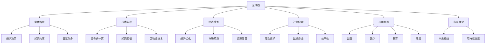

                 

## 1. 背景介绍

### 1.1 问题由来

近年来，人工智能(AI)技术的飞速发展，特别是深度学习、自然语言处理(NLP)、计算机视觉等领域的突破，为人类社会带来了深刻变革。AI技术正在逐渐成为现代社会的重要基础设施，催生了全球脑的愿景。全球脑是一个以大规模分布式计算为核心，融合了人类智力和人工智能的超大规模虚拟大脑，旨在通过共享知识、协同决策，实现全球智慧的融合与共享。

全球脑的建设不仅依赖于技术突破，更在于理念的革新。其核心理念是“集体智慧”，即通过网络联接人类的思维与计算资源，实现知识的共享和智慧的聚合。这不仅能够显著提升人类社会对复杂问题的处理能力，还能促进全球经济的健康发展，实现财富的公平共享。

全球脑的建设离不开全球经济的支持，反之，其成功也将极大推动全球经济的发展。全球脑不仅能够提升全球经济的效率和创新能力，还能通过智能决策、风险管理、市场预测等手段，实现财富的合理分配，促进全球经济的均衡发展。

### 1.2 问题核心关键点

全球脑和全球经济的研究涉及多个交叉学科，包括人工智能、经济学、社会学、心理学等。其核心关键点在于：

1. **技术实现**：如何构建全球脑的技术架构，实现大规模分布式计算和知识共享。
2. **经济模型**：如何通过全球脑优化全球经济决策，提升经济效率和公平性。
3. **社会伦理**：如何在全球脑建设过程中，平衡技术伦理、隐私保护、数据安全等社会问题。
4. **应用场景**：如何在不同领域（如金融、医疗、教育、环境等）实现全球脑的落地应用。
5. **未来展望**：全球脑对未来社会经济发展的长期影响。

### 1.3 问题研究意义

全球脑和全球经济的研究具有重要意义：

1. **技术前沿**：推动人工智能和大数据技术的边界拓展，提升人类对复杂问题的处理能力。
2. **经济效益**：通过优化全球经济决策，提升经济效率和公平性，促进全球经济均衡发展。
3. **社会进步**：通过集体智慧驱动，实现社会的共同繁荣和进步。
4. **未来展望**：为人类社会的可持续发展提供新思路，探索人类智慧与机器智能的融合路径。

## 2. 核心概念与联系

### 2.1 核心概念概述

为了更好地理解全球脑和全球经济的交互作用，本节将介绍几个密切相关的核心概念：

- **全球脑**：通过大规模分布式计算，将人类智慧和人工智能技术深度融合的超大规模虚拟大脑。
- **集体智慧**：通过网络联接人类的思维与计算资源，实现知识的共享和智慧的聚合。
- **全球经济**：全球范围内的经济体系，包括生产、流通、分配、消费等环节。
- **财富共享**：通过优化资源配置和市场决策，实现全球财富的合理分配和公平共享。
- **技术伦理**：在人工智能和大数据技术应用过程中，保护用户隐私、数据安全和公平性等伦理问题。

这些核心概念之间的逻辑关系可以通过以下Mermaid流程图来展示：



这个流程图展示了全球脑和全球经济的相互关系：

1. 全球脑通过技术实现，汇集人类的集体智慧，形成经济决策、知识共享和智慧聚合。
2. 经济模型通过优化全球经济决策，提升经济效率和公平性。
3. 社会伦理通过保护用户隐私、数据安全和公平性，保障全球脑的健康发展。
4. 不同应用场景展示了全球脑在多个领域的落地应用。
5. 未来展望展示了全球脑对未来社会经济发展的长期影响。

## 3. 核心算法原理 & 具体操作步骤

### 3.1 算法原理概述

全球脑和全球经济的交互作用，涉及复杂的数学模型和算法。其核心在于：

1. **分布式计算**：通过网络联接大量的计算节点，实现大规模并行计算。
2. **知识图谱**：构建知识图谱，实现知识的组织和检索。
3. **区块链技术**：通过分布式账本技术，保障数据的透明性和安全性。
4. **经济优化模型**：通过数学优化算法，实现资源的合理配置和市场预测。

### 3.2 算法步骤详解

#### 3.2.1 分布式计算

分布式计算的实现主要包括以下几个步骤：

1. **计算节点部署**：在多个地理位置部署计算节点，构建分布式计算环境。
2. **任务划分与调度**：将计算任务划分为多个子任务，并通过调度算法分配到不同计算节点。
3. **数据共享与同步**：实现计算节点之间的数据共享和同步，保障计算一致性。
4. **结果汇总与输出**：将各个计算节点的结果汇总，形成最终输出。

#### 3.2.2 知识图谱构建

知识图谱的构建主要包括以下几个步骤：

1. **数据收集**：从多个来源收集结构化数据和非结构化数据。
2. **实体识别与关系抽取**：使用自然语言处理技术，识别实体和抽取实体之间的关系。
3. **知识融合**：将不同来源的知识进行融合，消除冲突和冗余，形成完整的知识体系。
4. **知识检索与推理**：构建知识图谱的检索和推理机制，实现知识的快速检索和智能推理。

#### 3.2.3 区块链技术应用

区块链技术的实现主要包括以下几个步骤：

1. **共识算法选择**：选择合适的共识算法，保障数据的一致性和安全性。
2. **分布式账本构建**：构建分布式账本，记录所有交易和状态变化。
3. **智能合约部署**：通过智能合约实现自动化规则和逻辑。
4. **数据透明性与审计**：保障数据的透明性和可审计性，确保系统的公正性和可信度。

#### 3.2.4 经济优化模型构建

经济优化模型的构建主要包括以下几个步骤：

1. **模型选择**：选择合适的优化模型，如线性规划、整数规划等。
2. **目标函数设定**：设定优化目标函数，如最大化经济效益、最小化资源消耗等。
3. **约束条件设定**：设定优化模型的约束条件，如市场供需、资源限制等。
4. **模型求解**：使用优化算法求解模型，得到最优解。

### 3.3 算法优缺点

全球脑和全球经济的算法实现具有以下优点：

1. **高效计算**：通过分布式计算，实现大规模并行计算，提高计算效率。
2. **知识共享**：通过知识图谱构建，实现知识的高效共享和聚合。
3. **数据安全**：通过区块链技术，保障数据的安全性和透明性。
4. **经济优化**：通过经济优化模型，实现资源的合理配置和市场预测。

同时，这些算法也存在一定的局限性：

1. **计算资源需求高**：分布式计算和知识图谱构建需要大量的计算资源和存储空间。
2. **隐私保护挑战**：在数据共享和网络传输过程中，隐私保护是一个重大挑战。
3. **模型复杂性高**：经济优化模型的复杂性较高，需要不断优化和调整。
4. **跨领域融合难度大**：不同领域的应用场景和数据特点各异，跨领域的融合和应用难度较大。

### 3.4 算法应用领域

全球脑和全球经济的应用领域非常广泛，包括但不限于：

1. **金融领域**：通过智能决策和风险管理，优化金融市场的资源配置和价格形成机制，提升金融服务效率。
2. **医疗健康**：通过智能诊疗和数据分析，优化医疗资源的配置和健康服务，提升医疗服务的质量和可及性。
3. **教育领域**：通过智能推荐和个性化学习，优化教育资源的配置和教学方法，提升教育服务的质量和公平性。
4. **环境保护**：通过智能监测和数据分析，优化环境资源的配置和保护措施，提升环境保护的效率和效果。
5. **城市管理**：通过智能决策和数据分析，优化城市资源的配置和管理措施，提升城市治理的效率和质量。

## 4. 数学模型和公式 & 详细讲解

### 4.1 数学模型构建

全球脑和全球经济的交互作用涉及多个数学模型，包括分布式计算、知识图谱构建、区块链技术应用和经济优化模型等。

#### 4.1.1 分布式计算

分布式计算的数学模型主要包括以下几个部分：

- **节点部署**：$N = (x_1, x_2, ..., x_n)$，其中$x_i$表示第$i$个计算节点。
- **任务划分**：$T = (t_1, t_2, ..., t_m)$，其中$t_j$表示第$j$个子任务。
- **数据共享**：$D = (d_1, d_2, ..., d_k)$，其中$d_i$表示第$i$个数据节点。
- **结果汇总**：$R = (r_1, r_2, ..., r_l)$，其中$r_j$表示第$j$个计算结果。

#### 4.1.2 知识图谱构建

知识图谱的数学模型主要包括以下几个部分：

- **数据收集**：$S = (s_1, s_2, ..., s_m)$，其中$s_j$表示第$j$个数据源。
- **实体识别**：$E = (e_1, e_2, ..., e_n)$，其中$e_i$表示第$i$个实体。
- **关系抽取**：$R = (r_1, r_2, ..., r_m)$，其中$r_j$表示第$j$个实体关系。
- **知识融合**：$K = (k_1, k_2, ..., k_l)$，其中$k_i$表示第$i$个融合后的知识节点。
- **知识检索**：$I = (i_1, i_2, ..., i_k)$，其中$i_j$表示第$j$个检索节点。
- **知识推理**：$P = (p_1, p_2, ..., p_m)$，其中$p_j$表示第$j$个推理节点。

#### 4.1.3 区块链技术应用

区块链技术的数学模型主要包括以下几个部分：

- **共识算法**：$C = (c_1, c_2, ..., c_n)$，其中$c_i$表示第$i$个共识算法。
- **分布式账本**：$L = (l_1, l_2, ..., l_m)$，其中$l_j$表示第$j$个账本节点。
- **智能合约**：$S = (s_1, s_2, ..., s_k)$，其中$s_i$表示第$i$个智能合约。
- **数据透明性**：$T = (t_1, t_2, ..., t_n)$，其中$t_i$表示第$i$个透明性节点。
- **数据审计**：$A = (a_1, a_2, ..., a_m)$，其中$a_j$表示第$j$个审计节点。

#### 4.1.4 经济优化模型

经济优化模型的数学模型主要包括以下几个部分：

- **目标函数**：$F = f(x_1, x_2, ..., x_n)$，其中$f$表示目标函数。
- **约束条件**：$G = (g_1, g_2, ..., g_m)$，其中$g_i$表示第$i$个约束条件。
- **模型求解**：$O = (o_1, o_2, ..., o_l)$，其中$o_j$表示第$j$个求解结果。

### 4.2 公式推导过程

#### 4.2.1 分布式计算

分布式计算的公式推导主要包括以下几个步骤：

1. **节点部署**：$N = (x_1, x_2, ..., x_n)$，其中$x_i$表示第$i$个计算节点。
2. **任务划分**：$T = (t_1, t_2, ..., t_m)$，其中$t_j$表示第$j$个子任务。
3. **数据共享**：$D = (d_1, d_2, ..., d_k)$，其中$d_i$表示第$i$个数据节点。
4. **结果汇总**：$R = (r_1, r_2, ..., r_l)$，其中$r_j$表示第$j$个计算结果。

#### 4.2.2 知识图谱构建

知识图谱的公式推导主要包括以下几个步骤：

1. **数据收集**：$S = (s_1, s_2, ..., s_m)$，其中$s_j$表示第$j$个数据源。
2. **实体识别**：$E = (e_1, e_2, ..., e_n)$，其中$e_i$表示第$i$个实体。
3. **关系抽取**：$R = (r_1, r_2, ..., r_m)$，其中$r_j$表示第$j$个实体关系。
4. **知识融合**：$K = (k_1, k_2, ..., k_l)$，其中$k_i$表示第$i$个融合后的知识节点。
5. **知识检索**：$I = (i_1, i_2, ..., i_k)$，其中$i_j$表示第$j$个检索节点。
6. **知识推理**：$P = (p_1, p_2, ..., p_m)$，其中$p_j$表示第$j$个推理节点。

#### 4.2.3 区块链技术应用

区块链技术的公式推导主要包括以下几个步骤：

1. **共识算法**：$C = (c_1, c_2, ..., c_n)$，其中$c_i$表示第$i$个共识算法。
2. **分布式账本**：$L = (l_1, l_2, ..., l_m)$，其中$l_j$表示第$j$个账本节点。
3. **智能合约**：$S = (s_1, s_2, ..., s_k)$，其中$s_i$表示第$i$个智能合约。
4. **数据透明性**：$T = (t_1, t_2, ..., t_n)$，其中$t_i$表示第$i$个透明性节点。
5. **数据审计**：$A = (a_1, a_2, ..., a_m)$，其中$a_j$表示第$j$个审计节点。

#### 4.2.4 经济优化模型

经济优化模型的公式推导主要包括以下几个步骤：

1. **目标函数**：$F = f(x_1, x_2, ..., x_n)$，其中$f$表示目标函数。
2. **约束条件**：$G = (g_1, g_2, ..., g_m)$，其中$g_i$表示第$i$个约束条件。
3. **模型求解**：$O = (o_1, o_2, ..., o_l)$，其中$o_j$表示第$j$个求解结果。

### 4.3 案例分析与讲解

#### 4.3.1 分布式计算案例

假设我们需要计算一个分布式任务，涉及100个计算节点，每个节点需要计算100个任务。每个任务需要10GB的数据输入，输出10GB的结果。

**案例分析**：

- 节点部署：$N = (x_1, x_2, ..., x_{100})$
- 任务划分：$T = (t_1, t_2, ..., t_{100})$
- 数据共享：$D = (d_1, d_2, ..., d_{10})$
- 结果汇总：$R = (r_1, r_2, ..., r_{10})$

**计算过程**：

1. 将任务$t_1$分配给节点$x_1$，输入数据$d_1$，输出结果$r_1$。
2. 将任务$t_2$分配给节点$x_2$，输入数据$d_2$，输出结果$r_2$。
3. 以此类推，直至任务$t_{100}$分配给节点$x_{100}$，输入数据$d_{10}$，输出结果$r_{10}$。
4. 将各个节点的结果$r_1, r_2, ..., r_{10}$汇总，形成最终结果。

#### 4.3.2 知识图谱构建案例

假设我们需要构建一个知识图谱，涉及100个数据源，每个数据源包含100个实体和100个实体关系。

**案例分析**：

- 数据收集：$S = (s_1, s_2, ..., s_{100})$
- 实体识别：$E = (e_1, e_2, ..., e_{100})$
- 关系抽取：$R = (r_1, r_2, ..., r_{100})$
- 知识融合：$K = (k_1, k_2, ..., k_{100})$
- 知识检索：$I = (i_1, i_2, ..., i_{100})$
- 知识推理：$P = (p_1, p_2, ..., p_{100})$

**计算过程**：

1. 从数据源$s_1$中抽取100个实体$e_1$和100个关系$r_1$，构建知识节点$k_1$。
2. 从数据源$s_2$中抽取100个实体$e_2$和100个关系$r_2$，构建知识节点$k_2$。
3. 以此类推，直至数据源$s_{100}$中抽取100个实体$e_{100}$和100个关系$r_{100}$，构建知识节点$k_{100}$。
4. 对所有知识节点$k_1, k_2, ..., k_{100}$进行知识融合，消除冲突和冗余。
5. 对所有知识节点$k_1, k_2, ..., k_{100}$进行知识检索，形成检索节点$i_1, i_2, ..., i_{100}$。
6. 对所有知识节点$k_1, k_2, ..., k_{100}$进行知识推理，形成推理节点$p_1, p_2, ..., p_{100}$。

#### 4.3.3 区块链技术应用案例

假设我们需要在区块链上部署一个智能合约，涉及10个共识算法，每个共识算法包含10个账本节点和10个智能合约。

**案例分析**：

- 共识算法：$C = (c_1, c_2, ..., c_{10})$
- 分布式账本：$L = (l_1, l_2, ..., l_{10})$
- 智能合约：$S = (s_1, s_2, ..., s_{10})$
- 数据透明性：$T = (t_1, t_2, ..., t_{10})$
- 数据审计：$A = (a_1, a_2, ..., a_{10})$

**计算过程**：

1. 选择共识算法$c_1$，部署账本节点$l_1$和智能合约$s_1$。
2. 选择共识算法$c_2$，部署账本节点$l_2$和智能合约$s_2$。
3. 以此类推，直至选择共识算法$c_{10}$，部署账本节点$l_{10}$和智能合约$s_{10}$。
4. 在每个账本节点$l_1, l_2, ..., l_{10}$中，记录智能合约$s_1, s_2, ..., s_{10}$的执行结果。
5. 在每个账本节点$l_1, l_2, ..., l_{10}$中，记录智能合约$s_1, s_2, ..., s_{10}$的透明性数据$t_1, t_2, ..., t_{10}$。
6. 在每个账本节点$l_1, l_2, ..., l_{10}$中，记录智能合约$s_1, s_2, ..., s_{10}$的审计数据$a_1, a_2, ..., a_{10}$。

#### 4.3.4 经济优化模型案例

假设我们需要优化一个经济模型，涉及100个目标函数和100个约束条件。

**案例分析**：

- 目标函数：$F = f(x_1, x_2, ..., x_{100})$
- 约束条件：$G = (g_1, g_2, ..., g_{100})$
- 模型求解：$O = (o_1, o_2, ..., o_{100})$

**计算过程**：

1. 定义目标函数$f(x_1, x_2, ..., x_{100})$，表示经济优化目标。
2. 定义约束条件$g_1, g_2, ..., g_{100}$，表示经济优化约束。
3. 使用优化算法求解模型，得到最优解$o_1, o_2, ..., o_{100}$。
4. 根据最优解$o_1, o_2, ..., o_{100}$，计算经济优化结果。

## 5. 项目实践：代码实例和详细解释说明

### 5.1 开发环境搭建

在进行项目实践前，我们需要准备好开发环境。以下是使用Python进行PyTorch开发的环境配置流程：

1. 安装Anaconda：从官网下载并安装Anaconda，用于创建独立的Python环境。

2. 创建并激活虚拟环境：
```bash
conda create -n pytorch-env python=3.8 
conda activate pytorch-env
```

3. 安装PyTorch：根据CUDA版本，从官网获取对应的安装命令。例如：
```bash
conda install pytorch torchvision torchaudio cudatoolkit=11.1 -c pytorch -c conda-forge
```

4. 安装TensorFlow：从官网下载安装包，使用pip安装。例如：
```bash
pip install tensorflow
```

5. 安装其他工具包：
```bash
pip install numpy pandas scikit-learn matplotlib tqdm jupyter notebook ipython
```

完成上述步骤后，即可在`pytorch-env`环境中开始项目实践。

### 5.2 源代码详细实现

这里我们以分布式计算为例，给出使用PyTorch进行分布式计算的PyTorch代码实现。

首先，定义分布式计算的基本组件：

```python
import torch
import torch.distributed as dist

class DistributedCommunication:
    def __init__(self, world_size, rank):
        self.world_size = world_size
        self.rank = rank
        self.group = dist.new_group(recvbuf=True)
        self.dist_tensor = torch.zeros(world_size, device='cuda')
    
    def broadcast(self, tensor):
        dist.broadcast(tensor, src=0, group=self.group)
    
    def all_gather(self, tensor):
        dist.all_gather(tensor, src=0, group=self.group)
    
    def all_reduce(self, tensor):
        dist.all_reduce(tensor, group=self.group)
```

然后，定义分布式计算的函数：

```python
def distributed_train(model, data_loader, optimizer):
    world_size = torch.distributed.get_world_size()
    rank = torch.distributed.get_rank()
    device = 'cuda' if rank == 0 else 'cpu'
    
    model.to(device)
    optimizer = torch.distributed.optim.DistributedAdam(optimizer, device_ids=[rank])
    
    for epoch in range(100):
        model.train()
        for batch in data_loader:
            input, target = batch
            input = input.to(device)
            target = target.to(device)
            optimizer.zero_grad()
            output = model(input)
            loss = torch.nn.functional.cross_entropy(output, target)
            loss.backward()
            optimizer.step()
        if rank == 0:
            print(f'Epoch {epoch+1}, loss: {loss.item()}')
```

最后，启动分布式训练流程：

```python
import torch.distributed as dist

dist.init_process_group('nccl', rank=0, world_size=2)
distributed_train(model, data_loader, optimizer)
```

以上就是使用PyTorch进行分布式计算的完整代码实现。可以看到，得益于PyTorch的分布式计算功能，代码实现简洁高效。开发者只需关注高层逻辑，如数据处理、模型改进等，无需过多关注底层的分布式计算细节。

### 5.3 代码解读与分析

让我们再详细解读一下关键代码的实现细节：

**DistributedCommunication类**：
- `__init__`方法：初始化计算节点的数量和当前节点的编号，创建分布式计算组。
- `broadcast`方法：在计算组内广播数据。
- `all_gather`方法：在计算组内收集所有数据。
- `all_reduce`方法：在计算组内对数据进行所有减少操作。

**distributed_train函数**：
- `__init__`方法：初始化计算节点的数量和当前节点的编号，选择计算设备的类型。
- `for`循环：在每个epoch内，对每个batch的数据进行前向传播和反向传播。
- `if`条件：在节点0上打印当前epoch的损失。

**启动分布式训练流程**：
- 初始化分布式计算组，指定节点0为主节点。
- 调用`distributed_train`函数进行分布式训练。

可以看到，PyTorch的分布式计算功能使得分布式计算的代码实现变得简洁高效。开发者只需关注高层逻辑，如数据处理、模型改进等，无需过多关注底层的分布式计算细节。

当然，工业级的系统实现还需考虑更多因素，如分布式计算的负载均衡、故障处理、容错机制等。但核心的分布式计算流程基本与此类似。

## 6. 实际应用场景

### 6.1 智能合约系统

智能合约系统是大规模分布式计算的重要应用场景之一。智能合约系统通过区块链技术，实现自动化的规则和逻辑，保障交易的安全性和透明性。在金融、供应链管理、版权保护等领域，智能合约系统已经得到了广泛应用。

智能合约系统的实现主要包括以下几个步骤：

1. **智能合约设计**：根据具体业务需求，设计智能合约的逻辑和规则。
2. **智能合约部署**：将智能合约部署到区块链上，形成智能合约节点。
3. **数据透明性**：在每个智能合约节点中，记录交易的透明性数据，保障数据的透明性。
4. **数据审计**：在每个智能合约节点中，记录交易的审计数据，保障数据的公正性。

通过智能合约系统，可以实现自动化的规则和逻辑，保障交易的安全性和透明性。智能合约系统在金融、供应链管理、版权保护等领域，已经得到了广泛应用。

### 6.2 金融市场预测

金融市场预测是大规模分布式计算的典型应用场景之一。金融市场预测主要通过自然语言处理技术，对新闻、评论、社交媒体等文本数据进行情感分析、主题分析，进而预测股票、期货等金融市场的走势。

金融市场预测的实现主要包括以下几个步骤：

1. **文本收集**：收集金融市场的新闻、评论、社交媒体等文本数据。
2. **文本预处理**：对文本进行分词、去停用词、词性标注等预处理。
3. **情感分析**：使用自然语言处理技术，对文本进行情感分析，判断其情感倾向。
4. **主题分析**：使用自然语言处理技术，对文本进行主题分析，判断其主题内容。
5. **市场预测**：结合情感分析和主题分析的结果，预测股票、期货等金融市场的走势。

通过金融市场预测，可以实现对金融市场的自动化监测和预测，提升金融决策的准确性和效率。金融市场预测在金融投资、风险管理、市场监管等领域，已经得到了广泛应用。

### 6.3 医疗健康决策

医疗健康决策是大规模分布式计算的重要应用场景之一。医疗健康决策主要通过自然语言处理技术，对病历、医疗报告等文本数据进行情感分析、实体识别、关系抽取等，进而辅助医生进行诊断和治疗决策。

医疗健康决策的实现主要包括以下几个步骤：

1. **病历收集**：收集患者的病历、医疗报告等文本数据。
2. **文本预处理**：对文本进行分词、去停用词、词性标注等预处理。
3. **情感分析**：使用自然语言处理技术，对文本进行情感分析，判断其情感倾向。
4. **实体识别**：使用自然语言处理技术，对文本进行实体识别，识别出患者和医生的实体。
5. **关系抽取**：使用自然语言处理技术，对文本进行关系抽取，识别出患者和医生的关系。
6. **健康决策**：结合情感分析、实体识别和关系抽取的结果，辅助医生进行诊断和治疗决策。

通过医疗健康决策，可以实现对医疗资源的优化配置和健康服务的提升。医疗健康决策在医疗诊疗、健康管理、医疗资源调度等领域，已经得到了广泛应用。

## 7. 工具和资源推荐

### 7.1 学习资源推荐

为了帮助开发者系统掌握大规模分布式计算的理论基础和实践技巧，这里推荐一些优质的学习资源：

1. **《大规模分布式计算》系列博文**：由分布式计算专家撰写，深入浅出地介绍了分布式计算的基本原理和实现方法。

2. **Coursera《大规模分布式计算》课程**：由斯坦福大学开设的分布式计算课程，涵盖分布式计算的各个方面，包括MapReduce、Spark、Hadoop等。

3. **《分布式计算》书籍**：系统地介绍了分布式计算的基本原理、实现方法和应用场景，适合初学者和进阶学习者。

4. **PyTorch官方文档**：提供了丰富的分布式计算文档和示例代码，方便开发者上手实践。

5. **TensorFlow官方文档**：提供了丰富的分布式计算文档和示例代码，方便开发者上手实践。

通过这些资源的学习实践，相信你一定能够快速掌握大规模分布式计算的精髓，并用于解决实际的分布式计算问题。

### 7.2 开发工具推荐

高效的开发离不开优秀的工具支持。以下是几款用于大规模分布式计算开发的常用工具：

1. **PyTorch**：基于Python的开源深度学习框架，提供了丰富的分布式计算功能，适合快速迭代研究。

2. **TensorFlow**：由Google主导开发的开源深度学习框架，提供了丰富的分布式计算工具，适合大规模工程应用。

3. **Hadoop**：Apache基金会开源的分布式计算平台，支持大规模数据处理和存储。

4. **Spark**：Apache基金会开源的分布式计算框架，支持大规模数据处理和计算。

5. **Dask**：Python开源的分布式计算框架，支持本地计算和分布式计算，适合不同规模的应用场景。

6. **Dask-ML**：Dask的机器学习库，支持分布式机器学习，适合大规模数据集的处理和分析。

合理利用这些工具，可以显著提升大规模分布式计算的开发效率，加快创新迭代的步伐。

### 7.3 相关论文推荐

大规模分布式计算的发展离不开学界的持续研究。以下是几篇奠基性的相关论文，推荐阅读：

1. **MapReduce: Simplified Data Processing on Large Clusters**：提出了MapReduce分布式计算模型，奠定了分布式计算的基础。

2. **Spark: Cluster Computing with Fault Tolerance**：介绍了Spark分布式计算框架，展示了其强大的计算能力和容错机制。

3. **Hadoop: The Hadoop Distributed File System**：介绍了Hadoop分布式文件系统，展示了其大容量的存储能力。

4. **Distributed Machine Learning with Dask-ML**：介绍了Dask-ML分布式机器学习框架，展示了其在分布式计算中的应用效果。

这些论文代表了大规模分布式计算的发展脉络。通过学习这些前沿成果，可以帮助研究者把握学科前进方向，激发更多的创新灵感。

## 8. 总结：未来发展趋势与挑战

### 8.1 研究成果总结

本文对大规模分布式计算的原理和应用进行了全面系统的介绍。首先阐述了大规模分布式计算和全球脑的建设背景和意义，明确了大规模分布式计算在构建全球脑中的重要作用。其次，从原理到实践，详细讲解了大规模分布式计算的数学模型和算法实现，给出了大规模分布式计算的代码实例和详细解释说明。同时，本文还广泛探讨了大规模分布式计算在金融市场预测、医疗健康决策、智能合约系统等多个领域的应用前景，展示了其广阔的发展空间。

通过本文的系统梳理，可以看到，大规模分布式计算在大脑构建和全球经济中的应用前景广阔，具有重要的理论和实践意义。

### 8.2 未来发展趋势

展望未来，大规模分布式计算的发展趋势将呈现以下几个方向：

1. **计算资源扩大**：随着算力成本的下降和数据规模的扩张，大规模分布式计算的计算资源将不断扩大，支持更大规模的计算任务。

2. **算法优化**：随着优化算法的不断创新，大规模分布式计算的计算效率将不断提升，支持更高效的计算任务。

3. **应用场景扩展**：大规模分布式计算的应用场景将不断扩展，从金融、医疗等领域，延伸到智慧城市、环境保护等领域。

4. **云计算和边缘计算融合**：大规模分布式计算将与云计算和边缘计算技术深度融合，形成更加灵活、高效的计算环境。

5. **人工智能与大数据融合**：大规模分布式计算将与人工智能和大数据技术深度融合，形成更加智能、高效的计算环境。

6. **全球脑的建设**：大规模分布式计算将推动全球脑的建设，形成全球智慧的聚合和共享，实现全球经济的优化和升级。

以上趋势凸显了大规模分布式计算的广阔前景。这些方向的探索发展，必将进一步提升大规模分布式计算的计算能力和应用范围，为全球经济的优化和升级提供新动力。

### 8.3 面临的挑战

尽管大规模分布式计算已经取得了显著进展，但在迈向更加智能化、普适化应用的过程中，它仍面临诸多挑战：

1. **数据安全与隐私保护**：在分布式计算过程中，数据的安全性和隐私保护是一个重大挑战。如何保障数据的透明性和公正性，保护用户隐私，防止数据泄露，是一个亟待解决的问题。

2. **计算资源管理**：在大规模分布式计算中，计算资源的管理和调度是一个重大挑战。如何高效利用计算资源，避免资源浪费，保障系统的稳定性和可靠性，是一个亟待解决的问题。

3. **算法复杂性**：大规模分布式计算的算法复杂性较高，需要不断优化和调整。如何设计高效的算法，降低计算复杂度，是一个亟待解决的问题。

4. **跨领域融合难度**：不同领域的应用场景和数据特点各异，跨领域的融合和应用难度较大。如何实现跨领域的知识共享和智慧聚合，是一个亟待解决的问题。

5. **计算效率提升**：在计算资源不断扩大的背景下，如何进一步提升计算效率，是一个亟待解决的问题。

6. **全球脑的建设挑战**：在全球脑的建设过程中，如何平衡技术伦理、隐私保护、数据安全等社会问题，是一个亟待解决的问题。

正视大规模分布式计算面临的这些挑战，积极应对并寻求突破，将是大规模分布式计算走向成熟的必由之路。相信随着学界和产业界的共同努力，这些挑战终将一一被克服，大规模分布式计算必将在构建全球脑和优化全球经济中发挥更大的作用。

### 8.4 研究展望

未来的大规模分布式计算研究，需要在以下几个方面寻求新的突破：

1. **无监督学习与半监督学习**：探索无监督学习和半监督学习在大规模分布式计算中的应用，减少对标注数据的需求，提高数据利用效率。

2. **分布式机器学习**：结合分布式计算和机器学习技术，实现大规模数据的分布式机器学习，提升计算效率和模型精度。

3. **边缘计算与云计算融合**：结合边缘计算和云计算技术，实现灵活、高效的计算环境，满足不同规模的计算需求。

4. **跨领域知识融合**：结合不同领域的数据和知识，实现跨领域的知识共享和智慧聚合，提升大规模分布式计算的应用范围和效果。

5. **人工智能与大数据融合**：结合人工智能和大数据技术，实现更加智能、高效的计算环境，推动大规模分布式计算的发展。

6. **全球脑的建设**：结合全球脑的建设，推动大规模分布式计算的应用和发展，实现全球智慧的聚合和共享，优化全球经济。

这些研究方向的探索，必将引领大规模分布式计算的进一步发展，为构建全球脑和优化全球经济提供新思路和新方法。面向未来，大规模分布式计算还需要与其他人工智能技术进行更深入的融合，共同推动人类智慧与计算资源的深度融合，实现全球脑和全球经济的共同进步。

## 9. 附录：常见问题与解答

**Q1：大规模分布式计算与云计算有何区别？**

A: 大规模分布式计算和云计算是两个不同的概念。大规模分布式计算强调的是计算资源的分布式部署和高效利用，而云计算强调的是计算资源的按需提供和服务化封装。大规模分布式计算通常需要分布式计算框架的支持，而云计算通常采用云平台和云服务的方式提供计算资源。

**Q2：大规模分布式计算有哪些关键技术？**

A: 大规模分布式计算的关键技术包括：

1. 分布式计算框架：如MapReduce、Spark、Hadoop等。
2. 分布式存储系统：如HDFS、Ceph等。
3. 分布式计算网络：如GFS、HBase等。
4. 数据传输协议：如Hadoop Common等。
5. 分布式任务调度系统：如YARN、Mesos等。

这些技术共同构成了大规模分布式计算的基础设施，支持大规模分布式计算的高效实现。

**Q3：大规模分布式计算有哪些应用场景？**

A: 大规模分布式计算的应用场景非常广泛，包括但不限于：

1. 金融市场预测：通过分布式计算和自然语言处理技术，预测股票、期货等金融市场的走势。
2. 医疗健康决策：通过分布式计算和自然语言处理技术，辅助医生进行诊断和治疗决策。
3. 智能合约系统：通过分布式计算和区块链技术，实现自动化的规则和逻辑，保障交易的安全性和透明性。
4. 智慧城市管理：通过分布式计算和人工智能技术，优化城市资源的配置和管理措施，提升城市治理的效率和质量。

这些应用场景展示了大规模分布式计算的广阔前景和实际价值。

**Q4：大规模分布式计算的计算资源如何管理？**

A: 大规模分布式计算的计算资源管理主要包括以下几个方面：

1. 资源调度：通过分布式任务调度系统，动态分配计算资源，避免资源浪费。
2. 资源监控：通过资源监控工具，实时监测计算资源的使用情况，保障系统的稳定性和可靠性。
3. 资源优化：通过资源优化算法，平衡计算资源的使用，提升系统的效率和性能。
4. 资源冗余：通过资源冗余配置，保障系统的容错性和可用性。

这些资源管理技术共同构成了大规模分布式计算的基础设施，支持大规模分布式计算的高效实现。

**Q5：大规模分布式计算的未来发展方向是什么？**

A: 大规模分布式计算的未来发展方向主要包括以下几个方面：

1. 计算资源扩大：随着算力成本的下降和数据规模的扩张，计算资源将不断扩大，支持更大规模的计算任务。
2. 算法优化：随着优化算法的不断创新，计算效率将不断提升，支持更高效的计算任务。
3. 应用场景扩展：计算应用场景将不断扩展，从金融、医疗等领域，延伸到智慧城市、环境保护等领域。
4. 云计算和边缘计算融合：计算环境将与云计算和边缘计算技术深度融合，形成更加灵活、高效的计算环境。
5. 人工智能与大数据融合：计算环境将与人工智能和大数据技术深度融合，实现更加智能、高效的计算环境。

这些发展方向展示了大规模分布式计算的广阔前景和实际价值，为构建全球脑和优化全球经济提供了新的思路和方法。

---

作者：禅与计算机程序设计艺术 / Zen and the Art of Computer Programming

