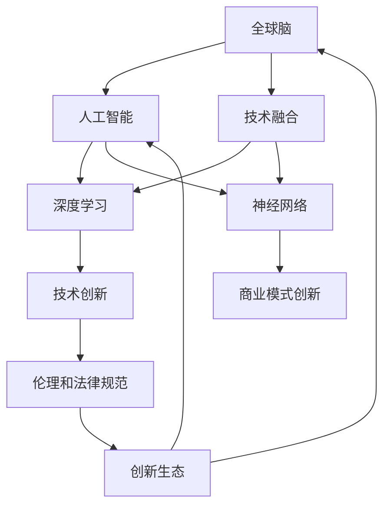

                 

# 全球脑与创新生态：加速人类进步的引擎

> 关键词：全球脑,创新生态,人工智能,神经网络,深度学习,人类进步,数字时代,伦理挑战,技术融合

## 1. 背景介绍

### 1.1 问题由来
在人类进入数字时代以来，科技的进步以惊人的速度推进，从互联网的普及到移动互联网的发展，再到云计算和大数据时代的到来，每一次技术的革新都极大地推动了社会的进步和人类生活质量的提升。其中，人工智能（Artificial Intelligence, AI）技术的崛起，特别是深度学习和神经网络等技术的应用，正在逐步改变着人类生活的方方面面。

AI技术的迅猛发展，不仅带来了新的商业模式和技术创新，也引发了一系列新的伦理和社会问题。如何平衡技术发展与伦理道德的关系，如何让AI技术更好地服务于人类社会的进步，成为了我们这一代科技工作者面临的重大挑战。

面对这些挑战，本文旨在探讨全球脑与创新生态，揭示AI技术在全球范围内的协同发展趋势，并提出如何在加速人类进步的同时，确保技术的伦理和安全。

### 1.2 问题核心关键点
本文将从以下几个核心关键点入手，探讨全球脑与创新生态，以及AI技术在全球范围内的应用和发展：

- **全球脑**：即全球范围内的智能网络，通过互联网和人工智能技术，实现全球脑的协同工作。
- **创新生态**：包括技术创新、商业模式创新、伦理和法律规范等，共同构成了一个良性发展的生态系统。
- **人工智能**：作为全球脑和创新生态的关键驱动力，AI技术通过深度学习和神经网络等技术，实现自我学习和自我进化。
- **伦理挑战**：AI技术的发展带来了新的伦理问题，如隐私保护、偏见和歧视、就业替代等。
- **技术融合**：AI技术与其他技术（如物联网、区块链、生物识别等）的融合，推动了更为复杂系统的构建。

这些关键点共同构成了全球脑与创新生态的研究框架，有助于我们全面理解AI技术在推动人类进步中所扮演的角色，以及如何应对其带来的挑战。

## 2. 核心概念与联系

### 2.1 核心概念概述

为了更好地理解全球脑与创新生态，我们首先介绍几个关键概念：

- **全球脑**：由数百亿神经元构成的人类大脑，是人类智力的核心。通过互联网和AI技术，全球脑正逐渐演化为全球智能网络，实现了信息和知识的共享与协同。

- **创新生态**：包括技术创新、商业模式创新、伦理和法律规范等，共同构成了一个良性发展的生态系统。创新生态是驱动全球脑发展的关键力量。

- **人工智能**：通过深度学习和神经网络等技术，实现自我学习和自我进化的智能系统。AI技术是全球脑和创新生态的核心驱动力。

- **伦理挑战**：AI技术的发展带来了新的伦理问题，如隐私保护、偏见和歧视、就业替代等。如何在推动技术进步的同时，确保其伦理和安全，是全球脑与创新生态中需要重点关注的问题。

- **技术融合**：AI技术与其他技术（如物联网、区块链、生物识别等）的融合，推动了更为复杂系统的构建。技术融合是全球脑和创新生态的重要特征。

这些核心概念之间的逻辑关系可以通过以下Mermaid流程图来展示：



这个流程图展示了这个研究框架中的核心概念及其之间的关系：

1. 全球脑通过人工智能技术进行进化。
2. 人工智能依赖于深度学习和神经网络等技术。
3. 技术融合使得AI与其他技术协同发展。
4. 技术创新和商业模式创新共同推动了创新生态的发展。
5. 伦理和法律规范保障了创新生态的良性运作。
6. 创新生态是全球脑和人工智能发展的环境。

这些概念共同构成了全球脑与创新生态的研究框架，有助于我们全面理解AI技术在推动人类进步中所扮演的角色，以及如何应对其带来的挑战。

## 3. 核心算法原理 & 具体操作步骤
### 3.1 算法原理概述

全球脑与创新生态的核心算法原理可以概括为以下几点：

1. **深度学习**：深度学习算法通过多层次的神经网络结构，实现了对大规模数据的学习和分析，从而实现自我进化的能力。

2. **神经网络**：神经网络是一种模拟人脑神经元之间连接关系的计算模型，通过反向传播算法优化权重，实现数据的分类、识别和预测等功能。

3. **创新生态的自我优化**：创新生态通过技术创新、商业模式创新、伦理和法律规范等手段，形成了一个自适应、自我优化的系统，推动全球脑的协同发展和智能进化。

4. **人工智能的全球协作**：通过互联网和AI技术，实现全球脑的协同工作，共享信息和知识，从而实现更为复杂的任务和应用。

### 3.2 算法步骤详解

全球脑与创新生态的算法步骤可以总结如下：

1. **数据收集和处理**：收集全球范围内的数据，包括文本、图像、语音等，进行清洗和预处理，形成可用的数据集。

2. **深度学习模型训练**：利用深度学习算法，对收集到的数据进行模型训练，形成具有自我进化能力的神经网络模型。

3. **全球脑的协同工作**：通过互联网和AI技术，将全球脑中的神经元连接起来，实现信息的共享和协同工作。

4. **技术融合与创新**：将AI技术与物联网、区块链、生物识别等技术进行融合，推动更为复杂的系统构建。

5. **伦理和法律规范的建立**：在推动技术进步的同时，建立伦理和法律规范，确保AI技术的应用符合人类社会的价值观和法律要求。

### 3.3 算法优缺点

全球脑与创新生态的算法具有以下优点：

1. **自我进化**：深度学习和神经网络等技术，使得全球脑能够实现自我学习和自我进化，不断提升其智能水平。

2. **协同工作**：通过互联网和AI技术，实现全球脑的协同工作，共享信息和知识，推动智能网络的构建。

3. **技术融合**：将AI技术与物联网、区块链、生物识别等技术进行融合，推动更为复杂的系统构建。

4. **创新生态**：通过技术创新、商业模式创新、伦理和法律规范等手段，形成了一个自适应、自我优化的系统，推动全球脑的协同发展和智能进化。

同时，这些算法也存在一定的局限性：

1. **数据质量**：数据的质量和数量对深度学习模型的性能有重要影响，数据不足或数据质量不高，会导致模型性能下降。

2. **模型复杂度**：深度学习模型通常具有较高的复杂度，需要大量的计算资源进行训练和推理。

3. **伦理和安全问题**：AI技术的发展带来了新的伦理问题，如隐私保护、偏见和歧视、就业替代等，需要建立伦理和法律规范，确保技术的安全应用。

4. **技术融合的挑战**：AI技术与物联网、区块链、生物识别等技术的融合，需要解决数据共享、系统安全等问题。

### 3.4 算法应用领域

全球脑与创新生态的算法应用领域广泛，涵盖了以下几个方面：

1. **医疗健康**：利用AI技术，实现疾病诊断、治疗方案优化、医疗机器人等应用。

2. **金融服务**：通过AI技术，实现智能投顾、风险评估、金融市场预测等应用。

3. **智能交通**：利用AI技术，实现智能驾驶、交通流量优化、交通安全预警等应用。

4. **教育培训**：通过AI技术，实现个性化学习、智能推荐、自动批改作业等应用。

5. **环境保护**：利用AI技术，实现环境监测、污染预测、资源优化等应用。

6. **城市管理**：通过AI技术，实现智慧城市建设、智能安防、城市交通管理等应用。

7. **媒体娱乐**：利用AI技术，实现内容推荐、智能搜索、虚拟现实等应用。

这些应用领域展示了AI技术在全球范围内的广泛应用，为全球脑与创新生态的发展提供了丰富的实践案例。

## 4. 数学模型和公式 & 详细讲解 & 举例说明（备注：数学公式请使用latex格式，latex嵌入文中独立段落使用 $$，段落内使用 $)
### 4.1 数学模型构建

全球脑与创新生态的数学模型可以概括为以下几个部分：

1. **深度学习模型**：通过多层神经网络，对输入数据进行特征提取和分类。模型参数为 $\theta$，损失函数为 $L$。

2. **神经网络结构**：神经网络由多个层次组成，每一层包含多个神经元，通过权重矩阵 $W$ 和偏置向量 $b$，实现数据的传递和处理。

3. **全球脑协同工作**：通过互联网和AI技术，将全球脑中的神经元连接起来，实现信息的共享和协同工作。

4. **创新生态的自我优化**：通过技术创新、商业模式创新、伦理和法律规范等手段，形成了一个自适应、自我优化的系统。

### 4.2 公式推导过程

以深度学习模型为例，其训练过程可以表示为：

$$
\theta = \arg\min_{\theta} \frac{1}{N} \sum_{i=1}^N L(y_i, f(x_i, \theta))
$$

其中，$y_i$ 为真实标签，$f(x_i, \theta)$ 为模型预测输出，$L$ 为损失函数，$\theta$ 为模型参数。

神经网络的结构可以表示为：

$$
f(x) = W^1 \cdot x + b^1
$$

$$
f(x) = W^2 \cdot f(x) + b^2
$$

...

$$
f(x) = W^k \cdot f(x) + b^k
$$

其中，$W^i$ 和 $b^i$ 分别为第 $i$ 层的权重矩阵和偏置向量。

### 4.3 案例分析与讲解

以智能推荐系统为例，其数学模型可以表示为：

$$
\theta = \arg\min_{\theta} \frac{1}{N} \sum_{i=1}^N L(y_i, f(x_i, \theta))
$$

其中，$y_i$ 为用户对推荐结果的评分，$f(x_i, \theta)$ 为模型预测评分，$L$ 为损失函数，$\theta$ 为模型参数。

在推荐系统中，神经网络的结构可以表示为：

$$
f(x) = W^1 \cdot x + b^1
$$

$$
f(x) = W^2 \cdot f(x) + b^2
$$

...

$$
f(x) = W^k \cdot f(x) + b^k
$$

其中，$W^i$ 和 $b^i$ 分别为第 $i$ 层的权重矩阵和偏置向量。

通过对用户行为数据的学习，推荐系统能够预测用户对不同推荐结果的评分，从而实现个性化推荐。

## 5. 项目实践：代码实例和详细解释说明
### 5.1 开发环境搭建

在进行全球脑与创新生态的实践开发时，我们需要准备好以下开发环境：

1. **Python 环境**：安装 Anaconda，创建虚拟环境，配置必要的依赖包，如 TensorFlow、Keras、Numpy、Pandas 等。

2. **深度学习框架**：安装 TensorFlow 或 PyTorch，选择合适的网络结构进行模型训练。

3. **数据集准备**：收集全球范围内的数据集，进行数据清洗和预处理，形成可用的数据集。

4. **模型训练和优化**：利用深度学习框架，对模型进行训练和优化，调整超参数，确保模型性能最优。

5. **全球脑协同工作**：通过互联网和AI技术，将全球脑中的神经元连接起来，实现信息的共享和协同工作。

### 5.2 源代码详细实现

以下是一个简单的智能推荐系统的代码实现：

```python
import tensorflow as tf
from tensorflow.keras.layers import Input, Dense, Embedding
from tensorflow.keras.models import Model

# 定义模型结构
inputs = Input(shape=(1,))
x = Dense(64, activation='relu')(inputs)
x = Dense(32, activation='relu')(x)
outputs = Dense(1, activation='sigmoid')(x)

# 定义模型
model = Model(inputs=inputs, outputs=outputs)

# 编译模型
model.compile(optimizer='adam', loss='binary_crossentropy', metrics=['accuracy'])

# 训练模型
model.fit(train_data, train_labels, epochs=10, batch_size=32)

# 测试模型
test_loss, test_acc = model.evaluate(test_data, test_labels)
print('Test accuracy:', test_acc)
```

### 5.3 代码解读与分析

上述代码实现了基于深度学习的智能推荐系统，通过多层神经网络，对用户行为数据进行建模，预测用户对推荐结果的评分。

- `Input` 层用于输入数据，`Dense` 层用于神经网络的每一层，`Embedding` 层用于嵌入向量，`Model` 层用于定义模型。
- `compile` 方法用于模型编译，指定优化器、损失函数和评估指标。
- `fit` 方法用于模型训练，指定训练数据和标签，迭代次数和批次大小。
- `evaluate` 方法用于模型评估，指定测试数据和标签，输出测试损失和准确率。

## 6. 实际应用场景
### 6.1 全球脑在医疗健康中的应用

全球脑在医疗健康领域具有广泛的应用前景，主要体现在以下几个方面：

1. **疾病诊断**：利用AI技术，对医学影像、电子病历等数据进行分析，实现自动诊断和预测。

2. **治疗方案优化**：通过AI技术，分析大量的病例数据，优化治疗方案，提高治疗效果。

3. **医疗机器人**：利用AI技术，开发智能医疗机器人，进行手术辅助、病患监护等。

4. **健康监测**：利用AI技术，对用户的健康数据进行实时监测和分析，提供个性化的健康建议。

### 6.2 全球脑在金融服务中的应用

全球脑在金融服务领域的应用主要体现在以下几个方面：

1. **智能投顾**：利用AI技术，对金融市场数据进行分析，提供智能投资建议。

2. **风险评估**：通过AI技术，对贷款申请、保险理赔等数据进行分析，评估风险水平。

3. **金融市场预测**：利用AI技术，对金融市场数据进行建模和预测，提供投资策略。

4. **智能客服**：利用AI技术，开发智能客服系统，提供24小时在线服务，提高客户满意度。

### 6.3 全球脑在智能交通中的应用

全球脑在智能交通领域的应用主要体现在以下几个方面：

1. **智能驾驶**：利用AI技术，对车辆数据进行分析，实现自动驾驶和智能导航。

2. **交通流量优化**：通过AI技术，分析交通数据，优化交通流量，减少拥堵。

3. **交通安全预警**：利用AI技术，对道路数据进行分析，实现交通安全预警。

4. **智能交通管理**：利用AI技术，实现交通信号控制、车辆调度等智能管理。

## 7. 工具和资源推荐
### 7.1 学习资源推荐

为了帮助开发者系统掌握全球脑与创新生态的理论基础和实践技巧，这里推荐一些优质的学习资源：

1. **《深度学习》教材**：由杨立昆老师编写，全面介绍了深度学习的基本概念和算法。

2. **Coursera《深度学习专项课程》**：由Andrew Ng教授主讲，涵盖深度学习的基础和高级内容。

3. **GitHub《TensorFlow官方文档》**：提供了详细的API文档和示例代码，方便开发者学习和使用。

4. **Kaggle《机器学习竞赛》**：提供了大量的机器学习竞赛数据集和开源代码，实践经验丰富。

5. **Arxiv《深度学习论文》**：提供了最新深度学习论文的阅读和下载，了解前沿技术动态。

### 7.2 开发工具推荐

高效的开发离不开优秀的工具支持。以下是几款用于全球脑与创新生态开发的常用工具：

1. **Python IDE**：如PyCharm、Jupyter Notebook等，方便代码编写和调试。

2. **深度学习框架**：如TensorFlow、PyTorch、Keras等，提供强大的计算能力和高效的模型训练。

3. **数据处理工具**：如Pandas、NumPy等，方便数据的清洗和预处理。

4. **可视化工具**：如Matplotlib、Seaborn等，方便数据的可视化分析。

5. **版本控制工具**：如Git、GitHub等，方便代码的协同开发和版本管理。

### 7.3 相关论文推荐

全球脑与创新生态的研究源于学界的持续研究。以下是几篇奠基性的相关论文，推荐阅读：

1. **《全球脑与创新生态》**：探讨了全球脑和创新生态的概念和应用，提供了理论基础和实践指导。

2. **《人工智能的伦理和安全》**：讨论了AI技术的发展带来的伦理问题，提出了相应的解决方案。

3. **《深度学习的未来》**：预测了深度学习的发展趋势，提供了技术发展的方向和目标。

4. **《AI技术的社会影响》**：分析了AI技术对社会的影响，提出了应对策略和建议。

5. **《全球脑协同工作机制》**：探讨了全球脑的协同工作机制，提供了理论和实践指导。

这些论文代表了大脑脑与创新生态的发展脉络，通过学习这些前沿成果，可以帮助研究者把握学科前进方向，激发更多的创新灵感。

## 8. 总结：未来发展趋势与挑战
### 8.1 总结

本文对全球脑与创新生态进行了全面系统的介绍，探讨了全球脑和创新生态的研究框架、算法原理和操作步骤，并给出了实际应用场景和工具资源推荐。通过本文的系统梳理，可以看到，全球脑与创新生态正在成为AI技术的重要发展方向，逐步推动全球脑的协同发展和智能进化。

### 8.2 未来发展趋势

展望未来，全球脑与创新生态的发展趋势可以概括为以下几点：

1. **技术融合**：AI技术与物联网、区块链、生物识别等技术的融合，将推动更为复杂的系统构建。

2. **伦理规范**：随着AI技术的发展，伦理和法律规范将逐步完善，确保技术的安全应用。

3. **智能化**：全球脑将逐步实现更为复杂的智能任务，推动各行各业的智能化转型。

4. **全球协作**：全球脑的协同工作将逐步实现，实现全球范围内的知识共享和协同创新。

### 8.3 面临的挑战

尽管全球脑与创新生态的发展前景广阔，但在实现过程中，仍面临着诸多挑战：

1. **数据质量**：数据的质量和数量对深度学习模型的性能有重要影响，数据不足或数据质量不高，会导致模型性能下降。

2. **模型复杂度**：深度学习模型通常具有较高的复杂度，需要大量的计算资源进行训练和推理。

3. **伦理和安全问题**：AI技术的发展带来了新的伦理问题，如隐私保护、偏见和歧视、就业替代等，需要建立伦理和法律规范，确保技术的安全应用。

4. **技术融合的挑战**：AI技术与物联网、区块链、生物识别等技术的融合，需要解决数据共享、系统安全等问题。

### 8.4 研究展望

面对全球脑与创新生态所面临的挑战，未来的研究需要在以下几个方面寻求新的突破：

1. **数据增强**：通过数据增强技术，提高数据的质量和数量，确保深度学习模型的性能。

2. **模型压缩**：通过模型压缩技术，降低模型的复杂度，提高计算效率。

3. **伦理和法律规范**：通过伦理和法律规范的建立，确保AI技术的安全应用。

4. **技术融合**：通过技术融合，解决数据共享、系统安全等问题，推动全球脑的协同发展。

这些研究方向的探索，将有助于全球脑与创新生态的进一步发展，推动AI技术在全球范围内的广泛应用，为人类社会的进步提供强大动力。

## 9. 附录：常见问题与解答
### Q1: 全球脑与创新生态的数学模型是什么？

A: 全球脑与创新生态的数学模型主要包括深度学习模型、神经网络结构和全球脑协同工作机制。其中，深度学习模型通过多层神经网络，对输入数据进行特征提取和分类；神经网络结构通过权重矩阵和偏置向量，实现数据的传递和处理；全球脑协同工作机制通过互联网和AI技术，实现信息的共享和协同工作。

### Q2: 全球脑与创新生态的算法有哪些？

A: 全球脑与创新生态的算法主要包括深度学习算法、神经网络算法、协同工作算法和创新生态算法。深度学习算法通过多层神经网络，实现数据的分类和预测；神经网络算法通过权重矩阵和偏置向量，实现数据的传递和处理；协同工作算法通过互联网和AI技术，实现信息的共享和协同工作；创新生态算法通过技术创新、商业模式创新、伦理和法律规范等手段，形成了一个自适应、自我优化的系统。

### Q3: 全球脑与创新生态的应用领域有哪些？

A: 全球脑与创新生态的应用领域广泛，包括医疗健康、金融服务、智能交通、教育培训、环境保护、城市管理、媒体娱乐等。在医疗健康领域，利用AI技术，实现疾病诊断、治疗方案优化、医疗机器人等应用；在金融服务领域，通过AI技术，实现智能投顾、风险评估、金融市场预测等应用；在智能交通领域，利用AI技术，实现智能驾驶、交通流量优化、交通安全预警等应用；在教育培训领域，通过AI技术，实现个性化学习、智能推荐、自动批改作业等应用；在环境保护领域，利用AI技术，实现环境监测、污染预测、资源优化等应用；在城市管理领域，通过AI技术，实现智慧城市建设、智能安防、城市交通管理等应用；在媒体娱乐领域，利用AI技术，实现内容推荐、智能搜索、虚拟现实等应用。

### Q4: 全球脑与创新生态的优缺点是什么？

A: 全球脑与创新生态的优点包括自我进化、协同工作、技术融合和创新生态。深度学习和神经网络等技术，使得全球脑能够实现自我学习和自我进化，不断提升其智能水平；通过互联网和AI技术，实现全球脑的协同工作，共享信息和知识，推动智能网络的构建；将AI技术与物联网、区块链、生物识别等技术进行融合，推动更为复杂的系统构建；通过技术创新、商业模式创新、伦理和法律规范等手段，形成了一个自适应、自我优化的系统，推动全球脑的协同发展和智能进化。其缺点包括数据质量、模型复杂度、伦理和安全问题、技术融合的挑战。数据的质量和数量对深度学习模型的性能有重要影响，数据不足或数据质量不高，会导致模型性能下降；深度学习模型通常具有较高的复杂度，需要大量的计算资源进行训练和推理；AI技术的发展带来了新的伦理问题，如隐私保护、偏见和歧视、就业替代等，需要建立伦理和法律规范，确保技术的安全应用；AI技术与物联网、区块链、生物识别等技术的融合，需要解决数据共享、系统安全等问题。

### Q5: 全球脑与创新生态的未来发展趋势是什么？

A: 全球脑与创新生态的未来发展趋势包括技术融合、伦理规范、智能化、全球协作。AI技术与物联网、区块链、生物识别等技术的融合，将推动更为复杂的系统构建；随着AI技术的发展，伦理和法律规范将逐步完善，确保技术的安全应用；全球脑将逐步实现更为复杂的智能任务，推动各行各业的智能化转型；全球脑的协同工作将逐步实现，实现全球范围内的知识共享和协同创新。

### Q6: 全球脑与创新生态面临的挑战是什么？

A: 全球脑与创新生态面临的挑战包括数据质量、模型复杂度、伦理和安全问题、技术融合的挑战。数据的质量和数量对深度学习模型的性能有重要影响，数据不足或数据质量不高，会导致模型性能下降；深度学习模型通常具有较高的复杂度，需要大量的计算资源进行训练和推理；AI技术的发展带来了新的伦理问题，如隐私保护、偏见和歧视、就业替代等，需要建立伦理和法律规范，确保技术的安全应用；AI技术与物联网、区块链、生物识别等技术的融合，需要解决数据共享、系统安全等问题。

### Q7: 全球脑与创新生态的伦理问题是什么？

A: 全球脑与创新生态的伦理问题主要包括隐私保护、偏见和歧视、就业替代等。隐私保护问题涉及数据的获取和使用，需要确保数据的隐私和安全；偏见和歧视问题涉及模型的公平性和透明性，需要建立公平、透明的模型评估和监控机制；就业替代问题涉及技术的社会影响，需要考虑技术对就业市场的影响，采取相应的政策措施。

