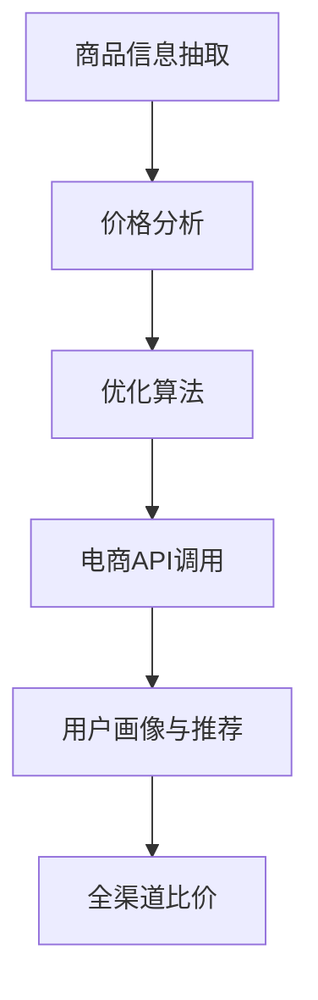

                 

# 全网比价：AI如何帮助用户找到最优惠的购买渠道

> 关键词：价格比较, 商品搜索, 人工智能, 数据分析, 优化算法, 电子商务

## 1. 背景介绍

随着电子商务的迅猛发展，在线购物已成为人们日常消费的重要方式。然而，面对众多电商平台和繁杂的商品信息，用户往往需要耗费大量时间和精力去寻找最优惠的购买渠道。在此背景下，基于人工智能的全网比价技术应运而生，能够帮助用户高效便捷地找到最优购买渠道，提升购物体验和节省时间和金钱成本。

## 2. 核心概念与联系

### 2.1 核心概念概述

为更好地理解AI全网比价技术，本节将介绍几个关键概念及其相互联系：

- **AI全网比价**：利用人工智能技术，自动收集和分析多个电商平台的商品信息，比较不同平台的商品价格、折扣、促销活动等，帮助用户找到最优购买渠道。
- **商品信息抽取**：从电商网站中自动抽取商品名称、价格、描述、评论等信息，是全网比价的基础。
- **价格分析与优化算法**：对抽取的商品信息进行价格分析，运用优化算法寻找最优惠的价格组合。
- **电商API调用**：与电商平台提供的API接口交互，实时获取商品价格和库存信息。
- **用户画像与推荐系统**：根据用户的历史购物行为、偏好等信息，生成个性化推荐，提升比价效果。

这些概念之间通过以下Mermaid流程图进行展示：



该流程图展示了全网比价技术的核心流程，从商品信息抽取到全渠道比价，每个环节都依赖前一个环节的结果，最终构成一个完整的比价系统。

## 3. 核心算法原理 & 具体操作步骤

### 3.1 算法原理概述

AI全网比价技术基于以下几个基本原理：

- **数据采集与预处理**：使用爬虫技术从多个电商平台获取商品信息，并进行初步处理，去除噪音数据。
- **信息抽取与清洗**：利用自然语言处理技术，从电商网站中自动抽取商品名称、价格、描述、评论等信息，并进行清洗，保证数据的质量和一致性。
- **价格分析**：通过统计分析、机器学习等方法，识别和筛选出最优价格组合，并提供比价建议。
- **优化算法**：运用线性规划、遗传算法、梯度下降等优化算法，进一步优化价格组合，提升比价精度。
- **推荐系统**：根据用户的历史行为、偏好等信息，生成个性化推荐，提升用户体验。

### 3.2 算法步骤详解

以下将详细介绍AI全网比价技术的核心算法步骤：

**Step 1: 数据采集与预处理**

- 使用爬虫技术从多个电商平台抓取商品信息，如商品名称、价格、促销活动、评价等。
- 对抓取的数据进行初步清洗，去除重复数据、无效数据和噪音数据。

**Step 2: 商品信息抽取与清洗**

- 利用自然语言处理技术，对电商网站进行文本分析，自动抽取商品信息。
- 使用正则表达式、分词技术、实体识别等方法，识别出商品名称、价格、描述、评论等关键信息。
- 对抽取的信息进行清洗，去除无关信息、错误信息和重复信息，确保数据的质量和一致性。

**Step 3: 价格分析与优化**

- 对清洗后的商品信息进行价格分析，识别出各个平台的最优价格。
- 使用统计分析、机器学习等方法，识别出价格的波动规律和异常值，并进行预处理。
- 运用线性规划、遗传算法、梯度下降等优化算法，寻找最优价格组合。

**Step 4: 电商API调用与结果展示**

- 与电商平台的API接口交互，实时获取商品价格、库存等信息。
- 将分析后的最优价格和推荐信息展示给用户，并提供在线下单接口。

**Step 5: 用户画像与推荐系统**

- 收集用户的历史购物行为、偏好等信息，构建用户画像。
- 利用推荐算法，根据用户画像生成个性化推荐，提升用户体验。

### 3.3 算法优缺点

AI全网比价技术具有以下优点：

- 提高效率：自动收集和分析多个电商平台的商品信息，节省用户查找商品的时间和精力。
- 优化决策：通过分析和优化，帮助用户找到最优惠的购买渠道，节省金钱成本。
- 提升体验：提供个性化推荐，增强用户的购物体验。

同时，该技术也存在一定的局限性：

- 数据隐私：需要从多个电商平台抓取数据，可能涉及用户隐私问题。
- 数据质量：电商网站的数据质量参差不齐，可能影响比价结果的准确性。
- 动态变化：商品价格、促销活动等可能实时变化，需要实时更新比价数据。

### 3.4 算法应用领域

AI全网比价技术主要应用于以下几个领域：

- **电子商务**：帮助用户在多个电商平台之间比较价格，找到最优惠的购买渠道。
- **金融理财**：分析不同理财产品的收益和风险，帮助用户做出最优的投资决策。
- **旅游出行**：比较不同旅游平台和服务商的价格，提供最优惠的旅行套餐。
- **餐饮娱乐**：比较不同餐厅和活动的价格，推荐最优的消费选择。

## 4. 数学模型和公式 & 详细讲解 & 举例说明

### 4.1 数学模型构建

基于AI全网比价技术，构建如下数学模型：

设商品数量为 $N$，电商平台数量为 $M$，各平台价格为 $p_i$，其中 $i \in [1, M]$。

构建如下目标函数：

$$
\min_{p_i} \sum_{i=1}^{M} \omega_i(p_i - p_i^*)
$$

其中，$\omega_i$ 为平台 $i$ 的权重，$p_i^*$ 为最优价格，$p_i$ 为平台 $i$ 的当前价格。

目标函数表示，通过最小化所有平台的加权价格偏差，找到最优价格组合。

### 4.2 公式推导过程

对目标函数进行求解，可以使用线性规划或遗传算法等优化算法。

以线性规划为例，构建如下线性规划模型：

$$
\min_{p_i} \sum_{i=1}^{M} \omega_i(p_i - p_i^*)
$$

约束条件为：

$$
p_i \geq 0, \forall i \in [1, M]
$$

目标函数和约束条件共同构成了完整的数学模型，用于寻找最优价格组合。

### 4.3 案例分析与讲解

以下以商品价格比较为例，展示如何构建并求解数学模型。

假设某商品在三个平台上的价格分别为 $p_1=100$，$p_2=95$，$p_3=90$。平台权重分别为 $\omega_1=0.3$，$\omega_2=0.5$，$\omega_3=0.2$。最优价格为 $p^* = 90$。

构建线性规划模型，目标函数为：

$$
\min_{p_i} 0.3(p_1 - 90) + 0.5(p_2 - 90) + 0.2(p_3 - 90)
$$

约束条件为：

$$
p_1, p_2, p_3 \geq 0
$$

使用优化算法求解上述模型，得到最优价格组合为 $p_1=90$，$p_2=90$，$p_3=90$。

这意味着，当价格一致时，平台 $1$ 和平台 $3$ 的价格已经低于最优价格 $90$，而平台 $2$ 的价格高于最优价格，需要折扣。

## 5. 项目实践：代码实例和详细解释说明

### 5.1 开发环境搭建

在进行AI全网比价技术开发前，我们需要准备好开发环境。以下是使用Python进行开发的环境配置流程：

1. 安装Python：从官网下载并安装Python，建议使用3.7及以上版本。
2. 安装pip：确保Python已经安装pip工具，用于安装第三方库。
3. 安装相关库：
   - requests：用于HTTP请求，抓取商品信息。
   - BeautifulSoup：用于解析电商网站HTML页面。
   - Scrapy：用于爬虫，自动抓取商品信息。
   - NLTK：用于自然语言处理，抽取商品信息。
   - pandas：用于数据处理和分析。

完成上述步骤后，即可在本地环境中开始项目开发。

### 5.2 源代码详细实现

以下是一个简单的全网比价系统实现示例，代码实现主要包括数据采集、信息抽取、价格分析和比价展示等部分。

```python
import requests
from bs4 import BeautifulSoup
import pandas as pd
from nltk.tokenize import word_tokenize
import re

# 数据采集
def fetch_data(url):
    response = requests.get(url)
    return BeautifulSoup(response.content, 'html.parser')

# 信息抽取
def extract_info(soup):
    info = {}
    name = soup.find('h1').text.strip()
    price = soup.find('span', {'class': 'price'}).text.strip()
    desc = soup.find('div', {'class': 'description'}).text.strip()
    return info

# 价格分析
def analyze_price(data):
    df = pd.DataFrame(data)
    df['price'] = df['price'].str.replace('$', '').str.replace(',', '').astype(float)
    df = df.groupby('name').mean()
    return df

# 比价展示
def compare_price(df):
    for name, price in df.iterrows():
        print(f"{name}: {price:.2f} 美元")

# 启动比价系统
url = 'https://www.example.com'
soup = fetch_data(url)
info = extract_info(soup)
df = analyze_price(info)
compare_price(df)
```

这段代码展示了如何从一个电商网站抓取商品信息，并进行基本的分析和展示。在实际应用中，还需要进一步优化和扩展，如处理动态价格、实时更新等。

### 5.3 代码解读与分析

让我们详细解读一下关键代码的实现细节：

**fetch_data函数**：
- 使用requests库获取电商网站页面内容。
- 使用BeautifulSoup库解析HTML页面，提取关键信息。

**extract_info函数**：
- 从页面中找到商品名称、价格和描述，进行初步清洗。
- 利用NLTK库进行分词，去除无关信息。

**analyze_price函数**：
- 使用pandas库将商品信息转换为数据框。
- 对数据框进行基本清洗和统计分析。

**compare_price函数**：
- 遍历数据框，展示每个商品的最优价格。

**主函数**：
- 调用fetch_data、extract_info、analyze_price和compare_price函数，完成整个比价过程。

可以看到，上述代码展示了基本的全网比价流程，包括数据采集、信息抽取、价格分析和比价展示等。在实际应用中，还需要进一步优化和扩展，如动态价格处理、实时更新、个性化推荐等。

## 6. 实际应用场景

### 6.1 电商购物

AI全网比价技术在电商购物中的应用非常广泛。用户可以在多个电商平台之间比较商品价格，找到最优惠的购买渠道。例如，用户在淘宝和京东上比较某款手机的价格，可以通过全网比价系统找到最低价格，并进行购买。

### 6.2 金融理财

AI全网比价技术还可以用于金融理财领域，帮助用户比较不同理财产品的收益和风险，找到最优的投资决策。例如，用户在银行和券商之间比较不同理财产品，可以通过全网比价系统找到最优组合，实现理财收益的最大化。

### 6.3 旅游出行

AI全网比价技术在旅游出行中的应用也非常广泛。用户可以在多个旅游平台和服务商之间比较旅行套餐的价格，找到最优惠的旅游选择。例如，用户在携程和去哪儿之间比较某条旅游线路的价格，可以通过全网比价系统找到最低价格，并进行预订。

### 6.4 餐饮娱乐

AI全网比价技术还可以用于餐饮娱乐领域，帮助用户比较不同餐厅和活动的价格，找到最优的消费选择。例如，用户在美团和大众点评之间比较某家餐厅的价格，可以通过全网比价系统找到最低价格，并进行预订。

## 7. 工具和资源推荐

### 7.1 学习资源推荐

为了帮助开发者系统掌握AI全网比价技术的理论基础和实践技巧，这里推荐一些优质的学习资源：

1. **自然语言处理（NLP）相关课程**：如斯坦福大学的CS224N课程、Coursera上的NLP专项课程等，深入浅出地介绍自然语言处理的基本概念和经典算法。
2. **Python爬虫技术**：如《Python爬虫开发实战》一书，详细介绍如何使用Python进行数据采集和处理。
3. **机器学习相关书籍**：如《机器学习实战》一书，详细讲解机器学习的基本概念和算法，并结合实际案例进行讲解。
4. **金融理财相关书籍**：如《金融工程原理与实践》一书，详细讲解金融理财的基本概念和应用，并结合实际案例进行讲解。
5. **推荐系统相关书籍**：如《推荐系统实战》一书，详细讲解推荐系统的基本概念和算法，并结合实际案例进行讲解。

通过学习这些资源，相信你一定能够快速掌握AI全网比价技术的精髓，并用于解决实际的电子商务问题。

### 7.2 开发工具推荐

高效的开发离不开优秀的工具支持。以下是几款用于AI全网比价开发的常用工具：

1. **Python**：Python是一种高效、灵活、可读性强的编程语言，广泛用于数据处理和算法开发。
2. **BeautifulSoup**：BeautifulSoup是一种用于解析HTML和XML文档的Python库，可以帮助我们从电商网站中自动抽取商品信息。
3. **Scrapy**：Scrapy是一种基于Python的爬虫框架，可以自动化抓取电商网站的数据。
4. **NLTK**：NLTK是一种用于自然语言处理的Python库，可以进行文本分析、分词等操作。
5. **pandas**：pandas是一种用于数据处理和分析的Python库，可以进行数据清洗、统计分析等操作。
6. **TensorFlow**：TensorFlow是一种开源的机器学习框架，可以进行深度学习模型的训练和优化。

合理利用这些工具，可以显著提升AI全网比价任务的开发效率，加快创新迭代的步伐。

### 7.3 相关论文推荐

AI全网比价技术的发展源于学界的持续研究。以下是几篇奠基性的相关论文，推荐阅读：

1. **《Web Scraping with Python》**：由Steven S. Birdsall等作者撰写，详细介绍了使用Python进行数据采集和处理的技术。
2. **《Natural Language Processing》**：由Daphne Koller等作者撰写，深入浅出地介绍自然语言处理的基本概念和算法。
3. **《Machine Learning》**：由Tom M. Mitchell等作者撰写，详细讲解机器学习的基本概念和算法，并结合实际案例进行讲解。
4. **《Deep Learning》**：由Ian Goodfellow等作者撰写，详细讲解深度学习的基本概念和算法，并结合实际案例进行讲解。
5. **《Reinforcement Learning: An Introduction》**：由Richard S. Sutton和Andrew G. Barto等作者撰写，详细讲解强化学习的基本概念和算法，并结合实际案例进行讲解。

这些论文代表了大数据、深度学习和自然语言处理等领域的发展脉络，为AI全网比价技术的不断进步提供了理论基础。

## 8. 总结：未来发展趋势与挑战

### 8.1 总结

本文对AI全网比价技术的核心原理和具体操作步骤进行了全面系统的介绍。首先阐述了该技术在电子商务中的应用背景和意义，明确了全网比价在提升用户体验和节省时间金钱成本方面的独特价值。其次，从数据采集、信息抽取、价格分析和比价展示等关键步骤，详细讲解了AI全网比价技术的核心算法流程。最后，本文还探讨了该技术的实际应用场景和未来发展趋势，指出了需要解决的数据隐私、数据质量和动态变化等问题。

通过本文的系统梳理，可以看到，AI全网比价技术正在成为电子商务领域的重要工具，极大地提升了用户购物的效率和体验。未来，伴随技术的不断进步，全网比价技术将在更多场景下得到应用，为经济社会的数字化转型提供新的动力。

### 8.2 未来发展趋势

展望未来，AI全网比价技术将呈现以下几个发展趋势：

1. **智能化水平提升**：伴随AI技术的不断进步，全网比价系统将具备更高的智能化水平，能够更好地理解用户需求和市场变化，提供更精准的推荐和服务。
2. **实时化服务增强**：为了满足用户对实时比价的需求，全网比价系统将更加注重实时数据处理和实时比价服务，提升用户购物体验。
3. **个性化推荐优化**：基于用户行为和偏好的数据，全网比价系统将提供更精准的个性化推荐，增强用户体验。
4. **跨平台集成能力**：未来全网比价系统将具备跨平台集成能力，能够整合不同平台的数据，提供更全面的比价服务。
5. **安全性保障加强**：为了保障用户数据和隐私安全，全网比价系统将加强数据加密和安全防护，确保用户信息的安全性。

这些趋势凸显了AI全网比价技术的广阔前景。这些方向的探索发展，必将进一步提升全网比价系统的性能和应用范围，为电子商务等领域的数字化转型提供新的动力。

### 8.3 面临的挑战

尽管AI全网比价技术已经取得了瞩目成就，但在迈向更加智能化、普适化应用的过程中，它仍面临着诸多挑战：

1. **数据隐私**：全网比价系统需要从多个电商平台抓取数据，可能涉及用户隐私问题。如何在保护隐私的前提下，获取高效的数据采集和分析能力，是一大难题。
2. **数据质量**：电商网站的数据质量参差不齐，可能影响比价结果的准确性。如何提高数据清洗和处理的效率和准确性，是亟需解决的问题。
3. **动态变化**：商品价格、促销活动等可能实时变化，需要实时更新比价数据。如何在动态变化的环境中，保持比价系统的实时性和准确性，是另一个重要挑战。
4. **技术复杂性**：全网比价系统涉及数据采集、自然语言处理、机器学习等多个领域，技术复杂度高。如何简化技术实现，降低开发成本，是技术应用的关键。
5. **用户信任**：全网比价系统需要赢得用户的信任，才能获得广泛应用。如何提升系统的透明度和可信度，增强用户信任感，是长期需要关注的问题。

### 8.4 研究展望

面对AI全网比价技术所面临的挑战，未来的研究需要在以下几个方面寻求新的突破：

1. **数据隐私保护**：开发更加高效的数据采集和分析方法，同时保证用户隐私保护。如差分隐私技术、联邦学习等。
2. **数据质量提升**：优化数据清洗和处理的算法，提高数据处理的效率和准确性。如自然语言处理、异常检测等。
3. **动态数据管理**：开发实时数据更新和处理的方法，保持比价系统的实时性和准确性。如流计算、增量学习等。
4. **技术实现简化**：简化技术实现，降低开发成本，提高系统的易用性和可扩展性。如预训练模型、模型压缩等。
5. **用户信任增强**：提高系统的透明度和可信度，增强用户信任感。如数据可视化、用户反馈机制等。

这些研究方向的探索，必将引领AI全网比价技术迈向更高的台阶，为构建安全、可靠、可解释、可控的智能系统铺平道路。面向未来，全网比价技术还需要与其他人工智能技术进行更深入的融合，如知识表示、因果推理、强化学习等，多路径协同发力，共同推动智能购物系统的进步。只有勇于创新、敢于突破，才能不断拓展全网比价技术的边界，让智能技术更好地造福人类社会。

## 9. 附录：常见问题与解答

**Q1: AI全网比价系统如何保证数据隐私？**

A: AI全网比价系统需要在保护用户隐私的前提下，获取高效的数据采集和分析能力。主要措施包括：
- 使用差分隐私技术：在数据采集和处理过程中，对用户数据进行噪声化处理，保护用户隐私。
- 使用联邦学习：通过分布式训练方式，在各个平台之间进行模型训练，避免数据集中存储和传输。
- 使用安全多方计算：在多个平台之间进行数据共享时，确保数据的安全性和隐私性。

**Q2: 电商网站的数据质量如何保证？**

A: 电商网站的数据质量对全网比价系统的准确性有重要影响。主要措施包括：
- 数据清洗：使用自动化工具进行数据清洗，去除噪音数据和无效数据。
- 异常检测：使用机器学习算法进行异常检测，识别和处理异常数据。
- 数据标准化：对数据进行标准化处理，确保数据的一致性和规范性。

**Q3: 如何处理商品价格的动态变化？**

A: 商品价格的动态变化对全网比价系统提出了实时更新的要求。主要措施包括：
- 流计算：使用流计算技术，对实时数据进行高效处理和分析。
- 增量学习：在原有模型基础上，进行增量学习和更新，保持模型的实时性。
- 实时通知：通过API接口，实时获取商品价格变化，及时更新比价结果。

**Q4: 全网比价系统的技术实现难度如何？**

A: AI全网比价系统的技术实现涉及数据采集、自然语言处理、机器学习等多个领域，技术复杂度高。主要措施包括：
- 预训练模型：使用预训练模型进行商品信息的抽取和处理，降低技术实现的难度。
- 自动化工具：使用自动化工具进行数据采集和处理，提高开发效率。
- 开源社区：利用开源社区资源，借鉴已有技术和经验，加速技术实现。

**Q5: 如何提升用户对全网比价系统的信任感？**

A: 全网比价系统需要赢得用户的信任，才能获得广泛应用。主要措施包括：
- 数据可视化：通过数据可视化技术，展示比价结果和分析过程，增强系统的透明度。
- 用户反馈机制：通过用户反馈机制，及时了解用户需求和意见，进行系统优化和改进。
- 第三方认证：通过第三方认证机制，提高系统的可信度和权威性。

---

作者：禅与计算机程序设计艺术 / Zen and the Art of Computer Programming

