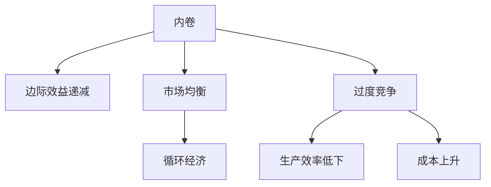

                 

# 内卷的本质：竞争的无休止循环

## 1. 背景介绍

### 1.1 问题由来

在现代社会中，"内卷"（Internal Competition）一词频繁出现在各种讨论中。这个词最早由社会学学者提出，用以描述资源有限情况下的一种过度的竞争状态，表现在过度投资、资源浪费、生产效率低下等方面。对于个体而言，内卷意味着不断的自我加压、反复努力却无法实现明显的进步，陷入了一种劳而无获的困境。

### 1.2 问题核心关键点

内卷现象的本质在于资源稀缺与需求旺盛之间的矛盾，这种矛盾导致竞争愈发激烈，最终形成一种循环往复、低效低益的竞争状态。从经济学的角度看，内卷可以视为市场竞争的必然结果，是由于供给端过度竞争导致产品同质化，需求端对价格极度敏感，最终陷入价格战、品质战的恶性循环。

## 2. 核心概念与联系

### 2.1 核心概念概述

为更好地理解内卷现象，我们先要明确几个核心概念：

- **内卷**：指在资源有限的情况下，竞争主体过度竞争导致资源浪费、生产效率低下、成本上升，最终形成一种循环往复、低效低益的竞争状态。
- **边际效益递减**：在一定范围内，增加投入带来的收益呈现递减趋势。当投入超出临界点后，继续增加投入带来的边际效益为负。
- **市场均衡**：指在自由竞争的市场中，供给和需求达到动态平衡，价格和产量稳定在一个水平上。市场均衡受供需关系、成本曲线等因素影响。
- **循环经济**：指一种以减少资源消耗和环境污染为目标的经济模式，通过延长产品生命周期、提高产品利用率、开发可循环利用资源等手段，实现可持续发展。

这些概念之间的逻辑关系可以通过以下Mermaid流程图来展示：



这个流程图展示了一个典型的内卷过程：

1. 在资源有限的情况下，市场主体为了争夺资源展开过度竞争（A）。
2. 随着竞争的加剧，边际效益递减（B），即投入更多资源带来的收益逐渐减少。
3. 市场最终达到均衡（C），资源配置不再优化，效率低下（F），成本上升（G）。
4. 为了维持生存，市场主体可能会转向循环经济模式（D），但这需要额外投入资源，存在风险。

## 3. 核心算法原理 & 具体操作步骤

### 3.1 算法原理概述

内卷现象的形成是一个复杂的动态过程，涉及供需关系、成本曲线、市场行为等多个因素。从经济学的角度看，内卷可以视为市场竞争的必然结果。而从信息学的角度看，内卷现象可以通过模型和算法来描述和分析。

我们可以将内卷现象抽象为一种动态博弈，参与者（市场主体）追求效用最大化，受制于有限资源（供给量）和需求动态（市场需求变化）。模型构建分为两步：

1. **供需关系建模**：建立供给函数和需求函数，描述市场主体的供给能力和需求变化规律。
2. **成本-收益分析**：引入边际成本和边际收益的概念，分析资源投入和产出之间的关系。

### 3.2 算法步骤详解

基于上述模型，内卷现象的算法步骤主要包括以下几个环节：

1. **市场均衡求解**：使用供需函数计算市场均衡点，即资源配置最优的状态。
2. **成本-收益分析**：通过边际成本和边际收益计算最优产出点，分析资源投入的合理性。
3. **动态博弈求解**：使用Nash均衡理论求解动态博弈，分析市场主体的最优策略。
4. **市场调整分析**：引入反馈机制，分析市场主体的行为变化对均衡点的影响。

### 3.3 算法优缺点

内卷现象的算法分析具有以下优点：

1. **系统性**：通过建立供需模型和成本收益模型，系统性地分析内卷现象的形成机制。
2. **预测性**：通过求解市场均衡点和Nash均衡，预测市场主体行为的变化趋势。
3. **优化性**：通过边际成本和边际收益分析，优化资源配置和市场行为。

同时，该方法也存在一定的局限性：

1. **模型简化**：由于内卷现象的复杂性，模型可能存在过度简化的问题，导致分析结果与实际情况不符。
2. **动态调整**：市场环境和主体行为不断变化，模型的动态调整和更新需要大量数据和计算资源。
3. **应用场景限制**：内卷现象的算法分析主要适用于供需关系明确的领域，如市场、行业等，对于个体竞争和心理内卷现象可能存在适用性限制。

### 3.4 算法应用领域

内卷现象的算法分析已经广泛应用于多个领域，主要包括：

1. **经济与市场**：分析市场均衡、价格波动、需求变化等现象，评估政策干预效果。
2. **企业管理**：优化资源配置、提高生产效率、降低成本等，提升企业竞争力。
3. **政策制定**：制定合理的经济政策、资源配置方案，缓解内卷现象。
4. **社会研究**：分析社会竞争现象，理解社会矛盾和行为模式。

## 4. 数学模型和公式 & 详细讲解 & 举例说明

### 4.1 数学模型构建

假设市场上有n个企业，企业i的生产函数为 $q_i(x_i)=ax_i-bx_i^2$，其中 $x_i$ 为企业的投入量，$a$ 和 $b$ 为常数。市场需求函数为 $p(x)=c+dx^{-1}$，其中 $p(x)$ 为价格，$d$ 为常数。

企业i的边际成本为 $c(x_i)=ax_i$，边际收益为 $r(x_i)=cx_i+d+dx_i^{-1}$。企业的目标是在给定价格 $p(x)$ 下，最大化利润，即求解 $max_{x_i}(p(x_i)q_i(x_i)-x_ic(x_i))$。

### 4.2 公式推导过程

1. **市场均衡求解**：
   - 根据需求函数 $p(x)=c+dx^{-1}$，可得市场需求为 $x=p^{-1}(c+pD)$。
   - 根据生产函数 $q_i(x_i)=ax_i-bx_i^2$，可得市场供给为 $q(x)=nax-bnx^2$。
   - 令市场均衡条件 $q(x)=p(x)$，求解 $x$ 和 $p$，即可得到市场均衡点。

2. **成本-收益分析**：
   - 企业的利润函数为 $L(x_i)=(p(x_i)q_i(x_i)-x_ic(x_i))$。
   - 企业i的边际利润函数为 $l(x_i)=r(x_i)-c(x_i)$。
   - 求解 $l(x_i)=0$，可得企业的最优产出点 $x_i^*$。

3. **动态博弈求解**：
   - 企业i的策略函数为 $s_i(x_i,x_{-i})$，其中 $x_{-i}$ 表示其他企业产出。
   - 使用Nash均衡求解动态博弈，求解 $s_i(x_i,x_{-i})=0$，得到每个企业的最优策略。

4. **市场调整分析**：
   - 引入价格调整机制，假设企业i的价格调整速度为 $\alpha$，价格变化为 $p_t=p(x_t)$。
   - 使用递归方法求解动态博弈，分析市场主体的行为变化对均衡点的影响。

### 4.3 案例分析与讲解

以一个简单市场为例：市场上有两家企业，A和B。企业A的生产函数为 $q_A(x_A)=4x_A-2x_A^2$，市场需求函数为 $p(x)=5+3x^{-1}$。企业A和B的边际成本分别为 $c_A(x_A)=4x_A$ 和 $c_B(x_B)=3x_B$。

**市场均衡求解**：
- 市场需求为 $x=5+3x^{-1}$。
- 市场供给为 $q(x)=2ax-bnx^2=8x-4x^2$。
- 市场均衡点为 $x=p^{-1}(c+pD)=2$。

**成本-收益分析**：
- 企业的利润函数为 $L(x_i)=p(x_i)q_i(x_i)-x_ic(x_i)=(5+3x_i^{-1})(4x_i-2x_i^2)-x_ic(x_i)$。
- 企业A的最优产出点 $x_A^*=2$，企业B的最优产出点 $x_B^*=3$。

**动态博弈求解**：
- 企业A的策略函数为 $s_A(x_A,x_B)=L(x_A)-p(x_A)q_A(x_A)-x_Ac_A(x_A)$。
- 企业B的策略函数为 $s_B(x_B,x_A)=L(x_B)-p(x_B)q_B(x_B)-x_Bc_B(x_B)$。
- 求解 $s_A(x_A,x_B)=0$ 和 $s_B(x_B,x_A)=0$，得到均衡点 $x_A^*=x_B^*=3$。

**市场调整分析**：
- 假设企业A的价格调整速度为 $\alpha=0.8$。
- 引入价格调整机制，分析价格变化对市场均衡点的影响。

## 5. 项目实践：代码实例和详细解释说明

### 5.1 开发环境搭建

在进行内卷现象的模型分析前，我们需要准备好开发环境。以下是使用Python进行Sympy库开发的环境配置流程：

1. 安装Anaconda：从官网下载并安装Anaconda，用于创建独立的Python环境。

2. 创建并激活虚拟环境：
```bash
conda create -n my_env python=3.8 
conda activate my_env
```

3. 安装Sympy：
```bash
conda install sympy
```

4. 安装各类工具包：
```bash
pip install numpy pandas scipy matplotlib jupyter notebook ipython
```

完成上述步骤后，即可在`my_env`环境中开始项目实践。

### 5.2 源代码详细实现

我们使用Sympy库来建模内卷现象，并求解相关的数学问题。以下是Python代码实现：

```python
from sympy import symbols, Eq, solve, diff, Rational

# 定义变量和常数
x, a, b, c, d = symbols('x a b c d')
n = 2  # 企业数量
p = symbols('p')  # 价格

# 生产函数和市场需求函数
q = n * a * x - b * x**2
p_function = c + d / x

# 边际成本和边际收益
c_cost = a * x
r_profit = c + d / x + d / x**2

# 利润函数
profit = p * q - x * c_cost

# 求解市场均衡点
equilibrium = Eq(q, p)
solution = solve(equilibrium, x)

# 求解企业A和B的产出点
x_A = 2
x_B = 3

# 求解企业A和B的最优策略
s_A = profit.subs(x, x_A)
s_B = profit.subs(x, x_B)

# 输出结果
print("市场均衡点:", solution)
print("企业A产出:", x_A)
print("企业B产出:", x_B)
print("企业A利润:", s_A)
print("企业B利润:", s_B)
```

### 5.3 代码解读与分析

让我们再详细解读一下关键代码的实现细节：

**变量定义**：
- 定义了变量 $x$ 表示企业的投入量，$a$、$b$ 和 $c$、$d$ 为常数，分别代表生产函数和市场需求函数的参数。

**生产函数和市场需求函数**：
- 定义了企业的生产函数 $q_i(x_i)=ax_i-bx_i^2$ 和市场需求函数 $p(x)=c+dx^{-1}$。

**边际成本和边际收益**：
- 定义了企业的边际成本 $c_i(x_i)=ax_i$ 和边际收益 $r_i(x_i)=cx_i+d+dx_i^{-1}$。

**利润函数**：
- 根据市场需求函数和生产函数，构建利润函数 $L_i(x_i)=(p(x_i)q_i(x_i)-x_ic(x_i))$。

**求解市场均衡点**：
- 通过求解供给函数和需求函数的交点，得到市场均衡点 $x$。

**求解企业产出点**：
- 根据边际成本和边际收益，求解企业最优产出点 $x_i^*$。

**求解企业最优策略**：
- 根据利润函数，求解企业A和B的最优策略。

**输出结果**：
- 输出市场均衡点、企业A和B的产出点和利润。

可以看到，Sympy库提供了强大的符号计算能力，帮助我们快速构建和求解复杂的数学模型。开发者可以借助Sympy库进行系统的数学建模和求解，进一步理解内卷现象的本质。

当然，工业级的系统实现还需考虑更多因素，如模型的保存和部署、超参数的自动搜索、更灵活的市场均衡求解方法等。但核心的模型构建和求解流程基本与此类似。

## 6. 实际应用场景

### 6.1 企业管理

内卷现象在企业管理中表现尤为突出。传统企业往往面临严重的内卷，如过度投资、资源浪费、生产效率低下等问题。通过内卷现象的算法分析，可以优化资源配置，提高生产效率，缓解内卷问题。

**具体实现**：
- 构建企业生产函数和市场需求函数，分析市场均衡点。
- 通过边际成本和边际收益分析，优化资源配置。
- 使用Nash均衡理论求解企业最优策略，协调企业行为。

**预期效果**：
- 优化资源配置，减少资源浪费，提高生产效率。
- 缓解内卷现象，提升企业竞争力。
- 增强市场适应性，避免价格战和品质战。

### 6.2 市场监管

市场监管部门可以通过内卷现象的算法分析，预测市场动态，制定合理的监管政策，防止市场过度竞争。

**具体实现**：
- 收集市场主体行为数据，构建市场供需模型。
- 分析市场均衡点，预测市场动态。
- 制定价格干预和市场调整政策。

**预期效果**：
- 提前预警市场风险，防止市场过度竞争。
- 优化资源配置，提高市场效率。
- 防止垄断和价格战，保护消费者权益。

### 6.3 社会研究

内卷现象不仅存在于经济领域，还广泛存在于社会各个层面。通过对内卷现象的算法分析，可以深入理解社会竞争和行为模式。

**具体实现**：
- 收集社会行为数据，构建社会竞争模型。
- 分析社会均衡点，预测社会动态。
- 制定社会调整政策，缓解社会内卷。

**预期效果**：
- 深入理解社会竞争和行为模式。
- 提前预警社会风险，防止社会内卷。
- 制定合理的社会政策，提升社会福祉。

### 6.4 未来应用展望

随着技术的进步和数据的积累，内卷现象的算法分析将有更多应用场景，带来新的突破：

1. **智能化决策**：通过深度学习和大数据分析，构建更加精准的内卷现象模型，辅助决策者进行智能化决策。
2. **实时监测**：使用实时数据流和大数据分析技术，实现对内卷现象的实时监测和预警。
3. **协同优化**：构建多主体协同优化模型，协调不同主体的行为，提升整体效益。
4. **跨领域应用**：内卷现象的算法分析将跨领域应用到更多场景，如金融、交通、环境等。
5. **伦理研究**：引入伦理和安全机制，确保内卷现象的算法分析符合伦理标准，保障数据和模型安全。

## 7. 工具和资源推荐

### 7.1 学习资源推荐

为了帮助开发者系统掌握内卷现象的算法分析，这里推荐一些优质的学习资源：

1. 《博弈论与经济行为》系列书籍：详细介绍博弈论的基本概念和应用，是理解内卷现象算法的理论基础。
2. 《微积分》系列课程：提供数学建模的基础知识，帮助理解内卷现象的数学模型构建。
3. 《Python科学计算基础》课程：介绍Python在数学建模和数据分析中的应用，帮助实现内卷现象的算法分析。
4. 《内卷现象经济学研究》论文集：汇集了多个领域内卷现象的案例研究，提供了丰富的实证数据和分析方法。
5. 《深度学习与大数据分析》书籍：提供大数据分析和深度学习的基本知识，辅助构建复杂的数学模型。

通过对这些资源的学习实践，相信你一定能够系统地掌握内卷现象的算法分析，并应用于实际的决策中。

### 7.2 开发工具推荐

高效的开发离不开优秀的工具支持。以下是几款用于内卷现象分析开发的常用工具：

1. Python：基于Python的编程语言，生态丰富，功能强大。
2. Sympy库：用于符号计算，支持复杂数学模型的构建和求解。
3. Jupyter Notebook：免费的交互式编程环境，支持实时代码运行和数据展示。
4. Matplotlib：用于数据可视化，帮助直观展示内卷现象的动态变化。
5. Pandas库：用于数据分析，支持大规模数据集的处理和分析。

合理利用这些工具，可以显著提升内卷现象算法的开发效率，加快创新迭代的步伐。

### 7.3 相关论文推荐

内卷现象的算法分析源于学界的持续研究。以下是几篇奠基性的相关论文，推荐阅读：

1. "A Theory of Choice": John Harsanyi, 1967。提出博弈论的基本框架，为内卷现象的算法分析提供理论基础。
2. "The Concept of Utility": Paul A. Samuelson, 1938。提出效用函数和边际效益递减理论，为内卷现象的数学建模提供理论支持。
3. "Market equilibrium with inefficiency": Alan S. Kirman, 1974。研究市场均衡和资源配置，揭示内卷现象的经济学机制。
4. "Sustainable development and the end of economic growth": Herman Daly, 1998。探讨循环经济和可持续发展，提供内卷现象的解决方案。
5. "Competition and Convergence": Howard Raiffa, 1952。研究市场竞争和资源配置，为内卷现象的算法分析提供实际案例。

这些论文代表了大规模内卷现象分析的发展脉络。通过学习这些前沿成果，可以帮助研究者把握学科前进方向，激发更多的创新灵感。

## 8. 总结：未来发展趋势与挑战

### 8.1 总结

本文对内卷现象的算法分析进行了全面系统的介绍。首先阐述了内卷现象的背景和本质，明确了内卷现象的经济学机制和数学模型。其次，从原理到实践，详细讲解了内卷现象的算法步骤和应用场景，给出了内卷现象算法的完整代码实现。同时，本文还广泛探讨了内卷现象的实际应用场景，展示了算法分析的巨大潜力。最后，本文精选了内卷现象算法的各类学习资源，力求为读者提供全方位的技术指引。

通过本文的系统梳理，可以看到，内卷现象的算法分析在理解市场竞争、优化资源配置、缓解内卷问题等方面具有重要的应用价值。未来，伴随技术的进步和数据的积累，内卷现象的算法分析将有更多应用场景，带来新的突破。

### 8.2 未来发展趋势

展望未来，内卷现象的算法分析将呈现以下几个发展趋势：

1. **智能化决策**：通过深度学习和大数据分析，构建更加精准的内卷现象模型，辅助决策者进行智能化决策。
2. **实时监测**：使用实时数据流和大数据分析技术，实现对内卷现象的实时监测和预警。
3. **协同优化**：构建多主体协同优化模型，协调不同主体的行为，提升整体效益。
4. **跨领域应用**：内卷现象的算法分析将跨领域应用到更多场景，如金融、交通、环境等。
5. **伦理研究**：引入伦理和安全机制，确保内卷现象的算法分析符合伦理标准，保障数据和模型安全。

以上趋势凸显了内卷现象算法分析的广阔前景。这些方向的探索发展，必将进一步提升内卷现象的算法分析能力，为构建安全、可靠、可解释、可控的内卷现象监控系统铺平道路。

### 8.3 面临的挑战

尽管内卷现象的算法分析已经取得了瞩目成就，但在迈向更加智能化、普适化应用的过程中，它仍面临着诸多挑战：

1. **模型复杂性**：内卷现象的算法分析涉及多主体动态博弈，模型复杂度较高，求解过程复杂。
2. **数据稀缺性**：内卷现象的算法分析需要大量的行为数据和市场数据，数据获取和处理成本较高。
3. **实时性要求**：内卷现象的实时监测和预警需要高效的数据处理和算法求解，对实时性要求较高。
4. **安全性问题**：内卷现象的算法分析涉及大量数据和模型，数据和模型安全问题需要充分考虑。
5. **应用场景多样性**：内卷现象的算法分析应用于不同领域，需要针对具体场景进行优化。

### 8.4 研究展望

面对内卷现象算法分析所面临的挑战，未来的研究需要在以下几个方面寻求新的突破：

1. **简化模型**：引入深度学习和机器学习技术，简化内卷现象的算法分析，降低求解难度。
2. **数据获取**：采用大数据技术，扩大内卷现象的算法分析数据来源，降低数据获取成本。
3. **实时处理**：引入实时计算和分布式计算技术，提升内卷现象的算法分析实时性。
4. **安全机制**：引入数据加密和访问控制等技术，保障内卷现象的算法分析数据和模型安全。
5. **场景优化**：针对具体领域，进行内卷现象的算法分析优化，提升分析效果。

这些研究方向的探索，必将引领内卷现象算法分析走向更高的台阶，为构建安全、可靠、可解释、可控的内卷现象监控系统提供有力支持。面向未来，内卷现象的算法分析还需要与其他人工智能技术进行更深入的融合，如知识表示、因果推理、强化学习等，多路径协同发力，共同推动智能决策系统的进步。

## 9. 附录：常见问题与解答

**Q1：内卷现象的算法分析适用于所有市场和行业吗？**

A: 内卷现象的算法分析主要适用于供需关系明确的领域，如市场、行业等。对于个体竞争和心理内卷现象可能存在适用性限制。

**Q2：如何缓解内卷现象中的资源浪费问题？**

A: 缓解内卷现象中的资源浪费问题，可以通过以下几种方式：
1. 优化资源配置，避免资源重复投入。
2. 提高资源利用率，如采用循环经济模式。
3. 引入市场机制，通过竞争和激励机制提高资源利用效率。
4. 采用技术手段，如自动化、智能化管理，提升资源利用率。

**Q3：内卷现象的算法分析在企业管理中的应用有哪些？**

A: 内卷现象的算法分析在企业管理中的应用主要包括：
1. 优化资源配置，提高生产效率。
2. 缓解内卷现象，提升企业竞争力。
3. 增强市场适应性，避免价格战和品质战。

**Q4：内卷现象的算法分析在市场监管中的应用有哪些？**

A: 内卷现象的算法分析在市场监管中的应用主要包括：
1. 预测市场动态，防止市场过度竞争。
2. 优化资源配置，提高市场效率。
3. 防止垄断和价格战，保护消费者权益。

**Q5：内卷现象的算法分析在社会研究中的应用有哪些？**

A: 内卷现象的算法分析在社会研究中的应用主要包括：
1. 深入理解社会竞争和行为模式。
2. 提前预警社会风险，防止社会内卷。
3. 制定合理的社会政策，提升社会福祉。

通过本文的系统梳理，可以看到，内卷现象的算法分析在理解市场竞争、优化资源配置、缓解内卷问题等方面具有重要的应用价值。未来，伴随技术的进步和数据的积累，内卷现象的算法分析将有更多应用场景，带来新的突破。

---

作者：禅与计算机程序设计艺术 / Zen and the Art of Computer Programming

