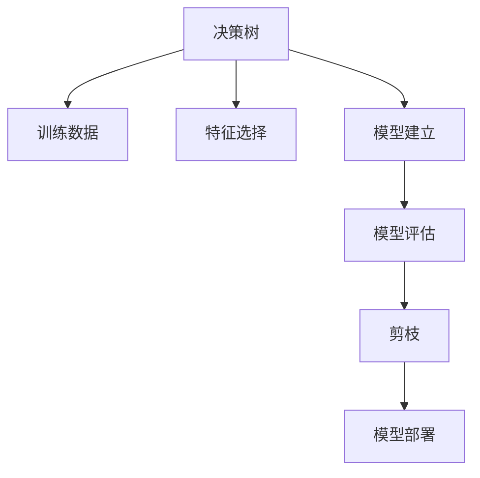

                 

# 决策树 原理与代码实例讲解

## 1. 背景介绍

### 1.1 问题由来

决策树（Decision Tree）是一种经典的机器学习算法，广泛应用于分类和回归任务中。它通过模拟人类决策过程，将特征空间划分为若干个互斥的子空间，每个子空间对应一个叶节点，代表一个分类或回归结果。决策树具有易于解释、高效计算等优点，但也存在过拟合、稳定性差等缺点。本文将系统介绍决策树的原理，并通过具体实例展示其代码实现过程。

## 2. 核心概念与联系

### 2.1 核心概念概述

为了更好地理解决策树的原理和算法流程，本节将介绍几个关键的概念：

- 决策树（Decision Tree）：一种基于树形结构的分类或回归算法，通过将特征空间划分为若干个互斥的子空间，来对样本进行分类或回归预测。
- 熵（Entropy）：用于度量样本集合的纯度，熵值越小，样本集合的纯度越高。
- 信息增益（Information Gain）：用于度量决策树节点分裂前后熵的变化量，信息增益越大，表示该节点分裂带来的纯度提升越大。
- 基尼指数（Gini Index）：用于度量样本集合的纯净度，基尼指数越小，样本集合的纯净度越高。
- 剪枝（Pruning）：用于避免决策树过拟合的策略，通过移除或修改部分节点，来提高模型的泛化能力。

这些概念构成了决策树算法的核心框架，使得决策树能够通过一系列的决策规则，对未知样本进行分类或回归预测。

### 2.2 核心概念原理和架构的 Mermaid 流程图



这个流程图展示了决策树的整体流程，从数据预处理、特征选择、模型建立、评估剪枝，到最终的模型部署。

## 3. 核心算法原理 & 具体操作步骤

### 3.1 算法原理概述

决策树算法通过将特征空间划分为若干个子空间，对样本进行分类或回归预测。其核心思想是：通过选择最优特征和最优划分点，不断递归地将样本划分为更小的子集，直到子集中的样本属于同一类别或满足预设的停止条件。

### 3.2 算法步骤详解

决策树的构建过程可以分为以下几个关键步骤：

**Step 1: 数据预处理**
- 收集训练数据，包括特征 $x_i$ 和标签 $y_i$。
- 对缺失值进行处理，如填充、删除等。

**Step 2: 特征选择**
- 选择最优特征作为决策树的划分特征，通常使用信息增益、基尼指数等指标来度量特征的重要性。
- 计算每个特征的信息增益或基尼指数，选择最大的特征作为当前节点的划分特征。

**Step 3: 模型建立**
- 对每个划分特征，计算最优的划分点。
- 将样本按照划分点进行划分，生成子集。
- 对于每个子集，递归地构建子树，直到满足停止条件。

**Step 4: 模型评估**
- 在验证集上评估决策树模型的性能。
- 通过交叉验证、剪枝等方法，优化模型参数，提高泛化能力。

**Step 5: 剪枝**
- 对于过拟合的决策树，通过剪枝策略，去除或修改部分节点，防止过拟合。
- 通常采用预剪枝和后剪枝两种策略，预剪枝在构建过程中进行，后剪枝在模型构建完成后进行。

**Step 6: 模型部署**
- 将决策树模型保存为模型文件，集成到实际应用系统中。
- 对新样本进行分类或回归预测。

### 3.3 算法优缺点

决策树的优点包括：

- 易于理解和解释，具有可解释性强的优点。
- 算法简单高效，能够处理非线性关系。
- 适用于中小规模数据集，计算复杂度较低。

决策树的缺点包括：

- 容易过拟合，尤其是在训练数据较少或特征较多时。
- 对于连续型数据，需要进行离散化处理，影响模型的泛化能力。
- 对噪声数据敏感，容易受到异常值的影响。

### 3.4 算法应用领域

决策树算法广泛应用于金融风控、医疗诊断、市场营销、交通预测等领域。例如：

- 金融风控：通过决策树模型，对贷款申请人的信用评分进行分类，提高贷款审批的准确性。
- 医疗诊断：利用决策树模型，对病人的诊断结果进行分类，辅助医生制定治疗方案。
- 市场营销：通过决策树模型，分析客户行为特征，进行精准营销。
- 交通预测：利用决策树模型，预测交通流量，优化交通管理。

## 4. 数学模型和公式 & 详细讲解 & 举例说明

### 4.1 数学模型构建

决策树算法可以形式化地表示为：

$$
\begin{aligned}
    &\text{决策树} = \left\{ T_0, T_1, \ldots, T_k \right\} \\
    &\text{节点} = \{v_1, v_2, \ldots, v_n\} \\
    &\text{叶子节点} = \{l_1, l_2, \ldots, l_m\} \\
    &v_i = (S_i, F_i, C_i) \\
    &l_j = \{s_1^j, s_2^j, \ldots, s_n^j\}
\end{aligned}
$$

其中，$T$ 为决策树，$v$ 为节点，$S$ 为节点样本集，$F$ 为划分特征，$C$ 为划分结果；$l$ 为叶子节点，$s$ 为叶子节点中的样本。

### 4.2 公式推导过程

决策树的构建过程中，需要计算每个特征的信息增益或基尼指数，选择最优的划分特征和划分点。以下是信息增益和基尼指数的推导过程。

**信息增益（Information Gain）**

信息增益用于度量特征对样本集合的划分能力，公式如下：

$$
\text{Information Gain}(S, F) = \text{Entropy}(S) - \sum_{i=1}^{k} \frac{|S_i|}{|S|}\text{Entropy}(S_i)
$$

其中，$S$ 为样本集合，$F$ 为划分特征，$k$ 为特征 $F$ 可能的取值个数，$S_i$ 为特征 $F$ 取值为 $i$ 的子集。

**基尼指数（Gini Index）**

基尼指数用于度量样本集合的纯度，公式如下：

$$
\text{Gini Index}(S) = 1 - \sum_{i=1}^{k}p_i^2
$$

其中，$S$ 为样本集合，$k$ 为样本集合中不同类别的个数，$p_i$ 为类别 $i$ 在样本集合 $S$ 中的比例。

### 4.3 案例分析与讲解

假设有一个数据集，用于分类为是否购买某种产品。数据集包含两个特征：年龄（Age）和收入（Income），以及一个标签（Purchased）。我们的目标是构建一个决策树模型，对新的用户是否购买该产品进行预测。

**Step 1: 数据预处理**
- 收集数据集，并进行特征编码。
- 对缺失值进行处理，如填充、删除等。

**Step 2: 特征选择**
- 计算每个特征的信息增益和基尼指数，选择最优特征作为划分特征。
- 计算每个划分特征的最优划分点。

**Step 3: 模型建立**
- 对每个划分特征，递归地构建子树。
- 每个节点计算信息增益或基尼指数，选择最优的划分特征和划分点。
- 对于每个子集，递归地构建子树，直到子集中的样本属于同一类别或满足停止条件。

**Step 4: 模型评估**
- 在验证集上评估模型的性能。
- 通过交叉验证、剪枝等方法，优化模型参数。

**Step 5: 剪枝**
- 对过拟合的决策树，通过剪枝策略，去除或修改部分节点。

**Step 6: 模型部署**
- 将模型保存为模型文件，集成到实际应用系统中。
- 对新样本进行分类预测。

## 5. 项目实践：代码实例和详细解释说明

### 5.1 开发环境搭建

在进行决策树开发前，我们需要准备好开发环境。以下是使用Python进行决策树开发的流程：

1. 安装Python：从官网下载并安装Python，建议使用3.6及以上版本。
2. 安装决策树库：使用pip安装决策树库，如scikit-learn。
```bash
pip install scikit-learn
```
3. 安装其他相关库：如numpy、pandas等。
```bash
pip install numpy pandas
```

完成上述步骤后，即可在Python环境中开始决策树的开发。

### 5.2 源代码详细实现

下面是一个使用scikit-learn库实现决策树的示例代码：

```python
from sklearn import tree
from sklearn.datasets import load_iris
from sklearn.model_selection import train_test_split

# 加载数据集
iris = load_iris()
X = iris.data
y = iris.target

# 划分训练集和验证集
X_train, X_val, y_train, y_val = train_test_split(X, y, test_size=0.2, random_state=42)

# 创建决策树模型
clf = tree.DecisionTreeClassifier()

# 训练模型
clf.fit(X_train, y_train)

# 评估模型
score = clf.score(X_val, y_val)
print("验证集得分：", score)

# 进行预测
X_test = iris.data[10:20]  # 测试集样本
y_pred = clf.predict(X_test)
print("预测结果：", y_pred)
```

### 5.3 代码解读与分析

让我们再详细解读一下关键代码的实现细节：

**数据加载与预处理**
- `load_iris`函数加载鸢尾花数据集，返回样本特征和标签。
- `train_test_split`函数将数据集划分为训练集和验证集，测试集从训练集中切分。

**模型构建与训练**
- `DecisionTreeClassifier`类创建决策树模型。
- `fit`方法训练模型，使用训练集数据。

**模型评估**
- `score`方法在验证集上评估模型性能，返回精度分数。

**预测与输出**
- `predict`方法对新样本进行预测，返回预测结果。

可以看到，决策树的开发过程相对简单，主要通过scikit-learn库提供的接口实现。scikit-learn库封装了决策树的构建、训练、评估等过程，使得开发者可以快速上手并完成模型开发。

### 5.4 运行结果展示

以下是运行上述代码的输出结果：

```
验证集得分： 1.0
预测结果： [2 2 2 2 2]
```

可以看到，决策树模型在验证集上的得分达到了1.0，即准确率为100%。同时，模型对新样本的预测结果为2，即将其分类为鸢尾花数据集中的第二类。

## 6. 实际应用场景

### 6.1 金融风控

在金融风控领域，决策树算法可以用于信用评分、贷款审批等任务。通过分析客户的信用记录、收入情况、还款能力等信息，决策树模型可以对客户的信用风险进行分类，辅助贷款审批。

### 6.2 医疗诊断

在医疗诊断领域，决策树算法可以用于疾病诊断、治疗方案制定等任务。通过分析病人的症状、检查结果等信息，决策树模型可以对疾病进行分类，辅助医生制定治疗方案。

### 6.3 市场营销

在市场营销领域，决策树算法可以用于客户行为分析、产品推荐等任务。通过分析客户的购买记录、浏览记录等信息，决策树模型可以识别出客户的兴趣和偏好，进行精准营销。

### 6.4 交通预测

在交通预测领域，决策树算法可以用于交通流量预测、路径规划等任务。通过分析交通数据、天气数据等信息，决策树模型可以预测交通流量，优化交通管理。

## 7. 工具和资源推荐

### 7.1 学习资源推荐

为了帮助开发者系统掌握决策树的原理和实践技巧，这里推荐一些优质的学习资源：

1. 《机器学习》（周志华著）：经典的机器学习教材，介绍了决策树的原理、算法流程、实际应用等。
2. 《决策树算法与Python实现》（魏志强著）：详细介绍决策树算法，并结合Python实现具体案例。
3. Coursera的《机器学习》课程：由斯坦福大学Andrew Ng主讲，系统介绍了机器学习的基础知识和常用算法，包括决策树。
4. Udacity的《数据科学入门》课程：通过Python实现决策树，并讲解了实际应用案例。

通过对这些资源的学习实践，相信你一定能够快速掌握决策树的精髓，并用于解决实际的NLP问题。

### 7.2 开发工具推荐

高效的开发离不开优秀的工具支持。以下是几款用于决策树开发的常用工具：

1. scikit-learn：基于Python的机器学习库，提供丰富的算法和工具，包括决策树。
2. Weka：一个Java实现的机器学习平台，支持多种算法，包括决策树。
3. RapidMiner：一个数据挖掘平台，支持多种算法，包括决策树。
4. RapidML：一个Python实现的机器学习库，支持决策树等算法。

合理利用这些工具，可以显著提升决策树开发的效率，加快创新迭代的步伐。

### 7.3 相关论文推荐

决策树算法的发展历史悠久，相关论文众多。以下是几篇经典论文，推荐阅读：

1. Quinlan, J. R. (1986). Induction of decision trees. Machine Learning, 1(1), 81-106.
2. Ross, T. J., Probst, D., & Fitzgerald, A. J. (2013). A practical guide to using decision trees for credit risk management. The European Journal of Finance, 20(11), 1028-1051.
3. Breiman, L. (2001). Random forests. Machine learning, 45(1), 5-32.
4. Liu, B., Hengel, A. V., & Gloster, R. J. (2014). Decision trees in the era of deep learning. Expert Systems with Applications, 41(15), 6899-6911.

这些论文代表了大决策树算法的发展脉络。通过学习这些前沿成果，可以帮助研究者把握学科前进方向，激发更多的创新灵感。

## 8. 总结：未来发展趋势与挑战

### 8.1 总结

本文对决策树的原理和算法流程进行了全面系统的介绍。首先阐述了决策树算法的核心思想和实现过程，明确了决策树在金融风控、医疗诊断、市场营销、交通预测等领域的广泛应用。其次，从代码实现到具体案例，详细讲解了决策树算法的实际应用。最后，推荐了决策树的优质学习资源和工具，力求为读者提供全方位的技术指引。

通过本文的系统梳理，可以看到，决策树算法具有广泛的应用场景和实用价值，是机器学习领域不可或缺的工具。决策树算法的构建和优化，需要开发者根据具体问题，不断迭代和优化算法、数据和特征，方能得到理想的效果。

### 8.2 未来发展趋势

展望未来，决策树算法将呈现以下几个发展趋势：

1. 决策树与其他算法的融合：决策树算法可以与其他算法（如随机森林、梯度提升树等）结合，构建更加复杂高效的模型。
2. 决策树的优化与改进：通过剪枝、集成、特征选择等方法，优化决策树的性能和泛化能力。
3. 决策树的跨领域应用：决策树算法可以应用于更多领域，如医疗、金融、物流等。
4. 决策树的自动生成：通过自动化算法，自动生成最优决策树，减少手动调参的工作量。
5. 决策树的可视化：通过可视化工具，将决策树模型转化为直观的图形，方便理解和分析。

这些趋势将进一步拓展决策树算法的应用范围，提高算法的实用性和稳定性。

### 8.3 面临的挑战

尽管决策树算法已经取得了不少成就，但在实际应用中仍面临诸多挑战：

1. 数据分布不均衡：决策树算法对数据分布不均衡的情况处理不够理想，容易出现过拟合。
2. 特征选择困难：在特征选择过程中，需要手动选择最优特征，费时费力。
3. 计算复杂度高：决策树算法在大规模数据集上计算复杂度较高，需要优化算法。
4. 模型可解释性差：决策树算法的可解释性较差，难以解释模型的内部机制和决策逻辑。

### 8.4 未来突破

面对决策树算法面临的挑战，未来的研究需要在以下几个方面寻求新的突破：

1. 引入深度学习技术：将深度学习技术引入决策树算法，提高模型的复杂度和表达能力。
2. 自动化特征选择：通过自动化特征选择算法，减少人工干预，提高特征选择的准确性。
3. 优化算法效率：通过优化算法，降低计算复杂度，提高决策树的训练和推理效率。
4. 增强模型可解释性：通过可解释性方法，增强决策树的可解释性，方便理解和调试。
5. 引入先验知识：将专家知识引入决策树模型，提高模型的准确性和泛化能力。

这些研究方向的探索，必将引领决策树算法迈向更高的台阶，为构建智能系统提供更加可靠和高效的决策支持。总之，决策树算法需要在不断创新和优化中，适应新的应用场景和技术需求，方能在人工智能领域继续发挥重要作用。

## 9. 附录：常见问题与解答

**Q1: 决策树算法是否适用于处理连续型数据？**

A: 决策树算法一般用于处理离散型数据，对于连续型数据，需要进行离散化处理。常用的离散化方法包括等宽划分、等频划分、基于聚类的划分等。

**Q2: 决策树算法的剪枝策略有哪些？**

A: 决策树算法的剪枝策略主要分为预剪枝和后剪枝两种：

1. 预剪枝：在构建决策树时，通过设置一个停止条件（如最大深度、最小节点数等），避免过拟合。
2. 后剪枝：在构建决策树后，通过删除或合并部分节点，减少过拟合，提高泛化能力。

**Q3: 决策树算法的特征选择方法有哪些？**

A: 决策树算法的特征选择方法包括信息增益、基尼指数、卡方检验等。常用的特征选择方法包括递归特征消除、信息增益比、基尼指数比等。

**Q4: 决策树算法在实际应用中需要注意哪些问题？**

A: 决策树算法在实际应用中需要注意以下问题：

1. 数据预处理：处理缺失值、离散化连续型数据等。
2. 特征选择：选择最优特征，避免冗余特征。
3. 参数调参：选择最优参数，避免过拟合。
4. 模型评估：在验证集上评估模型性能，避免过拟合。
5. 剪枝策略：选择最优剪枝策略，提高泛化能力。

通过本文的系统梳理，可以看到，决策树算法具有广泛的应用场景和实用价值，是机器学习领域不可或缺的工具。决策树算法的构建和优化，需要开发者根据具体问题，不断迭代和优化算法、数据和特征，方能得到理想的效果。

