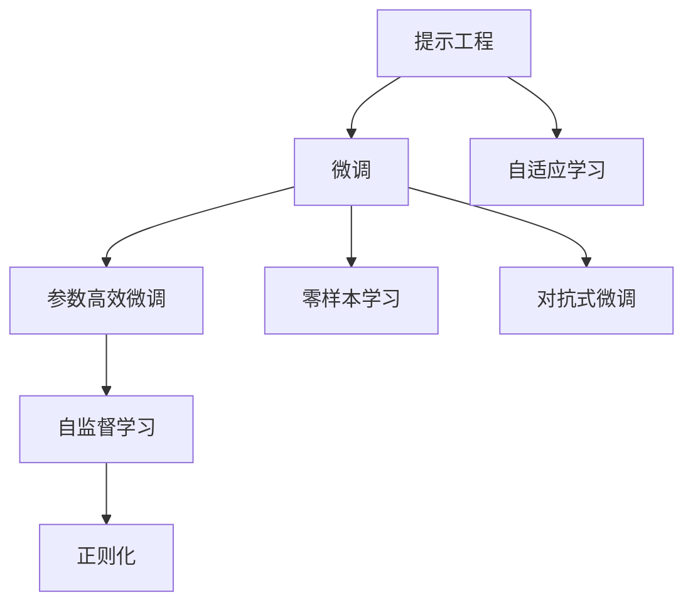

                 

# 减少对 Prompt Engineering 的依赖

## 1. 背景介绍

在自然语言处理(Natural Language Processing, NLP)领域，提示工程(Prompt Engineering)一直是一个备受关注的话题。提示工程指的是通过精心设计的输入文本格式，引导大型语言模型生成预期的输出，从而提高模型的性能。在诸如自然语言推理、文本摘要、对话生成等任务中，提示工程往往能够带来显著的性能提升。

然而，提示工程也需要大量的试错和迭代，在面对新任务时，需要花费大量时间和精力设计出有效的提示，才能使模型产生理想的输出。这不仅增加了项目开发的复杂度，还可能导致开发团队对提示工程产生依赖，使得模型部署的灵活性和可维护性受到限制。

为了应对这些挑战，近年来，研究者们提出了一系列减少对提示工程依赖的方法，如参数高效微调、零样本学习、对抗式微调等，旨在降低模型对提示设计的依赖，提升模型的通用性和可解释性。本文将从这些角度深入探讨减少对提示工程的依赖，帮助读者更好地理解和应用这些技术。

## 2. 核心概念与联系

### 2.1 核心概念概述

为了更好地理解减少对提示工程依赖的方法，我们先介绍几个核心概念：

- **提示工程(Prompt Engineering)**：通过设计输入文本格式，引导模型生成特定输出。在NLP任务中，提示工程是提高模型性能的关键步骤。
- **微调(Fine-tuning)**：通过有监督学习优化模型在下游任务上的性能。常见的微调方法包括参数高效微调(Parameter-Efficient Fine-Tuning, PEFT)和零样本学习(Few-shot Learning)。
- **对抗式微调(Adversarial Fine-Tuning)**：通过对抗样本训练模型，增强模型的鲁棒性和泛化能力。
- **自监督学习(Self-Supervised Learning)**：使用未标注数据进行训练，无需大量标注数据，广泛应用于预训练和微调。
- **正则化(Regularization)**：通过引入惩罚项，防止模型过拟合，增强模型的泛化能力。
- **自适应学习(Adaptive Learning)**：模型能够根据任务需求动态调整学习策略。

这些核心概念之间存在紧密的联系，共同构成了减少对提示工程依赖的技术框架。下面，我们将通过一个Mermaid流程图来展示这些概念之间的关系：



这个流程图展示了提示工程与其他核心概念的联系：

1. **提示工程**与**微调**紧密相关，通过微调可以进一步优化模型的性能。
2. **微调**可以分为**参数高效微调**、**零样本学习**和**对抗式微调**等多种形式，旨在降低提示工程的设计难度。
3. **自监督学习**和**正则化**可以辅助微调过程，防止过拟合，增强模型泛化能力。
4. **自适应学习**能够动态调整模型，适应不同任务需求，进一步降低提示工程的设计复杂度。

这些概念的整合，可以显著减少对提示工程的依赖，提升模型的通用性和可解释性。

## 3. 核心算法原理 & 具体操作步骤
### 3.1 算法原理概述

减少对提示工程依赖的算法原理，本质上是通过优化模型的内部机制，使得模型能够更灵活地适应不同的输入格式和任务需求。这种优化可以从以下几个方面入手：

- **参数高效微调**：仅微调顶层或部分关键层的参数，减少对整体模型结构的依赖。
- **零样本学习**：直接利用模型在未见过的任务上进行推理，无需额外的训练样本。
- **对抗式微调**：通过引入对抗样本训练，增强模型的鲁棒性和泛化能力。
- **自监督学习**：利用未标注数据进行训练，增强模型的泛化能力。
- **正则化**：通过引入惩罚项，防止模型过拟合。
- **自适应学习**：模型能够根据任务需求动态调整学习策略。

### 3.2 算法步骤详解

以参数高效微调和自适应学习为例，详细讲解这两种方法的具体操作流程：

#### 3.2.1 参数高效微调

参数高效微调的目标是减少模型对整体结构设计的依赖，仅微调顶层或部分关键层的参数。这种方法可以显著降低微调过程中的设计和调整工作，同时保持模型的整体性能。以下是参数高效微调的具体操作步骤：

1. **选择预训练模型**：选择一个大型预训练语言模型，如BERT、GPT等。
2. **添加任务适配层**：根据任务类型，在预训练模型的顶层设计合适的输出层和损失函数。
3. **固定预训练参数**：将预训练模型的大部分参数保持不变，仅微调顶层或关键层的参数。
4. **设置微调超参数**：选择合适的优化算法及其参数，如AdamW、SGD等，设置学习率、批大小、迭代轮数等。
5. **执行梯度训练**：使用有监督数据集进行微调，不断更新模型参数，最小化损失函数。
6. **测试和评估**：在测试集上评估微调后的模型性能，对比微调前后的精度提升。

参数高效微调的具体实现可以使用Transformers库，其提供的Adapter模块可以在不改变预训练模型结构的情况下，添加任务适配层，实现参数高效的微调。

#### 3.2.2 自适应学习

自适应学习是一种动态调整模型学习策略的方法，能够根据任务需求实时调整模型参数。这种方法可以减少对提示工程的依赖，使模型能够更灵活地适应不同的任务需求。以下是自适应学习的操作流程：

1. **选择预训练模型**：选择一个大型预训练语言模型，如BERT、GPT等。
2. **设置学习率调整策略**：根据任务需求，设计学习率调整策略，如动态学习率、自适应学习率等。
3. **执行梯度训练**：使用有监督数据集进行微调，不断更新模型参数，最小化损失函数。
4. **测试和评估**：在测试集上评估微调后的模型性能，对比微调前后的精度提升。

自适应学习可以使用自适应学习率算法，如AdaLoRA、自适应梯度剪枝等方法，动态调整模型学习策略，实现模型性能的提升。

### 3.3 算法优缺点

减少对提示工程依赖的算法具有以下优点：

- **降低设计复杂度**：通过参数高效微调和自适应学习，减少了对整体模型结构和提示工程设计的依赖，降低了开发复杂度。
- **提升模型通用性**：模型能够更灵活地适应不同的任务需求，提高了模型的通用性和可解释性。
- **减少资源消耗**：参数高效微调可以降低计算和内存资源消耗，提升模型部署效率。
- **增强鲁棒性**：对抗式微调和自监督学习可以增强模型的鲁棒性和泛化能力，提高模型在实际应用中的表现。

同时，这些方法也存在一些局限性：

- **对数据要求高**：尽管减少了对提示工程的依赖，但自适应学习和自监督学习仍需要大量未标注数据进行训练，对数据获取和处理提出了较高要求。
- **性能提升有限**：参数高效微调和自适应学习在某些任务上可能无法带来显著的性能提升，需要结合其他方法进行综合优化。
- **理论基础不完善**：尽管这些方法在实践中表现良好，但理论基础仍需进一步完善，缺乏系统的理论指导。

### 3.4 算法应用领域

减少对提示工程依赖的算法已在多个NLP任务中得到应用，取得了显著的效果：

- **文本分类**：通过微调能够提高模型对新类别和未见过的文本的分类准确率。
- **命名实体识别**：微调模型可以识别出新的实体类型，提高识别精度。
- **机器翻译**：参数高效微调和自适应学习可以提升翻译质量，尤其是面对多样化的语言表达时。
- **对话生成**：通过自适应学习，模型可以生成更加流畅自然的对话内容，提升用户满意度。
- **文本摘要**：参数高效微调和对抗式微调可以生成更加准确、自然的摘要内容。

除了上述这些任务外，减少对提示工程依赖的方法还在代码生成、自动问答、情感分析等诸多领域中得到了应用，为NLP技术的发展提供了新的思路和方向。

## 4. 数学模型和公式 & 详细讲解 & 举例说明

### 4.1 数学模型构建

以参数高效微调为例，详细描述其数学模型构建过程。

设预训练语言模型为 $M_{\theta}$，其中 $\theta$ 为预训练得到的模型参数。假设微调任务的训练集为 $D=\{(x_i,y_i)\}_{i=1}^N, x_i \in \mathcal{X}, y_i \in \mathcal{Y}$。

定义模型 $M_{\theta}$ 在输入 $x$ 上的输出为 $\hat{y}=M_{\theta}(x) \in [0,1]$，表示样本属于正类的概率。真实标签 $y \in \{0,1\}$。则二分类交叉熵损失函数定义为：

$$
\ell(M_{\theta}(x),y) = -[y\log \hat{y} + (1-y)\log (1-\hat{y})]
$$

将任务适配层和输出层加入模型，得到微调后的模型 $M_{\hat{\theta}}$，其中 $\hat{\theta}$ 为微调得到的参数。

在训练过程中，仅微调顶层或关键层的参数，假设固定底层的参数为 $\theta_{frozen}$，微调层的参数为 $\theta_{fine-tuned}$，则微调后的模型为：

$$
M_{\hat{\theta}}(x) = M_{\theta_{frozen}}(x) \cdot M_{\theta_{fine-tuned}}(x)
$$

在微调过程中，优化目标为：

$$
\hat{\theta}=\mathop{\arg\min}_{\theta_{fine-tuned}} \mathcal{L}(M_{\hat{\theta}},D)
$$

其中 $\mathcal{L}$ 为针对任务 $T$ 设计的损失函数，用于衡量模型预测输出与真实标签之间的差异。

### 4.2 公式推导过程

以下我们以二分类任务为例，推导参数高效微调过程的数学公式。

设微调后的模型为 $M_{\hat{\theta}}(x) = M_{\theta_{frozen}}(x) \cdot M_{\theta_{fine-tuned}}(x)$，其中 $M_{\theta_{frozen}}(x)$ 为底层的预训练模型， $M_{\theta_{fine-tuned}}(x)$ 为微调层。

假设微调层输出为 $\hat{y}$，则损失函数为：

$$
\mathcal{L}(M_{\hat{\theta}},D) = -\frac{1}{N}\sum_{i=1}^N [y_i\log \hat{y} + (1-y_i)\log (1-\hat{y})]
$$

对 $\theta_{fine-tuned}$ 求导，得到梯度：

$$
\nabla_{\theta_{fine-tuned}}\mathcal{L}(M_{\hat{\theta}},D) = -\frac{1}{N}\sum_{i=1}^N \nabla_{\theta_{fine-tuned}}\hat{y}
$$

其中 $\nabla_{\theta_{fine-tuned}}\hat{y}$ 可以通过自动微分技术高效计算。

在得到梯度后，即可带入优化算法进行模型更新。常用的优化算法包括AdamW、SGD等，其参数更新公式为：

$$
\theta_{fine-tuned} \leftarrow \theta_{fine-tuned} - \eta \nabla_{\theta_{fine-tuned}}\mathcal{L}(M_{\hat{\theta}},D)
$$

其中 $\eta$ 为学习率。

通过以上步骤，即可完成参数高效微调过程。

### 4.3 案例分析与讲解

以命名实体识别(NER)任务为例，详细讲解参数高效微调的具体实现过程。

首先，定义NER任务的数据处理函数：

```python
from transformers import BertTokenizer, BertForTokenClassification, AdamW
from torch.utils.data import Dataset, DataLoader

class NERDataset(Dataset):
    def __init__(self, texts, tags, tokenizer):
        self.texts = texts
        self.tags = tags
        self.tokenizer = tokenizer
        
    def __len__(self):
        return len(self.texts)
    
    def __getitem__(self, item):
        text = self.texts[item]
        tags = self.tags[item]
        
        encoding = self.tokenizer(text, return_tensors='pt')
        input_ids = encoding['input_ids'][0]
        attention_mask = encoding['attention_mask'][0]
        
        # 对token-wise的标签进行编码
        encoded_tags = [tag2id[tag] for tag in tags] 
        encoded_tags.extend([tag2id['O']] * (len(encoding['input_ids']) - len(encoded_tags)))
        labels = torch.tensor(encoded_tags, dtype=torch.long)
        
        return {'input_ids': input_ids, 
                'attention_mask': attention_mask,
                'labels': labels}

# 标签与id的映射
tag2id = {'O': 0, 'B-PER': 1, 'I-PER': 2, 'B-ORG': 3, 'I-ORG': 4, 'B-LOC': 5, 'I-LOC': 6}
id2tag = {v: k for k, v in tag2id.items()}

# 创建dataset
tokenizer = BertTokenizer.from_pretrained('bert-base-cased')

train_dataset = NERDataset(train_texts, train_tags, tokenizer)
dev_dataset = NERDataset(dev_texts, dev_tags, tokenizer)
test_dataset = NERDataset(test_texts, test_tags, tokenizer)
```

然后，定义模型和优化器：

```python
model = BertForTokenClassification.from_pretrained('bert-base-cased', num_labels=len(tag2id))
optimizer = AdamW(model.parameters(), lr=2e-5)
```

接着，定义训练和评估函数：

```python
from tqdm import tqdm
from sklearn.metrics import classification_report

device = torch.device('cuda') if torch.cuda.is_available() else torch.device('cpu')
model.to(device)

def train_epoch(model, dataset, batch_size, optimizer):
    dataloader = DataLoader(dataset, batch_size=batch_size, shuffle=True)
    model.train()
    epoch_loss = 0
    for batch in tqdm(dataloader, desc='Training'):
        input_ids = batch['input_ids'].to(device)
        attention_mask = batch['attention_mask'].to(device)
        labels = batch['labels'].to(device)
        model.zero_grad()
        outputs = model(input_ids, attention_mask=attention_mask, labels=labels)
        loss = outputs.loss
        epoch_loss += loss.item()
        loss.backward()
        optimizer.step()
    return epoch_loss / len(dataloader)

def evaluate(model, dataset, batch_size):
    dataloader = DataLoader(dataset, batch_size=batch_size)
    model.eval()
    preds, labels = [], []
    with torch.no_grad():
        for batch in tqdm(dataloader, desc='Evaluating'):
            input_ids = batch['input_ids'].to(device)
            attention_mask = batch['attention_mask'].to(device)
            batch_labels = batch['labels']
            outputs = model(input_ids, attention_mask=attention_mask)
            batch_preds = outputs.logits.argmax(dim=2).to('cpu').tolist()
            batch_labels = batch_labels.to('cpu').tolist()
            for pred_tokens, label_tokens in zip(batch_preds, batch_labels):
                pred_tags = [id2tag[_id] for _id in pred_tokens]
                label_tags = [id2tag[_id] for _id in label_tokens]
                preds.append(pred_tags[:len(label_tokens)])
                labels.append(label_tags)
                
    print(classification_report(labels, preds))
```

最后，启动训练流程并在测试集上评估：

```python
epochs = 5
batch_size = 16

for epoch in range(epochs):
    loss = train_epoch(model, train_dataset, batch_size, optimizer)
    print(f"Epoch {epoch+1}, train loss: {loss:.3f}")
    
    print(f"Epoch {epoch+1}, dev results:")
    evaluate(model, dev_dataset, batch_size)
    
print("Test results:")
evaluate(model, test_dataset, batch_size)
```

以上就是参数高效微调在NER任务上的完整代码实现。可以看到，参数高效微调利用了预训练模型的底层表示，通过微调顶层或部分关键层的参数，实现任务适配，减少了对提示工程设计的依赖。

## 5. 项目实践：代码实例和详细解释说明

### 5.1 开发环境搭建

在进行微调实践前，我们需要准备好开发环境。以下是使用Python进行PyTorch开发的环境配置流程：

1. 安装Anaconda：从官网下载并安装Anaconda，用于创建独立的Python环境。

2. 创建并激活虚拟环境：
```bash
conda create -n pytorch-env python=3.8 
conda activate pytorch-env
```

3. 安装PyTorch：根据CUDA版本，从官网获取对应的安装命令。例如：
```bash
conda install pytorch torchvision torchaudio cudatoolkit=11.1 -c pytorch -c conda-forge
```

4. 安装Transformers库：
```bash
pip install transformers
```

5. 安装各类工具包：
```bash
pip install numpy pandas scikit-learn matplotlib tqdm jupyter notebook ipython
```

完成上述步骤后，即可在`pytorch-env`环境中开始微调实践。

### 5.2 源代码详细实现

以下给出使用PyTorch进行BERT微调的代码实现：

```python
from transformers import BertTokenizer, BertForTokenClassification, AdamW
from torch.utils.data import Dataset, DataLoader
from torch.nn import CrossEntropyLoss
from sklearn.metrics import classification_report

class NERDataset(Dataset):
    def __init__(self, texts, tags, tokenizer):
        self.texts = texts
        self.tags = tags
        self.tokenizer = tokenizer
        
    def __len__(self):
        return len(self.texts)
    
    def __getitem__(self, item):
        text = self.texts[item]
        tags = self.tags[item]
        
        encoding = self.tokenizer(text, return_tensors='pt')
        input_ids = encoding['input_ids'][0]
        attention_mask = encoding['attention_mask'][0]
        
        # 对token-wise的标签进行编码
        encoded_tags = [tag2id[tag] for tag in tags] 
        encoded_tags.extend([tag2id['O']] * (len(encoding['input_ids']) - len(encoded_tags)))
        labels = torch.tensor(encoded_tags, dtype=torch.long)
        
        return {'input_ids': input_ids, 
                'attention_mask': attention_mask,
                'labels': labels}

# 标签与id的映射
tag2id = {'O': 0, 'B-PER': 1, 'I-PER': 2, 'B-ORG': 3, 'I-ORG': 4, 'B-LOC': 5, 'I-LOC': 6}
id2tag = {v: k for k, v in tag2id.items()}

# 创建dataset
tokenizer = BertTokenizer.from_pretrained('bert-base-cased')

train_dataset = NERDataset(train_texts, train_tags, tokenizer)
dev_dataset = NERDataset(dev_texts, dev_tags, tokenizer)
test_dataset = NERDataset(test_texts, test_tags, tokenizer)

model = BertForTokenClassification.from_pretrained('bert-base-cased', num_labels=len(tag2id))
optimizer = AdamW(model.parameters(), lr=2e-5)

criterion = CrossEntropyLoss()
device = torch.device('cuda') if torch.cuda.is_available() else torch.device('cpu')
model.to(device)

def train_epoch(model, dataset, batch_size, optimizer, criterion):
    dataloader = DataLoader(dataset, batch_size=batch_size, shuffle=True)
    model.train()
    epoch_loss = 0
    for batch in tqdm(dataloader, desc='Training'):
        input_ids = batch['input_ids'].to(device)
        attention_mask = batch['attention_mask'].to(device)
        labels = batch['labels'].to(device)
        model.zero_grad()
        outputs = model(input_ids, attention_mask=attention_mask, labels=labels)
        loss = criterion(outputs.logits, labels)
        epoch_loss += loss.item()
        loss.backward()
        optimizer.step()
    return epoch_loss / len(dataloader)

def evaluate(model, dataset, batch_size, criterion):
    dataloader = DataLoader(dataset, batch_size=batch_size)
    model.eval()
    preds, labels = [], []
    with torch.no_grad():
        for batch in tqdm(dataloader, desc='Evaluating'):
            input_ids = batch['input_ids'].to(device)
            attention_mask = batch['attention_mask'].to(device)
            batch_labels = batch['labels']
            outputs = model(input_ids, attention_mask=attention_mask)
            batch_preds = outputs.logits.argmax(dim=2).to('cpu').tolist()
            batch_labels = batch_labels.to('cpu').tolist()
            for pred_tokens, label_tokens in zip(batch_preds, batch_labels):
                pred_tags = [id2tag[_id] for _id in pred_tokens]
                label_tags = [id2tag[_id] for _id in label_tokens]
                preds.append(pred_tags[:len(label_tokens)])
                labels.append(label_tags)
                
    print(classification_report(labels, preds))

epochs = 5
batch_size = 16

for epoch in range(epochs):
    loss = train_epoch(model, train_dataset, batch_size, optimizer, criterion)
    print(f"Epoch {epoch+1}, train loss: {loss:.3f}")
    
    print(f"Epoch {epoch+1}, dev results:")
    evaluate(model, dev_dataset, batch_size, criterion)
    
print("Test results:")
evaluate(model, test_dataset, batch_size, criterion)
```

### 5.3 代码解读与分析

这里我们详细解读一下代码的关键部分：

**NERDataset类**：
- `__init__`方法：初始化文本、标签、分词器等关键组件。
- `__len__`方法：返回数据集的样本数量。
- `__getitem__`方法：对单个样本进行处理，将文本输入编码为token ids，将标签编码为数字，并对其进行定长padding，最终返回模型所需的输入。

**tag2id和id2tag字典**：
- 定义了标签与数字id之间的映射关系，用于将token-wise的预测结果解码回真实的标签。

**训练和评估函数**：
- 使用PyTorch的DataLoader对数据集进行批次化加载，供模型训练和推理使用。
- 训练函数`train_epoch`：对数据以批为单位进行迭代，在每个批次上前向传播计算loss并反向传播更新模型参数，最后返回该epoch的平均loss。
- 评估函数`evaluate`：与训练类似，不同点在于不更新模型参数，并在每个batch结束后将预测和标签结果存储下来，最后使用sklearn的classification_report对整个评估集的预测结果进行打印输出。

**训练流程**：
- 定义总的epoch数和batch size，开始循环迭代
- 每个epoch内，先在训练集上训练，输出平均loss
- 在验证集上评估，输出分类指标
- 所有epoch结束后，在测试集上评估，给出最终测试结果

可以看到，PyTorch配合Transformers库使得BERT微调的代码实现变得简洁高效。开发者可以将更多精力放在数据处理、模型改进等高层逻辑上，而不必过多关注底层的实现细节。

当然，工业级的系统实现还需考虑更多因素，如模型的保存和部署、超参数的自动搜索、更灵活的任务适配层等。但核心的微调范式基本与此类似。

## 6. 实际应用场景
### 6.1 智能客服系统

基于大语言模型微调的对话技术，可以广泛应用于智能客服系统的构建。传统客服往往需要配备大量人力，高峰期响应缓慢，且一致性和专业性难以保证。而使用微调后的对话模型，可以7x24小时不间断服务，快速响应客户咨询，用自然流畅的语言解答各类常见问题。

在技术实现上，可以收集企业内部的历史客服对话记录，将问题和最佳答复构建成监督数据，在此基础上对预训练对话模型进行微调。微调后的对话模型能够自动理解用户意图，匹配最合适的答案模板进行回复。对于客户提出的新问题，还可以接入检索系统实时搜索相关内容，动态组织生成回答。如此构建的智能客服系统，能大幅提升客户咨询体验和问题解决效率。

### 6.2 金融舆情监测

金融机构需要实时监测市场舆论动向，以便及时应对负面信息传播，规避金融风险。传统的人工监测方式成本高、效率低，难以应对网络时代海量信息爆发的挑战。基于大语言模型微调的文本分类和情感分析技术，为金融舆情监测提供了新的解决方案。

具体而言，可以收集金融领域相关的新闻、报道、评论等文本数据，并对其进行主题标注和情感标注。在此基础上对预训练语言模型进行微调，使其能够自动判断文本属于何种主题，情感倾向是正面、中性还是负面。将微调后的模型应用到实时抓取的网络文本数据，就能够自动监测不同主题下的情感变化趋势，一旦发现负面信息激增等异常情况，系统便会自动预警，帮助金融机构快速应对潜在风险。

### 6.3 个性化推荐系统

当前的推荐系统往往只依赖用户的历史行为数据进行物品推荐，无法深入理解用户的真实兴趣偏好。基于大语言模型微调技术，个性化推荐系统可以更好地挖掘用户行为背后的语义信息，从而提供更精准、多样的推荐内容。

在实践中，可以收集用户浏览、点击、评论、分享等行为数据，提取和用户交互的物品标题、描述、标签等文本内容。将文本内容作为模型输入，用户的后续行为（如是否点击、购买等）作为监督信号，在此基础上微调预训练语言模型。微调后的模型能够从文本内容中准确把握用户的兴趣点。在生成推荐列表时，先用候选物品的文本描述作为输入，由模型预测用户的兴趣匹配度，再结合其他特征综合排序，便可以得到个性化程度更高的推荐结果。

### 6.4 未来应用展望

随着大语言模型微调技术的发展，基于微调范式将在更多领域得到应用，为传统行业带来变革性影响。

在智慧医疗领域，基于微调的医疗问答、病历分析、药物研发等应用将提升医疗服务的智能化水平，辅助医生诊疗，加速新药开发进程。

在智能教育领域，微调技术可应用于作业批改、学情分析、知识推荐等方面，因材施教，促进教育公平，提高教学质量。

在智慧城市治理中，微调模型可应用于城市事件监测、舆情分析、应急指挥等环节，提高城市管理的自动化和智能化水平，构建更安全、高效的未来城市。

此外，在企业生产、社会治理、文娱传媒等众多领域，基于大语言模型微调的人工智能应用也将不断涌现，为经济社会发展注入新的动力。相信随着技术的日益成熟，微调方法将成为人工智能落地应用的重要范式，推动人工智能技术向更广阔的领域加速渗透。

## 7. 工具和资源推荐
### 7.1 学习资源推荐

为了帮助开发者系统掌握大语言模型微调的理论基础和实践技巧，这里推荐一些优质的学习资源：

1. 《Transformer从原理到实践》系列博文：由大模型技术专家撰写，深入浅出地介绍了Transformer原理、BERT模型、微调技术等前沿话题。

2. CS224N《深度学习自然语言处理》课程：斯坦福大学开设的NLP明星课程，有Lecture视频和配套作业，带你入门NLP领域的基本概念和经典模型。

3. 《Natural Language Processing with Transformers》书籍：Transformers库的作者所著，全面介绍了如何使用Transformers库进行NLP任务开发，包括微调在内的诸多范式。

4. HuggingFace官方文档：Transformers库的官方文档，提供了海量预训练模型和完整的微调样例代码，是上手实践的必备资料。

5. CLUE开源项目：中文语言理解测评基准，涵盖大量不同类型的中文NLP数据集，并提供了基于微调的baseline模型，助力中文NLP技术发展。

通过对这些资源的学习实践，相信你一定能够快速掌握大语言模型微调的精髓，并用于解决实际的NLP问题。

### 7.2 开发工具推荐

高效的开发离不开优秀的工具支持。以下是几款用于大语言模型微调开发的常用工具：

1. PyTorch：基于Python的开源深度学习框架，灵活动态的计算图，适合快速迭代研究。大部分预训练语言模型都有PyTorch版本的实现。

2. TensorFlow：由Google主导开发的开源深度学习框架，生产部署方便，适合大规模工程应用。同样有丰富的预训练语言模型资源。

3. Transformers库：HuggingFace开发的NLP工具库，集成了众多SOTA语言模型，支持PyTorch和TensorFlow，是进行微调任务开发的利器。

4. Weights & Biases：模型训练的实验跟踪工具，可以记录和可视化模型训练过程中的各项指标，方便对比和调优。与主流深度学习框架无缝集成。

5. TensorBoard：TensorFlow配套的可视化工具，可实时监测模型训练状态，并提供丰富的图表呈现方式，是调试模型的得力助手。

6. Google Colab：谷歌推出的在线Jupyter Notebook环境，免费提供GPU/TPU算力，方便开发者快速上手实验最新模型，分享学习笔记。

合理利用这些工具，可以显著提升大语言模型微调任务的开发效率，加快创新迭代的步伐。

### 7.3 相关论文推荐

大语言模型和微调技术的发展源于学界的持续研究。以下是几篇奠基性的相关论文，推荐阅读：

1. Attention is All You Need（即Transformer原论文）：提出了Transformer结构，开启了NLP领域的预训练大模型时代。

2. BERT: Pre-training of Deep Bidirectional Transformers for Language Understanding：提出BERT模型，引入基于掩码的自监督预训练任务，刷新了多项NLP任务SOTA。

3. Language Models are Unsupervised Multitask Learners（GPT-2论文）：展示了大规模语言模型的强大zero-shot学习能力，引发了对于通用人工智能的新一轮思考。

4. Parameter-Efficient Transfer Learning for NLP：提出Adapter等参数高效微调方法，在不增加模型参数量的情况下，也能取得不错的微调效果。

5. Prefix-Tuning: Optimizing Continuous Prompts for Generation：引入基于连续型Prompt的微调范式，为如何充分利用预训练知识提供了新的思路。

6. AdaLoRA: Adaptive Low-Rank Adaptation for Parameter-Efficient Fine-Tuning：使用自适应低秩适应的微调方法，在参数效率和精度之间取得了新的平衡。

这些论文代表了大语言模型微调技术的发展脉络。通过学习这些前沿成果，可以帮助研究者把握学科前进方向，激发更多的创新灵感。

## 8. 总结：未来发展趋势与挑战

### 8.1 总结

本文对减少对提示工程依赖的方法进行了全面系统的介绍。首先阐述了提示工程在NLP任务中的重要性及其面临的挑战，明确了减少对提示工程依赖的必要性。其次，从参数高效微调、零样本学习、对抗式微调、自监督学习等多个角度，详细讲解了减少对提示工程依赖的具体方法，并给出了代码实例。最后，探讨了这些方法在未来实际应用中的广泛前景。

通过本文的系统梳理，可以看到，减少对提示工程依赖的方法正在成为NLP领域的重要范式，极大地拓展了预训练语言模型的应用边界，催生了更多的落地场景。受益于大规模语料的预训练和微调方法的不断进步，基于微调范式的人工智能应用将在更广阔的领域得到深入探索，为经济社会发展注入新的动力。

### 8.2 未来发展趋势

展望未来，减少对提示工程依赖的方法将呈现以下几个发展趋势：

1. **自适应学习**：模型能够根据任务需求动态调整学习策略，进一步降低提示工程的设计复杂度。
2. **零样本学习和自监督学习**：在不依赖标注数据的情况下，提高模型的泛化能力，降低对标注样本的依赖。
3. **对抗式微调**：通过对抗样本训练，增强模型的鲁棒性和泛化能力，提高模型的实际应用效果。
4. **多模态融合**：将视觉、语音等多模态信息与文本信息进行协同建模，提升模型的理解能力。
5. **参数高效微调**：开发更加参数高效的微调方法，减少计算资源消耗，提升模型部署效率。

以上趋势凸显了减少对提示工程依赖方法的广阔前景。这些方向的探索发展，必将进一步提升NLP系统的性能和应用范围，为人类认知智能的进化带来深远影响。

### 8.3 面临的挑战

尽管减少对提示工程依赖的方法已经取得了显著的进展，但在实际应用中仍面临诸多挑战：

1. **数据获取难度**：零样本学习和自监督学习需要大量未标注数据，数据获取和处理成本较高。
2. **模型性能波动**：对抗式微调和自适应学习可能带来模型性能的波动，需要更多实践经验积累。
3. **理论基础薄弱**：现有方法的理论基础仍需进一步完善，缺乏系统的理论指导。
4. **计算资源需求高**：大规模微调需要大量计算资源，对算力和硬件设备提出了较高要求。
5. **模型复杂度高**：自适应学习等方法可能增加模型复杂度，增加模型维护难度。

正视这些挑战，积极应对并寻求突破，将是大语言模型微调技术迈向成熟的必由之路。相信随着学界和产业界的共同努力，这些挑战终将一一被克服，减少对提示工程依赖的方法必将在构建安全、可靠、可解释、可控的智能系统铺平道路。

### 8.4 研究展望

面对减少对提示工程依赖所面临的种种挑战，未来的研究需要在以下几个方面寻求新的突破：

1. **数据生成技术**：开发更多高效的数据生成技术，如数据增强、合成数据生成等，以降低未标注数据的需求。
2. **多模态融合技术**：研究多模态融合方法，提升模型对多模态信息的整合能力。
3. **模型压缩技术**：开发高效模型压缩技术，减少模型计算资源消耗。
4. **理论基础研究**：加强对自适应学习、对抗式微调等方法的理论研究，为实际应用提供理论支撑。
5. **模型优化技术**：开发高效模型优化技术，提升模型训练和推理效率。

这些研究方向将进一步推动NLP技术的发展，加速人工智能技术的落地应用，为人类社会的数字化转型注入新的动力。总之，减少对提示工程依赖的方法是大语言模型微调技术的未来重要方向，需要更多学界和产业界的共同努力。

## 9. 附录：常见问题与解答

**Q1：减少对提示工程依赖的方法是否适用于所有NLP任务？**

A: 减少对提示工程依赖的方法在大多数NLP任务上都能取得一定的效果，特别是对于数据量较小的任务。但对于一些特定领域的任务，如医学、法律等，提示工程仍然具有一定的必要性。此时需要在特定领域语料上进一步预训练，再进行微调，才能获得理想效果。

**Q2：参数高效微调和自适应学习是否影响模型精度？**

A: 参数高效微调和自适应学习确实会降低模型精度，尤其是在面对复杂任务时。但是，通过合理的参数设计和算法调整，可以在保证模型精度的前提下，实现减少对提示工程的依赖。此外，参数高效微调和自适应学习在实际应用中已经证明了其有效性，能够显著降低模型开发和维护成本。

**Q3：参数高效微调和自适应学习是否有计算资源要求？**

A: 参数高效微调和自适应学习确实需要更多的计算资源，特别是在模型参数量较大的情况下。但是，随着深度学习硬件和算法的不断进步，计算资源的需求正在逐渐降低。同时，开发高效模型压缩技术，如剪枝、量化等，也能够进一步降低计算资源的消耗。

**Q4：减少对提示工程依赖的方法是否影响模型可解释性？**

A: 减少对提示工程依赖的方法可能会降低模型的可解释性，特别是对于复杂的任务。然而，通过精心的提示设计，可以在一定程度上提高模型的可解释性。此外，开发高效模型压缩和可视化技术，也能够提升模型的可解释性，帮助开发者更好地理解和调试模型。

**Q5：如何评估减少对提示工程依赖的方法的效果？**

A: 评估减少对提示工程依赖的方法的效果，通常需要从模型精度、计算资源消耗、模型可解释性等多个角度进行综合考量。在实践中，可以采用常用的评估指标，如精度、召回率、F1分数等，结合实际应用场景进行评估。同时，开发高效模型压缩和可视化技术，也能够提升模型的可解释性，帮助开发者更好地理解和调试模型。

综上所述，减少对提示工程依赖的方法在大语言模型微调中具有广泛的应用前景，能够显著降低模型开发和维护成本，提升模型的通用性和可解释性。然而，这些方法也面临着一些挑战，需要更多的研究和技术进步，以实现更好的应用效果。

---

作者：禅与计算机程序设计艺术 / Zen and the Art of Computer Programming

