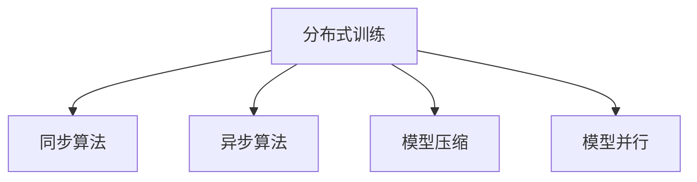

                 

# 分布式优化：扩展AI模型训练

> 关键词：分布式训练, AI模型, 深度学习, 优化器, 梯度并行, 同步, 异步, 模型压缩, 模型并行

## 1. 背景介绍

### 1.1 问题由来

近年来，随着深度学习技术的迅猛发展，大规模AI模型如GPT-3、BERT等在大规模数据集上取得了突破性的成果。然而，这些模型通常需要大量计算资源进行长时间训练，训练成本昂贵，难以大规模推广应用。为应对这一挑战，研究者提出了分布式训练的方案，通过多台计算设备的协同工作，将大规模模型分解成多个子模型在多个节点上并行训练，显著缩短训练时间，降低成本。

但现有分布式训练方法存在一些局限性：
- **收敛速度慢**：大规模模型通常具有复杂结构，训练过程中梯度更新需要大量计算和通信，收敛速度较慢。
- **通信开销大**：分布式训练需要频繁地跨节点交换参数梯度信息，造成较大的通信开销，影响整体训练效率。
- **模型压缩困难**：分布式训练下的并行计算需要共享模型状态，复杂模型难以进行高效的压缩和存储。
- **算法复杂度高**：分布式训练中需要使用复杂的同步和异步优化算法，增加了系统设计和调优的难度。

因此，如何高效地进行分布式优化，充分发挥计算资源优势，成为当下深度学习领域研究的热点问题。

### 1.2 问题核心关键点

分布式优化通过多个计算节点协同工作，共享模型状态，在分布式系统中优化损失函数，提升模型性能。核心问题包括：
- 如何设计高效的网络结构，减少通信开销。
- 如何选择合适的分布式优化算法，平衡速度和准确性。
- 如何优化模型压缩和存储，提高计算效率。
- 如何确保多节点之间的协同工作，避免故障和数据一致性问题。

本文将围绕上述关键点，详细讲解分布式优化的核心概念、算法原理和操作步骤，并通过实例说明分布式优化在大规模模型训练中的应用。

## 2. 核心概念与联系

### 2.1 核心概念概述

为更好地理解分布式优化，我们先介绍几个核心概念：

- **分布式训练(Distributed Training)**：将大规模模型分解成多个子模型，在不同计算节点上进行并行训练。每个节点负责部分模型的参数优化，并通过网络传输梯度信息进行全局参数更新。
- **同步(Sync) vs. 异步(Asyn)分布式优化算法**：同步算法要求所有节点同步完成当前参数更新，再进行下一轮的更新；异步算法允许节点独立更新参数，并通过一定规则协调不同节点间的数据交换。
- **模型压缩(Model Compression)**：通过剪枝、量化等方法，减少模型的参数量和计算量，提升模型在分布式环境中的存储和传输效率。
- **模型并行(Model Parallelism)**：将模型的不同层分解到不同的节点上并行训练，以减少通信开销和提高并行度。

这些概念之间的逻辑关系可以通过以下Mermaid流程图来展示：



这个流程图展示了分布式训练的核心组件及其之间的关系：

1. 分布式训练是整个系统的核心。
2. 同步算法和异步算法是两种主要的分布式优化策略。
3. 模型压缩和模型并行是优化数据传输和计算效率的重要手段。

## 3. 核心算法原理 & 具体操作步骤

### 3.1 算法原理概述

分布式优化算法通过多个计算节点协同工作，将大规模模型分成多个子模型并行训练，每个节点负责部分参数的优化。算法主要包括同步和异步两种模式，分别适用于不同的应用场景。

**同步算法**：所有节点同时开始计算梯度，同步完成后再进行参数更新。这种模式需要较高的通信和同步开销，但可以保证每次参数更新的一致性，适用于对模型精确度要求较高的任务。

**异步算法**：节点独立更新参数，周期性地交换梯度信息。这种模式通信开销较小，但需要自行解决同步问题，适用于大规模模型和高并行度的场景。

### 3.2 算法步骤详解

以同步算法为例，分布式优化的一般步骤如下：

**Step 1: 初始化模型和参数**
- 将所有计算节点的模型参数初始化为相同的随机值。

**Step 2: 并行计算梯度**
- 每个节点独立计算模型在当前参数下的损失函数梯度。
- 节点间通过网络交换梯度信息，更新模型参数。

**Step 3: 同步更新参数**
- 所有节点同步完成当前参数更新，再进行下一轮的梯度计算。
- 通过一定的同步策略（如Ring Allreduce）确保所有节点的参数更新一致。

**Step 4: 周期性评估和调整**
- 周期性地在验证集上评估模型性能，根据结果调整学习率等超参数。
- 重复上述步骤，直至模型收敛或达到预设的迭代轮数。

异步算法则在此基础上，通过节点独立更新参数的方式，减少通信开销，具体步骤类似，但需要自行解决同步问题。

### 3.3 算法优缺点

分布式优化算法具有以下优点：
1. 大幅缩短训练时间，提高计算效率。
2. 能够充分利用计算资源，优化模型精度。
3. 通过并行计算，提升模型的可扩展性。
4. 能够处理大规模模型和大数据集。

但同时也存在以下缺点：
1. 通信开销较大，影响系统整体性能。
2. 同步算法可能影响训练速度，异步算法可能存在同步问题。
3. 模型压缩和存储需要额外的技术支持。
4. 系统设计和调优难度较大。

尽管存在这些局限性，但分布式优化在处理大规模模型和数据集时具有显著优势，是当前深度学习领域的重要研究方向。

### 3.4 算法应用领域

分布式优化在大规模模型训练中得到了广泛应用，特别是在NLP、计算机视觉、推荐系统等领域。例如：

- 自然语言处理：通过分布式优化训练大规模语言模型，如GPT-3、BERT等，显著提升了模型性能和训练速度。
- 图像识别：在大型图像数据集上，通过分布式优化训练深度卷积神经网络，提高了图像分类和目标检测的准确率。
- 推荐系统：在大规模推荐数据上，通过分布式优化训练深度神经网络，提高了推荐算法的实时性和效果。

这些应用展示了分布式优化的强大能力，推动了AI技术在各行各业中的广泛应用。

## 4. 数学模型和公式 & 详细讲解 & 举例说明

### 4.1 数学模型构建

在分布式优化中，我们通常将模型参数 $\theta$ 分为 $n$ 个子参数 $\theta_1, \theta_2, ..., \theta_n$，每个子参数由不同的节点训练。

假设模型在输入 $x$ 下的损失函数为 $\mathcal{L}(\theta)$，则分布式优化中的参数更新公式为：

$$
\theta_i \leftarrow \theta_i - \eta \nabla_{\theta_i} \mathcal{L}(\theta_i)
$$

其中 $\eta$ 为学习率，$\nabla_{\theta_i} \mathcal{L}(\theta_i)$ 为节点 $i$ 在当前参数 $\theta_i$ 下计算的梯度。

### 4.2 公式推导过程

以同步算法为例，假设模型由 $n$ 个节点并行训练，每个节点计算梯度后的参数更新公式为：

$$
\theta_i^{(k+1)} = \theta_i^{(k)} - \eta \nabla_{\theta_i} \mathcal{L}(\theta^{(k)})
$$

其中 $\theta^{(k)}$ 为第 $k$ 轮迭代后的模型参数。节点间通过通信交换梯度信息，得到当前参数 $\theta_i^{(k+1)}$。

为了确保所有节点参数的同步更新，通常采用Ring Allreduce同步策略，即节点间依次交换梯度信息，使得所有节点更新后的参数 $\theta_i^{(k+1)}$ 保持一致。

### 4.3 案例分析与讲解

考虑一个包含4个节点的分布式训练系统，模型参数由节点1、节点2、节点3和节点4并行更新。假设模型损失函数为均方误差，即：

$$
\mathcal{L}(\theta) = \frac{1}{m} \sum_{i=1}^m (y_i - M_{\theta}(x_i))^2
$$

节点1首先计算损失函数梯度，更新参数：

$$
\theta_1^{(1)} = \theta_1^{(0)} - \eta \nabla_{\theta_1} \mathcal{L}(\theta_1^{(0)})
$$

节点2、节点3和节点4依次更新参数，直到所有节点完成当前轮次参数更新。最后，通过Ring Allreduce策略，节点间交换梯度信息，更新参数至下一轮。

这种同步方式能够确保模型参数的精确更新，适用于对模型精确度要求较高的任务。

## 5. 项目实践：代码实例和详细解释说明

### 5.1 开发环境搭建

在进行分布式优化实践前，我们需要准备好开发环境。以下是使用Python进行PyTorch开发的环境配置流程：

1. 安装Anaconda：从官网下载并安装Anaconda，用于创建独立的Python环境。

2. 创建并激活虚拟环境：
```bash
conda create -n pytorch-env python=3.8 
conda activate pytorch-env
```

3. 安装PyTorch：根据CUDA版本，从官网获取对应的安装命令。例如：
```bash
conda install pytorch torchvision torchaudio cudatoolkit=11.1 -c pytorch -c conda-forge
```

4. 安装相关库：
```bash
pip install torch
pip install torch.distributed torch.distributed.launch
```

完成上述步骤后，即可在`pytorch-env`环境中开始分布式优化实践。

### 5.2 源代码详细实现

下面以MNIST手写数字识别为例，给出使用PyTorch进行分布式优化的PyTorch代码实现。

首先，定义分布式训练函数：

```python
from torch.distributed import init_process_group, get_rank, get_world_size
import torch.distributed as dist

def dist_train(model, optimizer, train_loader, device, world_size):
    dist.init_process_group(backend='nccl', world_size=world_size, rank=get_rank())
    for epoch in range(num_epochs):
        for batch_idx, (data, target) in enumerate(train_loader):
            data, target = data.to(device), target.to(device)
            optimizer.zero_grad()
            output = model(data)
            loss = F.cross_entropy(output, target)
            loss.backward()
            optimizer.step()
            if (batch_idx + 1) % 10 == 0:
                print(f'Rank {get_rank()} - Epoch {epoch + 1} - Batch {batch_idx + 1} - Loss: {loss.item()}')
```

然后，定义模型和优化器：

```python
from torch.nn import Sequential, Linear, ReLU, Dropout
from torch.optim import Adam
import torch.nn.functional as F

model = Sequential(Linear(784, 128), ReLU(), Dropout(0.5), Linear(128, 10), LogSoftmax(dim=1))
optimizer = Adam(model.parameters(), lr=0.001)
```

接着，定义分布式训练过程：

```python
from torch.distributed.launch import multi_gpu_train

world_size = 4
distributed_train(model, optimizer, train_loader, device, world_size)
```

最后，启动分布式训练：

```bash
python -m torch.distributed.launch --nproc_per_node=2 --gpus=0,1,2,3 dist_train.py
```

以上代码展示了使用PyTorch进行MNIST手写数字识别的分布式优化过程。可以看到，分布式优化在代码实现上相对简单，只需添加分布式训练函数，并使用`torch.distributed.launch`启动多个节点即可。

### 5.3 代码解读与分析

让我们再详细解读一下关键代码的实现细节：

**dist_train函数**：
- 初始化分布式过程组，使用NCCL进行通信。
- 循环遍历数据集，计算模型在当前参数下的损失函数。
- 反向传播计算梯度，并更新模型参数。
- 在每个batch输出当前的损失值。

**模型定义**：
- 使用PyTorch的`Sequential`模块定义简单的全连接神经网络。

**优化器定义**：
- 使用Adam优化器进行模型参数更新。

**启动分布式训练**：
- 在每个节点启动`dist_train`函数，并使用`--nproc_per_node`参数指定每个节点使用的GPU个数。

**启动命令**：
- 使用`torch.distributed.launch`启动多个节点进行分布式训练，命令中`--nproc_per_node=2`表示每个节点使用2个GPU。

可以看到，使用PyTorch进行分布式优化，代码实现相对简单，性能提升显著。然而，在实际应用中，还需要考虑更多因素，如节点间的同步策略、通信方式、模型压缩等。这些技术细节都需要在具体项目中根据实际情况进行调整。

## 6. 实际应用场景

### 6.1 大规模推荐系统

推荐系统通常需要处理海量用户和物品信息，进行复杂的协同过滤和深度学习建模。分布式优化技术可以在分布式环境中高效地训练推荐模型，提升推荐算法的实时性和效果。

具体而言，可以收集用户的浏览、点击、评分等行为数据，构建用户和物品的隐向量表示。在分布式环境下，并行训练深度神经网络，预测用户对物品的评分或选择概率。通过定期更新模型参数，优化推荐结果，提升用户满意度。

### 6.2 图像识别

图像识别任务通常需要处理大规模图像数据集，进行深度卷积神经网络的训练。分布式优化可以并行训练大规模模型，提高图像分类的准确率和实时性。

例如，在ImageNet数据集上进行图像分类任务时，分布式优化可以将图像数据集分割成多个子集，分配到不同的节点上并行训练。每个节点计算梯度后，通过通信交换梯度信息，更新全局参数。在多个节点协同工作的过程中，模型参数不断更新，逐渐逼近最优解。

### 6.3 自然语言处理

自然语言处理任务通常涉及大规模语言模型的训练。分布式优化技术可以在分布式环境下高效地训练语言模型，提升模型的准确率和训练速度。

例如，在GPT-3等大规模语言模型训练中，分布式优化可以将训练数据集分割成多个子集，分配到不同的节点上并行训练。每个节点计算梯度后，通过通信交换梯度信息，更新全局参数。在多个节点协同工作的过程中，模型参数不断更新，逐渐逼近最优解。

### 6.4 未来应用展望

随着深度学习技术的不断发展，分布式优化将在更多领域得到应用，为大规模模型的训练提供新的解决方案。

在智慧医疗领域，分布式优化可以高效地训练医学图像分类、疾病诊断等模型，提升医疗诊断的准确性和实时性。

在智能城市治理中，分布式优化可以并行训练交通流量预测、环境监测等模型，提升城市管理的自动化和智能化水平。

在智慧教育领域，分布式优化可以并行训练个性化推荐系统，提升个性化教学的精度和效率。

此外，在自动驾驶、智能家居、金融风控等众多领域，分布式优化技术也将带来新的突破，为经济社会发展注入新的动力。

## 7. 工具和资源推荐

### 7.1 学习资源推荐

为了帮助开发者系统掌握分布式优化的理论基础和实践技巧，这里推荐一些优质的学习资源：

1. 《Distributed Deep Learning with TensorFlow》一书：该书系统介绍了TensorFlow在分布式训练中的实现方法，并提供了丰富的代码示例，适合入门学习。

2. PyTorch官方文档：PyTorch提供了详细的分布式优化文档，介绍了分布式过程组和通信接口的使用方法，适合开发者深入理解分布式优化。

3. 《Deep Learning with PyTorch》一书：该书介绍了使用PyTorch进行深度学习模型的构建和优化，其中包含分布式训练的实践指南，适合进一步学习和实践。

4. HuggingFace官方博客：HuggingFace提供了一系列分布式优化的博文，介绍了如何在不同平台上实现分布式训练，适合实战练习。

5. 《Distributed TensorFlow》一书：该书详细介绍了TensorFlow的分布式训练实现，包括不同分布式算法和优化器，适合进阶学习。

通过对这些资源的学习实践，相信你一定能够快速掌握分布式优化的精髓，并用于解决实际的深度学习问题。

### 7.2 开发工具推荐

高效的开发离不开优秀的工具支持。以下是几款用于分布式优化开发的常用工具：

1. PyTorch：基于Python的开源深度学习框架，灵活动态的计算图，适合快速迭代研究。PyTorch提供了丰富的分布式优化功能，支持多节点并行训练。

2. TensorFlow：由Google主导开发的开源深度学习框架，生产部署方便，适合大规模工程应用。TensorFlow提供了丰富的分布式优化功能，支持多种同步和异步算法。

3. Horovod：一个易于使用的分布式深度学习框架，支持多种计算框架和算法，方便进行分布式训练。

4. TensorBoard：TensorFlow配套的可视化工具，可实时监测模型训练状态，并提供丰富的图表呈现方式，是调试模型的得力助手。

5. Weights & Biases：模型训练的实验跟踪工具，可以记录和可视化模型训练过程中的各项指标，方便对比和调优。

6. NVIDIA Tesla：高性能GPU/TPU，能够提供强大的计算能力和高带宽通信能力，支持大规模分布式训练。

合理利用这些工具，可以显著提升分布式优化任务的开发效率，加快创新迭代的步伐。

### 7.3 相关论文推荐

分布式优化技术的研究源于学界的持续研究。以下是几篇奠基性的相关论文，推荐阅读：

1. DeepSpeed：Microsoft提出的分布式深度学习框架，集成了多种分布式算法和优化器，适合高效训练大规模模型。

2. Distributed GPUs Training: a Tutorial: A Tutorial：NVIDIA提供的分布式训练教程，介绍了如何使用NVIDIA Tesla进行分布式训练，适合实战练习。

3. Large-Scale Distributed Deep Learning with TensorFlow：Google的研究论文，介绍了TensorFlow在分布式训练中的应用，适合深入理解分布式算法。

4. Batch Normalization: Accelerating Deep Network Training by Reducing Internal Covariate Shift：论文提出了Batch Normalization技术，优化深度网络的训练过程，适合理解模型优化方法。

5. Performance and Scalability of Distributed Deep Learning Training：论文评估了多个分布式训练框架的性能和可扩展性，适合了解不同框架的特点。

这些论文代表了大规模模型分布式优化的研究脉络。通过学习这些前沿成果，可以帮助研究者把握学科前进方向，激发更多的创新灵感。

## 8. 总结：未来发展趋势与挑战

### 8.1 总结

本文对分布式优化的核心概念、算法原理和操作步骤进行了全面系统的介绍。首先阐述了分布式训练的基本原理和应用场景，明确了分布式优化在提升模型性能、加速训练方面的重要价值。其次，从原理到实践，详细讲解了分布式优化的数学模型和具体实现，并通过实例说明分布式优化在大规模模型训练中的应用。同时，本文还广泛探讨了分布式优化技术在推荐系统、图像识别、自然语言处理等多个领域的应用前景，展示了其强大的能力。

通过本文的系统梳理，可以看到，分布式优化技术正在成为深度学习领域的重要研究范式，极大地拓展了模型训练的边界，催生了更多的落地场景。受益于分布式计算资源的大幅提升，分布式优化方法能够高效地训练大规模模型，为AI技术在各行各业的应用提供了新的动力。未来，伴随分布式优化方法的持续演进，相信深度学习技术将在更广阔的领域大放异彩，深刻影响人类的生产生活方式。

### 8.2 未来发展趋势

展望未来，分布式优化技术将呈现以下几个发展趋势：

1. 模型压缩和量化技术进一步提升。通过剪枝、量化等方法，减少模型的参数量和计算量，提升模型在分布式环境中的存储和传输效率。

2. 模型并行技术日趋成熟。通过将模型的不同层分解到不同的节点上并行训练，提高并行度和计算效率。

3. 分布式优化算法更加多样化。除了传统的同步和异步算法，未来将涌现更多优化策略，如混合算法、分层算法等，以适应不同应用场景的需求。

4. 分布式训练框架和工具更加普及。开源框架如TensorFlow、PyTorch等将提供更完善的分布式训练支持，提升开发者使用体验。

5. 分布式训练监控和管理系统逐步完善。通过分布式训练监控和管理系统，优化分布式训练的资源配置，提高系统的稳定性和可扩展性。

以上趋势凸显了分布式优化技术的广阔前景。这些方向的探索发展，必将进一步提升深度学习系统的性能和可扩展性，为AI技术在各个领域的应用提供新的保障。

### 8.3 面临的挑战

尽管分布式优化技术已经取得了显著进展，但在迈向更加智能化、普适化应用的过程中，仍面临诸多挑战：

1. 通信开销依然较大。分布式训练需要频繁地跨节点交换参数梯度信息，造成较大的通信开销，影响整体训练效率。

2. 同步算法可能影响训练速度，异步算法可能存在同步问题。这些技术细节需要进一步优化和改进。

3. 模型压缩和存储技术需要进一步发展，以适应更复杂的模型结构。

4. 系统设计和调优难度较大，需要兼顾多节点的协同工作。

5. 分布式训练的监控和管理需要完善，以确保系统稳定性和可扩展性。

这些挑战需要通过技术创新和工程实践，逐步解决和优化。唯有不断突破技术瓶颈，才能真正实现分布式优化技术的广泛应用。

### 8.4 研究展望

面对分布式优化所面临的种种挑战，未来的研究需要在以下几个方面寻求新的突破：

1. 探索更高效的通信算法。通过优化通信方式，减少通信开销，提高系统整体效率。

2. 研究更快速的同步策略。通过优化同步算法，减少同步延迟，提高训练速度。

3. 开发更灵活的模型压缩技术。通过剪枝、量化等方法，减少模型参数和计算量，提升模型在分布式环境中的存储和传输效率。

4. 引入更多先验知识。将符号化的先验知识，如知识图谱、逻辑规则等，与神经网络模型进行巧妙融合，引导分布式优化过程学习更准确、合理的模型。

5. 结合因果分析和博弈论工具。将因果分析方法引入分布式优化模型，识别出模型决策的关键特征，增强输出解释的因果性和逻辑性。借助博弈论工具刻画人机交互过程，主动探索并规避模型的脆弱点，提高系统稳定性。

6. 纳入伦理道德约束。在模型训练目标中引入伦理导向的评估指标，过滤和惩罚有偏见、有害的输出倾向。加强人工干预和审核，建立模型行为的监管机制，确保输出符合人类价值观和伦理道德。

这些研究方向的探索，必将引领分布式优化技术迈向更高的台阶，为构建安全、可靠、可解释、可控的智能系统铺平道路。面向未来，分布式优化技术还需要与其他人工智能技术进行更深入的融合，如知识表示、因果推理、强化学习等，多路径协同发力，共同推动深度学习技术的发展。

## 9. 附录：常见问题与解答

**Q1：分布式训练和分布式优化有什么区别？**

A: 分布式训练是指将大规模模型分成多个子模型，在不同的计算节点上进行并行训练。每个节点负责部分模型的参数优化，并通过网络传输梯度信息进行全局参数更新。

分布式优化则是指在分布式训练中，使用高效的优化算法来更新模型参数，提升模型性能。它关注于如何设计高效的分布式算法，减少通信开销和提高训练速度。

因此，分布式训练是过程，而分布式优化是其中的一个重要部分。

**Q2：分布式训练需要多少节点？**

A: 分布式训练需要多少节点，取决于具体的应用场景和计算资源。通常，节点数越多，并行度越高，但通信开销也越大，需要平衡计算和通信资源的分配。

对于小型任务，使用单个节点进行分布式训练即可，无需多节点协同工作。对于大型任务，则需要根据实际情况选择合适的节点数，通常为4到16个节点为宜。

**Q3：分布式训练中如何选择分布式算法？**

A: 分布式算法的选择主要取决于具体的应用场景和模型规模。同步算法通常适用于对模型精确度要求较高的任务，异步算法则适用于大规模模型和高并行度的场景。

常见的分布式算法包括Ring Allreduce、Allreduce、ReduceScatter等。Ring Allreduce适用于节点数较多的情况，Allreduce适用于节点数较少的情况，ReduceScatter则适用于节点数较多且通信开销较大的情况。

**Q4：分布式训练如何处理数据不均衡问题？**

A: 分布式训练中，数据不均衡问题会影响模型的训练效果。可以通过以下方法处理：

1. 数据划分：将数据集划分为多个子集，每个节点负责一部分子集的训练，避免某个节点负载过重。

2. 数据重放：对数据集进行重放，确保每个节点都训练到足够的数据。

3. 数据采样：使用分层采样、随机采样等方法，保证各节点间的数据分布均衡。

4. 数据增强：对数据进行增强，提高数据的多样性和代表性。

这些方法可以有效地处理数据不均衡问题，提升分布式训练的效果。

**Q5：分布式训练中如何避免数据一致性问题？**

A: 数据一致性问题是指分布式训练中多个节点间的参数更新不一致，导致模型收敛速度变慢，甚至不收敛。

避免数据一致性问题的方法包括：

1. 使用同步算法：同步算法要求所有节点同时完成当前参数更新，再进行下一轮的更新，可以确保所有节点参数更新一致。

2. 使用异步算法：异步算法允许节点独立更新参数，通过一定的规则协调不同节点间的数据交换，减少同步开销。

3. 使用一致性哈希：一致性哈希是一种分布式存储算法，通过将数据分布在多个节点上，确保数据的一致性和可用性。

4. 使用数据一致性协议：如Paxos、Raft等，确保分布式系统中数据的一致性和可靠性。

这些方法可以有效地避免数据一致性问题，提高分布式训练的效果。

综上所述，分布式优化技术在大规模模型训练中具有重要应用价值，但实现过程仍需兼顾通信开销、同步策略、模型压缩等多个因素。通过持续技术创新和工程实践，分布式优化技术必将在未来深度学习领域大放异彩，推动AI技术在各行各业中广泛应用。

