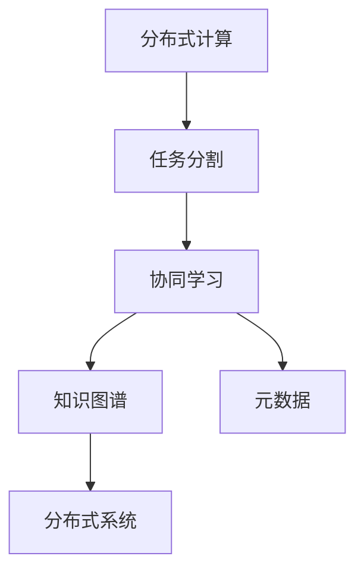

                 

# 分布式认知：人类计算的新视角

## 1. 背景介绍

### 1.1 问题由来

在信息爆炸的时代，我们面临着前所未有的数据量。从互联网、社交媒体到物联网、人工智能，每天产生的数据量已经超出了传统计算系统的处理能力。与此同时，人类的计算能力却显得相对滞后，无法有效应对海量的数据处理需求。如何在现有的计算能力基础上，更高效地利用人类智慧，成为当前亟需解决的问题。

### 1.2 问题核心关键点

分布式认知（Distributed Cognition），是指将复杂的计算任务分布到多个节点上进行协作处理，利用集体的智慧来加速计算过程。其核心思想在于，将单一节点的计算任务进行分割，分配给多个节点同时处理，通过节点间的通信和协作，实现计算任务的并行化。

分布式认知的提出，为我们提供了处理大规模计算任务的新视角。它结合了传统计算机处理逻辑和人类认知能力的优势，能够在处理复杂、耗时的任务时，充分发挥人类的智慧和经验。

### 1.3 问题研究意义

分布式认知技术具有以下重要意义：

1. **提升计算效率**：通过分布式计算，可以将单一节点难以承受的大规模计算任务，分解成多个小任务，由多个节点并行处理，大大提升计算效率。
2. **增强决策质量**：利用多节点间的协作和交流，可以整合不同节点的知识和经验，提供更加全面、准确的决策支持。
3. **推动创新应用**：分布式认知技术可以应用于各种领域，如金融、医疗、物流、教育等，推动各行业的数字化转型升级。
4. **促进协作学习**：分布式认知鼓励节点间的知识共享和协作，促进团队的集体智慧和创新能力的提升。

## 2. 核心概念与联系

### 2.1 核心概念概述

分布式认知涉及多个核心概念，主要包括：

- **分布式计算（Distributed Computing）**：将计算任务分配给多个节点同时处理，利用并行计算提高效率。
- **协同学习（Collaborative Learning）**：多个节点共享知识和经验，通过协作学习提升计算能力。
- **任务分割（Task Segmentation）**：将复杂任务分解成多个小任务，由不同节点并行处理。
- **知识图谱（Knowledge Graph）**：将知识结构化存储，方便节点间的知识共享和协作。
- **元数据（Metadata）**：记录任务的详细信息，如任务目标、输入输出、节点状态等，便于节点间的沟通和协作。
- **分布式系统（Distributed System）**：实现节点间的数据共享和通信，包括消息传递、同步机制、容错处理等。

这些核心概念之间的逻辑关系可以通过以下Mermaid流程图来展示：



这个流程图展示了大语言模型的核心概念及其之间的关系：

1. 分布式计算将复杂任务分解成小任务，由不同节点并行处理。
2. 协同学习使节点间共享知识和经验，提升整体计算能力。
3. 知识图谱为节点间的协作提供知识结构化支持。
4. 元数据记录任务的详细信息，便于节点间通信协作。
5. 分布式系统实现节点间的通信和数据共享。

这些概念共同构成了分布式认知的计算框架，使其能够在各种复杂任务中发挥强大的处理能力。

## 3. 核心算法原理 & 具体操作步骤

### 3.1 算法原理概述

分布式认知的计算过程，可以概括为以下几个步骤：

1. **任务分割**：将复杂计算任务分解成多个小任务。
2. **节点分配**：将每个小任务分配给不同的节点进行并行处理。
3. **节点协作**：节点之间进行通信和协作，共享中间结果和计算资源。
4. **结果汇总**：将各节点计算结果汇总，得到最终的计算结果。

这一过程通常使用分布式计算框架（如Apache Spark、Hadoop等）来实现。分布式计算框架提供了一种通用的计算模型，可以方便地将计算任务分配到多个节点上，同时管理节点间的通信和数据交换。

### 3.2 算法步骤详解

以下以一个简单的分布式排序任务为例，详细说明分布式计算的步骤：

**Step 1: 任务分割**
假设有一个长度为 $N$ 的数组 $A$，需要对其进行排序。将数组 $A$ 分割成 $K$ 个长度为 $\frac{N}{K}$ 的子数组，分别分配给 $K$ 个节点进行排序。

**Step 2: 节点分配**
每个节点对分配到的子数组进行排序，得到排序后的结果 $B_1, B_2, \cdots, B_K$。

**Step 3: 节点协作**
节点之间进行通信，将排序后的结果 $B_i$ 发送给相邻节点 $i+1$。如果节点 $i$ 的输出为 $B_i$，则节点 $i+1$ 将其与 $B_i$ 中的元素进行归并排序，得到新的结果 $C_{i+1}$。重复这一过程，直到所有节点都完成归并排序。

**Step 4: 结果汇总**
最后，将各个节点的排序结果 $C_{1}, C_{2}, \cdots, C_{K}$ 进行归并，得到最终的排序结果 $C$。

### 3.3 算法优缺点

分布式认知具有以下优点：

1. **高效性**：通过并行计算，可以大大提升计算效率。
2. **扩展性**：分布式系统可以根据需要动态调整节点数，适应不同规模的任务。
3. **可靠性**：通过节点冗余和容错机制，可以提高系统的可靠性和鲁棒性。

同时，分布式认知也存在以下缺点：

1. **通信开销**：节点之间的通信开销较大，特别是对于小任务，通信开销可能超过计算开销。
2. **数据一致性**：节点间的协作和通信可能会引入数据不一致的问题，需要额外处理。
3. **复杂性**：分布式系统的设计和实现较为复杂，需要考虑通信协议、同步机制等问题。

### 3.4 算法应用领域

分布式认知技术已经在多个领域得到了广泛应用：

1. **大数据处理**：在处理海量数据时，分布式计算能够显著提升处理效率。
2. **人工智能**：在机器学习、深度学习等任务中，分布式计算可以加速模型训练和推理。
3. **金融计算**：在金融领域，分布式计算能够支持高频交易、风险管理等复杂计算任务。
4. **科学计算**：在气候模拟、生物信息学等科学计算任务中，分布式计算能够提供强大的计算支持。
5. **社交网络分析**：在社交网络分析中，分布式计算能够处理大规模的社会关系数据，提供深入的社交网络洞察。

## 4. 数学模型和公式 & 详细讲解

### 4.1 数学模型构建

分布式认知的数学模型可以形式化表示为：

$$
C = \bigcup_{i=1}^K C_i
$$

其中 $C$ 为最终的计算结果，$C_i$ 为节点 $i$ 的计算结果。假设节点 $i$ 的计算结果为 $C_i = f_i(A_i)$，则最终的计算结果为：

$$
C = \bigcup_{i=1}^K f_i(A_i)
$$

### 4.2 公式推导过程

以简单的分布式排序任务为例，推导计算过程的数学公式：

1. **任务分割**：假设将长度为 $N$ 的数组 $A$ 分割成 $K$ 个子数组，每个子数组的长度为 $\frac{N}{K}$。设子数组 $A_i$ 的排序结果为 $B_i$，则有：

$$
B_i = \text{Sort}(A_i)
$$

2. **节点协作**：节点之间进行通信和协作，将排序后的结果 $B_i$ 发送给相邻节点 $i+1$，并对 $B_i$ 进行归并排序，得到新的结果 $C_{i+1}$：

$$
C_{i+1} = \text{MergeSort}(B_i, B_{i+1})
$$

3. **结果汇总**：将各个节点的排序结果 $C_{1}, C_{2}, \cdots, C_{K}$ 进行归并，得到最终的排序结果 $C$：

$$
C = \text{Merge}(C_1, C_2, \cdots, C_K)
$$

通过以上公式，可以清晰地看到分布式排序任务的具体计算过程。在实际应用中，具体的函数形式和通信协议需要根据具体的任务和分布式系统进行设计和实现。

### 4.3 案例分析与讲解

以一个实际的案例来说明分布式认知的计算过程：

假设有一个长度为 $N=1,000,000$ 的数组 $A$，需要对其进行排序。将数组 $A$ 分割成 $K=10$ 个长度为 $\frac{N}{K}=100,000$ 的子数组，分配给 $K$ 个节点进行排序。每个节点对分配到的子数组进行排序，得到排序后的结果 $B_1, B_2, \cdots, B_{10}$。节点之间进行通信和协作，将排序后的结果 $B_i$ 发送给相邻节点 $i+1$，并对 $B_i$ 进行归并排序，得到新的结果 $C_{i+1}$。最后，将各个节点的排序结果 $C_{1}, C_{2}, \cdots, C_{10}$ 进行归并，得到最终的排序结果 $C$。

## 5. 项目实践：代码实例和详细解释说明

### 5.1 开发环境搭建

在进行分布式认知的实践前，我们需要准备好开发环境。以下是使用Python进行PyTorch开发的环境配置流程：

1. 安装Anaconda：从官网下载并安装Anaconda，用于创建独立的Python环境。

2. 创建并激活虚拟环境：
```bash
conda create -n pytorch-env python=3.8 
conda activate pytorch-env
```

3. 安装PyTorch：根据CUDA版本，从官网获取对应的安装命令。例如：
```bash
conda install pytorch torchvision torchaudio cudatoolkit=11.1 -c pytorch -c conda-forge
```

4. 安装TensorFlow：由Google主导开发的开源深度学习框架，生产部署方便，适合大规模工程应用。同样有丰富的预训练语言模型资源。

5. 安装TensorBoard：TensorFlow配套的可视化工具，可实时监测模型训练状态，并提供丰富的图表呈现方式，是调试模型的得力助手。

6. 安装Weights & Biases：模型训练的实验跟踪工具，可以记录和可视化模型训练过程中的各项指标，方便对比和调优。与主流深度学习框架无缝集成。

完成上述步骤后，即可在`pytorch-env`环境中开始分布式计算实践。

### 5.2 源代码详细实现

以下是一个使用PyTorch实现分布式排序的代码示例：

```python
import torch
import torch.distributed as dist

# 初始化分布式环境
dist.init_process_group("gloo", rank=0, world_size=4)

# 分割数组
N = 1000000
chunk_size = N // dist.get_world_size()
A = torch.randn(N).div_(10)
A_chunk = A.chunk(dist.get_world_size(), dim=0)

# 进行排序
def local_sort(A):
    return torch.sort(A)[1]

# 节点协作排序
C = []
for A_i in A_chunk:
    C_i = local_sort(A_i)
    C.append(C_i)

# 结果汇总
C = torch.cat(C)

# 关闭分布式环境
dist.destroy_process_group()
```

在以上代码中，我们首先使用PyTorch的`dist`模块初始化分布式环境，将数组 $A$ 分割成多个子数组，分别在每个节点上进行排序。最后，将各个节点的排序结果进行归并，得到最终的排序结果 $C$。

### 5.3 代码解读与分析

让我们再详细解读一下关键代码的实现细节：

**分布式环境初始化**：
- `dist.init_process_group("gloo", rank=0, world_size=4)`：初始化分布式环境，指定通信协议为Gloo，节点编号为0，节点总数为4。

**数组分割**：
- `A.chunk(dist.get_world_size(), dim=0)`：将数组 $A$ 分割成多个子数组，分别分配给不同的节点。

**节点排序**：
- `local_sort(A_i)`：在每个节点上对分配到的子数组进行排序。

**结果汇总**：
- `torch.cat(C)`：将各个节点的排序结果进行归并，得到最终的排序结果。

**分布式环境关闭**：
- `dist.destroy_process_group()`：关闭分布式环境，释放资源。

可以看到，使用PyTorch进行分布式计算，可以很方便地实现节点间的通信和协作。通过简单的代码实现，我们便能够在多个节点上进行并行计算，提升计算效率。

## 6. 实际应用场景

### 6.1 智能城市管理

分布式认知技术在智能城市管理中具有广阔的应用前景。城市中的各种数据（如交通流量、环境监测、公共设施运行状态等）通常是异构、分散的，需要高效处理和实时分析。通过分布式计算，可以将这些数据进行统一处理，为城市管理提供决策支持。

例如，可以利用分布式计算对交通流量进行实时分析，预测交通拥堵情况，优化交通信号灯设置。通过分布式系统，还可以对城市环境进行实时监测，及时发现污染源，采取应对措施。

### 6.2 智慧医疗

在智慧医疗领域，分布式计算可以用于处理医疗影像数据、患者记录等大规模数据。通过分布式计算，可以快速分析和诊断医学影像，提升诊断准确性。同时，分布式系统还可以支持患者记录的实时存储和处理，为医疗决策提供数据支持。

例如，可以利用分布式计算对大量医疗影像数据进行并行处理，识别异常情况，提供辅助诊断。通过分布式系统，还可以对患者记录进行实时处理，提取关键信息，支持医生制定个性化治疗方案。

### 6.3 金融风险管理

在金融领域，分布式计算可以用于处理大规模交易数据、市场数据等。通过分布式计算，可以实时分析市场动态，预测风险，提供决策支持。同时，分布式系统还可以支持高频交易、算法交易等业务，提升交易效率。

例如，可以利用分布式计算对大量交易数据进行实时分析，识别异常交易，防止欺诈行为。通过分布式系统，还可以支持高频交易，提升交易效率和响应速度。

### 6.4 未来应用展望

随着分布式计算技术的不断发展，分布式认知将在更多领域得到应用，为各行各业带来变革性影响。

1. **工业生产优化**：分布式计算可以用于处理工业生产中的大数据，优化生产流程，提高生产效率。
2. **科学研究**：分布式计算可以支持大规模科学计算任务，如气候模拟、生物信息学等，推动科学研究的进步。
3. **社会治理**：分布式计算可以用于处理社会治理中的大量数据，支持社会治安、公共安全等任务，提升社会治理水平。
4. **教育培训**：分布式计算可以用于处理教育培训中的大数据，支持个性化学习、教育资源共享等任务，提升教育培训效果。

分布式认知技术的发展，将进一步推动各行业的数字化转型升级，为社会带来更多创新应用。

## 7. 工具和资源推荐

### 7.1 学习资源推荐

为了帮助开发者系统掌握分布式认知的理论基础和实践技巧，这里推荐一些优质的学习资源：

1. 《分布式计算与并行算法》系列博文：深入浅出地介绍了分布式计算的基本原理和经典算法，包括MapReduce、Gloo等。

2. 《分布式系统理论与实践》课程：斯坦福大学开设的分布式系统课程，涵盖了分布式计算、分布式存储、分布式通信等核心内容。

3. 《分布式计算与大数据》书籍：全面介绍了分布式计算和大数据的基本概念和经典算法，适合初学者学习。

4. Hadoop官方文档：Apache Hadoop的官方文档，提供了丰富的分布式计算资源和实践样例。

5. PyTorch官方文档：PyTorch的官方文档，提供了详细的分布式计算和并行计算教程。

通过对这些资源的学习实践，相信你一定能够快速掌握分布式认知的精髓，并用于解决实际的计算问题。

### 7.2 开发工具推荐

高效的开发离不开优秀的工具支持。以下是几款用于分布式计算开发的常用工具：

1. PyTorch：基于Python的开源深度学习框架，支持分布式计算，灵活动态的计算图，适合快速迭代研究。

2. TensorFlow：由Google主导开发的开源深度学习框架，生产部署方便，适合大规模工程应用。

3. Apache Hadoop：Apache基金会开源的分布式计算框架，支持大规模数据处理和存储。

4. Apache Spark：Apache基金会开源的大数据处理框架，支持分布式计算和机器学习。

5. MPI：用于高性能计算的分布式通信协议，支持大规模并行计算。

6. Dask：支持分布式计算的Python库，可以无缝集成到PyTorch和TensorFlow中。

合理利用这些工具，可以显著提升分布式计算的开发效率，加快创新迭代的步伐。

### 7.3 相关论文推荐

分布式认知技术的发展源于学界的持续研究。以下是几篇奠基性的相关论文，推荐阅读：

1. MapReduce: Simplified Data Processing on Large Clusters（MapReduce论文）：提出了MapReduce算法，为分布式计算提供了经典解决方案。

2. Pregel: A Commodity-Parallel Graph Processing System（Pregel论文）：介绍了Pregel系统，用于大规模图计算任务的分布式处理。

3. MPI: A Message-Passing Interface Standard（MPI论文）：介绍了MPI协议，支持高性能计算的分布式通信。

4. Hadoop: A Distributed File System（Hadoop论文）：介绍了Hadoop文件系统，支持大规模数据的分布式存储和处理。

5. Gloo: A Communication Framework for High Performance Distributed Computing（Gloo论文）：介绍了Gloo框架，支持分布式计算中的高性能通信。

这些论文代表了大语言模型微调技术的发展脉络。通过学习这些前沿成果，可以帮助研究者把握学科前进方向，激发更多的创新灵感。

## 8. 总结：未来发展趋势与挑战

### 8.1 总结

本文对分布式认知技术进行了全面系统的介绍。首先阐述了分布式认知技术的研究背景和意义，明确了分布式计算在提升计算效率、增强决策质量等方面的独特价值。其次，从原理到实践，详细讲解了分布式计算的数学原理和关键步骤，给出了分布式计算任务开发的完整代码实例。同时，本文还广泛探讨了分布式计算技术在智能城市、智慧医疗、金融风险管理等多个行业领域的应用前景，展示了分布式计算范式的巨大潜力。此外，本文精选了分布式计算技术的各类学习资源，力求为读者提供全方位的技术指引。

通过本文的系统梳理，可以看到，分布式认知技术正在成为大数据处理和计算任务的重要范式，极大地提升了计算能力和处理效率。受益于大规模数据和算力资源的不断积累，分布式计算技术必将在更多领域大放异彩，深刻影响人类社会的计算能力和信息处理能力。

### 8.2 未来发展趋势

展望未来，分布式认知技术将呈现以下几个发展趋势：

1. **计算能力持续提升**：随着算力成本的下降和数据规模的扩张，分布式计算能力将持续提升，支持更复杂的计算任务。

2. **计算模型多样化**：未来将涌现更多分布式计算模型，如Spark、Flink等，适应不同类型的数据处理任务。

3. **资源利用率优化**：通过优化任务分割和通信机制，进一步提升分布式计算的资源利用率，降低计算成本。

4. **跨领域应用拓展**：分布式计算技术将进一步拓展到更多领域，如医疗、金融、教育等，推动各行业的数字化转型升级。

5. **隐私和安全保护**：在分布式计算中，数据隐私和安全保护将变得尤为重要，需要通过多方安全计算等技术，保障数据安全。

6. **智能自动化**：利用机器学习和人工智能技术，实现分布式计算任务的自动化和智能化，提升计算效率和准确性。

以上趋势凸显了分布式认知技术的广阔前景。这些方向的探索发展，必将进一步提升计算系统的性能和应用范围，为人类社会带来更多创新应用。

### 8.3 面临的挑战

尽管分布式认知技术已经取得了显著进展，但在迈向更加智能化、普适化应用的过程中，它仍面临着诸多挑战：

1. **计算复杂性**：分布式计算任务通常涉及复杂的通信和数据同步，设计和实现较为复杂。
2. **数据一致性**：节点之间的通信和协作可能会引入数据不一致的问题，需要额外处理。
3. **系统可靠性**：分布式系统需要考虑节点冗余、容错机制等问题，系统可靠性有待提升。
4. **资源管理**：分布式系统中需要动态管理计算资源，避免资源浪费。
5. **算法优化**：分布式计算的算法设计和优化仍需进一步研究，提升计算效率和可扩展性。

### 8.4 研究展望

面对分布式认知面临的这些挑战，未来的研究需要在以下几个方面寻求新的突破：

1. **优化通信机制**：进一步优化节点之间的通信机制，降低通信开销，提升计算效率。
2. **改进数据同步**：设计更加高效的数据同步机制，解决数据一致性问题。
3. **增强系统可靠性**：引入容错和故障恢复机制，提高分布式系统的可靠性。
4. **支持自动化任务管理**：利用机器学习技术，实现分布式计算任务的自动化管理和调度。
5. **融合人工智能技术**：将人工智能技术引入分布式计算系统，实现智能调度、自适应任务分配等。

这些研究方向的探索，必将引领分布式认知技术迈向更高的台阶，为人类社会的计算能力和信息处理能力带来新的突破。

## 9. 附录：常见问题与解答

**Q1：分布式计算和并行计算有什么区别？**

A: 分布式计算和并行计算都是提升计算效率的方法，但它们的应用场景和技术细节有所不同。分布式计算通常指将计算任务分配到多个节点上进行协作处理，节点之间需要进行通信和数据交换。并行计算则指在一个节点上利用多核CPU或GPU等硬件资源，同时执行多个计算任务。

**Q2：分布式计算如何避免数据一致性问题？**

A: 数据一致性是分布式计算中的一个重要问题，需要通过以下方法避免：
1. 原子操作：使用分布式锁等机制，保证数据操作的原子性。
2. 同步机制：通过心跳检测、消息队列等机制，保证节点间的数据同步。
3. 冗余数据：通过数据冗余和复制，保证数据的高可用性和一致性。

**Q3：分布式计算的资源利用率如何提升？**

A: 分布式计算的资源利用率可以通过以下方法提升：
1. 动态任务调度：根据任务特性和系统负载，动态调整任务调度策略，优化资源利用率。
2. 负载均衡：通过负载均衡技术，将任务均匀地分配到各个节点上，避免资源浪费。
3. 资源共享：通过分布式文件系统等技术，实现节点间的数据共享和协作，提高资源利用率。

**Q4：分布式计算和云计算有什么不同？**

A: 分布式计算和云计算都是基于大规模计算资源进行分布式计算的技术，但它们的应用场景和实现方式有所不同。分布式计算侧重于计算任务的分散处理和协作，通常需要自定义计算模型和算法。云计算则侧重于计算资源的按需提供和弹性扩展，通常使用商业云平台进行部署和管理。

**Q5：分布式计算有哪些实际应用场景？**

A: 分布式计算已经在多个领域得到了广泛应用：
1. 大数据处理：处理大规模数据集，如海量日志、用户行为数据等。
2. 机器学习和深度学习：加速模型训练和推理，提升计算效率。
3. 科学计算：支持大规模科学计算任务，如气候模拟、生物信息学等。
4. 工业生产：优化生产流程，提高生产效率。
5. 社交网络分析：处理大规模社会关系数据，提供深入的社会分析洞察。

通过本文的系统梳理，可以看到，分布式认知技术正在成为大数据处理和计算任务的重要范式，极大地提升了计算能力和处理效率。受益于大规模数据和算力资源的不断积累，分布式计算技术必将在更多领域大放异彩，深刻影响人类社会的计算能力和信息处理能力。

---
作者：禅与计算机程序设计艺术 / Zen and the Art of Computer Programming

