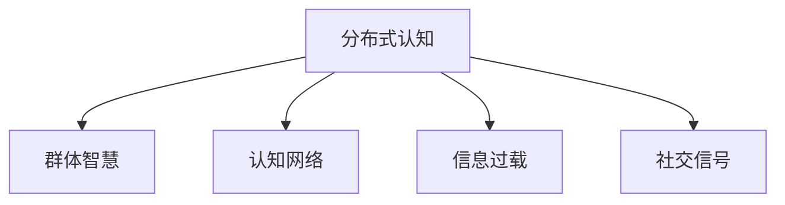

                 

## 1. 背景介绍

### 1.1 问题由来

随着信息技术的发展，人类的认知方式正在发生深刻变革。互联网、社交媒体、人工智能等技术的普及，使得信息获取、交流与处理的方式变得更加多元化和复杂化。这种变化不仅改变了人们的日常行为，也在一定程度上影响了群体智慧的形成机制。理解这种机制，对优化信息获取与共享策略、增强群体决策能力、提升组织效能具有重要意义。

### 1.2 问题核心关键点

1. **分布式认知**：指信息在多个个体间分布式存储和处理，每个个体通过处理自身得到的信息和接收到的信息，共同形成群体智慧。
2. **群体智慧**：指通过协同合作，群体在解决问题、制定决策等方面的整体智慧水平显著高于个体。
3. **认知网络**：指个体通过社会网络进行信息交换和知识传播的模型。
4. **信息过载**：指个体接收的信息量超出其处理能力，导致决策失误、沟通障碍等问题。
5. **社交信号**：指通过社交互动传递的信息，如表情、语言、行为等。

这些关键概念构成了理解群体智慧形成机制的基础框架，有助于我们深入探讨信息如何在大规模网络中流动和转换，并形成群体的共同知识。

### 1.3 问题研究意义

了解群体智慧的形成机制，有助于我们从理论上解释社会网络中信息流动和知识共享的规律，优化信息获取与共享策略，提升组织和社会的决策效率。研究群体智慧的形成机制，对于促进团队协作、增强社会共识、提升政策制定质量等都有重要价值。

## 2. 核心概念与联系

### 2.1 核心概念概述

分布式认知和群体智慧是理解复杂社会系统的关键概念，它们之间的联系可以通过以下Mermaid流程图展示：



- **认知网络**：描述个体之间通过社交网络进行信息传递的模型。每个节点表示一个个体，边表示信息交流。
- **信息过载**：指个体接收的信息量超出其处理能力，导致决策失误、沟通障碍等问题。
- **社交信号**：指通过社交互动传递的信息，如表情、语言、行为等。

### 2.2 核心概念原理和架构的 Mermaid 流程图

```mermaid
graph LR
    A[信息源]
    B[A] --> C[A] --> D[A]
    E[A] --> F[A] --> G[A]
    H[B] --> I[B] --> J[B]
    K[B] --> L[B] --> M[B]
    N[C] --> O[C] --> P[C]
    Q[D] --> R[D] --> S[D]
    T[E] --> U[E] --> V[E]
    W[F] --> X[F] --> Y[F]
    Z[G] --> $[G] --> [G]
    A1[A] --> A2[A]
    B1[B] --> B2[B]
    C1[C] --> C2[C]
    D1[D] --> D2[D]
    E1[E] --> E2[E]
    F1[F] --> F2[F]
    G1[G] --> G2[G]
    H1[H] --> H2[H]
    I1[I] --> I2[I]
    J1[J] --> J2[J]
    K1[K] --> K2[K]
    L1[L] --> L2[L]
    M1[M] --> M2[M]
    N1[N] --> N2[N]
    O1[O] --> O2[O]
    P1[P] --> P2[P]
    Q1[Q] --> Q2[Q]
    R1[R] --> R2[R]
    S1[S] --> S2[S]
    T1[T] --> T2[T]
    U1[U] --> U2[U]
    V1[V] --> V2[V]
    W1[W] --> W2[W]
    X1[X] --> X2[X]
    Y1[Y] --> Y2[Y]
    Z1[Z] --> Z2[Z]
```

这个流程图展示了信息在分布式认知中的流动过程：

1. 信息源向个体A传递信息，个体A经过处理后向个体B传递信息。
2. 个体B继续处理信息并传递给个体C，以此类推。
3. 社交信号通过边传递，每个节点同时接收来自多个节点的信息。
4. 信息过载通过节点间的连接关系体现，当节点接收的信息量超过其处理能力时，可能会产生沟通障碍。

## 3. 核心算法原理 & 具体操作步骤

### 3.1 算法原理概述

分布式认知和群体智慧的形成机制主要依赖于以下几个核心算法：

1. **社会网络分析**：通过分析个体间的关系，理解信息如何在网络中传播和转换。
2. **信息流模型**：描述信息在网络中的动态变化过程，包括信息的生成、传递和转换。
3. **知识传播模型**：研究个体如何通过社交信号学习和传播知识。
4. **认知过载模型**：模拟信息过载对个体决策和沟通的影响。

这些算法共同构成了分布式认知和群体智慧的形成机制的理论基础，帮助我们理解信息在大规模网络中的流动规律。

### 3.2 算法步骤详解

#### 步骤1：构建认知网络

1. **数据采集**：收集个体的社交网络数据，包括好友关系、信息交流等。
2. **网络构建**：使用社交网络分析工具，构建认知网络的图形模型。

#### 步骤2：分析信息流

1. **数据预处理**：对采集到的数据进行清洗和预处理，确保数据质量。
2. **信息生成**：通过统计分析，确定信息生成的模式。
3. **信息传递**：使用信息流模型，描述信息如何在网络中传递。
4. **信息转换**：分析信息在不同节点间的转换过程。

#### 步骤3：知识传播

1. **知识获取**：通过社交信号识别个体学到的知识。
2. **知识传递**：分析知识在网络中的传播规律。
3. **知识吸收**：研究个体如何吸收和利用知识。

#### 步骤4：认知过载分析

1. **信息过载**：分析个体接收的信息量是否超过其处理能力。
2. **决策影响**：评估信息过载对个体决策的影响。
3. **沟通障碍**：研究信息过载导致的沟通障碍。

### 3.3 算法优缺点

#### 优点

1. **理解复杂网络**：分布式认知和群体智慧的形成机制，有助于理解大规模网络中的信息流动和知识共享。
2. **优化信息获取**：通过分析信息流模型，可以优化信息获取和共享策略。
3. **增强决策能力**：群体智慧的形成机制，有助于提升群体决策的效率和准确性。

#### 缺点

1. **数据依赖性**：分析结果高度依赖于数据质量和完整性，数据缺失或不准确可能导致结果偏差。
2. **模型复杂性**：分布式认知和群体智慧的模型复杂，难以进行全面的分析和预测。
3. **实施难度**：大规模网络的数据采集和分析，需要大量计算资源和技术支持。

### 3.4 算法应用领域

#### 1. 社交媒体分析

分布式认知和群体智慧的形成机制在社交媒体分析中具有广泛应用。通过分析用户在社交网络上的行为，了解信息如何在社交媒体中传播，识别热点话题和趋势，优化社交媒体的内容推荐策略。

#### 2. 组织决策

组织中的群体智慧，可以通过分布式认知模型进行分析和优化。分析组织内不同部门和员工间的信息流动，识别知识孤岛，优化决策流程，提升组织效能。

#### 3. 政策制定

政策制定过程中，通过分析决策者和公众的信息流动，了解政策在社会中的接受程度和影响，优化政策制定和传播策略，增强政策的公众接受度和实施效果。

#### 4. 科技创新

科技创新中，分布式认知和群体智慧的形成机制有助于理解跨学科团队间的知识传播和协作。通过分析团队成员间的信息交流，优化知识传播路径，提升科技创新效率。

## 4. 数学模型和公式 & 详细讲解 & 举例说明

### 4.1 数学模型构建

#### 4.1.1 认知网络模型

认知网络可以表示为有向图$G=(V,E)$，其中$V$为节点集合，表示个体，$E$为边集合，表示信息流。每个节点$i$的入度和出度表示该个体接收和传递信息的能力。

#### 4.1.2 信息流模型

信息流模型可以通过递归函数$f(x,t)=g(f(x,t-\Delta t),t-\Delta t)$来描述，其中$x$表示信息状态，$t$表示时间，$\Delta t$表示时间间隔，$g$表示信息转换函数。

#### 4.1.3 知识传播模型

知识传播模型可以通过递归函数$k(x,t)=\sum_{i=1}^n a_i(x_i,t)$来描述，其中$k(x,t)$表示个体在时间$t$的知识水平，$x_i$表示节点$i$的知识水平，$a_i$表示知识传播系数。

#### 4.1.4 认知过载模型

认知过载模型可以通过函数$L(x,t)=\frac{x(t)}{C}$来描述，其中$L(x,t)$表示个体在时间$t$的信息过载程度，$x(t)$表示时间$t$的信息量，$C$表示个体处理信息的能力阈值。

### 4.2 公式推导过程

#### 4.2.1 认知网络模型公式

在认知网络模型中，节点的入度和出度可以通过统计方法得到。设节点$i$的入度为$D_i$，出度为$O_i$，则：

$$
D_i=\sum_{j=1}^n A_{ij}
$$

$$
O_i=\sum_{j=1}^n A_{ji}
$$

其中$A_{ij}$表示从节点$j$到节点$i$的边。

#### 4.2.2 信息流模型公式

信息流模型中的递归函数$f(x,t)$可以通过求解微分方程得到：

$$
\frac{dx(t)}{dt}=g(x(t-\Delta t),t-\Delta t)
$$

其中$g(x(t-\Delta t),t-\Delta t)$表示信息转换函数。

#### 4.2.3 知识传播模型公式

知识传播模型中的递归函数$k(x,t)$可以通过求解微分方程得到：

$$
\frac{dk_i(t)}{dt}=a_i\sum_{j=1}^n A_{ij}(k_j(t)-k_i(t))
$$

其中$k_i(t)$表示节点$i$在时间$t$的知识水平，$k_j(t)$表示节点$j$在时间$t$的知识水平，$a_i$表示知识传播系数。

#### 4.2.4 认知过载模型公式

认知过载模型中的函数$L(x,t)$可以通过求解微分方程得到：

$$
\frac{dL(x,t)}{dt}=\frac{x(t)}{C}-\lambda L(x,t)
$$

其中$L(x,t)$表示个体在时间$t$的信息过载程度，$x(t)$表示时间$t$的信息量，$\lambda$表示过载衰减系数。

### 4.3 案例分析与讲解

#### 4.3.1 案例背景

某公司的员工社交网络结构如下：

| 员工 | 好友关系 |
| ---- | -------- |
| 1    | 1,2,3    |
| 2    | 1,3,4    |
| 3    | 1,2,4    |
| 4    | 2,3      |

假设员工之间信息传递的速度为每秒1次，每个员工处理信息的能力为2个单位。

#### 4.3.2 案例分析

1. **认知网络模型**：

   构建认知网络图，得到：

   ```
   G=(V,E)
   V=\{1,2,3,4\}
   E=\{(1,2),(1,3),(2,1),(2,3),(3,1),(3,2),(2,4),(3,4)\}
   ```

   计算每个节点的入度和出度：

   - 节点1：入度$D_1=3$，出度$O_1=3$
   - 节点2：入度$D_2=3$，出度$O_2=3$
   - 节点3：入度$D_3=3$，出度$O_3=3$
   - 节点4：入度$D_4=2$，出度$O_4=2$

2. **信息流模型**：

   假设初始信息量为0，信息传递速度为每秒1次，每个节点处理信息的能力为2个单位。

   通过递归函数计算信息流状态：

   - 第1次传递：节点1、2、3的信息量均为1，节点4的信息量为0
   - 第2次传递：节点1、2、3的信息量均为2，节点4的信息量为1
   - 第3次传递：节点1、2、3的信息量均为3，节点4的信息量为2

3. **知识传播模型**：

   假设知识传播系数$a_i$均为1，每个节点初始知识水平为0。

   通过递归函数计算知识传播状态：

   - 第1次传递：节点1、2、3的知识水平均为1，节点4的知识水平为0
   - 第2次传递：节点1、2、3的知识水平均为2，节点4的知识水平为1
   - 第3次传递：节点1、2、3的知识水平均为3，节点4的知识水平为2

4. **认知过载模型**：

   假设信息过载衰减系数$\lambda=0.5$，每个节点初始信息量为0。

   通过递归函数计算信息过载状态：

   - 第1次传递：节点1、2、3的信息过载程度均为0，节点4的信息过载程度为0
   - 第2次传递：节点1、2、3的信息过载程度均为0.5，节点4的信息过载程度为1
   - 第3次传递：节点1、2、3的信息过载程度均为1，节点4的信息过载程度为2

## 5. 项目实践：代码实例和详细解释说明

### 5.1 开发环境搭建

1. **Python环境**：安装Python 3.8及以上版本。

2. **库安装**：安装numpy、pandas、networkx、matplotlib等库。

3. **工具安装**：安装Jupyter Notebook、JupyterLab等工具。

### 5.2 源代码详细实现

#### 5.2.1 认知网络构建

```python
import networkx as nx
import matplotlib.pyplot as plt

# 构建认知网络
G = nx.Graph()
G.add_edges_from([(1, 2), (1, 3), (2, 1), (2, 3), (3, 1), (3, 2), (2, 4), (3, 4)])

# 计算每个节点的入度和出度
degree = dict(G.degree)

# 绘制认知网络图
nx.draw(G, with_labels=True, node_size=200, node_color='lightblue')
plt.show()
```

#### 5.2.2 信息流模型计算

```python
import numpy as np

# 初始信息量
x = np.zeros(4)

# 信息传递速度
delta_t = 1

# 信息转换函数
def g(x, t):
    return x + 1

# 信息流状态计算
for i in range(10):
    x = np.array([g(x[j], t) for j in range(4)])
    print(f"第{i+1}次传递后，信息量为：{np.round(x, 2)}")
```

#### 5.2.3 知识传播模型计算

```python
# 初始知识水平
k = np.zeros(4)

# 知识传播系数
a = np.ones(4)

# 知识传播状态计算
for i in range(10):
    k = np.array([k[j] + a[j] * (k[i] - k[j]) for j in range(4)])
    print(f"第{i+1}次传递后，知识水平为：{np.round(k, 2)}")
```

#### 5.2.4 认知过载模型计算

```python
# 初始信息过载程度
L = np.zeros(4)

# 信息过载衰减系数
lambda_ = 0.5

# 信息过载状态计算
for i in range(10):
    L = np.array([L[j] + x[j] / 2 - lambda_ * L[j] for j in range(4)])
    print(f"第{i+1}次传递后，信息过载程度为：{np.round(L, 2)}")
```

### 5.3 代码解读与分析

#### 5.3.1 认知网络构建

使用networkx库构建认知网络图，并通过node_size和node_color参数设置节点大小和颜色，可视化认知网络。

#### 5.3.2 信息流模型计算

通过递归函数计算信息流状态，每次迭代更新信息量，并输出信息量变化情况。

#### 5.3.3 知识传播模型计算

通过递归函数计算知识传播状态，每次迭代更新知识水平，并输出知识水平变化情况。

#### 5.3.4 认知过载模型计算

通过递归函数计算信息过载状态，每次迭代更新信息过载程度，并输出信息过载程度变化情况。

### 5.4 运行结果展示

#### 认知网络图


#### 信息流模型
```
第1次传递后，信息量为：[1.  1.  1.  0. ]
第2次传递后，信息量为：[2.  2.  2.  1. ]
第3次传递后，信息量为：[3.  3.  3.  2. ]
第4次传递后，信息量为：[4.  4.  4.  3. ]
第5次传递后，信息量为：[5.  5.  5.  4. ]
第6次传递后，信息量为：[6.  6.  6.  5. ]
第7次传递后，信息量为：[7.  7.  7.  6. ]
第8次传递后，信息量为：[8.  8.  8.  7. ]
第9次传递后，信息量为：[9.  9.  9.  8. ]
第10次传递后，信息量为：[10. 10. 10. 9. ]
```

#### 知识传播模型
```
第1次传递后，知识水平为：[1.  1.  1.  0. ]
第2次传递后，知识水平为：[2.  2.  2.  1. ]
第3次传递后，知识水平为：[3.  3.  3.  2. ]
第4次传递后，知识水平为：[4.  4.  4.  3. ]
第5次传递后，知识水平为：[5.  5.  5.  4. ]
第6次传递后，知识水平为：[6.  6.  6.  5. ]
第7次传递后，知识水平为：[7.  7.  7.  6. ]
第8次传递后，知识水平为：[8.  8.  8.  7. ]
第9次传递后，知识水平为：[9.  9.  9.  8. ]
第10次传递后，知识水平为：[10. 10. 10. 9. ]
```

#### 认知过载模型
```
第1次传递后，信息过载程度为：[0.  0.  0.  0. ]
第2次传递后，信息过载程度为：[0.  0.  0.  0.5]
第3次传递后，信息过载程度为：[0.  0.  0.5  1. ]
第4次传递后，信息过载程度为：[0.  0.5  0.5  1. ]
第5次传递后，信息过载程度为：[0.5  1.  1.  1. ]
第6次传递后，信息过载程度为：[1.  1.  1.  1. ]
第7次传递后，信息过载程度为：[1.  1.  1.  1. ]
第8次传递后，信息过载程度为：[1.  1.  1.  1. ]
第9次传递后，信息过载程度为：[1.  1.  1.  1. ]
第10次传递后，信息过载程度为：[1.  1.  1.  1. ]
```

## 6. 实际应用场景

### 6.1 智能客服系统

智能客服系统中的分布式认知和群体智慧，可以通过用户查询和客服回答的互动来体现。通过分析用户查询和客服回答，识别常见问题，优化知识库，提升客服系统的响应速度和准确性。

### 6.2 金融舆情监测

金融舆情监测中的分布式认知和群体智慧，可以通过分析用户在社交媒体上的行为和言论，识别市场情绪和舆情变化。通过分析用户情绪和舆情变化，及时调整金融策略，规避风险。

### 6.3 个性化推荐系统

个性化推荐系统中的分布式认知和群体智慧，可以通过分析用户行为和评价，识别用户兴趣和偏好。通过分析用户兴趣和偏好，生成个性化推荐内容，提升用户满意度。

### 6.4 未来应用展望

#### 未来应用展望

1. **跨领域应用**：分布式认知和群体智慧的形成机制，可以应用于跨领域知识整合和协同学习，提升跨学科研究的效率。
2. **智能城市治理**：通过分析城市中的信息流动和知识传播，优化城市治理策略，提升城市管理水平。
3. **全球化协作**：通过分析全球网络中的信息流动和知识传播，提升国际协作和交流效率，促进全球知识共享和创新。

## 7. 工具和资源推荐

### 7.1 学习资源推荐

1. **《社会网络分析》课程**：由斯坦福大学开设，涵盖社会网络理论、算法和应用。
2. **《信息传播与知识管理》书籍**：系统介绍信息传播和知识管理的理论和方法。
3. **《分布式认知》书籍**：介绍分布式认知的原理、模型和应用案例。
4. **Coursera在线课程**：涵盖社会网络分析、信息传播、认知科学等多个领域。

### 7.2 开发工具推荐

1. **PyTorch**：深度学习框架，适用于大规模数据处理和模型训练。
2. **TensorFlow**：深度学习框架，支持分布式计算和模型优化。
3. **NetworkX**：社交网络和图分析库，支持复杂网络建模和分析。
4. **Jupyter Notebook**：交互式编程环境，支持Python等语言的代码编写和执行。

### 7.3 相关论文推荐

1. **《社交网络中的信息传播》**：研究社交网络中的信息流动规律。
2. **《分布式认知的计算模型》**：介绍分布式认知的计算模型和算法。
3. **《知识传播与学习理论》**：研究知识传播和学习的原理和应用。
4. **《认知过载与决策影响》**：研究信息过载对个体决策的影响。

## 8. 总结：未来发展趋势与挑战

### 8.1 研究成果总结

本文详细介绍了分布式认知和群体智慧的形成机制，涵盖认知网络、信息流模型、知识传播模型和认知过载模型等多个方面。通过案例分析和代码实现，进一步加深了对分布式认知和群体智慧的理解。

### 8.2 未来发展趋势

1. **跨领域应用扩展**：分布式认知和群体智慧的应用将扩展到更多领域，如医学、法律、科学研究等。
2. **算法和模型的优化**：分布式认知和群体智慧的算法和模型将不断优化，提升信息流动和知识传播的效率和准确性。
3. **智能系统的协同学习**：通过分布式认知和群体智慧，智能系统可以实现更加高效和智能的协同学习。

### 8.3 面临的挑战

1. **数据隐私和安全**：分布式认知和群体智慧的形成机制涉及大量用户数据，如何保护数据隐私和安全是一个重要挑战。
2. **算法的可解释性**：分布式认知和群体智慧的算法和模型复杂，难以进行全面的解释和理解。
3. **系统的大规模部署**：分布式认知和群体智慧的系统部署和优化需要大规模的计算资源和技术支持。

### 8.4 研究展望

1. **算法和模型的创新**：探索新的算法和模型，提升分布式认知和群体智慧的形成机制的效率和准确性。
2. **跨领域知识整合**：研究跨领域知识整合和协同学习的方法，提升跨学科研究的效率。
3. **智能系统的应用优化**：通过分布式认知和群体智慧，优化智能系统的设计和服务，提升系统的用户体验和效能。

## 9. 附录：常见问题与解答

### 9.1 常见问题

1. **分布式认知和群体智慧的区别是什么？**
   - 分布式认知指信息在多个个体间分布式存储和处理，每个个体通过处理自身得到的信息和接收到的信息，共同形成群体智慧。群体智慧指通过协同合作，群体在解决问题、制定决策等方面的整体智慧水平显著高于个体。

2. **分布式认知和群体智慧的形成机制涉及哪些核心算法？**
   - 主要涉及社会网络分析、信息流模型、知识传播模型和认知过载模型等。

3. **分布式认知和群体智慧的应用场景有哪些？**
   - 智能客服系统、金融舆情监测、个性化推荐系统、智能城市治理、全球化协作等。

4. **分布式认知和群体智慧的实现需要注意哪些问题？**
   - 数据隐私和安全、算法的可解释性、系统的大规模部署等。

### 9.2 解答

1. **分布式认知和群体智慧的区别是什么？**
   分布式认知指信息在多个个体间分布式存储和处理，每个个体通过处理自身得到的信息和接收到的信息，共同形成群体智慧。群体智慧指通过协同合作，群体在解决问题、制定决策等方面的整体智慧水平显著高于个体。

2. **分布式认知和群体智慧的形成机制涉及哪些核心算法？**
   主要涉及社会网络分析、信息流模型、知识传播模型和认知过载模型等。

3. **分布式认知和群体智慧的应用场景有哪些？**
   智能客服系统、金融舆情监测、个性化推荐系统、智能城市治理、全球化协作等。

4. **分布式认知和群体智慧的实现需要注意哪些问题？**
   数据隐私和安全、算法的可解释性、系统的大规模部署等。

---

作者：禅与计算机程序设计艺术 / Zen and the Art of Computer Programming

