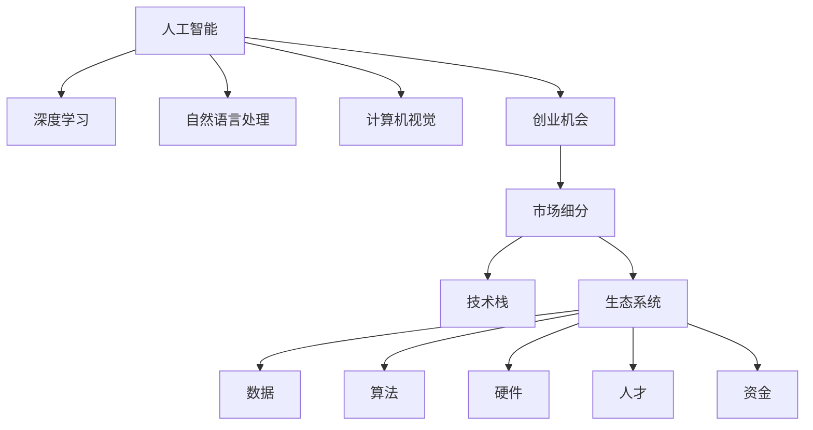

                 

## 1. 背景介绍

### 1.1 问题由来

近年来，人工智能（AI）技术的迅猛发展给全球经济和社会带来了深远的影响。AI的浪潮不仅在科技行业掀起巨大波澜，还引发了传统产业的变革，涌现出众多创业机会。创业者在这一波浪潮中，面临前所未有的挑战与机遇。

### 1.2 问题核心关键点

AI浪潮的核心关键点包括：
1. **数据驱动**：AI的发展离不开大规模的数据训练，数据成为竞争的关键。
2. **技术突破**：深度学习、计算机视觉、自然语言处理等技术的持续进步，推动了AI应用的广泛普及。
3. **应用落地**：AI技术正在从实验室走向实际应用，影响着各行各业。
4. **生态系统**：AI技术需要从算法到硬件、从开源到商业化的全方位生态支持。

### 1.3 问题研究意义

研究AI创业者在AI浪潮中的机会，对于理解AI技术发展的趋势，把握创业方向，加速AI技术在各行业的应用具有重要意义：

1. **理解市场需求**：了解不同行业对AI的需求，精准定位创业方向。
2. **掌握技术动向**：跟踪AI技术的前沿发展，保持技术领先性。
3. **降低创业风险**：明确创业中的技术、市场、生态等各方面风险，提高成功率。
4. **加速产业应用**：促进AI技术在各个行业中的落地，推动产业升级。
5. **赋能创业者**：提供AI创业的实战经验与指导，帮助创业者抓住机遇。

## 2. 核心概念与联系

### 2.1 核心概念概述

为了更好地理解AI创业者在AI浪潮中的机会，本文将介绍几个密切相关的核心概念：

- **人工智能（AI）**：一种通过计算机模拟人类智能的科学，包括学习、推理、感知、语言处理等能力。
- **深度学习（DL）**：一种基于神经网络的机器学习方法，通过多层次的特征提取和抽象，实现高精度的预测和分类。
- **自然语言处理（NLP）**：AI中的一种重要领域，关注如何让机器理解、处理和生成人类语言。
- **计算机视觉（CV）**：AI中的另一重要领域，旨在使计算机能够“看”和理解图像和视频。
- **创业机会**：指创业者在AI技术发展趋势中，结合自身优势和市场需求，发现并实现商业化的机会。
- **市场细分**：指根据市场需求和用户特征，将市场划分为多个细分市场，进行有针对性的创业。
- **技术栈**：指创业项目中所需的技术工具和平台，包括但不限于编程语言、框架、算法等。
- **生态系统**：指AI技术从研究到应用的整个链条，包括数据、算法、硬件、人才、资金等要素。

这些核心概念之间的逻辑关系可以通过以下Mermaid流程图来展示：



这个流程图展示了AI创业者在AI浪潮中的机会，以及与之相关的核心概念。

## 3. 核心算法原理 & 具体操作步骤

### 3.1 算法原理概述

AI创业者的机会来自于对AI技术的深刻理解和应用。本文重点探讨基于深度学习的AI创业项目，包括但不限于自然语言处理、计算机视觉、机器人等领域。

### 3.2 算法步骤详解

AI创业项目一般包括以下关键步骤：

**Step 1: 识别市场机会**

- 收集市场需求信息，分析用户痛点和需求。
- 评估目标市场的大小和增长潜力。
- 确定潜在的竞争者和市场空白。

**Step 2: 确定技术路线**

- 根据市场需求和技术趋势，选择合适的AI技术栈。
- 明确技术实现的关键算法和模型。
- 确定数据采集和预处理流程。

**Step 3: 构建产品原型**

- 开发初版产品，验证技术可行性。
- 收集用户反馈，进行产品迭代优化。
- 建立初步的商业模式和盈利模式。

**Step 4: 验证商业模式**

- 进行市场测试，收集用户数据和反馈。
- 调整产品功能和策略，提升用户体验。
- 寻找潜在的合作伙伴和投资者。

**Step 5: 拓展市场**

- 推广产品，建立品牌知名度。
- 扩大市场覆盖范围，增加用户规模。
- 持续优化产品和服务，保持市场竞争力。

### 3.3 算法优缺点

AI创业项目的优势包括：
1. **技术领先性**：结合前沿AI技术，提供高附加值的产品和服务。
2. **市场潜力**：AI应用广泛，市场需求大，发展前景广阔。
3. **创新空间**：AI技术发展迅速，提供广阔的创新机会。
4. **政策支持**：政府和企业对AI技术的重视，提供政策和经济支持。

但同时也存在一些挑战：
1. **高成本**：AI项目通常需要大量资金和技术投入，初期成本较高。
2. **技术门槛**：AI技术复杂，需要专业知识和技能。
3. **数据风险**：AI项目对数据的依赖性强，数据安全和隐私保护问题突出。
4. **市场竞争**：AI市场竞争激烈，需要持续创新和优化。
5. **伦理法律**：AI技术的应用涉及伦理和法律问题，需规范操作。

### 3.4 算法应用领域

AI创业项目可以广泛应用于各个行业，包括但不限于：

- **医疗健康**：AI辅助诊断、智能医疗、健康管理等。
- **金融科技**：智能投顾、风险管理、信用评估等。
- **教育培训**：个性化学习、智能辅导、教育管理等。
- **智能制造**：工业自动化、智能监控、质量检测等。
- **智能家居**：语音助手、智能安防、家庭管理等。
- **娱乐媒体**：智能推荐、内容创作、用户分析等。

## 4. 数学模型和公式 & 详细讲解 & 举例说明

### 4.1 数学模型构建

本文以自然语言处理（NLP）中的文本分类任务为例，构建基于深度学习的AI模型。

假设训练集为 $D = \{(x_i, y_i)\}_{i=1}^N$，其中 $x_i$ 为输入文本，$y_i \in \{0, 1\}$ 为分类标签。目标是构建一个二分类模型，使得模型能够准确预测新样本的分类结果。

### 4.2 公式推导过程

使用卷积神经网络（CNN）进行文本分类：

1. 输入层：将文本转换为向量表示。
2. 卷积层：提取局部特征，捕捉文本中的重要信息。
3. 池化层：对卷积层的输出进行降维，保留重要特征。
4. 全连接层：将池化层的输出转化为分类概率。
5. 输出层：根据分类概率预测分类标签。

模型训练过程包括：
1. 正向传播：计算模型预测结果。
2. 损失计算：计算预测结果与真实标签之间的差异。
3. 反向传播：计算损失对模型参数的梯度。
4. 参数更新：根据梯度更新模型参数，减小预测误差。

### 4.3 案例分析与讲解

以BERT模型为例，分析其在文本分类任务中的应用。

BERT模型是一种预训练语言模型，通过大规模无标签文本数据进行预训练，学习通用的语言表示。在进行文本分类任务时，首先使用BERT模型对文本进行编码，然后通过全连接层进行分类。

假设训练集为 $D = \{(x_i, y_i)\}_{i=1}^N$，其中 $x_i$ 为输入文本，$y_i \in \{0, 1\}$ 为分类标签。目标是构建一个二分类模型，使得模型能够准确预测新样本的分类结果。

1. 使用BERT模型对每个样本 $x_i$ 进行编码，得到文本表示 $h_i$。
2. 通过全连接层将 $h_i$ 映射为分类概率 $p_i$。
3. 计算损失函数 $L$，如交叉熵损失。
4. 通过反向传播计算梯度，更新BERT模型参数和全连接层参数。

## 5. 项目实践：代码实例和详细解释说明

### 5.1 开发环境搭建

要进行AI创业项目开发，需要准备好以下开发环境：

1. 安装Python和必要的依赖包，如TensorFlow、PyTorch等。
2. 准备数据集，包含训练集和测试集。
3. 搭建服务器和数据存储平台，保障数据安全和高效存储。
4. 设计开发流程和项目管理工具，确保开发过程高效有序。

### 5.2 源代码详细实现

以下是一个简单的基于TensorFlow的文本分类项目的代码实现：

```python
import tensorflow as tf
from tensorflow.keras import layers

# 构建模型
model = tf.keras.Sequential([
    layers.Embedding(input_dim=vocab_size, output_dim=embedding_dim),
    layers.Conv1D(filters=128, kernel_size=3, activation='relu'),
    layers.GlobalMaxPooling1D(),
    layers.Dense(units=1, activation='sigmoid')
])

# 编译模型
model.compile(optimizer='adam', loss='binary_crossentropy', metrics=['accuracy'])

# 训练模型
model.fit(x_train, y_train, epochs=10, batch_size=32)

# 评估模型
test_loss, test_acc = model.evaluate(x_test, y_test)
print(f'Test accuracy: {test_acc}')
```

### 5.3 代码解读与分析

这段代码实现了一个简单的卷积神经网络（CNN）文本分类模型。

- `Embedding`层将文本转换为向量表示。
- `Conv1D`层提取文本的局部特征。
- `GlobalMaxPooling1D`层对卷积层的输出进行降维，保留重要特征。
- `Dense`层将特征映射为分类概率。

在训练过程中，模型使用二分类交叉熵损失函数，并通过Adam优化器进行优化。

### 5.4 运行结果展示

训练完成后，可以在测试集上评估模型性能：

```python
test_loss, test_acc = model.evaluate(x_test, y_test)
print(f'Test accuracy: {test_acc}')
```

输出结果显示模型的测试准确率。

## 6. 实际应用场景

### 6.1 智能医疗

AI在医疗领域的应用前景广阔。例如，可以使用深度学习模型进行疾病诊断、影像分析、患者监测等。通过AI技术，可以提高医疗效率，降低误诊率，为患者提供更好的医疗服务。

### 6.2 金融科技

AI在金融领域的应用包括智能投顾、风险管理、信用评估等。通过AI技术，可以实现更精准的投资决策，降低金融风险，提高金融服务质量。

### 6.3 教育培训

AI在教育领域的应用包括个性化学习、智能辅导、教育管理等。通过AI技术，可以提供更符合学生需求的个性化学习方案，提升教学效果，优化教育资源配置。

### 6.4 智能制造

AI在制造业的应用包括工业自动化、智能监控、质量检测等。通过AI技术，可以实现自动化生产，提高生产效率，降低生产成本，提升产品质量。

### 6.5 智能家居

AI在智能家居领域的应用包括语音助手、智能安防、家庭管理等。通过AI技术，可以实现家庭智能化，提升生活质量，提高家庭安全。

### 6.6 娱乐媒体

AI在娱乐媒体领域的应用包括智能推荐、内容创作、用户分析等。通过AI技术，可以提供更精准的内容推荐，提高用户满意度，提升广告效果。

## 7. 工具和资源推荐

### 7.1 学习资源推荐

1. **《Deep Learning》**：Ian Goodfellow等著，系统介绍了深度学习的基本概念和算法。
2. **Coursera《Machine Learning》**：Andrew Ng主讲，介绍机器学习和深度学习的基本原理。
3. **Google AI Blog**：谷歌AI团队发布的博客，涵盖最新的AI技术和应用。
4. **Arxiv**：学术论文数据库，获取最新的AI研究进展。
5. **Kaggle**：数据科学竞赛平台，提供丰富的数据集和比赛机会。

### 7.2 开发工具推荐

1. **PyTorch**：深度学习框架，简单易用，支持动态图和静态图。
2. **TensorFlow**：深度学习框架，支持分布式训练和模型部署。
3. **Scikit-learn**：机器学习库，提供了丰富的机器学习算法和工具。
4. **Jupyter Notebook**：开发环境，支持多种编程语言和数据处理工具。
5. **Git**：版本控制工具，用于管理和协作开发项目。

### 7.3 相关论文推荐

1. **ImageNet Classification with Deep Convolutional Neural Networks**：Alex Krizhevsky等著，介绍了CNN在图像分类任务中的应用。
2. **Attention is All You Need**：Ashish Vaswani等著，介绍了Transformer在自然语言处理中的应用。
3. **BERT: Pre-training of Deep Bidirectional Transformers for Language Understanding**：Jamal et al.，介绍了BERT在自然语言处理中的预训练方法。
4. **TensorFlow: A System for Large-Scale Machine Learning**：Martín Abadi等著，介绍了TensorFlow在深度学习中的应用。

## 8. 总结：未来发展趋势与挑战

### 8.1 研究成果总结

AI技术在各个领域的应用不断深化，推动了产业升级和经济增长。AI创业者在这一波浪潮中，应该抓住机遇，利用先进技术，提供高附加值的产品和服务。

### 8.2 未来发展趋势

1. **技术普及**：AI技术将进一步普及，更多行业和领域将引入AI应用。
2. **智能化转型**：各行各业将加速智能化转型，提高效率和竞争力。
3. **跨界融合**：AI与其他领域的融合将更加紧密，推动更多创新应用。
4. **可持续发展**：AI技术将更加注重环保和可持续发展，推动绿色经济。
5. **全球合作**：国际合作将更加紧密，推动AI技术全球共享。

### 8.3 面临的挑战

1. **技术复杂性**：AI技术复杂，需要持续学习和实践。
2. **数据安全**：AI项目对数据依赖性强，数据安全问题突出。
3. **伦理法律**：AI技术的应用涉及伦理和法律问题，需规范操作。
4. **市场竞争**：AI市场竞争激烈，需要持续创新和优化。
5. **政策监管**：政府对AI技术的监管政策将影响其发展。

### 8.4 研究展望

未来的AI研究将更加注重技术创新、应用落地、伦理法律等方面的挑战，推动AI技术健康发展。AI创业者需要持续学习，关注技术动态，把握市场趋势，积极应对挑战，抓住机遇，实现可持续发展。

## 9. 附录：常见问题与解答

**Q1: AI技术对行业的影响是什么？**

A: AI技术对各行业的影响包括：提高效率、降低成本、优化决策、提升服务质量等。

**Q2: 创业项目需要哪些核心技术？**

A: 创业项目需要具备以下核心技术：深度学习、计算机视觉、自然语言处理、数据工程、软件工程等。

**Q3: AI项目的开发流程是怎样的？**

A: AI项目的开发流程包括：需求分析、数据准备、模型训练、模型优化、产品部署等。

**Q4: AI技术在应用过程中需要注意哪些伦理问题？**

A: AI技术在应用过程中需要注意隐私保护、数据安全、算法透明、公平性等问题。

**Q5: AI创业项目如何寻找投资？**

A: AI创业项目可以通过参加创业比赛、申请政府资助、寻找天使投资人、申请风投等方式寻找投资。

---

作者：禅与计算机程序设计艺术 / Zen and the Art of Computer Programming

