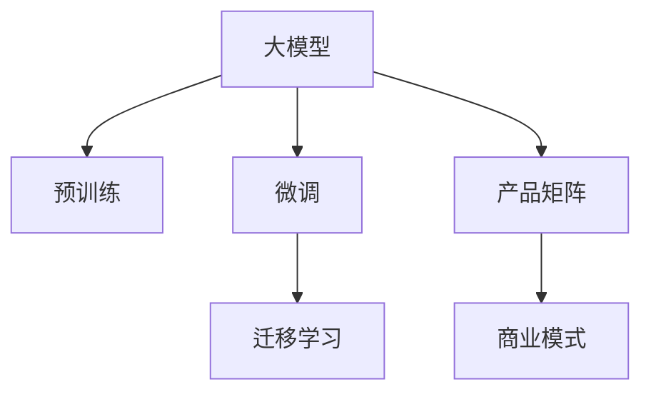

                 

# 创业者探索大模型新商业模式，打造AI产品矩阵

> 关键词：大模型, 商业创新, 产品矩阵, AI, 创业, 数据驱动, 人工智能商业化

## 1. 背景介绍

### 1.1 问题由来

在过去几年里，人工智能技术，尤其是基于大模型的AI技术，迅速崛起，已经对各行各业产生了深远的影响。从医疗诊断、金融预测，到智能客服、自动驾驶，人工智能正在各个领域释放出巨大的价值。然而，尽管AI技术逐渐成熟，但如何将这些技术转化为实际应用，并实现商业化落地，仍是一个重要的课题。

大模型，尤其是预训练语言模型如BERT、GPT等，具有强大的通用语言理解和生成能力，为自然语言处理（NLP）等领域的创新提供了坚实的基础。随着技术的不断发展，越来越多的创业者开始关注如何利用大模型，打造智能化的产品矩阵，提升业务效率，优化用户体验。

### 1.2 问题核心关键点

对于创业者来说，如何探索大模型的新商业模式，并构建有效的AI产品矩阵，成为迈向成功的关键。主要包括以下几个方面：

1. **数据驱动的创新**：充分利用大模型的语言理解能力，挖掘数据中的隐藏价值，为业务决策提供支撑。
2. **智能化产品矩阵**：根据不同的应用场景，开发多个智能产品，形成矩阵化的产品布局。
3. **高效商业化策略**：通过合理的商业模式设计和运营策略，确保产品快速落地和市场推广。
4. **用户体验优化**：提升产品的智能化程度，实现人机互动，满足用户的多样化需求。
5. **持续迭代与优化**：持续收集用户反馈，不断优化产品功能，提升模型性能。

## 2. 核心概念与联系

### 2.1 核心概念概述

为更好地理解大模型在新商业模式中的作用，本节将介绍几个密切相关的核心概念：

- **大模型（Large Model）**：如BERT、GPT等，基于大规模数据预训练得到的通用语言模型，具有强大的语言理解和生成能力。
- **预训练（Pre-training）**：在大规模无标签数据上，通过自监督任务训练模型的过程。预训练使得模型学习到丰富的语言知识。
- **迁移学习（Transfer Learning）**：将一个领域学到的知识，迁移应用到另一个领域的学习范式。大模型的预训练-微调过程即是一种典型的迁移学习方式。
- **微调（Fine-tuning）**：在预训练模型的基础上，使用下游任务的少量标注数据，通过有监督学习优化模型在特定任务上的性能。
- **产品矩阵（Product Portfolio）**：根据不同应用场景，开发多个智能化产品，形成系统化的产品布局。
- **商业模式（Business Model）**：通过合理的商业模式设计，确保产品快速落地和市场推广。

这些核心概念之间的逻辑关系可以通过以下Mermaid流程图来展示：



这个流程图展示了大模型的核心概念及其之间的关系：

1. 大模型通过预训练获得基础能力。
2. 微调是在预训练模型上进行特定任务优化的过程。
3. 迁移学习是连接预训练模型与下游任务的桥梁。
4. 产品矩阵是根据不同应用场景开发的多个智能化产品。
5. 商业模式是基于产品矩阵的合理设计，确保商业化落地。

## 3. 核心算法原理 & 具体操作步骤

### 3.1 算法原理概述

大模型在商业化应用中，主要通过预训练和微调两个步骤，实现其在特定任务上的性能提升。具体来说，大模型首先在大规模无标签数据上进行预训练，学习到通用的语言表示。然后，在特定任务上，通过微调，进一步优化模型参数，使其更好地适应任务需求。

在微调过程中，通常会选择下游任务的少量标注数据，使用有监督学习的方式，最小化模型在任务上的损失。常见的损失函数包括交叉熵损失、均方误差损失等。微调的目标是通过优化模型参数，使得模型在特定任务上的预测结果与真实标签尽可能接近。

### 3.2 算法步骤详解

基于大模型的商业化应用，通常包含以下关键步骤：

**Step 1: 数据准备与预训练模型选择**
- 收集与目标任务相关的数据集，并进行预处理。
- 选择合适的预训练模型，如BERT、GPT等，作为初始化参数。

**Step 2: 任务适配层设计**
- 根据目标任务，设计合适的输出层和损失函数。
- 对于分类任务，通常使用线性分类器和交叉熵损失函数。
- 对于生成任务，通常使用语言模型的解码器输出概率分布，并以负对数似然为损失函数。

**Step 3: 微调超参数设置**
- 选择合适的优化算法及其参数，如AdamW、SGD等，设置学习率、批大小、迭代轮数等。
- 设置正则化技术及强度，包括权重衰减、Dropout、Early Stopping等。
- 确定冻结预训练参数的策略，如仅微调顶层，或全部参数都参与微调。

**Step 4: 模型训练与评估**
- 将训练集数据分批次输入模型，前向传播计算损失函数。
- 反向传播计算参数梯度，根据设定的优化算法和学习率更新模型参数。
- 周期性在验证集上评估模型性能，根据性能指标决定是否触发 Early Stopping。
- 重复上述步骤直到满足预设的迭代轮数或 Early Stopping 条件。

**Step 5: 产品矩阵构建与商业化**
- 根据模型在各个任务上的表现，设计不同的产品，形成产品矩阵。
- 选择适合各产品的商业模式，如SaaS、API服务、订阅服务等。
- 进行市场推广和用户反馈收集，持续优化产品功能，提升模型性能。

### 3.3 算法优缺点

基于大模型的商业化应用具有以下优点：

1. **高效性与低成本**：利用大模型的预训练能力，可以快速构建智能化产品，降低开发成本。
2. **泛化能力强**：大模型通过预训练学习到丰富的语言知识，在不同任务上具有较强的泛化能力。
3. **灵活性高**：通过微调，可以在不增加模型参数量的情况下，优化特定任务上的性能。

同时，也存在一些局限性：

1. **依赖标注数据**：微调需要大量的标注数据，收集和标注成本较高。
2. **模型复杂度**：大模型的复杂度较高，对计算资源和存储资源有较高要求。
3. **可解释性不足**：大模型的决策过程缺乏可解释性，难以调试和优化。
4. **数据隐私风险**：在使用用户数据进行微调时，需要关注数据隐私和安全问题。

尽管存在这些局限性，但基于大模型的商业化应用，仍是大数据时代的重要趋势，尤其是在NLP等自然语言处理领域。

### 3.4 算法应用领域

基于大模型的商业化应用，已经广泛应用于多个领域，包括但不限于：

1. **智能客服**：使用预训练的对话模型，构建智能客服系统，提升客户服务效率。
2. **金融风控**：利用大模型进行文本分类、情感分析等任务，提升金融风险识别和防控能力。
3. **医疗健康**：利用大模型进行自然语言理解、疾病预测等任务，改善医疗服务质量。
4. **教育培训**：构建智能学习助手，根据学生的学习行为，提供个性化的学习建议。
5. **媒体内容推荐**：利用大模型进行文本生成、内容推荐等任务，提升用户使用体验。
6. **智能制造**：使用大模型进行设备维护、质量检测等任务，提高生产效率和产品品质。

## 4. 数学模型和公式 & 详细讲解 & 举例说明

### 4.1 数学模型构建

在商业化应用中，通常会使用大模型进行自然语言处理任务，如分类、匹配、生成等。这里以文本分类任务为例，构建大模型的数学模型。

记大模型为 $M_{\theta}$，其中 $\theta$ 为模型参数。假设训练集为 $D=\{(x_i,y_i)\}_{i=1}^N$，其中 $x_i$ 为输入文本，$y_i$ 为对应的分类标签。

定义模型在数据样本 $(x,y)$ 上的损失函数为 $\ell(M_{\theta}(x),y)$，则在数据集 $D$ 上的经验风险为：

$$
\mathcal{L}(\theta) = \frac{1}{N} \sum_{i=1}^N \ell(M_{\theta}(x_i),y_i)
$$

微调的目标是最小化经验风险，即找到最优参数：

$$
\theta^* = \mathop{\arg\min}_{\theta} \mathcal{L}(\theta)
$$

在实践中，我们通常使用基于梯度的优化算法（如SGD、Adam等）来近似求解上述最优化问题。设 $\eta$ 为学习率，$\lambda$ 为正则化系数，则参数的更新公式为：

$$
\theta \leftarrow \theta - \eta \nabla_{\theta}\mathcal{L}(\theta) - \eta\lambda\theta
$$

其中 $\nabla_{\theta}\mathcal{L}(\theta)$ 为损失函数对参数 $\theta$ 的梯度，可通过反向传播算法高效计算。

### 4.2 公式推导过程

以下我们以二分类任务为例，推导交叉熵损失函数及其梯度的计算公式。

假设模型 $M_{\theta}$ 在输入 $x$ 上的输出为 $\hat{y}=M_{\theta}(x) \in [0,1]$，表示样本属于正类的概率。真实标签 $y \in \{0,1\}$。则二分类交叉熵损失函数定义为：

$$
\ell(M_{\theta}(x),y) = -[y\log \hat{y} + (1-y)\log (1-\hat{y})]
$$

将其代入经验风险公式，得：

$$
\mathcal{L}(\theta) = -\frac{1}{N}\sum_{i=1}^N [y_i\log M_{\theta}(x_i)+(1-y_i)\log(1-M_{\theta}(x_i))]
$$

根据链式法则，损失函数对参数 $\theta_k$ 的梯度为：

$$
\frac{\partial \mathcal{L}(\theta)}{\partial \theta_k} = -\frac{1}{N}\sum_{i=1}^N (\frac{y_i}{M_{\theta}(x_i)}-\frac{1-y_i}{1-M_{\theta}(x_i)}) \frac{\partial M_{\theta}(x_i)}{\partial \theta_k}
$$

其中 $\frac{\partial M_{\theta}(x_i)}{\partial \theta_k}$ 可进一步递归展开，利用自动微分技术完成计算。

在得到损失函数的梯度后，即可带入参数更新公式，完成模型的迭代优化。重复上述过程直至收敛，最终得到适应下游任务的最优模型参数 $\theta^*$。

### 4.3 案例分析与讲解

以智能客服系统为例，说明大模型在商业化应用中的具体实现过程。

首先，收集历史客服对话记录，将其分为问答对，标注为具体的问题和答案。使用这些问答对作为监督数据，构建一个二分类模型，预测输入文本属于哪一个问题。

在模型训练过程中，选择BERT作为预训练模型，使用交叉熵损失函数。训练时，将文本输入BERT模型，通过softmax输出层得到每个问题的概率分布，然后将其与真实问题进行对比，计算损失并反向传播更新模型参数。

在模型评估时，使用另一组未见过的问答对进行测试，计算准确率和召回率等指标，评估模型的性能。如果模型表现不佳，可以返回训练阶段进行进一步优化。

## 5. 项目实践：代码实例和详细解释说明

### 5.1 开发环境搭建

在进行大模型商业化应用时，需要准备好开发环境。以下是使用Python进行PyTorch开发的环境配置流程：

1. 安装Anaconda：从官网下载并安装Anaconda，用于创建独立的Python环境。

2. 创建并激活虚拟环境：
```bash
conda create -n pytorch-env python=3.8 
conda activate pytorch-env
```

3. 安装PyTorch：根据CUDA版本，从官网获取对应的安装命令。例如：
```bash
conda install pytorch torchvision torchaudio cudatoolkit=11.1 -c pytorch -c conda-forge
```

4. 安装Transformers库：
```bash
pip install transformers
```

5. 安装各类工具包：
```bash
pip install numpy pandas scikit-learn matplotlib tqdm jupyter notebook ipython
```

完成上述步骤后，即可在`pytorch-env`环境中开始商业化应用实践。

### 5.2 源代码详细实现

这里我们以智能客服系统为例，给出使用Transformers库对BERT模型进行商业化应用的PyTorch代码实现。

首先，定义智能客服系统的数据处理函数：

```python
from transformers import BertTokenizer
from torch.utils.data import Dataset
import torch

class ChatDataset(Dataset):
    def __init__(self, texts, answers, tokenizer, max_len=128):
        self.texts = texts
        self.answers = answers
        self.tokenizer = tokenizer
        self.max_len = max_len
        
    def __len__(self):
        return len(self.texts)
    
    def __getitem__(self, item):
        text = self.texts[item]
        answer = self.answers[item]
        
        encoding = self.tokenizer(text, return_tensors='pt', max_length=self.max_len, padding='max_length', truncation=True)
        input_ids = encoding['input_ids'][0]
        attention_mask = encoding['attention_mask'][0]
        
        # 对token-wise的标签进行编码
        encoded_answers = [tokenizer.vocab.stoi[answer] for answer in answer] 
        encoded_answers.extend([tokenizer.vocab.stoi['O']] * (self.max_len - len(encoded_answers)))
        labels = torch.tensor(encoded_answers, dtype=torch.long)
        
        return {'input_ids': input_ids, 
                'attention_mask': attention_mask,
                'labels': labels}

# 创建dataset
tokenizer = BertTokenizer.from_pretrained('bert-base-cased')

train_dataset = ChatDataset(train_texts, train_answers, tokenizer)
dev_dataset = ChatDataset(dev_texts, dev_answers, tokenizer)
test_dataset = ChatDataset(test_texts, test_answers, tokenizer)
```

然后，定义模型和优化器：

```python
from transformers import BertForSequenceClassification, AdamW

model = BertForSequenceClassification.from_pretrained('bert-base-cased', num_labels=len(tokenizer.vocab))

optimizer = AdamW(model.parameters(), lr=2e-5)
```

接着，定义训练和评估函数：

```python
from torch.utils.data import DataLoader
from tqdm import tqdm
from sklearn.metrics import classification_report

device = torch.device('cuda') if torch.cuda.is_available() else torch.device('cpu')
model.to(device)

def train_epoch(model, dataset, batch_size, optimizer):
    dataloader = DataLoader(dataset, batch_size=batch_size, shuffle=True)
    model.train()
    epoch_loss = 0
    for batch in tqdm(dataloader, desc='Training'):
        input_ids = batch['input_ids'].to(device)
        attention_mask = batch['attention_mask'].to(device)
        labels = batch['labels'].to(device)
        model.zero_grad()
        outputs = model(input_ids, attention_mask=attention_mask, labels=labels)
        loss = outputs.loss
        epoch_loss += loss.item()
        loss.backward()
        optimizer.step()
    return epoch_loss / len(dataloader)

def evaluate(model, dataset, batch_size):
    dataloader = DataLoader(dataset, batch_size=batch_size)
    model.eval()
    preds, labels = [], []
    with torch.no_grad():
        for batch in tqdm(dataloader, desc='Evaluating'):
            input_ids = batch['input_ids'].to(device)
            attention_mask = batch['attention_mask'].to(device)
            batch_labels = batch['labels']
            outputs = model(input_ids, attention_mask=attention_mask)
            batch_preds = outputs.logits.argmax(dim=2).to('cpu').tolist()
            batch_labels = batch_labels.to('cpu').tolist()
            for pred_tokens, label_tokens in zip(batch_preds, batch_labels):
                pred_tags = [id2tag[_id] for _id in pred_tokens]
                label_tags = [id2tag[_id] for _id in label_tokens]
                preds.append(pred_tags[:len(label_tags)])
                labels.append(label_tags)
                
    print(classification_report(labels, preds))
```

最后，启动训练流程并在测试集上评估：

```python
epochs = 5
batch_size = 16

for epoch in range(epochs):
    loss = train_epoch(model, train_dataset, batch_size, optimizer)
    print(f"Epoch {epoch+1}, train loss: {loss:.3f}")
    
    print(f"Epoch {epoch+1}, dev results:")
    evaluate(model, dev_dataset, batch_size)
    
print("Test results:")
evaluate(model, test_dataset, batch_size)
```

以上就是使用PyTorch对BERT进行智能客服系统商业化应用的完整代码实现。可以看到，得益于Transformers库的强大封装，我们可以用相对简洁的代码完成BERT模型的加载和微调。

### 5.3 代码解读与分析

让我们再详细解读一下关键代码的实现细节：

**ChatDataset类**：
- `__init__`方法：初始化文本、答案、分词器等关键组件。
- `__len__`方法：返回数据集的样本数量。
- `__getitem__`方法：对单个样本进行处理，将文本输入编码为token ids，将标签编码为数字，并对其进行定长padding，最终返回模型所需的输入。

**tokenizer和id2tag字典**：
- 定义了分词器和标签与数字id之间的映射关系，用于将token-wise的预测结果解码回真实的标签。

**训练和评估函数**：
- 使用PyTorch的DataLoader对数据集进行批次化加载，供模型训练和推理使用。
- 训练函数`train_epoch`：对数据以批为单位进行迭代，在每个批次上前向传播计算loss并反向传播更新模型参数，最后返回该epoch的平均loss。
- 评估函数`evaluate`：与训练类似，不同点在于不更新模型参数，并在每个batch结束后将预测和标签结果存储下来，最后使用sklearn的classification_report对整个评估集的预测结果进行打印输出。

**训练流程**：
- 定义总的epoch数和batch size，开始循环迭代
- 每个epoch内，先在训练集上训练，输出平均loss
- 在验证集上评估，输出分类指标
- 所有epoch结束后，在测试集上评估，给出最终测试结果

可以看到，PyTorch配合Transformers库使得BERT微调的代码实现变得简洁高效。开发者可以将更多精力放在数据处理、模型改进等高层逻辑上，而不必过多关注底层的实现细节。

当然，工业级的系统实现还需考虑更多因素，如模型的保存和部署、超参数的自动搜索、更灵活的任务适配层等。但核心的商业化应用流程基本与此类似。

## 6. 实际应用场景

### 6.1 智能客服系统

智能客服系统是大模型商业化应用的重要案例之一。传统的客服方式依赖于人工，高峰期响应时间长，且人工成本高。而使用大模型构建的智能客服系统，可以24小时不间断服务，快速响应客户咨询，用自然流畅的语言解答各类常见问题。

在技术实现上，可以收集企业内部的历史客服对话记录，将问题和最佳答复构建成监督数据，在此基础上对预训练对话模型进行微调。微调后的对话模型能够自动理解用户意图，匹配最合适的答案模板进行回复。对于客户提出的新问题，还可以接入检索系统实时搜索相关内容，动态组织生成回答。如此构建的智能客服系统，能大幅提升客户咨询体验和问题解决效率。

### 6.2 金融风控

金融机构需要实时监测市场舆论动向，以便及时应对负面信息传播，规避金融风险。传统的人工监测方式成本高、效率低，难以应对网络时代海量信息爆发的挑战。基于大语言模型微调的文本分类和情感分析技术，为金融舆情监测提供了新的解决方案。

具体而言，可以收集金融领域相关的新闻、报道、评论等文本数据，并对其进行主题标注和情感标注。在此基础上对预训练语言模型进行微调，使其能够自动判断文本属于何种主题，情感倾向是正面、中性还是负面。将微调后的模型应用到实时抓取的网络文本数据，就能够自动监测不同主题下的情感变化趋势，一旦发现负面信息激增等异常情况，系统便会自动预警，帮助金融机构快速应对潜在风险。

### 6.3 医疗健康

医疗健康是大模型商业化应用的另一个重要领域。利用大模型进行自然语言理解、疾病预测等任务，可以改善医疗服务质量，提高诊断效率。

在实践中，可以收集医生的病历记录和患者的主诉信息，使用这些数据对大模型进行微调，使其能够自动理解医学知识，并进行疾病预测和诊断。例如，可以使用BERT模型对患者的主诉信息进行分类，预测患者可能患有的疾病类型。这种基于大模型的医疗诊断系统，可以辅助医生进行更准确的诊断，减少误诊和漏诊的发生。

### 6.4 未来应用展望

随着大模型和微调方法的不断发展，基于大模型的商业化应用也将迎来更多机会。以下是一些未来的展望：

1. **个性化推荐系统**：利用大模型进行用户行为分析，提供个性化推荐服务，提升用户满意度。
2. **智能家居**：构建基于大模型的智能家居系统，实现语音控制、智能提醒等功能。
3. **智能交通**：利用大模型进行交通流量预测和交通信号优化，提高道路通行效率。
4. **教育培训**：构建智能学习助手，根据学生的学习行为，提供个性化的学习建议，提高学习效果。
5. **智能制造**：利用大模型进行设备维护、质量检测等任务，提高生产效率和产品品质。

## 7. 工具和资源推荐

### 7.1 学习资源推荐

为了帮助开发者系统掌握大模型商业化应用的理论基础和实践技巧，这里推荐一些优质的学习资源：

1. **《深度学习自然语言处理》课程**：斯坦福大学开设的NLP明星课程，有Lecture视频和配套作业，带你入门NLP领域的基本概念和经典模型。
2. **《Natural Language Processing with Transformers》书籍**：Transformers库的作者所著，全面介绍了如何使用Transformers库进行NLP任务开发，包括商业化应用在内的诸多范式。
3. **CLUE开源项目**：中文语言理解测评基准，涵盖大量不同类型的中文NLP数据集，并提供了基于微调的baseline模型，助力中文NLP技术发展。
4. **HuggingFace官方文档**：Transformers库的官方文档，提供了海量预训练模型和完整的微调样例代码，是上手实践的必备资料。

通过对这些资源的学习实践，相信你一定能够快速掌握大模型商业化应用的技巧，并用于解决实际的NLP问题。

### 7.2 开发工具推荐

高效的开发离不开优秀的工具支持。以下是几款用于大模型商业化应用开发的常用工具：

1. **PyTorch**：基于Python的开源深度学习框架，灵活动态的计算图，适合快速迭代研究。大部分预训练语言模型都有PyTorch版本的实现。
2. **TensorFlow**：由Google主导开发的开源深度学习框架，生产部署方便，适合大规模工程应用。同样有丰富的预训练语言模型资源。
3. **Transformers库**：HuggingFace开发的NLP工具库，集成了众多SOTA语言模型，支持PyTorch和TensorFlow，是进行商业化应用开发的利器。
4. **Weights & Biases**：模型训练的实验跟踪工具，可以记录和可视化模型训练过程中的各项指标，方便对比和调优。与主流深度学习框架无缝集成。
5. **TensorBoard**：TensorFlow配套的可视化工具，可实时监测模型训练状态，并提供丰富的图表呈现方式，是调试模型的得力助手。

合理利用这些工具，可以显著提升大模型商业化应用任务的开发效率，加快创新迭代的步伐。

### 7.3 相关论文推荐

大模型和微调技术的发展源于学界的持续研究。以下是几篇奠基性的相关论文，推荐阅读：

1. **Attention is All You Need**：提出了Transformer结构，开启了NLP领域的预训练大模型时代。
2. **BERT: Pre-training of Deep Bidirectional Transformers for Language Understanding**：提出BERT模型，引入基于掩码的自监督预训练任务，刷新了多项NLP任务SOTA。
3. **Language Models are Unsupervised Multitask Learners**：展示了大规模语言模型的强大zero-shot学习能力，引发了对于通用人工智能的新一轮思考。
4. **Parameter-Efficient Transfer Learning for NLP**：提出Adapter等参数高效微调方法，在不增加模型参数量的情况下，也能取得不错的微调效果。
5. **Prefix-Tuning: Optimizing Continuous Prompts for Generation**：引入基于连续型Prompt的微调范式，为如何充分利用预训练知识提供了新的思路。
6. **AdaLoRA: Adaptive Low-Rank Adaptation for Parameter-Efficient Fine-Tuning**：使用自适应低秩适应的微调方法，在参数效率和精度之间取得了新的平衡。

这些论文代表了大模型和微调技术的发展脉络。通过学习这些前沿成果，可以帮助研究者把握学科前进方向，激发更多的创新灵感。

## 8. 总结：未来发展趋势与挑战

### 8.1 总结

本文对大模型在商业化应用中的探索进行了全面系统的介绍。首先阐述了大模型和微调技术的研究背景和意义，明确了商业化应用在大数据时代的重要性。其次，从原理到实践，详细讲解了商业化应用的大模型微调过程，给出了微调任务开发的完整代码实例。同时，本文还广泛探讨了大模型在智能客服、金融风控、医疗健康等多个领域的应用前景，展示了微调范式的巨大潜力。此外，本文精选了微调技术的各类学习资源，力求为读者提供全方位的技术指引。

通过本文的系统梳理，可以看到，基于大模型的商业化应用是大数据时代的必然趋势，极大地拓展了AI技术的应用边界，为各行各业带来了新的机遇和挑战。未来，伴随预训练语言模型和微调方法的持续演进，相信AI技术必将在更多领域大放异彩。

### 8.2 未来发展趋势

展望未来，大模型的商业化应用将呈现以下几个发展趋势：

1. **商业化加速**：随着预训练模型和微调方法的不断成熟，大模型的商业化应用将变得更加便捷和高效。更多的企业和开发者将利用大模型构建智能化产品。
2. **多模态融合**：未来的大模型将不仅处理文本数据，还将融合图像、语音等多种模态数据，提升模型的泛化能力和实用性。
3. **平台化生态**：大模型的商业化应用将逐渐平台化，形成生态化的服务体系，提供一站式的解决方案。
4. **个性化定制**：随着用户需求的多样化，大模型的商业化应用将更加注重个性化和定制化，提升用户体验。
5. **跨领域应用**：大模型的商业化应用将从NLP领域拓展到更多领域，如智能制造、智能交通、智能家居等。

### 8.3 面临的挑战

尽管大模型的商业化应用前景广阔，但在迈向更加智能化、普适化应用的过程中，它仍面临着诸多挑战：

1. **数据获取困难**：大规模高质量数据的获取成本高，数据隐私和安全问题也需重视。
2. **模型鲁棒性不足**：大模型对数据的泛化能力有限，容易受到噪声和对抗样本的影响。
3. **成本和资源限制**：大模型的训练和推理需要高性能设备，成本较高。
4. **模型可解释性不足**：大模型的决策过程缺乏可解释性，难以调试和优化。
5. **法规和伦理问题**：大模型的使用需遵守相关法规和伦理标准，避免产生偏见和歧视。

尽管存在这些挑战，但通过技术创新和应用实践，相信大模型的商业化应用将不断突破障碍，带来新的商业价值和社会效益。

### 8.4 研究展望

面对大模型商业化应用所面临的挑战，未来的研究需要在以下几个方面寻求新的突破：

1. **数据增强和数据清洗**：开发更多高质量数据收集和处理技术，确保数据的质量和多样性。
2. **模型鲁棒性和泛化能力**：研究如何提高大模型的鲁棒性和泛化能力，使其能够在更广泛的数据分布下表现稳定。
3. **模型压缩和优化**：开发轻量级的大模型和高效的推理算法，降低成本和资源消耗。
4. **可解释性和透明性**：研究如何赋予大模型更强的可解释性，提供更好的用户体验。
5. **法规和伦理规范**：建立大模型使用的法规和伦理标准，确保模型使用的安全性和公平性。

这些研究方向的探索，必将引领大模型商业化应用技术迈向更高的台阶，为构建安全、可靠、可解释、可控的智能系统铺平道路。面向未来，大模型商业化应用技术还需要与其他人工智能技术进行更深入的融合，如知识表示、因果推理、强化学习等，多路径协同发力，共同推动人工智能技术在垂直行业的规模化落地。只有勇于创新、敢于突破，才能不断拓展语言模型的边界，让智能技术更好地造福人类社会。

## 9. 附录：常见问题与解答

**Q1：大模型商业化应用是否适用于所有行业？**

A: 大模型商业化应用在多数行业都具有广泛的应用前景，尤其是数据密集型和自然语言处理相关的领域。但对于一些技术要求低、数据量小的行业，可能需要结合传统方法进行综合应用。

**Q2：如何选择合适的大模型进行商业化应用？**

A: 选择合适的大模型，需要考虑目标任务的特点和需求。例如，对于需要处理长文本的NLP任务，可以选择BERT、GPT等模型；对于需要处理图像的计算机视觉任务，可以选择ViT、ResNet等模型。同时，还需要考虑模型的计算资源和部署成本。

**Q3：大模型商业化应用过程中需要注意哪些问题？**

A: 大模型商业化应用过程中，需要注意以下问题：
1. 数据质量：确保数据的多样性和质量，避免数据偏差和噪音。
2. 模型性能：定期评估模型性能，及时进行微调和优化。
3. 用户隐私：保护用户隐私，避免数据泄露和滥用。
4. 模型解释性：提高模型的可解释性，增强用户信任。
5. 法规和伦理：遵守相关法规和伦理标准，避免产生偏见和歧视。

**Q4：大模型商业化应用如何降低成本？**

A: 降低大模型商业化应用的成本，可以从以下几个方面入手：
1. 使用轻量级模型：开发轻量级的大模型，减少计算资源消耗。
2. 模型压缩和优化：利用模型压缩和优化技术，提升模型的效率和精度。
3. 云端服务：利用云端服务，降低本地部署和维护成本。
4. 数据共享和合作：与其他企业或机构合作，共享数据和模型资源。

**Q5：大模型商业化应用如何提升用户体验？**

A: 提升大模型商业化应用的用户体验，可以从以下几个方面入手：
1. 提供定制化服务：根据用户需求，提供个性化的服务和推荐。
2. 实时反馈机制：建立实时反馈机制，及时响应用户需求和问题。
3. 自然交互界面：设计自然交互界面，使用户与系统互动更加顺畅。
4. 用户教育：提供用户教育和指导，帮助用户更好地使用系统。

---

作者：禅与计算机程序设计艺术 / Zen and the Art of Computer Programming

